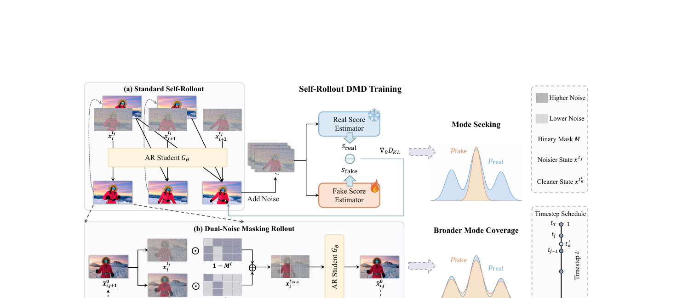
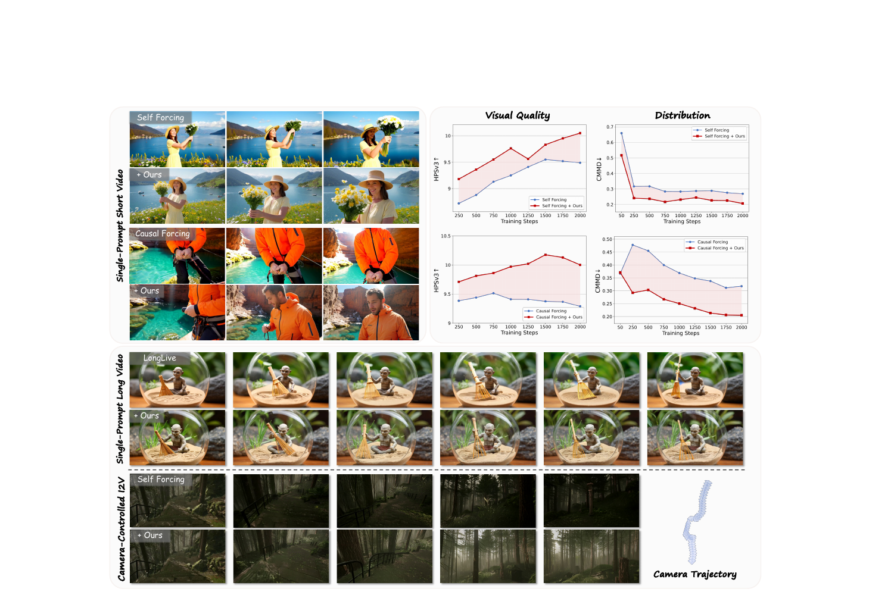
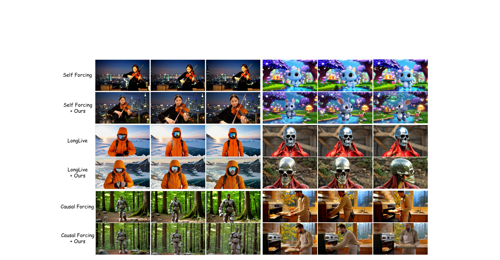

# Mask Forcing: Improving Autoregressive Video Diffusion Distillation via Dual-Noise Masking Rollout

**论文**: [arXiv 2609.09123](https://arxiv.org/abs/2609.09123)  
**项目页**: [alicezrzhao.github.io/mask_forcing](https://alicezrzhao.github.io/mask_forcing/)  
**代码**: 暂未开源  
**作者**: Zhuoran Zhao, Shengju Qian, Tongtong Liang, Xianghao Kong 等（HKUST / LIGHTSPEED / UCSD）  
**时间**: 2026-09-08

---

## 1. 一句话定位

在 AR 视频扩散蒸馏（DMD self-rollout）过程中，向每步 rollout 输入注入随机掩码选出的低噪声 token，使学生分布覆盖教师更多模式，同时降低 rollout 误差累积，无需真实视频数据和额外训练阶段。

---

## 2. 要解决的问题

AR 视频扩散模型通过 Distribution Matching Distillation（DMD）将双向多步教师压缩为因果少步学生。主流方法（Self Forcing、Causal Forcing、LongLive）在 self-rollout 训练中暴露两个问题：

1. **Mode Collapse（模式坍塌）**：DMD 使用 reverse KL 目标，其 mode-seeking 特性令学生分布集中在教师高密度区域，导致生成视频过饱和、过平滑，视觉多样性差。
2. **Error Accumulation（误差累积）**：DMD 只对完整 rollout 计算损失，中间步骤无显式梯度信号；每步预测误差通过 KV cache 向后传播，越到后面 chunk 质量越差。

解决这两个问题的已有方案要么需要真实数据（DMD2、DFD），要么需要额外训练阶段（Astrolabe RL），成本高且引入新的超参。

---

## 3. 与前作的关系

| 方法 | 核心思路 | Mask Forcing 对比 |
|------|---------|-----------------|
| Teacher Forcing | 以真实帧为历史条件 | 训练-推理不一致（exposure bias） |
| Diffusion Forcing | 每帧独立噪声 | 缓解分布偏移，但不对齐训练与推理 |
| Self Forcing | self-rollout + DMD loss | 对齐训练/推理，但 mode collapse |
| Causal Forcing | ODE 初始化的 AR 教师 | 同上 |
| LongLive | frame sink + streaming 长视频 | 同上 |
| DMD2 / DFD | GAN loss / 真实数据 | 需额外数据和预训练 |
| rCM / DistillAlign | mode-covering + mode-seeking | 仍有过饱和风险 |
| **Mask Forcing** | 扰动 self-rollout 轨迹 | **无需真实数据，plug-in 兼容已有方法** |

---

## 4. 核心方法：Dual-Noise Masking Rollout

### 4.1 背景：Standard Self-Rollout DMD

AR 视频模型把视频表示为 F 个 chunk，`x = (x_1, ..., x_F)`。flow-matching 中 noisy chunk 定义为

$$
x_i^t = (1 - t)\,x_i^0 + t\,\epsilon,\quad \epsilon \sim \mathcal{N}(0, I)
$$

在 self-rollout 的第 j 个去噪步（时间戳 `t_j`），学生 `G_θ` 从 noisy chunk 预测 clean estimate：

$$
\hat{x}_{i,j}^0 = G_\theta\!\left(x_i^{t_j} \mid x_{<i},\, c,\, t_j\right)
$$

DMD 梯度来自 real/fake score 差值：

$$
\nabla_\theta \mathcal{L}_\text{DMD} = \mathbb{E}\!\left[-(s_\text{real}(x_t, t) - s_\text{fake}(x_t, t))\,\frac{dG}{d\theta}\right]
$$

Reverse KL 的 mode-seeking 特性使学生专注高概率区域，忽视教师多模态分布的低密度部分。

### 4.2 Dual-Noise Masking Rollout 步骤

在每个去噪步 j，Mask Forcing 额外采样一个**更低噪声水平** `t'_k`：

$$
\ell_j = \max\!\left(t_\text{min},\; t_j - \frac{\Delta}{N_t}\right)
$$

$$
t'_k \sim \text{Uniform}\!\left([\ell_j,\, t_j]\right)
$$

其中 `N_t = 1000` 为训练时间戳总数，`Δ` 为时间戳窗口大小（默认 250），`t_min` 防止 cleaner signal 退化为干净图像。

用同一个噪声 `ε_j ~ N(0,I)` 从上一步预测 `x̂^0_{i,j+1}` 生成两个噪声水平的样本：

$$
x_i^{t'_k} = (1 - t'_k)\,\hat{x}_{i,j+1}^0 + t'_k\,\epsilon_j \quad\text{(cleaner)}
$$

$$
x_i^{t_j} = (1 - t_j)\,\hat{x}_{i,j+1}^0 + t_j\,\epsilon_j \quad\text{(noisier)}
$$

对 chunk i 采样二值掩码 `M^i`（masking ratio α），掩码**在帧之间独立采样（per-frame），在 chunk 之间重新采样（per-chunk）**：

$$
x_i^{t_\text{mix}} = M^i \odot x_i^{t'_k} + (1 - M^i) \odot x_i^{t_j}
$$

学生以 dual-noise 输入在原始时间戳 `t_j` 进行去噪：

$$
\hat{x}_{i,j}^0 = G_\theta\!\left(x_i^{t_\text{mix}} \mid x_{<i},\, c,\, t_j\right)
$$

注意：模型接收的调度时间戳仍是 `t_j`，而输入有部分 token 处于 `t'_k < t_j` 的更低噪声，形成"局部噪声水平不一致"，迫使模型利用 cleaner token 做上下文去噪 noisier token。

> **Fig 2 逐段解读**：
>
> **(a) Standard Self-Rollout（上半部分）**——三个 chunk（`x_i^{t_j}`, `x_{i+1}^{t_j}`, `x_{i+2}^{t_j}`）依次送入 AR Student `G_θ`，生成结果加噪后继续传递。完成 rollout 后计算 DMD 梯度（real score - fake score → `∇θD_KL`）。右侧 Mode Seeking 分布图：`p_fake`（蓝）集中于 `p_real`（橙）的高密度峰，低密度区域被完全忽略——这就是 mode collapse 根源。
>
> **(b) Dual-Noise Masking Rollout（下半部分）**——从前一步预测 `x̂^0_{i,j+1}` 出发，同时生成 `x_i^{t_j}`（darker，原始噪声）和 `x_i^{t'_k}`（lighter，更低噪声），通过二值掩码 `M^i`（棋盘格图案）混合为 `x_i^{t_mix}`，送入 `G_θ` 得到新的 `x̂^0_{i,j}`。右侧 Broader Mode Coverage：扰动后 `p_fake` 覆盖 `p_real` 的多个峰，有效对抗 mode collapse。右上角时间戳调度图：竖轴是时间戳 t（0=clean, 1=pure noise），在步 j 时额外采样 `t'_k` 落在 `[t_{j-1}, t_j]` 区间内（明显低于 `t_j`）。

### 4.3 为什么有效：KL 分解视角

设掩码轨迹 `V = {(M_r, t'_{k,r})}_{r=1}^R`，掩码对应的 marginal 分布为 `q̄_{θ,τ}`，Appendix 证明：

$$
D_\text{KL}(\bar{q}_{\theta,\tau} \| p_\tau) = \mathbb{E}_V\!\left[D_\text{KL}(q_{\theta,\tau}^V \| p_\tau)\right] - I_\theta(V;\, X_\tau \mid c)
$$

含义：marginal 分布的 reverse KL = 各轨迹条件 KL 的均值 − 互信息 `I_θ`。当不同掩码轨迹诱导出不同的条件分布时（`I_θ > 0`），marginal 的 reverse KL 严格小于各轨迹 KL 的均值，说明**混合后的分布比单一轨迹能覆盖更多教师模式**，即使每条轨迹自身仍有 mode-seeking 特性。

### 4.4 掩码方案选择

空间轴（同一 chunk 内不同帧）和时间轴（不同 chunk 之间）各有两个选项：

| 空间 | 时间 | HPSv3 | Dynamic. |
|------|------|-------|---------|
| shared（全帧共用一个 M） | per-rollout（整个 rollout 固定 M） | 10.12 | 56 |
| shared | per-chunk（每个 chunk 重采样 M） | 9.64 | 81 |
| per-frame（每帧独立 M） | per-rollout | 10.03 | 53 |
| **per-frame** | **per-chunk** | **9.84** | **82** |
| per-frame | per-step（每步重采样 M） | 9.93 | 74 |

per-frame spatial + per-chunk temporal 为最优，兼顾视觉质量与运动多样性。

---

## 5. 关键超参

| 超参 | 默认值 | 说明 |
|------|--------|------|
| mask ratio α | 0.2 | cleaner token 占比；<0.1 扰动不足，>0.4 运动多样性下降 |
| 时间戳窗口 Δ | 250（/1000） | cleaner timestep 的采样范围；太小扰动弱，太大偏离教师 |
| t_min | schedule index 20 | 防止 cleaner signal 退化为完全干净 |
| 去噪步数 T | 4 | self-rollout 总步数 |
| 分辨率 | 832×480，81 帧/chunk=3 latent frames | |
| 训练步数 | ~1500 steps | 约 14 小时，8×GPU |
| Student | Wan2.1-T2V-1.3B | ODE 蒸馏初始化 |
| Teacher | Wan2.1-T2V-14B | 冻结，提供 real score |
| 训练数据 | VidProM dataset | 无需真实视频标注 |

---

## 6. 实验结果

### 6.1 100-prompt benchmark（chunk-wise 设置）

| Method | HPSv3↑ | Vision↑ | Instruct↑ | MQ↑ | Dynamic↑ | Total↑ |
|--------|--------|---------|----------|-----|---------|-------|
| Self Forcing | 9.55 | 10.10 | 38.50 | 15.88 | 70 | 81.89 |
| + Ours | **9.84** | **11.37** | **45.03** | **20.49** | **82** | **82.61** |
| Causal Forcing | 9.37 | 10.36 | 40.41 | 17.23 | 76 | 82.67 |
| + Ours | **10.17** | **11.58** | **46.30** | **21.54** | **82** | **82.76** |
| LongLive | 9.11 | 10.77 | 42.48 | 21.20 | 76 | 82.02 |
| + Ours | **10.14** | **11.00** | **42.65** | **22.34** | 69 | **82.75** |

三个 baseline 上 Mask Forcing 均提升 HPSv3 和 Instruction following；Motion Quality 普遍提升；Dynamic Degree 仅 LongLive 有所下降（作者指出 VBench 的 optical flow 指标在 drift 情况下可能给出误导性高分）。

### 6.2 长视频（30s，MovieGen & VBench-Long）

| Method | HPSv3↑ | Vision↑ | Instruct↑ | MQ↑ | Dynamic↑ |
|--------|--------|---------|----------|-----|---------|
| LongLive | 8.44 | 14.31 | 62.04 | 18.84 | 70 |
| + Ours | **9.11** | **14.93** | **66.02** | **19.37** | 64 |

### 6.3 人类评估

pairwise 偏好（24 评审）：

- vs. Self Forcing：80% 偏好 Ours
- vs. Causal Forcing：79% 偏好 Ours
- vs. LongLive：83% 偏好 Ours
- vs. LongLive（长视频）：72% 偏好 Ours

### 6.4 收敛速度

CMMD（CLIP）和 VMMD（V-JEPA2）衡量分布对齐，Mask Forcing 在所有 baseline 上均加速收敛，分布偏移（红线）显著低于基线（蓝线）且更快下降。

---

## 7. 可视化

> **Fig 1 逐段解读**：
>
> **Single-Prompt Short Video（上两组）**——左侧展示帧序列，右侧是收敛曲线。行一 Self Forcing：女子捧花、水草背景色彩过于鲜艳，+ Ours 后色调自然，细节更丰富。行二 Causal Forcing：橙色夹克人物背景过饱和蓝绿色，+ Ours 后色彩层次更真实。收敛曲线：HPSv3（越高越好）红线（Ours）迅速超过蓝线；CMMD（越低越好）红线显著低于蓝线——说明 Mask Forcing 视觉质量更高同时分布更接近教师。
>
> **Single-Prompt Long Video（中间组）**——LongLive 生成的小地精棕色背景在后半段逐渐失真，+ Ours 保持细节（沙盘、炊帚纹理）更稳定。
>
> **Camera-Controlled I2V（底部组）**——给定森林参考帧 + 相机轨迹，Self Forcing 生成的视频整体偏暗、树干细节缺失；+ Ours 恢复逼真光影和植被纹理。

> **Fig 3 逐行对比**（chunk-wise，100-prompt benchmark）：
>
> - **Self Forcing vs + Ours（行1/2）**：小提琴手视频，Self Forcing 脸部扁平、城市夜景过曝；+ Ours 皮肤细节、服饰材质、夜景层次均改善。动画兔子，Self Forcing 色块硬边明显；+ Ours 毛发和环境光更柔和。
> - **LongLive vs + Ours（行3/4）**：橙色户外服场景，LongLive 缺少高频纹理；+ Ours 织物纹理、山地背景更立体。骷髅斗篷，LongLive 金属质感平淡；+ Ours 高光和阴影更真实。
> - **Causal Forcing vs + Ours（行5/6）**：机甲战士森林，Causal Forcing 过饱和绿色；+ Ours 色彩还原准确，林间光线自然。厨房烹饪，Causal Forcing 细节丢失；+ Ours 保留炊具纹理和环境光。

---

## 8. 争议与权衡

1. **Dynamic Degree 下降**：LongLive + Ours 在 VBench 的 Dynamic Degree 从 70 降至 64。作者认为 VBench 用 RAFT 光流衡量运动幅度，drift 诱发的"假动感"反而得分高——但这是评估指标的局限，非方法缺陷。Mask Forcing 生成的运动更稳定但幅度保守。
2. **掩码比例 trade-off**：α=0.4～0.5 时 HPSv3 反而更高（10.15/10.17），但 Dynamic Degree 跌至 57/44。α=0.2 是平衡点，不同任务可能需要调整。
3. **时间戳窗口 Δ=600 时 Dynamic Degree 下降**：过大的窗口使 cleaner token 噪声水平与原始相差过大，模型过度依赖 cleaner 信号，限制运动探索。
4. **无代码开源**：暂无官方实现，复现需依赖细节（掩码采样顺序、exit step s 的选择等）。

---

## 9. 一句话总结

Mask Forcing 是一个 plug-in 式的 rollout 扰动策略：在 AR 视频 DMD self-rollout 的每步去噪输入中，随机注入低噪声 token，既分散学生轨迹覆盖教师更多模式，又利用 cleaner token 作为上下文辅助去噪，无需额外数据或训练阶段即可稳定提升 Self Forcing / Causal Forcing / LongLive 等主流 AR 视频蒸馏方法的视觉质量。

---

## Q&A

