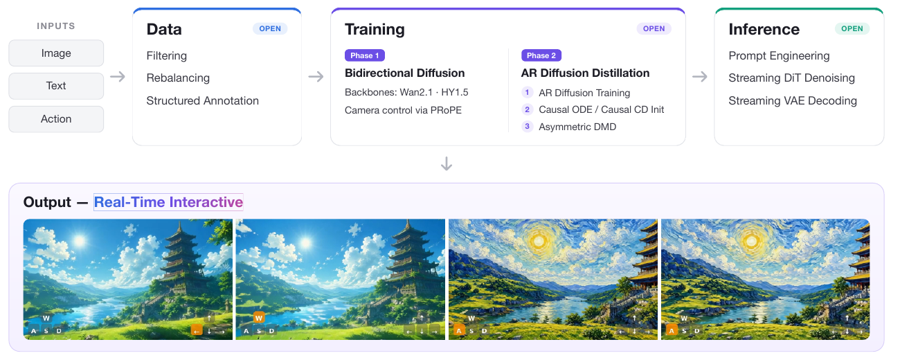
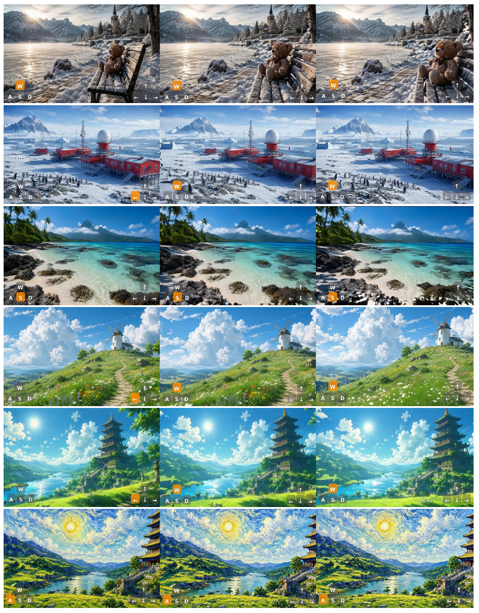

# minWM: A Full-Stack Open-Source Framework for Real-Time Interactive Video World Models

> Min Zhao 等 12 人 · 生数科技 ShengShu + 清华 + 人大 + HKUST + UT-Austin  
> arXiv:2605.30263v1 · 2026-05-28 · 13 页 technical report(无 appendix)· [github](https://github.com/shengshu-ai/minWM)

---

## 1. 一句话定位

⚠️ **先说清定位:这是一份工程配方发布,不是一篇方法论文。**

minWM 把「双向 T2V/TI2V 基座 → 相机可控 → 少步自回归实时世界模型」这条**已有的**多阶段流水线打包成开源框架,在 Wan2.1-T2V-1.3B 和 HY1.5-TI2V-8B 上各跑通一遍,放出**全阶段中间 checkpoint**、数据与脚本。

**方法本身没有新算法**:PRoPE 来自 [26]、Causal Forcing 来自 [23]、Causal Forcing++ 来自 [24]、asymmetric DMD 来自 DMD/Self-Forcing 那条线——**而 [23][24] 都是本文作者自己的前作**。论文自己的定位也很坦白:

> "Instead of releasing a single trained checkpoint, minWM provides a reproducible end-to-end pipeline…"
> README:"A full-stack framework and tutorial for **newcomers**, rather than a specific model."

📌 **全文零定量指标(无 FVD/FID/VBench/RotErr)、零 baseline 对比。** 唯一的表是延迟表。读这篇的正确姿势是**当配方看**,而不是当结果看。

---

## 2. 要解决的问题

论文认定的缺陷**不是算法缺陷,而是工程碎片化**:

> "a high-quality offline video generator is not yet an interactive world model."

交互式世界模型要三样东西:**causal rollout**(因果自回归)、**响应用户动作**(相机轨迹)、**低延迟**。现有 AR diffusion distillation 工作已经能做到,但——

> "these techniques remain **scattered across separate pipelines**. As a result, building an interactive video world model still requires substantial effort in data construction, controllable fine-tuning, AR training, few-step distillation, post-training alignment, and inference. **A unified, reproducible, and extensible framework for this full pipeline is still missing.**"

顺带在方法章节点了两个技术痛点:

1. **Stage 1(teacher-forcing AR)产物的两个毛病**:"(1) 需要多步生成,延迟高;(2) 由于自回归引入的 exposure bias,质量仍不如双向扩散模型。"
2. **Stage 2(a) causal ODE 的工程痛点**:"ODE distillation requires generating offline ODE data, which is both time-consuming and storage-intensive." —— 这是用 causal CD 替换它的动机。

---

## 3. 流水线总览

> **Fig 1 逐块解读**:横向流程图,左到右四块 + 底部输出条。
>
> - **最左 INPUTS**:三个灰色圆角矩形竖排 `Image` / `Text` / `Action`。
> - **① Data**(蓝色顶边,右上角浅紫 `OPEN` 标签):`Filtering` / `Rebalancing` / `Structured Annotation`。
> - **② Training**(紫色顶边,`OPEN`):左列 `Phase 1` **Bidirectional Diffusion**(Backbones: Wan2.1 · HY1.5;Camera control via PRoPE);右列 `Phase 2` **AR Diffusion Distillation**,三个带序号的子步 `①AR Diffusion Training` / `②Causal ODE / Causal CD Init` / `③Asymmetric DMD`。
> - **③ Inference**(绿色顶边,`OPEN`):`Prompt Engineering` / `Streaming DiT Denoising` / `Streaming VAE Decoding`。
> - **底部 Output — Real-Time Interactive**:横排 4 张 16:9 生成帧,左二是明亮动漫风的湖畔宝塔山谷,右二是**同一场景的梵高星空风**。每张左下角叠了 WASD 键位图标,橙色高亮表示当前动作(第 1 张 `←`,后三张 `W`)。
>
> ⚠️ **三块都打了 `OPEN` 标签,但至少两块名不副实**:`Filtering / Rebalancing / Structured Annotation` 在正文和仓库里**都找不到对应实现**;`Prompt Engineering` 同样找不到,而且**论文根本没有推理章节**,仓库 README 里 "Inference acceleration" 还标着 🚧 TBD。
>
> 📌 另外注意那些键位图标:它们是仓库脚本 `demos/overlay_keys.py` 根据**输入轨迹串**画上去的,**不是从生成结果测出来的相机位姿**——标示的是"指令",不是"模型真的做到了"。后面 Fig 2–5 全部如此。

### 3.1 Phase 1：PRoPE 相机注入

给定每帧的内参 `K_i` 和 world-to-camera 外参 `T_i^cw ∈ SE(3)`,构造**提升后的投影矩阵**:

$$
\widetilde{P}_i = \begin{bmatrix}[K_i\ \ 0]\,T_i^{cw}\\ e_4^{\top}\end{bmatrix} \in \mathbb{R}^{4\times 4}, \qquad e_4 = (0,0,0,1)^{\top}
$$

📌 **一个容易忽略的等价性**:因为 `T_i^cw` 的最后一行恒为 `(0,0,0,1)`,所以 `e_4ᵀ T_i^cw = e_4ᵀ`,上式等价于 `diag(K_i, 1)·T_i^cw`。`P̃_i` 的物理含义就是 **image ← world 变换**。

对属于第 `i(t)` 帧、空间坐标 `(x_t, y_t)` 的 token,论文给出的块对角变换是:

$$
D_t^{\mathrm{PRoPE}} = \begin{bmatrix}I_{d/8}\otimes\widetilde{P}_{i(t)} & 0\\ 0 & \begin{bmatrix}\mathrm{RoPE}_{d/4}(x_t) & 0\\ 0 & \mathrm{RoPE}_{d/4}(y_t)\end{bmatrix}\end{bmatrix}
$$

即 **`d/2` 编码相机 + `d/4` 编码 x + `d/4` 编码 y**,维度校验 `d/2 + d/4 + d/4 = d` ✓。

以 GTA 形式注入 self-attention:

$$
\mathrm{Attn}_{\mathrm{PRoPE}}(Q,K,V) = D^{\mathrm{PRoPE}} \odot \mathrm{Attn}\!\left((D^{\mathrm{PRoPE}})^{\top}\!\odot Q,\ (D^{\mathrm{PRoPE}})^{-1}\!\odot K,\ (D^{\mathrm{PRoPE}})^{-1}\!\odot V\right)
$$

**为什么这样能编码"相对相机"** —— 关键一步是 `q'ᵀ_{t₁} k'_{t₂} = q_{t₁}ᵀ (D_{t₁} D_{t₂}^{-1}) k_{t₂}`:**绝对位姿各自消不掉,但乘在一起只剩相对量**,其相机块是

$$
\widetilde{P}_{i(t_1)}\widetilde{P}^{-1}_{i(t_2)} = \begin{bmatrix}K_{i(t_1)}&0\\0&1\end{bmatrix} T^{cw}_{i(t_1)}\left(T^{cw}_{i(t_2)}\right)^{-1}\begin{bmatrix}K^{-1}_{i(t_2)}&0\\0&1\end{bmatrix}
$$

中间就是 **帧 t₂ → 帧 t₁ 的相对位姿**,两边的 `K` 块编码相对内参。

⚠️ **这个式子和论文对它的两句描述,都与开源实现不符——见 §6 的 ① ② ④,这是本文最严重的问题。**

### 3.2 Phase 2：三阶段 AR 蒸馏

**Stage 1 — AR diffusion training(teacher forcing)**
把 clean latent 与 noisy latent 拼接、用 causal mask 训练,即"干净历史前缀 + 带噪当前 chunk"。产物能自回归,但仍需多步且有 exposure bias。

**Stage 2(a) — causal ODE 初始化**(来自 Causal Forcing)
用 Stage 1 的 AR 模型离线跑大量 PF-ODE 轨迹,在预定义少步 timestep 集合上回归:

$$
\theta^{*} = \arg\min_{\theta}\ \mathbb{E}\Big[\big\|G_{\theta}(\boldsymbol{x}^{i}_{t},\,\boldsymbol{x}^{<i}_{\mathrm{gt}},\,t) - \boldsymbol{x}^{i}_{0}\big\|^{2}\Big]
$$

注意 `x^{<i}_gt` 是**真实数据构成的历史前缀**(teacher forcing,不是自回滚)。代码里少步集合是 `{1000, 750, 500, 250}`。

**Stage 2(b) — causal CD 初始化**(来自 Causal Forcing++)
为省掉离线 ODE 数据的时间与存储,改用因果一致性蒸馏:

$$
\theta^{*} = \arg\min_{\theta}\ \mathbb{E}\Big[w(t)\, d\big(G_{\theta}(\boldsymbol{x}^{i}_{t},\boldsymbol{x}^{<i}_{\mathrm{gt}},t),\ G_{\theta^{-}}(\hat{\boldsymbol{x}}^{i}_{t-\Delta t},\boldsymbol{x}^{<i}_{\mathrm{gt}},t-\Delta t)\big)\Big]
$$

`θ⁻` 是 EMA + stop-gradient 的目标网络,`x̂^i_{t−Δt}` 由 AR teacher 走一步 ODE 得到。论文**只给结论不给证明**:"A model trained in this way is **equivalent** to one obtained via causal ODE distillation [23]."(引 [24])

**Stage 3 — asymmetric DMD**
Stage 2 的学生受限于 AR teacher 的质量上限,所以用**双向 teacher**(质量更高)来对齐分布——"asymmetric"指的就是**学生是 AR、teacher 是双向**。学生先 self-rollout 生成完整序列,再走标准 DMD 梯度:

$$
\nabla_{\theta}\mathbb{E}_{t}\big[D_{\mathrm{KL}}(p_{\theta,t} \Vert p_{\mathrm{data},t})\big] = -\mathbb{E}\Big[\big(s_{\mathrm{real}}(\tilde{\boldsymbol{x}}_t,t) - s_{\mathrm{fake}}(\tilde{\boldsymbol{x}}_t,t)\big)\frac{\partial\tilde{\boldsymbol{x}}}{\partial\theta}\Big]
$$

**相机条件贯穿三个 Stage**,而且 `s_real` 和 `s_fake` **都从 Phase 1 的相机可控双向模型初始化**,所以"all involved models are camera-controllable"。

---

## 4. 实验结果

### 4.1 延迟（Table 1，全文唯一的表）

单张 **A800**,**排除 VAE 相关时间**。

| Base model | Model type | First-frame latency (s) | Speedup |
|---|---|---|---|
| HY1.5 | Multi-step bidirectional | 771.041 | 1.00× |
| HY1.5 | Multi-step AR | 81.014 | 9.52× |
| **HY1.5** | **Few-step AR** | **3.446** | **223.75×** |
| Wan2.1 | Multi-step bidirectional | 269.055 | 1.00× |
| Wan2.1 | Multi-step AR | 28.651 | 9.39× |
| **Wan2.1** | **Few-step AR** | **1.137** | **236.64×** |

📌 **把这个头条数字拆开看**,它混合了两种完全不同的加速来源:

| 来源 | 倍数 | 说明 |
|---|---|---|
| AR 只需生成第一个 chunk vs 双向一次生成全序列 | **≈9.4×** | 论文自己承认这是"自然结果" |
| 4 步无 CFG vs 50 步 + CFG(100 NFE) | **≈25×** | 由 81.014/3.446 = 23.5、28.651/1.137 = 25.2 反推 |

⚠️ **而论文从头到尾没写多步 baseline 用多少步、有没有 CFG**——这两个数是从仓库(`50-step` 验证、`48-step CFG sampling` 生成 ODE 数据、推理 `--guidance_scale 1.0`)反推的。读者无法从论文本身验证 223× 这个数字。而且 **4 步学生不用 CFG、50 步 teacher 用 CFG**,这本身就是有利于学生的设置差异。

### 4.2 相机可控性（Fig 2，正文唯一的"结果图"）

> **Fig 2 解读**:6 行 × 3 列,每行是同一段 rollout 的三个时刻(时间从左到右递增),行与行是不同 prompt。每张图左下角叠 WASD 键位、右下角叠方向键,**橙色高亮 = 当前施加的动作**。
>
> ⚠️ **这张图没有任何对照组**——没有"未做相机训练的基座"列,也没有"Stage 2 产物"列。所以 caption 声称的"distillation 有效保留了基座的相机可控性"**其实没有被这张图证明**,它只证明了"最终模型能动"。
>
> ⚠️ 另外,如前所述,键位图标画的是**输入指令**而非测出来的位姿。要验证"模型是否真的按指令动",需要把生成视频重新跟踪出相机轨迹再和指令对比(就像 [ReWorld](../reworld/analysis.md) 用 ViPE 做的那样)——**本文没有做**。

### 4.3 三项消融（全部只有图、零数字、每项 1 个 prompt）

**① 训练数据的相机轨迹质量**——这是全文最有价值的发现。

> **Fig 3 三条对比**:三条图带对应三种数据来源。
>
> | 设置 | 数据 | 位姿来源 | 结论 |
> |---|---|---|---|
> | **(a)** | SpatialVid | **perception 估计** | **失败**——HY1.5 和 Wan2.1 **都**没学会可靠的相机可控;"即使加了额外数据过滤仍然做不到" |
> | **(b)** | DL3DV 3D 重建后重渲染 | **真值轨迹** | 成功(论文的主力/内部路线) |
> | **(c)** | OpenVid 图 + WorldPlay 生成 | **指定轨迹(等价真值)** | 成功(**开源版走的是这条**) |
>
> 核心论断:**"we argue that ground-truth camera poses are crucial."**
>
> 📌 作者的免责声明写得很克制,值得原样引:"This result should be interpreted as a **limitation of our current SpatialVid-based training attempt** rather than a conclusion that SpatialVid is unsuitable for this task."

**② 可控性所需的训练步数**(HY1.5 双向阶段)

> | 步数 | 论文结论 |
> |---|---|
> | 1–2 K | "remains completely uncontrollable" |
> | ~5 K | "begins to exhibit camera controllability"(但不稳定) |
> | 8 K | "achieves strong controllability" |
>
> ⚠️ **(b) 和 (c) 肉眼几乎看不出差别**,而结论却是"开始出现"vs"强可控"。单 prompt、无指标的定性对比支撑不了这个区分。
>
> ⚠️ **更奇怪的是与 §5 脚注的冲突**:Stage 1 是从 **5K 步**(即"刚开始有可控性、仍不稳定")的 checkpoint 初始化的,而 8K 的强可控模型只用作 Stage 3 的 `s_real`/`s_fake`。**论文没有解释为什么不用 8K 模型初始化 Stage 1**——这可能只是流程上先跑到 5K 就开工了,但对一篇宣称"reproducible recipe"的文章,这属于说不清的地方。

**③ 最小 batch size**(Wan2.1 双向阶段)

> | batch size | 论文结论 |
> |---|---|
> | < 4 | "often fails to learn camera controllability" |
> | 8 | "improves substantially, but remains somewhat unstable" |
> | 16 | "the full training pipeline can be successfully completed with high controllability" |
>
> 目的是"facilitate research under limited computational budgets"。
>
> ⚠️ 三个问题:**(a) 与 (b) 肉眼差别也很小**;**"smaller than 4" 不是一个具体设置**(1?2?3?论文没说);而且**开源默认配置是 `total_batch_size: 8`——正好落在论文自己判定为"不稳定"的档位**。

---

## 5. 关键配置

**论文正文给的(Sec 3.1)**:

| 项 | Wan2.1-T2V-1.3B | HY1.5-TI2V-8B |
|---|---|---|
| 分辨率 / 帧数 | 480×832 / **77 帧** | 480×832 / **77 帧** |
| AR chunk size | 4 latent frames | 4 latent frames |
| 少步蒸馏步数 | 4 | 4 |
| batch size | 32 | 32 |
| learning rate | 2e-6 | 1e-5 |
| Phase 1 双向 | 5K 步 | 8K 步 |
| Stage 1(AR) | 4K 步 | 4K 步 |
| Stage 2(ODE/CD) | 2K 步 | 1.5K 步 |
| Stage 3(DMD) | **200 步** | **500 步** |

**论文完全没写的**:训练用什么 GPU、多少张、训练时长;多步 baseline 的步数与 CFG;数据集规模;**任何定量指标**;**任何 baseline 对比**;输出 fps;可持续 rollout 长度;显存占用。

**仓库补齐的关键实情**:

- **相机动作是离散的**:每步固定 `0.08` 归一化单位平移 或 `3.0°` 旋转,每 latent frame 一步。10 个 primitive(`w/s/a/d/u/dn/j/l/i/k`)。
- **内参硬编码为常数** `fx=0.5050505, fy=0.89786756, cx=0.5, cy=0.5`,全数据集全帧不变;PRoPE 代码还把 `cx, cy` 强制置 0。
- **开源数据集 19,823 条,只覆盖 435 种轨迹**,每条各段步数之和恒为 19。最常见轨迹 `"a-8, d-11"`(479 条)。
- 维护者在 issue 里承认 `0.08` > "It's an arbitrary / normalized unit, not physical… the translation magnitude doesn't reliably map to any canonical physical distance."
- **推理侧只有离线批处理脚本**,仓库里**没有 gradio / server / 实时交互 demo / 延迟 benchmark**。

---

## 6. 争议与权衡

**① 【最严重】论文唯一的方法公式与开源实现不符,且已被 issue 证实。**

论文的 `D_t^PRoPE` 是 **[d/2 相机 | d/4 RoPE-x | d/4 RoPE-y]** 三块划分(这是原始 PRoPE 论文的做法)。而代码 `_prepare_apply_fns_all_dim`(**函数名里就写着 `all_dim`**)把**整个 head_dim 都用 4×4 投影矩阵平铺**,**完全没有 RoPE-x / RoPE-y 两块**(`coeffs_x/coeffs_y` 参数被接收但未使用)。Wan 侧同构。

**GitHub issue #10 已提出并 closed**,维护者回复 "We followed the implementation in HY-WorldPlay",提问者建议"那论文里的公式应该更新以对齐实现"——**论文至今(v1)未修正**。

**② 【严重】"保留原始 self-attention 结构"在代码里不成立,而且新增了大量参数。**

论文说 PRoPE "while **preserving the original self-attention generative structure**"。代码实际是**双分支 attention**:每个 block 同时算原生 RoPE 一路和 PRoPE 一路,各自过 output projection 后**相加**,其中 PRoPE 那路的投影是**新增的零初始化 `nn.Linear`**。

代价(论文只字未提):

| | 新增参数 | 来源 |
|---|---|---|
| HY1.5 | **+226.6 M** | 54 × (2048² + 2048) = 226,603,008 |
| Wan2.1-1.3B | **+70.8 M**(约 +5%) | 30 × (1536² + 1536) |

HY1.5 那个数字用 HF 权重体积反推是 **226,606,220**,与架构推算只差 3,212 B(safetensors header)——**完全吻合**。而且**图像自注意力要算两遍**。读者看论文会以为 PRoPE 是零参数、零额外算力的位置编码替换。

**③ 标题写 "Real-Time",全文没有 fps,而已有数字反推出达不到实时。**

唯一的性能表只报 first-frame latency。按推理脚本 `--fps 16 --chunk_latent_frames 4`、77 帧 ↔ 20 latent frames 推算,第一个 chunk 解码出 13 个像素帧:

- HY1.5 few-step AR:13 / 3.446 s ≈ **3.8 fps**
- Wan2.1 few-step AR:13 / 1.137 s ≈ **11.4 fps**

**两者都低于 16 fps 的播放速率**,而且**后续 chunk 因 KV 变长只会更慢**。换 H100 或许能过线,但论文没测。

**④ 排除 VAE 时间是自利的。** Fig 1 把 "Streaming VAE Decoding" 列为 pipeline 的一部分,Table 1 却明说 "VAE-related time is excluded"。对一个宣称实时交互的系统,VAE 解码延迟是用户实际感知延迟的一部分。(仓库里有 `taehv.py`,说明作者知道 VAE 是瓶颈。)

**⑤ 可交互时长上限只有约 5 秒,论文完全没提。** issue #9 里用户生成 161 帧(10 s)出现严重崩坏,维护者回复:"when tuning the official HY1.5 to AR video generator, **we only trained it on 77 frames**. So if you want longer videos, you need Infity-RoPE / Deep Forcing etc. as training-free length extrapolation." —— 一个自称 "interactive world model" 的系统,**可交互时长上限约 4.8 秒**,这是最该被指出的落差。

**⑥ "fully open-source / reproducible" 有实质缺口。**

- **HY-TI2V 的权重是在 internal datasets 上训的**(issue #3 维护者确认),开源数据复现不出来。
- **论文主力数据路线(DL3DV 3D 重建 + 重渲染)的代码和数据都没开源**;开源版走的是另一条(WorldPlay 生成)。**所以论文里的结果和开源版不是同一批数据训出来的。**
- README 默认主推的 `HY15/Action2V/dmd` 注释是 "worldplay teacher",论文描述的纯 PRoPE 路径其实是被注释掉的 `dmd_ourbi`。权重体积差 **4,722,880 参数**,正好等于 `action_in` 那个离散动作 `TimestepEmbedder`——**论文叙述的 pipeline 与默认发布的主力权重不是同一条**。
- 训练卡数、卡时、总成本全部未披露。而从 `sp_size=8` / `gbs=32` 反推需要约 **256 张卡**,这与消融章节声称的"facilitate research under limited computational budgets"形成反差。
- `training_*.md` 里最关键的 `BEST_STEP=00x000 # selected by validation` 是个**占位符**——训到第几步要读者自己摸索。

**⑦ 论文与开源配置对不上三处。** HY1.5 Phase 1 的 lr:论文 `1e-5`、脚本 `2e-5`(**2 倍**);batch size:论文 32、开源默认 `total_batch_size: 8`;训练步数:论文 8K/4K/1.5K/500,脚本 `max_train_steps` 是 20000/200000/200000/4000。更要命的是 **issue #12 确认 `grad_accum_steps` 在 Wan camera trainer 里根本没实现**——意味着**论文的 batch-size 消融用当前开源代码复现不出来**(没法靠梯度累积在小集群上凑 batch)。

**⑧ "联合编码相对内参"在开源 pipeline 里是空转。** 内参写死为全局常数,PRoPE 代码还把 `cx, cy` 归零 → **相对内参项恒为单位阵**,这个卖点在开源配置下没有任何作用。

**⑨ "camera-controllable" 实质是 8–10 个固定速度的离散动作,不是自由相机控制。** 训练数据只覆盖 435 种轨迹、每条恒定 19 步、全由 2–4 段基本动作拼成,分布极窄。用 PRoPE(一个为任意连续相机设计的编码)去学一个 8-token 的离散动作集属于杀鸡用牛刀,同时也意味着**模型没有被验证过任意连续相机轨迹**。

**⑩ contribution #3 在仓库里是未完成项。** "支持适配已有世界模型如 HY-WorldPlay" 被列为独立贡献,但 README §2.2 明写 **🚧 [TBD]**,而且论文里**没有任何实验、图或数字**支撑这一条。

**⑪ 没有 related work,也没有与同类工作的任何比较。** Matrix-Game 2.0、Yan、Genie 3、Hunyuan-GameCraft-2 都在引用列表里,但**没有任何定性或定量对比**。对一篇声称提供"framework"的文章,缺少"与其他开源世界模型框架有何不同"的定位讨论。

**⑫ 引用错误**:`[7]` 是 **HunyuanVideo 1.0**(arXiv 2412.03603),但全文都用它来引 **HY1.5**;HY1.5 的正确出处从未被引。

**⑬ 正面:全阶段中间 checkpoint 的发布是真有价值的。** 这条流水线有 4–5 个阶段,每个阶段都可能训崩。放出**每个阶段的中间产物**,意味着别人可以从任意一环切入而不必从头跑——**这正是"framework 而非 model"定位的兑现方式**,也是这篇东西的主要实用价值。

**⑭ 正面:数据消融的结论有独立价值。** "感知估计的位姿训不出可靠的相机可控,必须要真值轨迹"——虽然只有定性证据,但这是一条会**直接影响别人怎么建数据**的经验,而且作者对结论的边界交代得很克制(明说是"我们当前尝试的局限",不是"SpatialVid 不行")。

---

## 7. 一句话总结

minWM 的价值不在方法(PRoPE、Causal Forcing、Causal Forcing++、asymmetric DMD 全是已有组件,后两个还是作者自己的前作),而在**把这条五阶段流水线跑通并把每一阶段的中间 checkpoint 都放出来**——对想入门"相机可控实时世界模型"的人,这省掉的是最难的那部分工程摸索;但**它的三个核心措辞都需要打折**:"Real-Time" 在单卡 A800 上反推只有 3.8–11.4 fps 且可交互时长上限约 5 秒、"fully open-source" 的主力数据路线和 HY 基座权重实际未开源、而论文唯一的方法公式与代码不符且已被 issue 证实未修正。

---

## Q&A

**Q: 这篇值不值得读?**

A: **当配方读值得,当论文读不值得。**

**值得的部分**:
- 一条完整、每阶段都有 checkpoint 的流水线,而且两个 backbone(cross-attention 的 Wan2.1、MMDiT 的 HY1.5)各跑通一遍,说明配方有一定架构通用性。
- 三条数据路线的成败对比(§4.3 ①),尤其"感知估计位姿训不出可控性"这条经验。
- 训练步数和 batch size 的下限经验(≥5K 步、≥16 batch)——虽然证据弱,但至少是个起点。

**不值得的部分**:
- 零定量指标、零 baseline 对比,所以**任何"效果好"的判断都无从验证**。
- 三项消融各只有 1 个 prompt 的 3 帧截图,其中 Fig 4(b) vs 4(c)、Fig 5(a) vs 5(b) 肉眼几乎无差别。
- 方法章节的公式与代码不符,照论文实现会做错。

📌 **实操建议**:直接读仓库的 `training_wan.md` / `training_hunyuan.md`,论文只用来理解 pipeline 的整体形状。

---

**Q: PRoPE 到底是怎么编码"相对相机"的?**

A: **靠 `q'ᵀk'` 里绝对位姿相乘后只剩相对量这一步。**

对 query 用 `D_{t₁}ᵀ`、对 key 用 `D_{t₂}^{-1}`,于是

`q'ᵀ_{t₁} k'_{t₂} = q_{t₁}ᵀ (D_{t₁} D_{t₂}^{-1}) k_{t₂}`

`D_{t₁}` 和 `D_{t₂}` 各自都是**绝对**位姿,消不掉;但它们乘在一起,相机块就变成

`diag(K_{t₁},1) · T^cw_{t₁} (T^cw_{t₂})^{-1} · diag(K^{-1}_{t₂},1)`

中间的 `T^cw_{t₁}(T^cw_{t₂})^{-1}` **正是帧 t₂ 到帧 t₁ 的相对位姿**,两边的 `K` 块编码相对内参。

📌 这个思路和 RoPE 的原理是一样的(RoPE 也是靠 `e^{iθ_m}·e^{-iθ_n} = e^{i(θ_m-θ_n)}` 把绝对位置变成相对位置),只是把标量相位换成了 SE(3) 投影矩阵。

⚠️ **但两点在开源实现里落空了**:① 代码根本没有 RoPE-x/y 那两块(整个 head_dim 都被投影矩阵平铺);② 内参是全局常数,所以"相对内参"项恒为单位阵、不起任何作用。

---

**Q: Causal ODE 和 Causal CD 该选哪个?**

A: **论文说等价,实际取舍在"离线数据成本 vs 实现复杂度"。**

| | Stage 2(a) causal ODE | Stage 2(b) causal CD |
|---|---|---|
| 需要离线 ODE 数据 | ✅ 需要(48-step CFG 采样生成) | ❌ 不需要 |
| 论文给的动机 | — | "ODE distillation requires generating offline ODE data, which is both **time-consuming and storage-intensive**" |
| 额外机制 | 无 | 需要 EMA 目标网络 `θ⁻`、每步多跑一次 teacher ODE |
| 论文断言 | — | "**equivalent** to one obtained via causal ODE distillation" |

⚠️ 两个问题:

1. **"等价"只给结论不给证明**,引的是作者自己的前作 [24]。
2. **论文没给任何数字说明 CD 到底省了多少**(省多少小时?多少 TB?)。而且仓库里 `MIN-Lab/minWM-data` **仍然发布了 `ODE_data/`**,说明 ODE 路线仍是主推之一——如果 CD 真的完全等价且更省,不该还需要发 ODE 数据。

**实操上**:如果你有存储和时间,ODE 路线更成熟(Causal Forcing 原始配方);如果卡在数据生成这一步,再考虑 CD。

---

**Q: 和仓库里的 ReWorld、Helios、LongLive 这些比,minWM 处在什么位置?**

A: **它不是同一类东西——那几篇是方法论文,这篇是配方发布。**

| | 定位 | 定量评测 | 与 baseline 对比 |
|---|---|---|---|
| **minWM**(本文) | **工程框架 / 复现配方** | ❌ 零指标 | ❌ 零对比 |
| [ReWorld](../reworld/analysis.md) | 方法(控制—记忆解耦) | ✅ VBench + 自定义 revisit 指标 | ✅ 6 个基线 |
| [Helios](../helios/analysis.md) | 方法(实时长视频) | ✅ | ✅ |
| [LongLive-2.0](../longlive2/analysis.md) | 方法 + 基础设施 | ✅ | ✅ |

**技术栈上 minWM 与 ReWorld 高度重叠**——都是"相机/动作可控 + AR 蒸馏 + DMD",都用 Wan/HY 系基座。差别在:

- **ReWorld 有明确的方法主张**(mixed per-head windows + random head routing 解耦控制与记忆,landmark bank 做有界记忆)并用消融证明;**minWM 没有方法主张**。
- **ReWorld 报了 RotErr / VBench / revisit SSIM 并与 6 个基线比**;**minWM 一个指标都没有**。
- 反过来,**minWM 放出了全阶段 checkpoint 和完整训练脚本**,ReWorld **代码权重都没放**。

📌 **所以这两篇正好互补**:想理解"为什么这么设计"读 ReWorld,想"照着跑一遍"用 minWM。

---

**Q: 想复现的话,最需要注意什么?**

A: **五个坑,按会不会浪费你时间排序。**

1. **别照论文的 `D_t^PRoPE` 公式实现**——代码是整个 head_dim 平铺投影矩阵,没有 RoPE-x/y 块。以仓库为准(issue #10 已确认)。
2. **算清参数量和算力**:PRoPE 是**双分支**,HY1.5 要多 226.6 M 参数、自注意力算两遍。论文完全没提,按论文估算显存会不够。
3. **开源默认 `total_batch_size: 8` 落在论文自称"不稳定"的档位**,而且 **`grad_accum_steps` 在 Wan camera trainer 里没实现**(issue #12 维护者已承认是 bug)——**没法靠梯度累积在小集群上凑到论文的 32**。
4. **`BEST_STEP=00x000` 是占位符**,训到第几步停需要自己按 validation 挑。脚本里的 `max_train_steps` 比论文实际步数大 2.5–133 倍,不能直接跑满。
5. **77 帧是硬上限**(约 4.8 s @16fps),超出会崩。要更长得自己上 Infinity-RoPE / Deep Forcing 这类免训练外推。

另外:**HY 的 TI2V 基座权重是 internal data 训的**,用开源数据复现不出论文里的那条路径;README 默认下载的 `dmd` 是 WorldPlay teacher 路径,不是论文描述的纯 PRoPE 路径(那个是被注释掉的 `dmd_ourbi`)。
