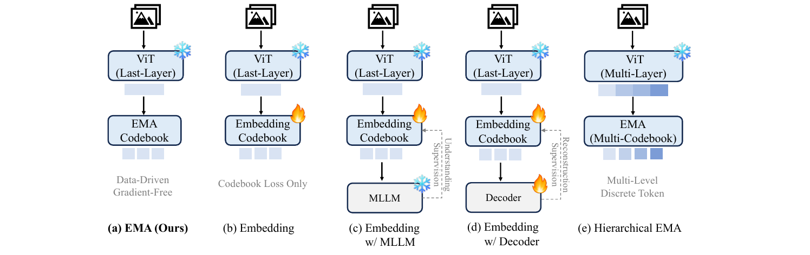
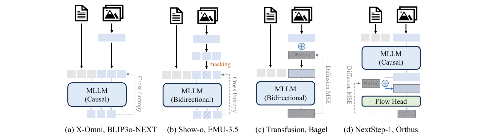
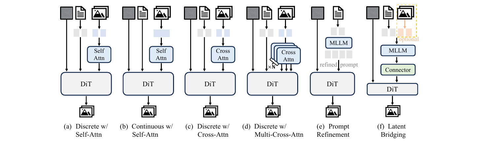
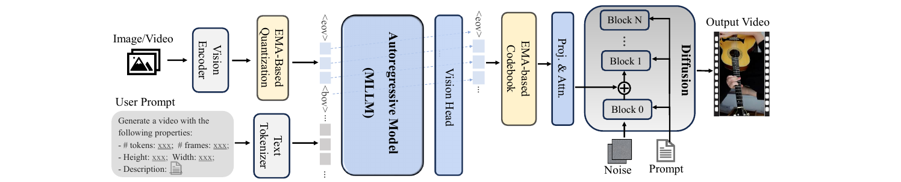

# Beyond Text Conditioning: A Systematic Study of MLLM-DiT Fusion for Video Generation

- **机构**:中科院 + Microsoft Research + 中山大学 + 浙大 + 西交 + 上海人工智能实验室
- **时间**:2026-08-14,arXiv:2608.14043v1
- **代码**:未开源(截至 2026-08)
- **最终系统名**:**BiVidGen**

---

## 1. 一句话定位

这不是一篇"提了个新架构"的论文,而是一篇**把 MLLM 与 DiT 的耦合方式拆成三个正交问题、逐个做受控实验的设计空间扫描报告**。三个问题是:**(1) 中间表示传什么、(2) MLLM 怎么生成它、(3) DiT 怎么吃它**。扫完之后给出一个组合解 BiVidGen = EMA 码本离散语义 token + causal AR 生成 + 多层 cross-attention 注入,在 VBench-Long 上把 Wan2.2-5B 微调基线从 74.88 抬到 80.77。

论文真正的价值在于**它把几条"看起来都合理"的路线明确判了死刑**,尤其是当前主流的 frozen-MLLM + learnable query + connector(latent bridging)—— 这条路在受控对比下**比什么都不加还差 6~7 分**。

---

## 2. 要解决的问题(动机)

DiT 已经是高保真视频生成的统治性范式,但它的**高层语义规划能力很弱**:给一段带因果关系的 prompt("咖啡慢慢变凉,蒸汽逐渐消散"),DiT 往往只渲染出"有咖啡有蒸汽",不体现"逐渐消散"这个时序因果。

图像侧已经证明 MLLM + diffusion decoder 的混合架构能补上这一块(MetaQuery、Qwen-Image、BLIP3o-Next、X-Omni)。但**视频侧的现有工作基本都把 MLLM 当成冻结的特征编码器**(UniVideo、UniVid、Omni-Video 都是冻 backbone + 轻量 adapter / learnable query),没有真正用起 MLLM 的**生成**能力。

于是核心问题变成:**除了文本条件,MLLM 到底该以什么形式、用什么机制、在哪一层介入 DiT?**

这三个问题是**递进依赖**的 —— 先定表示形式,才能定生成机制,才能定注入方式。论文按这个顺序组织全部实验。

---

## 3. 与前作的关系

| 范式 | 代表工作 | MLLM 角色 | 本文判断 |
|---|---|---|---|
| Integrated diffusion head | Transfusion、Orthus、JanusFlow、Emu3.5、Bagel、Show-o2 | AR backbone 内置扩散头 | 作为 Fig 2 的对比变体扫过 |
| External diffusion + frozen MLLM | MetaQuery、Open-Uni | 冻结,learnable query 抽条件 | **受控对比下劣于基线** |
| External diffusion + hidden state | Qwen-Image | 直接用 MLLM 输出的 text hidden state | 属于隐式 latent,未单列 |
| **Retrain MLLM 生成语义 token** | BLIP3o-Next、X-Omni、Tong et al. 2026 | 重训 MLLM 显式产 visual token | **本文所属阵营** |
| 视频侧统一模型 | UniVideo、UniVid、Omni-Video | 冻 MLLM + adapter/query | 本文的直接靶子 |

**Incremental claim**:前人在这条路上"直接选一个设计就开跑",本文**把设计空间穷举成 5(量化)× 4(生成机制)× 6(注入方式)三组受控实验**,并给出每一组的胜出者和失败原因。这是这篇论文唯一也是全部的贡献 —— 它不宣称架构创新。

---

## 4. 核心算法 / 方法

### 4.1 问题一:中间表示传什么

给定 prompt `T`,标准 DiT 直接建模 `p(X | T)`。本文插入一个中间表示 `D`:

$$
D \sim p_\phi(D \mid T), \qquad X \sim p_\theta(X \mid D, T)
$$

`D` 有三类候选:自然语言(prompt refinement)、隐式 latent token、**显式 visual token**。本文聚焦第三类,并进一步问:visual token 该是连续的还是离散的、离散化怎么做。

> **Fig 1 逐面板解读**:五个面板共享同一个前半段 —— 输入图像/视频过一个**冻结的 ViT**(雪花图标 = 参数不更新,来自 MLLM 自带的视觉编码器),得到连续视觉特征。差别全在后半段"怎么把连续特征变成离散码"。
>
> **(a) EMA(本文选择)**——ViT 取**最后一层**特征,送进 **EMA Codebook**。底部灰字标注 "Data-Driven / Gradient-Free":码本条目不参与反向传播,而是用指数滑动平均直接统计落到该码上的特征均值。**没有火焰图标 = 整条链路无可训练参数**,这是它和 (b)(c)(d) 的根本区别。
>
> **(b) Embedding**——码本换成可训练的 Embedding Codebook(火焰图标),只用标准 VQ 损失更新。这是 VQ-VAE 的经典做法,底部标注 "Codebook Loss Only" 说明它没有任何外部监督。
>
> **(c) Embedding w/ MLLM**——在 (b) 基础上挂一个**冻结的 MLLM**(雪花),右侧虚线箭头标 "Understanding Supervision":让 MLLM 从量化后的特征还原出配对文本,用这个理解损失反向修正码本。动机是"码本要保留语义"。
>
> **(d) Embedding w/ Decoder**——把 (c) 的 MLLM 换成**可训练的 Decoder**(火焰),虚线标 "Reconstruction Supervision":要求从量化特征重建原始像素。动机是"码本要保留细节"。
>
> **(e) Hierarchical EMA**——ViT 改成 **Multi-Layer** 取特征(注意顶部特征条从浅到深有颜色深浅渐变),每层配一个独立码本,产出 "Multi-Level Discrete Token"。灵感来自 Qwen3-VL 的层级视觉特征。
>
> **设计动机对比**:(b)(c)(d) 都在问"码本该被什么信号训练",而 (a) 直接跳出这个框架 —— **不训练码本**。(e) 则是在问"该量化哪一层"。论文的实验结论是前一条路(不训练)赢,后一条路(多层)在生成任务上反而输。

**EMA 更新规则**(第 `n` 个码,第 `i` 步):

$$
\mathbf{s}_n^{(i)} = \mu \mathbf{s}_n^{(i-1)} + (1-\mu)\!\!\sum_{k:\, d_k=n}\!\! \mathbf{C}_k, \qquad
c_n^{(i)} = \mu c_n^{(i-1)} + (1-\mu)\bigl|\{k : d_k=n\}\bigr|
$$

$$
\mathbf{e}_n = \frac{\mathbf{s}_n^{(i)}}{c_n^{(i)} + \delta}
$$

其中 `C_k` 是第 `k` 个连续视觉特征,`d_k = argmin_n ||C_k - e_n||_2` 是它的最近邻码索引,`μ` 是衰减因子,`δ` 是数值稳定小量。**分子累积特征和、分母累积计数,相除就是该码的滑动平均质心** —— 纯统计,不碰梯度。

作为对照,可训练码本用标准 VQ 目标:

$$
\mathcal{L}_{\mathrm{VQ}} = \sum_k \bigl\lVert \mathrm{sg}[\mathbf{C}_k] - \mathbf{D}_k \bigr\rVert_2^2 + \beta \bigl\lVert \mathbf{C}_k - \mathrm{sg}[\mathbf{D}_k] \bigr\rVert_2^2
$$

两个可选辅助监督:

$$
\mathcal{L}_{\mathrm{MLLM}} = -\sum_{j=1}^{M} \log p_\psi(y_j \mid y_{<j}, \mathbf{D}), \qquad
\mathcal{L}_{\mathrm{rec}} = \bigl\lVert g_\omega(\mathbf{D}) - X \bigr\rVert_2^2
$$

**Table 2 — 码本内禀性质**(这张表是选 EMA 的直接依据):

| 码本 | Entropy↑ | Active Ratio↑ | Top-10 Ratio↓ | Quantize Error↓ |
|---|---|---|---|---|
| Embedding | 0.321 | 0.052 | 0.704 | 0.551 |
| Embedding + Decoder | 0.641 | 0.458 | 0.243 | 0.586 |
| Embedding + LLM | 0.797 | **0.974** | 0.186 | 0.938 |
| **EMA** | **0.812** | 0.841 | **0.146** | **0.130** |

📌 **这张表最值得看的是 Embedding + LLM 那一行的自相矛盾**:它的 active ratio 高达 0.974(码本几乎全被用上),但 quantize error 是全场最差的 0.938。说明**理解监督把码本推向了"能还原文本"的方向,而不是"能还原特征"的方向** —— 码是活跃的,但离原特征很远。EMA 则同时拿下最低量化误差(0.130,比第二名低 4 倍)和最高熵,因为它压根不引入任何与重建无关的梯度,码本永远追着特征分布走。

### 4.2 问题二:MLLM 怎么生成它

> **Fig 2 逐面板解读**:四个面板都是"文本 + 图像/视频 → MLLM → 视觉输出",差别在**注意力类型**和**视觉表示的连续/离散**两个维度。虚线箭头统一表示损失回传路径。
>
> **(a) X-Omni / BLIP3o-NEXT 型**——MLLM 是 **Causal**。文本 token(灰)和视觉 token(蓝)拼成一条统一序列,视觉部分同样走 next-token prediction,右侧虚线标 **Cross Entropy**。这是"把图像当外语"的最纯粹形式,也是本文最终采用的方案。
>
> **(b) Show-o / EMU-3.5 型**——MLLM 是 **Bidirectional**。视觉 token 上做随机 **masking**(橙色标注,图中斜纹方块即被遮位置),模型预测被遮 token,仍用 Cross Entropy。注意:遮的位置是随机选的但**跨帧保持一致**,这是为了让被遮内容在时间轴上对齐。
>
> **(c) Transfusion / Bagel 型**——视觉侧改成**连续**表示,先加噪(⊕ 与 `Noise_t` 方块),MLLM 双向注意力去噪,损失变成 **Diffusion MSE**。文本仍走离散路径,所以是"一个模型两套目标"。
>
> **(d) NextStep-1 / Orthus 型**——MLLM 保持 **Causal** 处理多模态 token,但在输出端挂一个独立的 **Flow Head**(绿色):MLLM 的视觉输出当条件,Flow Head 负责生成最终连续视觉 token,损失同样是 Diffusion MSE。相当于把 (a) 的离散输出换成"AR 规划 + 小扩散头渲染"。
>
> **两个维度的交叉**:(a) 离散+因果、(b) 离散+双向、(c) 连续+双向、(d) 连续+因果(带 flow head)。论文的 Table 3 正好是这个 2×2 的消融。

**Table 3 — 生成机制消融(VBench-Long)**:

| 输入 | 注意力 | 损失 | Quality↑ | Semantic↑ | Total↑ |
|---|---|---|---|---|---|
| Continuous | Causal | MSE | 78.33 | 37.65 | 70.19 |
| Continuous | Bidirectional | MSE | 77.24 | 36.77 | 69.14 |
| Discrete | Bidirectional | CE | **79.63** | 46.26 | **72.95** |
| **Discrete** | **Causal** | **CE** | 78.81 | **48.74** | 72.79 |

📌 **这里有个必须点破的细节**:论文正文说"causal 更有效",但表里 **bidirectional 的 Total 反而更高(72.95 vs 72.79)**。causal 赢的是 **Semantic 子项(48.74 vs 46.26,+2.48)**,输的是 Quality(78.81 vs 79.63)。论文的措辞是 "stronger semantic following ... with negligible impact on visual quality" —— 这个取舍是**主动选的,不是数据碾压**。选 causal 的真实理由更多是**结构一致性**:视觉 token 与文本 token 走同一套 next-token prediction,不需要在一个模型里维护两种注意力掩码,也天然适配视频的时序因果。

连续 vs 离散的差距则是压倒性的:Semantic 从 37 左右直接跳到 46~49,**+10 分以上**。相同训练预算下,连续 token 用 MSE 学不出结构化语义。

### 4.3 问题三:DiT 怎么吃它

> **Fig 3 逐面板解读**:六个面板的输入统一是"噪声(灰方块)+ 文本(文档图标)+ 视觉条件(图像图标)",输出是视频。差别在**视觉信息以什么形式、经什么模块、注入 DiT 的哪几层**。
>
> **(a) Discrete w/ Self-Attn**——离散 visual token 经一个 Self Attn 模块处理后,**与噪声、文本一起拼进 DiT 的输入序列**。此时 visual token 是"序列成员",直接参与去噪动力学,相当于结构蓝图被摊平进 latent。
>
> **(b) Continuous w/ Self-Attn**——同 (a),但 visual token 是连续的(顶部特征条是一整条而非离散小方块)。用来隔离"离散/连续"这个变量。
>
> **(c) Discrete w/ Cross-Attn**——Self Attn 换成 **Cross Attn**:visual token 不进入主序列,而是作为外部 KV 被查询。它**从外部引导**去噪,不直接参与动力学。
>
> **(d) Discrete w/ Multi-Cross-Attn**——**本文最终方案**。注意左侧的 `×N` 标注和堆叠的多层 Cross Attn 方块、以及指向 DiT 的多支箭头:同一份 visual token 被注入**每一个** DiT block,而不是只在入口注入一次。
>
> **(e) Prompt Refinement**——MLLM 只输出 "refined prompt"(灰字标注),DiT 拿改写后的文本正常生成。**没有任何视觉信息流过** —— 这是"MLLM 只当写手"的基线。
>
> **(f) Latent Bridging**——MLLM 冻结,输出经一个 **Connector**(绿色)映射到 DiT 条件空间。注意右上角橙色虚线框标 **optional**:图像输入是可选的,说明这条路主要靠 learnable query 从 MLLM 内部状态里"抽"条件。这是 MetaQuery / Open-Uni 的范式。
>
> **递进关系**:(e) → (f) → (a)(c) → (d) 是信息量递增的顺序:纯文本 → 隐式 latent → 显式 visual token 单点注入 → 显式 visual token 全层注入。Table 1 正好按这个顺序排。

多层注入的公式很朴素,`b` 是 DiT block 索引:

$$
\mathbf{X}_t^{b+1} = \mathbf{X}_t^{b} + \mathrm{CrossAttn}\!\left(\mathbf{X}_t^{b},\ \mathrm{Proj}(\mathbf{D})\right)
$$

**Table 1 — 全设计空间主结果(VBench-Long)**:

| 方法 | MLLM 信号 | 融合策略 | Quality↑ | Semantic↑ | Total↑ |
|---|---|---|---|---|---|
| DiT-only (Wan2.2-FT) | Text | Text-condition | 79.81 | 55.16 | 74.88 |
| + Prompt Refinement | Text | Text-condition | 80.27 | 60.74 | 76.36 |
| + Latent Bridging(有 learnable token) | — | Connector | 76.14 | 32.58 | **67.43** |
| + Latent Bridging(无 learnable token) | — | Connector | 77.04 | 35.23 | **68.68** |
| + Visual Tokens | Discrete Token | Cross-attn | 81.74 | 63.95 | 78.18 |
| **+ Visual Tokens** | **Discrete Token** | **Multi-cross-attn** | **81.90** | **76.25** | **80.77** |

📌 **这张表最刺眼的是 latent bridging 那两行**:67.43 / 68.68,**比什么都不加的 74.88 低了 6~7 分,Semantic 更是从 55 崩到 32**。论文的解释是"MLLM hidden state 与 DiT 期望的条件分布不匹配,connector 要学一个复杂映射,需要大量数据"。这个解释是合理的,但也必须承认:**本文的训练预算(2M 视频、32×A100-40G)对 connector 路线可能本来就不公平** —— MetaQuery 那类方法通常有远大的数据量。这条负面结论应该读作"**在中等数据规模下,latent bridging 不如显式 token**",而不是"latent bridging 是错的"。

从 cross-attn 单层(78.18)到 multi-cross-attn(80.77)的 **+2.59 全部来自 Semantic(63.95 → 76.25,+12.3)**,Quality 几乎不动(81.74 → 81.90)。这说明**多层注入买到的纯粹是语义遵循,不是画质**。

### 4.4 最终架构 BiVidGen

> **Fig 4 逐段解读**:整条流水线从左到右分三段,**三段分开训练、推理时串联**。
>
> **左段 — EMA 视觉 tokenizer(黄色模块)**:训练期,Image/Video 经 Vision Encoder 得连续特征,再经 **EMA-Based Quantization** 变成离散 token(蓝色小方块序列)。注意这一段**只在训练 MLLM 时用来造监督目标**,推理时不需要输入图像。
>
> **左下 — 结构化 prompt**:用户 prompt 不是裸文本,而是被塞进一个模板:`# tokens / # frames / Height / Width / Description`。这是个容易被忽略的工程细节 —— **把分辨率和帧数显式写进 prompt,让 MLLM 知道该生成多少个 token**,否则 AR 模型不知道何时停。
>
> **中段 — Autoregressive Model (MLLM)**:文本 token(灰)在前,视觉 token(蓝)在后,由 `<bov>` 和 `<eov>` 包裹。斜向虚线表示**因果注意力**:每个视觉 token 只能看到它左边的内容。**Vision Head** 是新增的输出头,负责预测视觉码索引。交叉熵损失**只施加在视觉 token 和 `<eov>` 上** —— 文本部分不参与损失,`<eov>` 参与是为了让模型学会正确终止。
>
> **右段 — DiT 渲染**:MLLM 预测出的码索引经 **EMA-based Codebook** 查表还原成 embedding,再经 **Proj. & Attn.** 投影到 DiT 隐维度。注意指向 Block 0 / Block 1 / … / Block N 的**多条箭头和 ⊕ 符号**:这就是 multi-layer cross-attention,每个 block 都做一次残差式注入。底部 Noise 和 Prompt 分别是 DiT 的常规输入 —— **文本条件没有被替换掉,而是与视觉 token 并存**,这一点很关键。
>
> **训练分工**:DiT backbone **全程冻结**,只训练新增的 cross-attention 模块和投影层,用标准扩散 MSE。这保住了预训练扩散先验,也是能用 32 张 A100-40G 跑完的原因。

---

## 5. 关键代码位置

**论文未开源**(截至 2026-08,arXiv v1 无 code / project 链接)。可复现的替代路径:

| 组件 | 可用替代 | 说明 |
|---|---|---|
| MLLM backbone | `Qwen/Qwen3-VL-2B` | 需自行加 Vision Head 与 `<bov>`/`<eov>` special token |
| 视频 DiT | `Wan-AI/Wan2.2-T2V-5B` | 冻结 backbone,在每个 block 后插 cross-attn |
| 图像 DiT | Z-Image-6B | 论文图像分支用的渲染器 |
| EMA 码本 | `torch` 手写 / VQ-VAE EMA 分支 | 见 §4.1 公式,注意 20 步重置未激活码 |

---

## 6. 关键配置项

### 视觉 tokenizer

| 项 | 值 |
|---|---|
| 码本大小 | 16,384 |
| 码维度 | 2,048 |
| EMA 衰减 `μ` | 0.99 |
| 未激活码重置 | **每 20 训练步一次**(防码本坍缩) |

### MLLM(Qwen3-VL-2B),三阶段训练

| 阶段 | batch | lr | weight decay |
|---|---|---|---|
| 图像预训练 | 256 | 2e-5 → 5e-6 cosine,warmup 0.03 | 0.01 |
| 视频预训练 | 64 | 5e-6 常数 | 0.01 |
| SFT(2M 高质量子集) | 64 | 5e-6 → 1e-7 cosine | **0.0** |

- 优化器 AdamW,`β1=0.9`,`β2=0.99`
- 训练分辨率 **288×512 / 384×384 / 512×288**,图像 1 帧,视频 **121 帧**
- 推理采样温度 **0.98**(略低于 1,收紧分布以平衡视觉质量与运动幅度)

### DiT 渲染器

| 项 | 值 |
|---|---|
| 视频/图像 backbone | Wan-2.2-5B / Z-Image-6B,**均冻结** |
| lr / warmup / weight decay | 2e-5 / 0.03 / 0.03 |
| 硬件 | **32 × A100-40G**,DeepSpeed ZeRO-2 |
| condition drop rate | 文本 0.1,视觉 0.2 |
| 推理 | 50 步,CFG **1.5**(文本与视觉同值) |

### 数据

- 预训练:10M 视频 + 20M 图像(Sekai / FineVideo / Mira / OpenVid / InternVid / Panda / Koala + LAION)
- 下游与全部消融:从中筛出的 **2M 高质量视频子集**;图像 DiT 另用 5M LAION

---

## 7. 争议 / 权衡

### 7.1 "重建更好 ≠ 生成更好" —— 全文最反直觉的一条

把 Table 4/5/7 横着读会看到一个漂亮的倒挂:

| 表示 | DAVIS 重建 PSNR↑ | VBench 生成 Total↑ |
|---|---|---|
| Continuous token | **17.49** | 70.19 |
| Discrete(单层 EMA) | 13.71 ~ 14.05 | **72.79 ~ 72.86** |
| Discrete Hierarchical(0,1,2,3) | **16.02** | 72.54 |

📌 **离散 token 的重建 PSNR 只有 14 左右 —— 这个数字低到几乎不能称之为"重建"**。换句话说,这些 token **根本不携带像素信息,它们是纯语义蓝图**。而恰恰是这种"信息更少"的表示,生成效果最好。层级 token 把重建从 13.71 拉到 16.02,生成反而从 72.79 掉到 72.54。

这条结论的实践含义很明确:**不要用 rFID / PSNR 去选 MLLM-DiT 的中间表示**,这两个指标在这个场景下是误导性的。论文自己给的解释是"层级 token 显著增加 MLLM 的预测难度,浅层 token 的预测错误会向深层传播"—— 也就是说,**中间表示的选择标准应该是"MLLM 好不好预测",而不是"能不能还原原图"**。

### 7.2 绝对性能不 SOTA,且论文坦承

Table 9 的横向对比里,BiVidGen Total 80.77,而 Sora 84.28、HunyuanVideo 83.24、Wan2.2-T2V-14B 85.06。分项看:

- **强项**:Background 98.02、Motion 99.68、Subject 97.74 —— 时序稳定性类指标接近满分
- **弱项**:Aesthetic **57.14**(Sora 63.46)、Imaging **62.70**(Sora 68.28)、Dynamic Degree **46.94**

弱项集中在**画质与美学**,这与 §6 里 288×512 的低训练分辨率完全对得上。论文在 Limitations 里明说了这点,也明说"这些对比仅供参考,模型规模与训练数据未对齐"。**读这篇论文应该只看它的受控对比(Table 1~7),不要看 Table 9 的横向排名。**

### 7.3 causal 胜出的证据偏弱

如 §4.2 所述,Total 分上 bidirectional 其实略高。选 causal 的理由是 Semantic 子项 + 架构一致性。如果下游任务更在意画质而非语义遵循,这个结论未必成立。

### 7.4 latent bridging 的负面结论可能受数据规模限制

67.43 这个数字很难看,但 connector 路线在图像侧(MetaQuery)是 work 的。差异更可能来自数据量而非范式本身。**这条结论的适用边界是"2M 视频量级"。**

### 7.5 延迟代价:+22%,但可用步数换回来

| 配置 | 步数 | 延迟 | 峰值显存 | Total |
|---|---|---|---|---|
| DiT-only | 50 | 37s | 29GB | 74.88 |
| MLLM+DiT | 50 | 45s | 29GB | 78.18 |
| **MLLM+DiT** | **30** | **31s** | **29GB** | **77.27** |

📌 第三行是真正有说服力的一行:**比基线更快(31s vs 37s)、更好(77.27 vs 74.88)、显存不变**。原因是 MLLM 已经把结构定好了,DiT 只需要填细节,所需去噪步数天然更少。Table 11 甚至显示降到 10 步质量下降也不剧烈。**MLLM 规划的这 8 秒是能靠减少扩散步数赚回来的。**

### 7.6 规模泛化只验到 5B

Table 10 在 Wan2.1-1.3B 上复现了增益(73.75 → 76.12,+2.37)与 Wan2.2-5B(74.88 → 78.18,+3.30)。两个点连成的趋势看不出会不会在 14B 上衰减。MLLM 侧更是只试了 2B 一个尺寸。

---

## 8. 一句话总结

**把 MLLM 接进 DiT 的正确姿势是"让 MLLM 用 causal AR 生成一串不可重建像素、但可被 MLLM 稳定预测的离散语义 token,再用 multi-layer cross-attention 灌进冻结 DiT 的每一层"—— 而当前主流的 frozen-MLLM + learnable query + connector 在中等数据规模下比不加 MLLM 还差 7 分。**

---

## Q&A

<!-- 后续对话中产生的有价值问答追加到这里 -->
