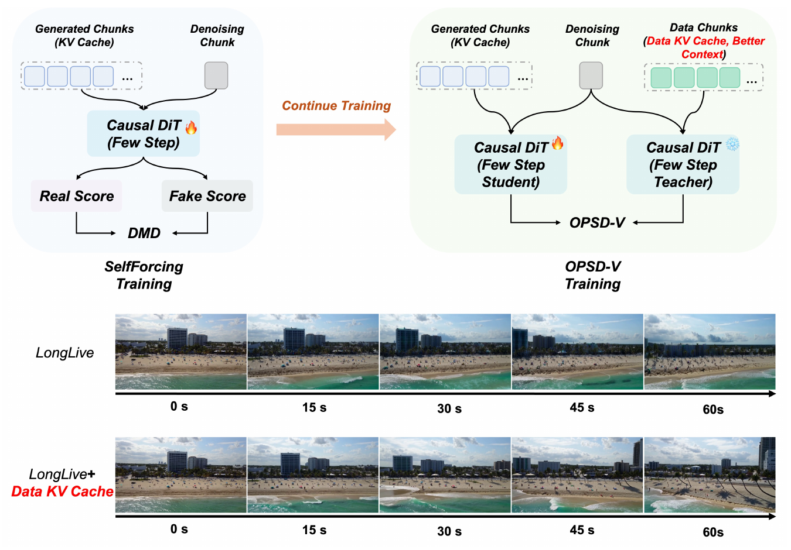
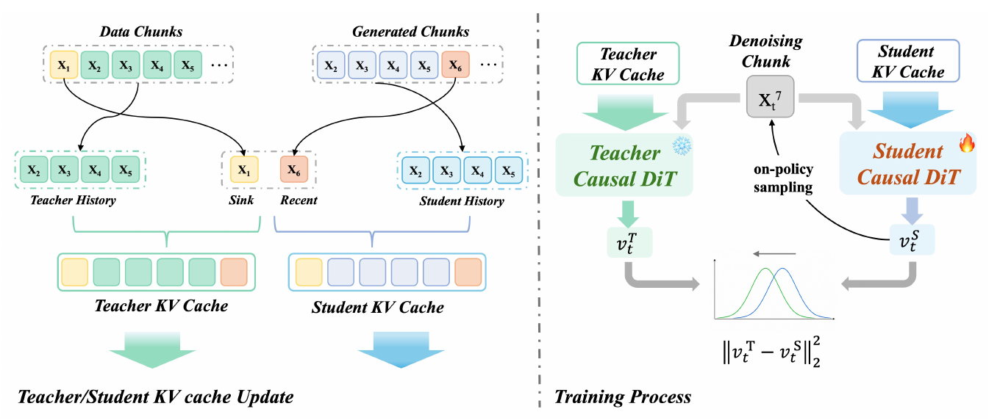
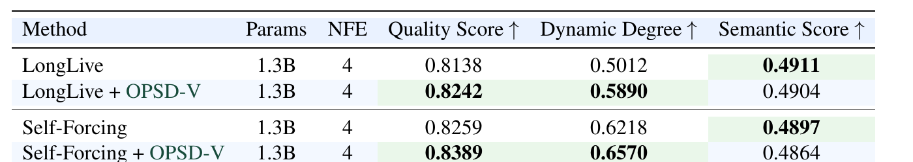
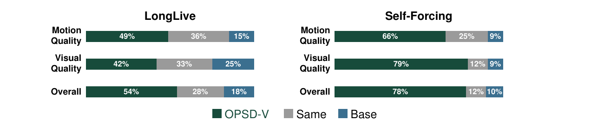
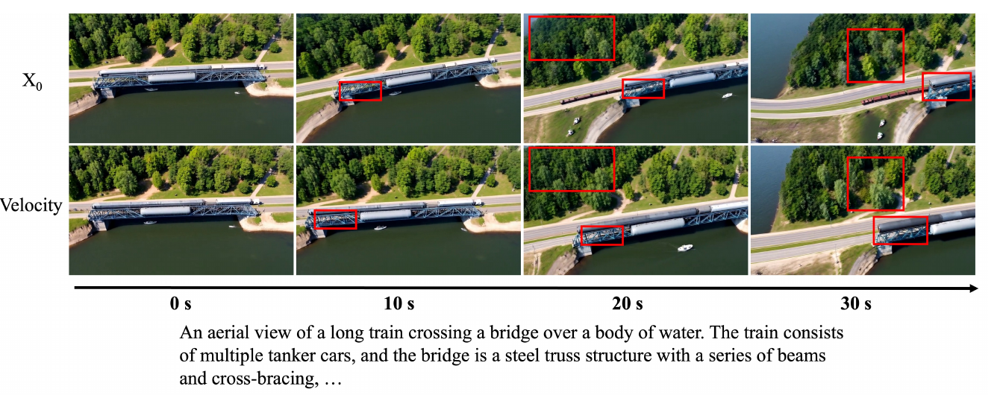
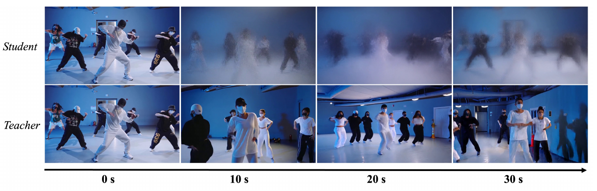

# OPSD-V: On-Policy Self-Distillation for Post-Training Few-Step Autoregressive Video Generators

> Hongyu Liu¹², Chun Wang¹², Feng Gao¹†, Xuanhua He¹², Yue Ma², Ziyu Wan³, Yong Zhang¹‡, Xiaoming Wei¹, Qifeng Chen²†  
> ¹**美团** ²**香港科技大学** ³**香港城市大学** · [arXiv:2607.08766](https://arxiv.org/abs/2607.08766)(2026-07-09)  
> [project](https://meigen-ai.github.io/OPSD-V) · code: `MeiGen-AI/OPSD-V` · †通讯作者 ‡project lead

---

## 1. 一句话定位

**用真实长视频当"更好的上下文"喂给 teacher，而不是当训练目标——让 teacher 在学生走过的同一批状态上给出纠正方向。**

核心诊断很便宜也很有说服力：**不训练、不改 sampler，只在测试时把 LongLive 的旧 KV cache 条目替换成真实视频对应 chunk 算出的 KV**，长时程稳定性就肉眼可见地变好。结论：**退化的瓶颈在生成出来的 KV cache 本身**。

于是 OPSD-V 的设计是：

- **学生完全 on-policy rollout**（60 chunk，走推理时一模一样的 4 步 sampler），它的轨迹决定**在哪里施加监督**；
- **teacher 不采自己的轨迹**——在**学生访问过的同一个 `z^s_{i,k}`、同一个 `t_k`、同一个 `c`** 上评估，**唯一的差别是 cache**：旧历史换成真实视频 chunk，**但最近一个 chunk 保留学生生成的**；
- loss 是纯 velocity MSE，**没有 DMD、没有 reward、没有 adversarial**。

Wan2.1-T2V-1.3B 上，给 Self-Forcing 和 LongLive 两个 base 各挂一个 LoRA 训 **200 步**，VBenchLong 的 Dynamic Degree 分别 **+5.66% / +17.52%**。

⚠️ **但有一条必须先说清**：摘要写"consistent improvements in visual quality, motion dynamics, **and VBenchLong scores**"，而 **Semantic Score（它本身就是 VBenchLong 分数）在两个 backbone 上都下降了**——Table 1 里 Semantic 那一列的两个最优格**恰恰是 base model**。论文正文把这降级成"a slight decrease"，摘要没有。

📌 **与 [OPSA](../../llm/opsa/analysis.md) 对着读**：那篇（同期、LLM 域）论证"OPD 的收益不来自 teacher 的具体监督"；本篇则把赌注全押在"teacher 的 cache 质量"上。**两篇对同一范式给出了几乎相反的判断**（§7 详述）。

---

## 2. 要解决的问题

**背景**：few-step 因果 AR 视频生成器（Self-Forcing、LongLive 这条线）是 DMD 蒸馏出来的，它们在长 AR rollout 时会**误差累积 + 动态衰减**。

论文对现有做法的批评是逐条推进的：

| 批评 | 原文 |
|---|---|
| **① teacher 是短片段的** | *"the target distribution used in DMD-style training is usually provided by a bidirectional **short-clip** video teacher, which cannot directly supervise truly long autoregressive trajectories."* |
| **② 拉长 rollout 也治不了根** | 针对 Self-Forcing++ / LongLive / Reward-Forcing / Rolling-Sink：*"their supervision is still limited by the capability and temporal range of the underlying **clip-level teacher**."* |
| **③ DMD 本身有副作用** | *"DMD itself may introduce side effects such as **weakened dynamics and color drift**"* |
| **④ 监督粒度太粗** | *"its supervision is typically defined at the **chunk or clip distribution level** rather than as **dense corrective targets along the entire denoising trajectory**."* |

由此给出全文的中心问句（论文用斜体框起来）：

> ***"Can real long-video data serve as stronger training supervision while preserving the original few-step AR generation capability?"***
> （真实长视频能否作为更强的训练监督，同时保住原有的 few-step AR 生成能力？）

**论文还预先反驳了两种朴素做法**（§6）：

> *"**Direct teacher forcing** would break the inference-time rollout distribution, while using real videos **only as reconstruction targets** would not correct the model on its own generated cache states."*

📌 **这句话定义了 OPSD-V 的设计空间**：真实视频既不能当输入（会破坏推理分布），也不能只当目标（纠正不了模型自己的 cache 状态）——**那就让它去当 teacher 的上下文。**

---

## 3. 关键诊断：瓶颈在 KV cache

> **Fig 2 逐区域解读**：
>
> **上半——两种训练范式的对比**：
> - **左（淡蓝底）`SelfForcing Training`**：`Generated Chunks (KV Cache)`（蓝方块）+ 灰色 `Denoising Chunk` → `Causal DiT 🔥 (Few Step)` → 分叉到 `Real Score` / `Fake Score` → 汇入 **`DMD`**。
> - 中间一条橙色粗箭头标 **`Continue Training`**。
> - **右（淡绿底）`OPSD-V Training`**：三组输入——`Generated Chunks (KV Cache)`（蓝）、灰 `Denoising Chunk`、以及 `Data Chunks` 且带**红色斜体**副标 **`(Data KV Cache, Better Context)`**（绿方块）。箭头汇入 `Causal DiT 🔥 (Few Step Student)` 与 `Causal DiT ❄ (Few Step Teacher)`，两者各出一条指向中央的 **`OPSD-V`**。
>
> **下半——测试时 cache 干预（全文最有说服力的动机实验）**：两行 × 5 帧海滨城市航拍，行标 `LongLive` 与 `LongLive + `**`Data KV Cache`**（后者红字）。时间轴 **0s / 15s / 30s / 45s / 60s**。
> - **base 行随时间整体变暗、建筑逐渐塌成剪影**（典型的 color drift）；
> - **干预行全程保持亮度与结构**。
>
> 📌 **这个实验的价值在于它极便宜**：**不训练、不改 sampler**，只在推理时把旧 cache 条目换成真实视频算的 KV（最近一个 cache chunk 仍保留模型自生成的）。由此得出 *"degradation in the **generated KV cache** is a key bottleneck."*
>
> ⚠️ **但它的证据强度有限**：caption 只保证 *"Both rows are initialized with the same real first chunk"*，**没说同 seed / 同初始噪声**；而两行的内容演化明显不同（不只是画质差异）。**作为因果证据偏弱，作为动机足够。**

---

## 4. 方法

### 4.1 预备：因果 AR 视频生成

视频切成 `N` 个 latent chunk，每 chunk 含 1 个或多个 latent frame：

$$
p_\theta(x_{1:N} \mid c) = \prod_{i=1}^{N} p_\theta(x_i \mid x_{<i},\, c)
$$

每个 chunk 内做 `K` 步去噪（`f_θ` 是 velocity predictor，`h_i` 是生成 chunk `i` 之前可用的 KV cache）：

$$
\hat{v}_{i,k} = f_\theta(z_{i,k},\, t_k,\, c,\, h_i), \qquad
z_{i,k-1} = \Phi(z_{i,k},\, t_k,\, t_{k-1},\, \hat{v}_{i,k}), \quad k = K,\dots,1
$$

$$
\hat{x}_i = z_{i,0}, \qquad h_{i+1} = h_i \oplus \mathrm{KV}_\theta(\hat{x}_i)
$$

### 4.2 学生：完全 on-policy

**共享真实前缀**：`x₁^data` 过 causal DiT 得 KV，同时初始化 student 和 teacher 的 cache。📌 **它不参与生成，也不算 loss**（论文明说 *"does not participate in generation or loss computation"*）。

$$
h_2^{s} = \mathrm{KV}_\theta(x_1^{\mathrm{data}})
$$

从 `i = 2` 起，学生按**与推理时完全一致**的 4 步 sampler 展开：

$$
\hat{v}^{s}_{i,k} = f_\theta(z^{s}_{i,k},\, t_k,\, c,\, h^{s}_i), \qquad
z^{s}_{i,k-1} = \mathrm{sg}\big(\Phi(z^{s}_{i,k},\, t_k,\, t_{k-1},\, \hat{v}^{s}_{i,k})\big)
$$

⚠️ **注意 solver transition 外面套了 `sg`**——**防止后续 chunk 的 loss 沿整条 AR 历史回传**。

学生的 cache 里全是它自己生成的东西：

$$
h^{s}_i \equiv \mathrm{KV}_\theta(x_1^{\mathrm{data}}) \oplus \mathrm{KV}_\theta(\hat{x}^{s}_2) \oplus \cdots \oplus \mathrm{KV}_\theta(\hat{x}^{s}_{i-1})
$$

### 4.3 Teacher：同一状态，不同 cache

📌 **这是全文的核心设计，一句话讲清**：

> **teacher 不采自己的轨迹。** 它在**学生访问过的同一个 `z^s_{i,k}`、同一个 `t_k`、同一个 `c`** 上评估，**唯一的差别是 cache**：

$$
\hat{v}^{t}_{i,k} = f_{\bar\theta}(z^{s}_{i,k},\, t_k,\, c,\, h^{t}_i)
$$

论文对这个分工的表述很干净：

> ***"the student trajectory determines WHERE supervision is applied, and the teacher cache determines the CORRECTIVE DIRECTION."***

**AR-consistent teacher cache**——旧历史换成真实视频 chunk，**但最近一个 chunk 保留学生生成的**：

$$
h^{t}_i \equiv \mathrm{KV}_{\bar\theta}(x_1^{\mathrm{data}}) \oplus \mathrm{KV}_{\bar\theta}(x_2^{\mathrm{data}}) \oplus \cdots \oplus \mathrm{KV}_{\bar\theta}(x_{i-2}^{\mathrm{data}}) \oplus \mathrm{KV}_{\bar\theta}(\hat{x}^{s}_{i-1})
$$

以 `i = 7` 为例，两条 cache 的对比一目了然：

$$
h^{s}_7 : \big[x_1^{\mathrm{data}},\, \hat{x}^{s}_2,\, \hat{x}^{s}_3,\, \hat{x}^{s}_4,\, \hat{x}^{s}_5,\, \hat{x}^{s}_6\big]
$$

$$
h^{t}_7 : \big[x_1^{\mathrm{data}},\, x_2^{\mathrm{data}},\, x_3^{\mathrm{data}},\, x_4^{\mathrm{data}},\, x_5^{\mathrm{data}},\, \hat{x}^{s}_6\big]
$$

📌 **保留最近一个学生 chunk 的理由**：*"Keeping the most recent student-generated chunk prevents the teacher from becoming a **fully teacher-forced oracle**."* ——**如果全部换成真实 chunk，teacher 就退化成一个完全 teacher-forced 的 oracle，给出的方向对学生不可达。**

> **Fig 3 逐面板解读**——中间一条竖线分成两半。
>
> **左面板 `Teacher/Student KV cache Update`**：
> - 上方两个虚线框：左 **`Data Chunks`** = `x₁`（黄）+ `x₂ x₃ x₄ x₅`（绿）+ `…`；右 **`Generated Chunks`** = `x₂ x₃ x₄ x₅`（蓝）+ `x₆`（橙）+ `…`。
> - 黑色箭头把 Data 的 `x₁` 引到 **`Sink`**（黄）、Data 的 `x₂–x₅` 引到 **`Teacher History`**（绿虚框）；把 Generated 的 `x₆` 引到 **`Recent`**（橙）、`x₂–x₅` 引到 **`Student History`**（蓝点划框）。
> - 下方合成两条 cache 条带：**Teacher KV Cache = [黄, 绿×4, 橙]**（绿描边），**Student KV Cache = [黄, 蓝×4, 橙]**（蓝描边）。
>
> 📌 **注意 `x₁` 的黄色和 `x₆` 的橙色在两条 cache 里是一样的**——**首尾共享，只有中间的历史不同**。这就是 Eq (12)/(13) 的可视化。
>
> ⚠️ **同时这张图暴露了一件正文公式没写的事**：真实实现是 **`1 个 sink + 4 个 history + 1 个 recent`** 的**滑动窗口**，而不是公式里那种全长拼接（见 §7 的矛盾①）。
>
> **右面板 `Training Process`**：
> - 左 `Teacher KV Cache`（绿框）→ 绿色粗箭头 → **`Teacher Causal DiT` ❄**（绿字 + 雪花 = 冻结）→ `v_t^T`；
> - 右 `Student KV Cache`（蓝框）→ 蓝色粗箭头 → **`Student Causal DiT` 🔥**（橙字 + 火焰 = 可训）→ `v_t^S`；
> - 中间灰方块 **`Denoising Chunk X_t^7`**，灰箭头**同时喂给两边**；另有一条黑色细箭头从 `v_t^S` 指回 `X_t^7`，标注 **`on-policy sampling`**；
> - 底部两条高斯曲线（绿、蓝）+ 一个向左的小箭头（蓝往绿靠），下方公式 `‖v_t^T − v_t^S‖²`。

### 4.4 损失与监督集合

$$
\mathcal{L}_{\mathrm{OPSD\text{-}V}} = \frac{1}{|\mathcal{S}|} \sum_{(i,k) \in \mathcal{S}} \big\lVert \hat{v}^{s}_{i,k} - \mathrm{sg}(\hat{v}^{t}_{i,k}) \big\rVert_2^2
$$

$$
\mathcal{S} = \big\{(i,k) \;\big|\; i > M,\ k = 1,\dots,K \big\}, \qquad M = 7,\ K = 4
$$

📌 **`M = 7` 的理由**：Wan 系 AR 模型的原始局部窗口就是 7 chunk（3 × 7 = 21 latent frames）——**warm-up 期不监督，等 cache 走出原始窗口范围后才开始纠正**。

📌 **`|S| = (60 − 7) × 4 = 212`**（一次 rollout 里被监督的 (chunk, step) 对数）。

### 4.5 显存优化：截断反传

每个 `(i,k)` 的 `ℓ_{i,k}/|S|` **算完立刻反传并累积到参数梯度**，然后释放当前激活图；整个 rollout 走完后 optimizer 只 step 一次，再做 EMA。

论文声称这**在数学上等价于对求和目标反传**，且**激活显存不随被监督的 (chunk, step) 对数增长**——同一时刻至多保留一个带梯度的学生前向图。

### 4.6 所有 stop-gradient / EMA 的施加位置

| 位置 | 操作 |
|---|---|
| solver transition | `z^s_{i,k−1} = sg(Φ(·))` |
| **所有 KV-cache 写入** | **无梯度** |
| teacher 预测 | `sg(v̂^t_{i,k})`——*"teacher is used only to produce stop-gradient targets"* |
| warm-up chunk（`i ≤ M`）的学生前向 | 无梯度 |
| student cache | detached |
| **teacher LoRA** | 学生 LoRA 的 **EMA 副本，decay 0.9999**，每次 optimizer step 后更新 |
| base backbone | **冻结**，只训 student LoRA |

---

## 5. 实验设置

| 项 | 值 |
|---|---|
| **backbone** | **Wan2.1-T2V-1.3B**（两个 base 都是），VAE = Wan2.1 VAE |
| **base models** | **Self-Forcing**（官方 base ckpt，**新训一个 LoRA**）／**LongLive**（官方 base + **已发布的 LoRA ckpt 上继续训**） |
| 阶段 | **单阶段**后训练，base 全程冻结 |
| `K` / `M` | 4 / 7 |
| rollout | **180 latent frames = 60 chunks × 3** |
| EMA decay | **0.9999** |
| **迭代数** | **200 iterations** |
| 硬件 | **24 × H800**，per-GPU batch = 1 |
| 精度 / 并行 | BF16、activation checkpointing、FSDP |
| **训练数据** | 自建 **3,800 条**视频，每条约 1 分钟，**480p**；含自然风光、大幅相机运动、人物场景；**用 optical flow + 基础质量线索过滤**掉低运动/不稳定/低质样本 |
| 损失 | 单一 velocity MSE，**无 DMD / reward / adversarial** |

⚠️ **未给出的关键项**：学习率、optimizer 类型、**LoRA rank / alpha / 作用模块**、梯度裁剪阈值、**attention-sink 的 sink 长度与滑窗长度**、训练墙钟时长、显存峰值、**推理延迟 / FPS / 吞吐**。

**评测协议**：
- 任务 **1 分钟视频生成 @ 16 FPS**；
- prompt **240 条** = MovieGenBench **前 120 条**（不是随机抽样）+ **120 条内部 prompt（称 MeiBench，未公开）**；
- 每 method 每 prompt 生成 **1 条**，**单 seed，无方差报告**；
- 指标 **VBenchLong**，**两个 benchmark 平均后报单一数字，不拆分**；
- 公平性控制：4 个 method 同 backbone、同 NFE=4、同 attention-sink cache；定性对比同 prompt / 同 seed / 同 sampler。

⚠️ **一个重要前提**：**Self-Forcing 被作者额外加装了 attention-sink** 才参与长视频评测——**表里的"Self-Forcing"不是官方原版**。

---

## 6. 结果

### 6.1 定量（Table 1）

> **Table 1 逐行解读**——**三个指标全部越高越好**（表头都带 ↑）。加粗 + **浅绿底纹** = 该 backbone 组内该列最优。

| Method | Params | NFE | Quality Score ↑ | Dynamic Degree ↑ | Semantic Score ↑ |
|---|---|---|---|---|---|
| LongLive | 1.3B | 4 | 0.8138 | 0.5012 | **0.4911** |
| **LongLive + OPSD-V** | 1.3B | 4 | **0.8242** | **0.5890** | 0.4904 |
| Self-Forcing | 1.3B | 4 | 0.8259 | 0.6218 | **0.4897** |
| **Self-Forcing + OPSD-V** | 1.3B | 4 | **0.8389** | **0.6570** | 0.4864 |

**增幅**：

| | Quality | **Dynamic Degree** | Semantic |
|---|---|---|---|
| LongLive → +OPSD-V | +0.0104（**+1.28%**） | +0.0878（**+17.52%**） | **−0.0007** |
| Self-Forcing → +OPSD-V | +0.0130（**+1.57%**） | +0.0352（**+5.66%**） | **−0.0033** |

📌 **三个必须点出的读法**：

1. **真正大的增益只有 Dynamic Degree**（+17.52% / +5.66%）。**Quality Score 只涨 1.3~1.6%**。
2. **Semantic Score 两个 backbone 都跌**，且**该列的两个最优格恰恰是 base model**。
3. ⚠️ **跨行看**：**Self-Forcing 原版（0.8259 / 0.6218）在 Quality 和 Dynamic 上都仍然优于 LongLive + OPSD-V（0.8242 / 0.5890）**——**论文正文完全未提这一点。**

### 6.2 用户研究（Fig 5）

> **Fig 5 逐条解读**：左右两个 panel（**LongLive** / **Self-Forcing**），各 3 条 100% 堆叠横条。图例：**深墨绿 = OPSD-V，中灰 = Same，蓝 = Base**。
>
> | Panel | 准则 | OPSD-V | Same | Base |
> |---|---|---|---|---|
> | **LongLive** | Motion Quality | 49% | 36% | 15% |
> | | Visual Quality | 42% | 33% | 25% |
> | | Overall | 54% | 28% | 18% |
> | **Self-Forcing** | Motion Quality | **66%** | 25% | 9% |
> | | Visual Quality | **79%** | 12% | 9% |
> | | Overall | **78%** | 12% | 10% |
>
> 📌 **两个 panel 的差距非常大**——Self-Forcing 上的绿段远长于 LongLive 上的。这与 Table 1 的趋势相反（Table 1 里 LongLive 的 Dynamic 增幅反而更大），**论文没有讨论这个不一致**。
>
> **样本量**：**10 名参与者 × 20 对 = 200 次判断**，每 panel 每准则 100 次判断。每对含 base 与 OPSD-V 各一条、同 prompt，标为 Model A / Model B / Same。
>
> **汇总口径**（两 backbone 合并）：Overall **66.0%**（除去 Same 后 **82.5%**）、Motion **57.5%**（**82.7%**）、Visual **60.5%**（**78.1%**）——我核算过，**与 Fig 5 的分项完全自洽**。
>
> ⚠️ **未说明**：参与者是否为作者/同事、是否盲测、呈现顺序是否随机化、有无一致性检验。

### 6.3 消融——只有两个，且都是单例定性

**① velocity vs `x₀` matching（Fig 6）**

> **Fig 6 解读**：2 行 × 4 帧，行标 `X₀`（上）/ `Velocity`（下），时间轴 **0s / 10s / 20s / 30s**（⚠️ **只到 30 秒，不是 60 秒**）。场景是航拍钢桁架桥 + 罐车列车 + 水面，**红色矩形标出对比区域**（10s 桥桁架；20s 树冠 + 桥/列车；30s 树冠 + 桥）。
>
> **`X₀` 行在 20–30s 桁架结构糊成块状、树冠失去纹理；`Velocity` 行仍能看到桁架的斜撑与树冠细节。**
>
> **论证**：flow 参数化下 velocity → `x₀` 会引入**依赖 timestep 的 scale**，`x₀`-MSE 因此在 4 个固定步上**重新加权**，*"places relatively greater emphasis on high-noise states"*。

替代损失的形式：

$$
\mathcal{L}_{x_0} = \frac{1}{|\mathcal{S}|}\sum_{(i,k)\in\mathcal{S}} \big\lVert \hat{x}^{s}_{0,i,k} - \mathrm{sg}(\hat{x}^{t}_{0,i,k}) \big\rVert_2^2
$$

**② 学生轨迹 vs teacher 轨迹（Fig 7）**

> **Fig 7 解读**：2 行 × 4 帧，行标斜体 `Student`（上）/ `Teacher`（下），时间轴 **0s / 10s / 20s / 30s**。蓝色墙面舞蹈房、多人群舞。
>
> - **0s 两行几乎相同**；
> - **10s 起 `Student` 行迅速被白蓝色雾状模糊吞没，只剩深色人形轮廓**；20s、30s 更严重；
> - **`Teacher` 行 4 帧全程锐利**，人物、天花板灯带、门框清晰可辨。
>
> **结论**：如果蒸馏状态取自 teacher 自己的轨迹 `z^t_{i,k}`，那么**teacher 轨迹上看起来清晰，但学生自己 rollout 时会急剧模糊**——典型的 **off-policy state mismatch**。
>
> 论文的表述很到位：*"the teacher should provide the **corrective prediction**, but the student must determine the **states** on which that prediction is evaluated."*
>
> ⚠️ **但这张图有个读法陷阱**：teacher 的 cache 大部分由**真实视频 chunk** 构成，所以"teacher 行清晰"在相当程度上是**被真实数据喂出来的**。读者容易把它误读成"OPSD-V 的效果"。

⚠️ **以下被论文命名为核心贡献的设计，全部没有消融**：

| 未消融的设计 | 为什么该消融 |
|---|---|
| **AR-Consistent Real-Video Teacher Cache** | **这是论文的标题级贡献**。既没有"全部换成真实 chunk"的对照，也没有"完全不换（= 纯自蒸馏）"的对照 |
| 共享真实前缀 `x₁^data` | 它是否必要？ |
| `M = 7` warm-up | 只用"Wan 局部窗口 = 7 chunk"论证，无对照 |
| **EMA decay 0.9999 / EMA teacher 本身** | 没有"直接用冻结 base 当 teacher"的对照（见 §7 的矛盾③） |
| 全部 4 步都监督 vs 监督子集 | — |
| **给 Self-Forcing 加装 attention sink 的增益** | 导致无法拆分 baseline 数字里有多少来自 sink |
| rollout 长度（60 chunk） | — |
| Fig 2 的测试时 cache 干预 | 只有一个场景的截图，无量化 |

---

## 7. 争议与权衡

**① 摘要的 VBenchLong 宣称与 Table 1 直接冲突。** 摘要写 *"Experiments show consistent improvements in visual quality, motion dynamics, **and VBenchLong scores**"*。但 **Semantic Score 本身就是 VBenchLong 分数，且在两个 backbone 上都下降**（0.4911→0.4904；0.4897→0.4864），**表中 Semantic 列的两个最优值恰恰是 base model**。论文正文自己把它降级成 *"a slight decrease... suggesting a mild trade-off"*——**但摘要没有这个限定**。

**② Quality Score 与 Dynamic Degree 可能不独立。** 在 VBench 体系里 **Dynamic Degree 是 Quality Score 的子维度之一**，Dynamic Degree 上升会机械地推高 Quality Score。论文把二者并列作为"两个一致提升"的证据，**实际可能是同一个变化的两次计数**。而且 **Quality Score 只涨 1.28% / 1.57%，与 Dynamic Degree 的 17.52% / 5.66% 完全不在一个量级**。⚠️ **论文没有给 VBench 子维度拆分**（subject/background consistency、temporal flickering、motion smoothness、aesthetic/imaging quality）——**无法排除"动态变大、但一致性/闪烁变差、二者相抵"的可能。**

**③ 更要命的是：真正衡量"误差累积"的指标一个都没报。** 论文的核心动机是**长时程退化与误差累积**，而 VBench 里直接对应这件事的是 **subject consistency / background consistency / temporal flickering / motion smoothness**——**这四项一个都没单独报**。而它们恰恰是 Dynamic Degree 上升时最容易变差的。

**④ 训练数据的筛选信号与头号评价指标同源。** 训练数据是用 **optical flow** 过滤掉低运动样本得到的**高运动子集**；而论文的头号增益指标 **VBench Dynamic Degree 正是基于 RAFT 光流计算的运动幅度指标**。⚠️ **在高运动数据上做 velocity matching，Dynamic Degree 上升几乎是设计使然**，不能直接读作"长时程退化被缓解"。

**⑤ EMA 在 200 步下几乎不起作用。** `0.9999^200 ≈ 0.980`——**200 个 optimizer step 后 teacher LoRA 仍保留约 98% 的初始权重**。对 **Self-Forcing 分支（LoRA 从零新训）**，teacher 实质上**全程约等于"冻结的 base model + 干净 cache"**。也就是说，**"self-distillation / EMA"这套机制在这里几乎没有运转，真正起作用的是"冻结基座 + 真实视频 cache"**。📌 有意思的是，**Fig 2 和 Fig 3 都把 teacher 画成 ❄（frozen）图标**——与正文"EMA copy of the student LoRA"在语义上不一致，**但恰好印证了它事实上接近冻结**。论文没有讨论这点，也没做 "EMA vs 冻结 teacher" 的对照。

**⑥ 公式写的是全长 cache，实现是滑动窗口。** Eq (9)/(11)/(12) 写的是**完整长度**的 cache 拼接（`x₁` 到 `x_{i−1}` 全留）；但 §4.3 末尾和 Fig 3 说的是 **attention-sink + rolling window**（Fig 3 里 cache 只有 `1 sink + 4 history + 1 recent` 共 6 格）。**公式是理想化写法，真实实现是滑窗——而 sink 长度、滑窗长度这两个关键超参从未给出。**

**⑦ 训练 rollout 比评测 rollout 短。** 训练 60 chunk ≈ **44.8 秒**（180 latent frames，按 Wan2.1 VAE 4× 时间压缩换算到 16 FPS）；评测是 **60 秒**（≈80 chunk）。**即评测比训练多外推约 33% 的长度。** 论文全篇主打"长时程"，却**从未把训练 rollout 换算成秒，也没做"训练长度 vs 评测长度"的分析**。

**⑧ 完全没有第三方 baseline。** Table 1 只有"自己 vs 自己的 base"四行。而 related work 里点名解决同一问题的一大批工作——**Self-Forcing++、Causal Forcing、Reward Forcing、Rolling Forcing、Rolling Sink、CausVid，以及同样用真实长视频作监督的 Cai et al. 2026**——**一个都没有对比。**

**⑨ 缺少能分离"数据贡献"与"框架贡献"的对照。** 用同样这 3,800 条真实长视频做：(a) 直接 teacher-forcing 微调、(b) 纯重建 loss 微调、(c) 继续 DMD——**三个都没做**。论文在 §2 用两句话反驳了 (a) 和 (b)，**但那是论证，不是实验**。⚠️ **所以"必须用 OPSD 这个范式"这个核心主张，目前没有实验支撑——真实长视频数据本身的贡献 vs OPSD 框架的贡献无法区分。**

**⑩ 一半的 prompt 不公开。** 240 条里 **120 条是内部的 MeiBench**，且**结果只报两者平均、不给拆分**。无法核查增益是否主要来自内部半区。MovieGenBench 那半也是"取前 120 条"而非随机采样。

**⑪ Self-Forcing baseline 被改造过。** 作者给它加装了 attention sink 才参与长视频评测——**不能与已发表的 Self-Forcing 数字对照，而改造带来的增益也未单独量化**。

**⑫ 两个 backbone 的实验设置不对称。** LongLive 是"在官方已发布 LoRA 上继续训"，Self-Forcing 是"从 base ckpt 新训 LoRA"——**两者的 LoRA 初始化、有效学习率、EMA 起点完全不同**，却用同一套超参、同一个 200 iterations，**然后把两组增益并列陈述**。

**⑬ 机制上有个未被讨论的张力。** 损失是**纯 MSE 回归到 teacher velocity**——这是典型的 **mean-seeking** 目标，通常会**降低**多样性和锐度；**但论文的核心增益恰恰是 Dynamic Degree 上升**。⚠️ 论文引用了 Cai et al. 2026《Mode seeking meets mean seeking for fast long video generation》，**却完全没讨论这个张力**，也没给任何解释或分析实验。

**⑭ 没有 Limitations 章节。** §6 "Analysis and Future Work" 只有两句带 hedge 的表述，且都是"未来能更好"而非"现在不行"：*"may further benefit from scaling the amount, diversity, and quality of training videos"*、*"our current cache construction and loss design are only one possible instantiation of this idea"*。

**⑮ 正面：核心设计原则的表述非常干净。** *"the student trajectory determines **where** supervision is applied, and the teacher cache determines the **corrective direction**"*——**这句话把 on-policy 蒸馏里"状态由谁定、方向由谁定"这个容易混淆的问题一次讲清了**，而且 Fig 7 的消融直接验证了它（取 teacher 轨迹会导致 off-policy state mismatch）。

**⑯ 正面："保留最近一个学生 chunk"是个想清楚了的细节。** 如果全部换成真实 chunk，teacher 就变成 **fully teacher-forced oracle**，给出的方向对学生不可达。**这个设计说明作者意识到了"teacher 必须留在学生够得着的地方"。** ⚠️ 可惜没有消融。

**⑰ 正面：Fig 2 的测试时干预是个便宜且聪明的动机实验。** 不训练、不改 sampler，只换 cache 内容——**用最小的代价把"瓶颈在 cache"这个假设立住了**。虽然作为因果证据偏弱（没保证同 seed），但作为设计动机完全够。

**⑱ 正面：协议层面的公平性控制比多数论文规范。** 同 backbone、同 1.3B、同 NFE=4、同 attention-sink 机制、定性对比同 prompt/seed/sampler——**这几条做得扎实**。

---

## 8. 一句话总结

OPSD-V 的洞察是**"真实长视频既不能当输入（破坏推理分布）也不能只当目标（纠正不了自生成的 cache 状态），那就让它去当 teacher 的上下文"**：学生完全 on-policy rollout 60 个 chunk 决定**在哪里**施加监督，teacher 在**同一批 `z^s_{i,k}`、同一 `t_k`** 上评估、只把旧 cache 换成真实视频 chunk（**但保留最近一个学生 chunk，防止退化成 fully teacher-forced oracle**）来决定**纠正方向**，loss 是纯 velocity MSE；Wan2.1-1.3B 上训 200 步使 Dynamic Degree +17.52%/+5.66%；⚠️ **但摘要宣称的"VBenchLong 一致提升"与 Semantic Score 两个 backbone 都跌直接冲突、Quality 只涨 1.3~1.6% 且与 Dynamic Degree 在 VBench 里并不独立、真正衡量误差累积的一致性/闪烁指标一个都没报、训练数据的光流筛选与头号指标 Dynamic Degree 同源、EMA 在 200 步下 teacher 保留 98% 初始权重（"self-distillation"几乎没运转）、公式写全长 cache 而实现是滑窗且滑窗超参未给、零第三方 baseline、且缺少"同样数据直接微调"这个能分离数据贡献与框架贡献的关键对照。**

---

## Q&A

**Q: "teacher 只换 cache、不换状态"这个设计到底解决了什么？**

A: **解决的是"监督方向"与"监督位置"的错配——这是 on-policy 蒸馏里最容易搞混的一对。**

拆成两个问题看：

| 问题 | 谁来定 | 为什么 |
|---|---|---|
| **在哪些状态上施加监督？** | **学生** | 学生推理时会到达的状态，才是需要被纠正的状态 |
| **在这些状态上该往哪走？** | **teacher（带干净 cache）** | teacher 看到的是"如果历史没退化会怎样" |

**如果两者都交给 teacher**（即从 teacher 自己的轨迹 `z^t_{i,k}` 上取状态），就会出 Fig 7 的失败：**teacher 轨迹上一切正常，但学生自己 rollout 时 10 秒起就糊成雾团**——因为学生从未被教过"当我自己的 cache 已经退化时该怎么办"。

📌 **反过来看这也解释了为什么"最近一个 chunk 要保留学生生成的"**：如果 teacher 的 cache 全是真实 chunk，它就完全活在"历史从未退化"的世界里，**给出的方向对学生是不可达的**。留一个学生 chunk，等于让 teacher **"看着学生刚犯的错"来给下一步的方向**。

🔴 **补记（2026-09）：另一篇独立发现了同一个问题。** [Matrix-Game 3.5](../../world_model/matrix_game_35/analysis.md) 在它的 self-rollout DMD 一节写：

> *"the student and scorers maintain **different memory states**. The student updates online memory from generated chunks, while **feeding the same potentially drifted history to the bidirectional scorers would compromise the supervision**."*

**同一个诊断，两种解法**：

| | teacher/scorer 的 cache 内容 | 随 rollout 前进吗 | 代价 |
|---|---|---|---|
| **本篇（OPSD-V）** | **真实视频 chunk** 逐个填充，**只保留最近一个学生 chunk** | ✅ **随 `i` 前进**，始终与学生对齐在同一时刻 | **必须有成对的真实长视频**（自建 3,800 条 × 1 分钟）；teacher 活在"历史从未退化"的世界里，所以必须留一个学生 chunk 防止方向不可达 |
| **Matrix-Game 3.5** | **初始记忆**（rollout 起点那一份），冻住 | ❌ **完全不前进** | 不需要额外真实视频，**但 scorer 的上下文随 rollout 越来越旧** |

📌 **共同原则是"把学生与 teacher/scorer 的记忆状态解耦"** —— 这正是本篇总结的那条原则（**学生决定在哪里施加监督，teacher 决定往哪个方向走**）在记忆维度上的体现。

⚠️ **但 Matrix-Game 3.5 那一行有歧义**：它的 Eq (9) 把学生与 teacher 都条件在**同一个**在线条件 `Ĥ_i^θ` 上（正文还强调 "under this **shared** condition"），而紧接着的散文说 scorer 记忆是**固定**的 —— **两者不可能同时成立，而论文没有把实际优化的目标写成公式。** 📌 **本篇在这一点上比它清楚得多**：`h^s_i` 与 `h^t_i` 两条 cache 都有显式表达式，`i=7` 还给了逐项对照。

📌 **补记（2026-09）：第三篇给出了与本篇实质相同的答案。** [AlayaWorld](../../world_model/alayaworld/analysis.md) 在它的 self-forcing++ 蒸馏里写：

> *"the student rolls out its own multi-chunk trajectories and is scored against the teacher along that self-generated path (**with ground-truth context and detached history**)."*

**即「状态取自学生、上下文换成真值」—— 与本篇是同一个解法。** 三篇排在一起：

| | teacher/scorer 打分时的上下文 | 随 rollout 前进吗 |
|---|---|---|
| **本篇（OPSD-V）** | **真实视频 chunk 逐个填充**，只留最近一个学生 chunk | ✅ 前进 |
| **AlayaWorld** | **ground-truth context**（+ detached history） | ✅ 随自生成路径前进 |
| **Matrix-Game 3.5** | ⚠️ 公式说共享在线条件、散文说冻在初始记忆 —— **自相矛盾** | ❌（按散文口径） |

⚠️ **但 AlayaWorld 缺了本篇那个关键细节**：它没说要不要保留最近一个学生 chunk。**若上下文全是真值，按本篇的论证 teacher 就成了 fully teacher-forced oracle，给出的方向对学生不可达** —— AlayaWorld 没有讨论这个风险。

⚠️ **三篇互不引用，哪种解法更好也没人比过。**

⚠️ **但这套论证里有个洞**：**"AR-consistent teacher cache"这个命名级贡献本身零消融**。既没有"全部换真实 chunk"的对照，也没有"完全不换"（纯自蒸馏）的对照。**所以"保留最近一个"这个具体选择有多重要，目前只有论证没有数据。**

---

**Q: 它和 OPSA 那篇（LLM 域）放在一起看，能得出什么？**

A: **两篇同期工作对同一个范式给出了几乎相反的判断，而且都各有道理——这个对照本身很有意思。**

| | [OPSA](../../llm/opsa/analysis.md)（Purdue, LLM） | **OPSD-V**（美团+港科大, 视频） |
|---|---|---|
| **对 teacher 的判断** | **teacher 的具体监督不重要**——换成固定负值也一样 | **teacher 的 cache 质量是全部**——这是唯一被改变的东西 |
| **收益来源** | 压制学生自采的**低概率 token** | teacher 在**干净上下文**下给出的纠正方向 |
| **teacher 的角色** | **可以完全去掉** | **不可或缺** |
| **域** | LLM 数学推理，离散 token | 因果 AR 视频，连续 velocity |

📌 **两者未必真的矛盾，因为机制条件不同**：

- OPSA 的核心依赖 **"离散 token 上的 logp 排序"和"token 熵"**——**视频的连续 velocity 场里没有对应物**。
- OPSD-V 改变的是 **teacher 的上下文（cache）**，而 OPSA 改变的是 **teacher 的输出值**。**前者在 LLM 里没有直接对应**（LLM 的 OPD 里 teacher 看到的前缀就是学生的前缀，没有"cache 可以换"这一说）。

⚠️ **但有一处是真的可以互相印证的**：**OPSA 发现"teacher 的具体取值可以换掉、只要符号对"**，而**OPSD-V 的 EMA 在 200 步下让 teacher 保留 98% 初始权重、事实上接近冻结的 base**（§7 矛盾⑤）。**两边都指向同一件事：teacher 未必需要是"更强的模型"，它更像是一个"参考锚点"。**

📌 **一个跨篇的实验建议**：OPSA 那套拆解范式——**逐步剥掉 teacher 的正确性、剥掉低梯度样本、剥掉 teacher 本身**——**可以直接搬到 OPSD-V 上**：
- 把 teacher velocity 换成"沿某个固定方向的信号"，性能掉多少？
- 只在"学生与 teacher velocity 差最大的那部分位置"上训，够不够？
- **用同样的 3,800 条视频直接 teacher-forcing 微调，能到什么水平？**

**最后这条是 OPSD-V 最缺的对照**（§7 矛盾⑨）——它直接决定了"OPSD 框架"和"真实长视频数据"各自贡献了多少。

---

**Q: Dynamic Degree 涨了 17.5%，这个数字该怎么读？**

A: **要打不少折扣，主要因为三重同源和一个缺失。**

**三重需要警惕的地方**：

1. **训练数据的筛选信号与它同源。** 数据是用 **optical flow** 筛掉低运动样本得到的高运动子集；而 **Dynamic Degree 正是基于 RAFT 光流的运动幅度指标**。**在高运动数据上做 velocity 回归，这个指标上升几乎是设计使然。**
2. **它与 Quality Score 不独立。** VBench 里 Dynamic Degree 是 Quality Score 的子维度，**Dynamic Degree 上升会机械地推高 Quality Score**——所以"两个指标都涨"可能是同一个变化被数了两次。而 Quality Score 只涨 1.3~1.6%，**这个幅度反而暗示其它子维度可能在下降**。
3. **两个 backbone 的增幅差 3 倍**（17.52% vs 5.66%），**而用户研究的偏好率却是反过来的**（Self-Forcing 上 78% vs LongLive 上 54%）。**论文没有讨论这个不一致。**

**一个关键缺失**：

⚠️ **真正衡量"误差累积"的四项指标——subject consistency、background consistency、temporal flickering、motion smoothness——一个都没单独报。** 而这四项恰恰是**动态变大时最容易变差**的。论文的核心动机是长时程退化，**却没有报告任何直接量化退化的指标**。

📌 **相对更可信的证据反而是定性图和用户研究**：Fig 4 展示的失败模式很具体（45s 出现彩虹条纹、相机撞进平面墙、树木拖成绿色墙面、背景出现摩尔纹），用户研究的 Overall 66% / 除去 Same 后 82.5% 也是实打实的人类判断（虽然只有 10 人 200 次判断，且未说明是否盲测）。

---

**Q: 想复现或借鉴，哪些是可以直接拿走的？**

A: **三个工程判断可以直接用，两个数字需要自己补。**

**可以直接拿走的**：

1. **"学生定状态、teacher 定方向"这个分工原则。** Fig 7 的消融证明了反过来（取 teacher 轨迹）会导致严重的 off-policy state mismatch。**这条对任何 on-policy 蒸馏都适用。**
2. **velocity 空间匹配优于 `x₀` 空间匹配**（Fig 6）。理由是 flow 参数化下 velocity → `x₀` 引入**依赖 timestep 的 scale**，会在固定的少数几步上重新加权、过度偏向高噪声态。**做 few-step 蒸馏时这个选择有实质影响。**
3. **截断反传的显存技巧**：每个 `(i,k)` 算完立刻反传并累积梯度、释放激活图，rollout 结束后只 step 一次。**数学上等价于对求和目标反传，但激活显存不随监督对数增长。** 这对长 rollout 训练是实用的。

**还有一个便宜的诊断值得抄**：**测试时把旧 KV cache 换成真实视频算的 KV**——不训练不改 sampler，就能判断"退化到底出在 cache 还是出在模型本身"。**任何做流式/因果长视频的人都可以先跑这一下。**

**需要自己补的**：

- ⚠️ **LoRA rank / alpha / 学习率 / optimizer 全部没给**，attention-sink 的 sink 长度和滑窗长度也没给。**这几个是复现的硬门槛。**
- ⚠️ **推理延迟 / 吞吐 / 显存一个都没测**，虽然全文以 real-time 为动机、并声称"without increasing inference cost"（这只由 LoRA 的结构保证，无实测）。

📌 **还有一个设计上的提醒**：**训练 rollout（≈44.8 秒）比评测（60 秒）短约 33%**。如果你的目标时长更长，**不要假设这套配方能线性外推**——论文自己也没做训练长度与评测长度的关系分析。

---

**Q: 它在仓库的图谱里处在什么位置？**

A: **它是 D-OPSD（T2I）到视频域的扩展，同时也是 Self-Forcing 那条线的后训练补丁。**

| | 关系 |
|---|---|
| **[D-OPSD](../../image_generation/d_opsd/analysis.md)** | 📌 **直接思想来源**——论文明说 *"a closely related work… has demonstrated the feasibility of this **context-enhanced self-distillation** idea for text-to-image generation"*，OPSD-V 自述是把它从 T2I 扩展到 AR 视频。**未对比**（模态不同） |
| **[OPSA](../../llm/opsa/analysis.md)** | **同期、对同一范式的相反判断**（见上面的 Q&A） |
| **[Flow-OPD](../../image_generation/flow_opd/analysis.md)** | 被引用（Fang et al. 2026, arXiv:2605.08063），归入 OPD 系方法 |
| **[DiffusionOPSD](../../image_generation/diffusion_opsd/analysis.md)** | ⚠️ **注意区分**：OPSD-V 引用的是 **DiffusionOPD**（Li et al. 2026c, arXiv:2605.15055，*A unified perspective of on-policy distillation in diffusion models*），**与仓库里的 DiffusionOPSD 不是同一篇** |
| **[RAVEN](../raven/analysis.md) / [LongLive-2.0](../longlive2/analysis.md)** | **Self-Forcing / Causal Forcing 那条线**——OPSD-V 的两个 base（Self-Forcing、LongLive）都出自这条线，且它 attack 的正是"DMD 的 clip-level teacher 天花板" |
| **[ABot-World-0](../../world_model/abot_world_0/analysis.md)** | **LongForcing 与 OPSD-V 解决同一个问题的两条路**：ABot 把 **teacher 的监督时域拉长**，OPSD-V 把 **teacher 的 cache 换成真实数据**。⚠️ **两者都没有互相对比** |
| **[SolarWM](../../world_model/solarwm/analysis.md)** | 同样在做 few-step 因果化的后训练，但走的是 TF-AnyFlow → DMD 路线 |
| [PDD](../pdd/analysis.md) | 同为 few-step 蒸馏，但切的是并行解码维度 |

📌 **一条值得注意的脉络**：**"DMD 的 teacher 是短片段的，这是长时程的天花板"这个判断，在仓库里已经被五篇独立接受**——本篇（换 teacher 的 cache）、[ABot-World-0](../../world_model/abot_world_0/analysis.md) 的 LongForcing（拉长 teacher 时域）、[Mask Forcing](../mask_forcing/analysis.md)（扰动 student 的 rollout 输入）、[ForgeWM](../forgewm/analysis.md)（改阶段结构）、[SolarWM](../../world_model/solarwm/analysis.md)（合并掉少步初始化阶段）。**五篇两两之间 10 对组合，做过模型质量定量对比的是 0 对。**

📌 **完整横向对照见 [dmd_few_step_ar](../dmd_few_step_ar/analysis.md)。** 对本篇最相关的两条：
- **本篇与 [Mask Forcing](../mask_forcing/analysis.md) 是最该被直接对比的一对**——同 backbone（Wan2.1-T2V-1.3B）、同 NFE=4、**同 base model（Self-Forcing / LongLive）**，且打的位置正交、可叠加。Mask Forcing 引用了本篇但归入"被批评的一类"、未对比。⚠️ 成本差距是结论的一部分：Mask Forcing 是 8 卡 ×14 小时的零成本插件，本篇是 24×H800 ×200 步 + 3,800 条自建真实长视频。
- **本篇是五篇里唯一换掉 DMD 目标的**（纯 velocity MSE）。而 ForgeWM 的 Table A2 独立测出 DMD 阶段会把 paired LPIPS 从 0.605 推回 0.617、只换来 IQ 0.659→0.716。**"DMD 在用 paired 保真度换 per-frame 观感"这条，是三个团队独立同向给出的。**

⚠️ **另外注意 Wan 版本**：OPSD-V 用的是 **Wan2.1-T2V-1.3B**，而 [ABot-World-0](../../world_model/abot_world_0/analysis.md) 用 **Wan2.2**。**跨篇比数字时要留意底座不同。**
