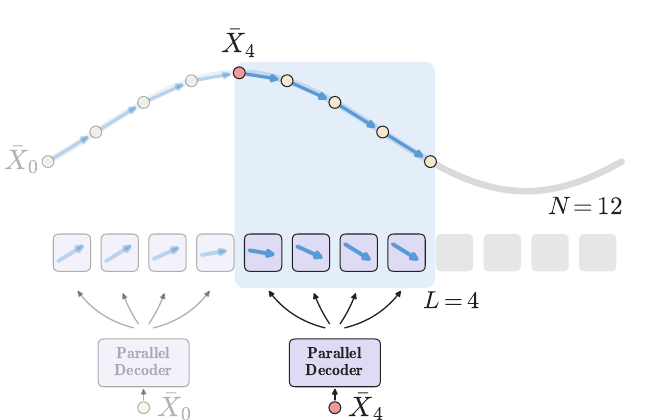
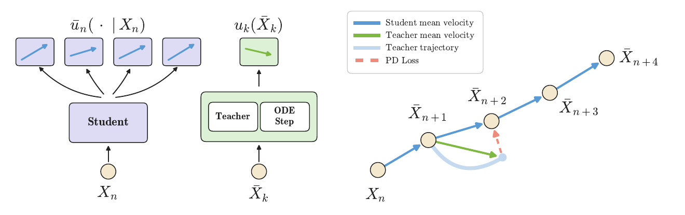
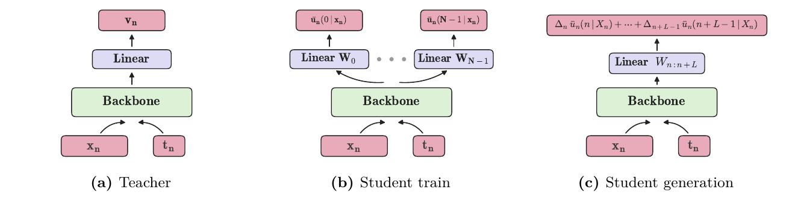
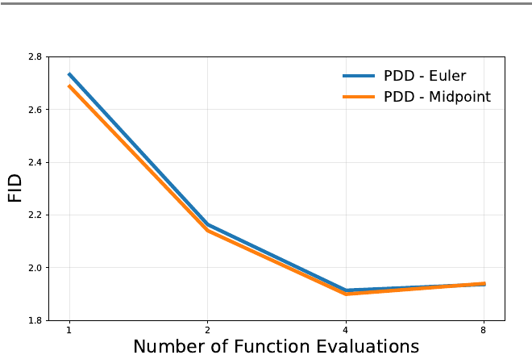
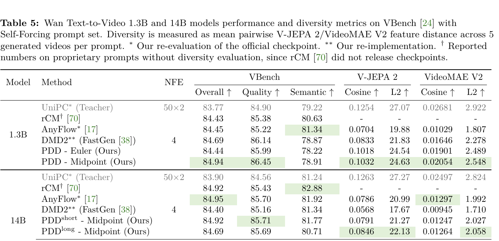
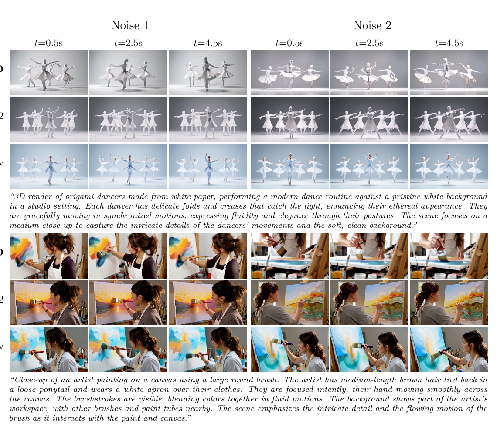
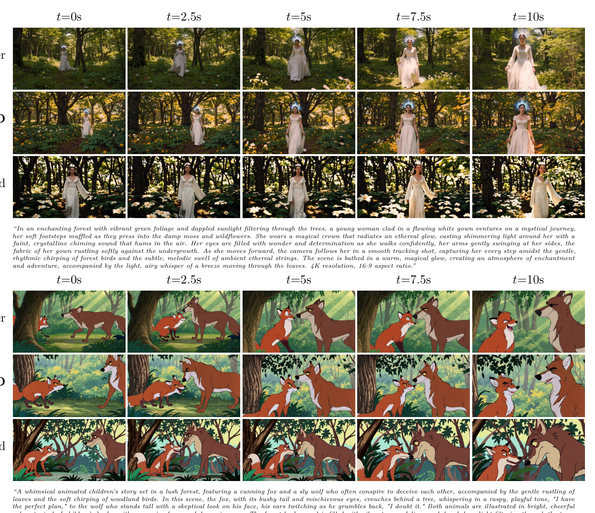

# PDD: Parallel Decoding Distillation for Fast Image and Video Generation

> Neta Shaul, Chao Liu, Arash Vahdat†, Julius Berner† (†equal advising)  
> NVIDIA + Weizmann Institute of Science · arXiv:2607.26004 · 2026-07-28 · [project](https://research.nvidia.com/labs/genair/pdd)

---

## 1. 一句话定位

**不要把多个去噪步压成一大步,而是让一次前向同时预测多个步。** PDD 把时间轴离散成 `N` 个区间、按 `L` 个一组分块,训一个 **parallel decoder**:给定块首状态 `X_n`,**一次网络前向输出块内全部 `L` 个区间的平均速度**。生成时 `N/L` 步走完,训练时只用一个 MSE 回归到 teacher 的 Runge-Kutta 近似——**没有 VSD、没有 GAN、没有 JVP、没有有限差分、没有多阶段**。

顺带解决了两件事:**推理时靠 layer fusion 做到零额外开销**,以及**同一个模型支持可变 NFE**(不需要引入第二个时间坐标)。

---

## 2. 要解决的问题

### 2.1 视频蒸馏被 distribution-based 方法垄断,而它们有硬伤

蒸馏分两大家族:

| 家族 | 代表 | 思路 | 问题 |
|---|---|---|---|
| **Trajectory-based** | Progressive Distillation、Consistency Models、flow maps、Pi-Flow | student 复现 teacher 的采样轨迹 | 图像上还行,**上到视频就画质掉、训练算法贵**;而且常依赖 **JVP 或有限差分**——在大模型上要么贵要么训练不稳 |
| **Distribution-based** | DMD/DMD2、f-distill、SiD、ADD/LADD/APT | 只对齐 student 与 teacher 的边际分布 | **当前视频蒸馏的主流**,但众所周知**训练目标难优化、对超参敏感、需要额外可训练参数、会 mode collapse**,导致**多样性丧失和视频不动** |

近期工作(rCM、AnyFlow)试图给 distribution-based 掺一点 trajectory-based 正则,但**仍然是交替训练目标、显存高、仍然 mode collapse**。

📌 论文的立场很直接:**做一个纯 trajectory-based 的方法,把视频这块拿下来**。摘要里的原话是它是 "the first pure trajectory-based distillation method for few-step, high-resolution video generation"。

### 2.2 "把多步压成一步"这个思路本身有代价

传统 trajectory 蒸馏是**合并**:把 `L` 个去噪步压成一个更大的步。要做到这一点,通常需要学 **flow map**(任意两个时刻之间的映射),而 flow map 需要:

- **第二个时间坐标**(起点 + 终点),模型要多一个条件输入;
- **JVP 或有限差分**去回归速度场的导数——大模型上贵,或者数值不稳。

PDD 换了个角度:**不合并,而是并行**。一次前向出 `L` 个方向,推理时再把它们加权融合成一个方向。这样**导数根本不用算**。

---

## 3. 与前作的关系

> **Fig 2 逐段解读**：
>
> **上半(轨迹)**——一条从 `X̄_0`(左下浅灰)到右侧的采样轨迹,总共 `N = 12` 个区间(右侧标注)。轨迹上的圆点是各个离散时刻的状态。**浅蓝色高亮的矩形框圈出了一个 block**,标注 `L = 4`,块首是红色的 `X̄_4`。块内四段被画成**深蓝色粗箭头**——它们是同一次前向的产物。
>
> **下半(解码器)**——一排 12 个小方格对应 `N = 12` 个区间,每格里画着该区间的速度方向箭头。**只有高亮块内的 4 格是深色实心的**,底下用四条黑色箭头连到一个 `Parallel Decoder` 方框,方框的输入是红色的 `X̄_4`。左侧灰色的那一组(`Parallel Decoder` + `X̄_0`)是上一个块,已经算完、置灰。
>
> **这张图的信息量在于对比关系**:左边灰色块和中间深色块**用的是同一个 decoder、同样一次前向**,各自吐出 4 个方向。所以走完 12 个区间只需要 `N/L = 3` 次网络评估。右侧剩下的 4 个浅灰格子是还没轮到的块。

**最直接的对手是 Pi-Flow**。两者的共同观察是:**给定预训练 flow 模型,区间 `[t_n, t_{n+L}]` 内的轨迹完全由块首状态决定**。但用法不同:

| | Eulerian/Lagrangian Flow Maps | **Pi-Flow** | **PDD(本文)** |
|---|---|---|---|
| NFE | 可变 | **固定** | **可变** |
| 需要 JVP / 有限差分 | **需要** | 不需要 | 不需要 |
| 推理时的输出头 | Linear | **高斯混合** | **Fused-linear** |

- **Pi-Thu 把区间内的积分委托给一个小的可学习 policy head**(高斯混合参数化),蒸馏的是**连续时间的瞬时速度 `v`**。
- **PDD 用同一个观察去论证"并行预测"这个范式**,蒸馏的是**离散化后的平均速度 `u` 的数值近似**;靠 layer fusion 在推理时**不产生任何额外开销**;而且训练算法**天然支持不同 NFE**,Pi-Flow 只能固定 NFE。

论文的总结是:**把重点从"更有表达力的参数化"(高斯混合)转移到"更好的监督"**。

**其它相关线**:
- **Progressive Distillation**——最早的轨迹蒸馏,靠多阶段逐步加大步长。
- **Consistency Models 家族**——从轨迹上任意中间态直接映射到干净态,自一致性条件。
- **从零训练的 flow map 方法**(把 flow matching 目标和轨迹蒸馏目标合起来,用模型自身当 teacher)——PDD 说自己"原则上可以扩展成自蒸馏,但那需要完全不同的 pipeline、更大数据集和显著更多算力"。

📌 **仓库内横向**:PDD 与 [TDM](../../inference_acceleration/tdm/analysis.md) 同属 trajectory-based 且都是 data-free,但 TDM 做的是"轨迹上每个点的**分布匹配**",PDD 做的是"轨迹上每个区间的**速度回归**"——PDD 更纯粹(没有 fake score、没有对抗)。而 [RVM](../rvm/analysis.md) 出自同一批 NVIDIA 作者(Vahdat、Berner),但那篇是 **RL 对齐**不是蒸馏,两者正交。

---

## 4. 核心方法

### 4.1 平均速度与分块

对一个 flow 过程 `dX_t/dt = v_t(X_t)`,把 `[0,1]` 离散成 `0 = t_0 < t_1 < ... < t_N = 1`。**精确解**在每个区间上是

$$
X_{n+1} = X_n + (t_{n+1} - t_n)\, u_n(X_n)
$$

其中 `u_n` 是第 `n` 个区间的**平均速度**:

$$
u_n(X_n) = \frac{1}{t_{n+1} - t_n}\int_{t_n}^{t_{n+1}} v_t(X_t)\, dt
$$

数值方法就是在近似这个积分:

- **Euler**:`u_n(X_n) ≈ v_{t_n}(X_n)`(teacher 前向 1 次)
- **Midpoint**:`u_n(X_n) ≈ v_{t_mid}(X_mid)`,其中 `X_mid = X_n + (t_{n+1}-t_n)/2 · v_{t_n}(X_n)`、`t_mid = (t_{n+1}+t_n)/2`(teacher 前向 2 次)

**Parallel decoder** 的定义:对块首状态 `X_n ~ p_{t_n}`,`ū_θ^n(· | X_n) ∈ X^L` 用**一次前向**预测块内所有区间的平均速度

$$
\bar{u}_\theta^n(k \mid X_n) \approx u_k(X_k), \qquad k = n, \ldots, n+L-1
$$

📌 **这个定义是良定的**,因为块内的离散过程 `X_k` 完全由精确解和块首状态 `X_n` 决定——**不需要额外信息**。这正是 Pi-Flow 也依赖的那个观察。

**并行化过程**(把 decoder 代进更新式):

$$
\bar{X}_{k+1} = \bar{X}_k + (t_{k+1} - t_k)\,\bar{u}_\theta^n(k \mid X_n), \qquad \bar{X}_n = X_n
$$

注意 `ū_θ^n(·|X_n)` **只依赖块首 `X_n`**,所以整条 `(X̄_k)_{n≤k≤n+L}` 用**一次** decoder 评估就能模拟出来。

**采样**就是重复块步:

$$
\bar{X}_{n+L} = X_n + \sum_{k=n}^{n+L-1}(t_{k+1} - t_k)\,\bar{u}_\theta^n(k \mid X_n)
$$

重复 `N/L` 次即可。

### 4.2 PD loss

> **Fig 3 逐面板解读**：
>
> **左面板(两个模块的对比)**——**紫色的 `Student`** 接收 `X_n`,一次前向吐出**四个紫色方格**,每格里一个蓝色箭头,即 `ū_n(· | X_n)` 的四个分量。**绿色的 `Teacher + ODE Step`** 接收 `X̄_k`,只吐出**一个绿色方格**(一个绿色箭头),即 `u_k(X̄_k)`。
>
> 这一组对比把成本讲清楚了:**student 一次前向给 L 个方向,teacher 一次(Euler)或两次(Midpoint)前向只给 1 个方向**——所以 PD loss 在大模型上是可负担的。
>
> **右面板(loss 怎么算)**——图例:**蓝色粗箭头 = student mean velocity,绿色箭头 = teacher mean velocity,浅蓝曲线 = teacher trajectory,红色虚线 = PD Loss**。
>
> 从 `X_n` 出发,蓝色箭头链依次到达 `X̄_{n+1}`、`X̄_{n+2}`、`X̄_{n+3}`、`X̄_{n+4}`——**这整条折线是 student 一次前向产生的**。然后在链上**随机挑一个状态**(图中挑了 `X̄_{n+1}`),从它出发画一条绿色箭头(teacher 在该区间的平均速度)和一条浅蓝弧线(teacher 的真实轨迹)。**红色虚线连接 student 箭头的终点和 teacher 箭头的终点,那个差就是 PD loss。**
>
> 📌 值得注意的是绿色箭头和浅蓝弧线**不重合**——绿色是弦(平均速度),浅蓝是弧(真实轨迹)。这就是 Runge-Kutta 近似误差,论文说它是"可控的"。

训练目标就一个式子:

$$
\mathcal{L}_{\mathrm{PD}}(\theta) = \mathbb{E}\left[\left\lVert \bar{u}_\theta^n(k \mid X_n) - u_k\big(\mathrm{sg}(\bar{X}_k)\big)\right\rVert^2\right]
$$

- 块首索引 `n ∈ {0, L, ..., N-L}` 和块内索引 `k ∈ {n, ..., n+L-1}` **均匀采样**
- `X_n` 由 interpolant 过程 `X_t = (1-t)X_0 + tX_1` 采出
- `X̄_k` 来自并行化过程(**同一次 decoder 前向**)
- `u_k` 用一步 Runge-Kutta 近似(teacher 前向 1–2 次)
- **`sg(·)` 停梯度**

**Proposition 1**:PD loss 的最小值点满足并行解码条件。也就是说——**在可控的 Runge-Kutta 近似误差内,最优解精确地采样 teacher 的轨迹**(`X̄_n = X_n`,`n = 0,...,N`)。

📌 这个保证是 trajectory-based 方法相对 VSD 类方法的结构性优势:**目标函数直接对应"复现 teacher 轨迹"这个可验证的条件**,而不是一个难优化的散度。

**Data-free 训练(Algorithm 3)**——没有数据时,不用 interpolant 过程采 `X_n`,而是**边采样边训练**:采一个 `X_0 ~ p_0`,接下来 `N/L - 1` 次迭代里,**decoder 的输出既用于优化步、又用于把状态往前推**。推进状态时施加 stop-gradient,所以**不产生额外显存或算力开销**。

⚠️ 论文所有大规模实验(Qwen-Image、Wan2.1、LTX-2.3)**都用这个 data-free 模式**,只有 ImageNet 用了真实数据。

### 4.3 架构：N 个线性头 + 推理时融合

> **Fig 4 逐面板解读**：三张结构图共享同样的底部——粉色的 `x_n` 和 `t_n` 输入到绿色的 `Backbone`。
>
> - **(a) Teacher**——`Backbone` 上面接一个紫色 `Linear`,输出单个粉色的 `v_n`。即 `v_t(x) = W·H_t(x)`。
> - **(b) Student train**——`Backbone` **完全不变**(同样的绿色框),但上面接了 **`N` 个并列的 Linear**:`Linear W_0` … `Linear W_{N-1}`(中间用省略号表示),各自输出 `ū_n(0|x_n)` … `ū_n(N-1|x_n)`。**注意是 `N` 个头而不是 `L` 个**。
> - **(c) Student generation**——只有**一个** `Linear W_{n:n+L}`,输出 `Δ_n ū_n(n|X_n) + ... + Δ_{n+L-1} ū_n(n+L-1|X_n)`,即**块内加权平均后的那一个方向**。
>
> **(b) 和 (c) 的对比是这张图的全部重点**:训练时需要 `L` 个不同方向来构造块内轨迹(才能算 PD loss),但**生成时只需要它们的加权平均**——于是可以把 `L` 个线性层**离线融合成一个**。**推理时的计算量和 teacher 完全一样。**

形式化:假设 teacher 是 `v_t(x) = W H_t(x)`,则 student 学 `N` 个线性层,

$$
\bar{u}_\theta^n(k \mid x_n) = W_k^\theta\, H_{t_n}^\theta(x_n)
$$

**为什么是 `N` 个头而不是 `L` 个?** 因为这样**一个模型就能预测任意块大小,而不需要引入第二个时间坐标**——flow map 类方法(需要"从哪到哪"两个时刻)必须多一个条件输入,PDD 不用。实践中只关心某个子集,所以设 `L_min ≤ L_max`,训练时 `n` 取 `L_min` 的倍数、`k` 在 `{n, ..., n+L_max-1}` 内采样。

**Layer fusion(Eq. 14–15)**:生成时只需要加权平均方向,

$$
\bar{X}_{n+L} = \bar{X}_n + (t_{n+L} - t_n)\, W_{n:n+L}^\theta\, H_{t_n}^\theta(\bar{X}_n), \qquad
W_{n:n+L}^\theta = \sum_{k=n}^{n+L-1}\Delta_k W_k^\theta,\quad \Delta_k = \frac{t_{k+1}-t_k}{t_{n+L}-t_n}
$$

📌 **这里是全文最漂亮的一步**:共享的 backbone `H_{t_n}^θ` 学到的其实是**整个区间 `[t_n, t_{n+L}]` 上平均速度的表示**——但**不是靠 JVP 或有限差分去回归导数**,而是**用可学习的线性映射 `W_k^θ` 把平均速度分解成并行的子区间预测**。训练时梯度穿过共享 backbone,**在期望意义上恢复了学习整区间平均速度的训练信号**。

实际收益:推理时不用付大 final layer 的开销,每个块只需在显存里放**一个**融合后的线性层。

**初始化**:把 teacher 最后一层的权重在通道维**重复 `N` 次**,等价于所有并行步都从预训练最后一层出发。

---

## 5. 实验结果

**训练设置共性**:AdamW,weight decay 0,backbone 与 teacher 完全一致。三个设计选择是 **① 时间离散化(`N` 与 shift 变换)② Runge-Kutta 方法(Euler / Midpoint)③ `L_min` / `L_max`(决定推理可用的 NFE 集合)**。

时间离散化用 shift 变换:

$$
t_n = \mathrm{shift}_s\!\left(\frac{n}{N}\right), \qquad \mathrm{shift}_s(t) = \frac{t}{1 + \left(\tfrac{1}{s} - 1\right)t}
$$

📌 **公平性处理**:因为 Midpoint 要两次 teacher 前向,所以对 Euler 做对照时**在每个块内累积两个区间的 Euler loss**,保证 teacher 调用次数一致。

| | ImageNet-256 | Qwen-Image 20B | Wan2.1 1.3B/14B | LTX-2.3 22B |
|---|---|---|---|---|
| Teacher | SiT-XL+REPA | Qwen-Image | Wan2.1 | LTX-2.3 |
| `N`(Euler / Midpoint) | 128 / 64 | 256 / 128 | 256 / 128 | 256(仅 Euler) |
| 时间离散 | 均匀 | shift `s=5` | shift `s=6` | shift `s=10` |
| CFG `w` | 2.7 / 2.9 / 3.2 | 4 | 5(+跳层) | 视频 4.5 / 音频 7 |
| 可用 NFE | 1, 2, 4, 8 | 2, 4, 8 | 2, 4, 8 | 4, 8 |
| batch | 2048 | 2048 | 256 | 2048 |
| lr | 5e-5 | 1e-5 | 1e-5 | 1e-5 |
| 迭代数 | 300k | 3k | **250**(1.3B/14B-short)/ 3.5k(14B-long) | **250** |
| EMA | 0.99995 | 无 | 无(long 用 0.99) | 无 |
| 数据 | ImageNet(有数据) | **data-free** | **data-free** | **data-free** |

📌 **CFG 被折进 teacher 速度**(`v_t^w(x|c) = v_t(x) + w(v_t(x|c) - v_t(x))`),所以 **student 推理时不需要额外的网络评估**——各种 guidance 方法的开销全部在蒸馏阶段消化掉了。

📌 **一个实测出来的小技巧**:Wan 上**在无条件分支的前向里跳过一层**能提升 PDD 表现(1.3B 跳第 10 层,14B 跳第 12 层)。

### 5.1 ImageNet-256（可变 NFE 的验证）

> **Fig 6 解读**：横轴 NFE(1/2/4/8,对数刻度),纵轴 FID。两条曲线分别是 PDD-Euler 和 PDD-Midpoint,guidance scale 2.9。
>
> 整体趋势是 **NFE 增加 FID 下降**——这验证了"**一套权重能在不同 NFE 之间共享**"这个核心主张(否则曲线不会单调)。**Midpoint 全程低于 Euler**。
>
> ⚠️ 但 **8 NFE 处 FID 反而回升**。论文的解释是这可以通过**降低 guidance scale** 缓解,代价是低 NFE 时 FID 变差(附录 Fig 8 有完整的 guidance 扫描)。也就是说 **"一套权重通吃所有 NFE" 并不是完全免费的**——最优 guidance 随 NFE 变化。

单步 FID 对比(guidance 2.9):

| 方法 | FID↓ |
|---|---|
| Pi-Flow | 2.85 |
| **FreeFlow** | **1.45** |
| PDD - Euler | 2.73 |
| PDD - Midpoint | 2.69 |

⚠️ **PDD 明显输给 FreeFlow(2.69 vs 1.45)**。论文的辩护是 PDD **① 目标更简单**(没有 Pi-Flow 的高斯混合,也没有 FreeFlow 的额外网络)**② 支持多个 NFE 预算**。这个辩护成立,但差距接近一倍,不宜忽略。

### 5.2 Qwen-Image（T2I，本文最有说服力的一组）

**benchmark 总分(Table 3)**:

| 方法 | NFE | OneIG-EN↑ | DPG-Bench↑ | GenEval↑ |
|---|---|---|---|---|
| Euler*(teacher) | 50×2 | 0.537 | 88.30 | 0.86 |
| TwinFlow* | 2 | 0.493 | 86.67 | 0.82 |
| PDD - Euler | 2 | 0.508 | 88.04 | **0.86** |
| PDD - Midpoint | 2 | 0.516 | 88.10 | **0.86** |
| DMD2*(Lightning-step4-v2) | 4 | 0.524 | 88.25 | 0.85 |
| Pi-Flow* | 4 | 0.533 | 88.11 | 0.85 |
| PDD - Euler | 4 | 0.535 | 88.45 | **0.86** |
| **PDD - Midpoint** | 4 | **0.538** | **88.66** | **0.86** |
| DMD2*(Lightning-step8-v2) | 8 | 0.526 | 88.20 | 0.84 |
| Pi-Flow* | 8 | 0.536 | 87.90 | 0.84 |
| PDD - Euler | 8 | 0.538 | 88.51 | **0.86** |
| **PDD - Midpoint** | 8 | **0.541** | 88.46 | 0.85 |

**4 NFE 的 PDD-Midpoint(0.538 / 88.66)已经超过 50×2 NFE 的 teacher(0.537 / 88.30)。**

**人类偏好与多样性(Table 4)——这张才是重点**:

| 方法 | NFE | HPSv2↑ | PickScore↑ | **OneIG diversity↑** |
|---|---|---|---|---|
| Euler*(teacher) | 50×2 | 30.83 | 22.78 | **0.200** |
| TwinFlow* | 2 | 29.86 | 22.26 | 0.131 |
| PDD - Euler | 2 | 29.59 | 22.47 | 0.197 |
| PDD - Midpoint | 2 | 30.15 | 22.66 | 0.177 |
| **DMD2***(step4-v2) | 4 | **32.34** | **22.98** | **0.095** |
| Pi-Flow* | 4 | 30.94 | 22.67 | 0.182 |
| PDD - Euler | 4 | 31.05 | 22.72 | 0.192 |
| PDD - Midpoint | 4 | 31.33 | 22.86 | 0.174 |
| **DMD2***(step8-v2) | 8 | **32.35** | 22.95 | **0.109** |
| Pi-Flow* | 8 | 31.09 | 22.55 | 0.186 |
| PDD - Euler | 8 | 31.34 | 22.73 | **0.198** |
| PDD - Midpoint | 8 | 31.56 | 22.86 | 0.181 |

📌 **DMD2 在 HPSv2/PickScore 上赢,但 diversity 只有 0.095–0.109,而 teacher 是 0.200——掉了一半以上。** 这就是 mode collapse 的量化证据。PDD-Euler 在 8 NFE 时 diversity 0.198,**几乎完全保住了 teacher 的多样性**。

**这组数据把 trade-off 摆得很清楚:偏好分和多样性在这里是对立的,DMD2 用多样性换了偏好分。**

### 5.3 Wan2.1 T2V

> **Table 5 解读**：多样性用**每个 prompt 生成 5 条视频,再用 V-JEPA 2 / VideoMAE V2 编码后算成对特征距离**(cosine 和 L2,越大越多样)。teacher 那一行是灰色的参照。
>
> **Wan2.1 1.3B(4 NFE)**——PDD-Midpoint 拿到 **Overall 84.94 / Quality 86.45 双第一**,而且 **V-JEPA 2 cosine 0.1032 / L2 24.63 也是全表最高**(最接近 teacher 的 0.1254 / 27.07)。**质量和多样性同时第一**,这是这张表最强的一格。
> - ⚠️ 但 **Semantic 78.91 是全表倒数第二**(只高于 PDD-Euler 的 78.22),远低于 AnyFlow 的 81.34 和 teacher 的 79.22。
>
> **Wan2.1 14B**——PDD **不是第一**:4 NFE 时 Overall 84.92 略输 AnyFlow 的 84.95,8 NFE 时 84.96 输给 85.08。论文自己写的是 "runner-up to AnyFlow"。PDD 拿到的是 **Quality 第一**(85.71 / 85.83)和 **diversity 第一**。
> - **`short`(250 步)与 `long`(3.5k 步)的对比很有意思**:long 的 VBench Overall **更低**(84.69 vs 84.92),但 **diversity 更高**(L2 22.13 vs 21.27)。论文说"训练后期视频中的运动会增加",并把这归到 VBench dynamic degree 上。
>
> 📌 **这暴露了 VBench 与"视频是否真的在动/是否多样"之间的张力**——训得更久,人眼看到的运动更多,但 VBench 分数反而降。论文点到即止,没有深究。

> **Fig 5 逐行解读**：两组 prompt,每组三行(PDD / DMD2 / AnyFlow),**左右两半是两个不同的噪声种子**(Noise 1 / Noise 2),各取 t=0.5s / 2.5s / 4.5s 三帧。**关键在于横向对比同一方法在两个种子下的差异有多大**。
>
> - **第一组(白纸折纸舞者,纯白背景)**——**DMD2 那一行两个种子的构图几乎一样**:同样的人数、同样的站位、同样的姿态。**AnyFlow 同样高度雷同**。而 **PDD 两个种子给出了明显不同的编排**(舞者数量、朝向、裙摆展开程度都不同)。
> - **第二组(艺术家用大圆刷在画布上作画)**——DMD2 和 AnyFlow 的两个种子都是相似的构图和色调;PDD 的两个种子在画面色彩(暖橙 vs 冷蓝)和取景上差异明显。
>
> **这就是 Table 4 里 diversity 数字的视觉版本**:distribution-based 方法把不同噪声都收敛到同一个模式上了。

### 5.4 LTX-2.3 音视频（22B，10 秒 720p 带音频）

> **Fig 7 逐行解读**：两组 prompt,每组三行——**Teacher(4×30 NFE)、PDD(8 NFE)、官方 Distilled(8 NFE)**,横向是 t=0/2.5/5/7.5/10 秒。
>
> - **第一组(魔法森林里穿白裙戴发光王冠的女子)**——Teacher 的光影层次和裙摆细节最好。**PDD 与 Teacher 的构图、机位推进、人物姿态高度一致**(逐帧对得上),画质接近。**官方 Distilled 那一行画面明显偏暗、背景森林细节糊成一片**,而且人物位置与 teacher 的轨迹偏离。
> - **第二组(儿童绘本风格的狐狸与狼)**——Teacher 和 PDD 都保持了明亮的绘本配色和角色一致性;Distilled 行的角色造型在后几帧发生了变化(狼的体型、颜色偏移)。
>
> 📌 **"跟 teacher 对得上"是 trajectory-based 方法的固有特征**,也是 PDD 在这张图上最直观的优势——它不是在生成"另一个好视频",而是在**复现 teacher 会生成的那个视频**。

**量化对比**(附录 Fig 22,Gemini 3.1 Pro Preview 当裁判,100 条 held-out prompt × 3 seed = 300 组配对):

| 维度 | PDD 胜 | 平 | 负 |
|---|---|---|---|
| Prompt alignment | 112(37.3%) | 103(34.3%) | 85(28.3%) |
| Visual quality | 98(32.7%) | 105(35.0%) | 97(32.3%) |
| Motion quality | 107(35.7%) | 97(32.3%) | 96(32.0%) |
| Audio quality | 90(30.0%) | 124(41.3%) | 86(28.7%) |
| **四维平均** | **142** | **35** | **123** |

⚠️ **均分 2.62 vs 2.59** —— 这个优势非常微弱。

工程细节:PD loss **对音频和视频 latent 分别计算再平均**;teacher 侧同时用了三种 guidance(标准 CFG、cross-modal guidance 3、spatiotemporal skip guidance 2 on layer 29),合计 **4×30 NFE**;PDD **只训了 250 次迭代**、**完全不用训练数据**就做到了与官方蒸馏模型持平或略好。

---

## 6. 争议与权衡

**① 训练迭代数少得反常,而且 checkpoint 是在评测集上挑的。** Wan2.1 1.3B 只训 **250 步**,每 25 步评一次 VBench,**Euler 的最佳 checkpoint 出现在第 25 步**;Qwen-Image 训 3k 步,每 250 步评三个 benchmark,**报的是三者平均最高的那个 iteration**(Euler 选 1250、Midpoint 选 2250)。这是**用测试指标做模型选择**,报出来的数字带有选择偏差。250 步就能出 SOTA 固然说明收敛快,但也意味着**方差很大、结果对 checkpoint 敏感**。

**② Wan 14B 上 PDD 并不是最好的。** Overall 4 NFE 84.92 < AnyFlow 84.95,8 NFE 84.96 < 85.08。论文诚实地写了 "runner-up",但摘要里 "achieving SOTA video quality generation with 4 NFE on VBench" 的表述容易让人以为是全面第一——实际只有 **Quality 这一维**和 **diversity** 是第一,而且 **1.3B 才是 Overall 第一**。

**③ Semantic 维度是系统性短板。** 1.3B 上 PDD 的 Semantic(78.22 / 78.91)是全表最低两名,**连 teacher 的 79.22 都不如**;14B 上也低于 AnyFlow 和 rCM。轨迹蒸馏理论上应该复现 teacher 的行为,**Semantic 掉到 teacher 以下需要解释,论文没给**。

**④ LTX 的胜负极其接近,而且用 VLM 当裁判。** 142 胜 / 35 平 / 123 负,均分 2.62 vs 2.59。300 组配对下这个差距基本落在噪声范围内,论文也没报置信区间。用 Gemini 打分本身是合理的省钱做法,但**没有与人类评分做过校准**。

**⑤ diversity 指标是自定义的。** "V-JEPA 2 / VideoMAE V2 特征的成对距离"是个合理的代理,但不是社区标准指标,也**没有与人类对"多样性"的判断做校准**。好在 Fig 5 的定性图和 OneIG diversity(第三方指标)都指向同一结论,所以主张本身可信度不低。

**⑥ 训练显存代价被回避了。** 训练时最后一层要**复制 `N` 份**(`N = 128~256`),对 20B/22B 模型这不是小开销。论文只强调"推理时可以 fuse 掉",**全文没有给出任何训练显存或 wall-clock 成本数字**——而它恰恰是以"VSD 方法训练贵、显存高"为主要批评点的。**一篇讲 scalable 的蒸馏论文不报训练成本,是明显的缺失。**

**⑦ 大规模实验全是 data-free,数据依赖设定完全没测。** 论文自己把 "investigating PDD in data-dependent settings beyond ImageNet-256" 列为 future work。所以"PDD 在有数据时是否更好"是未知的。

**⑧ 可变 NFE 不是完全免费的。** Fig 6 显示 8 NFE 时 FID 反而回升,要靠调低 guidance scale 缓解,而这又会损害低 NFE。也就是说**"一套权重通吃 1/2/4/8 步"在实践中仍需按 NFE 调 guidance**,这个代价论文放在附录里。

**⑨ ImageNet 单步输给 FreeFlow 近一倍**(2.69 vs 1.45)。辩护(更简单、支持多 NFE)成立,但这说明**在纯图像质量这个维度上 PDD 并不领先**。

**⑩ 正面:Proposition 1 提供了 VSD 类方法没有的正确性保证。** PD loss 的最小值点满足并行解码条件,即在 RK 误差内精确复现 teacher 轨迹。目标函数与"想要的行为"之间有可证明的对应关系,这在蒸馏文献里并不常见。

**⑪ 正面:layer fusion 是真的优雅。** 训练时需要 `L` 个方向来构造块内轨迹,生成时只需要它们的加权平均——于是把 `L` 个线性层离线融合成一个,**推理开销与 teacher 完全相同**。用可学习的线性分解替代 JVP/有限差分去获得平均速度表示,这个思路可以迁移到别的地方。

**⑫ 正面:把 diversity 当一等公民来测。** 视频蒸馏领域长期只报 VBench 这类质量分,而 mode collapse 恰恰在这类指标上不可见。PDD 用三种独立方式(OneIG diversity、V-JEPA/VideoMAE 特征距离、同种子对比的定性图)交叉验证同一个主张,**这个评测设计比方法本身更值得学**。

---

## 7. 一句话总结

PDD 的关键动作是**把"合并多步"换成"并行出多步"**:同一个 backbone 加 `N` 个线性头,一次前向吐出块内全部区间的平均速度,训练时用这些方向拼出块内轨迹去和 teacher 的 Runge-Kutta 近似做 MSE,生成时把这些线性头按步长加权**融合成一个**——于是既拿到了整区间平均速度的表示(**不必用 JVP 或有限差分回归导数**),又在推理时**零额外开销**,还顺带支持可变 NFE;代价是训练期最后一层膨胀 `N` 倍(论文没报这个成本),收益是**在视频蒸馏上第一次让纯 trajectory-based 方法追平 distribution-based,并且明显保住了后者丢失的多样性**。

---

## Q&A

**Q: "并行预测多步"和"把多步合并成一大步"到底差在哪?为什么前者不需要 JVP?**

A: **差在"你要学的东西是什么"。**

**合并路线(flow map)**要学的是"从 `t_n` 直接跳到 `t_{n+L}` 的那一个映射"。这个映射的正确性条件涉及**速度场沿轨迹的导数**,所以要么用 **JVP**(Jacobian-vector product)显式算,要么用**有限差分**近似。前者在 20B 级模型上很贵,后者数值不稳。而且 flow map 需要**两个时间坐标**(起点和终点),模型得多一个条件输入。

**并行路线(PDD)**要学的是"块内每个子区间各自的平均速度"。每个子区间的平均速度**都可以由 teacher 走一步 Runge-Kutta 直接给出**——`u_k ≈ v_{t_k}(X_k)`(Euler)或 midpoint 版本。**这是一个纯回归目标,不涉及任何导数。**

那整区间的平均速度怎么办?**它是子区间平均速度的加权和**,所以推理时把 `L` 个线性头按步长比例融合就得到了(Eq. 14–15)。论文的说法是:共享 backbone 在训练时**在期望意义上恢复了学习整区间平均速度的训练信号**——**用可学习的线性分解替代了导数计算**。

顺带解决了时间坐标问题:因为学的是"每个固定区间的速度",索引 `k` 本身就是时间信息,`N` 个头覆盖所有区间,**任意块大小都能组合出来,不需要第二个时间坐标**。

---

**Q: 为什么是 `N` 个线性头而不是 `L` 个?这不是很浪费吗?**

A: **是为了可变 NFE,而且浪费只在训练期。**

如果只有 `L` 个头,那模型就绑死在一个块大小上,推理时只能用 `N/L` 步。而 `N` 个头(每个时间格点一个)意味着**任意起点 `n` 和任意块大小 `L` 都能组合出来**:块 `{n, ..., n+L-1}` 就取对应的那 `L` 个头。这样**一套权重同时支持 NFE = 1/2/4/8**。

代价确实在训练期:最后一层要复制 `N` 份(`N = 128~256`)。但要注意两点:

1. **只有最后一层膨胀**,backbone 完全不变——相对 20B/22B 的总参数量,一个线性层 ×256 的占比不算主导。
2. **推理时通过 layer fusion 完全消除**:`W_{n:n+L} = Σ Δ_k W_k`,每个块只需在显存里放一个融合后的线性层,**计算量与 teacher 一模一样**。

⚠️ 不过论文**始终没有给出训练显存的具体数字**,这是我认为最该补的一块——尤其它把"VSD 方法显存高"当作主要批评点。

---

**Q: PDD 相对 DMD2 的真实优势是什么?**

A: **不是分数,是多样性和训练的可预测性。**

看 Qwen-Image 的 Table 4:**DMD2 在 HPSv2 上赢得很明显**(32.34 vs PDD 31.33),PickScore 也略高。**但 diversity 只有 0.095**,而 teacher 是 0.200——**掉了一半以上**。PDD-Euler 在 8 NFE 时是 0.198,基本等于 teacher。

Fig 5 是这件事的视觉版:同一个 prompt 换两个噪声种子,**DMD2 和 AnyFlow 给出几乎一样的构图**,PDD 给出明显不同的编排。

第二个优势是训练性质。论文的原话是 distribution-based 方法"对超参敏感、需要额外可训练参数、性能在训练迭代之间波动很大(因为交替训练目标)",而 **PD loss 是单一的、显存高效的 MSE,对超参更鲁棒、跨迭代生成一致**。这一点没有量化数据支撑,属于经验陈述。

**所以选型逻辑应该是**:如果你的下游只看偏好分/benchmark,DMD2 类方法可能更划算;**如果你在意生成多样性(比如要用它批量产素材、或者做数据增强),PDD 这条路更合适。**

---

**Q: 250 次迭代就 SOTA,这可信吗?**

A: **数字本身可信,但要理解它的前提和风险。**

**为什么能这么快**:PDD 的 student **完全复用 teacher 的 backbone,只有最后一层是新的(而且从 teacher 权重复制初始化)**。所以它不是在"学生成",而是在"**学怎么把已有的速度场表示重新组合成块内的多个方向**"——这是个相对轻的任务。加上 batch size 2048、目标是纯 MSE(没有对抗/交替优化),收敛快是合理的。

**风险在哪**:

1. **checkpoint 是在评测集上挑的**。Wan 1.3B Euler 最好的 checkpoint 在**第 25 步**,Midpoint 在第 225 步——两个相差近 10 倍。这说明**性能在训练过程中波动很大**,报出来的是包络线上的点。
2. **`short` vs `long` 的结论是矛盾的**:14B 训到 3.5k 步,VBench 反而降(84.92 → 84.69),但多样性和运动增加。**说明"训得久一点"并不单调更好,而是在不同指标之间移动。**

所以更准确的说法是:**PDD 收敛极快,但也需要在训练过程中密切监控并挑 checkpoint**,而不是"训 250 步就稳定拿到 SOTA"。

---

**Q: data-free 训练具体是怎么跑的?**

A: **边采样边训练,把采样过程本身当成数据分布。**

标准模式需要 `X_n ~ p_{t_n}`,靠 interpolant 过程 `X_t = (1-t)X_0 + tX_1` 从真实数据 `X_1` 采出来。没有数据时就没法这么做。

Algorithm 3 的做法是**跟着自己的采样算法走**:

1. 采一个初始噪声 `X_0 ~ p_0`,时间索引 `n = 0`;
2. 每次迭代:decoder 前向一次得到 `u`;在块内随机挑 `k`,用 `u` 推到 `X̄_k`;teacher 在 `X̄_k` 上走一步 RK 给出 `u_k`;算 MSE;
3. **同一次前向的输出还用来把状态往前推** `L_min` 个区间:`x_n ← x_n + Σ h·u`,`n ← n + L_min`;
4. `n` 到达 `N` 时重采噪声、归零。

📌 关键是**第 3 步施加 stop-gradient**,所以推进状态**不产生额外的显存或计算开销**——一次前向同时服务于"训练"和"采样"两个目的。

这也意味着**训练数据就是 student 自己当前的采样轨迹**(on-policy)。论文所有大规模实验(Qwen-Image、Wan、LTX)都用这个模式,只需要 **prompt 集合**,不需要图像或视频。

---

**Q: 和仓库里的 TDM 比,哪个更适合我?**

A: **两者都是 trajectory-based + data-free,但监督信号的层次不同。**

| | [TDM](../../inference_acceleration/tdm/analysis.md) | PDD |
|---|---|---|
| 匹配对象 | 轨迹点的**分布**(反向 KL) | 区间的**平均速度**(MSE) |
| 需要 fake score | ✅ 需要在线训一个 critic | ❌ 不需要 |
| teacher 调用 | 每步 1 次(算 real score) | 每步 1–2 次(Euler/Midpoint) |
| 可变步数 | ✅(步数当条件注入) | ✅(N 个头任意组块) |
| 推理额外开销 | 无 | 无(layer fusion) |
| 视频验证 | CogVideoX-2B,**仅 1 行结果** | Wan 1.3B/14B + LTX-2.3 22B,**完整对比** |
| 是否超过 teacher | ✅ 明确宣称并有用户研究 | 部分指标超过(Qwen-Image 4 NFE) |

选型建议:

- **要最简单的实现** → PDD。它连 fake score 都不需要,就一个 MSE,`N` 个线性头是唯一的架构改动。
- **算力紧张** → TDM。PixArt-α 只要 2 A800 小时;PDD 虽然迭代数少但 batch 2048,实际成本未知。
- **做视频** → PDD。它是唯一在 22B 级音视频模型上做过完整验证的纯 trajectory 方法。
- **在意多样性** → PDD。它是唯一把 diversity 当一等公民测量的。

⚠️ 但两者有个共同的坑:**都严重依赖在评测集上挑 checkpoint**(TDM 的 4 步/1 步不同配置,PDD 的 250 步内每 25 步评一次)。实际落地时要预留独立的验证集。

---

**Q: 这套方法能用到自回归视频模型上吗?**

A: **论文把这个列为 future work,而且明确提到了"离散自回归模型"这个方向。**

结论段的原话是 "generalizing the parallel decoding principle to discrete autoregressive models may broaden the applicability of PDD beyond diffusion and flow-based generation"。

从机制上看有两层可迁移性:

- **对 diffusion-based AR 视频模型**(CausVid / Self-Forcing / RAVEN 这条线):PDD 处理的是**单次生成内部的去噪步**,而 AR 处理的是**chunk 之间的时序**——两者正交,原则上可以叠加:每个 chunk 内部用 PDD 把 4 步压到 1–2 步。但**块首状态决定块内轨迹**这个前提在 AR 设定下要重新检查,因为每个 chunk 还额外条件于 KV cache。
- **对离散 AR 模型**(token 级):"并行解码"这个词在 LLM 那边本来就有对应物(投机解码、Medusa 的多头预测)。PDD 的 `N` 个线性头结构上非常接近 **Medusa 的多头**,差别是 PDD 回归的是连续速度、且有 Proposition 1 那样的正确性保证。这条路看起来最自然。

📌 另一个论文自己提出的、更容易落地的方向:**自适应块大小**。因为块大小是**在评估完 parallel decoder 之后才需要决定的**,所以可以用一个 verifier 或置信度准则**动态决定这一块跳多远**——容易的区间多跳、难的少跳。这在结构上和投机解码的接受/拒绝机制是同一个思路。
