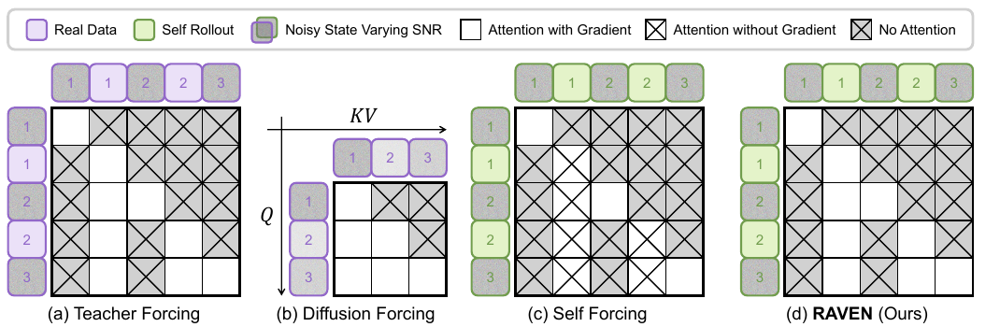
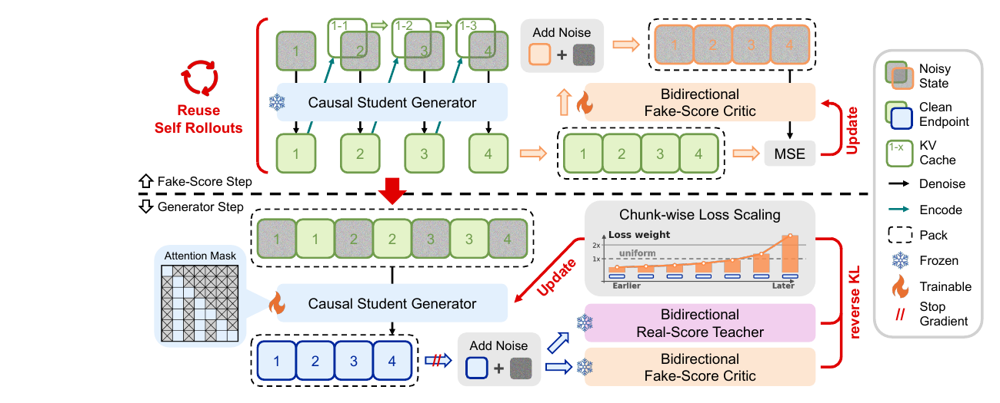
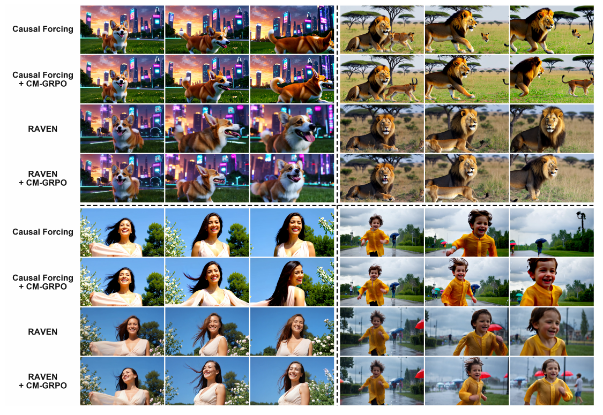
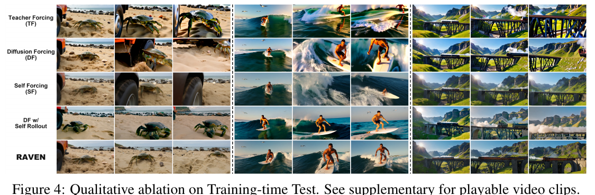
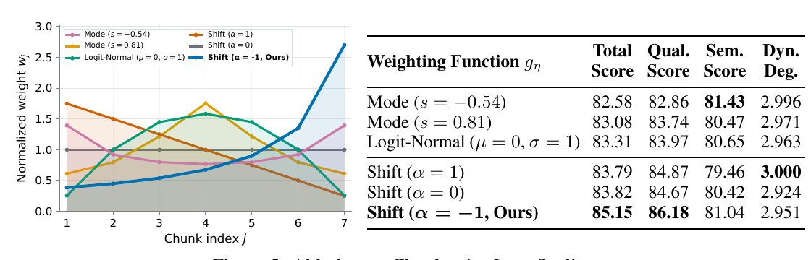
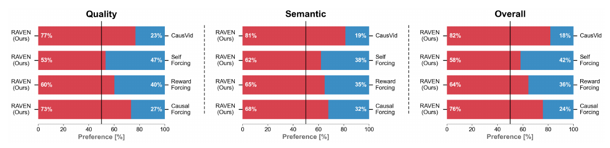

# RAVEN: Real-time Autoregressive Video Extrapolation with Consistency-model GRPO

> Yanzuo Lu, Ronglai Zuo, Jiankang Deng — Imperial College London
> Preprint, 2026-05-14 · [arXiv:2605.15190](https://arxiv.org/abs/2605.15190) · [project](https://yanzuo.lu/raven) · [github](https://github.com/mvp-ai-lab/RAVEN) · [🤗 weights](https://huggingface.co/collections/mvp-lab/raven)

---

## 1. 一句话定位

训练时把 self-rollout 的中间状态**重新打包**成「clean 历史端点 + noisy 去噪状态」交错序列（RAVEN），让后续 chunk 的 loss 能反向传播到前面 chunk 缓存的历史表示；并提出 **CM-GRPO**，直接在 consistency sampler 的 Gaussian 转移核上做 GRPO，消除 Flow-GRPO 引入的 Euler-Maruyama 辅助随机过程带来的训练-推理差距。

---

## 2. 要解决的问题

自回归视频扩散模型推理时用自身生成的 chunk 作为历史，而训练时历史来源各不相同——这导致**历史分布偏差（history distribution gap）**，会随自回归步数累积。

四种已有范式的对比：

| 范式 | 历史来源 | 历史有 end-to-end 监督？ | 推理时分布匹配？ |
|---|---|---|---|
| Teacher Forcing | 真实数据（Real Data） | ✅ 有（real data 是 target） | ❌ 不匹配 |
| Diffusion Forcing | 真实数据 + 随机 SNR 扰动 | ✅ | ❌ |
| Self Forcing | self-rollout 端点（detach） | ❌ detach 截断梯度 | ✅ 匹配 |
| **RAVEN** | self-rollout 端点（attached） | ✅ 梯度可流过历史 | ✅ 匹配 |

Self Forcing 已经对齐了分布，但历史 cache 是 `sg(·)` 截断梯度的，后续 chunk loss 无法监督历史表示；RAVEN 的核心贡献就是用**重打包**消除这一梯度截断。

---

## 3. 与前作关系

- **CausVid** (CVPR 2025)：asymmetric distillation 蒸馏框架原型，从双向 teacher 蒸馏因果 student，DMD 损失。RAVEN 继承其整体架构。
- **Self Forcing** (NeurIPS 2025)：在 CausVid 上加 self-rollout，解决历史分布偏差，但历史是 detached context，无 end-to-end 监督。RAVEN 在 Self Forcing 的基础上增加 generator step 的交错序列重打包。
- **Causal Forcing** (ICML 2026)：Self Forcing + ODE 蒸馏初始化，RAVEN 以此为权重起点。
- **Reward Forcing** (CVPR 2026)：在 DMD 蒸馏里掺 reward 信号,与 CM-GRPO 是同一目标(few-step 因果生成器的偏好对齐)的不同路径,Table 1 里是直接对手。
- **Flow-GRPO** (NeurIPS 2025)：flow matching RL 的原型，需 ODE→SDE 转换 + Euler-Maruyama。CM-GRPO 消除该辅助过程。
- **EAGLE-3**(LLM 投机解码)：RAVEN 明确说 training-time test 的思路来自它——"在模型自己将要产生并遇到的 context 上训练"。区别是 LLM 那边只需把预测的 draft token 喂进下一步,视频这边每个 chunk 是多步去噪轨迹的终点,直接模拟要穿过自回归递归 + 采样器动力学两重反传,所以 RAVEN 改成复用已有 rollout 的重打包。

**一句话定位谱系**:CausVid 立框架 → Self Forcing 对齐历史分布 → Causal Forcing 补 ODE 初始化 → **RAVEN 把历史纳入监督**。四步都在改"历史怎么进训练",这是这条线的主轴。

---

## 4. 核心方法

### 4.1 问题形式化

自回归视频扩散模型的生成概率：

$$
p_\theta(x_{1:T} \mid c) = \prod_{t=1}^{T} p_\theta(x_t \mid h_t, c), \quad h_t = \mathcal{H}(x_{<t})
$$

其中 `h_t` 是 KV cache 编码的历史。噪声状态 `z_t^(n) = α_n x_t + σ_n ε`。

### 4.2 RAVEN：交错序列重打包



> **Fig 1 逐面板解读**：
>
> **先读图例（三种格子必须分清，这是全图的关键）**：
> - **白底空白** = Attention **with** Gradient（有注意力，梯度可回传）
> - **白底打叉** = Attention **without** Gradient（有注意力，但被 stop-gradient 截断）
> - **灰底打叉** = No Attention（根本不在 mask 里）
>
> token 颜色区分历史来源:**紫色**=Real Data(真实数据),**绿色**=Self Rollout(模型自己生成),**灰底 + 彩色描边**=该 token 是 noisy state。
>
> **(a) Teacher Forcing**——序列按 `[ẑ₁, x₁, ẑ₂, x₂, ẑ₃]` 交错排布,x 是**真实数据**(紫)。mask 结构:noisy chunk `t` 能看到自己 + 它前面所有 clean chunk,且**全是白底空白**(有梯度);noisy token 从不作为别人的 key(所以第 1/3/5 列除对角外全是灰底打叉)。**注意 (a) 和 (d) 的 mask 拓扑完全一样**——唯一差别是历史 token 的颜色:紫 vs 绿。这正是论文的论点:TF 的问题不在 attention 结构,只在历史来源与推理不符。
>
> **(b) Diffusion Forcing**——序列退化成 3 个 token(只有 noisy state,没有独立的 clean token),每个 token 被独立采样的 SNR 扰动。mask 是标准下三角因果掩码,全部白底空白。历史即"被加噪的真实前缀",分布与推理时的"自生成 clean 前缀"差得最远。
>
> **(c) Self Forcing**——排布与 (a)(d) 相同,历史换成绿色 self-rollout,**分布已经对齐推理**。但看格子:第 2、4 列(clean 历史)全部是**白底打叉**——有注意力、无梯度。整张图里唯一的白底空白只剩每个 noisy chunk 自己的对角块。这就是 `h_t^SF = sg(H(x̂_<t))` 的图形化:历史被当成只读 context。
>
> **(d) RAVEN（Ours）**——**与 (c) 逐格对比,唯一的改动是把所有"白底打叉"变成"白底空白"**。历史依旧来自 self-rollout(绿),但 clean 端点是在同一次 forward 里被模型重新编码的,后续 chunk 的 DMD loss 会经 attention 回传到"如何编码这些历史"上。
>
> 📌 一个容易误读的点:梯度**不是**流回 `x̂_t` 的数值(rollout 是 no-grad 产生的,数值是常量),而是流回**把 `x̂_t` 编码成 KV 的那组权重 θ**。论文说的 "supervise the history representations" 是这个意思。

**交错序列 `I_u` 的构造（Eq. 5）**

对于 `K` 步 consistency 采样时间步 `τ_1 > ··· > τ_K = 0`，和采样时间 `u ∈ {τ_1, ..., τ_{K-1}}`：

$$
\mathcal{I}_u = \bigl(\dot{z}_1^{(u)},\, \hat{x}_1,\, \dot{z}_2^{(u)},\, \hat{x}_2,\, \ldots,\, \hat{x}_{T-1},\, \dot{z}_T^{(u)}\bigr)
$$

其中 `ẑ_t^(u)` 是第 `t` chunk 在时间步 `u` 的 noisy 去噪状态，`x̂_t` 是对应的 clean endpoint。

- **Clean endpoint `x̂_t`**：作为第 `t+1` chunk 的历史，在 attention 中扮演 KV 来源（带梯度）
- **Noisy state `ẑ_t^(u)`**：作为 `p_θ` 的监督去噪目标，接受 reverse-KL 梯度

这两类 token 在**同一次 causal forward pass**中被处理，后向 chunk 的 loss 经 attention 传回前向 chunk 的历史表示，同时避免了反向传播整条自回归轨迹的代价（rollout 本身在 fake-score step 中已经 no-grad 完成）。

📌 **序列长度是 `2T-1` 不是 `2T`**：`T` 个 noisy state 全在（每个都是监督目标），clean endpoint 只有 `T-1` 个（最后一个 chunk 不需要给谁当历史）。代价是 generator step 的序列长度约为普通 causal 训练的 **2×**，这是 RAVEN 相对 Self Forcing 的主要额外开销。

📌 **为什么不直接反传整条 rollout**：一条 rollout 是 `T` 个 chunk × `K` 步去噪的嵌套递归，端到端反传要同时穿过自回归递归和采样器动力学，显存和计算都不可接受。RAVEN 的取舍是——**只保留"历史如何被编码"这一层梯度，放弃"历史如何被生成"那一层**。前者是 Self Forcing 缺的那块，后者代价太高。

### 4.3 训练流程



> **Fig 2 逐段解读**：
>
> **上半部分（Fake-Score Step）**——冻结（雪花图标）的因果学生生成器做 4 个 chunk 的 AR self-rollout，KV cache 在 chunk 间传递（绿色箭头）。对每个 chunk 产出两类输出：clean endpoint（绿色实线方块，向下输出）和若干 noisy denoising state（灰色渐变方块，向右送入 Fake-Score Critic）。Critic 对加了高斯噪声的 clean endpoint 前向打分，MSE 更新 Fake-Score Critic 参数。
>
> **粗虚线分隔**：fake-score step 的 rollout 状态**不丢弃**，红色大箭头（Reuse Self Rollouts）传递给 generator step 复用。这是 RAVEN 省算力的关键——交错序列的原料是"本来就要算的东西"。
>
> **下半部分（Generator Step）**——把 rollout 的 clean endpoints + noisy states 重打包成交错序列 `I_u`：图上正好 7 个方块，**灰1, 绿1, 灰2, 绿2, 灰3, 绿3, 灰4**，即 4 个 noisy state 夹 3 个 clean endpoint。对应 Eq. (5) 的 `T` 个 noisy + `T-1` 个 clean——**最后一个 chunk 只有 noisy 没有 clean**（它后面没有需要历史的 chunk 了）。左侧 Attention Mask 缩略图接进可训练（火焰）的 Causal Student Generator。
>
> **输出侧的 `//` 是重点**——生成器输出的 `x̂_θ`（蓝色方块）在 Add Noise 之前先过 stop-gradient，即 Algorithm 1 line 22 的 `ẑ^(s) ← sg(α_s x̂_θ + σ_s ε)`。加噪路径不回传梯度，梯度只从 DMD loss 的解析式进入 `x̂_θ`。renoise 后的样本分别送进冻结（雪花）的 Bidirectional Real-Score Teacher（紫）和 Bidirectional Fake-Score Critic（橙），二者之差构成 reverse KL 分数梯度。
>
> **右上角的 Chunk-wise Loss Scaling 小图**——横轴 Earlier→Later，柱高从 1× 以下单调升到 2× 以上，灰色虚线是 uniform 基线。即 `Shift(α = -1)`：越靠后的 chunk 权重越大。

**Algorithm 1 三个阶段**：

1. **Stage 1：Self Rollout**（no-grad）—— 对每个 chunk `t`，consistency sampler 跑 `K` 步，缓存 `{ẑ_t^(τ_k)}` 和 `x̂_t`，更新 KV cache
2. **Stage 2：Fake-Score Step**—— 将 `x̂` renoise，bidirectional fake-score critic 做 MSE 监督，每步更新
3. **Stage 3：Generator Step**（每 `r` 步一次）—— 从 rollout 中采样时间步 `u`，组装 `I_u`，causal forward 生成 `x̂_θ`，consistency renoise 到评分时间步 `s`，teacher + critic 打分，reverse-KL + chunk-wise loss 更新学生

### 4.4 Chunk-wise Loss Scaling

早期 chunk（历史少）和晚期 chunk（历史丰富，需维持一致性）面临质性不同的难度。引入**未来参与分数（future participation score）**：

$$
p_j = \frac{\sum_{k=j}^{J} m_k}{\sum_{k=1}^{J} m_k}
$$

`p_j` = 第 `j` chunk 及其后续 chunk 的 token 占比，单调递减。通过权重函数 `g_η(P)` 映射为 normalized 权重 `w_j`。

**消融最优**：`Shift(α = -1)`。`α < 0` 的具体做法不是把 `π_α` 取负，而是**先把坐标反转**成 `p_J/p_j`，再套 `π_{|α|}`（代码见 `causal_wan_t2v.py:1341-1343`）：

$$
\tilde{w}_j = \pi_{|\alpha|}\!\left(\frac{p_J}{p_j}\right), \qquad \pi_\alpha(p) = \frac{\alpha p}{1 + (\alpha - 1)p}
$$

从 Fig 5 左图读数：7 个 chunk 的归一化权重从 `w_1 ≈ 0.37` 单调升到 `w_7 ≈ 2.7`，**首尾差约 7×**，末端约为 uniform 的 2.7×。直觉：后期 chunk 要在更长历史条件下同时保持语义对齐和抑制误差积累，难度更高，值得更多梯度。

⚠️ 注意 `α = 0`（uniform）拿到 83.82，`α = -1` 拿到 85.15——**单是这一项权重调度就贡献了 1.33 的 Total Score**，和 RAVEN 交错序列本身的贡献量级相当（Table 2 里 SF 84.06 → RAVEN 85.15，也是 1.09）。论文把它当作次要设计写在 Chunk-wise Loss Scaling 小节，但从消融看它并不次要。

### 4.5 CM-GRPO

（Fig 5 的权重曲线放在 §6.4 消融部分。）

**核心思路**：consistency sampler 本身已经是 Gaussian 转移，可以直接在其转移核上做 GRPO，不需要 ODE→SDE 转换。

一次 consistency 采样步从 `u` 到 `s`：`z̃^(s) = α_s x̂_θ + σ_s ε`，对应 Gaussian 转移核：

$$
\pi_\theta\!\left(\tilde{z}^{(s)} \mid \tilde{z}^{(u)}, c\right) = \mathcal{N}\!\left(\tilde{z}^{(s)};\, \mu_\theta^{u \to s},\, \sigma_s^2 I\right), \quad \mu_\theta^{u \to s} = \alpha_s \hat{x}_\theta
$$

对轨迹打 group-relative advantage `Â_i`，log-prob 对 `x̂_θ` 的梯度为：

$$
\nabla_{\hat{x}_\theta} \!\left[-\hat{A}_i \log \pi_\theta\right] = -\hat{A}_i \alpha_s \frac{\tilde{z}_i^{(s)} - \mu_\theta^{u \to s}}{\sigma_s^2}
$$

实现为 stop-gradient 回归目标（Eq. 9）：

$$
\mathcal{L}_{\text{CM-GRPO}} = \mathbb{E}_{i,u,s} \left[ \left\lVert \hat{x}_\theta - \text{sg}\!\left(\hat{x}_\theta + \frac{\hat{A}_i \alpha_s}{2\sigma_s^2}\bigl(\tilde{z}^{(s)} - \mu_\theta^{u \to s}\bigr) \right) \right\rVert^2 \right]
$$

梯度等价于直接对 clean endpoint 施加 advantage-weighted score 更新，不引入任何辅助 SDE 或额外随机过程。**可选 KL 正则**（`β > 0`）：两 Gaussian 的 KL 闭合为：

$$
D_{\text{KL}}\!\bigl(\pi_\theta \| \pi_{\text{ref}}\bigr) = \frac{\alpha_s^2 \lVert \hat{x}_\theta - \hat{x}_{\text{ref}} \rVert^2}{2\sigma_s^2}
$$

**Reward 构成**：5 维合成奖励（各维 group 内归一化后加权求和）：
- Dynamic Degree (DD)：RAFT 光流幅度 top-5% 均值
- Motion Smoothness (MS)：AMT 时序重建误差（越小越平滑）
- Aesthetic Quality (AQ)：LAION aesthetic predictor
- Imaging Quality (IQ)：MUSIQ 多尺度质量
- Text Alignment (TA)：VideoReward（Qwen2-VL-7B 基座 + DPO 训练）

---

## 5. 关键代码位置

代码仓库:<https://github.com/mvp-ai-lab/RAVEN>(Apache-2.0)。

⚠️ **读代码前先知道一件事**:开源版本是内部代码库的**转写**,不是原始训练代码。几乎每个函数上面都挂着 `# RAVEN: <内部文件>:<行号>` 的注释,标注它对应内部哪一段(例如 `# RAVEN: dmd.py:378-416`)。这些行号指向的文件**不在这个仓库里**,别去找。转写的好处是每处都写清了"为什么这样对齐 RNG 流""哪个分支是死代码",可读性反而比原版高。

仓库是个通用训练框架 + 两个 project:

| 路径 | 内容 |
|---|---|
| `common/` | 框架层:配置、模型构建、diffusion(schedule/sampler/timestep)、分布式、优化器、持久化 |
| `engines/` | 训练引擎:`diffusion_finetuning.py` / `dmd.py` / `grpo.py` / `tscd.py` |
| `modeling/reward_models/` | 5 个 reward model:RAFT、AMT、LAION aesthetic、MUSIQ、VideoAlign、UnifiedReward |
| `projects/wan_t2v/` | **论文实验主体**(Wan2.1-T2V-1.3B) |
| `projects/minimax_h3/` | 附加项目:MiniMax-H3 上的 causal/streaming teacher-forcing + DMD + TSCD |
| `utils/flex_attn.py` | packed 序列的 FlexAttention block mask 构造 |

### 5.1 交错序列到底在哪构造 —— 在 dataloader,不在 meta_model

这是读这份代码最容易找错地方的一点。`prepare_gen()` 只是把 `latents`(clean 端点)和 `xts`(noisy 状态)两个张量塞进 `ForwardInput`;**真正决定"谁和谁交错、谁能看见谁"的是 dataloader 预先算好的索引表**。

`projects/wan_t2v/data/causal_text_only.py:369-436` 是全篇最该读的 70 行。它对每个 chunk `j` 连着 push **两段** token:

```python
# 第一段:noisy state ẑ_t^(u)  —— 登记进 noisy_latent_relative_index
position_id.extend([curr_rope] * seqlen_per_chunk)
latent_index.extend(range(curr, curr + seqlen_per_chunk))
noisy_latent_relative_index.extend(range(curr_noisy, curr_noisy + seqlen_per_chunk))
attn_modes.append("noise")

# 第二段:clean endpoint x̂_t —— 不登记 noisy 索引
position_id.extend([curr_rope] * seqlen_per_chunk)      # ← 同一个 RoPE 位置!
latent_index.extend(range(curr, curr + seqlen_per_chunk))
attn_modes.append("full")

curr_rope += 1
```

三个细节 paper 里没写,只能从这段看出来:

1. **最后一个 chunk 只 push "noise" 段**(`elif j == num_chunks - 1` 分支里没有第二段),所以序列长度是 `2T-1` —— 与 Eq. (5) 和 Fig 2 里的 7 个方块完全对上。
2. **clean 端点和它的 noisy 状态共享同一个 `position_id`**。也就是说这两个 token 在 RoPE 上占同一个时间槽,是"并列"关系而非"前后"关系。这保证了加进来的 clean 端点不会把后续 chunk 的时间坐标推后。
3. **是否登记进 `noisy_latent_relative_index` 决定了 timestep embedding**:登记了的拿到采样时间 `u`,没登记的默认 `0`(见 `causal_model.py:735-748` 的 `time_emb`,`packed_timesteps` 初始化为全零,只在 noisy 索引位置写入 `t`)。所以"clean"不是靠另开一路输入实现的,而是靠 **timestep = 0**。

然后 `utils/flex_attn.py:79` 的 `_prepare_flex_attention_mask` 把 `attn_modes` 翻译成 mask。它的 docstring(`utils/flex_attn.py:96-98`)一句话讲清了 Fig 1(d):

> `noise` segments are never attended to from outside themselves, so they are skipped as keys and do not advance the non-noise index that sink and window are measured in.

即:noisy 段只能被自己看见;每段的 query 覆盖"自己的对角块 + 前面所有非 noise 段"。这正好是 Fig 1(d) 里"第 1/3/5 列除对角外全灰"的成因。

📌 **顺带算出 chunk 数**:81 帧 → VAE 时间下采样 4 倍 → `lat_t = 21`;配置 `independent_first_chunk: 3`、`chunk_size: 3` → `num_chunks = 1 + (21-3)/3 = 7`。**7 个 chunk**,和 Fig 5 横轴 `j = 1..7` 严丝合缝。

📌 `sink: 0`、`window_size: null` —— 论文这套实验**没开** attention sink 和滑窗,历史是全量的。Appendix D 说这两者可以套进来,但没做实验。

### 5.2 DMD 训练 ctx 流水线（`projects/wan_t2v/meta_models/causal_wan_t2v_dmd.py`）

```
rollout → prepare_fake → fake_forward → fake_loss → prepare_gen → gen_forward → score → gen_loss
```

| 函数 | 行号 | 核心操作 |
|---|---|---|
| `rollout()` | `:159` | no-grad 跑完整 AR rollout,返回 `rollout_x0s`(clean 端点)+ `trajectory_xts`(每步 noisy 状态)。正/负 prompt **共用同一批噪声** |
| `prepare_fake()` | `:199` | `fake_input: renoise` 分支:把 clean 端点重新加噪,喂 critic |
| `fake_loss()` | `:243` | critic 的 MSE 回归 |
| `prepare_gen()` | `:265` | 采样时间步 `u`,从 `trajectory_xts[random_index]` **取出 rollout 当时的那个 noisy 状态**;同时采样评分时间步 `s` |
| `gen_forward()` | `:296` | causal packed forward,**带梯度**,输出 `gen_pred` |
| `score()` | `:303` | `sampler.step_to()` renoise 到 `s`,teacher / critic 分别给 `real_score_x0s` / `fake_score_x0s` |
| `gen_loss()` | `:357` | DMD:`loss = (real - fake) * (fake - x0) / norm.detach()`,`norm = mean|x0 - real|` |

📌 **paper 的 Eq. 与代码的形式不同但梯度等价**。Algorithm 1 line 25 写的是 stop-gradient 回归形式,代码写的是线性化乘积形式:

$$
\underbrace{\left\lVert \hat{x}_\theta - \mathrm{sg}\!\left(\hat{x}_\theta + \tfrac{\hat{x}_\psi - \hat{x}_\phi}{\lVert \hat{x}_\theta - \hat{x}_\psi \rVert_1}\right)\right\rVert^2}_{\text{paper}}
\quad\text{vs}\quad
\underbrace{(\hat{x}_\psi - \hat{x}_\phi)\cdot(\hat{x}_\phi - \hat{x}_\theta)\,/\,\mathrm{norm}}_{\text{code}}
$$

对 `x̂_θ` 求导,前者得 `2(x̂_ϕ - x̂_ψ)/norm`,后者得 `(x̂_ϕ - x̂_ψ)/norm` —— 方向一致,只差常数 2(被 lr 吸收)。teacher 和 critic 都是 `requires_grad: false`,所以它们不参与求导。

📌 **`norm_per_chunk` 默认关着**。`causal_wan_t2v_dmd.py:371-393` 实现了按 chunk 独立归一化(防止后期 chunk 积累的漂移把全局 norm 拉大、稀释前期梯度),代码注释明确标注这个想法**来自 LongLive-2.0**(`model/dmd.py:141-171`)。但 `raven.yaml` 里没有这一项,即走 `norm = torch.abs(x0 - real).mean()` 全局标量分支。所以论文结果**没有**用到它。

### 5.3 让 RAVEN 生效的那两个 config 开关

整套 training-time test 在配置层只体现为两行(`raven.yaml`):

```yaml
meta_model:
  fake_input: renoise      # critic 吃"重新加噪的 clean 端点"
  gen_input: trajectory    # ★ generator 吃"rollout 当时那个 noisy 状态",而不是新采一个
  chunk_wise_weighting:
    dmd_losses: -1.0       # ★ Shift(α = -1)
```

`gen_input: trajectory` 是 RAVEN 与 Self Forcing 在**采样一致性**上的差别:generator step 用的 `ẑ_t^(u)` 就是 rollout 时真正出现过的那个状态(`prepare_gen` 里 `gen_xts = [trajectory_xt[random_index[i]][i] ...]`),而不是对 clean 端点重新加一次噪。而**交错**本身是 dataloader 的 `attn_modes` 决定的(见 5.1),不是这里的开关。

### 5.4 ConsistencySampler（`common/diffusion/sampler/consistency.py`）

三个方法一一对应论文 Eq. (6)(7)(8):

```python
# transition_kernel → π_θ(z̃^(s) | z̃^(u), c) 的 (mean, std)
mean = schedule.forward(pred_x_0, torch.zeros_like(pred_x_0), s)  # = α_s · x̂_θ
std  = schedule.B(effective_s)                                    # = σ_s

# step_to → 实际采样 z̃^(s) = α_s x̂_θ + σ_s ε
pred_x_s = schedule.forward(pred_x_0, noises, s)

# transition_score_grad_coeff → Eq.(8) 里的 α_s
coeff = schedule.A(s)
```

schedule 是 `LinearInterpolationSchedule(pred_type: v_lerp)`,即 rectified flow。`_effective_lower_boundary(s, t)` 处理 `s = 0` 时 `σ_s = 0`、核退化成 Dirac 的边界情况。

### 5.5 CM-GRPO policy_loss（`projects/wan_t2v/meta_models/causal_wan_t2v_grpo.py:280`）

```python
# Eq.(8):score_grad = ½ · α_s · (-Â) · (z̃^(s) - μ_θ) / σ_s²
score_grad = 0.5 * coeff.detach() * (-advantage).detach() * (
    next_xt_i - mean_i) / std_i**2
# Eq.(9):stop-gradient 回归目标
target = (x0 - score_grad).detach()
loss = F.mse_loss(x0, target, reduction="none")
```

`beta > 0` 时(`:373-396`)加 KL 项,形式同样是 `(mean_i - ref_mean_i) / std_i²`,来自两个高斯的闭式 KL(Eq. 10)。**但 `cmgrpo_raven.yaml` 里 `beta: 0.0`,KL 全程不参与** —— 论文自己也说了,双向 teacher 不能通过 consistency 接口采样,拿不到 `x̂_ref`。

rollout 侧在 `:87`(`rollout()`),优势计算在 `engines/grpo.py`。

### 5.6 配置对照表（`raven.yaml` / `cmgrpo_raven.yaml` 实测值）

**RAVEN 蒸馏阶段**(`projects/wan_t2v/trials/dmd/wan2_1_1_3B/causal_wan_t2v_dmd/raven.yaml`)

| 参数 | 值 | 备注 |
|---|---|---|
| backbone | `CausalWanModel` 1.3B | 初始化自 `Causal-Forcing/chunkwise/causal_ode.pt` |
| fake_model(critic) | `WanModel` 1.3B 双向 | lr `4e-7` |
| tea_model(teacher) | `WanModel` **14B** 双向 | 冻结,10× 于 student |
| `training_steps` | 300 | `ga_steps: 4` |
| `fake_update_interval` / `gen_update_interval` | 1 / 2 | **TTUR = 2**(Self Forcing 用 5) |
| `sampling_timesteps` | Trailing,`num_sampling_steps: 4`,`shift: 5.0` | 4-NFE |
| `schedule` | `LinearInterpolationSchedule`,`v_lerp` | rectified flow |
| 分辨率 / 帧数 | 480×832 / 81 帧 / 16 fps | `chunk_size: 3` latent 帧 |
| `independent_first_chunk` | 3 | 首 chunk 单独处理,`separated_first_frame: true` |
| `sink` / `window_size` | 0 / null | 不开 sink、不开滑窗 |
| lr(backbone) | `2e-6`,AdamW,betas `(0.0, 0.999)`,wd `0` | 论文说全程关 weight decay ✅ |
| `ema_decay.backbone` | 0.9675 | 验证用 EMA 权重 |
| `guidance_scale` | 3.0 | rollout 与验证都是 3.0 |
| 数据 | VidProM 文本 prompt(经 LLM 扩写) | **纯文本,不用真实视频** |

**CM-GRPO 阶段**(`projects/wan_t2v/trials/grpo/wan2_1_1_3B/causal_wan_t2v_grpo/cmgrpo_raven.yaml`)

| 参数 | 值 | 备注 |
|---|---|---|
| 初始化 | `mvp-lab/RAVEN/raven_model.pt` | 从 RAVEN checkpoint 起步 |
| LoRA | `r: 256`,`lora_alpha: 256` | 覆盖所有 linear(含 `time_embedding`、`text_embedding`) |
| lr | `5e-6`,eps `1e-10`,wd `0` | 与论文一致 ✅ |
| `training_steps` | 160 | `ga_steps: 2`,`offline: 1` |
| `group_size` / `groups_per_infer` | **4 / 4** | ⚠️ 论文写的是 group size **32**,开源配置只有 4 |
| `reward_field` | `videoalign_TA: 2.0`、`raft_RAFT: 0.35`、`ms_MS: 0.75`、`aq_AES: 1.0`、`iq_IMG: 1.0` | 与 Table 3 采用行完全一致 ✅ |
| `reward_aggregation` | `normalize_then_sum` | 各维 group 内归一化后加权 ✅ |
| `adv_clip_max` | **5.0** | 论文只写了有 clip,没给值 |
| `beta` | 0.0 | KL 关闭 |
| `skip_timesteps` | 1 | 跳过最后一步 `τ_K = 0`(σ=0 时核退化成 Dirac)✅ |
| `policy_loss_scaling` | **100.0** | 论文完全没提;分数梯度量级很小,需要放大 |
| `random_policy_timestep` | true | 每条轨迹只采一个 transition ✅ |
| `per_prompt_stat_tracking` | true,`global_std: false` | 优势按 prompt 分组统计 |
| `chunk_wise_weighting` | `policy_losses: -1.0`,`kl_losses: -1.0` | RAVEN 的 chunk 权重原样带进 RL ✅ |
| `default_neg_prompt` | `""`(空) | ⚠️ 与 DMD 阶段那串很长的中文负 prompt 不同 |

---

## 6. 实验结果

**Base model**:Wan2.1-T2V-1.3B,4 步 consistency 采样,3 latent 帧/chunk,共 7 chunk。
**训练开销**:RAVEN ≈ **70** H200 GPU·hours,CM-GRPO ≈ **170** H200 GPU·hours。
**评测**:VBench Total / Quality / Semantic;Dynamic Degree 一列**不用** VBench 原指标,改用 UnifiedReward-32B 在 VBench prompt suite 的全部 6,220 条视频上打分 —— 理由是 VBench 的 Dynamic Degree 用 RAFT 光流幅度算,会把镜头抖动和时序漂移一并算成"运动"。

### 6.1 主结果（Table 1）

| 方法 | Total | Qual. | Sem. | Dyn. Deg. |
|---|---|---|---|---|
| CausVid | 83.01 | 84.18 | 78.34 | 2.340 |
| LongLive | 83.05 | 83.70 | 80.46 | 2.277 |
| Rolling Forcing | 83.25 | 84.00 | 80.25 | 2.536 |
| Self Forcing | 84.27 | 85.10 | 80.97 | 2.543 |
| Reward Forcing | 84.39 | 85.27 | 80.87 | 2.508 |
| Causal Forcing | 84.96 | 86.00 | 80.76 | 2.669 |
| &nbsp;&nbsp;+ CM-GRPO | 85.08 | 86.12 | 80.96 | 2.829 |
| **RAVEN** | 85.15 | 86.18 | 81.04 | 2.951 |
| **RAVEN + CM-GRPO** | **85.46** | **86.54** | **81.17** | **2.962** |

两个读法:

- **RAVEN 单独就四项全面超过所有基线**,增益最大的是 Dynamic Degree(相对 Causal Forcing 2.669 → 2.951)。论文的解释是:监督历史表示缓解了"质量↔动态"的 trade-off,而不是把误差从一处搬到另一处。
- **CM-GRPO 加在两个起点上效果不同**:加在 Causal Forcing 上 Total 只 +0.12 且几乎全部来自动态度(+0.160);加在 RAVEN 上 Total +0.31,四项齐涨。作者据此说两个贡献是互补的。⚠️ 但要注意 Causal Forcing + CM-GRPO 这一行为了公平**没用** RAVEN 的交错序列和 chunk 权重,而且它的 DD reward 权重被从 0.35 调到 **2.35** 来补偿(Appendix B),所以这两行不完全同条件。

### 6.2 定性对比（Fig 3）



> **Fig 3 逐块解读**：四组 prompt(柯基/狮子/女性/雨中男孩),每组四行依次是 Causal Forcing、Causal Forcing + CM-GRPO、RAVEN、RAVEN + CM-GRPO。
>
> - **左上(赛博朋克柯基)**——Causal Forcing 行里狗身被拉成不自然的长条,且整体色调过饱和(霓虹绿被推到发荧光)。加 CM-GRPO 后身体比例回正、颜色转自然。RAVEN 两行从一开始就没有拉伸,毛发和霓虹背景的分离更干净。
> - **右上(狮子叼羚羊)**——Causal Forcing 最典型的失败:狮子的**头和身体在运动中断开**。这是自回归漂移的经典症状——后续 chunk 拿到的是已经变形的历史,误差被放大。RAVEN 行保持了头身连接,只在快速运动的躯干处有轻微模糊。
> - **左下(风中转身的女性)**——考察连续运动下的身份保持。Causal Forcing 的头发在转身过程中糊成一团;RAVEN + CM-GRPO 的发丝随风摆动且面部特征跨帧稳定。
> - **右下(雨中奔跑的男孩)**——Causal Forcing 出现面部畸变,CM-GRPO 能修掉;RAVEN 本身不出现该畸变,但快速运动的脸部有轻微模糊。四行合起来说明:**CM-GRPO 是"修结构崩坏"的,RAVEN 是"一开始就不崩"的**,叠加后最稳。

### 6.3 Training-time Test 消融（Table 2 + Fig 4）

所有条目共享同一个 ODE 蒸馏初始化和同一套 chunk 权重,只改"历史怎么来、有没有被监督"。

| 方法 | 历史来源 | 历史有梯度 | Total | Qual. | Sem. | Dyn. Deg. |
|---|---|---|---|---|---|---|
| Teacher Forcing (TF) | 真实数据 | ✅ | 82.64 | 83.11 | 80.73 | **3.000** |
| Diffusion Forcing (DF) | 真实数据 + 随机 SNR | ✅ | 84.09 | 84.75 | 81.45 | 2.743 |
| Self Forcing (SF) | self-rollout | ❌ | 84.06 | 84.68 | **81.56** | 2.347 |
| DF w/ Self Rollout | self-rollout | ✅(但非交错) | 83.30 | 83.96 | 80.65 | 2.979 |
| **RAVEN** | self-rollout | ✅ | **85.15** | **86.18** | 81.04 | 2.951 |

这张表是全文信息量最大的一张:

- **TF 动态度最高(3.000)但质量最低(83.11)**。真实数据历史永远是"干净"的,模型学不会在自己产生的瑕疵历史上纠偏,所以推理时敢动但动得难看。
- **SF 语义最高(81.56)但动态度最低(2.347)**。detached cache 让模型倾向于"少动少错"——历史拿不到梯度,模型无法学习如何构造有利于后续预测的历史,只能保守。
- **DF w/ Self Rollout 是最关键的对照组**:它把 DF 的真实前缀换成 self-rollout 端点,即**只对齐分布、不做交错监督**。结果动态度冲到 2.979(接近 TF),但 Total 掉到 83.30,比 SF 还低。作者的结论是:**只对齐历史分布而不监督它,只是把误差重新分配了一遍**。这一行直接证伪了"RAVEN 的收益其实来自分布对齐"这个替代解释。
- **RAVEN** 拿到最高 Total 和 Quality,动态度保持在接近 TF 的水平,语义比 SF 低 0.52 —— 这是全表唯一没拿第一的维度。



> **Fig 4 逐行解读**：三组 prompt(螃蟹钻沙洞 / 冲浪者 / 格伦芬南高架桥蒸汽火车),五行依次 TF、DF、SF、DF w/ Self Rollout、RAVEN。
>
> - **TF 行(第 1 行)**——运动幅度确实最大,但结构崩得最厉害:螃蟹的腿和壳在帧间明显变形,冲浪者的板和身体分离。对应表里 Dyn 3.000 / Qual 83.11 的组合。
> - **DF 行(第 2 行)**——比 TF 稳,但纹理偏软,沙面和浪花细节丢失。
> - **SF 行(第 3 行)**——最明显的症状是**模糊**:螃蟹几乎糊成一团色块,火车的烟雾边界发虚。这就是"保守"的视觉表现——模型宁可输出低频均值也不冒险。
> - **DF w/ Self Rollout 行(第 4 行)**——动起来了,但物体身份跨帧漂移(螃蟹形状变化)。
> - **RAVEN 行(第 5 行)**——螃蟹的壳和腿在整段运动中保持一致,火车轮廓和高架桥拱形结构稳定。定量表里"Total 最高 + Dyn 接近 TF"的组合,在视觉上就是"既动得开又不散架"。

### 6.4 Chunk-wise Loss Scaling 消融（Fig 5）



> **Fig 5 解读**：左图横轴 chunk 序号 `j = 1..7`,纵轴归一化权重 `w_j`(归一化保证加权后的平均逐元素权重不变,所以 `g_η` 只决定**相对分配**)。
>
> - **灰色水平线 `Shift(α = 0)`** 是 uniform 基线,恒为 1.0。
> - **粉/黄/绿(Mode s=-0.54、Mode s=0.81、Logit-Normal)** 三条来自 SD3 的时间步分布,把 `p_j` 覆盖的区间积分成权重。它们都是**中间高两头低**的驼峰形,峰值在 chunk 3~4。
> - **橙色 `Shift(α = 1)`** 单调**递减**(1.75 → 0.25),即偏重早期 chunk。
> - **蓝色粗线 `Shift(α = -1, Ours)`** 单调**递增**(0.37 → 2.7),偏重后期 chunk。
>
> 右表结论:驼峰形三条全部低于 uniform(82.58~83.31 vs 83.82);`α = 1`(偏早期)拿到最高动态度 3.000 但语义崩到 79.46 —— 早期 chunk 权重大 = 更像单帧图像生成,动得起来但语义对不齐。`α = -1` 是唯一显著超过 uniform 的,+1.33 Total。

### 6.5 Reward 组成消融（Table 3）

| TA | DD | MS | AQ | IQ | Total | Qual. | Sem. | Dyn. Deg. |
|---|---|---|---|---|---|---|---|---|
| — | — | — | — | — | 85.15 | 86.18 | 81.04 | 2.951 |
| 1 | 0.35 | 0.75 | 1 | 1 | 84.82 | 85.77 | 80.99 | 2.913 |
| 2 | 0.30 | 0.75 | 1 | 1 | 85.07 | 86.14 | 80.81 | 2.957 |
| 2 | 0.35 | 1.00 | 1 | 1 | 85.24 | 86.27 | 81.14 | 2.936 |
| 2 | 0.35 | 0.75 | 2 | 2 | 84.92 | 85.82 | **81.33** | 2.914 |
| **2** | **0.35** | **0.75** | **1** | **1** | **85.46** | **86.54** | 81.17 | **2.962** |

(第一行是不做 CM-GRPO 的 RAVEN 基线。)

- **TA 减半(2→1)**:Total 和 Quality 都掉,语义**却没涨**。说明 TA 权重不是简单的"语义 vs 其他"跷跷板,它同时在稳定整体生成。
- **DD 减到 0.30**:Total 和动态度双降,证明光流项承担了主要的运动监督,**MS 不是它的冗余替代**。
- **MS 提到 1.00**:动态度只轻微回落(2.962→2.936),说明 MS 和 DD 不冲突。
- **AQ/IQ 翻倍**:语义拿到全表最高 81.33,但动态度掉到 2.914 —— 帧级画质奖励会把模型往"静态好看图"上推。这正是论文开头说的"overweighting visual fidelity tends to encourage static generations"。

### 6.6 策略接口消融（Table 4）

所有条目都从 RAVEN checkpoint 起步、共用同一套 reward,只换策略目标。

| Policy Interface | Total | Qual. | Sem. | Dyn. Deg. |
|---|---|---|---|---|
| RAVEN(不做 RL) | 85.15 | 86.18 | 81.04 | 2.951 |
| + EM (σ=0.1, β=0) | 85.06 | 86.10 | 80.92 | 2.949 |
| + EM (σ=0.4, β=0) | 85.15 | 86.20 | 80.95 | 2.949 |
| + EM (σ=0.8, β=0) | 85.22 | 86.31 | 80.84 | 2.951 |
| + EM (σ=0.1, β=0.004) | 85.03 | 86.07 | 80.86 | 2.947 |
| + EM (σ=0.4, β=0.004) | 85.14 | 86.16 | 81.09 | 2.950 |
| + EM (σ=0.8, β=0.004) | 85.27 | 86.26 | **81.29** | 2.950 |
| **+ CM-GRPO (Ours)** | **85.46** | **86.54** | 81.17 | **2.962** |

关键观察:**6 个 EM 变体全部挤在 85.03~85.27 这个 0.24 的窄带里,最好的一个也只比"不做 RL"高 0.12**。也就是说在这个 few-step 因果生成器上,Flow-GRPO 那套辅助 SDE 接口**几乎没效果**。CM-GRPO 拿到 85.46,是唯一有实质增益的。作者的解释是:一旦策略核就是推理时用的采样器,就不需要辅助随机过程,同时也免掉了 σ 和 β 两个超参的联合搜索(表里这 6 行就是那次搜索)。

⚠️ 反过来说,这也意味着 CM-GRPO 的增益(+0.31)本身量级不大,且 Semantic 一项还输给 EM(σ=0.8, β=0.004) 的 81.29。

### 6.7 用户研究（Fig 6）



> **Fig 6 解读**：100 条长 prompt(取自各基线的定性展示),每方法每 prompt 生成 4 个样本,随机顺序两两对比。红色 = RAVEN 胜出,蓝色 = 基线胜出,黑竖线是 50% 平局线。
>
> | 对手 | Quality | Semantic | Overall |
> |---|---|---|---|
> | CausVid | 77% | 81% | 82% |
> | Self Forcing | 53% | 62% | 58% |
> | Reward Forcing | 60% | 65% | 64% |
> | Causal Forcing | 73% | 68% | 76% |
>
> RAVEN 在 12 个格子里全部过半。但**对 Self Forcing 的 Quality 只有 53%**,基本是平局——这与 Table 2 里 SF 质量分只低 1.5 分是一致的。领先最明显的是对 CausVid(最老的基线)和对 Causal Forcing 的 Overall(76%)。整体上 Semantic 的领先幅度大于 Quality。

---

## 7. 争议与权衡

**① 序列长度翻倍是硬成本。** generator step 的输入是 `2T-1` 段 token(`T` 个 noisy + `T-1` 个 clean),相对 Self Forcing 的 `T` 段接近翻倍。attention 是二次的,但因为 mask 很稀疏(noisy 段互不可见),实际开销低于 4×。工程上还要维护 `latent_indexes` / `noisy_latent_relative_indexes` / `q_ranges` / `k_ranges` / `attn_type_map` 五张索引表,并依赖 FlexAttention 支持任意 block mask —— 换个 attention 后端就得重写。

**② 论文与开源配置对不上的地方。** 至少三处:

| 项 | 论文 | `cmgrpo_raven.yaml` |
|---|---|---|
| group size | 32 | `group_size: 4`,`groups_per_infer: 4` |
| batch size(policy update) | 8 | `ga_steps: 2`,`offline: 1` |
| `policy_loss_scaling` | 未提及 | 100.0 |
| `adv_clip_max` | 只说"有 clip" | 5.0 |

group size 从 32 降到 4 对 GRPO 的优势估计方差影响不小。开源配置很可能是降算力的复现版,想复现论文数字得自己调回去。

**③ CM-GRPO 的 KL 项是"写了但没用"。** Eq. (10) 推了闭式解,`policy_loss` 里也实现了,但 `beta: 0.0`。原因论文写得很直白:双向 teacher 不是 consistency model,没法通过 consistency 接口给出 `x̂_ref`。所以这个 RL **完全没有 reference policy 约束**,只靠 `adv_clip_max: 5.0` 和 160 步的短训练防漂移。reward hacking 的风险没有被结构性地处理。

**④ Dynamic Degree 这一列换了裁判。** 论文自己指出 VBench 的 DD 用 RAFT 光流幅度,会把镜头抖动算成运动,于是改用 UnifiedReward-32B 重打。这个替换是合理的,但**训练时用的 DD reward 恰恰还是 RAFT 光流的 top-5% 均值**(Appendix B)。也就是说:训练优化 RAFT 光流,评测换成 VLM 打分。这避免了"训什么测什么"的直接泄漏,是加分项;但也意味着 Table 3 里 DD 权重的消融,读的是"RAFT 权重变化如何影响 VLM 评分",两者不是同一把尺子。

**⑤ 语义维度是唯一的短板。** Table 2 里 RAVEN 的 Sem. 81.04 低于 SF(81.56)和 DF(81.45);Table 4 里 CM-GRPO 的 Sem. 也输给最好的 EM 变体。Fig 6 的用户研究倒是 Semantic 领先更多——量化指标和人评在这一维上不一致,论文没有讨论。

**⑥ 训练规模很小,结论的外推性存疑。** RAVEN 蒸馏只跑 **300 步**(ga_steps 4),CM-GRPO **160 步**,合计约 240 H200·hours。好处是便宜、容易复现;但所有对比都建立在 1.3B + 4 步 + 5 秒短视频这一个点上,论文没有做长视频(分钟级)或更大 backbone 的验证 —— 而"历史监督"的收益理论上应该随 rollout 长度增长而放大,这恰恰是最该验证却没验的地方。

**⑦ 泛化性是"论述"不是"实验"。** Appendix D 声称 RAVEN 的交错构造可以换成任意历史表示(intermediate noisy state、memory token、sliding window、attention sink),CM-GRPO 可以用于任何 consistency 生成器(含双向模型、其他模态)。这些都没有实验支撑。可信度较高的是 CM-GRPO 那一半——它的推导确实只依赖"采样步是条件高斯"这一条,与自回归结构无关。

**⑧ 一个正面的工程细节**:整个训练**不需要真实视频**,只用 VidProM 的文本 prompt(消融里需要真实视频的对照组才用 OpenVidHD-0.4M)。teacher 提供全部监督信号,这让复现门槛显著降低。

---

## 8. 一句话总结

RAVEN 的本质是**把 fake-score step 产生的 self-rollout 废物利用**——已经跑完的去噪轨迹原本丢弃，现在重打包成交错序列复用于 generator step，让后续 chunk 的 DMD 梯度流回历史缓存，一石二鸟地解决了 Self Forcing 的「分布对齐但无历史监督」困境；CM-GRPO 则把 RL 接口精确对准 consistency sampler 本身的 Gaussian 核，避免 Flow-GRPO 的辅助 SDE 把训练-推理 gap 从历史域搬到采样器域。

---

## Q&A

**Q: Self Forcing 和 RAVEN 的 attention mask 到底差在哪一格？**

A: **差在"clean 历史那几列是白底打叉还是白底空白",别的完全一样。**

Fig 1 的图例有三种格子,读图时最容易把后两种混为一谈:

| 图例 | 含义 |
|---|---|
| 白底空白 | 有 attention,**梯度可回传** |
| 白底打叉 | 有 attention,**stop-gradient 截断** |
| 灰底打叉 | 压根不在 mask 里 |

(c) Self Forcing 里,noisy chunk `t` 看得见前面所有 clean 端点,但那些格子全是**白底打叉**;整张图唯一的白底空白是每个 noisy chunk 自己的对角块。(d) RAVEN 把这些白底打叉**逐格换成白底空白**,拓扑一个字没改。

顺带一提:(a) Teacher Forcing 的 mask 拓扑和 (d) RAVEN **完全一致**,唯一区别是历史 token 的颜色(紫色 Real Data vs 绿色 Self Rollout)。论文用这个安排把话说得很清楚——TF 的问题从来不在 attention 结构,只在历史来源。

---

**Q: 梯度"流回历史"到底流的是什么？rollout 不是 no-grad 产生的吗？**

A: **流回的是"如何把历史编码成 KV"的那组权重,不是历史 latent 的数值。**

self rollout 在 Stage 1 是 `no_grad` 跑的,`x̂_t` 的数值是常量,这一点 RAVEN 和 Self Forcing 一样。差别在 generator step:

- **Self Forcing**:直接复用 rollout 时缓存下来的 KV 张量,外面套 `sg(·)`。这些 KV 是"上一次前向的产物",与当前 θ 无关,后续 chunk 的 loss 对它求导恒为 0。
- **RAVEN**:把 `x̂_t` 作为普通 token **重新送进同一次前向**,由当前的 θ 现场编码成 KV。于是 `∂L_chunk_t / ∂θ` 有一条额外的路径——经过 chunk `t` 的 attention,回到"θ 如何编码 `x̂_{<t}`"。

所以论文措辞是 "supervise the history **representations**" 而不是 "supervise the history"。这也解释了为什么开销可控:多的只是把 `T-1` 个 clean chunk 也过一遍前向(序列长度 `T` → `2T-1`),而不是把整条 `T × K` 的采样轨迹展开进计算图。

---

**Q: 为什么 CM-GRPO 不需要 Flow-GRPO 的 ODE→SDE 转换？**

A: **因为 consistency sampler 的每一步本来就是随机的,已经天然是个高斯策略核。**

Flow-GRPO 面对的是 rectified flow 的确定性 ODE 采样:`y_{τ+Δτ} = y_τ + v_θ·Δτ`,给定 `y_τ` 输出唯一,`log π_θ` 是 Dirac,没法算 policy ratio。它的解法是造一个等价边缘分布的反向 SDE,再 Euler-Maruyama 离散化,人为注入方差 `σ_τ²Δτ`。代价是:**训练时优化的那个随机转移,推理时根本不存在**——train-test gap 从历史域搬到了采样器域。

consistency sampler 的一步是 `z̃^(s) = α_s·x̂_θ + σ_s·ε`,`ε` 是每步新采的高斯噪声。给定 `z̃^(u)`,`z̃^(s)` 的条件分布就是 `N(α_s x̂_θ, σ_s² I)` —— 均值由网络预测的 clean 端点决定,方差由噪声调度给定。**这已经是一个参数化的高斯策略,不需要再造一个。** 于是策略目标可以直接定义在推理时真正执行的那个更新规则上。

Table 4 的实证支持很直接:6 个 EM 变体全挤在 85.03~85.27,相对不做 RL 的 85.15 几乎没有增益;CM-GRPO 拿到 85.46。

---

**Q: Eq. (9) 那个 stop-gradient 回归目标是怎么来的？为什么不直接写 GRPO 的 ratio 目标？**

A: **它是把"advantage 加权的 log-prob 梯度"改写成一个 MSE,让实现和 DMD 的 score-gradient 走同一套代码路径。**

推导只有两步。先把高斯 log-prob 里与 θ 无关的项丢掉:

$$
\log \pi_\theta\!\left(\tilde{z}^{(s)} \mid \tilde{z}^{(u)}, c\right) = -\frac{\lVert \tilde{z}^{(s)} - \alpha_s \hat{x}_\theta \rVert^2}{2\sigma_s^2} + \text{const}
$$

对 `x̂_θ` 求导,得到目标梯度 `-·α_s·(z̃^(s) - μ_θ)/σ_s²`。然后构造一个 MSE,让它的梯度恰好等于这个值:

$$
\mathcal{L} = \left\lVert \hat{x}_\theta - \mathrm{sg}\!\left(\hat{x}_\theta + \frac{\hat{A}\alpha_s}{2\sigma_s^2}\bigl(\tilde{z}^{(s)} - \mu_\theta\bigr)\right)\right\rVert^2
$$

因为括号里整体 stop-gradient,`∂L/∂x̂_θ = 2·(x̂_θ - target) = -·α_s(z̃^(s) - μ_θ)/σ_s²`,正好对上。

好处是纯工程的:DMD loss 也是"`x̂_θ` 减去一个 detach 的目标再取平方"的形状(见 `gen_loss()`),两个阶段可以共用 chunk 权重、loss 归约、日志分桶的全部代码。代码里连 `0.5` 系数都原样保留(`causal_wan_t2v_grpo.py:342`)。

注意这个写法**不含 PPO 的 importance ratio 和 clip** —— 它是纯 on-policy 的单步策略梯度,靠 `adv_clip_max: 5.0` 裁剪优势来控制步长,而不是裁剪比值。

---

**Q: 交错序列是在哪一层代码里拼出来的？**

A: **在 dataloader,不在 meta_model。**这是读这份代码最容易找错的地方。

`prepare_gen()` 只往 `ForwardInput` 里塞了两个张量(`latents` = clean 端点,`xts` = rollout 的 noisy 状态),看不出任何"交错"。真正决定序列布局的是 `projects/wan_t2v/data/causal_text_only.py:369-436`:它对每个 chunk 连 push 两段 token,一段 `attn_modes = "noise"`(登记进 `noisy_latent_relative_index`,拿到 timestep `u`),一段 `attn_modes = "full"`(不登记,timestep 默认 0 → 即 clean)。最后一个 chunk 只 push "noise" 段,于是总长 `2T-1`。

mask 由 `utils/flex_attn.py:79` 的 `_prepare_flex_attention_mask` 从 `attn_modes` 生成,规则写在它的 docstring 里:`noise` 段**只能被自己看见**,不作为任何其他段的 key。这一条就等价于 Fig 1(d) 里"noisy 列除对角外全灰"。

📌 还有个 paper 没写的细节:clean 端点和它对应的 noisy 状态**共享同一个 `position_id`**,在 RoPE 上占同一个时间槽。所以插入 clean token 不会把后续 chunk 的时间坐标推后。

---

**Q: 开源代码能直接复现论文数字吗？**

A: **不能直接复现,至少 CM-GRPO 阶段不行。**

`cmgrpo_raven.yaml` 里 `group_size: 4` / `groups_per_infer: 4`,而论文 Appendix B 写的是 "batch size of 8 paired with a group size of **32**"。group size 从 32 掉到 4,组内优势估计的方差会大很多。另外两个论文没提的旋钮 —— `policy_loss_scaling: 100.0` 和 `adv_clip_max: 5.0` —— 也说明这套配置是调过的。

RAVEN 蒸馏阶段的配置和论文对得上(TTUR 2、lr 2e-6、wd 0、4 步 trailing、chunk_size 3),那一半应该可以复现。

另外要注意 `norm_per_chunk` 这个选项:代码里实现了(注释标明思路来自 **LongLive-2.0** 的 per-block normalization),但 `raven.yaml` 没开,论文结果没用到它。

---

**Q: 这套方法能直接搬到长视频吗？**

A: **理论上收益应该更大,但论文一个长视频实验都没做。**

所有实验都在 5 秒 / 81 帧 / 7 个 chunk 上。而 RAVEN 要解决的"历史表示无监督"问题,其严重性本应随 rollout 长度单调增长——chunk 越多,误差累积越久,历史质量越关键。这恰恰是最该验证却缺席的一块。

配置层面还有两个信号说明目前没往长视频走:`sink: 0`、`window_size: null`,即历史是全量保留的,没有任何 KV cache 管理。真做分钟级就必须上滑窗或 sink,而那时"clean 端点作为历史"的假设要重新审视(被淘汰出窗口的 chunk 怎么办)。Appendix D 承认了这一点,说交错构造可以换成任意历史表示,但只是论述。

倒是 CM-GRPO 那一半的泛化性更可信:它的推导只依赖"采样步是条件高斯"这一条,和自回归结构无关,套到双向 few-step 模型上应该是直接可用的。

---

**Q: 这个开源仓库和论文实验是什么关系？值得读吗？**

A: **是内部代码库的转写版,可读性反而比一般 research code 好。**

几乎每个函数上面都挂着 `# RAVEN: <内部文件>:<行号>` 的注释,标注它对应内部哪一段(如 `# RAVEN: dmd.py:378-416`)。这些内部文件不在仓库里,别去找。转写过程中作者还写清了很多平时看不到的东西:哪个分支是死代码、为什么这里必须多采一次 RNG 才能保证 bit-exact、FlexAttention 的 block padding 为什么可以省掉。⚠️ 不过注释里提到的 `tests/` 目录**没有随仓库发布**(例如 `causal_wan_t2v.py:1372` 引用的 `tests/test_flex_mask_padding_necessity.py`),所以这些结论只能看注释、无法自己跑一遍验证。

框架本身是 project-agnostic 的:`common/` 不 import `projects/`,一切通过 config 里的 `{module, class_name}` 动态实例化,没有注册表。除了论文用的 `projects/wan_t2v`,还附带一个 `projects/minimax_h3`(2026-08-19 才放出来),提供 MiniMax-H3 上的 causal/streaming teacher-forcing、DMD、TSCD 路径和一个 4-NFE streaming LoRA preview —— 这部分不在论文里。
