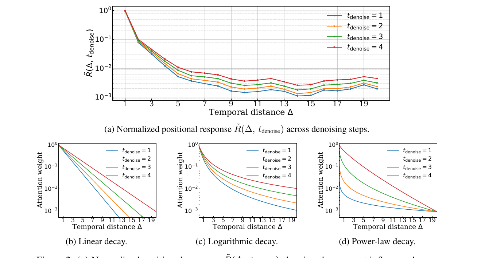
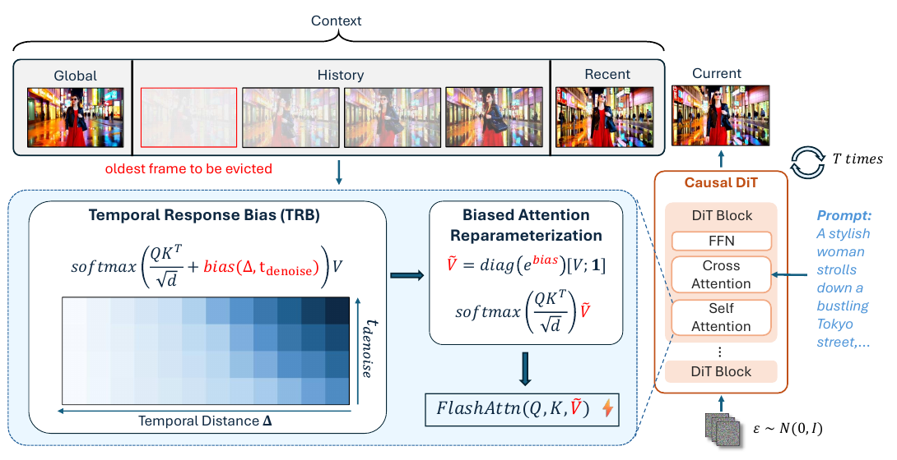
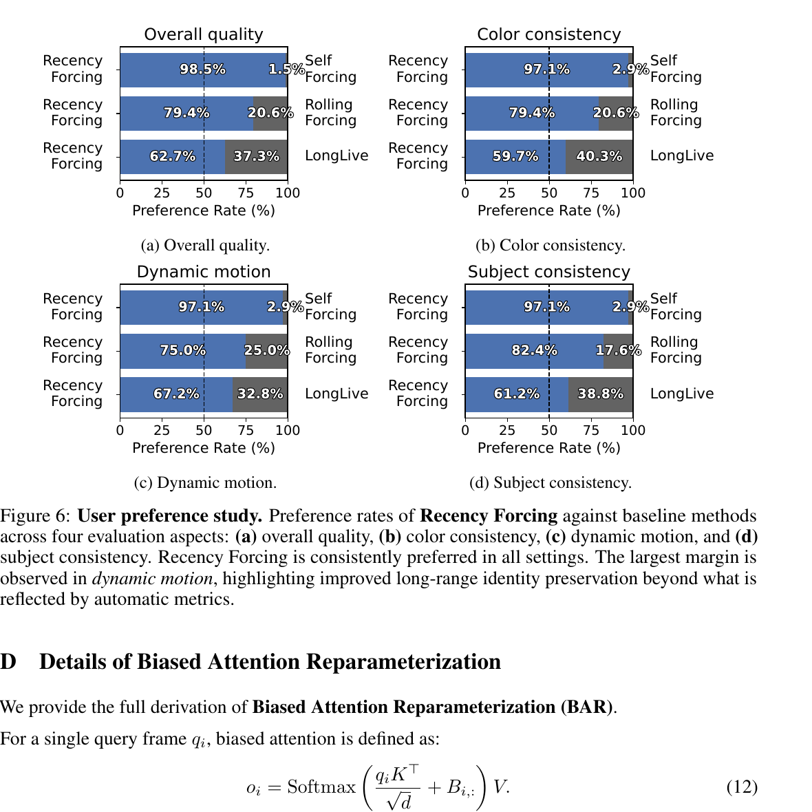
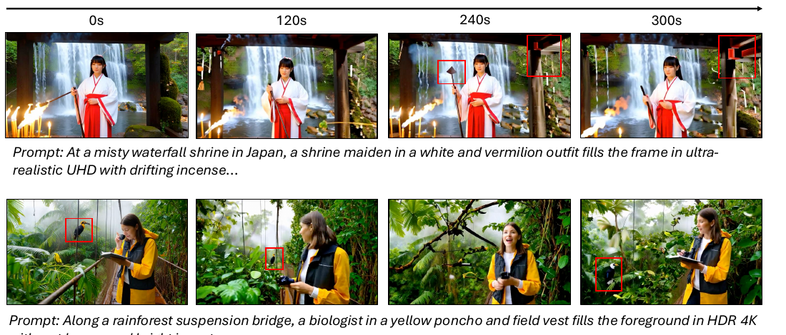

# Recency Forcing: Bridging the Long-Horizon Gap in Autoregressive Video Generation

**论文**: [arXiv:2609.19729v1](https://arxiv.org/abs/2609.19729) (cs.CV, 2026-09-17, Preprint, 18 页)
**作者**: Tri Cao\*, Hung Nguyen\*†, Phong Nguyen, Khoi Nguyen — **Qualcomm AI Research**（\* 共一，† 主要工作在 Qualcomm 期间完成）
**基础模型**: Wan2.1-T2V-1.3B；training-free 挂在 Self-Forcing 上，training-based 挂在 Causal Forcing 上
**代码**: 论文只提到 Project Web Page，**未给 URL**

---

## 1. 一句话定位

**它指出了一个前人没命名过的训练-推理错配 —— `KV eviction mismatch`：模型在短片段上训练时，全部上下文帧都在 KV cache 里；推理时显存逼着把远帧逐出 cache，于是模型被抽掉了它训练时依赖过的条件。** 解法不是去模拟逐出（截断上下文），而是**把远帧的注意力权重提前压到接近 0，让"逐出"这件事在发生时变得无损**。

三件东西：

| | 是什么 | 一句话 |
|---|---|---|
| **分析** | `R(Δ, t_denoise)` **positional response** | 一个扰动式敏感度测量，揭示上下文影响沿**两个轴**衰减：时间距离 Δ 和去噪步 `t_denoise` |
| **方法** | **TRB**（Temporal Response Bias） | 按 `R̃` 形状构造一个**非正、随 timestep 变化**的 pre-softmax attention bias，只作用在 history 段 |
| **实现** | **BAR**（Biased Attention Reparameterization） | 把 bias **恒等地**移到 softmax 外面，于是 TRB 退化成一次标准 FlashAttention 调用，**零推理开销** |

📌 **这篇在仓库里的独特位置**：它自己在结论里点明了 ——「Recency Forcing targets **attention weighting**, a layer **none of the three prior families modifies**, and **composes cleanly with all of them**」。仓库里已有的长时方案要么改 KV cache（压缩/剪枝）、要么改 RoPE、要么改训练（纠错/RL），**没有一篇动 attention 权重本身**。

---

## 2. 要解决的问题：KV eviction mismatch

**论文的原话**：

> *"models train on short clips where **all context frames reside in the KV cache**, but at inference, memory constraints force distant frames to be **evicted** from the KV cache – **removing context the model was conditioned on**."*

拆开就是一句很朴素的观察：

| | 训练时 | 推理时 |
|---|---|---|
| 片段长度 | **5 秒 / 21 个 latent frame**（Wan2.1 的窗口） | **60 秒**，12× 于训练 horizon |
| 上下文 | 全都在 cache 里，模型可以放心依赖任意一帧 | 超出窗口的被逐出，**模型依赖过的那一条件消失了** |

⚠️ **注意这和"长视频漂移"不是同一件事**。漂移是误差累积；本篇说的是**条件分布本身变了** —— 训练时 `p(x_i | x_{<i})` 里的 `x_{<i}` 是完整的，推理时变成了被截断的。这是一个 train/test distribution shift，不是误差传播。

**前人的两条路都不满意**：
- **上下文截断**（训练时就只给 9 帧，模拟逐出）—— 确实对齐了 train/test，但**把模型仍在用的时序信息也扔了**，代价是运动不连贯、莫名其妙的场景切换（见 [§6.4 Table 4](#64-消融table-4--table-7)）。
- **加 attention sink + 各种机制** —— 三大家族（KV 压缩剪枝 / RoPE 外推 / 纠错训练）**都在扩上下文容量**，没人处理"权重该怎么分配"。

**本篇的选择**：保留完整上下文，但**让远帧的权重连续地衰减到近乎 0**。这样等它被逐出时，删掉的是一个本来就几乎不起作用的东西 —— 逐出变成信息无损的。

---

## 3. 分析：positional response `R(Δ, t_denoise)`

这是全篇最有价值的部分，也是唯一一处"先测量再设计"的地方。

**定义（Eq. 3）** —— 一个扰动式敏感度分数：

$$
R(\Delta, t_{\mathrm{denoise}}) = \mathbb{E}\left\lVert\, v_\theta\!\left(x^{t_{\mathrm{denoise}}}_i \mid x^{<i}_0\right) - v_\theta\!\left(x^{t_{\mathrm{denoise}}}_i \mid \delta_\Delta(x^{<i}_0)\right) \right\rVert^2_2
$$

其中 `δ_Δ(x_0^{<i})` 把距离为 `Δ` 的那一帧**替换成同一 prompt、不同随机种子的另一条 rollout 里的对应帧**。

📌 **"替换"而不是"加噪"这个选择是对的**，论文也明说了理由：*"to avoid introducing out-of-distribution perturbations"*。加噪会把上下文推出数据流形，测到的就不是"模型多依赖这一帧"，而是"模型对 OOD 输入多敏感"。

再按 `Δ=1` 归一化以便跨去噪步比较（Eq. 4）：

$$
\tilde R(\Delta, t_{\mathrm{denoise}}) = \frac{R(\Delta, t_{\mathrm{denoise}})}{R(1, t_{\mathrm{denoise}})}
$$

**测量设置**：30 个 prompt × 20 条替代上下文，测在 **Causal Forcing** 上。`t_denoise = 1` 是噪声最高的那步，`t_denoise = 4` 是最低的。

> **Fig 2 逐段解读**：
>
> **(a) 实测的 `R̃(Δ, t_denoise)`（对数纵轴，Δ 从 1 到 20）** —— 这是全篇唯一的实测曲线，方法的每一个设计决定都从它推出来。四条线对应四个去噪步。论文从中读出三条规律：**① 单调排序** —— 四条曲线在所有距离上严格按 `t_denoise` 排开，从不交叉；**② 陡降** —— 几帧之内就掉了几个数量级；**③ 长程可达性随步变化** —— 近距离处四条线几乎重合，**分歧全在大 Δ 处**，说明去噪步之间的差别不在"多依赖近邻"，而在"能伸多远"。
>
> 📌 **注意红线（`t_denoise=4`，噪声最低）在上、蓝线（`t_denoise=1`，噪声最高）在下** —— 也就是说**高噪声步反而更不看远处**。这符合直觉：噪声大时模型在定大结构，靠最近帧就够；噪声小时在抠细节，才需要更远的参照来对齐外观。方法里 *"steep early, gentle late"* 的调度就是照这个来的。
>
> 🔴 **两件曲线上看得见、论文却没说的事**（我按 400 DPI 重读的读数）：
> - **整个衰减的绝大部分发生在 Δ=1→2 这一步**：从 1.0 掉到约 **0.08–0.10**，一步就是一个数量级。从 Δ=2 一路到 Δ=20 只再掉大约 30–50 倍，而且到 Δ≈5（约 0.005–0.011）时就基本掉完了。所以"陡降"准确说是 **"Δ=1 特别特殊"**，不是"持续陡降"。
> - **曲线在 Δ≈10 之后不再单调下降**：Δ=10–15 段是平的（约 0.001–0.0035），**然后从 Δ≈14 的最低点回升到 Δ≈19 的约 0.0027–0.005，抬了 2–3 倍**。📌 **这个回升很可能就是 attention sink 本身** —— 实验里 `L_attention = 21`、`L_global = 3`，最大的那几个 Δ 正好落在最开头的 global 帧上。**如果是这样，它反而是对"global 段不施加衰减"这一设计的独立支持**，可惜论文既没指出这个回升，也没把它和 sink 联系起来（对 sink 的辩护是引文献，不是引自己这条曲线）。
>
> **(b) 线性衰减 / (c) 对数衰减 / (d) 幂律衰减** —— 三个候选 bias 函数画成同样的对数坐标，好和 (a) 对比形状。**(b) 线性**在对数纵轴上是直线，意味着恒定比率衰减，与 (a) 的先陡后平不符；**(c) 对数**压得太轻，远帧衰减不够；**(d) 幂律**是凸的，前段压得狠、后段趋缓，形状最接近 (a)。消融（Table 5）确认幂律最好，全文采用。

---

## 4. 方法：Temporal Response Bias (TRB)

### 4.1 上下文的四段划分

> **Fig 4 逐段解读**：
>
> **顶部 Context 条** —— 注意力窗口被切成四段，从左到右：**Global**（`L_global` 帧，attention sink，钉住不动）、**History**（中间段，**只有这一段吃 TRB**）、**Recent**（`L_recent` 帧，供短时运动线索）、**Current**（正在去噪的帧）。红字箭头 *"oldest frame to be evicted"* 指向 **History 段最左边那一格**（不是 Global）—— 因为 global sink 是钉住的，真正会被逐出的永远是最老的那个 history 帧。**TRB 要做的就是保证这一格在被逐出之前，权重已经压到可以忽略。**
>
> **左下 TRB 框** —— 公式 `softmax(QKᵀ/√d + bias(Δ, t_denoise))V`，bias 标红表示这是新加的项。下面那张热力图是 bias 的取值：**横轴 Temporal Distance Δ（箭头向左，即向远处）、纵轴 t_denoise（箭头向上）**，颜色越深代表压制越强。可以看到右侧（Δ 小）浅、左侧（Δ 大）深，且沿纵轴有梯度 —— **这就是"两轴衰减"的可视化**。
>
> **中下 BAR 框** —— `Ṽ = diag(e^bias)[V; 1]`，即把 bias 指数化成对角阵去缩放 value，并给 value 拼上一列全 1。然后走普通的 `softmax(QKᵀ/√d) Ṽ`。**关键在于 bias 从 softmax 里面搬到了外面**，于是下方那个黄色闪电标注的 `FlashAttn(Q, K, Ṽ)` 才成立 —— FlashAttention 融合了 softmax、不暴露中间 logits，本来是没法注入 bias 的。
>
> **右侧 Causal DiT 栈** —— 标准 DiT block（FFN / Cross Attention / Self Attention），**TRB 只替换 Self Attention**，Cross Attention（吃 prompt）不动。右上角 `T times` 表示去噪循环，底部 `ε ~ N(0,I)` 是噪声输入。
>
> **整体的设计动机**：前人改的是 Context 条的**内容**（压缩它、重排它的 RoPE、用纠错训练让模型容忍它退化），本篇一个字没动内容，只改了**从 Context 读取时的权重分配**，所以能和前三家叠加。

**为什么 global 和 recent 不衰减**，论文给了两个不同性质的理由：
- **recent 不衰减**：因为 `Δ=1` 处的 positional response 在整个去噪过程中都接近最大值 —— **这是从自己的测量推出来的**；
- **global 不衰减**：因为它被指定为 attention sink —— **这是引前人文献，不是从 `R̃` 推出来的**（见 §3 图解里我对 Δ≈19 回升的猜测：其实它自己的曲线可能就能支持这一点）。

窗口定义：

$$
L_{\mathrm{attention}} = L_{\mathrm{global}} + L_{\mathrm{history}} + L_{\mathrm{recent}} + L_{\mathrm{current}}
$$

实验取 `L_attention = 21`、`L_global = L_recent = L_current = 3`（latent frame），**于是 `L_history = 12`**。

### 4.2 三个设计原则与三个候选函数

bias 必须满足：**① timestep 依赖**（早步强、晚步弱）；**② 随 Δ 快速衰减**；**③ 非正**（`B_{i,j} ≤ 0`，只能压不能放大）。

三个候选（`Δ̃ = (Δ − L_recent)/L_history` 是归一化距离）：

$$
\mathrm{bias}_{\mathrm{lin}} = -\,\alpha(t)\cdot(\Delta - L_{\mathrm{recent}})
$$

$$
\mathrm{bias}_{\mathrm{log}} = -\,\alpha(t)\cdot\log\!\left(1 + \Delta - L_{\mathrm{recent}}\right)
$$

$$
\mathrm{bias}_{\mathrm{pow}} = -\,\beta\cdot\tilde\Delta^{\,\gamma(t)},\qquad \tilde\Delta = \frac{\Delta - L_{\mathrm{recent}}}{L_{\mathrm{history}}}
$$

**timestep 调度（Eq. 9）—— 只有两个自由参数**：

$$
\alpha(t_{\mathrm{denoise}}) = \alpha_{\mathrm{base}} - \frac{t_{\mathrm{denoise}}}{4},\qquad
\gamma(t_{\mathrm{denoise}}) = \gamma_{\mathrm{base}}\cdot 2^{\,t_{\mathrm{denoise}}}
$$

📌 **`γ` 递增为什么等于"压得更轻"，值得说清楚**，因为论文的措辞（*"sharpens the decay shape"*）容易读反。`Δ̃ ∈ [0,1]`，而对 `x ∈ (0,1)`，指数越大 `x^γ` 越小 —— 所以 `γ` 增大让 `bias_pow` 的**绝对值变小**，即**压制变弱**。配合 `α` 随 `t` 递减，两者同向：**去噪越往后（噪声越低），对远帧压得越松**。这正好复现 Fig 2a 里红线在上、蓝线在下的排序。

⚠️ **注意 `α` 在幂律式里根本没出现** —— `bias_pow` 只用 `β` 和 `γ(t)`。而正文采用的就是幂律。**所以 Eq. 9 里的 `α(t_denoise)` 在最终配置下是死参数**，它只服务于被淘汰的线性/对数两式。论文没点破这一点，`α_base` 在推理时该取什么值也就从头到尾没交代（训练时是 `U(0,2)` 采样）。

---

## 5. BAR：把 bias 搬出 softmax

这是全篇工程价值最高的一步，而且是**精确恒等变形，不是近似**。我自己验了一遍。

**问题**：FlashAttention 把 softmax 融进了 kernel，**不暴露中间 logits**，所以没法在 softmax 前加 bias。用 FlexAttention 这类灵活 kernel 可以，但慢。

**关键观察**：`B_{i,j}` 只依赖位置（`Δ` 和 `t_denoise`），**与内容 `(q_i, k_j)` 无关**。于是 `w_j = exp(B_{i,j}) ∈ (0,1]` 可以从 softmax 的分子分母里同时提出来：

$$
o_i = \frac{\sum_j \exp\!\left(\frac{q_i k_j^\top}{\sqrt d} + B_{i,j}\right) v_j}{\sum_j \exp\!\left(\frac{q_i k_j^\top}{\sqrt d} + B_{i,j}\right)}
= \frac{\sum_j \exp\!\left(\frac{q_i k_j^\top}{\sqrt d}\right) w_j v_j}{\sum_j \exp\!\left(\frac{q_i k_j^\top}{\sqrt d}\right) w_j}
$$

再把 `w_j` 吸收进一个增广 value（拼一维常数 1）：

$$
\tilde v_j = w_j\cdot[\,v_j\,;\,1\,] \in \mathbb{R}^{d+1},\qquad
\tilde o_i = \mathrm{Softmax}\!\left(\frac{q_i K^\top}{\sqrt d}\right)\tilde V
$$

$$
o_i = \tilde o_i[\,:d\,]\;/\;\tilde o_i[\,d\,]
$$

**为什么成立**：设普通 softmax 的权重是 `s_j = exp(q_i k_jᵀ/√d)/Z`。那么 `õ_i = Σ_j s_j w_j [v_j; 1] = [Σ_j s_j w_j v_j ; Σ_j s_j w_j]`，两段相除时**归一化常数 `Z` 上下对消**，正好还原带 bias 的 softmax。**恒等，无任何近似。**

📌 **拼那一维全 1 才是关键**：它的作用是**在同一次 attention 里顺带把分母 `Σ_j s_j w_j` 算出来**。否则你得再跑一次 attention 才能拿到归一化因子。

**开销**：(i) 按 `w_j` 缩放 value 是 `O(Nd)`；(ii) 拼一维是 `O(Nd)`；(iii) 最后除一下是 `O(N)`。相对 attention 本身的 `O(N²d)` 都可忽略。

| 实现 | 时间 (ms) ↓ | 加速 ↑ |
|---|---|---|
| FlexAttention + 直接注入 bias | 70.34 | 1.00× |
| **BAR + FlashAttention（本篇）** | **6.06** | **11.76×** |

（Table 1。⚠️ 论文没说这是哪个尺寸、哪张卡、batch 多大、测的是单层还是整网。）

⚠️ **两个论文没讨论的实现细节**：
1. **数值稳定性。** `w_j = exp(B_{i,j})` 在远帧处可以非常小，若窗口内所有 `w_j` 都趋于 0，分母 `Σ_j s_j w_j` 会下溢。**幸好 global 与 recent 段的 `w = 1` 不衰减，分母因此有下界** —— 这给"global/recent 不施加 TRB"提供了一个论文没提的**数值上的**必要性，而不只是建模上的。
2. **`w` 其实依赖 `(i, j)` 而不只是 `j`。** 论文的推导开头写的是 *"For a single query frame `q_i`"* —— 对固定的 query 帧，`Δ_{i,j}` 才退化成只随 `j` 变。所以 **`Ṽ` 要按 query 帧重建**。在 AR 逐 chunk 推理里这天然成立（每次只有一个 query chunk），**但这意味着 BAR 不能直接用在一次前向里含多个 query 帧位置的场景**。论文没说明这个前提。

📌 **补记（2026-09）：仓库里出现了 BAR 的反例。** [Avatar-Forever](../avatar_forever/analysis.md) 的 **ForeverCache** 同样打着"推理期去冗余、不改权重"的旗号 —— 每个 chunk 只在第一个去噪步算一次历史特征、后面复用 —— **但它不是恒等变换**：窗口内是双向注意力，历史 token 的深层特征本该随当前 chunk 变化，ForeverCache 把它们冻在了当前 chunk 还是纯噪声的那一刻。**论文正文没说，开源代码的 docstring 自己写了 *"This is an approximation"***，Table 1 里 LLM Overall 也因此 6 / 6 格下降。**BAR 能做到精确，是因为它动的是一个与内容无关的位置项；ForeverCache 近似，是因为它冻结的是一个与内容有关的中间量 —— 判断一个"零开销"变换是否精确，就看被搬动的那一项依不依赖当前输入。**

---

## 6. 实验

### 6.1 设置

| 项 | 值 |
|---|---|
| Backbone | **Wan2.1-T2V-1.3B**；所有 self-attention 层的 SDPA 换成 BAR-based TRB |
| 分辨率 / 帧率 | **832×480 @ 16 fps**，全部评测视频 **60 秒** |
| 窗口 | `L_attention = 21` latent frames；`L_global = L_recent = L_current = 3`，故 `L_history = 12` |
| chunk | **3 个 latent frame**，**`Δ` 按 chunk 计算**（不是按帧） |
| training-free 模式 | 直接挂到 **Self-Forcing** 上，`α_base`/`γ_base` 由 `R̃` 直接定 |
| training-based 模式 | 从 **Causal Forcing 的 causal ODE checkpoint** 初始化，**只微调 DMD 阶段**，走 Self-Forcing 训练协议 |
| 训练数据 | VidProM 的过滤 + LLM 增广版，**5 秒短片段** |
| 训练量 | **3,500 步，batch size 4，4×H100，约 12 小时** |
| 训练时超参 | `α_base ~ U(0,2)`，`γ_base ~ U(0,1)`，`β = L_history` |
| RoPE | 采用 **relative RoPE**（global 段的 RoPE 索引移到紧邻 history 段之前）；**baseline Causal Forcing 也补了 global sink + relative RoPE 以求公平** |
| 评测 | VBench（短，5 秒）+ VBench-Long（60 秒），**200 条 MovieGen prompt**（沿用 Rolling Forcing 的协议），消融另用**互斥的 50 条** |
| 人评 | 23 人，20 条 prompt，2AFC，四个维度，共 1620+ 条回答 |

📌 **"只微调 DMD 阶段、12 小时/4×H100"是个很低的接入成本** —— 它不重训 ODE init，不改训练目标，不加数据。这和仓库里 [ForgeWM](../forgewm/analysis.md)、[SolarWM](../../world_model/solarwm/analysis.md) 那种要重跑整条蒸馏 pipeline 的做法差一个量级。

### 6.2 VBench（5 秒短视频）：验证"不伤短视频"

| 模型 | Total | Quality | Semantic |
|---|---|---|---|
| Self Forcing | 84.31 | 85.07 | <ins>81.28</ins> |
| Causal Forcing | 84.04 | 84.59 | **81.84** |
| Rolling Forcing | 81.22 | 84.08 | 69.78 |
| LongLive | <ins>84.87</ins> | **86.97** | 76.47 |
| **Recency Forcing** | **85.08** | <ins>86.20</ins> | 80.59 |

（加粗=最优、下划线=次优，我逐格核过，**全部正确**。）

**这张表的作用是证明"加了 TRB 不会伤短视频"** —— 因为短视频里所有上下文都在训练窗口内，bias 几乎不起作用。**Total 拿了第一**，但要注意：**Quality 输给 LongLive（86.20 vs 86.97），Semantic 同时输给 Causal Forcing 和 Self-Forcing**（80.59 vs 81.84 / 81.28）。所以"best overall score"只在 Total 这一列成立。

### 6.3 VBench-Long（60 秒）：主结果

| 模型 | Quality | Dynamic | Motion Smooth | Temp Flicker | Imaging | Aesthetic | Subject Cons | BG Cons |
|---|---|---|---|---|---|---|---|---|
| *training-free* | | | | | | | | |
| Infinity RoPE | 82.30 | 56.22 | 98.53 | 97.41 | 67.14 | 59.20 | 97.31 | 96.15 |
| Deep Forcing | 82.14 | 56.01 | 98.10 | 96.88 | 68.22 | 59.85 | 97.35 | 96.30 |
| **Recency Forcing** | <ins>82.63</ins> | 56.27 | 98.23 | 96.98 | 68.94 | 60.48 | **97.81** | **96.64** |
| *training-based* | | | | | | | | |
| Self Forcing | 80.11 | 34.50 | 98.48 | **97.77** | 65.93 | 56.55 | 96.97 | 96.24 |
| Causal Forcing | 78.98 | <ins>65.19</ins> | 96.94 | 95.21 | 63.44 | 51.35 | 95.39 | 95.51 |
| Rolling Forcing | 81.56 | 34.68 | <ins>98.71</ins> | <ins>97.62</ins> | <ins>70.18</ins> | 59.93 | <ins>97.74</ins> | <ins>96.54</ins> |
| LongLive | 81.98 | 42.85 | **98.75** | 97.61 | 68.71 | **61.48** | 97.09 | 95.99 |
| **Recency Forcing** | **84.02** | **75.48** | 98.00 | 96.32 | **70.50** | <ins>61.31</ins> | 97.68 | 96.49 |

（加粗/下划线是**跨两个分组全局**评的，我逐格核过，**8 列全部正确**。）

**Quality 84.02 领先第二名 LongLive 2.04 分，这是真实的领先。** 但表里还有三件论文没说的事：

- 🔴 **8 列里只赢了 3 列**（Quality / Dynamic / Imaging）。Motion Smoothness **98.00 是所有 training-based 里除 Causal Forcing 外最低的**，且低于全部三个 training-free 行；Temporal Flickering **96.32 同样是次低**。
- 🔴 **训练版在 Subject Consistency 和 Background Consistency 上输给了它自己的 training-free 版**（97.68 vs 97.81、96.49 vs 96.64）。**论文完全没提这个反转。**
- ⚠️ **Dynamic Degree 75.48"最高"这件事需要打个折**。它和 Motion Smoothness / Temporal Flickering 的低分**是同一个事实的两面** —— VBench 体系里，一个漂移成静止画面的视频会拿到很高的 smoothness/flickering/consistency 和很低的 dynamic degree（Self-Forcing 34.50、Rolling Forcing 34.68 正是这个症状）。更要命的是**论文自己在消融里承认了 dynamic degree 可以被不稳定性刷高**：上下文截断把 dynamic 顶到 **88.58**，而论文的评价是 *"inflates dynamic degree at the cost of overall quality"*。**既然如此，正文把 75.48 当作独立卖点来叙述（*"achieves the highest dynamic degree"*）就不太站得住** —— 它的可信度来自 Quality 这个综合分，而不是来自它自己。

📌 **不过要给它记一笔**：Quality 是 VBench-Long 的加权综合分，它**已经把 dynamic degree 和 smoothness 一起算进去了**。截断变体的 Quality 只有 81.10 而 TRB 是 84.17（Table 4），说明综合分确实惩罚了那种"靠乱动刷分"的行为。**所以 84.02 这个第一是可信的，只是叙述方式给了读者一个更强的印象。**

### 6.4 消融：Table 4 – Table 7

（全部在**互斥的 50 条 prompt** 上、60 秒、training-based + 幂律衰减。⚠️ 因此这些数字与 Table 3 的 200 条不可直接比 —— 例如 Causal Forcing 在 Table 3 是 Quality 78.98/Dynamic 65.19，在 Table 4 是 80.56/78.32。）

**Table 4 — 截断 vs 衰减，这是全文最重要的消融**：

| `L_attention` | Decay | Quality | Imaging | Dynamic |
|---|---|---|---|---|
| 21 | none | 80.56 | 65.09 | 78.32 |
| **9（截断）** | none | 81.10 | 66.40 | **88.58** |
| 21 | **TRB** | **84.17** | **69.05** | 81.55 |

**它确实证明了论文的核心论点**：截断（模拟逐出）只把 Quality 从 80.56 提到 81.10，而连续衰减提到 84.17。**"保留上下文但压低权重"明显优于"直接删掉"。**

**Table 5 — bias 函数形状**：线性 83.26 / 对数 83.16 / **幂律 84.17**。幂律在 Quality 和 Dynamic 上都最好（Imaging 略低于对数的 69.42）。**与 Fig 2a 的凸形状一致，这个消融是自洽的。**

**Table 6 — 衰减强度 `γ_base`**：

| `γ_base` | Quality | Imaging | Dynamic |
|---|---|---|---|
| **0.01** | **84.36** | **69.63** | 79.42 |
| 0.1（采用） | 84.17 | 69.05 | 81.55 |
| 0.5 | 82.91 | 67.05 | 81.94 |
| 1.0 | 82.61 | 65.98 | **83.93** |

⚠️ **这张表和它的文字说明对不上**。正文写 *"small values insufficiently suppress distant frames"*，但**表里 Quality 和 Imaging 都在最小的 `γ_base = 0.01` 处取到最大值**，且随 `γ_base` 单调下降。论文选 0.1 而不是 0.01，换来的是 **Dynamic +2.13，代价是 Quality −0.19、Imaging −0.58**。这是个可以辩护的取舍，但**"小值不够"这个说法没有数据支持** —— 表里根本没测比 0.01 更小的值，也没测 0 附近。

**Table 7 — recent 段长度 `L_recent`**：

| `L_recent` | Quality | Imaging | Dynamic |
|---|---|---|---|
| 0 | 82.80 | **69.86** | 40.90 |
| **3（采用）** | **84.17** | 69.05 | **81.55** |
| 6 | 82.14 | 69.51 | 49.03 |

🔴 **这里的文字和表直接矛盾**。正文写 *"**Larger `L_recent` improves** motion stability with **diminishing returns** beyond a small window"* —— **但表里 `L_recent = 6` 在三项中的两项上都比 3 更差**（Quality 82.14 < 84.17，Dynamic 49.03 ≪ 81.55）。**这不是"收益递减"，这是反转。** 曲线是倒 U 形，峰值在 3；论文把它描述成了单调饱和。

📌 **`L_recent = 0` 时 Dynamic 塌到 40.90 这个数很说明问题** —— 去掉最近帧，视频基本不动了，印证了 Fig 2a 里 `Δ=1` 那个数量级落差：**最近的那一帧几乎承担了全部的运动线索**。

### 6.5 人评

> **Fig 6 逐面板解读**（四个面板 = 四个评价维度；每个面板三条横条 = 对三个 baseline 的两两对比，蓝色是本方法的胜率，灰色是对手的）：
>
> - **(a) Overall quality** —— vs Self-Forcing **98.5%**，vs Rolling Forcing **79.4%**，vs LongLive **62.7%**。
> - **(b) Color consistency** —— **97.1% / 79.4% / 59.7%**。对 LongLive 的 59.7% 是全图最低的一格。
> - **(c) Dynamic motion** —— **97.1% / 75.0% / 67.2%**。
> - **(d) Subject consistency** —— **97.1% / 82.4% / 61.2%**。
>
> **读法**：对 Self-Forcing 的 97–98% 基本是碾压（Self-Forcing 在 60 秒上已经漂得很明显），**真正有信息量的是对 LongLive 那一列的 59.7–67.2%** —— 赢，但幅度不大。
>
> 🔴 **caption 的一句结论是错的。** 原文（以及附录 §C）写 *"The largest margin is observed in **dynamic motion**"*。**逐格核对后这只对 LongLive 成立**：
> - **vs Self-Forcing**：最大的是 Overall quality 的 **98.5%**，dynamic motion 只有 97.1%；
> - **vs Rolling Forcing**：最大的是 Subject consistency 的 **82.4%**，而 **dynamic motion 的 75.0% 恰恰是四项里最小的**；
> - **vs LongLive**：dynamic motion 67.2% 确实最大 ✅。
>
> **三个对手里两个不成立。** 另外 caption 还说这个 dynamic-motion 的优势体现了 *"improved long-range **identity** preservation"* —— **identity preservation 是 subject consistency 衡量的东西，不是 dynamic motion**，这个推论本身也不通。
>
> ⚠️ **统计口径缺失**：23 名参与者、20 条 prompt、"1620+ 条回答"，但**没给每格的样本数、没有置信区间、没有显著性检验**。对 LongLive 那几个 59.7%–67.2% 的格子，这一点尤其要紧。

---

## 7. Limitations：这篇给了，而且给得实在

> **Fig 8 逐行解读**（附录 E，两行各是一条 **5 分钟**视频，四列采样自 **0s / 120s / 240s / 300s**，红框是论文自己标的失效位置）：
>
> - **第一行（神社巫女，瀑布场景）** —— 红框从 240s 开始出现在画面右侧的柱子上。论文的描述是柱子 *"gradually drifts and changes color after approximately 2 minutes"*。0s 和 120s 的构图基本一致，240s 起右侧结构开始变形、色调偏移。
> - **第二行（雨林吊桥，黄雨衣生物学家）** —— 红框标在 0s 和 120s 的鸟上；**240s 和 300s 没有框，因为鸟已经消失了**。论文说它接近 4 分钟时消失、之后再出现时外观与早期不一致。
>
> 📌 **值得注意的是这两种失效的性质不同**：第一行是**渐进式漂移**（TRB 压制的正是这类），第二行是**物体消失后重现时的身份不一致** —— 后者恰恰是"远帧权重被压到 0"的直接代价：**鸟一旦离开 recent 窗口，模型就没有足够的权重去回忆它长什么样了**。论文没有把这一点和自己的机制联系起来，但这是 TRB 路线的内在张力：**压得越狠，越抗漂移，也越记不住离开画面的东西。**

**原文的自陈**：

> *"Though our method can be applied to generate arbitrarily long videos, we observe **degradation when the duration exceeds 4-5 minutes**. … Generating infinitely long videos without quality degradation remains highly challenging, as **previous methods typically demonstrate generation only up to limited durations (usually around 120 seconds)**."*

📌 **这一节的处理方式值得单独表扬**，对照仓库里最近几篇：
- **给了具体的失效时间点**（4–5 分钟），不是含糊的"长时会退化"；
- **给了失效的视觉证据**，而且**红框标在自己视频的缺陷上**；
- **给了同行的参照**（前人通常只展示到 120 秒左右），把自己的 60 秒主评测和 5 分钟失败案例放在同一个尺度里讨论。

对比 [AlayaWorld](../../world_model/alayaworld/analysis.md)：`"limitation"` 全文 0 次、`"ablat"` 全文 0 次、声称 horizon 无界而最长只展示 60 秒且不承认那 60 秒里已有退化。**两篇的诚实度不在一个档次。**

---

## 8. 争议与权衡

**站得住的**：

- 📌 **`KV eviction mismatch` 这个命名是真贡献。** 它把一个人人都在绕的问题从"漂移"里切出来，指明它是 **train/test 条件分布不匹配**，而不是误差累积。Table 4 的三行直接验证了这个切分有意义。
- 📌 **BAR 是干净的工程结果。** 恒等变形、零近似、11.76× 于 FlexAttention，而且**不需要写 kernel**。这类"把约束重写成现有高性能算子能吃的形式"的招数可迁移性很强。
- 📌 **有真消融、有人评、有失败案例、有 Limitations 章节。** 四样齐全，这在仓库最近读的几篇里是少数。
- 📌 **接入成本低**：training-free 模式零训练，training-based 只需 12 小时 4×H100 微调 DMD 阶段。

**需要打折的**：

- 🔴 **动机曲线的粒度和部署的粒度不一致。** Fig 2a 的 `R̃` 测在 **frame-wise** Causal Forcing 上（附录 B 明说：*"analysis is conducted on both chunk-wise and frame-wise … only frame-wise version is reported in Sec. 3.2 for conceptual clarity"*），横轴 Δ 一路到 20。**但所有实验都是 chunk-wise，chunk = 3 latent frames，`Δ` 按 chunk 算**。在 `L_attention=21 / L_global=L_recent=L_current=3` 下，history 只有 **12 帧 = 4 个 chunk**，即部署时 `Δ` 实际只在 1–6 这个很窄的范围内变化。**chunk-wise 的曲线一次都没展示过**，而它才是方法真正运行的那条曲线。
- 🔴 **Table 7 的文字与数据矛盾**（"larger improves with diminishing returns" vs 表里 6 明显差于 3，见 [§6.4](#64-消融table-4--table-7)）。
- 🔴 **Fig 6 caption 的"最大优势在 dynamic motion"对三个对手里的两个不成立**（见 [§6.5](#65-人评)）。
- ⚠️ **Table 6 的"小值不够"没有数据支持** —— Quality 与 Imaging 都在测过的最小值处最优。
- ⚠️ **`α_base` 在最终配置下是死参数**（幂律式不含 `α`），推理取值从未给出（见 [§4.2](#42-三个设计原则与三个候选函数)）。
- ⚠️ **8 列里赢 3 列，且训练版在两项一致性指标上输给自己的免训练版**，论文未提（见 [§6.3](#63-vbench-long60-秒主结果)）。
- ⚠️ **Table 1 的 11.76× 缺测量条件**：哪张卡、什么尺寸、batch 多大、单层还是整网，一个都没说。
- ⚠️ **"composes cleanly with all of them" 是断言，不是实验。** 结论段声称 TRB 与三大家族正交可叠加，**但全文没有任何一个"TRB + KV 压缩"或"TRB + ∞-RoPE"的组合实验**。而这恰恰是这篇最诱人的卖点。
- ⚠️ **代码未给 URL**（只说有 Project Web Page）。
- ⚠️ **无种子、无重复、无误差棒**；人评无置信区间、无每格样本数。
- ⚠️ **引用号不一致**：Rolling Forcing 正文是 [31]、附录 C 写成 [25]。

---

## 9. 一句话总结

**Recency Forcing 把长视频 AR 生成的一个具体错配单独命名出来 —— `KV eviction mismatch`：训练时全部上下文都在 KV cache 里，推理时远帧被显存逼着逐出，模型被抽掉了它训练时依赖的条件。** 它先用一个扰动式测量 `R(Δ, t_denoise)`（把距离 Δ 的那帧换成同 prompt 另一条 rollout 的帧，看预测速度场变多少）画出上下文影响的**两轴衰减**结构：随距离陡降，且**噪声越低的去噪步伸得越远**。据此构造 **TRB** —— 一个非正的、随 timestep 变化的 pre-softmax attention bias，**只施加在 history 段**（global 当 sink、recent 供运动线索，都不衰减），形状取幂律。于是远帧在被逐出之前权重已近乎 0，**逐出变成信息无损**。配套的 **BAR** 是全篇最漂亮的一步：因为 bias 与内容无关，`exp(B)` 可以从 softmax 分子分母同时提出、吸进增广 value `ṽ_j = w_j·[v_j; 1]`（拼的那一维 1 负责顺带算出分母），**恒等地**把 TRB 变成一次标准 FlashAttention 调用，比 FlexAttention 快 11.76× 且零推理开销。VBench-Long 60 秒上 Quality **84.02**，领先第二名 LongLive 2.04 分；training-free 模式零训练也能到 82.63，training-based 只要 **12 小时 / 4×H100**。⚠️ **但 8 列里只赢 3 列**，Motion Smoothness 与 Temporal Flickering 反而是 training-based 组里的次低，**训练版在 Subject/Background Consistency 上还输给自己的免训练版**；**Table 7 的文字与数据直接矛盾**（说 `L_recent` 越大越好，表里 6 明显差于 3）；**Fig 6 caption 声称最大优势在 dynamic motion，逐格核对后对三个对手里的两个不成立**；**动机曲线测在 frame-wise、部署却是 chunk-wise**，真正运行的那条曲线从未展示；**最诱人的"可与三大家族叠加"是断言，零组合实验**。📌 **不过 Limitations 给了 5 分钟失败案例和具体失效时间点，诚实度在最近读的几篇里属于上乘。**

---

## 10. 在仓库图谱里的位置

**它自己给了一张很好用的三分类**，仓库里的笔记正好能填进去：

| 家族 | 改什么 | 本篇点名的代表 | 仓库里的笔记 |
|---|---|---|---|
| **① KV cache 压缩/剪枝** | 上下文的**内容** | Deep Forcing、PackForcing、RelaxForcing、MALT | [LongLive 2.0](../longlive2/analysis.md) 的整 chunk 驱逐 + NVFP4 KV cache；[SANA-Streaming](../sana_streaming/analysis.md) 的 sliding window + sink chunk |
| **② RoPE 外推** | 位置编码 | ∞-RoPE、Rolling Forcing、LoL、Anchor 变体 | [Helios](../helios/analysis.md) 的 Relative RoPE + First-Frame Anchor |
| **③ 纠错/RL 训练** | 训练过程 | Self-Resampling、BAgger、Pathwise、Self-Forcing++ | [Mask Forcing](../mask_forcing/analysis.md)、[OPSD-V](../opsd_v/analysis.md)、[ForgeWM](../forgewm/analysis.md)、[AlayaWorld](../../world_model/alayaworld/analysis.md) 的 error bank |
| **④ attention 权重本身** | **从上下文读取时的权重分配** | **本篇（唯一）** | — |

📌 **第四格此前是空的，这是这篇最有价值的定位。** 而且前三家都在**扩容量**，本篇在**分配权重**，所以正交性的说法是可信的 —— ⚠️ **只是它没做任何组合实验来兑现。**

| | 关系 |
|---|---|
| **[Mask Forcing](../mask_forcing/analysis.md)** | 📌 **最值得并排看的一篇**。两篇都自称"零成本插件"、都不加数据不加训练阶段，但打击点完全不同：Mask Forcing 改的是 **DMD rollout 时往输入注入什么**（掩码低噪 token，属家族③），本篇改的是 **attention 怎么读上下文**（家族④）。**理论上可以叠，没人试过。** |
| **[LongLive 2.0](../longlive2/analysis.md)** | 🔴 **本篇最强的对手，也是唯一在两张主表上都逼近它的方法**。VBench 短视频上 LongLive 的 Quality 86.97 > 本篇 86.20；VBench-Long 上 LongLive 拿了 Motion Smoothness 与 Aesthetic 两项第一。**人评里对 LongLive 的胜率也是全场最低的一列（59.7%–67.2%）。** 两者路线正交：LongLive 用真长视频 teacher-forcing 直接微调 + multi-shot sink，本篇不碰训练数据长度。 |
| **[Helios](../helios/analysis.md)** | 📌 **反向的对照**：Helios 明确**不用** KV cache（改用 Unified History Injection + token 压缩），所以 `KV eviction mismatch` 这个问题在 Helios 上根本不存在。**这是对本篇问题设定边界的一个提醒** —— 它只对"靠 KV cache 做 AR"的这一支成立。 |
| **[五篇横向对照](../dmd_few_step_ar/analysis.md)** | 📌 本篇也是挂在 DMD 蒸馏上的补丁，但**它不改蒸馏目标、不改 rollout 构造，只改 attention**，是那五篇之外的第六种打法，且是唯一一种**推理期零开销**的。 |
| **[AlayaWorld](../../world_model/alayaworld/analysis.md)** | ⚠️ **同一个问题的两种相反答案**。AlayaWorld 用**有界四路 prefix**（sink + 6 帧压缩历史 + ≤10 帧空间记忆 + 最近帧）硬性截断上下文；本篇的 Table 4 恰恰在说**硬截断不如连续衰减**（Quality 81.10 vs 84.17）。⚠️ 两者不可直接比（任务、backbone、评测全不同），**但这是仓库里第一次有实验数据触到这个取舍**。 |
| **[SANA-Streaming](../sana_streaming/analysis.md)** | 它的 softmax 分支是 sliding window + persistent sink chunk，**即硬窗口**。本篇的论点如果成立，那条分支换成软衰减也许能省掉一部分窗口长度。 |

⚠️ **仓库缺口**：本篇的两个直接基座 **Self-Forcing** 与 **Causal Forcing (arXiv:2602.02214)** 都没有独立笔记，**Deep Forcing** 和 **∞-RoPE** 也没有 —— 而这四篇是本篇全部对照的来源。

---

## Q&A

*(后续对话中产生的问答追加于此)*
