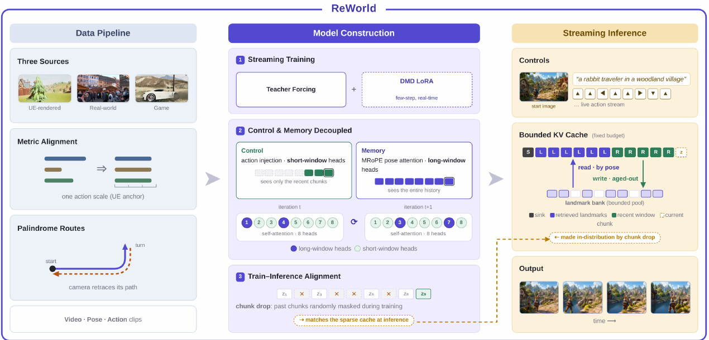
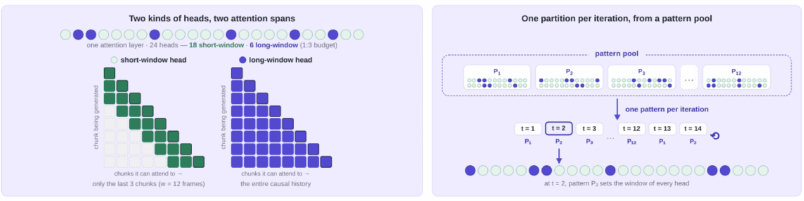
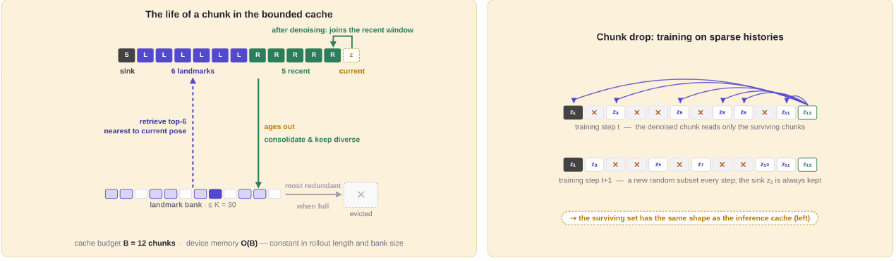
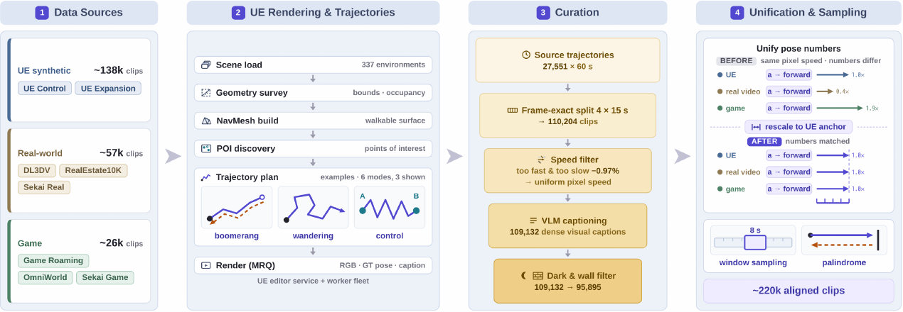
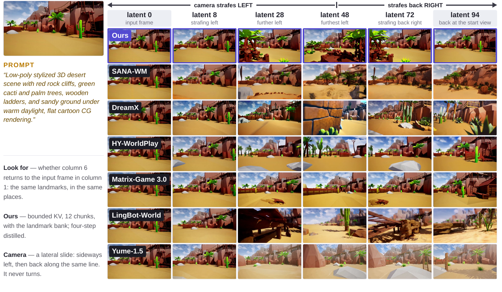
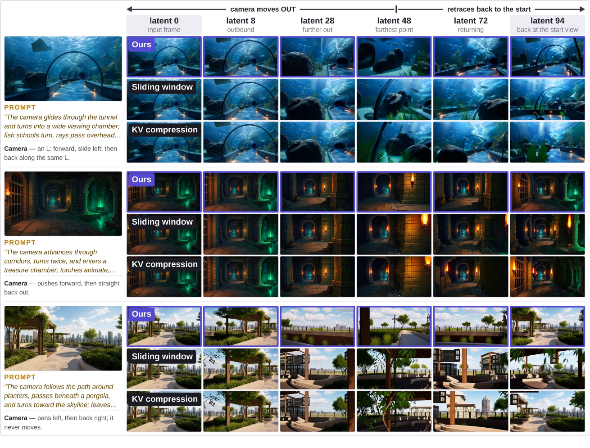

# ReWorld: An Interactive World Model with Long-Horizon Memory

> Zhifei Chen, Luozhou Wang, Guibao Shen, Dongyu Yan, Shuai Yang, Tianshuo Xu, Yihua Du, Wei Wang, Tianyi Gui, Lianghua Huang, Yingcong Chen  
> HKUST(GZ) + ATH, Alibaba · arXiv:2608.23565 · 2026-08-24 · [project](https://zhifeichen097.github.io/ReWorld/)

---

## 1. 一句话定位

交互式世界模型要同时做到**跟手、记得住、能一直流式生成**,而"跟手"要短窗口、"记得住"要长窗口,这两个需求在结构上是冲突的。ReWorld 的解法是**训练时按 attention head 把两种窗口拆开学(mixed per-head windows + random head routing),推理时用固定预算的 KV cache 兜住(sink + recent + 位姿检索的 landmark bank)**,再用 chunk-drop 训练把"稀疏历史"变成分布内的输入。Wan2.2-TI2V-5B 底座,4 步 DMD LoRA 蒸馏,704×1280 流式输出。

---

## 2. 要解决的问题

一个可交互的世界模型要同时满足三件事:

| 要求 | 含义 | 对 attention 窗口的诉求 |
|---|---|---|
| **react(跟手)** | 按键要在紧接着的几帧里体现出来 | **短**窗口就够——当前画面 + 当前指令 |
| **remember(记得住)** | 走开再回来,同一个地方要长得一样 | **长**窗口——看不见远处就无从检索 |
| **stream(流式)** | 无限长 rollout 下保持交互帧率 | KV cache 必须**有界** |

矛盾点有两层:

**第一层是训练时的能力互斥。** 论文用一组消融把话说死了(Table 7):在 MRoPE 的基础上加上直接的 action 注入,**所有控制指标都变好,但 revisit SSIM 从 0.3898 掉到 0.3376**。两条通路编码的是同一条轨迹——ray map 告诉当前 chunk 的每个 token "相机该看哪",MRoPE 告诉 attention "每个缓存 token 是从哪看到的"——当每个 head 都同时收到这两路信号时,**动作信号会把位姿检索挤掉**。

**第二层是推理时的预算约束。** 720p 下无界 KV cache 在"真正需要考验空间记忆"的 rollout 长度之前就先 OOM 了(Table 6 里 full-KV 在 k=288 就跑不动)。而滑动窗口虽然有界,代价是窗口之外的东西全忘光。

---

## 3. 与前作的关系

**整体路线继承 LongLive 系列**:先 AR 训练 base model,再插一个 step-distilled LoRA 做实时化。

**控制信号**,现有工作分两路,ReWorld 两条都要但把干扰当训练问题处理:

- 把相机位姿折进 attention,使 attention logits 依赖相对位姿(PM-RoPE、E-PRoPE、DreamX)
- 直接注入显式 action 信号(Matrix-Game 3.0)
- 两者都带(HY-World 1.5 / HY-WorldPlay)

**位姿如何进 attention**(Table 1,这张表是 MRoPE 的定位依据):

| 设计 | attention 索引 | 位姿从哪进 | attention pass 数 | 额外开销 |
|---|---|---|---|---|
| Temporal RoPE | time & space | — | 1 | — |
| HY-World 1.5(双 pass) | time + projective pose | 单独一路 camera-aware pass,再融合 | 2 | ≈2× attention FLOPs |
| E-PRoPE | time + projective pose | 单独一路**降 token** camera pass,加回来 | 2 | 一路降采样 pass(token 少约 4.5×) |
| **MRoPE(本文)** | time, space & pose | Q/K 相位 + zero-init V/O 残差 | **1** | 1 个小 MLP + 2 个 linear |

MRoPE 的取舍很明确:**双 pass 设计让位姿去"操纵"生成,MRoPE 只让位姿当"检索索引"**,代价是几乎为零,而且 attention kernel、mask 布局、per-head 窗口全都不用动——这一点对后面的 mixed-window 训练是前提条件。

**记忆机制**,现有工作按"存什么、代价多大"分三类:

- 存历史帧的档案库,随 rollout 增长,按位姿相关性拉回来当 condition
- 显式 3D 重建,把记忆放在生成器表示之外
- 对保留历史做位姿相关的 attention(PM-RoPE)
- sink + 滑动窗口:cache 有界,代价是窗口外全忘

ReWorld 走"有界但不遗忘"这条:老 chunk 固化进定容 landmark bank(在模型自己的 KV 空间里),按冗余度淘汰保持多样性,按位姿邻近检索填 cache,再用 chunk-drop 训练教模型读拼接出来的稀疏历史。

---

## 4. 核心方法

> **Fig 2 逐段解读**：三栏对应论文的三块工作。
>
> **左栏(Data Pipeline)**——三类来源(UE 渲染 / 真实世界 / 游戏)先过 **Metric Alignment**:图里画的是三条长短不一的条被拉齐成同一长度,意思是"同一个按键在每个来源里让相机移动同样的物理距离"(统一到 UE 锚点)。下面 **Palindrome Routes** 画的是相机沿蓝线走出去、沿橙线原路retrace 回来——这是长程记忆训练所需的**revisit 监督**的唯一来源,因为普通视频里相机很少精确走回头路。输出是 `Video · Pose · Action` 三元组。
>
> **中栏(Model Construction)**——分三块编号。
> - **① Streaming Training**:Teacher Forcing 把双向 backbone 变成流式世界模型,旁边并行训一个 **DMD LoRA** 供 few-step 实时推理。
> - **② Control & Memory Decoupled**:左半 Control 盒子里是 action injection + **short-window heads**(绿色格子,"sees only the recent chunks"),右半 Memory 盒子里是 MRoPE pose attention + **long-window heads**(紫色格子,"sees the entire history")。下方两行 `iteration t` / `iteration t+1` 各画了一排 head(示意图用 8 个,实际是 24 个),紫/绿的分配在两次迭代之间**换了位置**——这就是 random head routing。
> - **③ Train-Inference Alignment**:chunk drop,历史 chunk 被随机打叉屏蔽,标注写着"matches the sparse cache at inference"。
>
> **右栏(Streaming Inference)**——**Controls** 是输入侧:起始图 + 文本 prompt + 一串方向键。**Bounded KV Cache** 是全图的收口:一条固定长度的槽位带,颜色分别标注 sink / landmarks / recent window / current chunk;向上的虚线箭头是 `read · by pose`(按位姿检索),向下的实线箭头是 `write · aged-out`(老 chunk 写进 landmark bank)。注意右下角那条橙色虚线绕回中栏的 ③,标注"made in-distribution by chunk drop"——**这是全图的逻辑闭环:推理时读到的稀疏 cache,正是训练时 chunk-drop 造出来的那种输入**。

### 4.1 底座与分块因果生成

backbone 是 **Wan2.2-TI2V-5B**,在 causal VAE 的 latent space 上工作。把双向 backbone 改造成流式生成器的做法是**分块因果**:

- 一个训练窗口 = `L=12` 个 latent chunk,每个 chunk = **4 个 latent frame**
- **chunk 内部全 attention,chunk 之间因果 attention**
- 推理时每次 denoising pass 吐一个 chunk,把它的 K/V 追加进 cache `C`

输入是文本 prompt + 可选参考图 + 一串 6-DoF 相机 action,每个 chunk 由一个 per-chunk action 驱动。

### 4.2 MRoPE：把位姿做成 attention 的检索索引

标准 RoPE 按时间和空间索引 attention,于是**一个被重访的地点在位置编码上只是"一个很久以前的时间戳"**,检索只能靠内容去推断。MRoPE 直接把空间记忆做进索引里。

每个 latent frame `f` 带一个相对相机到世界的位姿 `P_f ∈ SE(3)`(以第一帧为锚),描述子 `c_f = [vec(R_f); t_f] ∈ R^12`,由一个 **zero-init MLP** 映射成相位偏移 `δ_f`,叠加在 RoPE 之上、作用于同一次 attention pass 的 Q 和 K:

$$
\tilde{q} = \mathrm{RoPE}(q)\, e^{\,i \delta_{f(q)}}, \qquad
\tilde{k} = \mathrm{RoPE}(k)\, e^{\,i \delta_{f(k)}}, \qquad
\langle \tilde{q}, \tilde{k} \rangle \propto e^{\,i (\delta_{f(q)} - \delta_{f(k)})}
$$

于是 **attention 依赖的是位姿之差,而不是时间距离**——视角相近的内容会被拉到一起,不管它们在时间上隔多远。再加上 zero-init 的 SE(3) 残差补全条件化:

$$
\tilde{v} = v + W_v\!\left(P_f^{-1} \circ v\right), \qquad
\mathrm{out} = W_o\, y + W_p\!\left(P_f \circ y\right)
$$

cache 因此成了一个**隐式空间记忆**:每个 chunk 连同"从哪个位姿看到它"一起存下,重访时按位姿邻近取回。

📌 **MRoPE 单独用的话,revisit 记忆很强但控制不准**(Table 7:RotErr 17.66°)。这是下一步引入 action injection 的直接动机。

### 4.3 Action injection：Plücker ray map

为了拿到控制权威,把相机指令直接注入。每个 latent frame 的**指令位姿**被展开成 **Plücker ray map**:每个空间位置拿到它在该位姿下视线的 6 维 Plücker 坐标 `[d, o × d]`(方向 `d`、相机中心 `o`,与 MRoPE 位姿用同一个第一帧坐标系)。一个 MLP 把这张图投到模型宽度,**token-wise 加到 transformer 输入端的 patch embedding 上**。

两条通路职责分明:

- **ray map** 告诉**当前** chunk 的每个 token:你的相机该看哪
- **MRoPE 位姿** 告诉 attention:每个**已缓存**的 token 是从哪看到的

但它们编码的是同一条轨迹。当每个 head 都同时收到两路信号,**action 信号会挤掉 pose-keyed 检索:控制变好,长程记忆变差**。这就是下一节要拆的那个冲突。

### 4.4 Mixed per-head attention windows + random head routing（核心贡献）

> **Fig 3 逐面板解读**：
>
> **左面板(Two kinds of heads, two attention spans)**——顶部那一排圆点是**一层里的 24 个 head**:浅绿空心 = short-window(18 个),深紫实心 = long-window(6 个),标注写明"1:3 budget"。下面两张三角矩阵是两类 head 的 attention mask:
> - **short-window head(绿)**:只有对角线附近一条窄带亮着,注释"only the last 3 chunks (w = 12 frames)"。纵轴是"正在生成的 chunk",横轴是"它能 attend 到的 chunk"。
> - **long-window head(紫)**:完整的下三角全亮,注释"the entire causal history"。
>
> 两张图并排的意思是:**同一次前向里,两种窗口同时存在**。局部 head 在短窗口下学控制,全局 head 是唯一能看见远处的,所以检索只能长在它们身上。
>
> **右面板(One partition per iteration, from a pattern pool)**——虚线框里是 **pattern pool**,`P₁ … P₁₂` 共 12 个预先随机好的划分,每个划分都是"哪 6 个 head 当全局"的一种选法。中间的箭头标注"one pattern per iteration",下面的时间轴 `t=1 → P₁`、`t=2 → P₂`、…、`t=12 → P₁₂`、`t=13 → P₁`(带回环箭头)说明**按固定池循环、每个优化步换一个**。最底下那排圆点是 `t=2` 时 `P₂` 给出的实际分配。
>
> **为什么必须 routing**:推理时这个 per-head 划分**根本没法实现**——完整历史已经没了,所有 head 读的是同一个有界 cache。如果用固定划分,就会把某些 head 训练成依赖一种部署时给不出来的窗口。routing 消除了这种依赖:每个 head 都在两种角色里待过,而且**因为大多数步里它是局部的,它学到的控制必须在短窗口内自洽**。

形式化就一个式子:

$$
\mathrm{context}(h) =
\begin{cases}
\text{full causal history}, & h \in \mathcal{G}\\
\text{last } w = 12 \text{ frames}, & \text{otherwise}
\end{cases}
$$

即:属于全局集合 `G` 的 6 个 head 看完整因果历史,其余 18 个局部 head 只看最近 `w=12` 个 latent frame。`w=12` 个 latent frame = 3 个 chunk。`H=24`,全局:局部 = 1:3,固定预算。pattern pool `|P|=12`。

📌 **这个设计不加任何参数、loss 或模块**,而且它给出一个**可证伪的预测**:既然控制被限制在短窗口内自洽,那么**在推理时换 cache 压缩策略,控制误差应该不变**。§4.5 的消融就是去验这一条。

### 4.5 有界 KV 预算下的记忆固化

> **Fig 4 逐面板解读**：
>
> **左面板(The life of a chunk in the bounded cache)**——顶部那条槽位带就是推理时的 cache,共 12 格:1 格黑色 `S`(sink)+ 6 格紫色 `L`(landmarks)+ 5 格绿色 `R`(recent)+ 最右一格虚线框 `z`(current,正在生成)。三条箭头讲的是一个 chunk 的一生:
> - 绿色向下箭头 `ages out / consolidate & keep diverse`:从 recent 窗口里挤出去的 chunk,**按里程规则**决定要不要进 landmark bank。
> - 紫色向上虚线箭头 `retrieve top-6 nearest to current pose`:bank 里按位姿邻近取 6 个回填 cache。
> - 顶部绿色箭头 `after denoising: joins the recent window`:刚生成完的 chunk 进 recent 窗口。
>
> 底部那排小方块是 **landmark bank(≤ K = 30)**,右边画了 `most redundant → when full → evicted`(打叉的虚线框):bank 满了就淘汰"在位姿空间里最冗余"的成员。最下面一行字是这套设计的收益承诺:`cache budget B = 12 chunks · device memory O(B) — constant in rollout length and bank size`。
>
> **右面板(Chunk drop: training on sparse histories)**——两行分别是 `training step t` 和 `t+1`。每行是 13 个 chunk 槽,一部分显示 `z₁ z₂ z₆ z₈ z₉ z₁₁`(存活),一部分被红叉屏蔽;顶部那束弧线箭头表示"正在去噪的 chunk 只读存活的那些"。两行的存活集合**完全不同**,说明每步重采样;而 `z₁`(sink)在两行里都在,对应"sink 永远保留"。底部橙色框里点题:`the surviving set has the same shape as the inference cache (left)` —— **训练时人为造出来的稀疏历史,形状上就是推理时会读到的那个拼接 cache**。

**写侧:固化(consolidation)。** 部署时维护的活跃集是

$$
\mathcal{C}_k = \underbrace{\{1\}}_{\text{sink}} \cup \underbrace{\{k-5, \ldots, k-1\}}_{\text{recent window}} \cup \underbrace{\mathcal{T}_k}_{\text{retrieved landmarks}}, \qquad \lvert \mathcal{T}_k \rvert = 6, \quad \lvert \mathcal{C}_k \rvert = B = 12
$$

关键设计点:

- **保留的 chunk 全部是全分辨率**——不做 pooling、merging、token 级剪枝。论文的立场是"**宁可少存几个但存完整,也不要把整段历史降质保留**"。
- landmark bank `M`(`|M| ≤ K = 30`)放在**分层存储**里:pinned host memory 存全部 K 个成员的主副本,只有检索出来的工作集调到 device 上。传输在独立 stream 上预取,与去噪重叠。
- **准入用里程计规则(odometer)**:从 recent 窗口老化出去的 chunk,只有当"自上一个存下的 landmark 以来相机已经走了至少 `δ` 的距离"(以中位步长为单位)才存;中间那些是路径上最密最冗余的采样,直接丢掉。
- ⚠️ **准入规则衡量的是"走了多远",而绝不是"这个地方是不是已经存过了"**。论文明确解释了原因:如果拿整个 bank 去做去重门控,**重访那一趟就会被判成冗余而丢弃,而那恰恰是后续重访最需要的 chunk**——仿真里这么做只剩约 64% 的远程重访覆盖率。所以重访经过的地方会像第一次一样被存下来。
- **淘汰按位姿冗余度**:bank 满时,新准入挤掉"最近邻距离最小"的那个成员。**前两个成员永不淘汰**,因为最早那片区域是跨越最长时间间隔被重访的。

**读侧:检索。** 每生成完一个 chunk,取当前位姿最近的 6 个 landmark 作为 `T_k` 回填 cache,通过位姿索引的 attention 被读取。device 显存因此是 `O(B)`,与 rollout 长度无关。

📌 §4.2 的位姿索引编码是检索能奏效的前提:**因为 attention key 自带相机位姿结构,一个被取回的 chunk 无论在时间上多远,都仍然可以按位姿寻址。**

**Chunk-drop 训练。** 上面这套 cache 在推理时交给模型的是一段**稀疏、不连续**的历史,而标准 teacher forcing 喂的永远是**完整连续的因果前缀**——这是个 train-test gap,一旦有 chunk 被淘汰就表现为模糊和漂移。做法:

- 训练片段 `L=12` 个 chunk,**sink 永远保留**,再随机抽 **5 个幸存者**,即每步只暴露一半历史(12 选 6)
- attention mask 相应受限:chunk `z_k` 的 query 只 attend 幸存的更早 chunk 的 clean key + 它自己
- **query 从不被丢弃**,所以每个 chunk 仍然拿到自己的去噪 loss
- keep-set 每步独立重采样,并**广播给所有 data / sequence parallel rank**,保证 mask 一致

### 4.6 实时化：LoRA 里的 4 步 DMD 蒸馏

路线沿用 LongLive 系列的 "AR 训练 → 再蒸馏":

- teacher = 多步模型;student = **同一个 backbone,冻结**,加一个 **rank-128 LoRA**(attention + FFN)。**LoRA 是唯一被训练的东西**,DMD critic 也是冻结权重之上的 LoRA。
- 训练用 **DMD + self-forcing rollout**:student 从自己的 KV cache 流式产出 chunk,和部署时一样,所以**蒸馏只需要文本 prompt,不需要视频**。
- prompt 是另一个域的通用长 caption(248K,从 VidProM 扩写)。
- 📌 **action / pose 注入路径不带 LoRA**,所以蒸馏动不到模型的控制能力。这是"换 cache 策略不影响控制"之外的第二道保险。

一个 backbone 两种模式:**adapter 关 = 原始多步高保真模型,adapter 开 = 4 步实时流式**。2.6 GB 的 adapter 还能跨 base checkpoint 迁移,需要时 2k–4k 步重蒸即可。两条实操经验:**在部署分辨率上蒸馏,用接近部署分布的 prompt**;生产版 student 用 block size 16、单条 rollout,并把 CFG 折进 adapter。

---

## 5. 数据引擎

> **Fig 6 逐阶段解读**：四个编号方框就是四个阶段。
>
> **① Data Sources**——三类来源按 clip 数标注:UE synthetic ~138k(UE Control + UE Expansion)、Real-world ~57k(DL3DV / RealEstate10K / Sekai Real)、Game ~26k(Game Roaming / OmniWorld / Sekai Game)。
>
> **② UE Rendering & Trajectories**——UE editor 内的自动化服务链:`Scene load`(337 environments)→ `Geometry survey`(bounds · occupancy)→ `NavMesh build`(walkable surface)→ `POI discovery`(points of interest)→ `Trajectory plan` → `Render (MRQ)`(RGB · GT pose · caption)。中间那三张小图是三种轨迹模式(boomerang / wandering / **control**),`control` 那张画的是在两个 POI 之间填充随机方向段的折线——**这是方向均衡的关键**。
>
> **③ Curation**——一条漏斗:`Source trajectories 27,551 × 60 s` → `Frame-exact split 4 × 15 s`(→110,204 clips)→ **`Speed filter`**(too fast & too slow,−0.97%,目标是"uniform pixel speed")→ `VLM captioning`(109,132 dense visual captions)→ `Dark & wall filter`(109,132 → 95,895)。
>
> **④ Unification & Sampling**——上半 `Unify pose numbers`:BEFORE 一栏里 UE / real video / game 三行的箭头长短不一(标注"same pixel speed · numbers differ"),经过 `rescale to UE anchor` 后 AFTER 一栏三行箭头等长("numbers matched")。下半是 clip 级采样,画出 `window sampling` 和 `palindrome` 两种取窗方式。最终 `~220k aligned clips`。

**八来源语料(220,724 条)**:

| 来源 | #Clips | 时长 | 位姿来源 | Caption 来源 |
|---|---|---|---|---|
| UE control(自建) | 95,895 | 15 s | engine GT (c2w, cm) | 流水线生成 |
| UE expansion(自建) | 42,536 | 30–60 s | engine GT (c2w, cm) | 场景摘要 + 相机 |
| DL3DV | 29,864 | 15 s | VIPE | Qwen-VL |
| RealEstate10K | 12,065 | ≥ 8 s | VIPE(重估) | 预计算 |
| Sekai real-walking-hq | 14,730 | 60 s | MegaSaM (c2w) | 官方 CSV |
| Game roaming(79 款游戏) | 18,387 | 15 s | VIPE(metric) | Qwen-VL |
| OmniWorld-Game | 5,629 | ~12 s | engine (w2c→c2w) | per-clip JSON |
| Sekai game-walking | 1,618 | 60 s | engine GT (UE5, c2w) | 官方 CSV |
| **合计** | **220,724** | | | |

按 clip 级均匀采样,混合比 = clip 数比例:**63% UE / 26% real / 11% game**,与时长无关。

### 5.1 度量尺度对齐（这套系统里最工程也最关键的一环）

条件化每个 latent chunk 的 action `a_k ∈ R^6` 是帧间 6-DoF 相机增量,所以**同一个指令动作必须在每个来源里对应同样的运动**——屏幕上和位姿数值上都要一致。

- **屏幕上那一半**由 curation 的 speed filter 解决:丢掉太快太慢的 clip,幸存者像素速度相近。
- **数值那一半**才是难点:估计出来的位姿(VIPE、MegaSaM)只定义到相差一个尺度,engine 位姿单位又各不相同。做法是给每个来源一个**全局标量除数**:

$$
\sigma_s = \frac{\mathrm{med}_s\!\left[\lVert \Delta t \rVert\right]}{\mathrm{med}_{\mathrm{UE}}\!\left[\lVert \Delta t \rVert\right]}, \qquad \mathrm{med}_{\mathrm{UE}}\!\left[\lVert \Delta t \rVert\right] = 0.3667, \qquad t \leftarrow t/\sigma_s
$$

实测除数:UE **100**(cm→m 精确换算,锚点)、DL3DV **0.1923**、RealEstate10K **0.2273**、OmniWorld-Game **1.75**、Sekai real **0.0086**、Sekai game **0.0107**、game-roaming **1**(VIPE 已是 metric)。

几个值得记的细节:

- **单个全局标量够用**,因为每个来源内部的 per-clip 尺度离散度有界:per-clip 中位增量的 `p90/p10` 比是 3.65(DL3DV)、2.66(RE10K)、2.86/2.67(Sekai real/game)——不到一个数量级,且可归因于真实的拍摄速度差异。所以不需要 per-scene 归一化,也不需要 metric depth 重标定。
- **事后审计**:重标定后模型侧的 per-source 中位 `‖Δt‖` 相对 UE = 1.00 / 0.92 / 1.00 / 1.21(OmniWorld,车辆尾部效应)/ 0.96 / 0.94。
- OmniWorld 的除数**只在 locomotion 子集上统计**,因为 UE 锚点以 locomotion 为主,把 29% 的车辆 clip 算进去会把除数抬高。
- UE expansion 集**真的比 control 集走得慢**(原始 per-latent-step 位移中位 ≈20 cm vs ≈37 cm),论文**故意不单独重标定它**——这是真实的速度差异,不是尺度错误。
- 📌 **坐标约定同步归一化**:全部统一到 OpenCV 相机基(forward +z,down +y)。UE 的相机基(forward +x,up +y)需要**绕竖直轴共轭一个非平凡的 90° 旋转**——论文特意点明"**朴素的 `diag(1,-1,-1)` 符号翻转是错的**,已通过对 engine 轨迹的经验推导排除"。这种坑写进论文很有价值。
- **只有平移过 Eq.(4)**,旋转本来就是无量纲的弧度,永不重标定。

### 5.2 窗口与 palindrome 增强

- 每次取数随机抽 **189 帧窗口**重采样到 24 fps(≈7.88 s)= **48 个 latent frame = 12 个 chunk × 4**。一条 60 s 的 Sekai clip 因此每个 epoch 贡献一段不同的 ≈8 s 摘录,把长视频转成窗口级的多样监督,不需要离线切片。
- **在两个 UE 来源上以概率 0.2** 把窗口替换成 **palindrome**——取窗口的随机一半再拼上它的时间反转。这是长程空间记忆所需的**显式重访证据**的唯一来源,同时顺带提供反向运动的覆盖。
- 📌 palindrome 下的**位姿降采样必须是 SE(3)-aware 的(旋转用 slerp)**,因为在镜像点两侧做算术平均会产生奇异矩阵。
- 发给模型的条件:189 个帧位姿降到 48 个 latent step,重锚使第一个相机为单位阵,差分成 per-step 6-DoF 增量(3 平移 + 3 欧拉角),按 chunk 分组成 `a_k ∈ R^6`;MRoPE 拿的是相对 c2w 轨迹 `P_k ∈ SE(3)` 本身,平移额外按**窗口最大半径**归一化,使位姿索引 attention 工作在有界、与来源无关的坐标系里。

---

## 6. 实验结果

**训练**:两阶段分辨率——480p(384×640)预训练 → 720p(704×1280)warm-start,空间 RoPE 位置插值。
**推理**:4 步 DMD LoRA(rank 128,block size 16,单 rollout student)作用在多步模型的 **EMA 权重**上;720p,CFG scale = 1,每 block 16 个 latent frame;`B=12`,`K=30`。
📌 **per-head 窗口只是训练期构造,评测时不启用——所有 head 都在有界 cache 上做 attention。**

### 6.1 相机可控性（Table 3）

基准:40 张起始图(从六个基线的官方仓库取,704×1280,避免偏向任何一方)× 6 条标准轨迹 = 每方法 240 条。生成结果用 ViPE 重跟踪,再用 **Sim(3) 位置对齐 + 全局朝向对齐**(限制 det=+1)注册到目标轨迹上——这一步吸收各方法在步长幅度、手性、坐标系上的约定差异,**使比较衡量的是"轨迹形状是否跟随意图"**。

| 方法 | RotErr°↓ | TransErr↓ | CamMC↓ | dolly | strafe | arc_yaw | arc_pitch | s_curve | palindrome |
|---|---|---|---|---|---|---|---|---|---|
| SANA-WM | 13.02 | 0.123 | 0.388 | 4.95 | 1.51 | 32.01 | 21.33 | 17.54 | 0.80 |
| DreamX | 13.10 | 0.114 | 0.381 | 2.50 | 1.21 | 33.00 | 20.71 | 18.06 | 3.13 |
| HY-WorldPlay | 14.66 | 0.114 | 0.427 | **0.26** | **0.24** | 43.53 | 22.00 | 21.73 | **0.20** |
| Matrix-Game 3.0 | 15.45 | **0.075** | 0.394 | 8.19 | 1.00 | 39.93 | 20.59 | 17.75 | 5.24 |
| LingBot-World | 12.59 | 0.107 | 0.354 | 3.10 | 6.01 | **26.21** | 26.83 | **12.23** | 1.16 |
| Yume-1.5 | 14.24 | 0.131 | 0.428 | 0.84 | 2.01 | 29.05 | 24.57 | 25.60 | 3.38 |
| **ReWorld** | **11.95** | 0.102 | **0.332** | 2.69 | 1.07 | 27.63 | 23.61 | 16.06 | 0.64 |

ReWorld 拿下总体 RotErr 和 CamMC 第一,在平移主导的轨迹(dolly / strafe / palindrome)处于第一梯队,在旋转密集的 arc 上保持竞争力——**arc 是所有方法最难的区间**(最好的也有 26°)。TransErr 输给 Matrix-Game 3.0。

### 6.2 长程记忆（Table 4）

协议:**needle-in-a-haystack**。用 palindrome 轨迹——相机走出去再原路返回,**早期生成的视图就是 needle,必须在长时间间隔后被重新生成出来**。12 张起始图 × 3 条标准 palindrome(strafe / dolly / yaw)× 两个 rollout 长度 `k ∈ {48, 96}` latent(≈8 s / ≈16 s)。计分对是 palindrome 的镜像对 `(t, k-1-t)`,锚在片段最早的五分之一内,且只保留间隔跨越至少一半 rollout 的,每条片段最多 5 对。

指标四路:**SSIM**(像素级结构)、**LPIPS**(感知距离,越低越好)、**DINO**(ViT 特征余弦,问"是不是同一个场景布局")、**ORB**(匹配关键点比例,问"具体地标有没有回到原位")。

📌 **论文额外报告了 Path Length(出程一半的累计中位光流,px),这一列是读懂整张表的钥匙**:一个几乎不动的 rollout 在任何相似度指标上都会得高分。

| 方法 | k=48 Path | SSIM↑ | LPIPS↓ | DINO↑ | ORB↑ | k=96 Path | SSIM↑ | LPIPS↓ | DINO↑ | ORB↑ |
|---|---|---|---|---|---|---|---|---|---|---|
| SANA-WM | 296 | 0.318 | 0.433 | 0.810 | 0.174 | 499 | 0.313 | 0.528 | 0.700 | 0.161 |
| DreamX | 279 | 0.214 | 0.553 | 0.740 | 0.180 | 454 | 0.194 | 0.627 | 0.603 | 0.159 |
| HY-WorldPlay | **113**† | **0.448** | **0.163** | **0.969** | **0.464** | **210**† | **0.427** | **0.247** | **0.942** | **0.460** |
| Matrix-Game 3.0 | 312 | 0.318 | 0.369 | 0.891 | 0.292 | 724 | 0.275 | 0.478 | 0.850 | 0.247 |
| LingBot-World | 352 | 0.274 | 0.557 | 0.663 | 0.177 | 834 | 0.251 | 0.635 | 0.509 | 0.162 |
| Yume-1.5 | 165 | 0.268 | 0.533 | 0.747 | 0.179 | 332 | 0.269 | 0.586 | 0.661 | 0.152 |
| **ReWorld** | 286 | 0.349 | 0.282 | 0.913 | 0.325 | 615 | 0.384 | 0.332 | 0.932 | 0.379 |

† HY-WorldPlay 执行的路径远短于所有其他方法:113/210 px vs 其他 279–352 / 454–834 px。

两个长度角色不同:

- **k=48 只是 sanity check**——重访间隔 47 latent,好几个基线还能靠上下文直接解决(LingBot-World 有 52 latent 窗口,SANA-WM 线性 attention 和 Yume-1.5 是无界的)。
- **k=96 才有区分度**——间隔 95 latent,起始视图已经离开每一个有界窗口,必须从记忆里召回。

HY-WorldPlay 拿到最强的基线分数,**但它也动得最少**。ReWorld 在移动量(615 px)接近 Matrix-Game(724)和 SANA-WM(499)的前提下,四项都明显好于它们。

> **Fig 8 逐行解读**：所有方法从同一张输入帧出发,执行同一条横向 palindrome——相机向左平移,再沿同一条线退回原点,**全程不转向**。列是 k=96 rollout 的 latent 0/8/28/48/72/94,**第 6 列应该复现第 1 列:同样的地标,在同样的位置**。场景是低多边形风格的沙漠(红岩崖壁、绿仙人掌、棕榈、木梯)。
>
> - **Ours(第 1 行)**——回到起点时崖壁、仙人掌、木梯的相对布局保持完整,与 latent 0 可对上。用的是 B=12 的有界 cache + landmark bank,四步蒸馏。
> - **SANA-WM**——中途场景内容开始改写,回程列里岩壁形状已经和出发时不同。
> - **DreamX**——偏离指令路径最明显,画面结构在回程发生整体重构。
> - **HY-WorldPlay**——画面本身稳定,但**几乎没有横向移动**(对应 Table 4 的 210 px),所以"回到起点"这件事对它是平凡的,不构成记忆证据。
> - **Matrix-Game 3.0**——走得远,但回程重新发明了地形。
> - **LingBot-World**——出程后期画面明显变暗、结构漂移。
> - **Yume-1.5**——回程列与首列的地标排布不一致。
>
> 这张图要配合 Table 4 的 Path Length 一起看:**"回得准"和"走得远"必须同时成立才有意义**,单看任何一边都会被误导。

### 6.3 生成质量（Table 5）

VBench 的 7 个**无需文本 prompt** 的视频内在维度,在可控性基准的同一批 clip 上算。所有输出统一规格化后再打分(32 帧均匀采样、1280×704、16 fps),所以**内部可控但不能直接与别处报告的原生长度数字比较**。

| 方法 | Mean↑ | Imaging | Aesthetic | Subject Cons. | Background Cons. | Temporal Flick. | Dynamic Degree | Motion Smooth. |
|---|---|---|---|---|---|---|---|---|
| SANA-WM | 0.835 | 0.668 | 0.537 | 0.908 | 0.919 | 0.942 | 0.900 | 0.969 |
| DreamX | 0.828 | 0.670 | 0.542 | 0.880 | 0.904 | 0.909 | 0.946 | 0.946 |
| HY-WorldPlay | 0.842 | 0.670 | **0.601** | **0.976** | **0.957** | **0.973** | 0.733 | **0.987** |
| Matrix-Game 3.0 | 0.836 | **0.713** | 0.461 | 0.894 | 0.919 | 0.921 | 0.983 | 0.962 |
| LingBot-World | 0.841 | 0.692 | 0.577 | 0.905 | 0.915 | 0.918 | 0.933 | 0.947 |
| Yume-1.5 | 0.844 | 0.669 | 0.565 | 0.878 | 0.911 | 0.934 | **0.988** | 0.964 |
| **ReWorld** | **0.850** | 0.665 | 0.579 | 0.929 | 0.929 | 0.952 | 0.912 | 0.979 |

ReWorld 均值第一,**但没有任何单项第一**(Imaging 甚至是全表最低 0.665)。论文自己点破了这张表的读法:**HY-WorldPlay 的一致性分数是用明显更低的动态度换来的(Dynamic Degree 0.733)**,而 Dynamic Degree 必须和 §6.2 的 revisit 指标合起来读,因为一致性和重访指标都偏爱低运动的 rollout。

### 6.4 消融：训练配方与 cache 策略（Table 6）

在长 rollout 记忆测试上报 revisit SSIM,`k ∈ {96, 192, 288, 384}`。上半块变训练配方(推理臂固定为 consolidation),所有变体在**相同设置下从头训练(720p,20k 步)**;下半块固定最终配方,只变推理 cache 策略,**预算同为 B=12,sink 都保留,只差预算的其余部分怎么填**。

| 方法 | k=96 | k=192 | k=288 | k=384 |
|---|---|---|---|---|
| **训练配方**(consolidation 臂) | | | | |
| base | 0.4019 | 0.3747 | 0.3698 | 0.3387 |
| + CD(chunk drop) | 0.4043 | 0.3941 | 0.3846 | 0.3463 |
| + RH(random head routing) | 0.4319 | 0.3787 | 0.3836 | 0.3565 |
| **+ CD + RH(ours)** | **0.4358** | 0.3929 | **0.3943** | **0.3752** |
| **推理 cache 策略** | | | | |
| full-KV(不可部署上界) | **0.4463** | **0.4231** | OOM | OOM |
| window(滑动窗口) | 0.4129 | 0.3687 | 0.3505 | 0.3476 |
| naive-merge(老 chunk 池化) | 0.3741 | 0.3371 | 0.3467 | 0.3541 |
| consolidation w/o bank(6 个静态 landmark,无检索) | 0.4376 | 0.3758 | 0.3743 | 0.3629 |
| **consolidation w/ bank(ours)** | 0.4358 | 0.3929 | 0.3943 | 0.3752 |

读法:

- **CD 和 RH 分工不同**。RH 在短程(k=96)增益最大(0.4019→0.4319),CD 在中程(k=192)最明显(0.3747→0.3941)。两者合起来在最长的 k=384 上才拉开最大差距(0.3387→0.3752)。
- **k∈{288,384} 才是判别性区间**——到这个长度滑动窗口必然已经把 needle 淘汰掉了。看 k=384:consolidation w/ bank 0.3752 vs window 0.3476,而在 k=96 两者只差 0.0229。**这套记忆机制的价值随 rollout 长度单调放大,正是它该有的样子。**
- ⚠️ **在 k=96 上,"无 bank 的静态 landmark"(0.4376)反而略高于完整方案(0.4358)**,到 k=192 才反超(0.3758 vs 0.3929)。也就是说**位姿检索的 bank 在短程是不划算的**,论文没有讨论这一点。
- **naive-merge 全线最差**,连 k=96 都只有 0.3741(低于滑动窗口的 0.4129)。这支持了论文"宁可少存但存完整,不要降质保留全部"的立场。
- **full-KV 是上界但 k=288 就 OOM**——恰好印证了动机里"在真正需要考验记忆的长度之前显存就先耗尽"。

> **Fig 9 逐组解读**：三组场景(水族馆隧道 / 地牢走廊 / 园林步道),每组三行 = Ours / Sliding window / KV compression,列是 latent 0/8/28/48/72/94,前半"camera moves OUT"、后半"retraces back to the start"。
>
> - **第 1 组(水族馆)**——相机走一个 L 形:前进、侧滑、再沿同一条 L 退回。最后一列 Ours 回到了带弧形玻璃顶的入口视角;sliding window 那行返回时把隧道重新生成成了另一个形状;KV compression 那行结构更糊,鱼群和光线走向都变了。
> - **第 2 组(地牢)**——相机前进穿过走廊、转两次弯、进入宝库,再原路退出。这组最能看出差别:绿色火把的位置和拱门的数量在 Ours 的回程里保持一致,另两行则重新发明了走廊布局。
> - **第 3 组(园林)**——相机沿路径绕过花坛、从藤架下穿过、转向天际线,再退回。回程列里 Ours 保住了藤架立柱和建筑轮廓的相对关系。
>
> 三组的共同结论:**滑动窗口和 KV 压缩在"走出去再回来"的轨迹上要么漂移、要么重新发明被重访的场景,只有 landmark cache 回得到起始视角。**

### 6.5 消融：控制—记忆解耦（Table 7，全文最关键的一张表）

三个融合变体在同一协议下训练,在长 rollout 记忆测试上报控制指标。

| 方法 | RotErr°↓ | TransErr↓ | CamMC↓ | Revisit SSIM↑ |
|---|---|---|---|---|
| MRoPE only(去掉 action embedding,24 个 head 全局) | 17.66 | 0.204 | 0.394 | **0.3898** |
| Action + MRoPE(保留 action,全 head 全局,即**有融合无 routing**) | 13.21 | 0.107 | 0.371 | 0.3376 |
| **Routing(完整配置)** | **12.94** | **0.093** | **0.346** | 0.3752 |

这张表把论文的中心论点讲完了:

1. **加 action injection,控制全面变好**(RotErr 17.66→13.21,TransErr 0.204→0.107,CamMC 0.394→0.371),**但 revisit SSIM 从 0.3898 掉到 0.3376** —— 干扰是真实存在的,这正是窗口拆分的动机。
2. **加上 routing 后,控制不但没退还略有改善**(12.94 / 0.093 / 0.346 全部优于无 routing 版),**同时把 revisit SSIM 恢复到 0.3752** —— 结构约束不花控制权威的钱,又保住了长间隔召回。
3. 但要注意:**0.3752 仍然低于 MRoPE-only 的 0.3898**。routing 恢复了大部分而非全部记忆能力,论文没有强调这一点。

---

## 7. 争议与权衡

**① 通篇宣称 real-time,却没有任何延迟数字。** 摘要、intro、贡献列表、§2.4 反复出现 "real-time" / "streaming" / "interactive rates",但全文**没有一个 FPS、没有一个毫秒延迟、没有说在什么 GPU 上跑**。唯一沾边的是"4 denoising steps、block size 16、720p"这些配置。对一篇把"实时部署"列为四大贡献之一的论文,这是最明显的缺口——读者无法判断它究竟是 24 FPS 还是 6 FPS。

**② 训练成本和超参数完全缺失。** 全文找不到 learning rate、batch size、optimizer、训练步数(除了消融那句"720p, 20k steps")、GPU 数量、训练总时长。§4.1 那句 "optimizer, guidance, and parallelism settings follow the training details of Sec. 2.2" 是个**断掉的交叉引用**——§2.2 里没有任何训练细节。加上没有开源代码,复现基本不可能。

**③ 没有代码和权重。** 项目页只有论文链接、BibTeX 和演示视频,没有 GitHub、没有 checkpoint、没有可交互 demo。所有结论只能取信于论文自身。

**④ Table 4 里 ReWorld 的 k=96 分数高于 k=48,这不合直觉。** SSIM 0.349(k=48)→ **0.384**(k=96),DINO 0.913 → 0.932,ORB 0.325 → 0.379。按常理重访间隔翻倍应该更难才对。可能的解释是短程时 recent window 够用、landmark 检索反而没被触发(和 Table 6 里 "w/o bank 在 k=96 略胜"是同一个现象),但**论文既没有指出也没有解释这个反常**。所有基线在 k=48→96 都是单调下降的,只有 ReWorld 上升,这一点值得警惕。

**⑤ 记忆指标天然偏爱少动的 rollout,论文的处理值得肯定但不彻底。** 报告 Path Length 并明确标注 HY-WorldPlay 只走 210 px,这是很好的实践。但**没有给出"按移动量归一化"的复合指标**,读者仍需自己在脑子里做二维权衡。同样地,Table 5 的 Dynamic Degree 也存在这个问题。

**⑥ 记忆只按相机位姿索引。** 论文结论自己承认了:"Memory is still keyed on camera pose alone"。这意味着——场景里的**动态物体**(会动的 NPC、开合的门、变化的光照)一旦离开窗口就无法被正确召回,因为 bank 里存的是"从这个位姿看过去长什么样",隐含假设是场景静止。对"世界模型"这个定位来说,这是个不小的限制:能记住地形,记不住事件。扩展到动态场景被列为 future work。

**⑦ 数据高度依赖自建 UE 资产。** 63% 的训练 clip 来自自己渲染的 337 个 UE 环境,而这套渲染流水线(NavMesh 规划 + 方向均衡轨迹 + engine GT 位姿)是不开源的。论文自己也承认"§4 报告的动作跟随精度,得益于这些方向均衡的轨迹不亚于模型设计本身"——**换句话说,控制性能有相当一部分来自数据而非方法**,而这部分外部无法复制。

**⑧ 消融的训练量可能不足以支撑结论。** Table 6 上半块的所有变体都是"720p、20k 步、从头训练"。20k 步对一个 5B 模型是相当短的训练,而 CD/RH 这类正则化型的设计,其收益往往随训练时长变化。base 与 +CD+RH 在 k=384 上差 0.0365,这个差距在更长训练下是放大还是收敛,论文没有回答。

**⑨ 正面:可证伪的预测被真的验了。** §2.2 明确给出"既然控制被约束在短窗口内自洽,换推理 cache 策略就不该影响控制误差"这个预测,§4.5 的 Table 7 确实拿出了对应证据(routing 版控制指标不降反升)。**先给预测再验证**,这在这类系统论文里不多见,值得肯定。

**⑩ 正面:里程计准入规则的反直觉设计交代得很清楚。** "准入只看走了多远、绝不看这个地方是否已入库",并给出了不这么做的后果(远程重访覆盖率只剩约 64%)。这种"我们试过另一种更自然的做法,结果是错的"的记录,比单纯陈述最终方案有用得多。

---

## 8. 一句话总结

ReWorld 的核心洞察是**"跟手"和"记得住"是两种需要不同 attention 窗口才能学会的能力,而它们在同一组 head 上会互相挤占**——于是训练时用 mixed per-head windows 把两种窗口同时给出去、用 random head routing 保证没有哪个能力绑死在特定 head 上(因为部署时所有 head 只能读同一个有界 cache),推理时再用"sink + recent + 位姿检索的 landmark bank"把无限历史压进固定预算,并靠 chunk-drop 训练把这种稀疏拼接的 cache 变成分布内输入;整套设计**不加任何参数、loss 或模块**,代价只是一套训练期的 mask 调度。

---

## Q&A

**Q: random head routing 到底解决了什么问题？不 routing 会怎样？**

A: **它解决的是"训练期的 per-head 窗口划分在推理期根本无法实现"这个错配。**

训练时可以给不同 head 不同的 attention 窗口,因为完整历史都在。但推理时完整历史已经没了,**所有 head 读的是同一个有界 cache**——没有任何办法给某些 head 长窗口、某些 head 短窗口。

如果用**固定划分**训练,那 6 个固定的全局 head 会专门学会"依赖长窗口做检索",而部署时它们拿到的是同一个 12 chunk 的 cache,和局部 head 完全一样。这些 head 被训练成依赖一种部署给不出来的东西。

routing 的作用是**让每个 head 都在两种角色里待过**。关键在于比例:1:3 意味着**任何一个 head 在大多数优化步里都是局部的**,所以它学到的控制**必须在短窗口内自洽**;而检索则"住在当前恰好能看远的那些 head 里",不绑定到特定位置。推理时任何 head 读那个共享的有界 cache 都不会失效。

Table 7 的证据:Action+MRoPE(全 head 全局、无 routing)revisit SSIM 0.3376,加上 routing 恢复到 0.3752,而控制指标还略有改善。

---

**Q: 为什么 landmark 的准入规则不去重？直觉上重复的地方不该再存一遍。**

A: **因为去重会精确地删掉重访最需要的那个 chunk。**

准入规则是**里程计式**的:自上一个存下的 landmark 以来,相机走了至少 `δ` 距离(以中位步长计)才存新的。它衡量的是**走了多远**,而不是**这个地方是否已经在库里**。

如果改成"和整个 bank 比对、已存过的地方就不存",会发生什么:相机第一次经过 A 点存了一个 landmark;后来走回 A 点附近时,新 chunk 被判定与已有成员冗余而丢弃。但**这一趟重访生成的内容,恰恰是再后面一次重访最该参考的东西**——它比第一次经过时的那个 chunk 在时间上更近、在外观上更接近当前状态。论文报告仿真里这么做只剩 **约 64% 的远程重访覆盖率**。

所以规则被刻意设计成:**重访经过的地方,像第一次一样被存下来。**

去重的活儿交给**淘汰**而不是准入:bank 满了才按位姿冗余度(最近邻距离最小者)淘汰,而且**前两个成员永不淘汰**——最早那片区域是跨越最长时间间隔被重访的。

---

**Q: chunk drop 和 Self Forcing 解决的是同一类问题吗？**

A: **同类但不同层。两者都是在补 train-test gap,但补的是不同的 gap。**

| | Self Forcing 补的 gap | ReWorld chunk drop 补的 gap |
|---|---|---|
| 训练时模型看到的 | 真实历史(teacher forcing) | **完整连续**的因果前缀 |
| 推理时模型看到的 | 自己生成的历史 | **稀疏不连续**的拼接 cache |
| 差异的维度 | 历史的**来源**(真实 vs 自生成) | 历史的**完整性**(全量 vs 被淘汰过) |
| 做法 | 训练时让模型跑自己的 rollout | 训练时随机屏蔽一半历史 chunk |

ReWorld **两个都做了**:蒸馏阶段用 self-forcing rollout(student 从自己的 KV cache 流式产出),base 训练阶段用 chunk drop。两者正交——self-forcing 保证历史的**内容**分布对,chunk drop 保证历史的**形状**分布对。

chunk drop 的具体做法有两个细节值得注意:**sink 永远保留**(所以模型可以无条件依赖它锚定全局布局),以及 **query 从不被丢弃**——只屏蔽 key,所以每个 chunk 仍然拿到自己的去噪 loss,不浪费任何监督信号。

---

**Q: MRoPE 和 HY-World 1.5 那种双 pass 位姿注入相比,牺牲了什么？**

A: **牺牲的是"位姿直接操纵生成"的能力,换来的是"attention kernel 不用改"。**

双 pass 设计(HY-World 1.5)在时间 RoPE 那一路旁边**另开一路 camera-aware attention pass**,再把两路输出融合。位姿因此可以直接参与内容的生成过程。代价是 **≈2× attention FLOPs**。E-PRoPE 把第二路压到降采样 token 上(token 少约 4.5×)来减轻这个代价。

MRoPE 把位姿折进**同一次 pass**:Q/K 上加相位偏移,V/O 上加 zero-init SE(3) 残差。位姿在这里只扮演**检索索引**,不扮演生成控制器——生成控制交给了另一条通路(Plücker ray map 加在输入端)。额外代价是 1 个小 MLP + 2 个 linear。

📌 **但真正的理由不是省 FLOPs,而是省结构。** MRoPE 让 **attention kernel、mask 布局、per-head 窗口全部保持不变**——而 mixed per-head windows 这套训练方法的前提,正是能自由地给不同 head 配不同 mask。如果用了双 pass,per-head 窗口调度要在两路 attention 上各做一遍,复杂度和实现风险都会上一个台阶。**MRoPE 的选型是被后面的 mixed-window 设计倒逼出来的。**

单独看,MRoPE 的记忆能力其实是最强的(Table 7:MRoPE only 的 revisit SSIM 0.3898,高于完整方案的 0.3752),只是控制太差(RotErr 17.66°)。

---

**Q: 度量尺度对齐这套东西,是必需的还是过度工程？**

A: **是必需的,而且是这类多源 action-conditioned 训练里最容易被低估的一环。**

问题的本质:条件化每个 chunk 的是 6-DoF 相机**增量** `a_k`。如果同一个"前进一格"的指令,在 UE 数据里对应 37 cm、在 RealEstate10K 里对应一个只定义到相差某个尺度的数字、在 Sekai 里又是另一个量级,那么模型学到的 action→motion 映射就是几个互相矛盾的映射的平均。**推理时给一个动作,模型不知道该走多远。**

对齐分两半,论文拆得很清楚:

- **屏幕上那一半**由 curation 的 speed filter 解决(丢掉太快太慢的 clip),让幸存者像素速度相近。
- **数值那一半**由 per-source 全局除数解决(Eq. 4),以 UE 为锚(`med_UE[‖Δt‖] = 0.3667`)。

之所以**一个全局标量就够**,是因为每个来源内部的 per-clip 尺度离散度有界(`p90/p10` 在 2.66–3.65 之间,不到一个数量级),而且这点离散度可归因于真实拍摄速度差异而非尺度错误。所以不需要 per-scene 归一化,也不需要 metric depth 重标定。

几个体现"真做过"的细节:

- 除数是**重放训练时的取窗逻辑**(189 帧 → 24 fps → per-latent 增量)测出来的,不是拍脑袋。
- OmniWorld 的除数只在 locomotion 子集上统计,因为 29% 的车辆 clip 会把它抬高。
- UE expansion 集**真的比 control 集慢**(20 cm vs 37 cm),故意不单独重标定。
- **坐标约定和尺度一起归一化**:UE 相机基转 OpenCV 基需要绕竖直轴共轭一个非平凡 90° 旋转,论文明说 `diag(1,-1,-1)` 是错的、已被经验推导排除。
- 事后审计报了重标定后的相对中位 `‖Δt‖`(0.92–1.21),而不是只说"我们对齐了"。

---

**Q: 这套方法能直接用在动态场景吗？**

A: **不能,这是论文自己承认的最主要限制。**

landmark bank **只按相机位姿索引**。一个 chunk 存进去的语义是"从位姿 P 看出去是这个样子",检索的语义是"我现在又回到 P 附近了,把当时那一眼取回来"。这套机制**隐含假设场景是静止的**。

后果:能记住地形、建筑、地标的**空间布局**,记不住**事件**。如果离开期间 NPC 走动了、门开了、天光变了,按位姿取回来的那个 chunk 会把旧状态强加给当前生成——记忆反而变成了错误的先验。

论文结论段的原话是 "Memory is still keyed on camera pose alone; extending consolidation to dynamic scenes and richer, non-navigational interaction is the natural next step."

📌 值得注意的是,**评测协议本身也回避了这个问题**:needle-in-a-haystack 用的是 palindrome 轨迹上的静态场景重访,四个指标(SSIM/LPIPS/DINO/ORB)全部是"两帧长得像不像"。**动态场景下"正确的记忆"根本不应该是两帧长得一样**,所以现有的评测框架不仅没测这个能力,而且无法测。

---

**Q: 论文报了"实时",到底有多快？**

A: **不知道——论文没给任何延迟数字。**

全文反复出现 "real-time"、"streaming"、"interactive rates",并把 "Real-time deployment" 列为四大贡献之一,但**没有 FPS、没有毫秒延迟、没有说用什么 GPU**。能查到的全部相关信息只有配置:

- 4 个 denoising step
- 720p(704×1280)
- CFG scale = 1
- 每 block 16 个 latent frame
- rank-128 LoRA(2.6 GB adapter)
- landmark 传输在独立 stream 上预取,与去噪重叠

从"5B 模型 + 4 步 + 720p"这个组合可以粗略推断它大概在消费级/数据中心单卡上能跑到交互帧率,但**这是推断不是论文提供的证据**。要跟 Helios(明确报 H100 单卡 19.5 FPS)这类工作横向比较,目前没有依据。

---

**Q: 这篇和 LongLive-2.0 是什么关系？**

A: **整体开发路线直接沿用 LongLive 系列:先 AR 训练 base model,再插一个 step-distilled LoRA 做实时化**,论文在 §2.1 明确写了这一点("the overall development route, AR-training the base model then plugging in a step-distilled LoRA, follows LongLive-2.0")。

差异在于**蒸馏被限制在 LoRA 里**,带来两个 LongLive 那边没强调的好处:

1. **一个 backbone 两种模式**——adapter 关是原始多步高保真模型,adapter 开是 4 步实时流式。不用维护两套权重。
2. **action / pose 注入路径不带 LoRA**,所以蒸馏动不到控制能力。这对一个交互式世界模型很关键:蒸馏是为了快,不能以牺牲"跟手"为代价。

另外 adapter 可以跨 base checkpoint 迁移,需要时 2k–4k 步重蒸,这对迭代 base model 的工程节奏很友好。

至于 ReWorld 真正的新东西——mixed per-head windows + random head routing、landmark bank + chunk drop、度量尺度对齐的数据引擎——和 LongLive 没有关系,那是**长程空间记忆**这条线上的贡献,LongLive 系列关心的是长视频的**时序连贯与实时性**,不解决"走回去要长得一样"。
