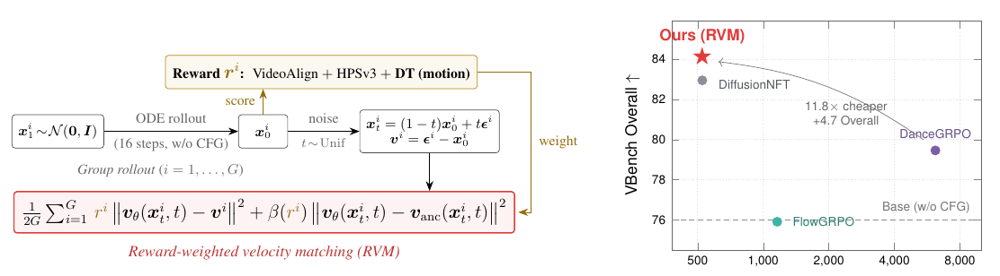
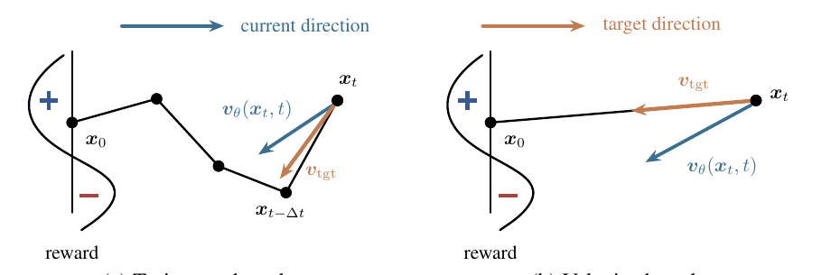
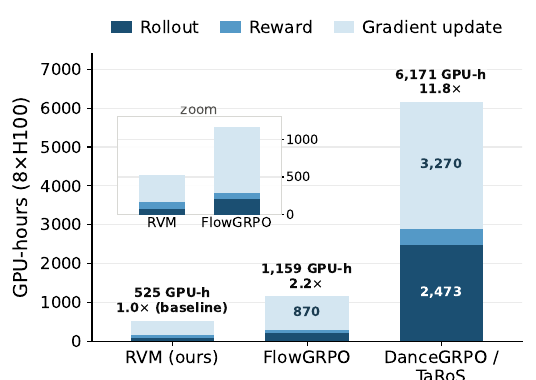
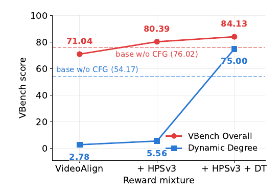
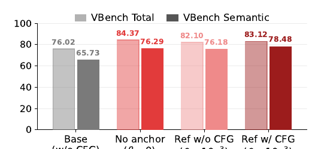
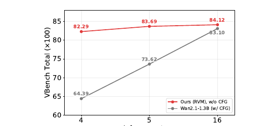
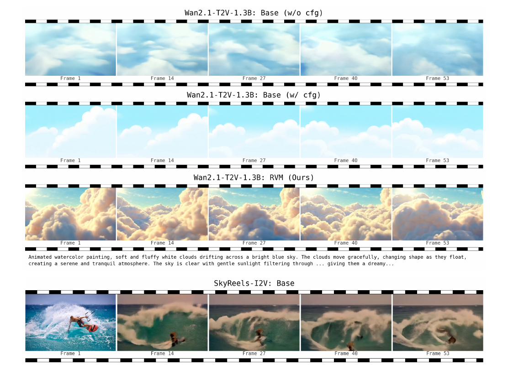

# RVM: Scaling Reinforcement Learning for Diffusion Models via Velocity Matching

> Jaemoo Choi, Wei Guo, Yuchen Zhu, Arash Vahdat, Molei Tao, Julius Berner, Yongxin Chen  
> Georgia Institute of Technology + NVIDIA · arXiv:2608.23664 · 2026-08-24 · [project](https://jaemoo-choi.github.io/RVM/)(代码 coming soon)

---

## 1. 一句话定位

**扩散模型的 reward fine-tuning 根本不需要 likelihood。** 现有方法从 LLM 那边搬来 policy gradient,但扩散模型算不出样本似然,于是要么沿去噪轨迹拼 per-step 转移概率(trajectory-based,贵且高方差),要么用 ELBO 近似端点似然(还是保留了 policy ratio)。RVM 直接跳过这一整套:把生成好的样本 `x_0` **加一次噪**到 `x_t`,用 reward 当**带符号的方向偏好**去做速度回归——正 reward 就往这个速度方向拉,负 reward 就推开。一个 loss,两项,没有 ratio、没有轨迹存储、没有 CFG、没有 clipping。

顺带证明了 **RAM 和 DiffusionNFT 都是它的特例**,以及在视频上 **reward 设计比 loss 形式重要得多**。

---

## 2. 要解决的问题

### 2.1 扩散模型没有可算的似然

LLM 的 policy gradient 天然成立,因为序列似然可以分解成逐 token 概率。扩散模型的端点似然 `π_θ(x_0)` 是不可解的,于是 GRPO 里的 policy ratio `ρ_θ(x_0) = π_θ(x_0)/π_old(x_0)` 根本写不出来。现有工作绕道有两条:

| 路线 | 做法 | 代价 |
|---|---|---|
| **Trajectory-based**(FlowGRPO / DanceGRPO / DDPO) | 把 `log π_θ(x_0)` 换成沿轨迹的逐步高斯转移 `log π_θ(x_{t-Δt} \| x_t)` | 必须跑**随机 SDE 采样**并**存整条轨迹**;更新绑死在训练用的那个 SDE sampler 上;`x_{t-Δt}` 本身是随机中间态,**不保证比 `x_t` 更接近 `x_0`**,所以方向噪声大 |
| **ELBO-based**(PEPG / EPG) | 用 ELBO 近似端点似然,只需存最终样本 `x_0`,训练时独立加噪到单个 `x_t` | 不用存轨迹了、可以用确定性 ODE 采样,**但仍然保留一个估计出来的 policy ratio `sg[ρ_θ]` 和时间权重 `w(t)`** |

论文提出的问题就是一句话:

> 如果 ELBO-based policy gradient 产生的模型更新**最终已经归约成了 reward 加权的速度回归**,那 likelihood 估计还有必要吗?

### 2.2 视频上 rollout 太贵

每个被打分的样本都要跑一次完整 rollout。DanceGRPO/TaRoS 用 50 步 SDE + CFG = **每条视频 100 次前向**。这在视频模型上是主要瓶颈。

### 2.3 通用 reward 会把视频训成静止画

这是论文在视频实验里发现的失效模式:VideoAlign 和 HPSv3 这类偏好/画质 reward,**在视频越来越静止的同时分数还在涨**。ablation 里不加运动 reward 时,VBench Dynamic Degree 只有 **2.78 / 5.56**(满分 100)——基本是幻灯片。

---

## 3. 与前作的关系

> **Fig 1 逐段解读**：
>
> **左半(方法流程)**——从 `x_1 ~ N(0,I)` 出发,走 **ODE rollout(16 步,不带 CFG)** 得到 `x_0^i`,一组 `G` 条(`Group rollout`)。这批 `x_0^i` 走两条路:
> - **向上**送进 reward 模型打分,`r^i = VideoAlign + HPSv3 + DT(motion)`,黄色框特意把 **DT** 加粗——这是本文新提的运动 reward。
> - **向右**只加**一次**噪声:`x_t^i = (1-t)x_0^i + t ε^i`,`t ~ Unif`,速度目标 `v^i = ε^i - x_0^i`。注意这里**没有轨迹**,就一个随机时刻的单点。
>
> 两条路在底部红框汇合成 loss:`r^i` 作为 weight 乘在速度回归项上(黄色箭头标注 `weight` 从 reward 绕回来)。红框就是 RVM 的全部内容——**一行公式,两项**。
>
> **右半(成本-性能散点)**——横轴是训练成本(GPU-hours,8×H100,**对数轴**),纵轴 VBench Overall。红星 RVM 在**最左上角**(约 500 GPU-h,84.13);DanceGRPO 在右侧约 6000 GPU-h、79.5;FlowGRPO 在约 1200 GPU-h 但只有 75.9,**低于虚线标出的 Base (w/o CFG) 基准**——即它把原模型训坏了。灰色曲线箭头标注 `11.8× cheaper / +4.7 Overall`,指 RVM 相对 DanceGRPO。

**同属 velocity-based 一族(本文证明它们同源)**:

- **DiffusionNFT**(Zheng et al., 2026a):从对比学习角度出发,定义正/负速度分支 `v_θ^± = v_anc ± β̄(v_θ - v_anc)`,让 reward 决定拉哪一支。
- **RAM / Reinforce Adjoint Matching**(Bergmeister et al., 2026):从最优控制角度出发。

**Trajectory-based 对照组**:FlowGRPO、DanceGRPO、TaRoS。

**ELBO-based 对照组**:EPG / PEPG(Choi et al., 2026 —— 本文一作的前作,RVM 的实现也是"following implementation of Choi et al. 2026")。

📌 **谱系定位**:DDPO/FlowGRPO(轨迹似然)→ PEPG(ELBO 端点似然,去掉轨迹)→ **RVM(连似然都不要,直接在速度场上做)**。三步都在削减"从 LLM 搬过来的 RL 机械装置"。

---

## 4. 核心方法

### 4.1 为什么速度方向比轨迹方向更好

> **Fig 2 逐面板解读**：两张图左侧都画了同一条竖线和一条 S 形曲线代表 **reward**,上半标 `+`(高 reward 区)、下半标 `−`(低 reward 区),`x_0` 落在 `+` 区。
>
> **(a) Trajectory-based**——从 `x_t` 出发的折线是**采样轨迹**,经过若干中间态最后到 `x_0`。蓝色箭头 `v_θ(x_t,t)` 是模型当前方向,橙色箭头 `v_tgt` 指向**下一个去噪态 `x_{t-Δt}`**。关键是看折线形状:`x_{t-Δt}` 在图上被画得**比 `x_t` 离 `x_0` 更远**(折线绕了一圈)。这就是论文的论点——`x_{t-Δt}` 是 SDE 采样出来的随机中间态,**不保证比当前状态更接近干净端点**,所以这个目标方向既有噪声也不是最优的。
>
> **(b) Velocity-based**——同样从 `x_t` 出发,但橙色 `v_tgt` 直接指向 `x_0`(图上是一条**直线**)。目标是 `v_tgt = ε - x_0`,由端点定义,与采样器无关。蓝色 `v_θ(x_t,t)` 是当前方向,loss 把它往橙色方向拉(reward 为正时)或推开(为负时)。
>
> 两张图并排的信息量在于:**(a) 的目标依赖于你用哪个 SDE sampler、这一次采样恰好走到哪里;(b) 的目标只依赖于最终样本本身。** 后者方差更低、也更直接。

### 4.2 RVM 目标函数

从采样策略 `π_old` 抽一组 `{x_0^i}` (`i = 1..G`),每个**独立加噪一次**到 `x_t^i = (1-t)x_0^i + t ε^i`(`t ~ Unif(0,1)`),速度目标 `v^i := ε^i - x_0^i`。目标函数:

$$
\mathcal{L}_{\mathrm{rvm}} = \frac{1}{2}\,\mathbb{E}_{x_0^{1:G} \sim \pi_{\mathrm{old}}}\!\left[\, r_{\mathrm{rvm}}^i \big\lVert v_\theta(x_t^i, t) - v^i \big\rVert_2^2 \;+\; \beta(r_{\mathrm{rvm}}^i)\, \big\lVert v_\theta(x_t^i, t) - v_{\mathrm{anc}}(x_t^i, t) \big\rVert_2^2 \,\right]
$$

两项各司其职:

- **第一项(reward 加权速度匹配)**:`r > 0` 时把 `v_θ` 拉向 `v^i`(即拉向那个高 reward 样本的方向);**`r < 0` 时符号翻转,变成把 `v_θ` 推离 `v^i`** —— 这就是"抑制低 reward 生成"的全部机制,不需要任何对比项或负样本构造。
- **第二项(anchor 锚定)**:把 `v_θ` 拴在一个可信的速度场 `v_anc` 附近,强度由 `β` 控制。`v_anc` 可以是冻结的 reference `v_ref`,也可以是当前策略的 EMA。

整个方法只剩**两个设计选择**:`(I) reward r_rvm 怎么塑形`、`(II) anchor 用什么`。

📌 **默认配置里 `β = 0`**,也就是说主实验里 anchor 项根本没开,每次更新就是纯粹的 reward 加权速度回归。

### 4.3 统一定理：RAM 和 DiffusionNFT 都是特例

**RAM** 的目标写成

$$
\mathcal{L}_{\mathrm{ram}} = \tfrac{1}{2}\,\mathbb{E}\left\lVert v_\theta - \mathrm{sg}\!\left[v_{\mathrm{ref}} + r_{\mathrm{ram}}^i\,(v^i - v_\theta)\right]\right\rVert^2
$$

对 `v_θ` 求梯度得 `r_ram(v_θ - v^i) + (v_θ - v_ref)`,**正好是 RVM 梯度在 `v_anc = v_ref`、`β ≡ 1`、`π_old = π_θ` 时的形式**。

**DiffusionNFT** 定义正负分支 `v_θ^± = v_anc ± β̄(v_θ - v_anc)`,loss 是

$$
\mathcal{L}_{\mathrm{nft}} = \frac{1}{2\bar\beta}\,\mathbb{E}\left[\, r_{\mathrm{nft}}^i \lVert v_\theta^+ - v^i\rVert^2 + (1 - r_{\mathrm{nft}}^i)\lVert v_\theta^- - v^i\rVert^2 \,\right]
$$

配方展开后等于 RVM,只差与 `θ` 无关的常数,对应 `v_anc =` EMA 速度、`r_rvm := 2r_nft - 1`、`β(r_rvm) = β̄ - r_rvm`。

**Theorem 3.1** 把两者收在一起。更有用的是 Table 4 给的**共享回归形式**:

$$
\mathbb{E}\left[\frac{c(r^i)}{2}\left\lVert v_\theta - v_{\mathrm{anc}} - A(r^i)\,(v^i - v_{\mathrm{anc}})\right\rVert_2^2\right]
$$

这里 `v_θ - v_anc` 是"当前速度离锚点多远",`v^i - v_anc` 是"从锚点指向 flow-matching 目标的方向",`A(r)` 决定**沿这个方向走多远(reach)**,`c(r)` 是整体权重(scale)。

| 方法 | 采样策略 | Anchor `v_anc` | Scale `c(r)` | Reach `A(r)` |
|---|---|---|---|---|
| RAM | `π_θ` | `v_ref` | `r_ram + 1` | `r_ram/(r_ram + 1)` |
| DiffusionNFT | `π_old` | EMA 速度 | `β̄` | `(2r_nft - 1)/β̄` |
| **RVM(本文)** | `π_old` | **任意** | `β(r_rvm/β + 1)` | `(r_rvm/β)/(r_rvm/β + 1)` |

📌 **一个从这个表才看得出来的细节**:DiffusionNFT 的 reach 是把带符号 reward **除以 guidance 强度 `β̄`**,所以当 `2r_nft - 1 > β̄` 时,**回归目标会落到 `v^i` 之外**(过冲)。这是它与 RAM/RVM 的实质差异之一,原论文里看不出来。

**与 ELBO-based 的连接**:把 EPG 的 ELBO 估计代入后,它归约成

$$
\mathcal{L}_{\mathrm{epg}} = \mathbb{E}\left[ w(t)\,\mathrm{sg}[\rho_\theta(x_0^i)]\, r_{\mathrm{epg}}^i \lVert v_\theta - v^i\rVert^2 + \beta \lVert v_\theta - v_{\mathrm{ref}}\rVert^2 \right]
$$

**丢掉 `sg[ρ_θ]` 和 `w(t)` 这两项,就精确地变成 RVM。** 而 `ρ_θ` 本身还得靠 ELBO 去近似——论文的论点就是:既然最后长这样,那前面那一整套似然推导是可以省掉的。

⚠️ **论文自己给的 Remark(诚实但重要)**:在纯 on-policy 且总体极限下,不动点条件是

$$
0 = \mathbb{E}\left[\beta(r)\,(v_\theta - v_{\mathrm{anc}}) + r\,(v_\theta - v)\ \middle|\ x_t\right]
$$

**学到的速度场 `v_θ` 并不自动等于它自己端点分布所诱导的条件速度。** 也就是说这套方法**没有收敛性保证**,它是一个有效的启发式更新,不是一个有理论保证的策略优化。

### 4.4 DT reward：让视频真的动起来

标准偏好 reward 会奖励"干净但静止"的视频,所以论文加了一个基于 RAFT 光流的 **dynamic-tracking (DT) reward**。

取生成视频的 `n` 个等间隔子帧,对每对相邻帧估计光流 `u_k = RAFT(f_k, f_{k+1})`,然后**只看最快的那 5% 像素**:

$$
m_k = \frac{1}{\lvert S_k \rvert} \sum_{p \in S_k} \lVert u_k(p) \rVert_2
$$

其中 `S_k` 是光流幅度最大的 `⌊0.05·HW⌋` 个像素。

📌 **取 top-5% 而不是全图均值,是为了衡量"运动的那部分动得多快",而不是"画面有多大比例在动"**——后者会被整体镜头平移刷分。

再对分辨率自适应的阈值 `τ = 6·min(H,W)/256` 归一化并截断:

$$
R_{\mathrm{dt}}(x_0) = \frac{1}{n}\sum_{k=1}^{n} \min\!\left(\frac{m_k}{\tau},\, 1\right) \in [0, 1]
$$

**I2V 用的第二版 DT2**——因为 `R_dt` 对任何光流都单调增,fine-tuning 可以靠**整幅背景平移**把它刷上去而主体纹丝不动。DT2 先减掉逐对光流的**中位数** `m̃_k` 以抵消全画幅运动:

$$
m_{\mathrm{fg}} = \frac{1}{n}\sum_{k=1}^{n}(m_k - \tilde{m}_k)
$$

再用一个**双边窗口**打分,让运动过少和过多都得 0:

$$
R_{\mathrm{dt2}}(x_0) = \mathrm{clip}\!\left(\frac{m_{\mathrm{fg}} - \tau_{\mathrm{lo}}}{\tau_{\mathrm{mid}} - \tau_{\mathrm{lo}}}, 0, 1\right) \cdot \mathrm{clip}\!\left(\frac{\tau_{\mathrm{hi}} - m_{\mathrm{fg}}}{\tau_{\mathrm{hi}} - \tau_{\mathrm{mid}}}, 0, 1\right) \in [0,1]
$$

阈值 `(τ_lo, τ_mid, τ_hi) = (3, 5, 8)`,来自早期 fine-tuning 产物的人工标注。

📌 DT2 这个设计本身就是一份 **reward hacking 事故报告**:作者先做了 DT,发现模型学会了"晃镜头骗分",于是用减中位数堵住这条路,又用上界防止"动得过头"。这类细节比方法本身更有工程价值。

---

## 5. 关键实现细节

⚠️ **代码未开源**(项目页写 "Code coming soon"),以下全部来自 Appendix C。

### 5.1 训练配置(Table 5)

| 超参 | Wan2.1-T2V-1.3B | SkyReels-I2V | SD3.5-M (OCR) |
|---|---|---|---|
| 任务 | text-to-video | image-to-video | text-to-image |
| 分辨率 | 480×832 | 400×640 | 512×512 |
| 帧数 / fps | 53 / 15 | 53 / 15 | — |
| 采样器 | DPM-Solver-2 **ODE** | DPM-2 ODE | DPM-2 ODE |
| 采样步数 | **16** | 16 | 10 |
| flow-matching shift | 8.0 | — | — |
| LoRA rank | 128 | 32 | 32 |
| LoRA α | 64 | 64 | 64 |
| 学习率 | 5e-5 | 5e-5 | 5e-5 |
| Group size `K` | 8 | 8 | 24 |
| 每次迭代 prompt 数 | 32 | 16 | 48 |
| 每 epoch 优化步 | 2 | 2 | 1 |
| 每次更新样本数 | 128 | 64 | 1152 |
| 训练 epoch | 90 | 40 | 500 |
| **Anchor 强度 `β`** | **0** | **0** | 1e-4 |
| 梯度裁剪 | 1.0 | 1.0 | **0.02** |
| **CFG** | **1.0(不用)** | 1.0 | 1.0 |
| GPU | 8 | 8 | 6 |

其余共享:AdamW(`β₁=0.9, β₂=0.999`,weight decay `1e-4`,`ε=1e-8`),bf16,固定种子,**全程 backbone 冻结只训 LoRA**,**无 policy-ratio clipping**。EMA 副本(decay 0.9)只在 anchor 消融里用。

### 5.2 Reward 混合权重

三个默认 run 共用同一套:

| 分量 | 权重 | 说明 |
|---|---|---|
| VideoAlign **TA**(文本对齐) | 1.5 | 权重最高 |
| VideoAlign **MQ**(运动质量) | 1.0 | |
| **HPSv3** general | 0.1 | 人类偏好 |
| **HPSv3** percentile | 0.1 | |
| **DT**(本文) | 0.7 | I2V 换成 DT2 |
| VideoAlign **VQ**(画质) | **不使用** | 被 HPSv3 替代 |

每个样本的权重 = **组内标准化** `(R - mean_g R)/std_g R`,再乘 0.1;⚠️ **标准差是跨整个 batch 全局算的,不是每组各算各的**。

### 5.3 数据

- **Wan2.1-T2V**:DanceGRPO 放出的 prompt 语料(源自 VidProM),**48,998 条**,未做额外预处理。
- **SkyReels-I2V**:按 DanceGRPO 的 I2V 协议,**27,000 条** prompt(来自 ConsisID);因为模型要吃首帧,**用 FLUX 按 640×400 预生成参考图并缓存**。
- **评测**:Wan2.1 用 Self Forcing 放出的 946 条 VBench 扩写 prompt,每 prompt 生成 **1 条**视频;SkyReels 用官方 VBench-I2V 的 1,118 对。

---

## 6. 实验结果

### 6.1 T2V 主结果（Table 1，Wan2.1-T2V-1.3B）

| 方法 | TA | VQ | MQ | HPSv3 | Dyn. Deg. | Quality | Semantic | Overall |
|---|---|---|---|---|---|---|---|---|
| Base(w/o CFG) | 2.53 | 2.33 | 0.35 | 1.85 | 54.17 | 78.59 | 65.73 | 76.02 |
| **Base(w/ CFG)** | 5.50 | 4.08 | 0.97 | 7.85 | 65.28 | 83.72 | **80.64** | 83.10 |
| *Trajectory-based* | | | | | | | | |
| FlowGRPO | 2.48 | 2.24 | 0.27 | 1.62 | 55.56 | 78.67 | 64.87 | 75.91 |
| DanceGRPO† | −1.17 | 3.41 | 0.30 | – | 58.33 | 82.81 | 66.06 | 79.46 |
| TaRoS† | −0.71 | 3.50 | 0.31 | – | 57.67 | 83.23 | 66.26 | 79.84 |
| TaRoS-72B† | – | – | – | – | 58.33 | 83.66 | 68.15 | 80.56 |
| *Velocity-based* | | | | | | | | |
| DiffusionNFT | 5.03 | 5.04 | 1.63 | 9.70 | 63.89 | 84.37 | 77.28 | 82.95 |
| RAM | 4.86 | 4.23 | 1.14 | 8.39 | 61.11 | 83.35 | 76.33 | 81.95 |
| **RVM(本文)** | **5.12** | **5.47** | **1.86** | **10.90** | **75.00** | **86.09** | 76.28 | **84.13** |

† 引用数字,协议不同(CFG、50 步 SDE、每 prompt 5 条视频),论文明确标注 "uncontrolled"。

三个读法:

- **velocity-based 整体压过 trajectory-based**。三个 velocity 方法(82.95 / 81.95 / 84.13)全部高于三个 trajectory 方法(75.91 / 79.46 / 80.56)。
- **RVM 的优势集中在运动**:Dyn. Degree 75.00,而 trajectory 方法只有 55–58。
- ⚠️ **但 Semantic 是 RVM 唯一的短板**:76.28,**低于 DiffusionNFT 的 77.28,更远低于 base w/ CFG 的 80.64**。VBench Overall 用的加权是 `0.8·Quality + 0.2·Semantic`,**这个 4:1 的权重天然放大了 RVM 在 Quality 上的优势、稀释了它在 Semantic 上的劣势**。

### 6.2 I2V 结果（Table 2，SkyReels-I2V）

| 方法 | TA | VQ | MQ | HPSv3 | Dyn. Deg. | I2V | Quality | Overall |
|---|---|---|---|---|---|---|---|---|
| Base | 2.45 | 2.30 | 0.06 | 3.18 | 64.63 | 87.79 | 75.57 | 81.68 |
| FlowGRPO | 1.67 | 1.61 | −0.47 | −1.85 | 41.46 | 86.00 | 69.93 | 77.97 |
| DiffusionNFT | 2.65 | **2.59** | **0.61** | 6.43 | 47.56 | 93.18 | 79.15 | 86.16 |
| **RAM** | 2.68 | 2.56 | 0.49 | **6.57** | 51.22 | **93.49** | 79.72 | **86.61** |
| RVM(本文) | **2.70** | 2.45 | 0.41 | 6.03 | **72.36** | 92.26 | **80.28** | 86.27 |

📌 **这张表最值得注意的一点:VBench-I2V 的 Overall 是两项的算术平均(不是 0.8/0.2 加权),于是 RVM 就不是第一了**(86.27 < RAM 的 86.61)。把 6.1 和 6.2 放在一起看,可以确认 T2V 那边的"第一"有相当一部分来自聚合权重的选择,而不是全面占优。

另外 **FlowGRPO 在两个视频设置上都把 base model 训坏了**(T2V 75.91 < 76.02;I2V 77.97 < 81.68),这个结果相当反常,论文没有解释。

### 6.3 T2I 结果（Table 3 / Table 6）

**OCR 文本渲染任务(SD3.5-M)**,RVM 几乎全项最好:

| 方法 | OCR | PickScore | ClipScore | HPSv2.1 | Aesthetic | ImgRwd |
|---|---|---|---|---|---|---|
| FlowGRPO† | 0.92 | 22.41 | 0.290 | 0.280 | 5.32 | 0.95 |
| AWM† | 0.80 | 20.70 | 0.301 | 0.206 | 4.53 | −0.13 |
| DiffusionNFT† | 0.93 | 22.09 | 0.307 | 0.277 | 5.17 | 0.97 |
| PEPG† | 0.94 | 22.93 | **0.315** | 0.302 | 5.33 | **1.34** |
| **RVM** | **0.95** | **23.03** | 0.312 | **0.310** | **5.56** | **1.34** |

⚠️ **但 DrawBench 上的 PickScore 任务(Table 6,藏在附录 D)RVM 反而最弱**:

| 方法 | PickScore | ClipScore | HPSv2.1 | Aesthetic | ImgRwd |
|---|---|---|---|---|---|
| FlowGRPO† | 23.50 | 0.280 | 0.316 | 5.90 | 1.29 |
| DiffusionNFT† | 23.61 | 0.288 | **0.344** | 6.04 | **1.46** |
| PEPG† | **23.68** | **0.296** | 0.325 | **6.06** | 1.45 |
| **RVM** | **23.30**(最低) | 0.289 | 0.333 | **5.82**(最低) | 1.38 |

论文只用一句 "remains competitive" 带过。**把这两张表并排看,更准确的结论是:RVM 在需要强优化特定 reward 的任务(OCR)上很强,在通用偏好任务上并无优势。**

### 6.4 训练成本（Fig 4）

> **Fig 4 解读**：堆叠柱状图,把训练时间拆成三段——深蓝 `Rollout`、中蓝 `Reward`、浅蓝 `Gradient update`。
>
> - **RVM(ours)**:总计 **525 GPU-h**,柱子矮到需要左上角开一个 zoom 小窗才看得清构成。
> - **FlowGRPO**:**1,159 GPU-h**(标注 `2.2×`),其中 870 是 rollout。
> - **DanceGRPO / TaRoS**:**6,171 GPU-h**(标注 `11.8×`),rollout 2,473 + gradient update 3,270。
>
> 差距的两个来源论文说得很清楚:**(1) 每次 rollout 的函数求值次数不同**——RVM 16 步 ODE 不带 CFG = 16 NFE,FlowGRPO 40 步 SDE 不带 CFG = 40 NFE,DanceGRPO/TaRoS 50 步 SDE 带 CFG = **100 NFE**;**(2) 各自标准协议下的训练迭代数也不同**。
>
> ⚠️ 所以这个 11.8× **不是同协议下的对照**,而是"各自默认配方"的端到端对比。

### 6.5 Reward 设计消融（Fig 5，全文最重要的一张图）

> **Fig 5 解读**：横轴三种 reward 组合,双折线。红线 = VBench Overall,蓝线 = Dynamic Degree。两条水平虚线是 base(w/o CFG)的对应基准(红 76.02 / 蓝 54.17)。
>
> | reward 组合 | VBench Overall | Dynamic Degree |
> |---|---|---|
> | 仅 VideoAlign | 71.04(**低于 base 76.02**) | **2.78** |
> | + HPSv3 | 80.39 | **5.56** |
> | + HPSv3 + DT | **84.13** | **75.00** |
>
> **蓝线的形状是全文最触目惊心的地方**:前两组的 Dynamic Degree 是 **2.78 和 5.56**——几乎是静止画面,而且**比什么都不做的 base(54.17)差一个数量级**。也就是说仅用 VideoAlign / HPSv3 做 RL,模型会主动把视频训成幻灯片来刷偏好分。加上 DT 之后直接跳到 75.00。
>
> 红线也值得注意:**只用 VideoAlign 时 Overall 71.04 比 base 还低**,说明这不是"提升多少"的问题,而是"不加运动 reward 就是负优化"。

### 6.6 Anchor 消融（Fig 6）

> **Fig 6 解读**：分组柱状图,浅灰 = VBench Total,深灰/红 = VBench Semantic,四组配置。
>
> | 配置 | VBench Total | VBench Semantic |
> |---|---|---|
> | Base(w/o CFG) | 76.02 | 65.73 |
> | **No anchor(`β = 0`)** | **84.37** | 76.29 |
> | Ref w/o CFG(`β = 1e-3`) | 82.10 | 76.18 |
> | Ref w/ CFG(`β = 1e-3`) | 83.12 | **78.48** |
>
> 结论有点反直觉:**不加 anchor 反而 Total 最高**。anchor 的价值在别处——锚到**带 CFG 的 reference** 能把 Semantic 从 76.29 拉到 78.48,即"把 CFG 的 prompt 遵循能力迁移给一个不用 CFG 的策略"。所以论文说 anchor "governs the training dynamics rather than the metrics"。
>
> 📌 这也解释了为什么主实验默认 `β = 0`:作者是拿 Total 当主指标调的。如果更在意语义对齐,应该开 CFG anchor。

### 6.7 少步采样鲁棒性（Fig 7，意外收获）

> **Fig 7 解读**：横轴推理步数(4 / 5 / 16),纵轴 VBench Total。红线 RVM(不带 CFG),灰线 base(带 CFG)。
>
> | 步数 | RVM(w/o CFG) | Base(w/ CFG) |
> |---|---|---|
> | 16 | 84.12 | 83.10 |
> | 5 | 83.69(−0.43) | 73.62(−9.48) |
> | 4 | 82.29(−1.83) | 64.39(−18.71) |
>
> **base 模型即使开着 CFG 也会随步数减少而崩塌**(83.10 → 64.39),而 RVM 几乎是平的。**RVM 的 4 步结果(82.29)仍然优于 base 的 16 步带 CFG 结果(83.10)之下但很接近**,而后者要花 2× NFE(CFG)× 4× 步数 = 8 倍算力。
>
> 论文给的解释是:直接把速度往"已被奖励的干净样本 `x_0`"上匹配,**学到的速度场朝高 reward 区域的曲率更小**,所以对粗糙的步长离散化更鲁棒。这个解释合理但**论文没有给曲率的直接测量**,属于事后归因。

### 6.8 定性对比（Fig 3）

> **Fig 3 逐行解读**：同一条 prompt(动画水彩风格、蓬松白云飘过蓝天)下三行对比,每行是 Frame 1/14/27/40/53 的胶片条。
>
> - **Base(w/o cfg)**——云是模糊的低频色块,几乎看不出结构,帧间变化也很小。
> - **Base(w/ cfg)**——干净多了,天空通透、云朵成形,**但整段几乎不动**:五帧之间云的位置和形状变化极小。这正好对应 Table 1 里 base w/ CFG 的 Dyn. Degree 只有 65.28,以及 §6.5 说的"偏好 reward 偏爱静止"。
> - **RVM(Ours)**——云层有明确的体积感和光照(金色边缘、层次分明),**而且五帧之间视角在明显推进**,云团的相对位置持续变化。
>
> 这一组的说服力在于:第 2 行和第 3 行的画质差距不算悬殊,**真正的差距在"有没有在动"**——这也是全文的核心卖点。

---

## 7. 争议与权衡

**① DT reward 和 VBench Dynamic Degree 用的是同一个东西。** 这是我认为最需要打问号的地方。DT reward 明说 "built on RAFT optical flow";而 VBench 的 Dynamic Degree 维度**本身就是用 RAFT 光流幅度算的**。论文在 §4.1 声称 "we separate the rewards used for training from the metrics used for evaluation, allowing us to assess whether improvements generalize beyond the optimized reward signals" —— **但对 DT 这一项,这条分离并不成立**。Fig 5 里 Dynamic Degree 从 5.56 跳到 75.00,很难区分其中多少是"视频真的动起来了",多少是"直接优化了评测指标本身"。Fig 3 的定性图支持前者,但这是主观证据。论文完全没有讨论这个同源问题。

**② VBench Overall 的聚合权重决定了排名。** T2V 用 `0.8·Quality + 0.2·Semantic`,而 RVM 恰好是 Quality 最高(86.09)、Semantic 偏低(76.28,输给 DiffusionNFT 的 77.28)。换成 I2V 那种**算术平均**,RVM 立刻从第一掉到第二(86.27 < RAM 86.61)。**同一批方法在两种聚合下排名就变了**,说明"最优"这个结论比论文呈现的脆弱。

**③ 逐维度看有真实退化(Table 7)。** RVM 的 temporal flickering **97.25 是全表最低**(base w/o CFG 都有 98.95);appearance style 19.14 也是最低(base 21.05);color 75.94 远低于 base w/ CFG 的 91.40。**运动和画质的提升是有代价的**,而这些代价被 Quality 的平均和 0.8 权重盖住了。

**④ 真正的对照应该是 base w/ CFG,不是 base w/o CFG。** 论文行文一直在跟 CFG-free base(76.02)比,显得提升有 8 分。但 base w/ CFG 是 83.10,**RVM 只高 1.03**。当然 RVM 推理不需要 CFG(省一半 NFE),这是实打实的好处,但**"+1.03 分且省一半推理算力"是比"+8.11 分"诚实得多的表述**,论文没有这么写。

**⑤ 11.8× 的成本优势不是同协议对比。** DanceGRPO/TaRoS 的数字是引用的,协议不同(CFG、50 步 SDE、每 prompt 5 条视频),论文自己标了 "uncontrolled"。真正同协议的对照只有 FlowGRPO(2.2×),而 FlowGRPO 在这篇里的表现异常差(把 base 训坏了),这个 2.2× 的分母本身可信度存疑。

**⑥ FlowGRPO 的复现结果异常。** 一个被广泛使用的方法,在两个视频设置上都让 base model 退步(T2V −0.11,I2V −3.71)。这要么说明 FlowGRPO 在视频上确实不行,要么说明调参不足。论文一句解释都没有。作为对照组的可信度打折。

**⑦ 没有理论保证。** 论文自己的 Remark 承认:on-policy 不动点条件下,**学到的 `v_θ` 不保证等于其自身端点分布诱导的条件速度**。也就是说 RVM 是一个"能用"的更新规则,不是一个有收敛保证的策略优化算法。相比之下 trajectory-based 方法至少还挂在 policy gradient 的理论框架下。论文把这一点放在小字 Remark 里。

**⑧ 代码未开源**("coming soon"),Table 5 给的超参虽然完整,但 reward 混合、DT2 阈值标定、group 标准化的实现细节都不易精确复现。

**⑨ 正面:统一定理是真有用的。** Table 4 那个 `(anchor, scale, reach)` 三元组把三个看起来完全不同(控制论 / 对比学习 / 直接回归)的方法放进同一个坐标系,而且**读出了原论文里看不到的性质**(DiffusionNFT 的 reach 会过冲)。这比单纯说"我们更好"有价值。

**⑩ 正面:结论对工程有直接指导。** "loss 形式不重要,reward 设计才重要"——三个 velocity 方法只差几分,而换 reward 组合能差 13 分(71.04 → 84.13)。**如果这个结论成立,那么投入应该从设计新 loss 转向设计 reward 和防 hacking**,DT2 那套"减中位数 + 双边窗口"就是这个方向的具体样板。

---

## 8. 一句话总结

RVM 的贡献不是发明了一个新 loss,而是**证明了那个 loss 一直就在那儿**:把 ELBO-based policy gradient 里的 `sg[ρ_θ]` 和 `w(t)` 两项丢掉,剩下的就是 reward 加权的速度回归,而 RAM 和 DiffusionNFT 也不过是它在 `(anchor, scale, reach)` 三元组上的不同取值;既然三者表现只差几分、而换 reward 能差十几分,**扩散模型 RL 的真问题就从"设计什么 policy 目标"转移到了"设计什么 reward、以及怎么防它被 hack"**——DT/DT2 那套光流 reward 就是这个转向的第一个具体产物。

---

## Q&A

**Q: RVM 和 DiffusionNFT、RAM 到底是不是一回事?如果是,新意在哪?**

A: **梯度层面基本是一回事,新意在"指出它们是一回事"以及由此得到的结论。**

Theorem 3.1 给的是精确对应:

| | 采样策略 | anchor | reward 变换 | anchor 强度 |
|---|---|---|---|---|
| RAM = RVM | `π_old = π_θ` | `v_ref` | `r_rvm = r_ram` | `β ≡ 1` |
| DiffusionNFT = RVM | `π_old` | EMA 速度 | `r_rvm = 2r_nft − 1` | `β = β̄ − r_rvm` |

RAM 是**梯度相等**,DiffusionNFT 是**loss 相差一个与 θ 无关的常数**(所以梯度也相等)。

新意有三层:

1. **RVM 本身更简单**——不需要像 RAM 那样把 anchor 强度固定为 1,也不需要像 DiffusionNFT 那样构造正负分支,anchor 可以任选、`β` 可以为 0(默认就是 0)。
2. **统一坐标系读出了新性质**。Table 4 的 reach 那一列显示,DiffusionNFT 把带符号 reward 除以了 guidance 强度 `β̄`,所以 `2r_nft − 1 > β̄` 时**回归目标会落到 `v^i` 之外**——这是过冲,原论文的对比学习叙述里完全看不出来。
3. **实验结论**:既然同源,那三者表现接近就是可预期的(Table 1:82.95 / 81.95 / 84.13),于是**"再设计一个新 loss"的边际收益很低**,注意力应该转向 reward。这个结论本身比方法更有价值。

---

**Q: 为什么说轨迹方法的目标方向"有噪声"?它不是也在往 `x_0` 走吗?**

A: **它往的是"下一个采样点",而下一个采样点不保证比当前点更接近 `x_0`。**

trajectory-based 方法提升的是**这一步转移的似然** `log π_θ(x_{t−Δt} | x_t)`。也就是说,它把"从 `x_t` 走到 `x_{t−Δt}` 这个动作"当成要强化的行为。但 `x_{t−Δt}` 是 **SDE 采样器随机抽出来的中间态**——它带着这一步注入的随机噪声,在高维空间里完全可能偏到一边去。Fig 2(a) 就是画这个:折线绕了一圈,`x_{t−Δt}` 反而比 `x_t` 离 `x_0` 更远。

而 RVM 的目标 `v_tgt = ε − x_0` 是**由端点定义的**:给定最终样本 `x_0` 和这次加的噪声 `ε`,方向就唯一确定,和用什么采样器、这次采样恰好走到哪里都无关。

两个连带后果:

- **trajectory 方法的更新绑死在训练时用的那个 SDE sampler 上**,换采样器就得重训;RVM 的训练和采样完全解耦,所以它可以**用确定性 ODE 采样(更省 NFE)**而训练不受影响。
- 轨迹方法必须**存整条轨迹**才能算逐步 ratio,RVM 只存最终的 `x_0`,训练时现场加一次噪。这是 525 vs 1,159/6,171 GPU-h 的主要来源之一。

---

**Q: `r < 0` 的时候,那个 loss 不就变成负的了吗?这样优化会不会发散?**

A: **会变成负的,而且这正是"抑制"的机制;不发散是因为有几层约束兜着。**

第一项 `r·‖v_θ − v‖²`,当 `r < 0` 时确实是个**上凸**的项,梯度方向是把 `v_θ` **推离** `v`。单独看,推离是无界的——理论上可以一直推到无穷远。

实际不炸的原因有四层:

1. **reward 是组内标准化的**,`(R − mean_g R)/std_g R`,所以一个 batch 里正负 reward 大致平衡,推和拉互相抵消。
2. **再乘 0.1 缩放**,单步位移很小。
3. **梯度裁剪** 1.0(OCR 任务甚至是 0.02)。
4. **LoRA 而非全参训练**,表达能力本身受限,加上 backbone 冻结,漂移空间有限。

另外 anchor 项(`β > 0` 时)是二次的、始终把 `v_θ` 往 `v_anc` 拉,可以显式兜底。但**主实验 `β = 0`**,也就是说作者认为前四层就够了。

⚠️ 值得注意的是,论文的 Remark 承认这套更新**没有不动点保证**——`v_θ` 不保证收敛到任何一个有意义的条件速度场。所以"不发散"是工程观察,不是理论结论。

---

**Q: DT reward 为什么只看最快的 5% 像素?**

A: **为了区分"运动的那部分动得多快"和"画面有多大比例在动"。**

如果用全图光流均值,一个整体缓慢平移的镜头(背景全在动、主体静止)会拿到不低的分数,而一个背景静止、主体快速运动的镜头反而分数低。前者恰恰是模型最容易学会的 hack。

取 top-5% 幅度的像素求均值,`m_k` 衡量的就变成"画面里动得最快的那部分有多快"。

即便如此,DT 还是被 hack 了 —— 论文在 I2V 上发现模型学会了**整幅背景平移**来刷分(因为 `R_dt` 对任何光流都单调增)。所以第二版 DT2 加了两道防线:

1. **减去逐对光流的中位数** `m_fg = mean(m_k − m̃_k)`。整幅画面一起动的时候,中位数和 top-5% 一起涨,相减后抵消,**只有前景相对背景的运动才留下**。
2. **双边窗口**而不是单调函数:`(τ_lo, τ_mid, τ_hi) = (3, 5, 8)`,运动太少得 0,**运动太多也得 0**。因为"真实的主体运动落在一个中间区间",过量运动通常意味着画面撕裂或闪烁。

阈值是从早期 fine-tuning 产物的**人工标注**里定的——也就是说这套设计是被 reward hacking 逼出来的,不是先验设计的。

---

**Q: 主实验默认 `β = 0`,那 anchor 项还有什么用?**

A: **它不提升主指标,但能迁移 CFG 的语义能力,是一个"要什么就锚什么"的旋钮。**

Fig 6 的四组对比很清楚:

- **不加 anchor Total 最高(84.37)** —— 所以论文默认关掉它。
- **锚到带 CFG 的 reference,Semantic 从 76.29 涨到 78.48**,Total 略降到 83.12。

这个现象的含义是:训练和推理**全程不用 CFG**(省一半 NFE),但可以通过把 `v_θ` 锚向"带 CFG 的参考速度场",**把 CFG 带来的 prompt 遵循能力蒸馏进一个 CFG-free 的策略里**。

所以 anchor 的定位是:

| 你想要 | 建议 |
|---|---|
| VBench Total / 画质 / 运动最高 | `β = 0`(论文默认) |
| 语义对齐更重要 | 锚到带 CFG 的 reference,`β = 1e-3` |
| 防止漂移过大 / 保留 base 特性 | 锚到 `v_ref` 或 EMA |

📌 反过来说,主实验用 `β = 0` 也意味着**论文报的 Semantic 偏低(76.28)是一个可以调的结果**,不是方法的固有上限。

---

**Q: 少步采样变鲁棒这件事可信吗?**

A: **现象很扎实,解释是事后归因。**

现象本身很难反驳(Fig 7):base 带 CFG 从 16 步的 83.10 掉到 4 步的 64.39(−18.71),RVM 不带 CFG 从 84.12 只掉到 82.29(−1.83)。而且两者用的是**同一套 timestep schedule**(从训练用的 16 步网格子采样,保留同样的低噪尾部),这个对照是干净的。

论文的解释是"直接把速度匹配到已被奖励的干净样本 `x_0`,学到的速度场朝高 reward 区域的曲率更小,所以对粗糙离散化更鲁棒"。这个说法与 flow matching 里"直化轨迹 → 少步采样"的既有认识一致(rectified flow、InstaFlow 都是这个思路),**但论文没有测量曲率,也没有与专门做少步蒸馏的方法比较**。

一个更朴素的可能解释是:**训练时就是在 16 步 ODE 网格上采样并优化的**,所以模型对这个网格(及其子集)过拟合得比较好。论文没有做"改用不同步数训练"的交叉验证来排除这一点。

顺带一提,这一点如果成立,对工程是有意义的:RVM 之后接 few-step 蒸馏可能更容易,或者干脆省掉蒸馏这一步。

---

**Q: 这套方法跟 RAVEN 的 CM-GRPO 是什么关系?**

A: **两者都在做"别硬套 LLM 的 policy gradient",但切入点相反。**

| | CM-GRPO(RAVEN) | RVM(本文) |
|---|---|---|
| 出发点 | 保留 GRPO 框架,**换一个天然可算似然的策略核** | **完全丢掉似然和 policy gradient** |
| 关键观察 | consistency sampler 的一步本来就是条件高斯 `N(α_s x̂_θ, σ_s² I)`,可以直接当策略核 | ELBO-based policy gradient 归约后就是速度回归,那似然是多余的 |
| 适用范围 | 需要生成器是 **few-step consistency 模型** | 任何 flow / diffusion 模型 |
| 是否需要轨迹 | 需要(沿 consistency 轨迹采一个 transition) | 不需要(只存 `x_0`,现场加噪) |
| 是否需要 CFG | rollout 用 CFG | 全程不用 |

共同点是都发现了 **Flow-GRPO 那套 ODE→SDE + Euler-Maruyama 的辅助随机过程是不必要的**,而且都用实验说明它几乎没有增益(CM-GRPO 那边 6 个 EM 变体全挤在 0.24 分的窄带里;RVM 这边 FlowGRPO 直接把 base 训坏了)。

差别在于野心:CM-GRPO 是在 consistency 采样这个特定接口上做对齐,**RVM 是主张整个 likelihood 框架都可以拆掉**。后者更激进,代价是丢掉了理论保证(见 §4.3 的 Remark)。

---

**Q: 想在自己的项目里用,最该抄哪部分?**

A: **抄 reward 设计,不是抄 loss。**

这是论文自己的结论,也是实验支持最强的一条:三个 velocity-based loss 差几分(81.95–84.13),而换 reward 组合差 13 分(71.04 → 84.13)。

具体建议按优先级:

1. **先确认你的 reward 会不会奖励"退化解"。** 视频上最典型的就是静止——用 VideoAlign/HPSv3 单独训,Dynamic Degree 会掉到 2.78,**比不训还差一个数量级**。这个坑不做 ablation 是发现不了的。
2. **加显式的、和退化方向正交的 reward。** DT 就是干这个的。注意它的两个设计:**top-5% 而非全图均值**(区分"多快"和"多大面积"),**双边窗口而非单调**(防过度)。
3. **防 hack 要用"差分"而不是"绝对值"。** DT2 减中位数抵消全画幅运动,这个技巧可以直接迁移——只要你的 reward 有一个可以被全局平移/缩放刷分的漏洞。
4. **loss 就用最简单的那个。** `r·‖v_θ − v‖²`,组内标准化 reward,`β = 0`。有需要再加 anchor。
5. **采样用确定性 ODE、不开 CFG。** 这是成本大头:16 步 ODE vs 50 步 SDE + CFG 是 16 NFE vs 100 NFE。

⚠️ 但要注意 §7 的第 ① 条:**如果你的评测指标和训练 reward 同源(比如都用 RAFT 光流),那涨分不能当作能力提升的证据。** 至少要留一个完全独立的评测轴。
