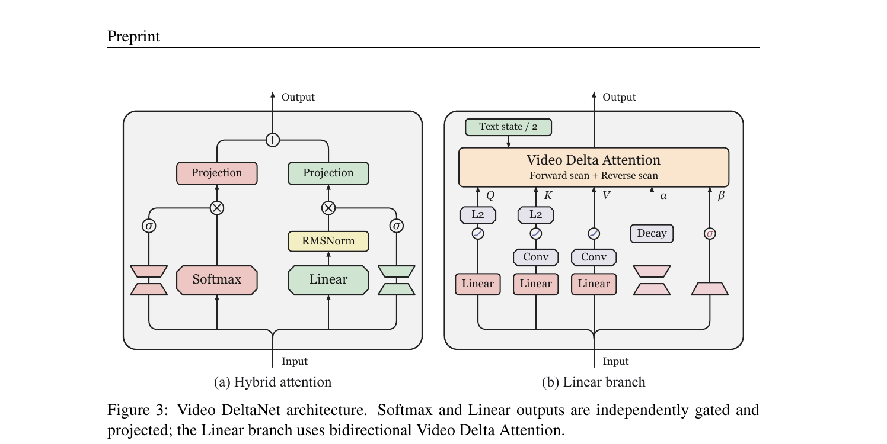
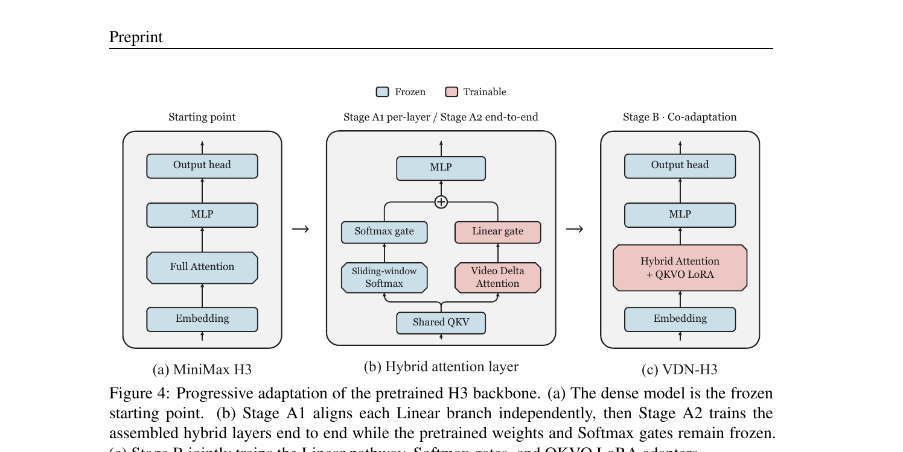
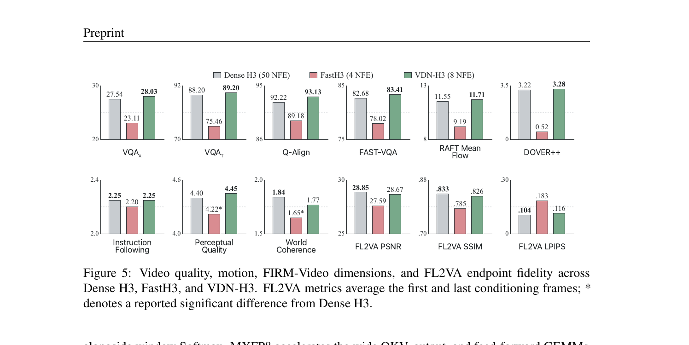
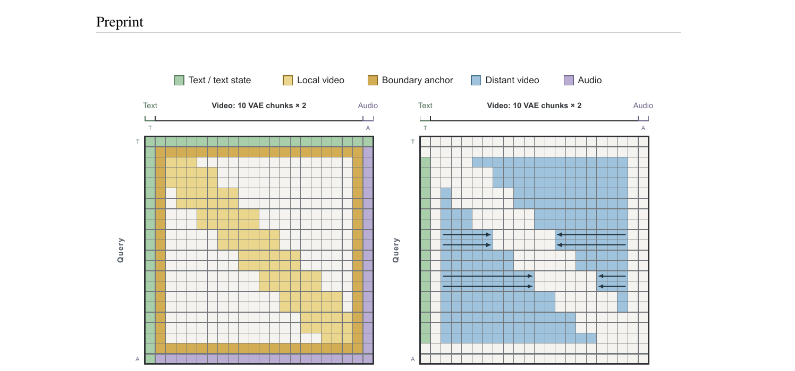

# Video DeltaNet (VDN): Video-Native Hybrid Attention for Livestream Video Generation

**论文**: Video DeltaNet: A Video-Native Hybrid Attention for Livestream Video Generation
**作者**: Haocheng Xi, Yiming Xie, Hexu Zhao, Yiwen Zhang, Michael Liu, Thomas Creavin, Kurt Keutzer, Xiuyu Li, Zhaoyang Lv, Chenfeng Xu, Haiwen Feng
**机构**: UC Berkeley + Impossible, Inc. + UT Austin
**时间**: 2026-09-17
**代码**: https://github.com/OpenVDN/vdn-minimax-h3
**模型**: https://huggingface.co/OpenVDN/vdn-minimax-h3

---

## 1. 一句话定位

把视频扩散模型（MiniMax H3）里占运行时 85% 的 dense Softmax attention 替换为**局部 Softmax + 双向线性记忆的混合架构**，同时引入**帧级 delta 更新（Video Delta Attention, VDA）**解决线性 attention 在视频扩散中的三个固有错配，8 步蒸馏后 8×B200 上 14.3s 768p 视频 6.70 秒完成，比 50 步基线快 **14.5×**，质量对齐。

---

## 2. 要解决的问题（动机）

Dense Softmax 在 MiniMax H3 工作负载中占 >85% 去噪运行时。线性 attention 是理论上的替代，但**直接替换严重降质**。原因是三个错配：

| 错配 | 具体表现 |
|------|----------|
| **全局属性 vs 固定状态容量** | 固定大小的线性记忆必须编码整个序列的主体一致性、场景布局，但容量不随序列长度增长 |
| **逐 token 更新 vs 帧内并行** | 标准 delta rule 一次写入一个 token（仿自回归解码），而视频扩散一帧的所有空间 token 同时可见，强加任意 patch 顺序不自然且相关写入互相干扰 |
| **新分支 vs 预训练残差流** | 随机初始化的线性分支改变信息流和残差激活统计，破坏预训练 Softmax 骨干的已学能力 |

---

## 3. 与前作的关系

```
线性 attention 谱系
├── Linear Transformer / Performer (2020-21) — 线性复杂度基础
├── Mamba / Mamba-2 (2023-24) — selective SSM
├── GLA / Gated DeltaNet / Gated DeltaNet-2 (2024-25-26) — delta rule + 数据依赖 decay
│   └── VDA 在此基础上把更新粒度从 token 提升到 frame
├── Kimi Linear (2025) — expressive 线性 attention（同期竞品）
└── SANA-WM (2026) — 视频扩散里的混合线性（帧内并行但用 1/√U 缩放避免不稳定）
    └── VDA 用 (I + A_t)^{-1} 直接保证非膨胀，无需 U 缩放

稀疏 / 高效 attention
├── SpargeAttn / SpargeAttention2 (2025b/26b)
├── SageAttention2 / 3 (2024/25)
└── SLA / SLA2 (2025c/26a)

少步蒸馏
├── Progressive Distillation / Latent Consistency / Adversarial Distillation (2022-23)
├── DMD / DMD2 (2024) — VDN 蒸馏用 DMD2 目标，去掉 GAN 项
└── FastH3 (FastVideo Team, 2026) — 4 步稀疏蒸馏 MiniMax-H3（直接对照组）
```

VDN 的增量贡献是**三合一**：视频原生帧级 delta rule（VDA）+ 阶段式适配配方 + 系统级实现，缺任何一项质量或速度均不达标。

---

## 4. 核心算法：Video DeltaNet (VDN)

### 4.1 混合注意力结构

VDN 把一个注意力层分为两个并行分支，共享 QKV 投影：

```
Input → Shared QKV
         ├── Softmax branch (局部 + boundary anchor)
         │     → sigmoid gate G^S → Ô^S = G^S ⊙ O^S
         │     → output proj W_O^S
         └── Linear branch (VDA 双向)
               → RMSNorm → sigmoid gate G^L → Ô^L = G^L ⊙ RMSNorm(O^L)
               → output proj W_O^L

Y = Ô^S W_O^S + Ô^L W_O^L  → 残差流
```

两路分开投影（separate output projections）使两个分支可以向残差流的不同子空间写入，避免共用投影时 Softmax 抑制线性分支贡献。

**Softmax branch — 滑动窗口 + boundary anchor**

- 每帧对应一个 VAE chunk（H3 解码连续 5 帧），query 与 ±1 chunk 内的 key 做 exact Softmax → **15 帧窗口**。
- 额外添加**首末帧 4-way 连通**（boundary anchor）：首帧看完整序列、末帧看完整序列，每个中间帧看首帧行+列和末帧行+列。这是 first-last-frame-to-video 生成的自然约束。
- 窗口内的 anchor 只计入一次。

**Linear branch — 双向 VDA**

- 前向扫描 `S^→_t` 汇总 t 之前（窗口外）所有帧，反向扫描 `S^←_t` 汇总 t 之后的帧。
- Boundary anchor 从两路状态中排除（它们已在 Softmax 中全局可见）。
- 文本 token 在扫描前归入公共文本状态 `S_T`，双向扫描各以 `S_T/2` 初始化：

$$
o^L_t = S^{\rightarrow}_t q_t + S^{\leftarrow}_t q_t
$$

$$
S_0^{\rightarrow} = S_0^{\leftarrow} = \tfrac{1}{2} S_T, \quad (S_0^{\rightarrow} + S_0^{\leftarrow}) q = S_T q
$$

### 4.2 Video Delta Attention (VDA)：帧级 delta rule

**为什么 token 级 delta rule 在视频扩散里失败**

对视频帧 t 的所有 patch，标准批量 delta（SANA-WM）把每个 patch 的残差评估在同一冻结前状态 `S̃_t`：

$$
S_t^{\text{batch}} = \tilde{S}_t + \sum_{u=1}^{U} \beta_{t,u}(v_{t,u} - \tilde{S}_t k_{t,u}) k_{t,u}^{\top}
$$

每个修正独立，patch 写入相互无视，相关 patch 会放大或抵消（Appendix A.2 的 key-correlation 分析）。

**VDA 帧级联合更新**

把帧状态定义为覆盖所有 patch 的联合最小化问题：

$$
S_t = \arg\min_{S} \tfrac{1}{2}\lVert S - \tilde{S}_t \rVert_F^2 + \tfrac{1}{2}\sum_{u=1}^{U} \beta_{t,u} \lVert S k_{t,u} - v_{t,u} \rVert_2^2
$$

对 S 求导（一阶最优性条件），令帧统计量：

$$
A_t = K_t^{\top} \operatorname{Diag}(\beta_t) K_t \in \mathbb{R}^{d_k \times d_k}, \quad B_t = V_t^{\top} \operatorname{Diag}(\beta_t) K_t \in \mathbb{R}^{d_v \times d_k}
$$

（`K_t ∈ R^{U×d_k}`, `V_t ∈ R^{U×d_v}`，`β_t` 为写入门向量）

得到闭式更新：

$$
S_t(I + A_t) = \tilde{S}_t + B_t \implies S_t = (\tilde{S}_t + B_t)(I + A_t)^{-1}
$$

`A_t` 汇总了帧内 key 相关性，`(I + A_t)^{-1}` 耦合所有 patch 的写入。vs SANA-WM 的 `1/√U` 缩放：VDA 直接因为逆矩阵的特征值落在 `(0,1]` 而保证稳定（Proposition 1）。

**📌 稳定性命题（Proposition 1）**：固定 features 和 gate，继承状态转移矩阵 `M_t = Diag(α_t)(I + A_t)^{-1}` 满足 `‖M_t‖_2 ≤ 1`，即状态不会被帧更新放大。证明利用 `A_t` 为半正定矩阵（Gram 结构），故 `(I + A_t)` 特征值 ≥ 1，其逆特征值 ≤ 1。

### 4.3 Branch-specific featurization（线性分支特化）

Softmax 分支保留 H3 原生 QK normalization + RoPE。
线性分支另加：
- K、V 各一个 5×5 空间 + 5-tap 时序 depthwise conv（捕捉 patch 局部纹理相关性）
- K、Q 做 L2 normalization（SiLU 激活后）
- `α`（decay）、`β`（write gate）来自独立线性头
- **不加** RoPE（线性 attention 的相对位置已由状态递推隐式编码）



> **Fig 3 逐段解读**：
>
> **(a) Hybrid attention**——整个 VDN 层。左侧粉红色为 Softmax 分支，右侧绿色为 Linear 分支，两者各有独立的 output projection 和 sigmoid gate（σ），输出相加（⊕）进入残差流。关键设计：双路分别 gate 再各自投影，避免一路主导另一路。
>
> **(b) Linear branch 展开**——输入经三个线性头分别产生 Q、K、V，K 和 V 还经过 Conv（depthwise 时空卷积）增加局部感受野；Q、K 再做 L2 归一化（稳定 key geometry）。Decay（α）和 write gate（β）各来自独立线性映射。Text state/2 从顶部注入，作为双向扫描的初始状态。整个黄色框即一次 VDA 前向+反向扫描。

---

## 5. 训练 Pipeline

### 5.1 阶段式架构适配（A1 → A2 → B）

直接端到端微调预训练 Softmax 模型会因随机初始化的线性分支破坏激活统计。解决方案：分三阶段渐进引入。



> **Fig 4 逐段解读**：
>
> **(a) 起点 MiniMax H3**——全 Softmax（Full Attention），骨干冻结（蓝色）。
>
> **(b) Stage A1（per-layer alignment，200 步）→ A2（end-to-end，500 步）**——蓝色（冻结）：骨干权重 + Softmax gate（固定在 0.99 初始化）。粉红色（可训）：Linear gate + VDA 模块。A1 独立对齐每个线性分支（局部目标，防止梯度跨层传播引起的干扰）；A2 把所有混合层端到端组装训练（修正孤立对齐引入的组合误差）。两阶段均以从预训练激活克隆的值初始化线性分支（不随机初始化），梯度裁剪 0.1（A1 per-layer）/ 1.0（A2 global）。
>
> **(c) Stage B VDN-H3（LoRA co-adaptation，2000 步）**——在 Hybrid Attention 层上同时训练线性路径、Softmax gate 和 QKVO LoRA 适配器（rank 64，scale 64）。LoRA 学习率 = 0.4× branch 学习率，让骨干缓慢跟上混合架构。峰值 LR = 1e-4，cosine decay 到 5e-6。

| 阶段 | 可训参数 | 步数 | 关键冻结 |
|------|----------|------|----------|
| A1 per-layer | 一个 Linear branch | 200 | 骨干 + Softmax gate |
| A2 end-to-end | 所有 Linear branches | 500 | 骨干 + Softmax gate |
| B LoRA co-adapt | Linear + Softmax gate + QKVO LoRA | 2000 | FFN、embedding、head |

### 5.2 少步蒸馏（50 步 → 8 步）

DMD2 目标（去掉 GAN 项），Generator / Real-score / Fake-score 三路共享一个 FSDP 骨干、不同 adapter，每步 generator 更新对应 3 步 fake-score 更新。Student 从社区 MiniMax-H3-Turbo-LoRA（larryvrh, 2026）初始化，对 VDN-H3 自身的 50 步采样训练，共 250 generator 步。

---

## 6. 高效推理实现

VDA 的主要计算开销：(1) 帧统计量 `A_t`, `B_t` 的计算，(2) `(I + A_t)^{-1}` 的求逆，(3) 双向扫描的 memory gather。

**4 个 Fused Triton Kernels**：
- **VDA-Prep**：时序 conv、SiLU、L2 norm、frame-major layout 转换（K 和 V）—— 原 18ms → 1.58ms（H200），10× 加速
- **VDA-Stats**：在一次 pass 里构建 `A_t` 和 `B_t`，共享 input reads 和 reduction —— 2.1×-2.9×
- **VDA-Gather**：从局部窗口边界读取两个方向状态、应用 decay bridge —— 7.2×-7.5×
- **VDA-Epilogue**：RMS normalization、output gating、layout 还原 —— 7.3×-9.1×

**Chunk-wise 扫描**：VDA 定义帧级仿射转移，但 attention 只在 VAE chunk 边界读记忆。因此把每个 chunk 合成为 `S_out = S_in M_chunk + J_chunk`，在更短的 chunk 序列上做双向扫描，减少约 chunk_size 倍的扫描深度和 kernel launch 开销。

**小矩阵求逆**：`(I + A_t)^{-1}` 是 `d_k × d_k` 矩阵。多 kernel Cholesky 路径在寄存器外读写频繁 → 改为**一个 CUDA kernel 内完成 Blocked Gauss-Jordan 消元**：逆矩阵和复用的递推项全留在寄存器中，FP32。4.6-5.0× 相对 Cholesky，H200 7.8→1.7ms。

**其他**：SGLang 服务；窗口 Softmax 用 FlashAttention varlen API（按可见 key 模式打包 query，避免全局 mask）；VDA 按 attention head 切分后在侧流执行（与窗口 Softmax 并行）；MXFP8 加速 QKV/输出/FFN GEMMs，recurrent state 和小矩阵逆保持 FP32。

---

## 7. 关键实验结果

### 7.1 质量结果

训练集：10,015 视频 @ 1344×768，345 帧，24 fps（14.375s）。评估：103 prompts（固定第三方集，所有模型同 prompt 同分辨率同时长）。

| 指标组 | Dense H3 (50 NFE) | FastH3 (4 NFE) | VDN-H3 (8 NFE) |
|--------|:-----------------:|:--------------:|:--------------:|
| VQA_A | 27.54 | 23.11 | **28.03** |
| VQA_T | 88.20 | 75.46 | **89.20** |
| Q-Align | 92.22 | 89.18 | **93.13** |
| FAST-VQA | 82.68 | 78.02 | **83.41** |
| RAFT Mean Flow | 11.55 | 9.19 | **11.71** |
| DOVER++ | 3.22 | 0.52 | **3.28** |
| Instruction Following | 2.25 | 2.20 | 2.25 |
| Perceptual Quality | 4.40 | 4.22* | **4.45** |
| World Coherence | **1.84** | 1.65* | 1.77 |
| FL2VA PSNR | **28.85** | 27.59 | 28.67 |
| FL2VA SSIM | **.833** | .785 | .826 |
| FL2VA LPIPS↓ | **.104** | .183 | .116 |

（* = 相对 Dense H3 报告显著差异；FL2VA 越低越好 for LPIPS）

**结论**：VDN-H3 在 5 个 no-reference 指标上与或超 50-step Dense H3，FastH3 在多数指标上明显落后（VQA_T 差约 13 点）。代价：FL2VA 端点保真度小幅下滑（SSIM -0.007，LPIPS +0.012），这是少步蒸馏引起的，非混合架构本身。



> **Fig 5 逐行解读**：
>
> **上行（6 个 no-reference 指标）**：绿色 VDN-H3 柱全部最高；红色 FastH3 明显最低，尤其 VQA_T（75.46 vs 88.20 Dense、89.20 VDN）和 DOVER++（0.52 vs 3.22 Dense）相差悬殊。RAFT Mean Flow 证明 VDN-H3 的运动量（11.71）与 Dense H3（11.55）相当，FastH3 出现运动退化（9.19）。
>
> **下行（FIRM-Video + FL2VA 端点保真度）**：Instruction Following 和 Perceptual Quality 三者相近，VDN-H3 Perceptual Quality（4.45）略高于 Dense（4.40）。World Coherence VDN-H3（1.77）略低于 Dense（1.84），但均高于 FastH3（1.65*）。FL2VA 三项（PSNR/SSIM/LPIPS）Dense H3 微胜，说明首末帧条件保真度有约 0.18 dB PSNR 差距——这是少步采样固有损失，与架构无关。

### 7.2 效率结果

14.3s 768p 视频，14.4 秒时长（102 latent frames）：

| 配置 | #GPU | NFE | s/NFE | 端到端延迟 | 相对 Dense H3 单 GPU 累计加速 |
|------|------|-----|-------|-----------|-------------------------------|
| Dense H3 | 1 | 50 | 15.99 | 799.6s | 1× |
| VDN-H3 | 1 | 50 | 6.16 | 307.9s | **2.6×** |
| + few-step | 1 | 8 | 6.16 | 49.3s | **16.2×** |
| + distributed | 8 | 8 | 0.85 | **6.70s** | **119.3×** |

（H200 上 VDN-H3 骨干加速 3.2×；8 GPU end-to-end 12.5s，141.6× vs Dense H3 单 GPU）

**Softmax 密度随视频时长的变化**：latent frames 42→102，Softmax attention 密度从 42.1% 降至 20.0%（窗口固定，序列增长），全骨干加速从 1.8× 提升到 3.2×（H200）。

### 7.3 消融（kernel 级）

| Kernel | H200 原始→优化 | B200 原始→优化 |
|--------|---------------|---------------|
| VDA-Prep | 18.02→1.58ms | 17.07→3.37ms |
| VDA-Stats | 13.36→6.45ms | 11.39→3.99ms |
| VDA-Gather | 2.01→0.28ms | 1.57→0.21ms |
| VDA-Epilogue | 7.96→1.09ms | 6.93→0.76ms |
| 小矩阵逆 | 7.75→1.69ms | 6.32→1.26ms |
| Window Softmax | 112.6→69.5ms | 112.1→56.1ms |

---

## 8. 注意力分配可视化



> **Fig 2 逐段解读**：示意采用 1 text token，10 个 2-frame VAE chunk（共 20 video token 列），1 audio token。
>
> **(a) Softmax 分配**——每个 video query 只与自身 chunk ±1 chunk（橙黄色 local video）内的 key 做 Softmax，第一行和最后一行作为 boundary anchor（深棕色）全局可见；text（绿色）和 audio（紫色）行/列与所有 token 互见（全局），保证语言对视频的端到端控制。白色格子是被 mask 的位置。这一结构对应滑动窗口 + boundary anchor。
>
> **(b) Linear 分配**——同样的序列，Linear branch 的"注意力"改用状态读取表示：箭头方向即双向扫描方向，蓝色块代表 distant video 被线性记忆汇总的范围。每个 query 从窗口边界之外的两侧状态各读一次，boundary anchor（已在 Softmax 可见）不参与线性扫描。text state 以 S_T/2 初始化两向扫描，无需额外 text 列。

---

## 9. 争议与权衡

| 维度 | 现状 |
|------|------|
| **单一骨干验证** | 全文只在 MiniMax H3 一个模型上实例化，对 Wan / LTX / CogVideoX 等骨干的适用性未验证 |
| **与 SpargeAttn/SageAttention 的比较缺失** | 仅与 Dense H3 和 FastH3 对比，未比较同等 NFE 下的稀疏 attention 方法 |
| **端点保真度代价** | FL2VA SSIM -0.007、LPIPS +0.012 被归结为蒸馏，但混合 attention 的 Stage B 50-step 基准与 Dense H3 50-step 的端点差距未单独报告（Fig 8 有，但 World Coherence 下滑 1.84→1.81 亦可见） |
| **训练集规模** | 10,015 clips 远小于 H3 原始训练集规模（未披露），质量维持的代价是在更小分布上微调，可能引入分布偏移 |
| **Stage 消融缺失** | 三阶段适配各自贡献未独立消融；只有 Stage B 50-step vs Dense H3 50-step 的 Fig 8 对比，A1/A2 各自收益不明 |
| **VDA vs SANA-WM 的真实差距** | 文中用理论稳定性证明区分二者，但无并列实验对比两种帧级 delta 的质量差异 |

**📌 关键权衡**：线性记忆容量（固定大小 `d_k × d_v`）是瓶颈。对 10s+ 视频，帧数 100+，线性分支必须把整个前/后历史压缩进同一状态矩阵。这对"视觉上相差很远的两帧仍需高保真对应"的场景（如相机回访同一角落）理论上不利，但文中无跨时间对应测试。

---

## 10. 一句话总结

VDN 把视频扩散里的 dense Softmax 换成**局部窗口 Softmax（含首末帧 anchor）+ 帧级 delta rule 双向线性记忆（VDA）**混合架构，用三阶段适配配方接入预训练骨干、4 个 fused Triton kernel + Gauss-Jordan 逆矩阵实现高效推理，在 MiniMax H3 上做到 8 步 8×B200 的 6.70s，no-reference 质量对齐 50 步基线；VDA 的核心贡献是把 token-wise delta rule 升级为帧内联合最小化，用 `(I+A_t)^{-1}` 闭式耦合所有 patch 写入并自动保证非膨胀。

---

## Q&A

