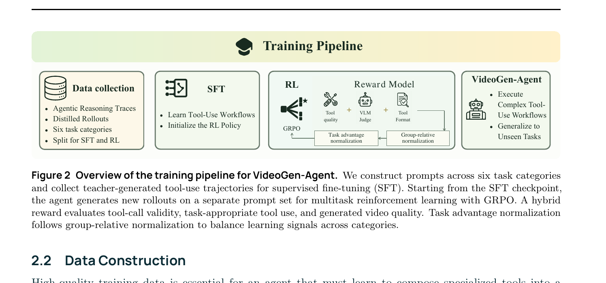
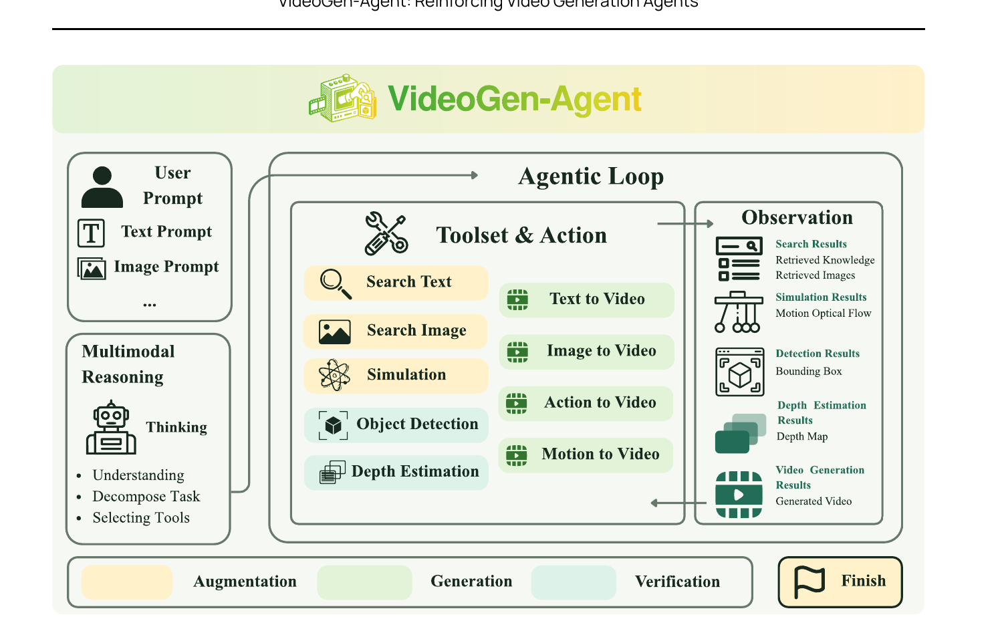

# VideoGen-Agent: Reinforcing Video Generation Agents

**论文**: VideoGen-Agent: Reinforcing Video Generation Agents
**作者**: Binxu Li, Haoyi Duan, Yuhui Zhang, Yaohui Zhang, Zihao Lin, Kaituo Feng, Suozhi Huang, Xiangyi Li, Yu Li, Chunyuan Li, Shilong Liu, Yu Li, Mengdi Wang
**机构**: Princeton University + Stanford University + UC Davis + MMLab CUHK + BenchFlow + GWU
**时间**: 2026-09-21
**主页**: andyca111.github.io/VideoGen_Agent

---

## 1. 一句话定位

训练一个多模态 agent（Qwen3-VL-8B-Instruct）通过**多任务 Agentic GRPO**学会调用外部工具（检索/仿真/生成/验证），在 VABench 上把基础 T2V 生成器从 56.5 分提升到 75.6 分（+19.1），换更强工具后无需重训再涨到 86.1 分，人类偏好率 84.3% vs 最强单模型 Seedance 2.0。

---

## 2. 要解决的问题（动机）

单次前向的视频生成模型在以下场景系统性失败：

| 场景 | 根因 |
|------|------|
| **程序性知识**（太极招式、钢铁锻造）| 训练数据里稀有/不精确，prompt 无法完整描述步骤 |
| **视觉身份保持**（明星、游戏角色、品牌）| 生成模型无法可靠"记住"训练时见过的脸 |
| **物理一致性**（碰撞、自由落体、旋转）| 学到的物理是统计关联，不是物理规律 |
| **多主体空间组合**（A 在 B 左侧并互动）| 文本条件对相对位置/遮挡缺乏精确控制 |
| **多阶段时序结构**（先 X 然后 Y 最后 Z）| 单次生成无法保证相邻段视觉连续且顺序对 |

---

## 3. 与前作的关系

```
视频生成增强谱系
├── 单次 prompt 增强：VISTA (2026) — 测试时迭代生成+VLM批评+prompt修改
├── 分镜/场景分解：AutoMV、Script is All You Need — 多 agent 规划但无 RL
├── 物理引导生成：Newton, Videococo, Newtongen — 针对 Physics 的单一工具
├── 身份保持：IP-Adapter/R2V — 单一工具，无 agent 编排
└── VideoGen-Agent — 统一 agent + 6 类任务 + multitask SFT+RL
    ├── 最近邻：Gen-Searcher (2026) — image gen 的 search-augmented SFT+GRPO
    │          VideoGen-Agent 的视频生成侧 + 工具覆盖更广
    └── AgentRL [48] — 通用 multi-turn RL 框架，VideoGen-Agent 借用其 task advantage normalization
```

与 Gen-Searcher 相比：Gen-Searcher 只做图像生成 + 搜索单一工具；VideoGen-Agent 做视频 + 6 类任务 + 5 种工具类型 + verification 闭环。

---

## 4. 核心方法

### 4.1 六类任务与工具工作流

| 类别 | 缩写 | 默认工具流 | 挑战 |
|------|------|-----------|------|
| Procedural Knowledge | PK | Search-Text → T2V | 需从 web 检索步骤细节注入 prompt |
| Single-Entity Identity | SI | Search-Image → R2V 或 I2V | 找到一张高质量参考图 |
| Multi-Entity Identity | MI | Search-Image×N → R2V | 多主体同时出现，N 张独立参考 |
| Physics Simulation | PS | Code（物理仿真）→ M2V | 代码仿真出光流视频，motion-conditioned 生成 |
| Compositional Scene | CS | T2V → (Obj Det. + Depth Est.) → T2V | 验证主体是否存在/位置，失败则重生成 |
| Multi-Shot | MS | T2V → (ELF → I2V)^(K-1) | 抽末帧作首帧，链式保视觉连续性 |

工具分三类：**Augmentation**（检索/仿真）、**Generation**（T2V/I2V/R2V/M2V）、**Verification**（Grounding DINO / Depth Anything V2），通过统一接口暴露。

### 4.2 Agentic Loop（Algorithm 1）

```
输入: prompt x, policy π_θ, T_max
H_1 ← [x]; V ← ∅      # 历史 + 当前视频候选集
for t = 1 .. T_max:
  a_t ~ π_θ(· | H_t)   # 推理 → 选工具 + 参数
  if a_t == <answer>:
    if all phases have video candidates in V: break
    else: o_t ← "Generate missing segments before terminating."
  else:
    (u, φ) ← a_t
    o_t ← Execute(u, φ)
    if u ∈ T_gen: update V (replace if regenerated)
    if u ∈ T_ver:
      record verification score
      if all phases generated AND all scores ≥ η: break
  H_{t+1} ← H_t || (a_t, o_t)
y ← Assemble(V)         # 单段或按 phase 顺序拼接
```

关键设计：(1) 失败的工具调用作为 observation 保留在历史中（不从 loss 计但留上下文），让模型学会从错误中恢复；(2) 验证分数驱动 early stopping，避免不必要的重生成。

### 4.3 数据构建（24K 轨迹）

- **Prompt 生成**：Claude Opus 4.7 批量生成 6 类各 4K prompts，非目标侧面（背景/动作）刻意简化，让目标能力成为主要挑战。
- **轨迹生成**：随机选 Gemini 3.1 Pro 或 Claude Opus 4.7 作为 teacher，按 agent 系统 prompt + 工具接口生成完整多轮轨迹（含推理/工具调用/观测/最终视频）。共 24K 轨迹：**16K 用于 SFT**，**8K 留给 RL**。
- 失败轨迹（外部工具错误导致）从优化中排除。



> **Fig 2 逐块解读**：
>
> **Data collection**——agentic reasoning traces（teacher 轨迹），6 类任务，分 SFT/RL 集合。
>
> **SFT**——在 16K teacher 轨迹上做标准 next-token prediction，学习工具调用格式和 workflow；初始化 RL policy。
>
> **RL / Reward Model**——从 SFT checkpoint 出发，用 GRPO 在 8K prompts 上做 on-policy rollout。Reward = Tool quality（工具使用合规性）+ VLM Judge（视频质量）+ Tool Format（格式合法性），三路加权。两级归一化：先 group-relative（同 prompt 内），再 task advantage normalization（跨任务对齐尺度）。
>
> **VideoGen-Agent**——产出可执行复杂工具流、并泛化到训练时未见任务组合的共享 agent policy。

### 4.4 训练：SFT → Agentic RL

**Stage 1 SFT**

- 16K teacher 轨迹，标准 next-token prediction
- 失败动作 mask 掉损失但保留在上下文（让模型见到恢复示范）
- AdamW，LR=5e-5，2 epochs，8× H200 141GB，FSDP

**Stage 2 Agentic RL（GRPO）**

每次从同一 prompt 采 n=6 条轨迹，计算混合奖励后做两级归一化：

**混合奖励**（权重 `λ_f=0.1, λ_v=0.5, λ_t=0.4`）：

$$
R(\tau, x, c) = \lambda_f R_{\text{format}}(\tau) + \lambda_v R_{\text{vlm}}(\tau, x, c) + \lambda_t R_{\text{tool}}(\tau, c)
$$

- `R_format`：每步动作是否有合法 `<think>...</think> <tool_call>...</tool_call>` 结构 + JSON 可解析 + 工具名合法 + 参数完整。
- `R_vlm`：Gemini 3.1 Pro 用 category-specific 打分维度评估最终视频（见附录 A.5），量纲映射到 [0,1]。物理仿真的 `motion_correctness` 由代码独立计算（权重 0.20）。
- `R_tool`：类别专属功能性检查（二值），例如：PK 需检索到的文本实际出现在 T2V prompt 中；SI/MI 需检索图片路径被传入生成工具；PS 需仿真输出的 optical flow 路径进入 M2V；CS 需检测反馈触发接受/重生成决策；MS 需末帧被抽出并传入下一段 I2V。

**两级 Advantage 归一化**：

Group-relative advantage（同 prompt 内）：

$$
\hat{A}_i = \frac{R_i - \text{mean}_{j=1}^n R_j}{\text{std}_{j=1}^n R_j + \epsilon}
$$

Task-level advantage normalization（同类任务 c 的全局 batch 统计）：

$$
\tilde{A}_{c,s,g,t,k} = \frac{\hat{A}_{c,s,g} - \mu_c^{\text{task}}}{\sigma_c^{\text{task}} + \epsilon}
$$

两级归一化的意义：group-relative 比较同一 prompt 的轨迹质量差异；task-level 把六类任务的 advantage 分布拉到同等尺度，防止某类任务的高方差奖励主导梯度。

**GRPO 目标**（非对称裁剪，`ε_lo=0.2, ε_hi=0.28`）：

$$
\mathcal{L}_{\text{GRPO}}(\theta) = \mathbb{E}\!\left[\frac{1}{Z}\sum_i\sum_{k\in\mathcal{M}_i}\left[-\min\!\left(\rho_{i,k}\tilde{A}_{i,k},\,\text{clip}(\rho_{i,k},1-\epsilon_{\text{lo}},1+\epsilon_{\text{hi}})\tilde{A}_{i,k}\right) + \beta_{\text{KL}}D_{\text{KL}}\!\left(\pi_\theta\|\pi_{\text{ref}}\right)\right]\right]
$$

- `π_ref` 固定为初始 SFT checkpoint
- `β_KL = 1e-3`
- 非对称裁剪：正 advantage 侧裁剪更宽（1.28），防止过拟合好轨迹；负 advantage 侧较窄（0.80）
- RL 用 8 H200 训 agent policy + 另 8 H200 服务工具（生成/验证）



> **Fig 1 逐区域解读**：
>
> **左侧 User Prompt 框**——输入可以是文本 prompt 或图像 prompt（多模态输入）；模型先做多模态推理（Thinking），理解任务、分解子目标、选择工具。
>
> **中间 Agentic Loop / Toolset & Action**——工具分两列：左列（橙色）为 Augmentation 工具（Search Text、Search Image、Simulation/Code）；右列（绿色）为 Generation 工具（Text to Video、Image to Video、Action to Video、Motion to Video）；加上 Verification 的 Object Detection 和 Depth Estimation。每次只调一个工具，输出加入历史，再推理下一步。
>
> **右侧 Observation**——工具返回的不同类型观测：Search Results（知识文本/参考图）、Simulation Results（运动光流）、Detection Results（边界框）、Depth Estimation Results（深度图）、Video Generation Results（生成的视频片段）。这些观测作为 in-context 信息指导后续动作。
>
> **底部三色条**——Augmentation（橙）→ Generation（绿）→ Verification（蓝/灰）三阶段的典型执行顺序，但 agent 可以灵活组合；Finish 旗帜代表满足终止条件（所有 phase 生成完 + 验证通过）。

---

## 5. 两套 Toolset

| 工具类型 | 工具 | Toolset 1（训练用） | Toolset 2（评估升级） |
|---------|------|---------------------|----------------------|
| Search-Text | Claude Web Search | ✓ | ✓（相同） |
| Search-Image | Bing Image Search | ✓ | ✓（相同） |
| Code/Simulation | 自定义物理仿真（collision_sim） | ✓ | ✓（相同） |
| T2V | Seedance 1.0 Pro Fast | ✓ | **Seedance 2.0 Fast** |
| I2V | Seedance 1.0 Pro Fast | ✓ | **Seedance 2.0 Fast** |
| R2V | Wan 2.1-VACE-1.3B | ✓ | **Seedance 2.0 Fast** |
| M2V | Wan 2.1-VACE-1.3B flow | ✓ | **Wan 2.1-VACE-14B flow** |
| Obj Det. | Grounding DINO 1.5 | ✓ | ✓（相同） |
| Depth Est. | Depth Anything V2 ViT-L | ✓ | ✓（相同） |

**📌 关键设计**：Toolset 1 和 2 的 agent policy 完全相同（不重训），只换了 Generation 工具。Toolset 2 的成绩（86.1）比 Toolset 1（75.6）高 10.5 分，且超过所有单独使用 Seedance 2.0 的基线（73.2），证明 agent 学到的工具编排策略与生成工具正交、可随工具升级受益。

---

## 6. 关键实验结果

### 6.1 VABench 主结果（Table 2）

VABench：600 held-out prompts（100/类），Gemini 3.1 Pro 评估，0-100 分。

| 模型 | PK | SI | MI | PS | CS | MS | Overall |
|------|----|----|----|----|----|----|---------|
| CogVideoX-5B | 38.9 | 48.3 | 37.8 | 41.6 | 50.4 | 30.8 | 41.3 |
| Mochi-1 | 41.9 | 49.6 | 37.8 | 48.4 | 55.4 | 28.3 | 43.6 |
| HunyuanVideo-13B | 37.5 | 29.3 | 17.6 | 31.6 | 31.5 | 31.1 | 29.8 |
| Wan2.1-T2V-14B | 42.0 | 46.2 | 39.5 | 49.5 | 60.8 | 62.0 | 50.0 |
| Kling 3.0 | 64.4 | 62.3 | 55.2 | 56.7 | 86.5 | 66.1 | 65.2 |
| Hailuo 2.0 (MiniMax) | 63.0 | 58.6 | 52.4 | 55.1 | 86.0 | 67.6 | 63.8 |
| Seedance 1.0 | 55.5 | 51.4 | 44.2 | 46.2 | 74.6 | 66.8 | 56.5 |
| Seedance 2.0 | 78.0 | 75.0 | 69.0 | 60.2 | **87.8** | 68.9 | 73.2 |
| VideoGen-Agent-Toolset 1 | 80.4 | 75.1 | 65.3 | 67.9 | 83.1 | 81.7 | 75.6 |
| **VideoGen-Agent-Toolset 2** | **92.1** | **83.2** | **86.7** | **69.2** | 90.7 | **94.6** | **86.1** |

**重要观察**：
- CS（Compositional Scene）：Toolset 1 的 83.1 **低于** Seedance 2.0 的 87.8 ——  verification+重生成有时反而引入质量下降，是全文唯一反例。
- PK（+14.1 vs Seedance 2.0）、MI（+17.7）、MS（+25.7）增益最大 ——— 这三类恰好是最依赖检索/参考/顺序生成的场景。
- PS 增益 +9.0，说明自定义物理仿真 → M2V 管线有效，但仍是最低绝对分（69.2）。

### 6.2 消融（Table 3，Toolset 1 固定）

| Variant | PK | SI | MI | PS | CS | MS | Overall |
|---------|----|----|----|----|----|----|---------|
| (i) Vanilla T2V | 55.5 | 51.4 | 44.2 | 46.2 | 74.6 | 66.8 | 56.5 |
| (ii) Prompt Rewriting | 57.3 | 51.5 | 45.3 | 44.6 | 77.2 | 68.1 | 57.3 |
| (iii) Zero-shot tool use | 61.2 | 54.8 | 47.1 | 49.6 | 75.5 | 68.9 | 59.5 |
| (iv) SFT only | 72.7 | 68.1 | 58.6 | 60.4 | 79.2 | 76.3 | 69.2 |
| (v) RL w/o VLM Reward | 76.4 | 74.3 | 63.9 | 66.5 | 80.1 | 78.7 | 73.3 |
| (vi) RL w/o Tool Reward | 74.3 | 70.2 | 60.2 | 60.9 | 82.7 | 78.8 | 71.2 |
| (vii) Single-task RL | **85.5** | 74.5 | **65.9** | 67.3 | **84.4** | 80.3 | 76.3 |
| (viii) Full multitask RL | 80.4 | **75.1** | 65.3 | **67.9** | 83.1 | **81.7** | 75.6 |

**关键 takeaway**：
- Prompt rewriting（ii）vs. vanilla（i）只涨 0.8 分，说明光改 prompt 远不够。
- Zero-shot tool use（iii）也只涨 3.0 分，说明工具使用需要被训练，不能靠 zero-shot 走工作流。
- SFT（iv）+10.0 分，RL（viii vs iv）再 +6.4 分，两阶段各有贡献。
- 去掉 VLM Reward（v）降 2.3 分，去掉 Tool Reward（vi）降 4.4 分 ——  工具使用奖励贡献更大（训练正确工作流比视频质量信号更重要）。
- 📌 Single-task RL（vii）Overall 76.3 **略超** multitask（75.6）0.7 分，但 multitask 在 SI、PS、MS 上更好；论文选 multitask 主要因为一个 agent 覆盖所有任务。

### 6.3 工具可替换性与泛化

- **工具升级无需重训**：固定 policy，Toolset 1→2，75.6→86.1（+10.5），MI 类别从 65.3→86.7（+21.4）。
- **新工具类型中途加入**：Action-to-Video（π_0.5 → Ctrl-World，机器人操控）在 RL 训练中期加入，agent 学会在 A2V pipeline 中调用它，且生成结果更接近真实轨迹。
- **未见任务组合**：PK+SI 组合（程序性知识 + 身份保持）未在训练中出现，agent 能自发调用 Search-Text 和 Search-Image 两个工具并组合使用。

---

## 7. 争议与权衡

| 维度 | 现状 |
|------|------|
| **评测-训练同源** | VLM reward 用 Gemini 3.1 Pro，VABench 也用 Gemini 3.1 Pro 评估，且 VLM 评估维度与训练 rubric 相同 —— reward hacking 的典型温床；论文用人工偏好评估（84.3%）部分缓解，但 100 个样本量偏小 |
| **CS 类别反退化** | Toolset 1 下 CS 83.1 低于 Seedance 2.0 的 87.8；检测引导的 regeneration 引入风格漂移或检测误报触发无效重生成，论文未分析 |
| **Single-task 微胜 multitask** | Table 3 (vii) 76.3 > (viii) 75.6，multitask 的好处仅在 coverage 而非 per-task 最优；这与论文的 "shared policy" 卖点有轻微矛盾 |
| **Physics Simulation 仍最弱** | 69.2 分，仅靠自定义 collision_sim（刚体/自由落体/流体），无法覆盖软体形变、流体真实物理、链式物体交互；仿真结果只是光流 guide，真实物理精度未定量 |
| **计算成本不透明** | RL 阶段：8K prompts × 6 rollouts = 48K 轨迹，每条轨迹多轮工具调用（含实际视频生成），全文无总计算量数字 |
| **工具错误处理** | 外部工具错误轨迹直接排除（不参与优化），没有让 agent 从工具故障中学习恢复的显式机制；zero-shot 时频繁调用失败（参考 §3.1：zero-shot 经常无法正确调用工具）|
| **VABench 自建** | benchmark 是论文作者自建，100 个 prompt/类 的人工过滤质量未第三方验证，类别难度均衡性未报告 |

---

## 8. 一句话总结

VideoGen-Agent 是首个系统验证"在 6 类视频生成任务上做多任务 Agentic GRPO 可以学到有效工具编排"的工作：SFT 奠定工作流（+13pp）、RL 优化工具使用质量（再 +6pp）、两级 advantage 归一化平衡跨类任务梯度、工具接口抽象让 policy 在未见工具和任务组合上自然泛化；核心局限是 VLM judge 双重复用引入的自循环验证风险和 CS 类验证反退化。

---

## Q&A

