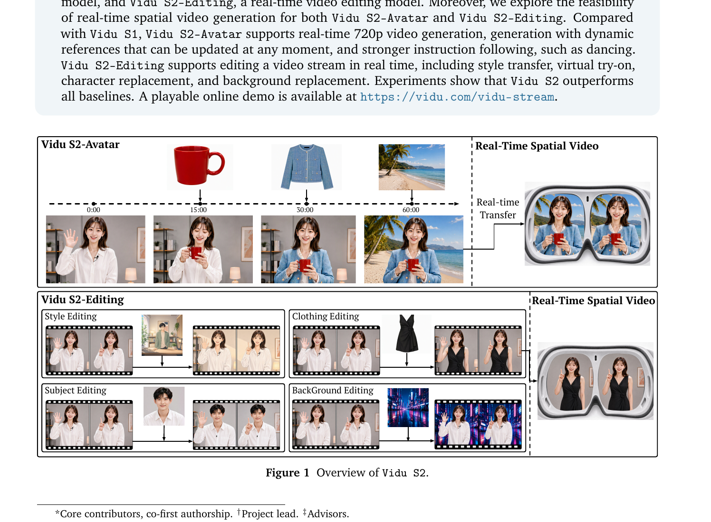
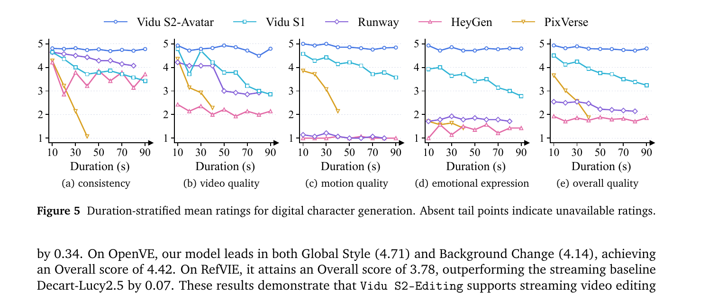
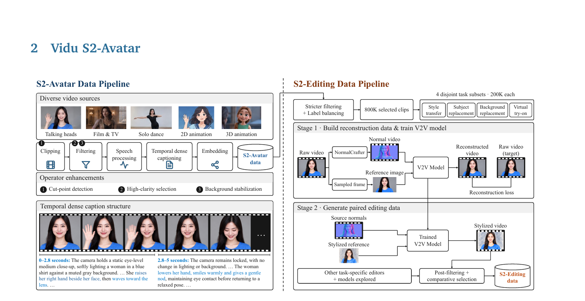

# Vidu S2: Real-Time Interactive, Editable, and Spatial Video Generation

**论文**: Vidu S2: Real-Time Interactive, Editable, and Spatial Video Generation
**作者**: Jintao Zhang, Kai Jiang, Jintao Chen, Xu Wang 等（30+ 位作者）
**机构**: Tsinghua University + Shengshu Technology（生数科技）
**时间**: 2026-09-10
**Demo**: https://vidu.com/vidu-stream

---

## 1. 一句话定位

Vidu S2 是 Vidu S1 的全面升级，包含两个独立可部署的系统：**Vidu S2-Avatar**（实时交互式数字人，720p，25–42 FPS，支持流式中途换参考图）和 **Vidu S2-Editing**（实时流式视频编辑，4 类任务：风格迁移/虚拟试穿/人物替换/背景替换），并探索了将两者输出转换为 VR 空间视频的可行性。核心方法贡献是 **Self-Replay Forcing (SRF)**，一种 on-policy DMD，在 AR rollout 后通过一次可微重放使 DMD 梯度跨 chunk 传播，同时不通过原始 rollout 反传。

---

## 2. 要解决的问题（动机）

**Vidu S1 的四个主要局限**（S2-Avatar 对应解决）：

| 问题 | S1 现状 | S2 改进 |
|------|---------|---------|
| 分辨率 | 540p | **720p**，同时保持 25–42 FPS |
| 参考图固定 | 流式开始后无法更换参考角色/物体 | **中途任意时刻**可提交新参考图 |
| 动作范围 | 主要是说话头部，难以处理大幅度肢体动作 | 增加舞蹈/动画数据，支持全身舞蹈指令 |
| Self-Forcing 的梯度问题 | 自生成历史 clean + detached，无法跨 chunk 传播 DMD 梯度 | **SRF** 通过重放让梯度跨 block 流动 |

**S2-Editing 的新增场景**：对实时视频流做无延迟编辑，以往方法要么是离线批处理要么是基于 token 蒸馏无法实时。

---

## 3. 与前作的关系

```
Vidu S1 (Zhang et al., arXiv:2607.03118)
├── 基础: audio-visual DiT + TurboDiffusion + TurboServe
├── 训练: 双向预训练 → Causal adaptation (TF+DF) → Self-Forcing (on-policy)
│         Self-Forcing: 自生成 clean 历史 + detached computation graph
│         问题: 梯度不穿 chunk 边界, 历史是 clean 非 noised
└── 推理: TwinCache 双缓存 + SageAttention/SpargeAttention + FP8

Vidu S2-Avatar 改进路径:
├── Self-Replay Forcing (SRF) — 解决 Self-Forcing 梯度问题
│   ↖ 思想来自 on-policy DMD (Yin et al. 2024; LPM 1.0; CausVid)
├── 非对称 Refiner — 解决 540p→720p 分辨率
├── DPO (双向阶段) + Streaming NFT (流式阶段) — preference 对齐
└── VLM agentic system — 更健壮的指令执行 + 参考图理解

Vidu S2-Editing 新增:
└── Frame-aligned attention: 每个 target frame 只看同时刻 source frame
    + NormalCrafter-based V2V 数据引擎 (style transfer paired data)
    + 复用 SRF 做流式编辑因果适配
```

与仓库其他论文的关系：
- **[minWM](./minwm/analysis.md)**：同为实时流式系统，但侧重相机可控世界模型；Vidu S2 侧重数字人 + 视频编辑，两者架构思路（TF→DF→SRF vs CF++→DMD）基本平行
- **[OPSD-V](./opsd_v/analysis.md)**：SRF 的 "replay then DMD" 与 OPSD-V 的 "real long video as teacher context" 都试图解决 DMD teacher 跨 chunk 问题，但路径不同（SRF 重放自生成轨迹，OPSD-V 用真实长视频）
- **[ForgeWM](./forgewm/analysis.md)**：同为 4 阶段渐进训练，SRF 对应 Stage 3 的 online DMD 阶段

---

## 4. 核心方法

### 4.1 Vidu S2-Avatar 训练流水线

**Stage 1：双向 I2V/R2V 预训练**

$$
\hat{x}_0^{1:N} = f_\theta^{\text{bi}}\!\left(x_t^{1:N},\, t,\, r,\, c^{1:N}\right)
$$

- `r`：参考图像（I2V 时是目标第一帧，R2V 时是任意参考图）
- `c^{1:N}`：每段的 segment-wise conditioning（caption），而非整序列单 prompt
- 段级 conditioning 大幅提升指令跟随同时保留生成质量

**Stage 2：因果适配（Hybrid TF + DF）**

$$
\hat{x}_0^i = f_\theta^{\text{causal}}\!\left(x_{t_i}^i,\, t_i,\, r,\, c^i,\, x_{\tau_i}^{<i}\right)
$$

- 把双向 temporal attention 换成 block-wise causal mask
- `x_{\tau_i}^{<i}`：历史状态在噪声水平 `τ_i` 下的副本
- **Hybrid TF/DF**：Teacher Forcing 在 clean 历史上训，Diffusion Forcing 在 noised 历史上训，两模式按概率混合 → 同时获得初始能力和对误差积累的鲁棒性

**Stage 3：Self-Replay Forcing（SRF，核心贡献）**

问题：Self-Forcing（Huang et al.）的自生成历史 clean + detached（为保住推理时的 KV cache 对应），导致梯度无法穿过 chunk 边界。

SRF 解决方案：
```
Step 1: 先做一次长 AR rollout（完全 detached，保存 KV cache）
         → 得到自生成轨迹 x̂_0^{1:N}

Step 2: 将全部 segment 按 Diffusion Forcing 重噪
         → 得到 x_t^{1:N}（noised student trajectory）

Step 3: 以梯度使能的因果重放（replay）处理这段轨迹
         - 外部历史（来自 detached rollout）固定不变
         - 重放的 segment 在同一计算图内相互连接
         → 梯度可跨 block 传播（不穿过原始 rollout）

Step 4: 对重放输出施加 DMD + 感知损失
```

$$
\mathcal{L}_{\text{SRF}} = \mathcal{L}_{\text{DMD}}\!\left(f_\theta^{\text{causal}}\!\left(x_t^{1:N}, t, r, c^{1:N}\right)\right) + \mathcal{L}_{\text{perc}}\!\left(f_\theta^{\text{causal}}\!\left(x_t^{1:N}, t, r, c^{1:N}\right)\right)
$$

📌 SRF 的关键洞察：原始 rollout 和重放这两个 forward pass 可以独立进行——第一次 rollout 完全 detached（模拟推理），第二次重放带梯度（模拟训练），但它们共享同一段生成轨迹，所以重放的"on-policy"性质得以保留。

**Stage 4：偏好优化**

- **双向阶段**：DPO（Diffusion DPO，Wallace et al. CVPR 2024）提升视觉保真度、面部表现力、动作自然度、音视频同步
- **流式阶段**：Streaming NFT（Streaming Negative-aware Fine-Tuning，DiffusionNFT 的流式版）——对自生成轨迹构建偏好对，用 SRF 原则对齐优化状态与推理时分布

### 4.2 Super-Resolution Refiner（540p → 720p）

骨干网络输出低分辨率 latent `x̂_{0,LR}^i`，Refiner 在 latent 空间做一步超分：

$$
z_{t_r}^i = (1 - t_r)\,\mathcal{U}(\hat{x}_{0,\text{LR}}^i) + t_r\,\epsilon^i, \quad \epsilon^i \sim \mathcal{N}(0, I)
$$

- `U`：latent 空间空间上采样
- 固定精炼时间步 `t_r`，Refiner 预测对应 HR latent

**非对称缓存设计**（沿用 Vidu S1 的 TwinCache 原则）：
- 骨干看**高噪声**历史缓存 `x̂_{τ_B}^{<i}`（`τ_B > τ_R`）：提供粗粒度时序结构，对高频细节不敏感 → 稳定长期运动一致性
- Refiner 看**低噪声**高分辨率缓存 `x̂_{τ_R,HR}^{<i}`：保留局部外观和身份细节 → 恢复精细纹理

这种分离让骨干专注于时序连贯性，Refiner 专注于空间细节恢复，互不干扰。

### 4.3 Vidu S2-Editing：Frame-Aligned Attention

$$
\hat{x}_0^{1:N} = f_\theta^{\text{edit}}\!\left(x_t^{1:N},\, t,\, s^{1:N},\, r,\, c^{1:N}\right)
$$

- `s^{1:N}`：source video 的 segment-wise condition
- 关键设计：**每个 target frame 只 attend 同一时间步的 source frame**（frame-aligned attention），但全局 reference image tokens 对所有 target frame 可见
- 效果：motion 和 timing 与 source 完全一致（不走形），reference appearance 一致传播到全部 frame
- 流式推理时：每个 source frame 和它产出的 target frame 被一起消耗，不留在 cache 中

**训练数据生成（以 Style Transfer 为例）**：
1. 从 800K 高质量视频中取一帧作参考图 `i_ref`，用 NormalCrafter 估计对应 surface normal 视频 `v_normal`
2. 训练 V2V 模型：`v_raw + v_normal + i_ref → v_reconstructed`（重建 loss）
3. 生成阶段：将 `i_ref` 替换为风格化参考图 → V2V 模型输出风格化视频 `v_stylized`
4. Post-filtering + comparative selection：从多个编辑模型（Bernini, SCAIL-2, Wan.1 VACE, SAMA-14B, CoinVE-Edit）中选最佳结果构成训练对

4 个任务各 200K 对，互不相交。

### 4.4 数据工程亮点

**High-Clarity Video Selection**：不以标称分辨率为唯一标准；先硬阈值过滤，再评估 codec/bitdepth/bitrate 的相互依赖关系；多维度质量打分（纹理细节/边缘锐度/压缩 artifact）→ 加权阈值选择。720p 训练数据的实际清晰度因此显著高于 S1。

**Background Stabilization Operator**：舞蹈视频有相机运动（orbiting/dolly/zoom），直接用会破坏背景一致性学习。处理流程：检测有限平移运动的视频 → 前景主体 masking → 用背景区域估计相机变换（feature matching）→ 几何矫正 + 裁剪 → 二次过滤确认主体在帧内。

**Temporal Dense Captions**：S1 用字段结构化描述（subject/environment/camera 分开字段），S2 改为时序密集 caption——按事件时序描述，标注时间边界和因果关系（"0–2.8s: ... she raises her hand ... 2.8–5s: camera remains locked, ... she lowers her hand ..."）。按事件边界而非固定时长分 chunk，支持更细粒度的动作变化响应。

### 4.5 推理基础设施

| 优化技术 | 做法 | 作用 |
|----------|------|------|
| 层级混合 Attention | SageAttention / SpargeAttention / Sparse-Linear Attention (SLA)，按层灵敏度选 | 低敏感层用激进近似，高敏感层保精度 |
| W8A8 per-block GEMM | 自研 CUDA kernel，per-block 量化控制 outlier | 线性层低延迟推理，质量无损 |
| Kernel Fusion + CUDA Graphs | RMSNorm 与逐元素操作合并；稳定执行序列 captured 为 graph | 减少 kernel launch 和显存往返 |
| Multi-GPU Ulysses-style CP | Ulysses context parallelism + 量化激活交换 | 跨 GPU 低通信量分布式推理 |
| 共享 GPU 时间线调度 | VAE encoder/backbone/Refiner/VAE decoder 按使用时刻共享 GPU | 消除 idle GPU，降低端到端延迟 |

### 4.6 VLM Agentic System（S2-Avatar）

```
User text/audio + Initial image + Reference image
         ↓
    VLM Agent（分类参考图：物体/场景/服装）
         ↓ 生成分离的 identity/appearance/expression/pose/action prompt
    Vidu S2-Avatar
         ↓
    生成的 video frames → VLM 审核（动作是否完成/部分完成/失败）
         ↓
    下一段 prompt（保留已完成状态，只更新变化部分）
```

VLM 维护状态一致性：比如"拿起杯子后微笑"——一旦杯子被拿起，后续 prompt 都会指定角色继续持有杯子，直到用户要求放下。

---

## 5. 关键实验结果

### 5.1 数字人生成（StreamAV-Bench，Table 1）



> **Fig 1 逐段解读**：
>
> **上半（Vidu S2-Avatar）**：时间轴从 0:00 到 60:00（分钟级长流），三个参考图（杯子→衬衫→沙滩）以向下箭头标注了更新时刻（15:00、30:00）。下方帧序列显示角色随参考图动态变化——先手握杯子、后换上蓝色衬衫、最后出现在沙滩背景。右侧"Real-time Transfer"箭头连接到 VR 头显示意图，显示左右眼视图的空间视频输出。这一行说明 Avatar 支持**中途任意时刻换参考图**且输出可实时转为空间视频。
>
> **下半（Vidu S2-Editing）**：四格展示 4 种编辑类型——Style Editing（风格迁移）、Clothing Editing（服装/虚拟试穿）、Subject Editing（人物替换）、BackGround Editing（背景替换）。每格左边是原视频流，中间是参考图，右边是编辑后视频流。右侧同样有空间视频输出示意。

| Model | VA↑ | VQ↑ | PQ↑ | AQ↑ | AVAlign↑ | AVSync↓ | AIF↑ | SC↑ | BC↑ |
|-------|-----|-----|-----|-----|---------|---------|------|-----|-----|
| Live Avatar | .661 | 3.295 | 7.133 | 3.079 | .116 | 1.145 | 2.745 | .997 | .989 |
| **Vidu S2-Avatar** | **.687** | **3.370** | **7.138** | **3.286** | **.353** | **.617** | **2.985** | **.998** | **.993** |

- **全部 9 个指标均为最优**，分布在视觉（VA/VQ）、音频（PQ/AQ）、音视同步（AVAlign/AVSync）、指令跟随（AIF）、长期一致性（SC/BC）各维度
- **AVAlign 0.353 vs 次优 0.272**（SWIFT）：音视频语义对齐领先幅度最大
- SC/BC 均接近 0.998/0.993（接近上限），但这两项所有顶部系统都很高，区分度有限

### 5.2 长时质量退化曲线（Fig 5）



> **Fig 5 逐面板解读**：横轴为流式视频时长（10–90 秒），纵轴为 1–5 分评分，5 条线对应 Vidu S2-Avatar（蓝圆）、Vidu S1（青方）、Runway（紫菱）、HeyGen（粉三角）、PixVerse（黄下三角）。
>
> **(a) Consistency**：S2-Avatar（蓝线）从 10s 到 90s 几乎水平（~4.8），S1 从 4.6 降至 3.5，Runway 从 4.1 降至 3.0，HeyGen 和 PixVerse 从 10s 开始就已在 2.5–3 左右且持续下滑至 1 附近。S2-Avatar 是唯一在 90s 保持高一致性的系统。
>
> **(b) Video Quality**：S2-Avatar 从 4.8 小幅降至 4.5，S1 从 4.9 较快降至 3.0（最大下降），Runway 和 HeyGen 在 2.0–2.5 区间低位波动，PixVerse 在 2.0–3.0 之间且有较大噪声。
>
> **(c) Motion Quality**：S2-Avatar 和 S1 在 10s 时相近（约 4.8/4.5），但 S1 在 30s 后快速跌至 3.0，S2-Avatar 保持 4.5+。Runway/HeyGen 在 1.0–1.5 区间几乎平底——说明这两个系统的动作质量在整个时长范围内都极低。
>
> **(d) Emotional Expression**：S2-Avatar 稳定在 4.8，其余 4 条线均在 1.5–2.0 区间，差距最大（约 3 分）。
>
> **(e) Overall Quality**：综合来看，S2-Avatar（蓝线）始终在 4.5+ 保持平稳，是唯一在 90s 时间段里维持高综合评分的系统。
>
> 📌 **关键观察**：各系统的主要差距不在于 10s 时的起点（S1 和 S2 相近），而在于**随时长增加的退化速度**。SRF 的跨 chunk 梯度流以及更长期的 preference 对齐是 S2-Avatar 保持长时一致的关键。

### 5.3 视频编辑（Sparkle-Bench / OpenVE+RefVIE / ViViD）

| 评测 | Vidu S2-Editing | 最强 offline | 最强 streaming |
|------|----------------|------------|--------------|
| Sparkle-Bench Overall | **3.74** | Bernini-R 14B 3.50 | Decart-Lucy2.5 3.67 |
| OpenVE+RefVIE Joint Ovr | **4.26** | Bernini-R 14B 3.92 | Decart-Lucy2.5 — |
| ViViD VFID↓ | **9.9515** | CatV²TON 19.51 | — |

- Sparkle-Bench 的 Foreground Motion (4.00) 和 Instruction (4.00) 均为最高，说明编辑保留了原视频的动作同时正确执行了指令
- ViViD 虚拟试穿 VFID 9.95 vs 次优 19.51（CatV²TON）：约 2× 差距，分布对齐显著更好

### 5.4 人类偏好（GSB，内部 benchmark）

| 对比 | Overall 偏好 | 最大优势维度 |
|------|------------|----------|
| vs Runway GWM-1 | **85.7%** | Motion 100%, Semantic Adherence 100% |
| vs PixVerse Image Avatar | **100%** | Consistency 100%, Expression 100% |
| vs HeyGen | **100%** | Motion 100%, Expression 100% |
| vs Decart-Lucy2.5 (Editing) | **72.7%** | Overall 72.7%, Consistency 66.7% |
| vs XMax-X2.0 (Editing) | **86.7%** | Overall 86.7%, Consistency 77.3% |

---

## 6. 数据工程（Fig 2）



> **Fig 2 逐段解读**：
>
> **左侧（S2-Avatar Data Pipeline）**：顶部展示 5 类视频来源（Talking heads / Film & TV / Solo dance / 2D animation / 3D animation），下方是 5 阶段处理流：Clipping → Filtering → Speech Processing → Temporal dense captioning → Embedding，三个标注运算符（Cut-point detection / High-clarity selection / Background stabilization）分别嵌入 Clipping 和 Filtering 阶段（圆圈 ①②③ 标注位置）。底部展示 Temporal Dense Caption 格式：两个时间段的 caption 以加粗时间戳（蓝/绿色文字）标注，描述事件边界和动作。
>
> **右侧（S2-Editing Data Pipeline）**：
>
> Stage 1（上半）：Raw video → NormalCrafter（得到 Normal video）+ Sampled frame（作 Reference image）→ V2V Model（Reconstruction loss 训练）→ 输出 Reconstructed video。这是从真实视频自监督训练 style-transfer V2V 模型的过程。
>
> Stage 2（下半）：用已训好的 V2V Model + Source normals（从原视频估计的法向量视频）+ Stylized reference（风格化参考图）→ 生成 Stylized video。加上其它任务专用编辑模型的输出，Post-filtering + comparative selection，最终输出 S2-Editing data（4 × 200K 对）。
>
> 📌 NormalCrafter 在这里的作用是"几何桥梁"：surface normal video 编码了视频的空间结构和运动，而不依赖颜色/纹理，所以 V2V 模型可以学到"保持空间结构、按参考图更改外观"的映射，不会被颜色捷径干扰。

---

## 7. 争议与权衡

| 维度 | 现状 |
|------|------|
| **无消融表** | 全文没有标准消融：SRF vs Self-Forcing、DPO 的贡献、Refiner 的作用均未单独量化。"全文 ablat 出现 0 次"——所有改进以整体系统对比呈现 |
| **GSB 是内部 benchmark** | 20 名专业评测员在内部数据集上做成对比较，无外部审计，无法排除系统性偏差 |
| **仅与闭源商业系统比较** | Avatar 评测对标 Runway GWM-1、PixVerse、HeyGen（都是商业系统），未与同期开源学术方法（如 ABot-World-0）直接比较 |
| **Fig 5 的对比系统选择** | 时长分层曲线只比较了 Vidu S1/Runway/HeyGen/PixVerse，缺少 Live Avatar（Table 1 中次优）随时长的对照 |
| **SC/BC 区分度有限** | StreamAV-Bench 上 SC/BC 多个系统接近上限（0.990–0.998），这两项指标在顶部系统间无法区分 |
| **空间视频无质量指标** | VR 空间视频部分只有定性图示，无深度精度/视差一致性/用户舒适度任何量化数字 |
| **Refiner 细节不足** | 720p Refiner 的参数量、与骨干的训练比例、推理时额外延迟均未披露 |
| **训练规模未公开** | 视频数量、计算资源、训练时长均无数字 |
| **SRF 与 OPSD-V 的关系未讨论** | SRF "rollout then differentiable replay" 与 OPSD-V "用真实长视频作 teacher context" 在目标上高度相似，两篇独立同期，互不引用 |

---

## 8. 一句话总结

Vidu S2 以 **Self-Replay Forcing**（AR rollout 后可微重放，DMD 梯度跨 chunk 传播而不通过原始 rollout 反传）为核心训练机制，配合非对称双缓存 Refiner 实现 720p、VLM agentic 参考图闭环、NormalCrafter 驱动的 style-transfer 数据引擎，在 StreamAV-Bench 9 项指标全优（AVAlign 0.353 vs 次优 0.272）、Sparkle-Bench/OpenVE+RefVIE/ViViD 编辑三评测全面领先；但全文无消融、比较系统全为闭源商业产品、空间视频无量化指标，贡献的可分解性难以从论文中独立验证。

---

## Q&A

