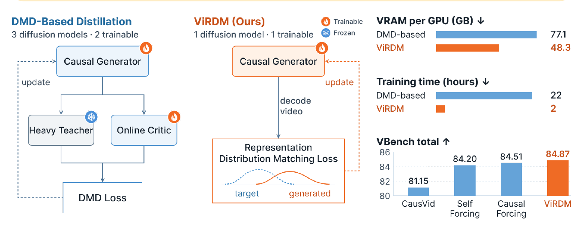
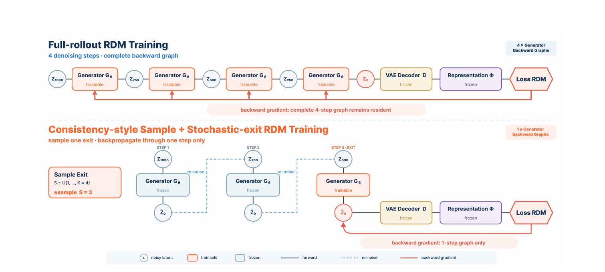
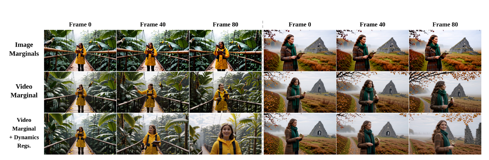
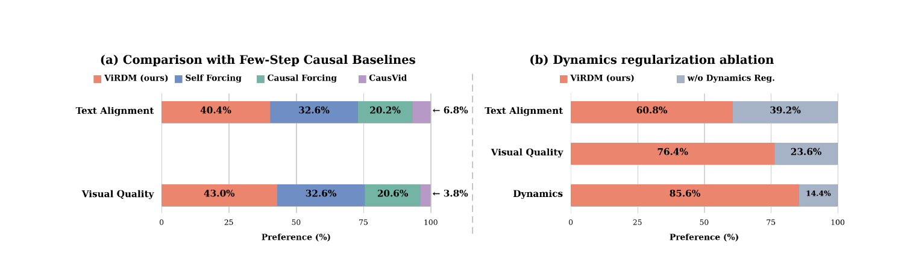

# ViRDM: Taming Representation Distribution Matching for Few-Step Causal Video Generation

**论文**: [arXiv:2609.28923v1](https://arxiv.org/abs/2609.28923) (cs.CV, 2026-09-24, 22 页)
**作者**: Zichong Meng★, Chongjian Ge, Chun-Hao P. Huang, Yang Zhou†, Huaizu Jiang† — **Northeastern University + Adobe Research**（★ Adobe 实习期间完成，† 共同指导）
**底座**: Wan2.1-T2V-1.3B，4 步 chunk-wise 因果生成；**初始化直接取 Causal Forcing 发布的 causal-ODE checkpoint**
**项目页**: [neu-vi.github.io/ViRDM](https://neu-vi.github.io/ViRDM/)
**代码**: [github.com/neu-vi/ViRDM](https://github.com/neu-vi/ViRDM)（本笔记引用 commit [`0f71c3e`](https://github.com/neu-vi/ViRDM/tree/0f71c3ee1490de976ac6c893b851971c72fe8ed2)）—— **训练代码、配置、参考分布、两个 checkpoint 都发布了**

---

## 1. 一句话定位

**把 DMD 那套"冻结的 14B teacher + 在线 critic + generator"三网络结构，换成只训 generator：把生成视频编码进冻结的 V-JEPA 2.1 + SigLIP2 联合特征空间，和一份离线算好、固定不变的参考分布做 MMD。** 思路来自一步图像生成的 RDM / FD loss，本文要解决的是它搬到"4 步因果视频"时遇到的三个障碍。

| | DMD（Self Forcing / Causal Forcing 的最后一阶段） | ViRDM |
|---|---|---|
| 训练时驻留的扩散网络 | 3 个：Wan2.1-14B teacher（冻结）+ 1.3B critic（在线训练）+ generator | **1 个**：generator |
| 信号 | 重新加噪后，teacher score 减 critic score | **表示空间里的 MMD**，参考分布离线一次算好 |
| generator 更新次数 | 120 | **20** |
| 8×A100 峰值显存 / GPU | 77.1 GB | **48.3 GB** |
| 最后一阶段耗时 | 22 h（176 GPU-h） | **2 h（16 GPU-h）** |
| 官方 VBench Total | Causal Forcing 84.51 | **84.87** |

🔴 **但读完全文 + 核对开源代码后，我认为头条结论要打三个折扣**：
1. **RDM 本身并没有赢过 DMD。** 不加光流正则时，它在官方 VBench Total 上是 **83.41，低于 Self Forcing（84.20）和 Causal Forcing（84.51）**。它赢的是一个自定义指标"Total w/o Dynamic Degree"，恰好去掉了它输的那一维（见 [§6.1](#61-主表table-8与去掉正则之后的真实位置)）。
2. **把它推过 Causal Forcing 的光流正则，就是 VBench Dynamic Degree 判定规则的可微版本。** 同一份 RAFT 权重（连下载 URL 都相同）、同样按 8 fps 抽帧、同样取光流幅度前 5% 的均值、同样的阈值 11.25、同样的命中数 10 —— **这个 hinge 损失非零，当且仅当 VBench 会把这条视频判为"静态"**。论文没有披露这一点（见 [§3.5](#35-动态缺口与光流正则代码里就是-vbench-的判定规则)）。
3. **+0.36 的领先比"同一个 baseline 在不同论文里的分数波动"还小。** 公开的 Causal Forcing checkpoint 在它自己论文里是 84.04、在 ViRDM 里是 84.51、在 [RAVEN](../raven/analysis.md) 里是 **84.96（比 ViRDM 的 84.87 还高）**；而且全文单种子，正则权重 λ 是在同一个 VBench 上挑的（见 [§6.2](#62-正则权重扫描table-9λ-是在测试基准上挑的)）。

📌 **站得住的部分同样清楚**：显存工程（随机出口 + 分阶段 VJP + 轻量 decoder）把一个本来一步都跑不动的目标做成了单卡 A100 可训；**"RDM 能精修已有的因果模型，但造不出因果性"**这条初始化结论干净；在非动态维度上它确实比 DMD 好（Total w/o DD 85.79 vs Causal Forcing 84.64）；最后一阶段的算力从 176 降到 16 GPU-h 是实打实的；训练代码完整开源。

---

## 2. 要解决的问题

> **Fig 1 逐段解读**：
>
> **左 · DMD-Based Distillation** —— 标注 *3 diffusion models · 2 trainable*。`Causal Generator`（🔥 可训）的输出分两路送进 `Heavy Teacher`（❄ 冻结，实际是 Wan2.1-14B）和 `Online Critic`（🔥 可训，1.3B），两者的差构成 `DMD Loss`，虚线回传更新 generator。**critic 本身要在线拟合 generator 的分布**，所以每次 generator 更新前后还要训 critic。
>
> **中 · ViRDM (Ours)** —— 标注 *1 diffusion model · 1 trainable*。`Causal Generator` → *decode video* → `Representation Distribution Matching Loss`，框内两条曲线分别是 *target*（蓝虚线，离线参考分布）与 *generated*（橙实线）。**没有 teacher、没有 critic，损失直接在两个样本分布之间算。**
>
> **右 · 三组柱状图** —— `VRAM per GPU`：DMD-based 77.1 GB vs ViRDM 48.3 GB；`Training time`：22 h vs 2 h；`VBench total`：CausVid 81.15 / Self Forcing 84.20 / Causal Forcing 84.51 / **ViRDM 84.87**。⚠️ **最后这张柱状图的纵轴从 80 开始**，0.36 的差被画成了肉眼明显的柱高差。另外前两张图的 "DMD-based" 指的是 **Self Forcing**（Table 7），而 VBench 里被超越的是 **Causal Forcing** —— 资源对比与质量对比的对手不是同一个。

**论文提出的三个障碍**：
1. **梯度路径显存不可行**：RDM 损失挂在"4 步因果 rollout → Wan VAE decoder → 冻结表示编码器"整条链之后，直接反传会 OOM（Table 1 前三行全是 OOM）。
2. **图像 RDM 的配方不迁移**：图像 RDM 需要几千个新生成样本来估计生成分布，还能直接把多步双向模型改造成一步生成器；视频里生成几千条太贵，而且直接从双向模型起步会失败。
3. **表示分布对动态约束不足**：图像特征主要编码外观和语义，全局池化后的视频特征只给很粗的时序监督 —— 帧都好看、语义也对，动作却可以是僵的。

---

## 3. 方法

### 3.1 预备知识：图像 RDM

把样本 `x` 与条件 `c` 拼成联合表示（论文 Eq. 1），视觉特征来自冻结图像编码器 `φ`，文本特征 `φ_t` 做 ℓ2 归一化：

$$
h(x, c) = \big[\,\phi(x)\,;\ \beta\,\tau(c)\,\big],\qquad \tau(c) = \frac{\phi_t(c)}{\lVert \phi_t(c) \rVert_2}
$$

高斯 RBF 核（Eq. 2）因此分解成视觉项与文本项的乘积，`β = σ/σ_t` 由参考集的中位数启发式带宽决定：

$$
k\big(h(x,c),\,h(x',c')\big) = \exp\!\left(-\frac{\lVert \phi(x)-\phi(x')\rVert_2^2}{2\sigma^2}\right)\exp\!\left(-\frac{\lVert \tau(c)-\tau(c')\rVert_2^2}{2\sigma_t^2}\right)
$$

目标是 B 个新生成样本与 N 个参考样本之间的经验平方 MMD（Eq. 3）：

$$
\mathcal{L}_{\mathrm{RDM}}(\hat H, H^\star) = \frac{1}{B^2}\sum_{i,i'=1}^{B} k(\hat h_i, \hat h_{i'}) - \frac{2}{BN}\sum_{i=1}^{B}\sum_{j=1}^{N} k(\hat h_i, h^\star_j) + \frac{1}{N^2}\sum_{j,j'=1}^{N} k(h^\star_j, h^\star_{j'})
$$

**三项各司其职**：第一项让生成样本**互相排斥**（防塌缩、保多样性）；第二项把它们**吸向**参考分布；第三项与参数无关。**两个样本只有在视觉和文本特征都接近时才被视为相似**，所以这是一个"条件分布"的匹配，而不是只看画面。

📌 **与 DMD 的本质区别**：DMD 比的是**加噪后**的 score 差（通过 teacher 与 critic 间接估计分布差），RDM 比的是**干净终点**在固定特征空间里的分布差 —— 不需要任何扩散 score 网络，代价是完全依赖那个冻结编码器"看得见什么"。

### 3.2 搬到视频

| 组件 | 选择 |
|---|---|
| 视觉编码器 `φ_v` | **V-JEPA 2.1 ViT-L/16**（EMA encoder，由 ViT-G 蒸馏的 384 版本），输入原生 480×832、81 帧（补到 82 帧，末帧复制） |
| 池化 | 🔴 **最后一层 LayerNorm 后的全部 token（41×30×52 个）在空间与时间上一起取平均**，得到一个 1,024 维向量 |
| 文本编码器 `φ_t` | SigLIP2 ViT-SO400M-16-256 的文本塔，1,152 维，ℓ2 归一化 |
| 联合表示 | 2,176 维；代码里 `β = 23.77` |
| 参考分布 | **N = 6,505 个视频-文本对**，离线编码一次、训练中固定 |

📌 **全局平均把时间维整个压扁了** —— 一条视频只剩一个向量，这正是障碍 3 的根源（§3.5 的 Table 5 会量化它有多钝）。

🔴 **参考视频从哪来？论文只有一句**：*"N = 6,505 video–text pairs from the training data built by Causal Forcing [78]"*。我去翻了 [Causal Forcing 原文（arXiv:2602.02214）](https://arxiv.org/abs/2602.02214) 的附录：

> *"We first construct a dataset `D_Bi` consisting of about 3K samples generated by Wan (bidirectional) with the VidProM prompts … Next, we sample ODE trajectories from the autoregressive diffusion model to construct a causal ODE dataset `D_Causal` with 3K samples … **both internally synthesized by the model**"*

§4.1 写明 `D_Bi` 是 *"synthesized by the base bidirectional model"*，即 Wan2.1-T2V-1.3B。**所以这 6,505 个"参考视频"不是真实视频，而是 1.3B base 自己（以及由它 teacher forcing 出来的因果模型）合成的样本。**（6,505 ≈ 两个约 3K 的集合之和，这是我的推断，论文与 README 都没说明。）

这改变了"teacher-free"的含义：**14B teacher 确实完全没用到；但离线地看，ViRDM 仍然是在把 4 步学生往 1.3B base 的多步输出分布上拉** —— 参考分布本身就是"teacher 样本"，只是这个 teacher 是 base 自己，而且是离线的。

### 3.3 让它在显存里跑得动

> **Fig 2 逐段解读**：
>
> **上 · Full-rollout RDM Training** —— `z_1000` → `Generator Gθ` → `z_750` → `Gθ` → `z_500` → `Gθ` → `z_250` → `Gθ` → `z_0` → `VAE Decoder D`（冻结）→ `Representation Φ`（冻结）→ `Loss RDM`。四个 generator 块都标 *trainable*，底部红色长箭头 *backward gradient: complete 4-step graph remains resident*，右上角 *4 × Generator Backward Graphs*。**四步的计算图要同时留在显存里。**
>
> **下 · Consistency-style Sample + Stochastic-exit** —— 左侧 `Sample Exit S ~ U{1,…,K=4}`，示例 `S = 3`。Step 1、Step 2 的 `Gθ` 标 *frozen*（实为无梯度前向）：每步预测一个干净终点 `Ẑ0`，再**重新加噪**（蓝虚线 *re-noise*）得到下一步的输入。只有 Step 3（*STEP 3 · EXIT*）的 `Gθ` 标 *trainable*，它的 `Ẑ0` 经 decoder 与编码器进 `Loss RDM`，反传只经过这一步（*backward gradient: 1-step graph only*，右上 *1 × Generator Backward Graphs*）。
>
> 📌 **能这样做的前提**：RDM 只看干净终点的分布，而 consistency 式采样的**每一步**都产生一个可解码的干净终点，所以任何一步都可以当监督点。这个随机出口直接沿用 Self Forcing；所有 chunk 用同一个 `S`，前 `S−1` 步无梯度，出口处的预测既作为该 chunk 的输出，也（detach 后）更新后续 chunk 的因果上下文。

**第二招：分阶段 VJP**（论文 Eq. 4–5，Algorithm 2）。随机出口之后，generator、decoder、编码器三个模块的反传图仍会同时驻留。但链式法则本身允许一个模块一个模块地往回传：

$$
g_{h,i} = \nabla_{\hat h_i}\mathcal{L}_{\mathrm{RDM}},\qquad g_{v,i} = J_{\Phi,i}^{\top} g_{h,i},\qquad g_{z,i} = J_{D,i}^{\top} g_{v,i},\qquad \nabla_\theta \mathcal{L}_{\mathrm{RDM}} = \sum_{i=1}^{B}\left(\frac{\partial \hat z_{0,i}}{\partial \theta}\right)^{\!\top} g_{z,i}
$$

Algorithm 2 的四个阶段：① 无梯度生成全部 B 条视频并**记录所有随机性**；② 在缓存的表示上算 MMD 与 `g_h`；③ 逐样本重放编码器与 decoder，得到 `g_v`、`g_z`，每做完一个模块就释放它的图；④ **按记录的随机性重放 generator 的 rollout**，把 `g_z` 反传进 `θ`。

📌 **这一招是精确的**，不是近似 —— 只是把一次端到端反传拆成几次顺序执行，代价是 generator 要前向两遍（阶段 ① 与阶段 ④）。代码里还对重放结果做了一致性检查（`virdm_rollout_replay_atol: 1e-4`、`virdm_feature_replay_atol: 1e-4`）。

**第三招：训练梯度路径里的 decoder 换成 TAEW2.1**（Tiny AutoEncoder for Wan 2.1）。论文的理由是 decoder *"is not an optimization target but a fixed differentiable bridge"*，不需要完整 Wan VAE 的容量。

**Table 1**（81 帧、832×480，80 GB A100）：

| Rollout | Decoder | 反传方式 | GPU 数 | 峰值 / GPU |
|---|---|---|---|---|
| Full | Wan VAE | End-to-End | 8 | OOM |
| Stochastic Exit | Wan VAE | End-to-End | 8 | OOM |
| Stochastic Exit | Wan VAE | Staged VJPs | 8 | OOM |
| Stochastic Exit | Lightweight VAE | Staged VJPs | 1 | 68.5 GB |
| **Stochastic Exit** | **Lightweight VAE** | **Staged VJPs** | **8** | **48.3 GB** |

⚠️ **两处论文没写、我在代码与 README 里看到的实现细节**：
1. **参考侧与生成侧用的不是同一个 decoder。** README 的 *Frozen-reference distribution* 一节写明，参考视频的每个 21 帧 latent *"is decoded with **Wan's VAE**"*；而训练时被打分的生成视频走的是 **TAEW2.1**。于是 MMD 比较的是"完整 VAE 解出来的参考"与"轻量 decoder 解出来的生成"，**两者之间有一部分差异来自 decoder 本身**，generator 可能会去补偿 TAE 的重建偏差。而部署时输出又是完整 Wan VAE 解码 —— 训练时被打分的视频和最终交付的视频也不是同一个 decoder 出的。论文没讨论这两处不一致。
2. **参考项用的是 Nyström 近似，不是 Eq. 3 的精确 MMD。** 配置里 `virdm_nystrom_landmarks: 4096`，发布的参考文件叫 `reference_M4096.pt`，README 写 *"The published file stores the 4,096 Nyström landmarks, attraction coefficients, fixed real-real kernel term"*。论文正文 "Nyström" 与 "landmark" **各出现 0 次**。6,505 个参考、64 个生成样本、2,176 维，精确算其实很便宜，为什么要近似、近似带来多大误差，都没交代。

### 3.4 视频专属的配方：多少样本、从哪起步

**Table 2 · 每次更新用多少条新生成视频 B**（causal-ODE 初始化、20 次更新）：

| B | 每卡累积 | Total ↑ | Quality ↑ | Semantic ↑ |
|---|---|---|---|---|
| 8 | 1 | 83.19 | 83.89 | 80.39 |
| **64** | 8 | 83.41 | 84.11 | **80.61** |
| 256 | 32 | 83.33 | 84.02 | 80.57 |
| 1024 | 128 | **83.57** | **84.32** | 80.59 |

结论：**B = 8 就已经有效，到 64 基本饱和**；B = 1024 的每次更新要约 96 分钟（16× 的累积轮数），只多 0.16 Total。**与图像 RDM"要几千个样本"的经验截然不同**，这是一个有用的实操结论。

⚠️ 但整张表的差距是 **0.08–0.38 分，全部单种子**（§3.4 原文：*"all compared runs use the same fixed training seed"*）。论文据此写的 *"Scaling is not monotonic: B = 256 slightly underperforms B = 64"*，这 0.08 的差在统计上撑不起"非单调"这个判断。

**Table 3 · 初始化**（都做同样 20 次 RDM 更新）：

| 初始化 | 因果前缀监督 | 少步 | Total ↑ | Quality ↑ | Semantic ↑ | Dynamic Degree ↑ |
|---|---|---|---|---|---|---|
| 双向（不初始化） | ✗ | ✗ | 65.80 | 68.82 | 53.72 | 51.39 |
| Teacher Forcing | ✓ | ✗ | 83.21 | 84.05 | 79.85 | 43.18 |
| Causal Consistency Distillation | ✓ | ✓ | 82.99 | 83.92 | 79.25 | 47.44 |
| **Causal ODE** | ✓ | ✓ | **83.41** | **84.11** | **80.61** | **48.61** |

📌 **这张表是全文最干净的结论**：直接从双向模型起步，RDM 救不回来（65.80，严重漂移；那 51.39 的 Dynamic Degree 是乱漂出来的，不是有用的动态）；**只要起点已经是因果的，哪怕还是多步模型（Teacher Forcing），20 次更新就能到 83.21**。论文的表述是 *"Representation distribution matching can refine an existing causal transport, but cannot reliably create one"* —— 这与 DMD 路线"先因果化、再做分布匹配"的做法一致。

⚠️ **缺一个关键数：causal-ODE 初始化在 RDM 之前本身是多少分，全文没报。** 所以我们无法知道 20 次更新到底贡献了多少 —— 能直接比的只有"同一个初始化，DMD（即发布的 Causal Forcing，84.51）vs RDM（83.41 / 84.87）"。

### 3.5 动态缺口与光流正则：代码里就是 VBench 的判定规则

**Table 5 · 表示分布对动态有多敏感**（把每条 81 帧视频只保留 0% / 25% / … / 100% 的均匀间隔帧、其余用重复帧填满，20 组 × 64 条取平均；越低越接近参考）：

| 分布 | 指标 | 0%（全静止） | 25% | 50% | 75% | 100%（原视频） |
|---|---|---|---|---|---|---|
| 图像（DINOv2，逐帧） | RDM | 0.006830 | 0.006098（−10.7%） | 0.006099（−10.7%） | 0.006102（−10.7%） | 0.006101（−10.7%） |
| 视频（V-JEPA 2.1，全局） | RDM | 0.100708 | 0.027522（−72.7%） | 0.015179（−84.9%） | 0.008694（−91.4%） | 0.006240（−93.8%） |

（另有一行 √RDM，趋势相同。）**读法**：逐帧图像特征对 25%–100% 的动态**完全无感**，只在"全静止"这个退化端点上变化；视频特征单调下降，**但 72.7% 的降幅都发生在 0% → 25% 这一步**，之后越来越平。也就是说，V-JEPA 的全局表示能把生成**从"几乎不动"推到"中等动态"**，再往上就推不动了。

> **Fig 4 逐行对比**（两条视频，各取第 0 / 40 / 80 帧）：
>
> - **Image Marginals（上）** —— 两条视频的三帧几乎一模一样：雨林吊桥上的女子、石屋前的女子都像定格照片。**逐帧 DINOv2 特征只管"每帧好不好看"，不管"动没动"**，这一行就是 Table 6 里 Dynamic Degree 只有 18.06 的样子。
> - **Video Marginal（中）** —— 开始有动作：吊桥上的人抬手、转身，石屋前的女子也改变了姿态，背景树枝入画。对应 Dynamic Degree 48.61。
> - **+ Dynamics Regs.（下）** —— 动作最大：**第一条视频第 80 帧镜头推成了人脸特写**；**第二条视频第 80 帧背景构图变了** —— 原本居中的带拱门石屋退到人物身后，右侧出现两根此前不在画面里的石柱。论文的描述是 *"sustained temporal change while preserving the scene and subject"*。
>
> ⚠️ **我的读法**：这两处变化都可能是镜头运动（推近、右移）带出来的，三帧图分不清。**但它们恰好是 Dynamic Degree 无法区分的那类"动态"** —— 镜头推近与平移同样会让光流变大（见下面代码对照）。只有两个样本，不能下结论。

**光流正则**（论文 Eq. 6–7）：用冻结的 RAFT 在采样的帧对上估光流，把高幅度响应汇总成视频级动态分数 `s(v̂)`，施加单边 hinge：

$$
\mathcal{L}_{\mathrm{dyn}}(\hat v) = \big[\,\tau_{\mathrm{flow}} - s(\hat v)\,\big]_+,\qquad \mathcal{L} = \mathcal{L}_{\mathrm{RDM}} + \lambda_{\mathrm{dyn}}\,\mathcal{L}_{\mathrm{dyn}},\qquad \lambda_{\mathrm{dyn}} = 5\times 10^{-4}
$$

论文对 `s` 与 `τ_flow` 的全部描述是：*"Inspired by this interpretable criterion [VBench 以光流幅度衡量动态], we use a frozen RAFT network to estimate flow over temporally sampled frame pairs. We summarize high-magnitude spatial flow responses and aggregate them across multiple pairs … `τ` specifies a minimum desired level of dynamics in terms of flow."*

🔴 **代码把"受启发"落实成了逐项照抄。** 对照 VBench 的 [`dynamic_degree.py`](https://github.com/Vchitect/VBench/blob/f9d345a2064f90709501680c7954945149329d14/vbench/dynamic_degree.py) 与 ViRDM 的 [`trainer/virdm.py`](https://github.com/neu-vi/ViRDM/blob/0f71c3ee1490de976ac6c893b851971c72fe8ed2/trainer/virdm.py#L363-L470)：

| | VBench 的 Dynamic Degree（评测用） | ViRDM 的光流正则（训练用） |
|---|---|---|
| 光流网络 | RAFT，`raft-things.pth`，从 `dl.dropboxusercontent.com/s/4j4z58wuv8o0mfz/models.zip` 下载（`utils.py:279-287`） | **同一个 URL 里的同一个 `raft-things.pth`**，在 manifest 里被改名成 `flow/dense_flow.pth` |
| 迭代次数 | `iters=20` | `virdm_dynamic_reg_iters: 20` |
| 抽帧 | `interval = round(fps / 8)`（`:100`） | `frame_stride = round(16 / 8) = 2` → 41 帧、40 对 |
| 每对帧的分数 | 光流幅度**前 5% 的均值**（`:52-54`） | `_dynamic_reg_top5_flow_mean`：前 5% 的均值（`virdm.py:365-373`） |
| 阈值 | `6.0 × min(h,w) / 256`（`:61`）→ 480p 下 **11.25** | `virdm_dynamic_reg_flow_threshold: 11.25` |
| 判定 | 超阈值的帧对 ≥ `round(4 × 41/16)` = **10** 个 → "动态"（`:84-94`） | 取第 10 大的帧对分数 `s10`（`virdm.py:435`），`relu(11.25 − s10)`（`:462`） |

"至少 10 对超过阈值"与"第 10 大的分数超过阈值"是同一个条件。**所以这个 hinge 损失非零，当且仅当 VBench 会把这条视频判为"静态"；它的梯度只作用在第 10 大的那一对帧上，把它推过 VBench 的阈值。** VBench 的 Dynamic Degree 分数就是"被判为动态的视频占比" —— **这个正则是在逐条训练视频上直接优化评测指标**。

📌 **论文自己并非没意识到风险**，§4.3 写道：*"Because this metric is itself based on optical flow, however, it is important to determine whether the improvement reflects meaningful dynamics or merely increased flow caused by jitter, flicker, or incoherent subject and background changes."* 它用了三类证据回应（Table 9 的"目标外"指标、Fig 4、人评，见 [§6.2](#62-正则权重扫描table-9λ-是在测试基准上挑的)–[§6.3](#63-人评fig-6没问对手的动态)）。**但它没有告诉读者，这个"训练用的光流目标"与"评测用的光流判据"在实现上是同一个东西** —— 这决定了 Dynamic Degree 的提升能不能当成独立证据。

📌 仓库里 [RAVEN](../raven/analysis.md) 走的是反方向：它**弃用** VBench 的 Dynamic Degree，理由是 *"VBench 的 Dynamic Degree 用 RAFT 光流幅度算，会把镜头抖动和时序漂移一并算成'运动'"*，改用 UnifiedReward-32B 打分；[Recency Forcing](../recency_forcing/analysis.md) 的 Table 4 也记录过截断上下文会把 Dynamic Degree 刷到 88.58 而综合质量下降。

---

## 4. 关键代码位置

仓库 [`neu-vi/ViRDM`](https://github.com/neu-vi/ViRDM) 同时发布了训练与推理（基于 Self-Forcing 的代码改造，`THIRD_PARTY.md` 逐一列出上游与版本），以及 `nodynamic` / `dynamic` 两个 checkpoint。以下均为 commit `0f71c3e`。

| 位置 | 内容 | 对应论文 |
|---|---|---|
| [`config_virdm_bs64_1x8.yaml:2`](https://github.com/neu-vi/ViRDM/blob/0f71c3ee1490de976ac6c893b851971c72fe8ed2/config_virdm_bs64_1x8.yaml#L2) | `generator_ckpt: …/chunkwise/causal_ode.pt`；manifest 里指向 HF `zhuhz22/Causal-Forcing` 的固定 revision | §3.4.2 的 causal-ODE 初始化 |
| [`config…yaml:14-15`](https://github.com/neu-vi/ViRDM/blob/0f71c3ee1490de976ac6c893b851971c72fe8ed2/config_virdm_bs64_1x8.yaml#L14-L15) | `denoising_step_list: [1000, 750, 500, 250]` + `warp_denoising_step: true` | shift = 5 后即 `{1, 0.9375, 0.8333, 0.625}`（我按 `5t/(1+4t)` 复算一致） |
| [`config…yaml:17`](https://github.com/neu-vi/ViRDM/blob/0f71c3ee1490de976ac6c893b851971c72fe8ed2/config_virdm_bs64_1x8.yaml#L17) | `seed: 0` | 全部实验单种子 |
| [`config…yaml:28-34`](https://github.com/neu-vi/ViRDM/blob/0f71c3ee1490de976ac6c893b851971c72fe8ed2/config_virdm_bs64_1x8.yaml#L28-L34) | lr 2e-6、`(0.9, 0.95)`、无 weight decay、`max_steps: 20` | §3.4 |
| [`config…yaml:57-60`](https://github.com/neu-vi/ViRDM/blob/0f71c3ee1490de976ac6c893b851971c72fe8ed2/config_virdm_bs64_1x8.yaml#L57-L60) | 参考包 `reference_M4096.pt`，`virdm_expected_reference_rows: 6505` | §3.2 |
| [`config…yaml:70`](https://github.com/neu-vi/ViRDM/blob/0f71c3ee1490de976ac6c893b851971c72fe8ed2/config_virdm_bs64_1x8.yaml#L70) | `virdm_pool: global_mean_all_tokens` | 时空一起全局平均 |
| [`config…yaml:87-92`](https://github.com/neu-vi/ViRDM/blob/0f71c3ee1490de976ac6c893b851971c72fe8ed2/config_virdm_bs64_1x8.yaml#L87-L92) | 每卡累积 8、8 卡 → 每次更新 64 条；**`virdm_nystrom_landmarks: 4096`** | 论文未提 Nyström |
| [`virdm_integration/reference.py:117-155`](https://github.com/neu-vi/ViRDM/blob/0f71c3ee1490de976ac6c893b851971c72fe8ed2/virdm_integration/reference.py#L117-L155) | `mmd_nystrom_with_terms`：生成-生成项精确计算（含对角线）；**吸引项是 `exp(−γ‖g − Z‖²) @ alpha`，对 4,096 个 landmark 加权**；参考-参考项为常数 | Eq. 3 的近似实现 |
| [`config…yaml:99-108`](https://github.com/neu-vi/ViRDM/blob/0f71c3ee1490de976ac6c893b851971c72fe8ed2/config_virdm_bs64_1x8.yaml#L99-L108) | 光流正则：阈值 **11.25**、命中数 **10**、`eval_fps: 8`、`iters: 20`、权重 5e-4（base 配置里默认关闭，`dynamic` 变体打开） | §3.5.2 |
| [`artifacts/manifest.json:47-50`](https://github.com/neu-vi/ViRDM/blob/0f71c3ee1490de976ac6c893b851971c72fe8ed2/artifacts/manifest.json#L47-L50) | `dense_flow` = RAFT 官方 `models.zip` 里的 **`raft-things.pth`** | 与 VBench 用同一份权重 |
| [`trainer/virdm.py:365-373`](https://github.com/neu-vi/ViRDM/blob/0f71c3ee1490de976ac6c893b851971c72fe8ed2/trainer/virdm.py#L365-L373) | 每对帧：光流幅度前 5% 的均值 | 同 VBench `get_score` |
| [`trainer/virdm.py:435-462`](https://github.com/neu-vi/ViRDM/blob/0f71c3ee1490de976ac6c893b851971c72fe8ed2/trainer/virdm.py#L435-L462) | 取第 10 大的帧对分数 → `relu(threshold − s10)`，只在该对帧上回传 | 同 VBench `check_move` |
| VBench [`dynamic_degree.py:52-61, 84-100`](https://github.com/Vchitect/VBench/blob/f9d345a2064f90709501680c7954945149329d14/vbench/dynamic_degree.py#L52-L100) / [`utils.py:279-287`](https://github.com/Vchitect/VBench/blob/e2cacab866e9fe53109d95bc0d136b939b7f7335/vbench/utils.py#L279-L287) | 评测侧的对应实现（阈值公式、命中数、抽帧、RAFT 权重下载地址） | —— |

---

## 5. 实验设置

| 项 | 值 |
|---|---|
| Generator | Wan2.1-T2V-1.3B，chunk-wise 因果，每 chunk 3 个 latent frame；81 帧（21 latent）、832×480 |
| 采样 | 训练与推理都是 4 步、shift 5；consistency 式（每步预测干净终点再重新加噪） |
| 初始化 | Causal Forcing 发布的 **causal-ODE checkpoint**（其前序阶段：base 合成 `D_Bi` → teacher forcing 训 AR 扩散模型 → 在它的 ODE 轨迹上做因果 ODE 蒸馏） |
| 表示 | V-JEPA 2.1 ViT-L/16（1,024 维，全局平均）+ SigLIP2 文本塔（1,152 维）；联合 2,176 维 |
| 参考分布 | 6,505 条，**由 1.3B base 及其因果衍生模型合成**（见 §3.2）；用完整 Wan VAE 解码后编码；吸引项用 4,096 个 landmark 的 Nyström 近似 |
| 训练 | AdamW，lr 2e-6，**20 次 generator 更新**，每次 B = 64 条新生成视频；8×A100，约 6 分钟 / 次，共 2 h |
| 光流正则 | `λ_dyn = 5e-4`，RAFT（`raft-things.pth`），阈值与命中数与 VBench 相同（§3.5） |
| 评测 | VBench，沿用 Self Forcing 的扩展 prompt 集与官方评测流程；**baseline 在同一环境里重测**（所以 Self Forcing 是 84.20 而非其原文的 84.31）；吞吐与延迟在单卡 H100 上测，baseline 的效率数取自各自论文 |
| 人评 | 25 人 × 30 个 prompt：20 个做四选一（ViRDM / CausVid / Self Forcing / Causal Forcing），10 个做 ViRDM vs 去掉正则的 ViRDM |
| 种子 / 误差棒 | 训练固定 `seed: 0`；**全文无误差棒、无多种子** |

---

## 6. 结果

### 6.1 主表（Table 8）与去掉正则之后的真实位置

| 模型 | 参数 | 分辨率 | 吞吐（FPS）↑ | 延迟（s）↓ | Total ↑ | Quality ↑ | Semantic ↑ |
|---|---|---|---|---|---|---|---|
| *双向* | | | | | | | |
| LTX-Video-1.9B | 1.9B | 768×512 | 8.98 | 13.5 | 79.91 | 82.20 | 70.75 |
| Wan2.1-1.3B | 1.3B | 832×480 | 0.78 | 103 | 84.23 | 85.26 | 80.11 |
| *自回归（多步）* | | | | | | | |
| NOVA | 0.6B | 768×480 | 0.88 | 4.1 | 80.09 | 80.33 | 79.13 |
| Pyramid Flow | 2.0B | 640×384 | 6.70 | 2.5 | 81.75 | 84.72 | 69.87 |
| SkyReels-V2-1.3B | 1.3B | 960×540 | 0.49 | 112 | 82.60 | 84.60 | 74.60 |
| MAGI-1-4.5B | 4.5B | 832×480 | 0.19 | 282 | 79.09 | 82.04 | 67.29 |
| *4 步因果* | | | | | | | |
| CausVid | 1.3B | 832×480 | 17.0 | 0.69 | 81.15 | 83.99 | 69.79 |
| Self Forcing | 1.3B | 832×480 | 17.0 | 0.69 | 84.20 | 84.90 | **81.39** |
| Causal Forcing | 1.3B | 832×480 | 17.0 | 0.69 | <ins>84.51</ins> | <ins>85.36</ins> | <ins>81.09</ins> |
| **ViRDM** | 1.3B | 832×480 | 17.0 | 0.69 | **84.87** | **85.82** | <ins>81.09</ins> |

（4 步因果组内的加粗/下划线我逐格核过，与原表一致；ViRDM 与 Causal Forcing 的 Semantic 恰好都是 81.09，并列第二。）

📌 **这张表只给了带正则的最终模型。要看 RDM 本身的位置，得把几张表拼起来** —— 我用 VBench 的组合方式（Quality 各维等权、Dynamic Degree 权重 0.5；`Total = (4·Quality + Semantic)/5`）做了勾稽：从 Table 4 的"Total w/o Dynamic Degree"与 Dynamic Degree 出发，**反推出的 Self Forcing、Causal Forcing 的 Quality 与 Total 与 Table 8 完全吻合**（84.90 / 84.20，85.36 / 84.51）；Table 6 第三行与 Table 8 的 ViRDM 行逐项相同。**所以这几张表是同一套协议，可以直接拼**：

| | 官方 Total | Total w/o DD | Dynamic Degree |
|---|---|---|---|
| Self Forcing | 84.20 | 85.34 | 67.78 |
| Causal Forcing | **84.51** | 84.64 | **83.33** |
| ViRDM（仅 RDM） | 🔴 **83.41** | **85.77** | 48.61 |
| ViRDM（RDM + 光流正则） | **84.87** | 85.79 | 72.02 |

🔴 **读出来的事实**：
- **只用 RDM，官方 Total 输给两个 DMD baseline**（83.41 vs 84.20 / 84.51）。论文这一阶段的比较用的是"Total w/o Dynamic Degree"（Table 4，*"recomputes the VBench Total after excluding the Dynamic Degree dimension"*），**恰好去掉了它唯一输的那一维**。论文对此写得很坦白（*"remaining below the DMD-based baselines on Dynamic Degree"*），但头条比较的口径因此前后不一。
- **RDM 在非动态维度上是真的更好**：Total w/o DD 85.79 vs Causal Forcing 84.64，高 1.15。这是 RDM 本身的功劳。
- **翻盘全靠光流正则**：它让 Total +1.46，其中论文自己算过 *"the 23.41-point Dynamic Degree increase contributes approximately 1.80 points to Quality"*（我按 `0.5 × 23.41 / 6.5 = 1.80` 复算一致），去掉 DD 后 Total 只变了 +0.02。**而这个正则优化的就是 Dynamic Degree 的判定规则本身**（§3.5）。
- **即便加了正则，Dynamic Degree 仍比 Causal Forcing 低 11.31 分**（72.02 vs 83.33）。

📌 **同一个 baseline 在不同论文里的分数**（仓库已有笔记里记录的数，都是官方 VBench Total）：

| 出处 | Causal Forcing | Self Forcing |
|---|---|---|
| Causal Forcing 原文 / [Recency Forcing](../recency_forcing/analysis.md) | 84.04 | 84.31 |
| **ViRDM** | **84.51** | 84.20 |
| [RAVEN](../raven/analysis.md) | **84.96** | 84.27 |
| [Mask Forcing](../mask_forcing/analysis.md)（其主表整体偏低，协议应不同） | 82.67 | 81.89 |

**同一个公开 checkpoint，跨论文的 Total 在 84.04–84.96 之间浮动，幅度 0.92 —— 是 ViRDM 所声称领先（0.36）的两倍多；在 RAVEN 的评测环境里，Causal Forcing 本身就高于 ViRDM 的 84.87。** 不同论文的数不能直接比，但这恰恰说明：**在单种子、无误差棒的条件下，0.36 分落在评测环境本身的波动范围之内。**

### 6.2 正则权重扫描（Table 9）：λ 是在测试基准上挑的

| `λ_dyn` | Total ↑ | Dynamic Degree ↑ | Motion Smoothness ↑ | Temporal Flickering ↑ | Subject Consistency ↑ | Background Consistency ↑ |
|---|---|---|---|---|---|---|
| 0 | 83.41 | 48.61 | 98.11 | 99.05 | 96.56 | 96.25 |
| 1e-4 | 83.62 | 54.17 | 98.31 | 98.98 | 96.50 | 96.19 |
| **5e-4（采用）** | 84.87 | 72.02 | 98.29 | 99.13 | 96.41 | 96.24 |
| 1e-3 | **85.64** | **88.89** | **98.56** | 98.14 | 96.15 | 95.36 |

（括号里的增量我逐格复算，全对。）论文的解读：λ 增大时 Dynamic Degree 与 Total 单调上升，到 1e-3 时闪烁、主体一致性、背景一致性分别掉 0.91 / 0.41 / 0.89，所以选 5e-4 这个"平衡点"。**这个取舍本身是合理的，而且论文把 1e-3 那行如实报了出来。**

⚠️ **但要看清三件事**：
1. **官方 Total 随 λ 单调上升，一路涨到 85.64** —— 哪怕时序质量已经开始变差。**也就是说，VBench Total 会奖励这个正则，即使它在伤害视频的其它方面。**
2. **λ = 1e-4 时 Total 只有 83.62，低于 Causal Forcing 的 84.51** —— "超越此前最好"这个结论，取决于 λ 取到足够大。
3. **λ 是在同一个 VBench 评测上挑出来的**，没有独立的验证集。

### 6.3 人评（Fig 6）：没问对手的"动态"

> **Fig 6 逐面板解读**：
>
> **(a) 与 4 步因果 baseline 的四选一**（20 个 prompt，25 人）—— 两个维度：**Text Alignment**：ViRDM **40.4%** / Self Forcing 32.6% / Causal Forcing 20.2% / CausVid 6.8%；**Visual Quality**：ViRDM **43.0%** / Self Forcing 32.6% / Causal Forcing 20.6% / CausVid 3.8%（两行各加总为 100%；按 20 × 25 = 500 次判断折算，份额都是整数次）。
>
> **(b) 与去掉正则的 ViRDM 的二选一**（10 个 prompt）—— Text Alignment **60.8%** vs 39.2%；Visual Quality **76.4%** vs 23.6%；**Dynamics 85.6%** vs 14.4%。
>
> ⚠️ **两点读法**：
> - **四选一只问了图文对齐和画质，没问动态。** 动态只在"ViRDM vs 它自己去掉正则的版本"之间比过。**而 Causal Forcing 的 Dynamic Degree（83.33）比 ViRDM（72.02）高 11 分 —— 恰好是人评没去测的那一维。**
> - **人评把 Self Forcing 排在 Causal Forcing 前面**（32.6% vs 20.2% / 20.6%），**与 VBench 的排序（84.20 < 84.51）相反**。这本身说明 VBench Total 的 0.3 分级差异，与人的偏好并不对齐。

### 6.4 资源对比（Table 7）

| 方法 | Teacher | 在线 critic | generator 更新 | 峰值显存 / GPU | 训练时间 | GPU-h |
|---|---|---|---|---|---|---|
| DMD（Self Forcing） | Wan2.1-14B | Wan2.1-1.3B | 120 | 77.1 GB | 22 h | 176 |
| **ViRDM** | — | — | **20** | **48.3 GB** | **2 h** | **16** |

**这是本文最硬的一组数**：最后一阶段从三个驻留模型减到一个，算力降一个量级（我复算：77.1 − 48.3 = 28.8 GB；8 × 22 = 176、8 × 2 = 16；20 次 × 约 6 分钟 = 2 h，全对）。

⚠️ **口径说明**：表注写明 *"excluding the shared initialization stage"* —— **只比最后一个分布匹配阶段**。causal-ODE 初始化（base 合成数据 → teacher forcing → 因果 ODE 蒸馏）的成本两边都没算。另外对照行是 **Self Forcing** 的 DMD 阶段，而 ViRDM 与之共享初始化的其实是 **Causal Forcing**。

### 6.5 两个扩展（论文自称"探索性"）

**更少步（Table 10，沿用 ASD 的 First-Frame Enhancement：第一个 chunk 仍用 4 步）**：

| 后续 chunk 步数 | 方法 | Total ↑ | Quality ↑ | Semantic ↑ |
|---|---|---|---|---|
| 2 | Causal Forcing++（逐帧） | **84.43** | 85.19 | **81.39** |
| 2 | ASD | 84.38 | 85.17 | 81.22 |
| 2 | ViRDM | 84.42 | **85.44** | 80.35 |
| 1 | Causal Forcing++（逐帧） | 83.75 | 84.70 | 79.95 |
| 1 | ASD | 83.97 | 84.65 | **81.25** |
| 1 | One-Forcing（逐帧） | 84.01 | **85.53** | 77.93 |
| 1 | ViRDM | **84.27** | 85.04 | 81.17 |

2 步时 ViRDM 的 Total 比 Causal Forcing++ 低 0.01、Semantic 是三者最低；1 步时 Total 最高。**差距都在 0.3 分以内**，同样是单种子。⚠️ 这两个设置用的是什么初始化、正则权重是否重调，论文没说 `[待补]`。

**双向少步（Table 11）**：1 / 2 / 4 步分别为 83.12 / 84.53 / 84.56。⚠️ **这张表没有任何 baseline**，而且没写从哪个 checkpoint 起步 `[待补]`。若是从原始多步 Wan2.1-1.3B 直接开始，就意味着 20 次 RDM 更新把一个 50 步双向模型压到了 1–4 步 —— 这与 Table 3 中"多步因果模型（Teacher Forcing）经 RDM 到 4 步可达 83.21"的结果方向一致，但需要对照才能判断它有多好。

---

## 7. 数字核对

**核对通过的**（我逐条复算或交叉勾稽）：

| 项 | 结果 |
|---|---|
| VBench 组合关系：Table 4（Total w/o DD、DD）→ Table 8（Quality、Total），Self Forcing 与 Causal Forcing | 反推值 84.90 / 84.20、85.36 / 84.51 与原表一致 ✅ |
| Table 6 第三行 = Table 8 ViRDM 行；Table 2 / 3 的 Causal ODE 行 = Table 6 第二行 | 逐项相同 ✅（同一协议） |
| Table 6 与 Table 9 的全部括号增量 | 全对 ✅ |
| "Dynamic Degree +23.41 约贡献 Quality +1.80" | `0.5 × 23.41 / 6.5 = 1.80` ✅ |
| Table 2："B = 1024 比 B = 64 多 0.16 Total、0.21 Quality、−0.02 Semantic"；"每次更新约 96 分钟" | ✅（128 / 8 = 16 倍累积，16 × 6 分钟） |
| Table 5 的百分比（如视频 RDM 0.027522 / 0.100708 → −72.7%，0.006240 / 0.100708 → −93.8%） | ✅ |
| Table 7：28.8 GB、176 / 16 GPU-h、20 次 × 6 分钟 ≈ 2 h | ✅ |
| 人评份额：按 500 / 250 次判断折算都是整数次，各行加总 100% | ✅ |
| 时间步：shift 5 下 `{1000, 750, 500, 250}` → `{1, 0.9375, 0.8333, 0.625}` | ✅ |
| Table 8 四步组的加粗 / 下划线（300 DPI 渲染核对） | ✅ |

**论文没说、代码里看到的**：

1. 🔴 **光流正则与 VBench Dynamic Degree 的判定规则逐项相同**（同一份 RAFT 权重与下载地址、8 fps 抽帧、前 5% 均值、阈值 11.25、命中数 10），hinge 非零当且仅当 VBench 判"静态"（§3.5）。论文只说 *"Inspired by this interpretable criterion"*。
2. ⚠️ **吸引项是 4,096 个 landmark 的 Nyström 近似**，不是 Eq. 3 的精确 MMD；论文里 "Nyström" 出现 0 次（§3.3）。
3. ⚠️ **参考视频用完整 Wan VAE 解码，生成视频训练时用 TAEW2.1 解码**，两个分布之间混入了 decoder 差异（§3.3）。
4. ⚠️ **参考分布是 base 模型的合成样本**（据 Causal Forcing 附录），论文只写了"来自 Causal Forcing 构建的训练数据"（§3.2）。

**叙述与呈现**：
- ⚠️ "此前最好"的比较在正文里换了两次口径：未加正则时用 "Total w/o Dynamic Degree"（Table 4），加正则后用官方 Total（Table 8）。
- ⚠️ Fig 1 的 VBench 柱状图纵轴从 80 起；资源对比的对手是 Self Forcing、质量对比的对手是 Causal Forcing。
- ⚠️ Table 2 的"非单调"结论建立在 0.08 分、单种子的差上。
- 小笔误：Table 6 标题 "copmarison"。

---

## 8. 争议与权衡

**站得住的**：
- 📌 **显存工程是真贡献**：随机出口（沿用 Self Forcing）+ 分阶段 VJP（精确，只是多一遍 generator 前向）+ 轻量 decoder，把一个原本 8 卡 OOM 的目标做成了 8 卡 48.3 GB、单卡 68.5 GB 可训。**分阶段 VJP 这招对任何"损失挂在冻结大模块之后"的视频后训练都通用**（例如用视频奖励模型做 RL）。
- 📌 **"B = 8–64 就够"与"RDM 精修因果、造不出因果"两条实操结论干净**，后者与 DMD 路线的经验相互印证。
- 📌 **非动态维度上 RDM 确实比 DMD 好**：Total w/o DD 85.79 vs Causal Forcing 84.64；人评在画质上 43.0% 居首。
- 📌 **最后一阶段的成本降了一个量级**（176 → 16 GPU-h），且完全不需要 14B teacher 常驻 —— 这对显存有限的团队是实打实的。
- 📌 **完整开源**，而且代码写得透明（manifest 固定了每个上游文件的 URL 与 SHA256），这让上面几处"论文没说的细节"可以被核实。
- 📌 **有 Limitations 段**：明说 RDM 不能替代因果预训练、继承冻结编码器与固定参考分布的偏置、只在 1.3B / 81 帧上验证。

**需要打折的**：
- 🔴 **最终的 +0.36 来自一个在实现上与评测判据相同的正则**（§3.5、§6.1）。**光流正则让 Dynamic Degree 从 48.61 升到 72.02、Total 升 1.46，这部分提升不能当作独立于评测指标的证据。** 论文用"目标外"指标（Table 9）和人评（Fig 6b）回应，但四选一人评没问动态，而 Causal Forcing 的动态指标比 ViRDM 高 11 分。
- 🔴 **RDM 本身在官方 Total 上输给两个 DMD baseline**（83.41 vs 84.20 / 84.51）。
- 🔴 **0.36 的领先小于同一 baseline 的跨论文波动**（Causal Forcing 84.04–84.96），单种子、λ 在测试基准上挑选（§6.1、§6.2）。
- ⚠️ **"teacher-free"只在"无在线 score teacher"的意义上成立**：参考分布是 base 模型的合成样本；初始化来自 Causal Forcing 的 teacher forcing + 因果 ODE 蒸馏流程；资源对比只算最后一段（§3.2、§6.4）。
- ⚠️ **全局平均池化让表示对"中等 vs 高动态"几乎无感**（Table 5），这是方法的结构性局限 —— 论文选择用光流正则去补，而不是换一个保留时间结构的表示。
- ⚠️ **三处实现细节未披露**：Nyström 近似、两侧 decoder 不一致、参考数据来源（§7）。
- ⚠️ 两个扩展实验（更少步、双向）的初始化与超参未交代，双向表没有 baseline（§6.5）。
- ⚠️ causal-ODE 初始化在 RDM 之前的分数没报，20 次更新的净贡献无法单独度量（§3.4）。

---

## 9. 一句话总结

**ViRDM 把少步因果视频蒸馏最后那个"14B teacher + 在线 critic + generator"的 DMD 阶段，换成只训 generator 的表示分布匹配：生成视频经轻量 TAEW2.1 解码、冻结 V-JEPA 2.1 与 SigLIP2 编码成一个 2,176 维联合向量，与 6,505 条离线参考做 MMD；随机出口 + 分阶段 VJP 让它在 8 卡 48.3 GB 下可训，从 Causal Forcing 的 causal-ODE 初始化出发只需 20 次更新、16 A100-hours。** 它有三条干净的实操结论：每次 8–64 条新生成视频就够（图像 RDM 要几千）、RDM 能精修因果模型但造不出因果性、在非动态维度上它确实优于 DMD（Total w/o DD 85.79 vs 84.64）；代码与两个 checkpoint 完整开源。🔴 **但它的头条"VBench 84.87，超过此前最好 0.36"要这样读**：只用 RDM 时官方 Total 是 **83.41，低于 Self Forcing 与 Causal Forcing**；把它推过去的是一个光流正则，而**开源代码显示这个正则与 VBench 的 Dynamic Degree 判定规则逐项相同** —— 同一份 `raft-things.pth`（连下载地址都相同）、同样 8 fps 抽帧、同样取前 5% 光流均值、同样的阈值 11.25 与命中数 10，**损失非零当且仅当 VBench 会把视频判为静态**，论文只说是"受这一判据启发"。再加上单种子、λ 在同一基准上挑选，以及**同一个 Causal Forcing checkpoint 在不同论文里的 VBench Total 就在 84.04–84.96 之间浮动**（在 RAVEN 的环境里它本身就高于 84.87），这 0.36 分落在评测波动之内。另外，"teacher-free"只指没有在线 teacher：参考分布本身是 1.3B base 的合成样本，初始化也来自 Causal Forcing 的完整前序流程；代码里还有两处论文没写的实现细节 —— 吸引项用了 4,096 个 landmark 的 Nyström 近似，参考侧与生成侧用的不是同一个 decoder。

---

## 10. 在仓库图谱里的位置

| | 关系 |
|---|---|
| **[五篇横向对照](../dmd_few_step_ar/analysis.md)** | 📌 **它保留了那条流水线的 ① 因果化与 ② 少步初始化（直接取 Causal Forcing 的 causal-ODE checkpoint），只把 ③ on-policy DMD 换成了 RDM** —— 分布匹配的"尺子"从 teacher 与 critic 的 score 差，换成了冻结表示空间里的 MMD。它的 Table 3 也再次确认：没有 ①，分布匹配救不回来 |
| **[RAVEN](../raven/analysis.md)** | 🔴 **对 Dynamic Degree 的处理截然相反**：RAVEN 认为 VBench 的 Dynamic Degree 会把镜头抖动和时序漂移算成运动，**弃用**它改用 UnifiedReward-32B；ViRDM 则**直接优化**它的判定规则。另外，RAVEN 里 Causal Forcing 的 VBench Total 是 84.96，高于 ViRDM 的 84.87 |
| **[Recency Forcing](../recency_forcing/analysis.md)** | 同样记录了 Dynamic Degree 可以被"不健康"的动态刷高（截断上下文 → 88.58，综合质量反降）；ViRDM 的 Table 9 在 λ = 1e-3 时也出现同样的形态（88.89，闪烁与一致性下降）。它的主表里 Causal Forcing 是 84.04 |
| **[Mask Forcing](../mask_forcing/analysis.md)** / **[OPSD-V](../opsd_v/analysis.md)** | 都在改 DMD 本身（rollout 里注入什么、teacher 看到什么上下文）；ViRDM 则把 DMD 整个拿掉 |
| **[Avatar-Forever](../avatar_forever/analysis.md)** | 同为"删减少步蒸馏流水线"的工作，也同样是**开源代码暴露了论文没写的关键实现**（那边是 ForeverCache 自承的近似，这边是与评测判据相同的光流正则） |
| **[DyMD](../dymd/analysis.md)** | 同一个 V-JEPA 2.1-L 编码器、同一个 4 步 shift-5 学生 schedule，同样在治「蒸馏后动作变少」，但**用法相反**：ViRDM 把 DMD 换成 V-JEPA 空间里的 MMD，V-JEPA 是匹配的尺子；DyMD 保留 DMD，V-JEPA 只用来比较学生与配对真实视频的时间变化、决定 re-noise timestep 从哪个分布采。两篇的主要增益最后都落在一个朴素旋钮上：这里是等价于 Dynamic Degree 判据的光流正则，DyMD 是把 re-noise shift 从 5 调到 25（占它 TAC 增益的 56%） |
| **[RWTD](../../image_generation/rwtd/analysis.md)** | 图像侧同类：同为「冻结编码器 + 特征空间分布匹配 + 不要 critic」（同属 RDM 一支），但目标不是固定离线参考，而是随模型演化的 reward-tilted 混合（DINOv2 上的 Sinkhorn OT + 逐样本回归）；同样由开源代码暴露了与评测相关、论文未写的细节（HPS 校准统计取自评测集 PartiPrompts、GenEval 训练期评测取自官方评测集） |

⚠️ **仓库缺口**：图像侧的 RDM [17]、FD loss [68]、Drifting Models 都还没有笔记；Self Forcing 与 Causal Forcing 本身也没有专篇 —— 而本文的初始化、随机出口、评测协议全部来自这两篇。

---

## Q&A

*(后续对话中产生的问答追加于此)*
