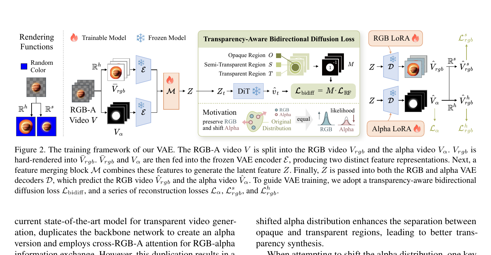
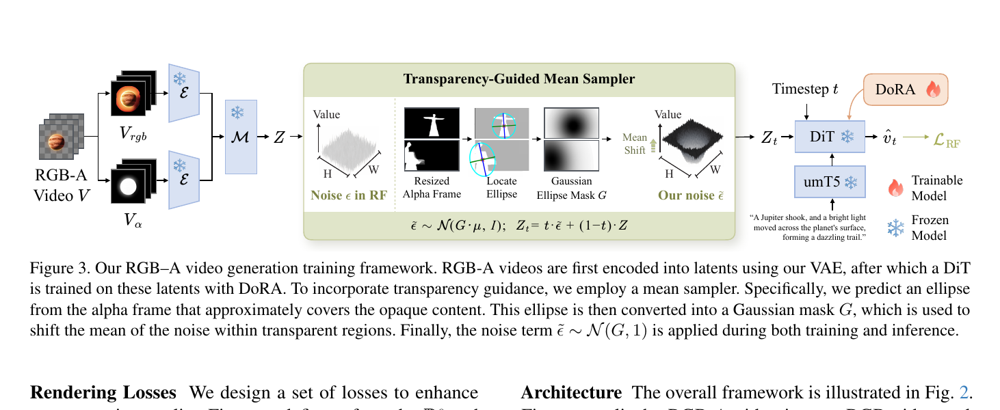
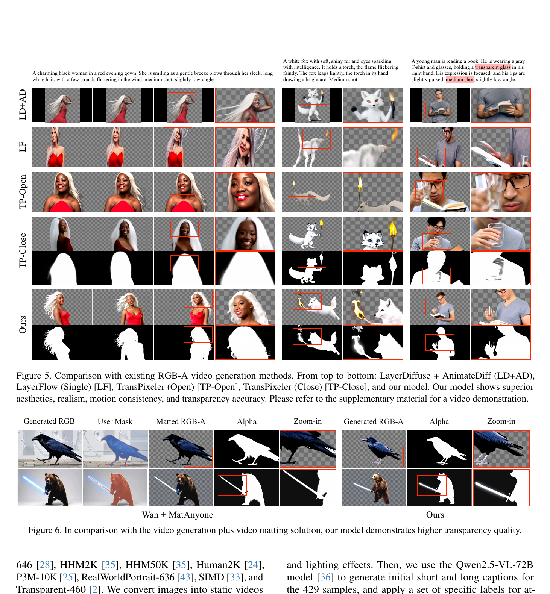
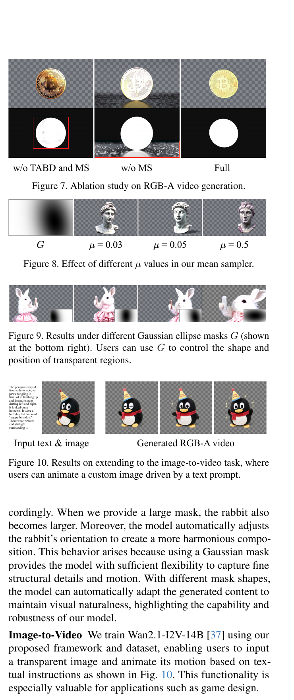

# Wan-Alpha: Video Generation with Stable Transparency via Shiftable RGB-A Distribution Learner

**论文**:Video Generation with Stable Transparency via Shiftable RGB-A Distribution Learner  
**作者**:Haotian Dong, Wenjing Wang, Chen Li, Jing Lyu, Di Lin (天津大学 + 腾讯)  
**代码**:https://github.com/tencent-ailab/Wan-Alpha (推测)  
**基础模型**:Wan2.1-T2V-14B

---

## 1. 一句话定位

在 latent 空间用双向扩散损失把 alpha 分布"推离" RGB 分布,在 noise 空间用 Gaussian 椭圆 mask 把 alpha 通道初始噪声的均值向透明区偏移,从而让冻结的 Wan-DiT 无需改架构就能生成高质量 RGB-A 视频。

---

## 2. 要解决的问题(动机)

RGB-A 视频生成的核心矛盾:alpha 通道和 RGB 通道**分布相似但语义对立**——RGB latent 对应不透明前景,alpha latent 也对不透明区域值大——导致 DiT 极难区分二者,生成时 alpha 容易"粘"着 RGB 分布不动。

| 问题 | 症状 |
|------|------|
| latent 空间纠缠 | VAE 把 alpha 压进和 RGB 相似的 latent,DiT 无法区分 |
| alpha 生成退化 | 生成的 alpha 要么全透明、要么不透明打洞 |
| 现有方案代价大 | TransPixeler 复制整个骨干网络 + 跨 RGB-A 注意力,32min/49帧/8FPS |

---

## 3. 与前作的关系

| 方法 | 策略 | 问题 |
|------|------|------|
| LayerDiffuse | 在 image 生成模型加 latent 透明度 | 无时序建模,不能做视频 |
| LayerFlow (Single) | 将 LayerDiffuse 移植到 I2V | 生成 RGB 质量下降 |
| TransPixeler | 双骨干 + 跨 RGB-A attention | 参数翻倍,15× 慢,RGB 能力降级 |
| **Wan-Alpha (ours)** | Shiftable Distribution:latent 推离 + noise 偏移 | 保留 RGB 骨干能力,参数几乎不增 |

核心 insight:不需要让 alpha 和 RGB 的 latent **分离到不同空间**,只需把 alpha distribution **向外移位**(shift),使 DiT 能区分。

---

## 4. 核心算法/方法

### 4.1 双流 VAE 与 Transparency-Aware Bidirectional Diffusion Loss



> **Fig 2 逐段解读**：
>
> **左侧输入与渲染函数**——输入是 RGB-A 视频 `V`,分离成 `V_rgb` 和 `V_α`。在送入 VAE encoder 之前,先对 RGB 做 hard rendering(随机选背景色,alpha 二值化):渲染后的 `V̄_rgb` 和 `V_α` 同时送入**冻结**的 VAE encoder `E`(雪花图标),产生两路特征表示。
>
> **Merge Block M**——trainable(火焰图标)。把 `E(V̄_rgb)` 和 `E(V_α)` 两路特征融合成统一 latent `Z`。这步是唯一需要训练的编码侧模块。
>
> **中央:Transparency-Aware Bidirectional Diffusion Loss**——将 `Z` 送入冻结 DiT(雪花),在不同像素位置施加正负反转的 flow matching loss。Mask `M` 把像素分三类:Opaque O(不透明,M=+1),Semi-Transparent S 和 Transparent T(M=-1)。最终 `L_bidiff = M · L_RF`——在不透明区正常最小化 RF loss,在非不透明区**反向最大化**,从而把 alpha 对应的 latent 推离 RGB 分布。右下角动机图:原分布中 RGB(蓝)和 Alpha(红)高度重叠 → 训练后 Alpha 分布被移到右侧,两者似然相等位置分开。
>
> **右侧双解码器**——同一个 `Z` 分别送入 RGB decoder(带 RGB LoRA,trainable)和 Alpha decoder(带 Alpha LoRA,trainable),分别重建 `V̂_rgb`(soft-render `V̂^s_rgb` 和 hard-render `V̂^h_rgb`)和 `V̂_α`。三路重建损失 `L_α`、`L^s_rgb`、`L^h_rgb` 加上 `L_bidiff` 共同训练 Merge Block M 和两套 LoRA decoder。

**VAE 总损失**:

$$
\mathcal{L}_{vae} = \mathcal{L}_\alpha + \mathcal{L}^s_{rgb} + \mathcal{L}^h_{rgb} + \mathcal{L}_{bidiff}
$$

每路重建损失 `L_recon` = L1 + VGG perceptual + Sobel edge-consistency:

$$
\mathcal{L}_{recon}(\hat{V}, V) = \lVert\hat{V} - V\rVert_1 + \mathcal{L}_\Phi + \mathcal{L}_s
$$

**为什么用冻结 DiT 做 VAE 训练信号**:DiT 本身携带关于"什么 latent 对它来说可区分"的先验;让 VAE latent 对 DiT 友好,是为了之后 DiT fine-tune 时 alpha 和 RGB 在 DiT feature space 已经可分。

### 4.2 Transparency-Guided Mean Sampler(noise 空间的 alpha 偏移)



> **Fig 3 逐段解读**：
>
> **左侧编码路径**——与 VAE 训练相同:RGB-A 视频 → 冻结 VAE encoder + Merge Block → latent `Z`。这里 VAE 已经训练好,Merge Block 也冻结。
>
> **中央:Transparency-Guided Mean Sampler**——训练时,标准 RF 的噪声 `ε ~ N(0, I)` 被替换为修正噪声 `ε̃`。流程:取 alpha 帧 → resize 到 latent 分辨率 → 二值化得到 hard alpha mask `B` → 用 `B` 覆盖区域的点集 `P` 拟合 Gaussian 椭圆 → 得到 Gaussian ellipse mask `G`(透明区值接近 1,不透明区值接近 0)→ 修正噪声 `ε̃ ~ N(G·μ, I)`,即在透明区域将噪声均值向 `μ` 偏移。加噪后 `Z_t = t·ε̃ + (1-t)·Z`。
>
> **右侧 DoRA 微调 DiT**——DiT(冻结骨干,DoRA 可训练)接收 noisy latent `Z_t`、timestep `t`、umT5 文本条件,输出速度场预测 `v̂_t`,计算标准 `L_RF`。DoRA 相比 LoRA 带来更好的文本对齐和生成质量。
>
> **推理时**:用户提供 Gaussian mask `G`(或由 alpha 帧自动生成),设置 `μ`(默认 0.05),从 `N(G·μ, I)` 采样初始噪声,然后正常跑 4 步(LightX2V)推理。

**Gaussian 椭圆 mask 构建**:

给定二值 alpha mask 上的点集 `P = {(x,y) | B(x,y) = 1}`,计算均值向量和协方差矩阵,做特征值分解 `Σ = VΛVᵀ`,得椭圆长短轴 `(a, b)` 和旋转角 `θ`。

$$
G(x, y) = \exp\!\left(-\frac{1}{2}\left[\left(\frac{x'}{a/2}\right)^2 + \left(\frac{y'}{b/2}\right)^2\right]\right)
$$

其中 `(x', y')` 是旋转对齐后的坐标。`G` 归一化到 `[0, 1]`,在椭圆外(透明区)接近 1,椭圆内(不透明区)接近 0。

修正噪声:

$$
\tilde{\varepsilon} \sim \mathcal{N}(G \cdot \mu,\; I)
$$

**📌 代码对应** (`wan/text2video_dora_lightx2v.py:generate_mask()`):
```python
gauss_mask_4d = gauss_mask.unsqueeze(1)
resized_4d = F.interpolate(gauss_mask_4d, size=(noise[0].shape[2], noise[0].shape[3]), ...)
noise[0] = noise[0] + (1 - gauss_mask) * alpha_shift_mean
```
注意代码里是 `(1 - gauss_mask)`——代码中 `gauss_mask` 在透明区为 0,不透明区为 1(和论文 G 定义相反),所以 `(1 - gauss_mask)` 才对应透明区权重,与论文等价。

---

## 5. 关键代码位置

| 功能 | 文件 | 行号 |
|------|------|------|
| 推理主类 `WanT2V_dora_lightx2v` | `wan/text2video_dora_lightx2v.py` | 1–478 |
| mean-shift noise 注入 | `wan/text2video_dora_lightx2v.py` | `generate_mask()` |
| Gaussian 椭圆 mask 生成 | `gen_gaussian_mask.py` | 全文 |
| VAE 双流解码器 LoRA merge | `wan/modules/vae.py:load_decoder_lora()` | — |
| DoRA 权重加载 | `wan/modules/model_dora_lightx2v.py:load_dora()` | — |
| VAE 训练主循环 | `Wan-Alpha-VAE-train/train_vae.py` | `training_step()` |
| 双向扩散 loss 的 mask 生成 | `Wan-Alpha-VAE-train/loss_mask_find_rgb_pha_3value_semi.py` | 全文 |
| Sobel edge loss | `Wan-Alpha-VAE-train/loss_tools.py` | `VideoSobelEdgeLoss` |

**VAE 训练中冻结 DiT 的接入** (`train_vae.py:training_step()`):
- 用 `WanVideoPipeline`(Wan 1.3B DiT)当作信号源
- 编码路径:`encode_simple(hard_rendered_RGB)` + `encode_simple(alpha)` → Merge Block → `merged_latents`
- T2V loss:`self.pipe.training_loss(**models, input_latents=merged_latents)` (此处 0.1× 权重)
- 解码路径:`vae_fgr.decode_simple(merged_latents)` → RGB,`vae_pha.decode_simple(merged_latents)` → alpha

**📌 Merge Block 架构** (`wan_video_vae_new.py:Mapping`):接受拼接后的 `[fgr_latents, pha_latents]` (共 32 维),通过全连接映射到 16 维 shared latent。

---

## 6. 关键配置项

| 参数 | 值 |
|------|----|
| 基础模型 | Wan2.1-T2V-14B |
| 分辨率 | 480×832 |
| 帧数 | 81帧,16FPS |
| 推理步数 | 4步(LightX2V) |
| VAE LoRA rank | 128 |
| DoRA rank | 32 |
| α shift mean `μ` | 0.05(默认) |
| VAE 训练迭代 | 75k iter,batch=2 |
| DiT 训练迭代 | 1750 iter,batch=8 |
| 训练数据 | 77,237 视频(含图像静帧转视频) |

---

## 7. 实验结果



> **Fig 5 逐行对比**：5 个方法 × 3 个 prompt(长发女性 / 白狐 / 戴眼镜男性读书),每列两行(RGB + alpha mask):
>
> - **LD+AD(LayerDiffuse + AnimateDiff)**：alpha 与 RGB 纠缠,戴眼镜 prompt 中无法生成玻璃透明效果;整体运动不自然。
> - **LF(LayerFlow)**：白狐 prompt 中狐狸消失,只剩背景;alpha 质量差。
> - **TP-Open(TransPixeler 开源版)**：眼镜透明度错误(玻璃应有轻微透明但生成为完全透明);alpha 轮廓尚可但细节模糊。
> - **TP-Close(TransPixeler 闭源)**：白狐 prompt 中 alpha 形状较好,但戴眼镜 prompt 中透明玻璃被错误生成为不透明(在人物前景故错判)。
> - **Ours**：长发的细丝状 alpha 准确、白狐的尾巴和耳朵轮廓清晰、眼镜框和镜片轻微透明。视觉自然度和透明度精度均最优。

**定量结果**(Table 1):

| 方法 | Text Align↑ | Aesthetic↑ | Naturalness↑ | Motion Smooth↑ | Temporal Flicker↑ |
|------|-------------|-----------|-------------|---------------|-----------------|
| LayerFlow | 2.67 | 0.535 | 2.35 | 0.9837 | 0.9788 |
| LD+AD | 3.15 | 0.617 | 3.03 | 0.9893 | 0.9853 |
| TransPixeler-Open | 3.16 | 0.570 | 2.97 | 0.9821 | 0.9872 |
| TransPixeler-Close | 3.45 | 0.573 | 3.07 | 0.9907 | 0.9822 |
| **Ours** | **4.00** | **0.649** | **3.19** | **0.9949** | **0.9941** |

所有指标全面领先。

**速度对比**:TransPixeler 需 32 分钟生成 49 帧(480×720,8 FPS);本方法 128 秒生成 81 帧(480×832,16 FPS),**快 15×**。

---

## 8. 消融实验



> **Fig 7(左上三列)**:硬币 prompt,比较三种配置:
> - **w/o TABD and MS**:无 bidirectional loss 和 mean sampler。alpha 中出现红色方框标注的"洞"——VAE 将 alpha latent 与 RGB latent 纠缠,DiT 无法清楚区分,产生不透明区误判为透明。
> - **w/o MS**:有 TABD 但无 mean sampler。alpha 轮廓改善,但背景仍不够干净,边界有噪声。
> - **Full**:alpha 准确,不透明区清晰白色圆形,背景完全黑色,无伪影。
>
> **Fig 8**:固定 Gaussian mask G(左1,黑白椭圆),改变 `μ`:0.03/0.05/0.5。`μ=0.03` 时控制效果弱;`μ=0.05` 时透明区清晰;`μ=0.5` 时引入红色偏色(噪声均值偏移过大,影响 RGB 分布)。
>
> **Fig 9**:改变 Gaussian mask G 的形状/位置,兔子在不同透明区域内生成,模型自动调整构图和朝向——证明 G 提供了空间透明度的可控信号而不是强约束。

---

## 9. 争议/权衡

**优点**:
- 推理架构与 Wan2.1 几乎相同,仅多 VAE decoder LoRA 和 DoRA,速度快 15×
- RGB 生成能力完全保留(因为骨干 DiT 和分布都没有破坏)
- Gaussian mask 给用户提供直觉可控的透明度位置控制

**弱点/局限**:
- VAE 训练用的是 Wan 1.3B 当 signal source(非 14B),存在 capacity gap
- DiT 只训练了 1750 iter,数据规模 77k(相比大规模视频数据较少),泛化边界不清
- `μ` 过大(如 0.5)会引入明显色偏,需要用户手调
- 评测指标均为 RGB 质量指标(VBench 系),无公认的 alpha 定量 benchmark;透明度正确性仅靠 user study
- Gaussian 椭圆是粗粒度近似,无法描述非凸/多目标透明区(如多人前景+半透明烟雾)

---

## 10. 一句话总结

不改 DiT 架构,在 latent 空间用 bidirectional loss 把 alpha 分布推离 RGB,在 noise 空间用 Gaussian 椭圆 mask 偏移初始噪声均值,让 Wan-14B 以 15× 更快速度生成可控 RGB-A 视频。

---

## Q&A

*(对话中产生的追问将持续追加至此处)*
