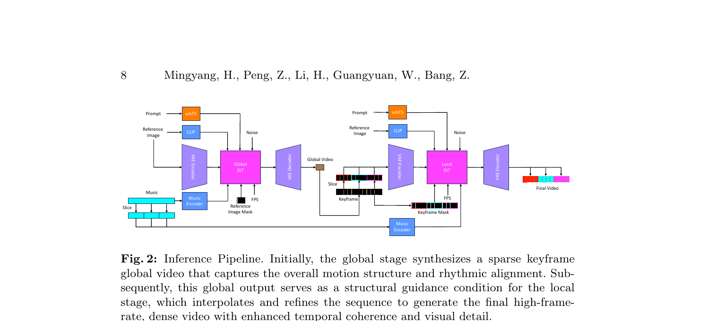
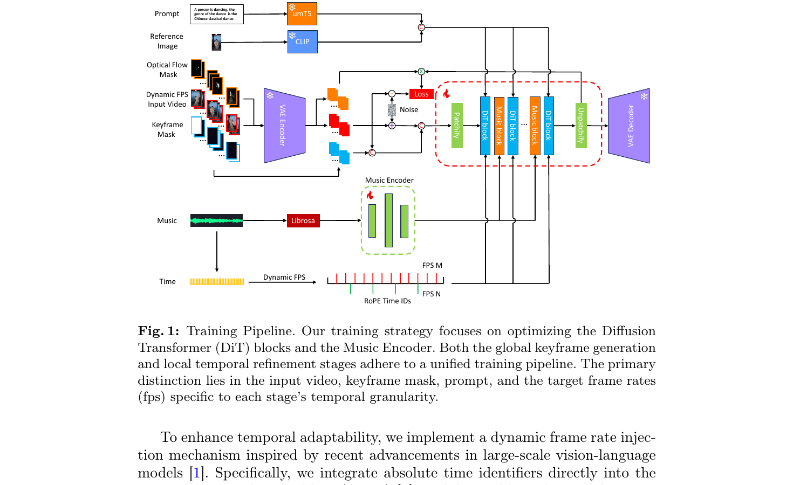
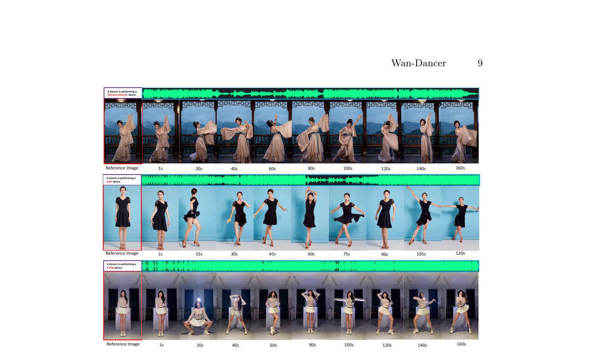
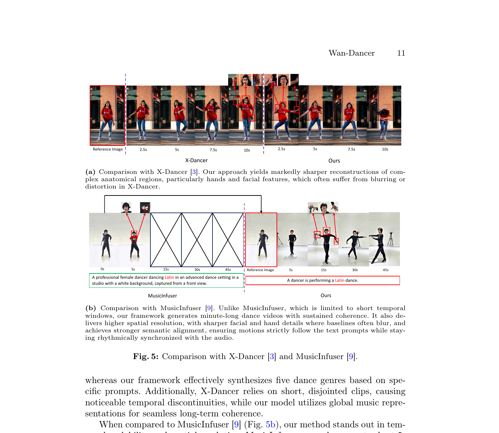

# Wan-Dancer: A Hierarchical Framework for Minute-scale Coherent Music-to-Dance Generation

**机构**: Tongyi Lab, Alibaba Group  
**作者**: Mingyang Huang, Peng Zhang, Li Hu, Guangyuan Wang, Bang Zhang  
**代码**: [GitHub](https://github.com/alibaba/Wan-Dancer) | **模型**: Wan-AI/Wan-Dancer-14B (HuggingFace)

---

## 1. 一句话定位

基于 Wan-I2V 的**分层 Global-to-Local 音乐驱动舞蹈视频生成**框架:全局 DiT 先用完整音乐上下文生成稀疏关键帧序列建立编舞骨架,局部 DiT 再以关键帧为锚并行精化每段 5 秒片段,配合 Dynamic FPS + 光流损失权重,突破 20 秒时长壁垒,实现 720p/30fps 单次生成超 1 分钟的高保真舞蹈视频。

---

## 2. 要解决的问题(动机)

现有视频扩散模型(Wan、HunyuanVideo、Seedance)受 self-attention 二次复杂度约束,时间窗口上限约 5~15 秒。音乐驱动舞蹈生成有两大范式,各有局限:

| 范式 | 代表工作 | 瓶颈 |
|------|---------|------|
| Music-to-Motion + 渲染(两阶段) | EDGE, LODGE, X-Dancer | 渲染伪影、clip 长度限制、高对 3D 估计误差依赖 |
| End-to-End 直接视频合成 | MusicInfuser, MVAA | 仅 5 秒窗口、身份漂移、时序不连贯、重复动作 |

核心矛盾:扩散模型在**短窗口**内质量高但全局一致性差;扩大窗口计算不可行。

---

## 3. 与前作的关系

- **Wan-I2V**: 直接 backbone,沿用 VAE、CLIP、umT5、DiT 架构;保持 Rectified Flow 训练范式
- **MusicInfuser**: 最相关 end-to-end 基线;Wan-Dancer 在时长(>1min vs 5s)、分辨率(720p vs 低分)、语义对齐(文本+音频 vs 纯音频)三个维度全面超越
- **X-Dancer**: 用 2D pose token 增强生成;Wan-Dancer 在手部/面部细节和无文本条件生成上优于它
- **FramePack/TempoMaster**: 也引入高级时序注意力但不专注音乐对齐

**关键 incremental claim**: 层级解耦(global context → local refinement)+ Dynamic FPS RoPE 时间映射,是在不修改单次 DiT 推理时长上限的前提下突破分钟级时长的核心技巧。

---

## 4. 核心算法/方法

### 4.1 统一训练框架与关键帧掩码

模型以 Wan-I2V 为 backbone,用一个**统一训练管线**同时支持 Global 和 Local 两个阶段。区分两阶段的机制是**关键帧掩码(keyframe mask)**,与 VAE latent 拼接作为额外通道输入 DiT:

| 训练阶段 | 关键帧掩码设置 | 目标 |
|---------|--------------|------|
| **Global Phase** | 全零(仅第 0 帧=1) | 学习从音乐+首帧出发的整体编舞规划 |
| **Local Phase** | 从序列中随机选若干位置置 1 | 学习在稀疏锚点之间精细插帧与短程动态 |

这一随机掩码策略使同一网络权重兼容两阶段任务。

### 4.2 多模态条件输入

```
Prompt        → umT5(512 tokens)  → c_txt
Reference     → CLIP              → c_ref
Music         → Librosa → Music Encoder → f_m (注入 DiT Music block)
Dynamic FPS   → 绝对时间 ID 注入 RoPE
Optical Flow  → SEA-RAFT → w_optical_flow (仅 Local 训练损失权重)
```

**Music Encoder**: 轻量级 encoder,输入 Librosa 提取的 35 维声学特征(1 onset strength + 20 MFCC + 12 chroma + 1 peak onehot + 1 beat onehot),输出注入 8 个 DiT 层(`layers = [0, 4, 8, 12, 16, 20, 24, 27]`)的 Music block。

### 4.3 Dynamic FPS 时间映射(关键创新)

全局阶段需要在固定 149 帧内表征不同时长的音乐(可达 160s),解法是**动态帧率**:

$$
\text{input\_fps} = \frac{30}{\lfloor N_{\text{music\_frames}} / 149 + 0.5 \rfloor}
$$

其中 `N_music_frames` 是 Librosa 提取的音频帧数。`input_fps` 被编码为绝对时间 ID 注入 **RoPE(Rotary Positional Embedding)** 模块,使模型精确感知帧间实际时间间隔,从而实现 3 fps~15 fps 的灵活采样而不破坏节拍对齐。

`input_fps` 也拼入文本 prompt:
```python
prompt += f"帧率是{input_fps}"  # gen_video_global.py:172
```

### 4.4 训练目标:带光流权重的 Rectified Flow

基于 Wan-I2V 的 RF 范式:

$$
x_t = t x_1 + (1-t) x_0, \quad v_t = x_1 - x_0
$$

$$
\mathcal{L} = \mathbb{E}_{x_0, x_1, c_{\text{ref}}, c_{\text{txt}}, f_m, t} \left\lVert \left(u(x_t, c_{\text{ref}}, c_{\text{txt}}, f_m, t;\theta) \odot w_{\text{optical\_flow}} - v_t\right) \right\rVert^2
$$

其中 `w_optical_flow` 是 **SEA-RAFT** 提取的光流 latent(经 VAE encoder 编码),仅在 Local 模型训练时施加。光流权重在快速运动区域(手部、肢体边缘)给予更高损失权重,抑制运动模糊和结构扭曲。

### 4.5 运动速度分层(Motion Speed Stratification)

数据集按 ViTPose 提取的关键点运动速度分三档:

| 速度档 | 占比 | 设计意图 |
|-------|------|---------|
| Slow  | 10% | 保留边界 |
| Medium| 80% | 拟合自然流畅舞蹈 |
| High  | 10% | 保留边界 |

通过 prompt 文本显式控制 `motion speed is slow/medium/high`。

### 4.6 推理流程(层级 Global-to-Local)



> Fig. 2: 左侧 Global DiT 先生成稀疏关键帧全局视频,右侧 Local DiT 以关键帧为锚并行精化各 5 秒片段,最终拼接为分钟级视频。

```
Step 1: Global Generation
  输入: music + prompt + ref_image + dynamic_fps
  输出: 149 帧稀疏关键帧视频(低 fps,enable_vae_decode_framewise=True)
  步数: 48 denoising steps

Step 2: Temporal Segmentation
  将 global 视频的帧均匀分配到若干段
  每段: 149 帧 clip,以相邻 keyframe 为首尾
  音频: 同步切为 5 秒片段

Step 3: Local Generation (并行)
  每段输入: 对应 5 秒音频 + prompt + ref_image + keyframes + keyframe_mask
  输出: 高帧率 149 帧 (30 fps = 5 秒) 精化视频
  步数: 24 denoising steps

Step 4: Final Assembly
  顺序拼接所有 local 视频片段 → 完整舞蹈视频
  叠加原始音频轨道
```

📌 **关键代码细节** (`gen_video_local.py:73-120`): `process_global_video_firstlastframe` 函数:从全局视频中按 `frame_interval_num = total_frames / N` 均匀采样 keyframe 索引,填入 149 帧 keyframe 列表;相邻 clip 共享边界帧以保证过渡连贯。

---

## 5. 关键代码位置

| 组件 | 文件 | 关键行 |
|------|------|--------|
| Global 推理主流程 | `gen_video/gen_video_global.py` | `gen_video()` L120-175 |
| Local 推理主流程 | `gen_video/gen_video_local.py` | `process()` L200-270 |
| Dynamic FPS 计算 | `gen_video/gen_video_global.py` | L168-172 |
| Keyframe mask 构建(Global) | `gen_video/gen_video_global.py` | L193-203 |
| Global 视频关键帧提取 | `gen_video/gen_video_local.py` | `process_global_video_firstlastframe()` L73-120 |
| Librosa 音频特征提取 | `gen_video/gen_video_global.py` | `get_music_base_feature()` L95-130 |
| Pipeline 模型加载 | `gen_video/gen_video_global.py` | `init_dit_model()` L61-90 |
| Music inject layers | shell args | `--music_inject_layers "0, 4, 8, 12, 16, 20, 24, 27"` |

---

## 6. 关键配置项

| 配置 | 值 | 来源 |
|------|----|------|
| Backbone | Wan-I2V | Paper §3.1 |
| 模型规模 | 14B (`Wan-Dancer-14B`) | HF 模型 ID |
| 全局视频帧数 | 149 (sparse, low fps) | `gen_video_global.py` |
| 局部视频帧数 | 149 (30 fps = 5s) | `gen_video_local.py` |
| 全局推理步数 | 48 | `gen_video_global.sh` |
| 局部推理步数 | 24 | `gen_video_local.sh` |
| CFG scale | 5 | both scripts |
| sigma shift | 5 | both scripts |
| 分辨率 | 1280×720 (竖屏) | args default |
| 预训练阶段 1 | 320×544, 128 A100, 20k steps, lr=1e-5 | Paper §4.1 |
| 预训练阶段 2 | 720p, 128 A100 + USP(degree=8), 4k steps, lr=1e-5 | Paper §4.1 |
| USP parallelism | ulysses_degree=world_size, ring_degree=1 | `init_dit_model()` |
| LoRA rank | 32 | Paper §4.1 |
| LoRA 训练 | 16 reference videos, 800 steps, lr=1e-4 | Paper §4.1 |
| 音频特征维度 | 35-dim (1+20+12+1+1) | `get_music_base_feature()` |
| 训练数据 | ~200 小时 proprietary 720p@30fps | Paper §4.1 |
| 舞蹈风格 | 5 类: 古典舞/K-Pop/拉丁舞/踢踏舞/街舞 | Dataset |
| 数据切割 | 5 秒 clips, 50% overlap | Paper §4.1 |
| 速度分层 | slow/medium/high = 10/80/10% | Paper §4.1 |

---

## 7. 实验结果

### Table 1: Dance Quality (VLM 评分, 1-10)

| Model | Modality | Style Alignment | Beat Alignment | Body Representation | Movement Realism | Choreography Complexity | Average |
|-------|----------|----------------|----------------|---------------------|-----------------|------------------------|---------|
| MusicInfuser | A+T | 7.43 | 7.26 | 4.76 | 6.89 | 4.80 | 6.23 |
| X-Dancer | A+I | 6.55 | 6.78 | 6.23 | 6.11 | 4.63 | 6.06 |
| **Wan-Dancer (Ours)** | **A+T+I** | **8.33** | **8.73** | **9.01** | **9.23** | **6.98** | **8.46** |

### Table 2: Video Quality

| Model | Imaging Quality | Aesthetic Quality | Overall Consistency | Average |
|-------|----------------|-------------------|---------------------|---------|
| MusicInfuser | 5.05 | 4.74 | 5.88 | 5.22 |
| X-Dancer | 5.23 | 6.05 | 7.48 | 6.23 |
| **Wan-Dancer** | **6.84** | **7.91** | **7.63** | **7.46** |

### Table 3: Prompt Alignment (vs MusicInfuser only, X-Dancer 无文本条件)

| Model | Style Capture | Creative Interpretation | Overall Satisfaction | Average |
|-------|--------------|------------------------|---------------------|---------|
| MusicInfuser | 5.01 | 7.48 | 7.33 | 6.61 |
| **Wan-Dancer** | **9.14** | **8.73** | **9.21** | **9.03** |

### 消融实验结论

| 组件 | 去掉后的影响 |
|------|------------|
| Global-to-Local 结构 | 无全局上下文 → 长视频身份漂移、片段跳变(Fig. 6a) |
| 光流损失权重 | 快速动作区域模糊、手部结构扭曲(Fig. 6b) |
| Dynamic FPS | 固定帧率 → 与音乐节奏错位或帧间运动幅度不自然 |
| 运动速度分层 | 高速模式 → 视觉伪影; 低速模式 → 节拍不对齐(Fig. 7b) |

---

## 8. 关键定性结果



> Fig. 1: 统一训练管线。Global 阶段 keyframe mask 仅首帧=1,Local 阶段随机选帧=1;Dynamic FPS 将绝对时间 ID 注入 RoPE,使全局稀疏采样与音乐时长精确对齐。



> Fig. 3: 三种舞蹈风格(古典舞/拉丁舞/K-Pop)的分钟级生成结果。古典舞可达 160s、拉丁舞 120s、K-Pop 160s,人物身份和服装细节在全程保持一致。



> Fig. 5a: 与 X-Dancer 对比——本方法手部和面部细节显著更锐利,无扭曲。Fig. 5b: 与 MusicInfuser 对比——MusicInfuser 仅能生成 5 秒且面部模糊,Wan-Dancer 生成 45s+ 且细节精准。

---

## 9. 争议/权衡

| 问题 | 分析 |
|------|------|
| **数据集私有** | 200 小时专有数据,刻意排除 AIST/Finedance 公开集,可复现性差 |
| **两次推理开销** | Global(48 步) + Local(N段 × 24 步)串行+并行,总推理成本大,需多卡 USP |
| **身份一致性有限** | 论文 Limitation 承认面部一致性不稳定,未加 face embedding 约束 |
| **单人舞蹈** | 不支持多人互动,Limitation 中列为 future work |
| **LoRA 依赖参考视频** | 定制模仿需要 16 个参考视频(同套编舞),数据收集成本高 |
| **Dynamic FPS 范围** | 实测 3~15 fps,过低 fps 帧间运动幅度大导致 local 插帧难度增加 |
| **对比 baseline 少** | 仅对比 X-Dancer 和 MusicInfuser,未与 FramePack 等长视频方案比较 |

---

## 10. 一句话总结

Wan-Dancer 的本质是用**层级解耦**绕开 DiT 时长约束:全局模型用动态帧率把整首音乐"压"进 149 帧的稀疏关键帧视频建立编舞骨架,局部模型再并行"展开"每 5 秒精化出高保真细节——Dynamic FPS RoPE 时间映射和光流损失权重是保证长程一致与局部质量的两个核心工程 trick。

---

## Q&A 占位符

> **Q: 全局阶段的 38 帧如何做到与任意时长音乐对齐?**  
> A: Dynamic FPS 机制将 `input_fps = 30 / round(N_music_frames / 149)` 编码进 RoPE 时间 ID,帧间间隔可从 1/30s 拉伸到 1/3s,使 149 帧覆盖任意时长。

> **Q: 局部阶段如何避免片段边界跳变?**  
> A: `process_global_video_firstlastframe` 让第 i 段最后一帧 = 第 i+1 段第一帧(全局 keyframe),keyframe_mask 在两端置 1,强制局部 DiT 同时条件化首尾帧。

> **Q: 为什么 Local 步数(24)只有 Global(48)的一半?**  
> A: Local 阶段已有强条件(keyframes 作为视觉锚),去噪难度更小;减半步数平衡了并行加速与质量的 tradeoff。
