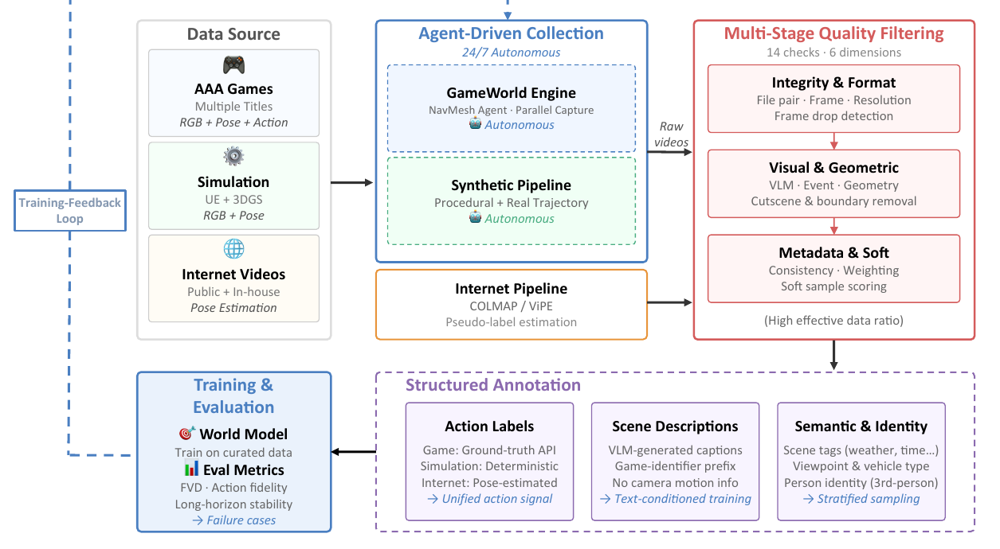
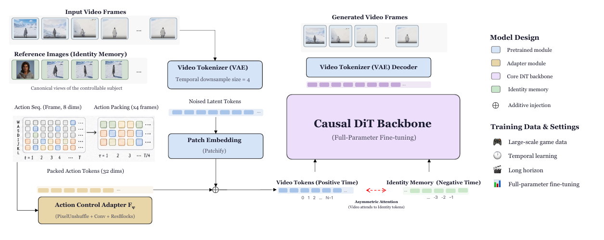
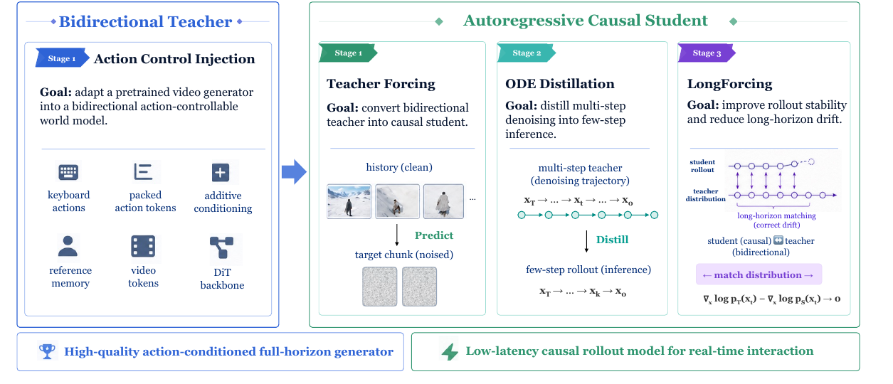
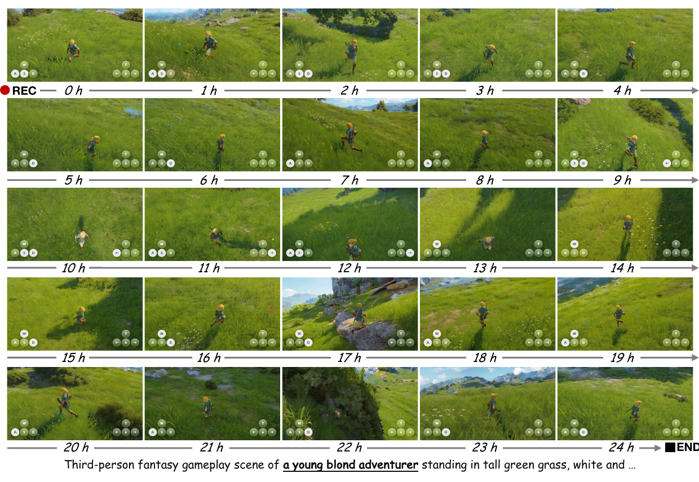
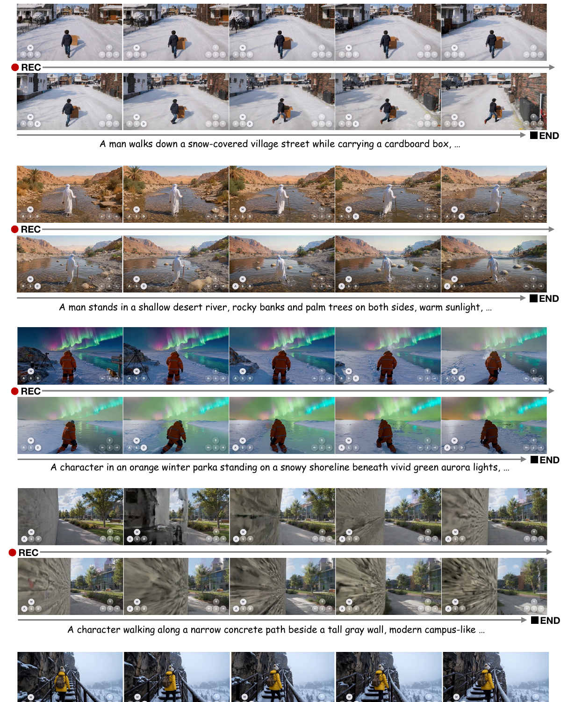

# ABot-World-0: Infinite Interactive World Rollout on a Single Desktop GPU

> ABot-World Team · **AMAP CV Lab, 阿里巴巴** · Technical Report, 2026-07  
> [arXiv:2607.19191](https://arxiv.org/abs/2607.19191)(2026-07-21) · [code](https://github.com/amap-cvlab/ABot-World)  
> Project Sponsors: Mu Xu, Ning Guo · 分 Foundation Model / Data / AI Infra / Benchmark / Engineering 五个 team

---

## 1. 一句话定位

**把交互式世界模型塞进一张消费级显卡——5B 模型在单张 RTX 5090 上以 720P、最高 16 FPS、1.2 秒响应延迟做无限时长的动作条件 rollout。**

三块拼在一起：**多源数据基建**（AAA 游戏 + UE/3DGS 仿真 + 互联网视频，由 WorldExplorer 做训练反馈驱动的闭环采集）、**渐进式双向→因果蒸馏**（Teacher Forcing → ODE Distillation → **LongForcing**）、**全栈推理协同设计**（LightVAE + 低比特 DiT + SageAttention2 + Fast-RoPE + 有界 KV cache + 显存感知调度）。

📌 **全文最有价值的一句判断**：**"few-step generation does not automatically translate into real-time interaction"（少步采样本身不等于实时交互）**。Table 2 用 OOM 行把这句话证明得很硬——只加快注意力核，整条流水线照样跑不起来。

⚠️ **但评测部分问题不小**（§6 详述）：**WorldRoamBench 是同一批作者做的**；Table 3 里 ABot-World-0 **没有一项是第一**；全文**唯一的消融是 LongForcing**，占据篇幅最大的数据基建**零量化证据、连语料规模都没给**；头条的 16 FPS 来自最激进的 MXFP4 量化，而其画质从未被评测。

📌 **与仓库的直接关联**：[H3-World](../h3world/analysis.md) 的训练数据 **ABot-World-Explorer-500h 就出自这里的 WorldExplorer**——两篇是同一套数据的上下游。

---

## 2. 要解决的问题

论文把交互式世界建模定位成**系统级问题而非单一生成目标**：视觉保真度仍然必要，但**可控性、状态持久性、rollout 稳定性、延迟、吞吐、显存占用必须联合优化**。

它列出四个**耦合**的瓶颈——注意是"耦合"，即单独解决任何一个都不够：

| 瓶颈 | 具体含义 |
|---|---|
| **① 数据** | 要拿到广覆盖、时序连贯、且**动作监督可靠**的数据 |
| **② 意图表示** | 用户意图要**同时覆盖相机导航和具身角色控制** |
| **③ 漂移** | 生成的历史会变成下一步的输入，**必须防止它漂走** |
| **④ 部署** | 整条生成+解码栈要在**实用硬件**上跑到交互速度 |

> 论文的原话很到位：**"A system can be strong on any one axis while remaining unusable as a local, persistent world simulator."**（一个系统可以在任一单轴上很强，却依然无法作为本地持久世界模拟器使用。）

**数据问题被单独强调**：被动的互联网视频有视觉多样性但**很少暴露同步的控制信号**；游戏录像有精确输入但**风格偏窄**；仿真有几何和可控性但**需要刻意设计轨迹**。三者是**互补而非可互换**的。

---

## 3. 数据基建

> **Fig 2 逐栏解读**：整张图被一条 **`Training-Feedback Loop`**（左侧蓝色虚线框）串成闭环。
>
> - **Data Source**（左）：🎮 `AAA Games`（Multiple Titles，RGB + Pose + Action）、⚙ `Simulation`（UE + 3DGS，RGB + Pose）、🌐 `Internet Videos`（Public + In-house，Pose Estimation）。
> - **Agent-Driven Collection**（中上，标 `24/7 Autonomous`）：`GameWorld Engine`（NavMesh Agent · Parallel Capture，🤖 Autonomous）、`Synthetic Pipeline`（Procedural + Real Trajectory，🤖 Autonomous），以及**单独一条橙框的 `Internet Pipeline`**（COLMAP / ViPE，Pseudo-label estimation）——**注意互联网这条不是 agent 驱动的**。
> - **Multi-Stage Quality Filtering**（右，红框，标 `14 checks · 6 dimensions`）：`Integrity & Format`（File pair · Frame · Resolution · Frame drop detection）→ `Visual & Geometric`（VLM · Event · Geometry · Cutscene & boundary removal）→ `Metadata & Soft`（Consistency · Weighting · Soft sample scoring），底下注 `(High effective data ratio)`。
> - **Structured Annotation**（下中，紫框）：`Action Labels`（Game: Ground-truth API / Simulation: Deterministic / Internet: Pose-estimated → **Unified action signal**）、`Scene Descriptions`（VLM-generated captions · Game-identifier prefix · **No camera motion info** → Text-conditioned training）、`Semantic & Identity`（Scene tags · Viewpoint & vehicle type · Person identity → Stratified sampling）。
> - **Training & Evaluation**（左下）：🎯 World Model + 📊 Eval Metrics（FVD · Action fidelity · Long-horizon stability）→ **`Failure cases` 回流到 Training-Feedback Loop**。

### 3.1 WorldExplorer：训练反馈驱动的闭环采集

论文先把三种采集范式的取舍摆清楚：

| 范式 | 优点 | 缺点 |
|---|---|---|
| **人工录制**（真人游玩） | 行为真实自然 | **可扩展性严重受限**、轨迹碎片化、人力成本高 |
| **规则脚本自动采集** | 连续运行、标注确定、边际成本低 | **被预定义脚本锁死**——无法自主发现新场景、无法按训练反馈调整、无法动态再平衡分布 |
| **Agent 驱动** | 目标导向探索、轨迹平滑、可规模化 | 易陷入**狭窄探索或 reward hacking**；**对被动消费的互联网视频根本不适用** |

WorldExplorer 是环境无关的模块化架构，四个组件：

**① Navigation Agent**——多阶段目标选择策略，**逐步放宽探索标准**：优先完全未探索区域 → 搜索邻近区域 → 带碰撞检测的前向移动兜底。适用于**任何有 navmesh 的虚拟环境**，无论是在线游戏世界还是重建的 3DGS 场景。

**② Parallel Capture Pipeline**——视频帧、相机参数（位置/旋转/FOV/焦距）、控制输入、环境状态、元数据**并行采集**，用毫秒级时间戳同步，**30 FPS 下跨模态对齐误差 < 33 ms**（即小于一帧）。

**③ Task Template System**——采集组织成结构化任务类别：标准导航、自由探索、地标聚焦观察、**长尾场景定向覆盖**。场景配置在地理、天气、时段、交通密度、视角模式、载具类型多个维度上参数化。

**④ Training-Feedback-Driven Closed-Loop**——📌 **这是 WorldExplorer 最有辨识度的设计**。不用固定采集比例，而是：训练监控模块持续跟踪**逐类别**性能指标 → 弱点诊断组件通过**跨维度打分识别表现不佳的"场景-动作"组合** → 自适应策略生成器更新采集比例，**同时维持最低覆盖下限防止灾难性遗忘** → agent 通过加权任务模板选择和实时场景参数调整来响应。

> 完整闭环：**训练反馈 → 弱点诊断 → 策略自适应 → agent 定向生产**，全程无需人工介入。论文把这称为**从被动批处理变成主动的智能伺服系统（active intelligent servo system）**。

### 3.2 三类数据源的具体做法

| 源 | 动作标注方式 | 特点 |
|---|---|---|
| **AAA 游戏**（主要、最大） | **直接从游戏 runtime API 抓取原生控制信号**，与每帧同步，ground-truth 精度 | 1920×1080，多个 AAA 标题跨开放世界探索/城市驾驶/骑马穿行；**天然覆盖第一与第三人称**；**无 pose 估计的标签噪声**，是语料中质量最高的监督信号 |
| **仿真引擎** | 由设计轨迹**确定性导出**——把平移与旋转位移**投影到相机基向量并二值化** | 两个后端：**UE**（可控光照渲染）+ **3DGS（ABot-3DGS）**。后者从多视图影像重建，可选接受 **LiDAR 和摄影测量点云**作几何先验，应用于**自有的街道航拍与街景扫描数据**（非公开资产）。轨迹有两种：程序化路径生成 / **真实设备轨迹导入**（保留反复扫视、手持抖动等真实浏览行为），渲染前先做碰撞检测 |
| **互联网视频** | **pose 估计伪标签**——按室内外/动静/纹理丰富度选择估计方法，再做同样的投影+阈值二值化 | 驾驶记录、citywalk、航拍。⚠️ **带估计噪声**，但引入自然相机动态、真实光照变化和域泛化信号 |

**三者最终产出同一套 canonical action 表示**，供统一训练。

### 3.3 质量过滤：14 项检查 / 6 个维度

六个维度是：**① 文件完整性 ② 视觉有效性 ③ 几何一致性 ④ 游戏状态正确性 ⑤ 动作标签对齐 ⑥ 元数据质量**。三阶段渐进执行，**早期格式校验先做，好在昂贵分析之前快速拒绝**。

| 阶段 | 内容 | 处理方式 |
|---|---|---|
| **Stage 1 文件完整性** | 文件配对存在性、帧数一致性、分辨率合规、丢帧检测 | **clip 级直接拒绝** |
| **Stage 2 视觉/几何/游戏状态** | VLM 筛查（UI 覆盖、加载屏、弹窗、渲染异常）；几何异常检测（**垂直位移跳变查地形穿模**、相机穿物分析）；游戏状态信号处理（**死亡序列切除**、过场动画与地图边界移除）；动作标签对齐校验 | 拒绝；**第三人称角色可见性只做标记不拒绝**，留给下游加权 |
| **Stage 3 元数据质量** | 动作-位姿一致性分数、屏幕色偏标志 | 📌 **软信号**——用于训练时样本加权和课程调度，**不做硬拒绝**，让模型仍能从"不完美但有信息量"的样本中学习 |

### 3.4 标注

- **动作标签**：三源各自机制 → 统一 canonical 格式。
- **场景描述**：VLM 生成结构化自然语言，覆盖场景构成、环境特征、天气光照、显著动态事件。📌 **刻意省略相机运动信息**——理由是**把运动控制与场景生成解耦，防止模型把文本描述和相机轨迹信号混为一谈**。游戏数据的 caption **前缀一个 game identifier token**，让模型学到各作品的视觉风格与渲染约定。
- **语义标签**：室内外、城乡、建筑类型、天气、时段、载具类型、视角模式 → 用于**分层采样**。
- **人物身份**：从第三人称 clip 里挑角色清晰无遮挡的帧，按**相机-角色相对角度裁出四个基本朝向（正/背/左侧/右侧）的人物缩略图**，再通过**基于图像的面部补全合成一张标准正面肖像**作为身份参考。

---

## 4. 模型与训练

### 4.1 问题形式化

$$
p_\theta\big(v_{t:t+L-1} \mid v_{0:t-1},\, a_{t:t+L-1},\, c\big)
$$

`v_{0:t−1}` 是视觉历史，`a_{t:t+L−1}` 是未来动作序列，`c` 是多模态条件（文本 prompt + 参考图像），`L` 是 chunk 长度。**迭代预测并追加 chunk 即可自回归 rollout 任意长度。**

训练分两相：

**① 双向 teacher**（全时域联合生成，给出高质量的动作条件动力学目标）：

$$
p^{\mathrm{bi}}_\phi\big(v_{1:T} \mid v_0,\, a_{1:T},\, c\big)
$$

**② 因果 student**（只用过去，匹配在线 rollout 设定）：

$$
p^{\mathrm{causal}}_\theta\big(v_{t:t+L-1} \mid v_{0:t-1},\, a_{t:t+L-1},\, c\big)
$$

### 4.2 动作注入：原始键盘输入作为唯一控制接口

> **Fig 4 逐区域解读**：
>
> - **左上 `Input Video Frames`**（雪地里的人物）→ **`Video Tokenizer (VAE)`**（标注 `Temporal downsample size = 4`）→ `Noised Latent Tokens`。
> - **左侧 `Reference Images (Identity Memory)`**——一排绿框缩略图，下标 `Canonical views of the controllable subject`。**第一张是正面人脸特写**（合成的标准肖像），后面几张是不同朝向。
> - **左下 `Action Seq. (Frame, 8 dims)`**——一个网格，**纵轴标着 W A S D I J K L 八个键**，横轴是 `t = 1, 2, 3, 4 … T`；经 **`Action Packing (x4 frames)`** 变成 `τ = 1, 2, 3 … T/4`，得到 **`Packed Action Tokens (32 dims)`**。
> - 这些 token 过 **`Action Control Adapter F_ψ`**（黄框，`PixelUnshuffle + Conv + ResBlocks`），与 `Patch Embedding (Patchify)` 的输出在 **⊕（Additive injection）** 处相加。
> - 中间紫色大框是 **`Causal DiT Backbone`**，标注 `(Full-Parameter Fine-tuning)`。
> - **底部是位置编码的关键**：`Video Tokens (Positive Time)` 标着 `0 1 2 … N−1`，`Identity Memory (Negative Time)` 标着 `… −3 −2 −1`，中间一条**红色虚线双箭头**标 **`Asymmetric Attention (Video attends to Identity tokens)`**。
> - 右侧图例：`Model Design`（Pretrained module / Adapter module / Core DiT backbone / Identity memory / ⊕ Additive injection）与 `Training Data & Settings`（🎮 Large-scale game data / 🕐 Temporal learning / 🎬 Long horizon / 📊 Full-parameter fine-tuning）。

**底座是 Wan2.2**，通过**全参数微调**注入动作控制和参考图像。

每帧动作是 **8 维 multi-hot 向量**，对应 8 个离散键：**W/A/S/D 管角色或相机移动，I/J/K/L 管相机旋转**。

$$
a_{1:T} = \{a_1, \dots, a_T\}, \qquad a_t \in \{0,1\}^8
$$

为了匹配 video tokenizer 的时间压缩（**VAE temporal patch size = 4**），把连续 4 帧的动作**沿通道维打包**：

$$
\tilde{a}_\tau = \mathrm{Concat}\big(a_{4\tau-3},\, a_{4\tau-2},\, a_{4\tau-1},\, a_{4\tau}\big), \qquad \tilde{a}_\tau \in \{0,1\}^{32}
$$

于是**每个时间动作 token 维度 8 × 4 = 32，与 VAE 压缩后的一个 latent frame 严格对齐**。

**Action Control Adapter `F_ψ`** 采用相机 adapter 架构：**PixelUnshuffle**（下采样因子取成与 VAE 空间压缩比一致）→ **卷积层**（kernel size 和 stride 都设为 DiT 的 spatial patch size）→ **残差卷积块**。这样 adapter 输出与 DiT patchify 后的 latent token **严格对齐时空分辨率**：

$$
\hat{z} = \mathrm{PatchEmbed}(z) + \mathcal{F}_\psi(\tilde{a}_{1:T/4})
$$

📌 **全模型统一采用 patchify 阶段的 additive injection**。论文在 §6 给出理由：**键盘输入是离散的、与视频时间对齐的、直接反映用户意图的显式控制信号；对这类信号，加性注入既提供可靠控制又保住预训练视觉先验**。更复杂的条件机制留给**模糊信号**（latent action、连续相机轨迹、语义指令）。

### 4.3 身份保持：负时间 RoPE + 非对称注意力

长时第三人称 rollout 会出现**身份漂移**——运动动力学保住了，角色外观却逐渐偏离。解法：

1. 参考图像**用同一个 VAE 编码**成 identity-memory token，**prepend 到视频 token 序列前**；
2. **给 memory token 分配固定的负时间 RoPE 索引**，视频 token 用非负索引——**把静态身份信息与生成轨迹在位置空间上分开**；
3. **非对称 memory–video 注意力**：**视频 token 可以读 memory token，memory token 完全读不到视频 token**。

📌 **三步都很便宜**：不加新模块、不改位置编码方案、不引入可训练路由。而"memory 单向隔离"保证了**身份参考在整个 rollout 中不被生成内容污染**。

### 4.4 三阶段渐进蒸馏

> **Fig 3 逐格解读**：左侧蓝框 **Bidirectional Teacher**，右侧绿框 **Autoregressive Causal Student**（含三个 Stage），底部两个总结条。
>
> - **Bidirectional Teacher / Stage 1 `Action Control Injection`**——Goal: *adapt a pretrained video generator into a bidirectional action-controllable world model.* 六个图标：`keyboard actions` / `packed action tokens` / `additive conditioning` / `reference memory` / `video tokens` / `DiT backbone`。
> - **Student Stage 1 `Teacher Forcing`**——Goal: *convert bidirectional teacher into causal student.* 图示上方是 **`history (clean)`**（三张雪地实拍帧），下方箭头标 **`Predict`** 指向 **`target chunk (noised)`**（两块灰噪声）。
> - **Student Stage 2 `ODE Distillation`**——Goal: *distill multi-step denoising into few-step inference.* 上方 `multi-step teacher (denoising trajectory)` 画着 `x_T → … → x_t → … → x_0` 一长串绿色节点，箭头标 **`Distill`**，下方 `few-step rollout (inference)` 只剩 `x_T → … → x_k → x_0` 寥寥几个节点。
> - **Student Stage 3 `LongForcing`**——Goal: *improve rollout stability and reduce long-horizon drift.* 上排 `student rollout`、下排 `teacher distribution` 两串节点之间用紫色竖箭头连成 **`long-horizon matching (correct drift)`**，底下写 `student (causal) ↔ teacher (bidirectional)`、`← match distribution →`，以及公式 **`∇_x log p_T(x_t) − ∇_x log p_S(x_t) → 0`**。
> - **底部总结条**：左 🏆 `High-quality action-conditioned full-horizon generator`，右 ⚡ `Low-latency causal rollout model for real-time interaction`。

**Stage 1: Teacher Forcing。** 不从零训 student，而是**从训好的双向 teacher 初始化**，通过因果训练目标和注意力掩码适配。历史帧提供为**干净的 ground-truth latent**，目标 chunk 按扩散过程加噪；因果注意力掩码禁止访问历史之外的未来视觉上下文，**匹配自回归推理所需的信息结构**。

**Stage 2: ODE Distillation。** 关键要求是**参考模型与蒸馏模型遵循同一因果分解**。冻结 Stage 1 的因果扩散模型 `θ_c`，两者条件在同一因果上下文上：

$$
C_t = \big(v_{0:t-1},\, a_{t:t+L-1},\, c\big)
$$

$$
z^c_0 = \Phi_{\theta_c,\, s\to 0}\big(z^c_s;\, C_t\big)
$$

$$
\mathcal{L}_{\mathrm{ODE}} = \mathbb{E}_{s,\, z^c_s,\, C_t}\Big[\big\lVert f_\theta(z^c_s, s, C_t) - \mathrm{sg}(z^c_0)\big\rVert_2^2\Big]
$$

📌 **两个性质值得记**：① 中间 latent 与其端点来自**同一条因果 ODE 轨迹、同一套条件**，因此对每个自回归预测步定义了**一致的 flow map**；② **蒸馏目标只依赖部署时可得的因果上下文，不需要未来视觉观测**。

**Stage 3: LongForcing。** 这是本文命名的核心贡献。

> **问题**：每步预测都以先前生成的帧为条件，**小的分布误差会累积**，把 rollout 逐渐推向**训练时极少遇到的长时 student-rollout 上下文**；这些上下文得到的分布匹配监督很有限，于是 rollout 分布慢慢偏离期望的世界动力学。

**做法**：在最终的 **DMD** 阶段，**在 student 自己生成的长 rollout 轨迹上训练，并用一个"延长时域的 teacher"提供分布级的纠正监督**。

📌 **与 ODE Distillation 的分工要分清**：ODE 蒸馏学的是**固定因果条件下的 clean-endpoint flow map**（局部转移）；LongForcing 对齐的是 **长时条件视频分布**（全局分布）。论文的核心洞察是：**长时稳定性不只取决于局部转移是否准确，还取决于闭环 rollout 分布是否停留在 teacher 监督覆盖的时域区间内。**

---

## 5. 部署与实验

### 5.1 全栈推理协同设计

论文的立场：**少步蒸馏大幅降低了每步去噪成本，但本身不足以在单张消费级 GPU 上交付实时交互**。去噪预算被压缩后，**主导瓶颈转移到** chunk 级 latent 解码、transformer 计算、注意力与位置编码开销、上下文显存流量、以及运行时模型驻留。

| 组件 | 做法 |
|---|---|
| **LightVAE** | 受 **TAEHV** 启发，简化并裁剪 decoder 架构。📌 **因为完整 latent chunk 必须解码完才能交付给流式运行时，所以缩短 chunk 解码时间直接降低 action-to-first-frame 延迟** |
| **显存感知调度** | 受 **FramePack** 的模块交换启发——模块按执行顺序和显存需求分阶段驻留，**不要求所有组件同时在 GPU 上** |
| **Fast-RoPE** | 在局部注意力窗口内**重新锚定时间 RoPE**，避免随 rollout 推进反复在完整可见上下文上计算；另配 **Triton RoPE kernel** |
| **低比特 DiT** | 参照 **LightX2V**。**FP8 为默认的质量导向工作点**；只量化 DiT 骨干的计算密集线性层，**VAE 和 text encoder 保持高精度** |
| **SageAttention2** | 高效注意力后端，无需重训或改架构 |
| **有界 KV cache** | 滚动淘汰的**有界局部上下文 cache**，使 cache 占用**与总 rollout 时长无关**；另探索 KV cache 量化 |

**Table 1 部署包络**（单张 RTX 5090，batch 1，**1280 × 704**，chunk-wise streaming）：**最高 16 FPS**、**action-to-first-frame 延迟 1.2 s**、**峰值显存 ≤ 19.3 GiB**。

> 📌 **延迟定义写得很严谨**：*"the wall-clock time from a user keypress until the corresponding inference chunk has been decoded and its first response frame becomes available"*——**从按键到首个解码响应帧可用的完整墙钟时间，而不是孤立地报采样速度**。

**Table 2 系统级拆解**（每个推理 chunk = **3 个 latent frame → 12 个解码视频帧**）：

| 配置 | DiT (ms/chunk) | VAE (ms/chunk) | FPS↑ | VRAM (GiB)↓ |
|---|---|---|---|---|
| Base | — | — | **OOM** | **OOM** |
| + SageAttention2 | — | — | **OOM** | **OOM** |
| + SageAttention2 + LightVAE | 1191.081 | 78.276 | 9.117 | 20.491 |
| + SageAttention2 + LightVAE + **FP8** | 845.180 | 75.980 | 12.405 | **15.925** |
| + … + FP8 + **Fast-RoPE** | 786.871 | 71.730 | 13.269 | 19.281 |
| + … + **MXFP6** + Fast-RoPE | 718.281 | 85.994 | 14.098 | 18.287 |
| + … + **MXFP4** + Fast-RoPE | **638.843** | 72.957 | **15.831** | 17.148 |

**这张表是全文最有信息量的实验**，三个读点：

1. **Base 和"只加 SageAttention2"两行都 OOM** —— **单靠更快的注意力核完全不足以让整条高分辨率流水线在单卡上跑起来**。显存可行性需要 transformer 执行、视频解码、数值精度、运行时驻留的**联合优化**。
2. **LightVAE 带来第一个可行配置**（9.117 FPS / 20.491 GiB）—— 说明**原始 VAE 才是显存可行性的关键瓶颈**。
3. **FP8 是收益最大的单步**：DiT 时间 1191 → 845 ms，吞吐 9.117 → 12.405 FPS，显存 20.491 → 15.925 GiB。

### 5.2 WorldRoamBench（Table 3）

| 模型 | 参数 | Strict Acc. | Partial Acc. | Traj. Score | Aesthetic | Imaging | Mechanics | Memory |
|---|---|---|---|---|---|---|---|---|
| Genie 3 | — | 0.4700 | 0.6608 | 0.6719 | 0.4711 | **0.4757** | **0.5454** | 0.6073 |
| HappyOyster | — | **0.5317** | **0.7631** | **0.7737** | **0.5235** | 0.4377 | 0.5395 | **0.6309** |
| LingBot-World | 14B | 0.3235 | 0.4198 | 0.4094 | 0.2898 | 0.2875 | 0.2777 | 0.3006 |
| HY-World 1.5 | 8.3B | 0.1640 | 0.2088 | 0.2015 | 0.1400 | 0.1236 | 0.1115 | 0.1562 |
| **ABot-World-0** | **5B** | 0.5266 | 0.7290 | 0.6752 | 0.5039 | 0.4651 | 0.5223 | 0.5041 |

⚠️ **ABot-World-0 在七个维度上一项第一都没有**。它在 Strict Acc / Partial Acc / Traj / Aesthetic / Imaging / Mechanics 上是第二，**在 Memory 上只排第三**（0.5041，落后 HappyOyster 的 0.6309 和 Genie 3 的 0.6073）。论文对此的表述是含糊的一句 *"achieves strong action fidelity, trajectory following, visual quality, physical mechanics, and memory scores"*。

### 5.3 LongForcing 消融（Fig 10）——全文唯一的消融

> **Fig 10 逐面板解读**：四个子图，横轴统一是 **Time (s)，0–60**，灰虚线 = Causal-Forcing 风格基线，**蓝实线 = LongForcing**。两个变体**都**在 student 自 rollout 的历史上训练、**都**在最终阶段用 DMD——**唯一差别是 LongForcing 用了延长时域的 teacher 监督**。
>
> - **(a) HPSv3 美学分（越高越好）**：两条线都从约 8 起步下滑。**灰线在约 15 s 后掉到 2 附近并长期低位徘徊**；**蓝线在 15–45 s 区间维持在 5–7**，45 s 后有一次跌到 2 的尖峰随后回升到 6。
> - **(b) 高饱和像素比（越低越好）**：**灰线从 25 s 起持续攀升**，60 s 时冲到约 0.007；蓝线全程压在 0.001–0.002，仅末尾略升。
> - **(c) 感知模糊分（越低越好）**：**灰线从 15 s 起爬升，30–60 s 稳定在 0.32–0.34 的高位**；蓝线全程在 0.26–0.30。
> - **(d) Patch 重复率（越低越好）**：蓝线在开头 2 s 有一个 1.2 的尖峰，随后基本贴地；**灰线从 25 s 起爬升到 2.0 附近并维持到 55 s**。
>
> 📌 **四张图的共同结构**：**差距在 rollout 后半段才拉开**——大约 **15–25 秒之后**。这正好印证了 LongForcing 的动机：短时域监督覆盖不到的区间才是问题所在。
>
> ⚠️ **但也要注意**：**蓝线自己也在下滑**（HPSv3 从 8 掉到 5–6，45 s 处还有一次深跌）。LongForcing **减缓**了退化，**没有消除**它。

### 5.4 长时与定性

> **Fig 6 解读**：两个 24 小时 rollout，按 `0h, 1h, … 24h` 的时间戳采样关键帧。上组是"金发少年冒险者站在高草丛中"，下组是"白发剑客沿陡峭草坡移动"。
>
> **论文的宣称是克制的**：*"sampled checkpoints retain recognizable scene structure and active motion"*（采样检查点保住了**可辨识的**场景结构和活跃运动）。
>
> ⚠️ **但按图核对，这个宣称的分量有限**：
> - **整个 24 小时基本停留在同一个生物群系**——上组从头到尾是绿色草坡，下组是草坡+树林。看不到"世界持续演化"，更像是**在同一类场景里持续漫游**。
> - **若干检查点画质明显劣化**：上组 13 h、17 h 的帧发灰发糊；下组 10 h 那格几乎全暗。
> - 论文说的是"无可观测的坍塌"，这与"长时保持高质量"是**两个不同强度的主张**。

> **Fig 9 逐行解读**：五个案例，每个用 REC→END 的两行帧条展示。
>
> | 行 | 场景 | 宣称的物理效应 | 我的核对 |
> |---|---|---|---|
> | 1 | 雪村街道搬纸箱的人 | **物体碰撞**——把纸箱推开 | ✅ 箱子确实在人物移动后位移 |
> | 2 | 沙漠浅河中的人 | **水面痕迹**——脚步引起时序一致的扰动 | ✅ 水面涟漪随脚步出现 |
> | 3 | 极光下雪地里的橙衣人 | **雪地脚印持久留存** | ✅ 后续帧能看到留下的痕迹 |
> | 4 | 灰墙旁窄混凝土路 | **第一人称移动被墙挡住** | ⚠️ **中段几帧塌成一片平坦无纹理的灰面**——很难区分"正确地被墙挡住"和"退化成纹理噪声" |
> | 5 | 雪山中攀爬金属楼梯 | **与栏杆碰撞而不穿模** | ✅ 人物沿楼梯移动，未见穿透 |
>
> 📌 论文自己的定位是恰当的：这些效应**不是由动作标签指定的**，模型也**没有被显式训练符号化物理规则或真实碰撞标注**，它们是从大规模交互视频经验中涌现的。**作为"涌现的合理物理响应"的证据是成立的；作为"物理正确性"的证据则不够。**

---

## 6. 争议与权衡

**① WorldRoamBench 是同一批作者做的。** 参考文献 [84] 的作者列表——Ting-Bing Xu、Jiacheng Sui、Zhe Gao、Wenjin Yang、Zhicheng Liu、Zhaoxu Sun、Mingchao Sun、Hongyu Pan、Fan Jiang、**Mu Xu**——与 ABot-World-0 的贡献者名单**大面积重合**（Benchmark Team 五人全部在列，Foundation Model Team 的 Fan Jiang、Zhaoxu Sun，Data Team 的 Hongyu Pan、Mingchao Sun，以及 Project Sponsor Mu Xu）。**论文正文完全没有披露这层关系。** 这是全文最需要打折的地方。

**② 唯一的量化对手里，两个"开源大模型"分数低到反常。** LingBot-World(14B) 和 HY-World 1.5(8.3B) 的分数在 0.11–0.42 区间，**比 ABot-World-0 低 40%–75%**。这种量级的差距通常意味着**评测协议或配置适配有问题**，而非真实能力差距。**论文没有说明这两个模型是如何接入 benchmark 的**。而真正打得过 ABot-World-0 的两个（Genie 3、HappyOyster）**都没有公布参数量**，所以"5B 打赢更大的模型"这个隐含叙事**只在那两个可疑的低分对照上成立**。

**③ HappyOyster 也是阿里巴巴自家产品。** 参考文献 [85] 是 Alibaba Cloud Blog。它在七项里赢了五项。论文没有讨论"同公司的另一个产品全面领先自己"意味着什么。

**④ 数据基建是贡献 #2，却零量化证据。** 占了整整一节（§3，全文最长）的内容，包括 WorldExplorer 的训练反馈闭环、14 项检查、能力分类——**没有任何一条有对照实验**：
- 训练反馈闭环 vs 固定采集比例，模型效果差多少？**没测。**
- 14 项检查提升的"effective data ratio"是多少？**声称 "maximize the effective data ratio" 但没给数字。**
- 三个数据源各自的边际贡献？**没有 source ablation。**
- 软加权（Stage 3 元数据）vs 硬拒绝？**没测。**

**⑤ 全文没有任何语料规模数字。** 多少小时？多少 clip？多少个 AAA 标题？**一个都没有。** 讽刺的是，**这个数字要从引用它的 [H3-World](../h3world/analysis.md) 那里才能间接看到**——后者把数据集称作 **ABot-World-Explorer-500h**（500 小时）。一份以数据基建为头号卖点的报告不报数据量，很不寻常。

**⑥ 头条的 16 FPS 与被评测的模型很可能不是同一个配置。** Table 2 里 **15.831 FPS 来自最激进的 MXFP4**，而论文明说 **FP8 才是"默认的质量导向工作点"**（12.405 FPS）。**MXFP4/MXFP6 的画质从未被评测**——没有任何"量化格式 vs WorldRoamBench 分数"的表。所以"720P 16 FPS"和"WorldRoamBench 上有竞争力"这两句话**大概率描述的是两个不同的模型配置**。论文用"operating envelope（工作包络）"这个词把两者含糊地并置了。

**⑦ Table 2 的峰值显存非单调且未获解释。** FP8 是 15.925 GiB，**加上 Fast-RoPE 反而涨到 19.281 GiB**（+3.4 GiB）。论文只说了一句"峰值显存由完整运行时配置决定，而非单个算子的成本"，**没有解释为什么一个位置编码优化会多花 3.4 GiB**。这个反常在一张主打系统优化的表里很扎眼。

**⑧ 60 秒（量化）到 24 小时（关键帧条）之间差了 1440 倍。** 唯一的长时量化证据是 Fig 10 的 **60 秒** rollout；而"hour-scale / day-scale"的宣称**只有关键帧图**，没有任何指标。而且 Fig 10 显示**LongForcing 自己在 60 秒内也在退化**（HPSv3 从 8 掉到 5–6）。把这条趋势外推到 24 小时，与图上呈现的观感（同一生物群系、多处画质劣化）是一致的。**"infinite"这个标题词，证据支撑不到。**

**⑨ "720P" 与 Table 1/2 的 1280 × 704 不完全一致。** 小问题，但一份系统报告的分辨率标称应当精确。

**⑩ 正面：Table 2 是我在这类报告里见过最诚实有用的系统表。** **保留 OOM 行**这一点尤其可贵——它把"只优化单个算子不够"这个结论摆成了可验证的事实，而不是口号。DiT/VAE 分列耗时、FPS 与 VRAM 同时给出，逐行叠加，读者能自己判断每一步的边际收益。

**⑪ 正面：把"原始键盘输入"当作唯一动作接口是个扎实的设计判断。** §2.4 的论证成立：基于标定相机轨迹（6-DoF 外参、Plücker ray map）的方法，**在长 rollout 中累积位姿会漂出训练分布，而周期性重锚定又会在时序段之间引入不一致**。键盘动作是**局部、增量、相对当前角色/相机状态解释的，且来自固定动作空间**——控制表示天然有界，且**推理时用户手上本来就有**。同一套表示还统一了第一/第三人称。

**⑫ 正面：负时间 RoPE + 非对称注意力是个便宜且干净的身份保持方案。** 不加模块、不改位置编码方案、单向隔离保证身份参考不被生成内容污染。这个技巧可以直接迁移到别的长时生成任务上。

**⑬ 正面：§6 的三条"讨论"写得比多数论文的结论有价值。** 尤其是**"long-horizon drift is better understood as a distribution-shift problem"**，以及随之而来的判断：**sink-based 上下文稳定和固定参考帧能延缓漂移，但过度锚定会把模型拴在初始观测附近，限制运动和场景演化**。这个 trade-off 说得比它的实验证明得更清楚，但方向是对的。

---

## 7. 一句话总结

ABot-World-0 是一份**系统工程扎实、评测可信度存疑**的技术报告：5B 模型（Wan2.2 底座）用 **8 维原始键盘 multi-hot 打包 ×4 后加性注入 patchify 阶段**做统一动作接口、**负时间 RoPE + 非对称注意力**做身份记忆、**Teacher Forcing → ODE Distillation → LongForcing** 三阶段把双向 teacher 蒸馏成因果 student，最后靠 **LightVAE + FP8/MXFP4 + SageAttention2 + Fast-RoPE + 有界 KV cache + 显存感知调度**在单张 RTX 5090 上跑到 1280×704 / 最高 16 FPS / 1.2 s 首帧延迟 / ≤19.3 GiB；**Table 2 保留 OOM 行证明"少步采样 ≠ 实时交互"是全文最硬的贡献**；⚠️ **但 WorldRoamBench 是同一批作者做的且 ABot 一项第一都没有、占篇幅最大的数据基建零消融连语料规模都没给、头条 16 FPS 来自画质从未评测的 MXFP4 配置、"infinite/day-scale"只有关键帧图而唯一的长时量化只到 60 秒**。

---

## Q&A

**Q: LongForcing 和 Self-Forcing / Causal Forcing 到底差在哪？**

A: **差在 teacher 监督的时域长度，而不是"是否在自 rollout 上训练"。**

论文自己把对照设置得很干净（§5.2 原文）：

> *"Both variants train on histories produced by the student's own autoregressive rollout and apply DMD in the final post-training stage. **LongForcing differs by using extended-horizon teacher supervision during this stage** rather than the shorter-horizon supervision used by the baseline."*

也就是说：

| | 在 student 自 rollout 上训练 | 最终阶段用 DMD | teacher 监督时域 |
|---|---|---|---|
| Causal-Forcing 风格基线 | ✅ | ✅ | **短** |
| **LongForcing** | ✅ | ✅ | **长** |

📌 **核心洞察值得单独记**：

> *"long-horizon stability depends not only on accurate local transitions, but also on whether the closed-loop rollout distribution remains within the temporal region covered by teacher supervision."*
>
> （长时稳定性不只取决于局部转移是否准确，还取决于**闭环 rollout 分布是否停留在 teacher 监督覆盖的时域区间内**。）

**这解释了为什么 Fig 10 的差距要到 15–25 秒之后才出现**——在短时域内，两者的 teacher 覆盖是一样的。

⚠️ **但也要看清它没做到什么**：Fig 10 里 LongForcing 自己的 HPSv3 也从 8 掉到 5–6。**它把退化速率压下来了，没有把退化消除。** 而论文的 24 小时宣称需要的是后者。

**与仓库里同族方法的关系**：[RAVEN](../../video_generation/raven/analysis.md) 和 [LongLive-2.0](../../video_generation/longlive2/analysis.md) 那条 Self-Forcing / Causal Forcing 线解决的是同一个 exposure bias 问题，[EVOKE](../evoke/analysis.md) 的 Self-Forced DMD 也是。**LongForcing 的增量是"把 teacher 的时域也拉长"这一条**，思路简单但对得上问题。

---

**Q: 为什么用键盘按键而不是相机位姿做动作接口？**

A: **因为相机位姿是全局量，会在长 rollout 中漂出训练分布；键盘按键是局部增量，天然有界。**

论文 §2.4 的论证链条：

1. 主流做法是用**专用网络编码 6-DoF 相机外参**，或者注入**稠密 Plücker ray map / frustum 特征**与 latent token 对齐。
2. 这些方法**用全局坐标系或首帧坐标系里的标定轨迹来表示相机运动**。
3. ⚠️ **长 rollout 下，累积的位姿会移出训练分布**；而**周期性重锚定又会在时序段之间引入不一致**。

键盘动作的四条性质正好各自对应一个问题：

| 性质 | 解决什么 |
|---|---|
| **局部、增量** | 不累积，不会漂出分布 |
| **相对当前角色/相机状态解释** | 不需要全局坐标系，不需要重锚定 |
| **来自固定动作空间**（8 个键） | 控制表示天然有界 |
| **推理时用户手上就有** | 无需从用户意图反推标定轨迹 |

📌 **还有一个隐性好处**：同一套 8 维表示**同时覆盖观察者式的场景漫游和演员式的角色运动**，所以**一个模型架构就能同时学第一人称和第三人称的动作条件动力学**，不需要分开建模。三个数据源（游戏 API 原生信号、仿真设计轨迹、互联网 pose 估计）也都被映射到这同一套表示。

⚠️ **代价**：动作空间只有 8 个二值键，**表达能力有限**。论文在 §6 承认："更复杂的条件机制对模糊信号（latent action、连续相机轨迹、语义指令）可能仍然有用"，并把"更丰富的动作和语义事件可能需要更结构化的条件"列为 future work。

---

**Q: "少步采样不等于实时交互"——具体卡在哪？**

A: **Table 2 的两行 OOM 就是答案：瓶颈在显存可行性，不在采样步数。**

去噪预算被压缩之后，主导瓶颈**转移**到了别处：

| 瓶颈 | 对应优化 | Table 2 里的体现 |
|---|---|---|
| **chunk 级 latent 解码** | LightVAE | **这是第一个让配置从 OOM 变可行的改动**（9.117 FPS / 20.491 GiB）。原始 VAE 才是显存可行性的关键瓶颈 |
| **transformer 计算** | FP8 / MXFP6 / MXFP4 | **收益最大的单步**：DiT 1191 → 845 ms，显存 20.491 → 15.925 GiB |
| **注意力** | SageAttention2 | ⚠️ **单独加它仍然 OOM** |
| **位置编码开销** | Fast-RoPE（局部窗口重锚定 + Triton kernel） | DiT 845 → 787 ms |
| **上下文显存流量** | 有界局部 KV cache + 滚动淘汰 | 使 cache 占用**与总 rollout 时长无关**（这是"无限时长"的实际支撑） |
| **运行时模型驻留** | 显存感知调度（FramePack 式模块交换） | 不要求所有组件同时驻留 GPU |

📌 **另一个容易忽略的耦合点**：**因为完整的 latent chunk 必须解码完才能交付给流式运行时，所以 VAE 解码时间直接决定 action-to-first-frame 延迟。** 这就是为什么 LightVAE 既是显存优化又是延迟优化。

📌 **论文提出的评价口径值得采纳**：

> *"For interactive world models, **action-to-first-frame latency, sustained throughput, and memory footprint are more meaningful than the number of denoising steps alone.**"*

这对读 few-step 蒸馏类论文是个很好的校正——**"4-NFE"这种指标不告诉你系统能不能真的交互。**

---

**Q: 这份报告对我（游戏资产/世界生成）实际有多大用？**

A: **系统栈和数据流水线可以直接抄，评测结论要大幅打折，"24 小时"别当真。**

**可以直接用的**：

1. **整套推理优化清单**——LightVAE(TAEHV 式裁剪) + FP8 + SageAttention2 + Fast-RoPE + 有界 KV cache + FramePack 式模块交换。Table 2 给了每一步的边际收益，**可以按自己的显存预算挑组合**。
2. **有界局部 KV cache + 滚动淘汰**——让 cache 占用与 rollout 时长解耦，这是任何"无限时长"宣称的真实前提。
3. **负时间 RoPE + 非对称注意力做身份记忆**——零新模块、零位置编码改动，直接可移植。
4. **动作打包对齐 VAE 时间压缩**（8 维 × 4 帧 = 32 维，对齐 temporal patch size 4）——很简单但必须做对，否则动作与 latent 错位。
5. **数据过滤的三阶段结构**——快检查在前（格式）、贵检查在后（VLM/几何）；**Stage 3 用软加权而非硬拒绝**，让"不完美但有信息量"的样本继续参与训练。这个分层思路比具体的 14 项检查更值得借鉴。
6. **caption 刻意省略相机运动信息**——把运动控制与场景生成解耦，防止模型混淆文本描述与相机轨迹。游戏数据加 **game identifier token 前缀**学风格。
7. **WorldExplorer 的训练反馈闭环思路**（弱点诊断 → 采集比例调整 → 保留最低覆盖下限防遗忘）。⚠️ 但注意**这条完全没有实验支撑**，只能当设计思路参考。

**要大幅打折的**：

- **Table 3 的所有排名**——benchmark 是自家做的，两个开源对照分数反常，两个赢过它的对手参数量未公开。
- **"5B 打赢更大模型"**——只对那两个可疑低分的对照成立。
- **数据基建的一切效果宣称**——零消融、零规模数字。

**别当真的**：

- **"infinite" / 24 小时**。唯一的长时量化到 60 秒，而 60 秒内 LongForcing 自己的 HPSv3 已经从 8 掉到 5–6。Fig 6 的 24 小时关键帧条显示**整段停留在同一生物群系，多处画质劣化**。论文自己的措辞其实很克制（"retain **recognizable** scene structure"），是标题在夸张。

📌 **真正可复用的单点是 Table 2 的方法论**：**报系统性能时保留 OOM 行、DiT/VAE 分列耗时、FPS 与 VRAM 同时给。** 这个做法本身值得抄进自己的实验报告。

---

**Q: 它和仓库里其它世界模型是什么关系？**

A: **它是 [H3-World](../h3world/analysis.md) 的数据上游，也是"全栈系统"路线上与 minWM 最像的一篇。**

| | 关系 |
|---|---|
| **[H3-World](../h3world/analysis.md)** | 📌 **直接上下游**：H3-World 的训练/评测集就来自 **ABot-World-Explorer-500h**。有意思的是**两篇的动作接口哲学相反**——ABot 用 **8 维原始键盘 multi-hot 直接注入**，H3-World 把**同一批键盘状态翻译成自然语言子句**走文本通路。**同一份数据、两种控制表示**，可惜没人做过直接对比 |
| [minWM](../../video_generation/minwm/analysis.md) | **最接近的对照**——同样是"相机可控实时世界模型的全栈工程配方"。⚠️ 但 minWM 是零量化指标零 baseline，ABot 至少给了 Table 2 和 Table 3 |
| [EVOKE](../evoke/analysis.md) | 同为长时交互视频世界模型。EVOKE 用 **Pi3X 点云 World State Bank** 做几何持久化，ABot 用**有界 KV cache + 参考身份记忆**——**前者存几何、后者存外观**，是两条不同的持久化路线 |
| [ReWorld](../../video_generation/reworld/analysis.md) | 用 **landmark bank + 混合逐 head 注意力窗口**做长程空间记忆，控制走**相机位姿折进 attention logits**——正是 ABot §2.4 明确拒绝的那条路线 |
| [RAVEN](../../video_generation/raven/analysis.md) / [LongLive-2.0](../../video_generation/longlive2/analysis.md) | Self-Forcing / Causal Forcing 那条线,**LongForcing 是同族方法的延长时域变体**。ABot 在 §5.2 用 Causal Forcing 风格基线做了唯一的消融 |
| **[dmd_few_step_ar](../../video_generation/dmd_few_step_ar/analysis.md)** | 📌 **五篇「给 DMD few-step 因果 AR 打补丁」的横向对照**（ForgeWM / Mask Forcing / OPSD-V / 本篇 / SolarWM）。**本篇的 LongForcing 消融是五篇里最干净的单个消融**——两个变体都在 student 自 rollout 上训、都用 DMD,唯一变量是 teacher 监督时域,且给了 60 秒逐帧的四条量化曲线。⚠️ 但五篇里**只有本篇和 Mask Forcing 给了随时间的量化曲线,而两条都在降** |
| [LingBot-Video](../../video_generation/lingbot_video/analysis.md) | ⚠️ **注意区分**：Table 3 里的 baseline 是 **LingBot-World**（Robbyant Team, *Advancing open-source world models*, arXiv:2601.20540），与仓库里那篇 LingBot-Video（*Scaling MoE Video Pretraining for Embodied Intelligence*）是**同团队的不同论文** |
| [AWoMo](../awomo/analysis.md) | 都在做"世界模型的数据引擎"。AWoMo 用**游戏引擎 verifier**（碰撞/物理/navmesh/playability）做可验证奖励，ABot 用 **14 项确定性检查 + VLM 语义评估 + 训练反馈闭环**。📌 **两者的共同主张是：数据生产应该是模型开发的闭环组成部分，而不是一次性预处理。** 但 AWoMo 给了 UnitySceneBench 上的量化对照，ABot 没有 |
