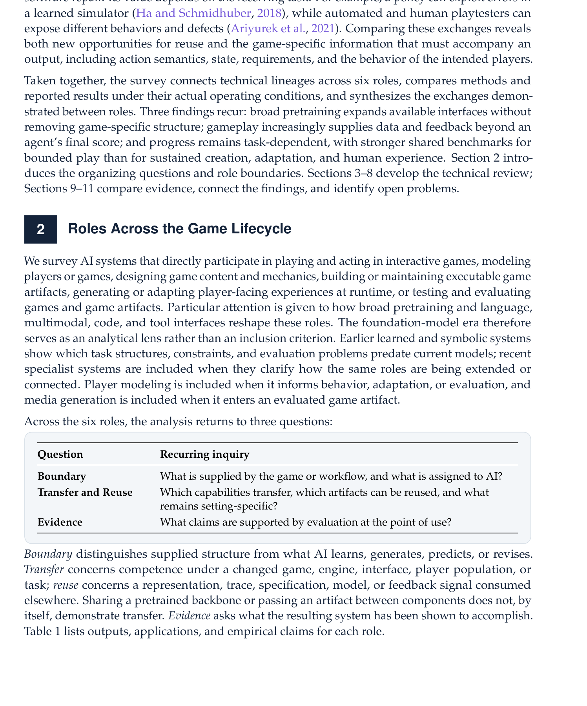
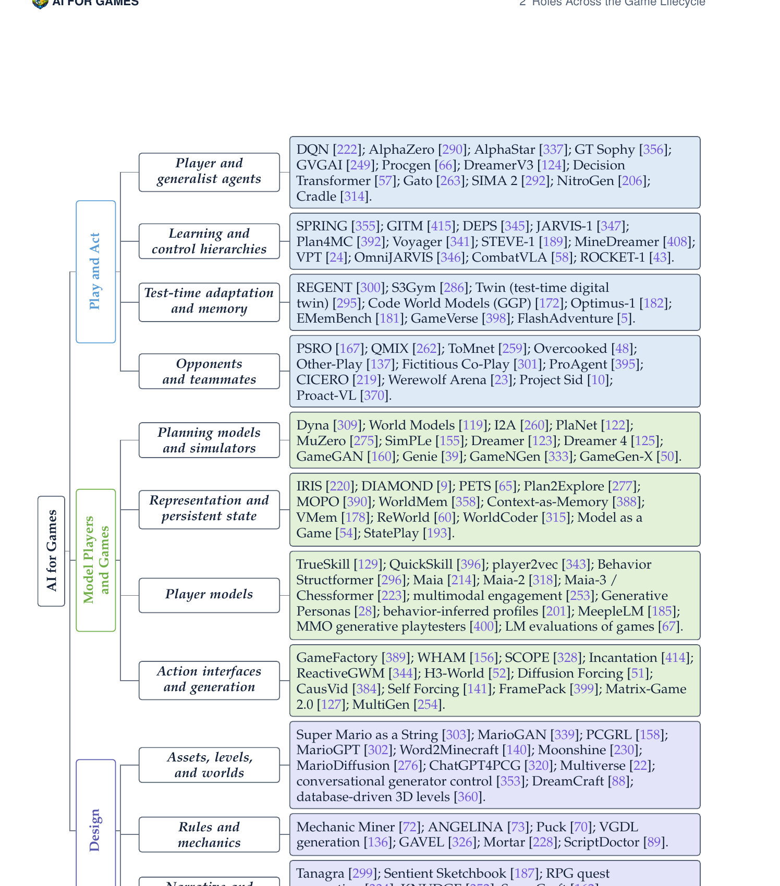
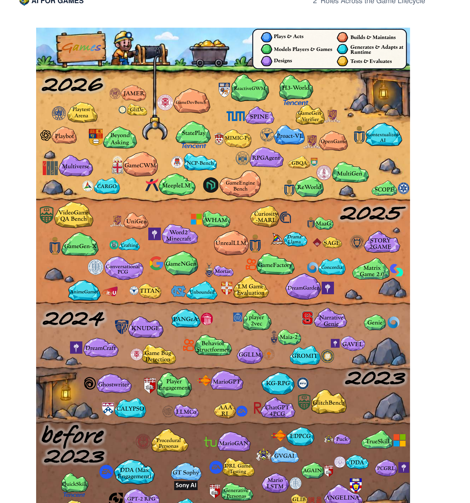

# AI for Games in the Foundation Model Era — 解读

> **arXiv**: 2609.16679v1 · **发表**: 2026-09-15 · **机构**: NUS + NTU (Meng Luo et al.) · **120 页** · **代码/Awesome List**: [github](https://github.com/Eurekaleo/awesome-ai-for-games) · **主页**: https://eurekaleo.github.io/awesome-ai-for-games

---

## 1. 一句话定位

这是 2026 年最全面的 AI for Games 综述,以"游戏生命周期中的六个角色"为框架组织 400+ 篇文献,核心贡献在于为每个角色定义可操作的评测边界,并系统分析跨角色的 Artifact Reuse vs. Capability Transfer 差异。

---

## 2. 要解决的问题(动机)

基础模型极大扩展了 AI 在游戏领域的参与范围,但现有综述要么只关注 Play 角色(RL + 游戏 agent),要么只关注 PCG 内容生成,缺少覆盖整个游戏开发-运营周期的统一框架。本文试图回答三个贯穿全文的问题:

| 问题 | 内容 |
|------|------|
| **Boundary** | 游戏/工作流已提供什么,哪些分配给 AI? |
| **Transfer and Reuse** | 哪些能力可以迁移,哪些 Artifact 可跨场景复用,哪些是 setting-specific? |
| **Evidence** | 在实际使用点上,评估支持哪些声明? |



> **Fig 1 解读**:§2 框架表格定义贯穿六个角色的三个递归问题。
>
> - **Boundary**——区分游戏供给的结构（规则、引擎、接口）与 AI 负责的学习/生成/预测部分。即使是广义基础模型也依赖游戏提供的确定性约束。
> - **Transfer and Reuse**——Reuse 指其他组件可以消费某角色的输出（如 action trace 被世界模型消费）；Transfer 指在不同游戏/接口/规则下能力是否保留。共享骨干网络 ≠ Transfer。
> - **Evidence**——评估必须发生在"实际使用点"：一个能生成可玩模拟器的方法，不等于它能改善 RL 策略训练时的学习效率。

---

## 3. 与前作的关系

| 前作综述 | 范围 | 本文改进 |
|----------|------|----------|
| Gallotta et al. (2024), LLMs & games | LLM-centric | 本文覆盖全基础模型类型 + 早期符号系统 |
| Hu et al. (2026b), LLM-based game agents | 侧重 Play 角色 | 本文增加 Design/Build/Runtime/Test 五个角色 |
| PCG 专项综述 | 内容生成 | 本文将 PCG 定位为 Design 角色的一个子类 |

本文的 inclusive 原则：早期 RL/符号系统（DQN, AlphaGo, TrueSkill）同样被收录，用来说明任务结构在基础模型出现前就已确立。

---

## 4. 六角色框架与核心方法

### 4.1 总体分类树



> **Fig 4 解读**：按照 AI 输出的直接使用方式（immediate use of output）将所有系统分成六个顶层角色，每个角色再划分 3–4 个子类。
>
> - **Play and Act（蓝色）**：输出被用于控制游戏角色/决策。四子类：Player/generalist agents（DQN→SIMA 2）; Learning/control hierarchies（Voyager, VPT）; Test-time adaptation/memory（REGENT, Twin）; Opponents/teammates（CICERO, Proact-VL）。
> - **Model Players and Games（绿色）**：输出被用来预测/模拟游戏状态。四子类：Planning models/simulators（Dreamer 4, GameNGen）; Representation/persistent state（ReWorld, StatePlay）; Player models（Maia, Maia-2, Maia-3）; Action interfaces/generation（H3-World, SCOPE, Self-Forcing）。
> - **Design（紫色）**：输出被游戏设计师用于创作。三子类：Assets/levels/worlds（ChatGPT4PCG, DreamCraft, MarioGPT）; Rules/mechanics（GAVEL, ScriptDoctor, Mortar）; Narrative/co-creative（NarrativeGenie, DreamGarden, AutoBG）。
> - **Build and Maintain（橙色）**：输出是可执行代码/场景/引擎工程制品。四子类：Code/scenes/engine（GameDevBench, JAMER）; Tool-using dev agents（OpenGame, UniGen）; Execution/debugging（Play2Code, GameGen-Verifier）; Revision/maintenance（GameXpert-Bench, WebGameBench）。
> - **Generate and Adapt at Runtime（青色）**：输出被玩家在游戏过程中实时消费。四子类：Generative characters/content（MeepleLM, NPC-Bench）; Runtime rules/mechanics（IF:CARGO, PANGeA）; State consistency/long-term memory（AnimeGamer, Unbounded）; Personalization（Beyond Asking, CALYPSO）。
> - **Test and Evaluate（黄色）**：输出是测试结论/质量评价。四子类：Automated playtesting（CA2, PlaytestArena, TITAN）; Software/mechanic verification（GameGen-Verifier, SAGE）; Model-based judges（VideoGameQA-Bench, GBQA）; Human relevance（FAIRGAMER）。

---

### 4.2 系统时间线



> **Fig 3 解读**：挖矿主题层状图，每层代表一个时代（before 2023 / 2023 / 2024 / 2025 / 2026），不同颜色对应六个角色。石块越往上越新，体现基础模型时代的快速进展。
>
> - **before 2023（最深层）**：符号/RL 时代——DDA, PCGRL, Procedural Personas, GT Sophy, TrueSkill, MarioGAN。任务结构和评测协议已在此时确立。
> - **2023**：首批大模型介入——ChatGPT4PCG, MarioGPT, Ghostwriter, GlitchBench。LLM 进入内容生成角色。
> - **2024**：大规模扩张——GameGen-X, DreamGarden, GameFactory, NarrativeGenie, Genie, LM Game Evaluation, TITAN。
> - **2025**：多角色协同——Word2Minecraft, UnrealLLM, Drama Llama, SAGE, MaaG, VideoGame QA Bench, UniGen。
> - **2026**：全生命周期覆盖——GameDevBench, JAMER, StatePlay, H3-World, GameGen-Verifier, NCP-Bench, ReWorld, MeepleLM, SCOPE。

---

### 4.3 每个角色的关键发现

**§3 Play and Act**

- 广义策略（SIMA 2, NitroGen）展示跨游戏的视觉/语言迁移，但未见规则联合迁移的完整验证
- 控制层次（Voyager, VPT）把 LLM 用作高层规划器，保留低层控制由游戏接口提供
- Test-time adaptation（REGENT, S3Gym, Twin）用检索/符号推理在推理时处理未见规则
- 对手与队友（CICERO, Werewolf Arena）中语言是协调接口；Project Sid 演示多 agent 文明涌现

**§4 Model Players and Games**

- 规划模型（Dreamer 4）：短时序 fidelity 强，跨游戏持久状态弱
- 世界模型的三个 fidelity 靶：感知质量（FVD）/ 力学正确性（engine reference）/ 持久状态（revisit probe）—— 三者互补不可替代
- PlayWorld 对比结果：Genie 3 Overall 2.12 Validity 87.1%，SANA-WM 次高 Validity 80.4% 但 Overall 垫底
- 玩家模型（Maia 系列）：个体预测准确 ≠ 偏好恢复；Beyond Asking 的 synthetic trait 回收 ≠ 真实玩家有效性

**§5 Design**

- PCG 路径（GAVEL, Mortar, ScriptDoctor）：将规则可执行化是核心难点，比生成更多候选内容更关键
- Co-creative 设计（DreamGarden）：从意图到层级化计划，叶节点调用 Unreal Engine 模块——设计师控制力依赖 plan 的可编辑性
- 验证缺口：没有系统同时测试「设计师能高效引导 generator」和「玩家喜欢结果」两件事

**§6 Build and Maintain**

- GameDevBench（Claude Fable 5 xhigh Pass@1 67.3%，GPT-5.6 Sol high 63.1%）：Godot 333 任务，不同 harness 差异显著
- GameCraft-Bench（Claude Opus 5 xhigh Overall 68.44，Claude Fable 5 high 65.72）：Core mechanics 一致超过 Content depth
- JAMER：项目规模增大时性能急剧下降；长期维护 + developer handoff 目前无 benchmark 覆盖

**§7 Generate and Adapt at Runtime**

- Constrained rule execution（IF:CARGO）和 player-outcome 研究（CALYPSO, Beyond Asking）是该角色最强证据
- 跨 session 一致性几乎无评测：技能进化/角色记忆/规则更新在多 session 中的一致性未被任何已发表工作系统评估
- 个性化 vs. 公平：多人游戏中个性化信息/响应延迟/生成奖励可能造成不公平机会

**§8 Test and Evaluate**

- 覆盖率 ≠ 代表性（CA2 的 curiosity-driven exploration 提升覆盖率，不等于覆盖了典型玩家路径）
- 一个有能力的 player 不是一个可靠的 tester（Play2Code 可能发现 tester 无法触达的 bug，GameGen-Verifier 注入状态绕过普通可达性）
- 多样性 ≠ 代表性（procedural personas 刻意探索不同目标，不等于那些目标像真实玩家的目标）

---

### 4.4 跨角色连接（§10）

**Table 13 代表性跨角色流**

| 流向 | Artifact | 系统示例 | 需验证的下游结果 |
|------|----------|----------|-----------------|
| Play → Model | Action-linked traces | GameNGen | Prediction fidelity; interactive consistency |
| Model → Play | Imagined trajectories | Dreamer 4 | Reference-game policy return |
| Design → Build | Editable plan | DreamGarden | Executable output satisfying requirements |
| Build → Model | Executable state + rendering controls | Programmable World Model | Generated views agreeing with engine events |
| Test → Design | Compiler/search feedback | ScriptDoctor | Compilation; solvability within search budget |
| Test → Build | Play/repair feedback | Play2Code | Corrected failures; unaffected behavior preserved |
| Model → Runtime | Player profile | Beyond Asking | Adaptation benefit; separate from profile accuracy |

**可执行 Graybox 架构**（§10.2 最重要的新兴连接）：

```
Code Agent（LLM）
    → Graybox（简单几何 + 碰撞 + 目标 + 引擎测试）
        ← Asset retrieval/generation（保留 entity identity + behavior binding）
            → State-conditioned Video Renderer（G-buffer + depth/mask/motion）
                → Player（看到高画质，背后是 lightweight engine）
```

Programmable World Model 已实现 Build→Model 路径；AlayaRenderer-Flash 实现了 G-buffer→神经渲染路径，但两者尚未端到端闭合成完整 UE/Unity 流水线。

---

## 5. 关键 Benchmark 数字

| Benchmark | 最强系统 | 分数 | 注意事项 |
|-----------|----------|------|----------|
| **ARC-AGI-3**（Standard） | GPT-6 Astra (Max) | 62.71% | Claude Opus 5 (High) 仅 30.16%，harness 对分数影响巨大（Provider Adapter 99.95 vs Standard 62.71） |
| **GameWorld**（Progress %） | Seed-1.8 | 39.8% | Human Novice 64.1%，Human Expert 82.6%，人机差距仍大 |
| **PlayWorld**（Overall/Validity%） | Genie 3 | 2.12/87.1% | LingBot-World2 Validity 78.8%，SANA-WM Validity 最高 80.4% 但 Overall 最低 |
| **GameDevBench**（Pass@1%） | Claude Fable 5 (xhigh) | 67.3±5.0% | Claude Code harness；GPT-5.6 Sol 63.1±5.2%；Qwen3.5-397B 仅 5.4% |
| **GameCraft-Bench**（Overall） | Claude Opus 5 (xhigh) | 68.44 | Core mechanics 76.75；Content depth 63.31；zero-score on launch failure |
| **CombatStateBench** | Programmable World Model | Count 94%/State 98% | VLM 逐帧检查，超 baseline 最多 90pp |
| **ARC-AGI-3**（GPT-6 Astra Adapter） | GPT-6 Astra (High) | 99.95% | Provider Adapter harness，非 Standard；证明 harness 配置影响超过模型选择 |

---

## 6. 开放挑战（§11）

| 角色 | 已报告的证据 | 核心研究缺口 |
|------|------------|------------|
| Play | 跨游戏技能、规则推断 | 规则+控制+时序的**联合**迁移 |
| Model | 状态预测、NPC 行为、玩家预测 | **持久世界状态**；可靠玩家模型更新与迁移 |
| Design | 可解关卡、规则搜索、设计师引导 | 玩家体验；**持续**创意控制 |
| Build | 完整项目、作用域编辑、短修订链 | 演化需求；**开发者 handoff** |
| Runtime | 受限规则执行、玩家-结果研究 | **跨 session 一致性**、公平性 |
| Test | 力学验证、人类参考 defect、公平诊断 | **独立验证**；更广泛行为覆盖 |

---

## 7. 争议/权衡

1. **Artifact reuse ≠ capability transfer**：文中用三个测试区分——Compatibility（格式/语义保留）、Use（接收方实际消费）、Benefit（下游指标改善）。三者独立，单独通过任何一项都不能宣称 transfer。

2. **界面配置即系统**：ARC-AGI-3 中 GPT-6 Astra Standard 62.71% vs Provider Adapter 99.95%，差距来自 harness 而非模型本身。benchmark 分数描述的是配置好的系统，不是孤立模型能力。

3. **Coverage ≠ Correctness**：测试覆盖率高不等于缺陷发现正确。State injection（GameGen-Verifier）绕过普通可达路径，discovery 成本低但 reproducibility 要求独立 replay trace。

4. **当前证据最强区域 vs 最弱区域**：
   - 最强：有界游戏 play（ARC-AGI-3, ALE）、选定学习环境（LIBERO, GameWorld）
   - 最弱：持久世界状态、演化软件项目、重复修订与 handoff、跨 session 运行时适应、重复玩家接触

5. **游戏越来越是数据引擎**：gameplay 不只提供最终分数，还提供 reward signal（RLHEF）、action traces（GameNGen 训练数据）、state coverage（Play2Code 测试路径）、player profiles（Beyond Asking 个性化）。

---

## 8. 一句话总结

六角色框架（Play / Model / Design / Build / Runtime / Test）+三递归问题（Boundary / Transfer / Evidence）系统梳理了 AI for Games 全生命周期；关键结论是基础模型扩展了 AI 的接口但没有消除游戏专属结构，证据在有界 Play 最强，在持久世界状态和跨 session 运行时最弱，进步靠的是跨角色连接中保留约束语义，而非单纯移动输出。

---

## Q&A

*（待后续对话填充）*
