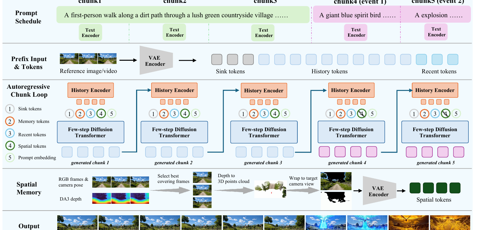
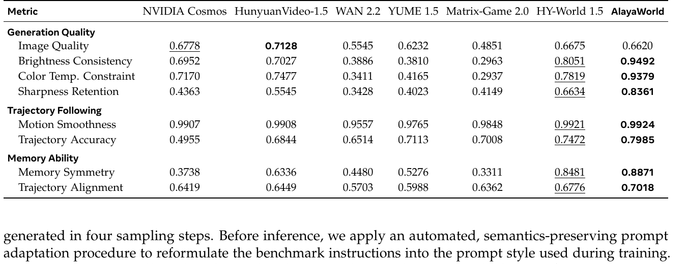

# AlayaWorld: Interactive Long-Horizon World Modeling — Full Technical Report

- **arXiv**: [2607.18367v1](https://arxiv.org/abs/2607.18367)（2026-07-20，16 页，技术报告）
- **机构**: **AlayaWorld Team, Alaya Lab**（贡献者列表在报告末尾）；通讯 `kaipeng.zhang@shanda.com`（盛大）
- **资源**: [项目页](https://alaya-lab.github.io/AlayaWorld/) · [代码](https://github.com/AlayaLab/AlayaWorld) · [视频](https://www.youtube.com/watch?v=n0jIEg7taTI)

---

## 1. 一句话定位

**把交互式世界模型的视觉上下文做成一个「有界的滚动窗口」：固定 sink 帧 + 6 帧压缩时序历史 + 最多 10 帧几何对齐的空间记忆 + 1 帧最近帧 —— 四路全部预算固定，所以每 chunk 的计算量是常数，horizon 原则上无界。**

论文自己把这句话说得很干脆：

> *"Because the context is a **bounded rolling window** (a fixed sink, a 6-frame history, and a capped set of 10 rendered cache frames), **the compute per chunk is constant and the horizon N is in principle unbounded**."*

📌 **对本仓库而言这篇有三个位置**：

1. **它是 [PWM](../pwm/analysis.md) 的上游** —— 同一个 Alaya Lab，而 PWM 的空间记忆明说是「借用 AlayaWorld 的几何对齐空间记忆机制」；
2. **它的空间记忆与 [Matrix-Game 3.5](../matrix_game_35/analysis.md) 的 Patch Memory 是同一类但不同实现**（见 [§3](#3-空间记忆与-matrix-game-35-的-patch-memory-正面对比)）；
3. 🔴 **它的蒸馏一句话回答了我在 OPSD-V / Matrix-Game 3.5 上追了两轮的那个问题** —— DMD 时 teacher 看到的历史是什么（见 [§5.2](#52--scorer-看到的历史第三种答案而且这次写清楚了)）。

⚠️ **但要先说清**：**"ablat" 与 "limitation" 这两个词在全文各出现 0 次** —— 四路上下文、三个蒸馏项、两套抗漂移机制，**没有一个被单独验证过**，也没有 Limitations 章节。

---

## 2. 有界上下文：四路 prefix

生成在 VAE latent 空间按 chunk 自回归，每 chunk 是 **K = 4 个 latent frame**。因果分解：

$$
p_\theta(z_{1:N} \mid \pi_{1:N},\, y_{1:N}) = \prod_{i=1}^{N} p_\theta\big(z_i \mid z_{<i},\, \pi_{\le i},\, y_i\big)
$$

📌 **两种条件走两条完全不同的路**：**相机轨迹**（逐帧的**相对**位姿增量）经 Fourier 编码 + MLP 走 **AdaLN 调制**；**视觉历史**走 **in-context token 前缀**。

前缀是四路干净（σ = 0，无噪）流拼在 K 个加噪目标帧之前：

$$
S_i = \big[\underbrace{s}_{\text{sink}};\; \underbrace{h_i}_{\text{temporal}};\; \underbrace{g_i}_{\text{spatial}};\; \underbrace{n_i}_{\text{nearby}};\; \underbrace{z_i^{\tau}}_{\text{target}}\big]
$$

**整条序列过完整（非因果）self-attention，最后一个 transformer block 之后把前缀整段切掉，只对目标段去噪。**

| 流 | 是什么 | 预算 | 关键设计 |
|---|---|---|---|
| **Sink `s`** | 单个干净 latent frame，**钉死在 RoPE 时间位置 0**，全程不变，作为全局身份/外观锚点 | **1 帧** | 📌 **训练时刻意取"远帧"**（距目标至少 8 个 latent frame）—— *"prevents the model from extrapolating the next chunk directly from it and thereby **increases its reliance on the camera-control signal**"* |
| **时序记忆 `h_i`** | `H_φ(w_i)`，把最近 **L = 6** 个 latent frame 的滑窗压成轻量 embedding，**每 chunk 重算** | **6 帧压缩后** | **token 直接注入，绕过 patch embedder** |
| **空间记忆 `g_i`** | 把历史视角几何对齐地渲染到当前视角 | **最多 10 帧** | 见 §3 |
| **最近帧 `n_i`** | 最近的那一个 latent frame（滑窗的最后一帧），patch-embed 后紧贴目标之前 | **1 帧** | 就是 I2V 条件帧，承载全分辨率的帧间连续性 |

📌 **这四路的分工很清楚**：sink 管"全局身份别漂"、时序记忆管"最近几帧的连贯"、空间记忆管"回头看见的东西要一致"、最近帧管"逐帧不跳"。**而 sink 取远帧这个细节是为了逼模型用相机信号而不是抄 sink** —— 这是个想清楚了的设计。

---

## 3. 空间记忆：与 Matrix-Game 3.5 的 Patch Memory 正面对比

> **Fig 4 底部那一行就是空间记忆**：`RGB frames & camera pose` + `DA3 depth` → **Select best covering frames** → **Depth to 3D points cloud** → **Warp to target camera view** → `VAE Encoder` → **Spatial tokens**。上半部分是 5 个 chunk 的自回归循环，每个 chunk 走 `Text Encoder` → `History Encoder` → `Few-step Diffusion Transformer`，第 4/5 个 chunk 标着 `event 1` / `event 2`（prompt 切换驱动的事件）。

**它明说沿用 GEN3C**：维护一个显式 cache `B = {(I_j, D_j, π_j)}` —— 每个已生成帧 + 它的**单目深度（Depth-Anything-3）** + 相机位姿，按全局帧号索引。四步：

1. **检索**：**贪心最大覆盖**选**最多 10 帧** —— 每个候选的深度反投影到世界点再投到 `π_i`，用 **z-buffer（遮挡容差 δ = 0.1）** 标记它覆盖了哪些目标像素，按"新增覆盖最多"逐个选；
2. **Warp**：**forward splatting**

$$
u' = \pi_i\,\pi_j^{-1}\big(u,\, D_j(u)\big)
$$

   逐像素遮挡按最近深度解决，多个来源融合成一张 warped 图 `Ĩ_i` **加一张二值覆盖掩码 `M_i`**；
3. **注入**：`Ĩ_i` 经 VAE 编码成 `g_i`，放在目标的 RoPE 坐标上；🔴 **`M_i` 变成 self-attention 的 key bias**，*"so uncovered (i.e. never-observed) regions are **ignored rather than trusted**"*；
4. **更新**：chunk `i` 生成后解码到像素、估深度，`(I_i, D_i, π_i)` 追加进 `B`。

### 🔴 与 Matrix-Game 3.5 的逐项对比

**两篇做的是同一件事（把历史观测按几何对齐到当前视角），但四个关键实现全都不同**：

| | **AlayaWorld** | **[Matrix-Game 3.5](../matrix_game_35/analysis.md)** |
|---|---|---|
| **记忆单元** | **整帧**（warp 成一张对齐图再 VAE 编码） | **latent patch**（patch 级散射进画布） |
| **渲染方式** | **forward splatting**（前向溅射，逐像素最近深度） | **反投影 + 视锥查询 + z-buffer 散射** |
| **空洞怎么办** | 🔴 **保留占位，但用 coverage mask 做 attention key bias 把它们屏蔽掉** | 🔴 **直接从 token 序列里丢掉**（*"avoids doubling the sequence length"*） |
| **预算** | **最多 10 帧**，贪心最大覆盖选 | 每 4 帧 query 组最多 5 个历史候选 |
| **深度来源** | **Depth-Anything-3**（单目，推理时对生成帧估） | VGGT-Omega + Depth Anything 3 metric 分支（训练标注）；推理时也要估 |
| **位置编码** | 放在**目标的 RoPE 坐标**上 | **借目标帧的 RoPE 时间戳 + 亚网格精度的分数空间坐标** |
| **血统** | 明说 following **GEN3C** | 明说 following **MosaicMem** |

📌 **最值得记的差别是"空洞怎么处理"**：
- **AlayaWorld 保留空洞的 token，但用 mask 把注意力屏蔽掉** —— 序列长度固定（永远是 10 帧 warp 后的一张图），代价是空洞位置仍占 token 预算；
- **Matrix-Game 3.5 直接把空洞 token 删掉** —— token 数随覆盖率浮动，省下的正是"记忆通路不让序列翻倍"。

**两种做法都能达到"只在有可靠几何证据的地方复用记忆"这个目的，但对序列预算的处理是相反的。没有人比过。**

⚠️ **另一个共同的隐性成本**：**两篇都要在推理时对生成帧估单目深度**（AlayaWorld 用 DA3、MG3.5 用外部估计器），而**两篇都没有把这个估计器的开销计入延迟核算**。

---

## 4. 抗漂移：两套机制 + 一个调度

**核心思路：既然 rollout 一定会漂，那就训练时主动把上下文弄脏。** 两套机制**都只作用在时序记忆、空间记忆和最近帧这三路上 —— sink 保持干净**：

**① Helios drift simulation** —— 在 latent 空间注入三类人为退化，模仿 rollout 真实会漂成的样子：

| 类型 | 操作 |
|---|---|
| 加噪 | `z ↦ (1−σ)z + σϵ`，`σ ~ U(0, ρ)` |
| 降采样模糊 | `z ↦ up(down(z; r))`，`r ~ U(0.9, 1)` |
| 饱和度偏移 | `z ↦ (z − z̄)·α + z̄`，`α ~ U(0.3, 1.7)` |

（加噪或模糊之后**可选**再跟一个饱和度偏移。）

**② Error bank** —— 🔴 **这个更有意思**：把模型**自己的重建残差** `δ = ẑ_0 − z_0`（其中 `ẑ_0 = z_τ − τ·v_θ`）存进一个 buffer，**按 chunk 长度和噪声水平分桶**，再加性地回放进上下文（以及目标 latent）：

$$
z \leftarrow z + \gamma\,\delta
$$

> *"so the model learns to recover from **the failure modes it actually produces at inference**."*

**③ 调度**：两者**互斥**。bank 没填满之前只用 Helios drift（固定概率）；**bank 预热完成后它优先**，Helios 的概率调低。

📌 **这比单纯加噪聪明的地方在于**：Helios 那三类是"人猜的漂移形态"，而 error bank 是"模型实测会犯的错"。**用前者冷启动、后者接管，是一个合理的课程。**

⚠️ **但 `ρ`、`γ`、回放概率、bank 容量、预热判据全部没给**，而且**这两套机制都没有消融** —— 无法知道它们各自值多少，也无法知道 error bank 是否真的优于纯 Helios。

**另外还有一个辅助头（next forcing）**：从 backbone 中间若干层 hook 出隐状态融合成 `F`，连同加噪的下一个 chunk 一起送进小头 `f_ψ` 预测速度，**在偏高的噪声水平 `τ̃ = 10τ/(1+9τ)` 上监督**：

$$
\mathcal{L}_{\mathrm{nf}} = \big\lVert f_\psi\big(F,\, z^{+}_{0,\tilde\tau},\, \tilde\tau\big) - (\epsilon - z^{+}_0)\big\rVert_2^2,
\qquad
\mathcal{L} = \mathcal{L}_{\mathrm{flow}} + 0.5\,\mathcal{L}_{\mathrm{nf}}
$$

---

## 5. 蒸馏：三项合一，30 步 → 4 步

### 5.1 三个损失项

论文自述灵感来自 **Causal-rCM** 的"一致性蒸馏 + 分布匹配联合"原则，**但改成离散形式以避开 JVP 计算**：

> *"Inspired by the joint consistency-distillation and distribution-matching principle of Causal-rCM, we introduce a **discrete** distillation formulation… Unlike the continuous-time formulation of Causal-rCM, our discrete formulation **avoids Jacobian-vector-product computation**."*

**① DMD**：

$$
\nabla_\theta D_{\mathrm{KL}}\big(p_{\theta,\tau} \Vert p_{\mathrm{data},\tau}\big) = -\,\mathbb{E}\left[\Big(s_{\mathrm{real}}(\hat{z}_i^{\tau},\tau \mid c_i) - s_{\mathrm{fake}}(\hat{z}_i^{\tau},\tau \mid c_i)\Big)\frac{\partial \hat{z}_i}{\partial \theta}\right]
$$

📌 **两个 score 由同一个 backbone 靠 LoRA 开关提供**（critic LoRA **关**= real/teacher score，**开** = fake/critic score），**不需要第二个网络**；critic 用**双时间尺度**更新得比 student 更频繁，保持领先。

**② Self-forcing++**：学生 rollout 自己的多 chunk 轨迹，沿这条自生成路径被 teacher 打分。

**③ Consistency distillation**：在 **50 级的噪声网格**上，把学生在高噪声级的预测匹配到**自己 EMA 副本**在相邻低噪声级的预测，`d` 是 **Huber 距离**：

$$
\mathcal{L}_{\mathrm{cm}} = \mathbb{E}\Big[d\big(G_\theta(z_i^{\tau},\tau \mid c_i),\; G_{\theta^-}(z_i^{\tau'},\tau' \mid c_i)\big)\Big],\qquad \tau' < \tau
$$

**合并方式很简单：`L_DMD + 0.5·L_cm`。**

📌 **学生本身是冻结 backbone 上的一个 LoRA，而且时序记忆与空间记忆在这一阶段都冻结。** 产出 **4 步/chunk**、24 fps、保留完整相机控制与两路记忆。

### 5.2 🔴 scorer 看到的历史：第三种答案，而且这次写清楚了

**这正是我在 [OPSD-V](../../video_generation/opsd_v/analysis.md) 与 [Matrix-Game 3.5](../matrix_game_35/analysis.md) 上追问过的那件事。本篇的原话是**：

> *"the student rolls out its own multi-chunk trajectories and is scored against the teacher along that self-generated path (**with ground-truth context and detached history**)."*

**拆开看是两件事**：
- **`ground-truth context`** —— 打分时用的上下文是**真值**，不是学生自己漂过的那份；
- **`detached history`** —— 历史被 detach，**梯度不沿自回归链回传**。

**于是三篇的答案排在一起**：

| | student 采样时的上下文 | teacher/scorer 打分时的上下文 | 随 rollout 前进吗 |
|---|---|---|---|
| **[OPSD-V](../../video_generation/opsd_v/analysis.md)** | 自己的 KV cache（全是自生成） | **真实视频 chunk 逐个填充**，只保留最近一个学生 chunk | ✅ 前进，始终与学生对齐在同一时刻 |
| **[Matrix-Game 3.5](../matrix_game_35/analysis.md)** | 在线检索的记忆 | ⚠️ **公式说共享、散文说冻在初始记忆 —— 自相矛盾** | ❌（按散文口径） |
| **AlayaWorld（本篇）** | 自己 rollout 的路径 | **ground-truth context** | ✅ 随路径前进（是同一条自生成路径上的真值上下文） |

📌 **本篇与 OPSD-V 实质上是同一个解法的两种说法** —— 都是「**状态取自学生、上下文换成真值**」。OPSD-V 把它讲得更细（`h^t_i` 的显式表达式、保留最近一个学生 chunk 防止方向不可达），本篇只有一个括号，**但至少没有自相矛盾**。

⚠️ **本篇缺的恰恰是 OPSD-V 那个细节**：它没说要不要保留最近一个学生 chunk。**如果上下文全部是真值，按 OPSD-V 的论证，teacher 就成了"活在历史从未退化的世界里"的 oracle，给出的方向对学生不可达。** 本篇没有讨论这个风险。

---

## 6. 结果

**全部指标都在 [0,1]，越高越好。加粗 = 最优、下划线 = 次优（我逐格核对过，标注无误）。**

| 指标 | Cosmos | HunyuanVideo-1.5 | WAN 2.2 | YUME 1.5 | Matrix-Game 2.0 | HY-World 1.5 | **AlayaWorld** |
|---|---|---|---|---|---|---|---|
| *Generation Quality* | | | | | | | |
| Image Quality | 0.6778 | **0.7128** | 0.5545 | 0.6232 | 0.4851 | 0.6675 | 🔴 **0.6620** |
| Brightness Consistency | 0.6952 | 0.7027 | 0.3886 | 0.3810 | 0.2963 | 0.8051 | **0.9492** |
| Color Temp. Constraint | 0.7170 | 0.7477 | 0.3411 | 0.4165 | 0.2937 | 0.7819 | **0.9379** |
| Sharpness Retention | 0.4363 | 0.5545 | 0.3428 | 0.4023 | 0.4149 | 0.6634 | **0.8361** |
| *Trajectory Following* | | | | | | | |
| Motion Smoothness | 0.9907 | 0.9908 | 0.9557 | 0.9765 | 0.9848 | 0.9921 | **0.9924** |
| Trajectory Accuracy | 0.4955 | 0.6844 | 0.6514 | 0.7113 | 0.7008 | 0.7472 | **0.7985** |
| *Memory Ability* | | | | | | | |
| Memory Symmetry | 0.3738 | 0.6336 | 0.4480 | 0.5276 | 0.3311 | 0.8481 | **0.8871** |
| Trajectory Alignment | 0.6419 | 0.6449 | 0.5703 | 0.5988 | 0.6362 | 0.6776 | **0.7018** |

📌 **8 项里赢 7 项，唯一输的是 Image Quality（0.6620，第 4）** —— 而论文如实承认：*"**Although it does not achieve the highest image-quality score**, its overall generation quality remains competitive"*。**表里 0.7128 的加粗也确实给了 HunyuanVideo，没有耍花样。**

📌 **真正拉开差距的三项都是"抗漂移"类指标**：Brightness Consistency **0.9492**（次优 0.8051）、Color Temp. **0.9379**（次优 0.7819）、Sharpness Retention **0.8361**（次优 0.6634）。**这与它 §3.3 那两套抗漂移机制的设计目标完全对得上** —— 虽然没有消融，但指标形状是自洽的。

📌 **还有一层值得记**：**这些数字是用 4 步蒸馏模型拿的**（*"All results are obtained using the **distilled** autoregressive AlayaWorld model"*），而对手里有 30 步级别的通用视频模型。

⚠️ **三处需要打折的地方**：

1. 🔴 **它对 benchmark 的 prompt 做了改写**：*"Before inference, we apply an **automated, semantics-preserving prompt adaptation procedure to reformulate the benchmark instructions into the prompt style used during training**."* —— **而没有任何证据表明 baseline 享受了同等待遇**。这是一个直接作用在"按指令生成"这件事上的预处理。
2. ⚠️ **评测在 480p**（对齐 benchmark 提供的初始帧），而论文主打的是 540p/720p。**主表的分辨率不是它宣传的分辨率。**
3. ⚠️ **baseline 是复现还是引用，论文没说**；各自用多少采样步、什么配置，也没说。

📌 **一个加分项：iWorld-Bench 是第三方的**（Fang et al., [arXiv:2605.03941](https://arxiv.org/abs/2605.03941)），不是自建榜。**另外还在 WorldMark 测试集上跑了 World Model Arena 的盲测人评**（Elo 排名，结果在 `warena.ai` 上），但**报告正文没有给出 Elo 数字**。

---

## 7. 设置与成本

| 项 | 值 |
|---|---|
| **Backbone** | **LTX-2.3**（fine-tune 而来），**15B video DiT** |
| 输出 | **24 fps**，**540p / 720p**；主表评测在 **480p** |
| chunk 结构 | 每 chunk **K = 4 个 latent frame** ≈ **约 1 秒视频** |
| 控制 | **相机轨迹**（逐帧绝对位姿，注入时用相对增量走 AdaLN）+ **可切换的 chunk 级文本 prompt**（在 chunk 边界换 prompt 即触发"事件"，如战斗、施法） |
| 深度 | **Depth-Anything-3**（单目） |
| **训练数据** | **222,147 clips / 7 个来源**（含两个自建：**MUGEN** 与 **GameVerse**），真实拍摄 + 合成渲染混合；统一成「视频 + 逐帧内参与位姿 + 分层 caption」的记录格式 |
| 数据筛选 | 完整性、**分辨率 ≥ 720p**、**时长 ≥ 3 s**、**帧率 24–65 fps**、codec 白名单 |
| caption | **1–2 fps 的密集标注，每条带显式 `[mm:ss]` 时间戳**（鼓励时间分段而非整段概括） |
| **训练四阶段** | ① 双向预训练（全参微调 LTX-2.3，纯视频先验，无记忆无控制）→ ② 历史预训练（**冻 backbone，只用 LoRA 训 `H_φ`**）→ ③ 全栈微调（解冻全参 + 三个模块：history compression / camera control / next forcing）→ ④ 蒸馏（**学生是冻结 backbone 上的 LoRA**） |

🔴 **完全没给的**：
- **GPU 型号、卡数、训练时长、GPU-hours —— 一个都没有**；
- **实测延迟 / FPS / 显存 —— 一个都没有**。而摘要把 **"efficient response"** 列为四大能力之一，正文也只说 *"enables low-latency interaction"*，**没有任何数字**；
- 学习率、batch size、各阶段步数；
- 抗漂移的 `ρ`、`γ`、回放概率、bank 容量与预热判据；
- LoRA rank/alpha；
- **种子、误差棒、重复次数**。

---

## 8. 争议与权衡

- 🔴 **零消融。** **"ablat" 全文 0 次。** 四路上下文（sink / 时序 / 空间 / 最近帧）、三个蒸馏项（DMD / self-forcing++ / consistency）、两套抗漂移机制（Helios drift / error bank）、next forcing 辅助头 —— **一个都没有被单独验证**。而这篇的贡献恰恰是"把这些组合起来"，**没有消融就无法知道哪一块在起作用**。
  📌 **尤其可惜的是 error bank**：它是全文最有新意的设计（回放模型自己的残差），而且**有现成的对照可做**（纯 Helios vs Helios+bank），论文自己也描述了两者的调度关系，**却没有测**。
- 🔴 **无 Limitations 章节**（"limitation" 全文 0 次）。
- 🔴 **"efficient response" 是四大能力之一，却没有任何延迟/FPS 数字。** 对一篇主打交互的工作，这是最该有的那个数。
- ⚠️ **主表的 prompt 被改写过**，而 baseline 大概率没有（见 §6）。
- ⚠️ **主表在 480p，而宣传是 540p/720p。**
- ⚠️ **最长量化 rollout 的长度论文没给。** iWorld-Bench 的协议长度未在报告里说明，而标题与摘要主打 "long-horizon"。📌 **不过它对 "unbounded horizon" 的论证是结构性的**（有界上下文 ⇒ 每 chunk 常数计算量），**这比单纯喊"无限"要扎实**，只是仍缺一条"跑到 N 分钟时质量如何"的曲线。
- ⚠️ **空间记忆的深度来自单目估计器（DA3），误差会随 rollout 累积进 cache** —— 论文没有讨论 cache 里几何误差的累积，也没有 eviction / 纠错策略。
- 📌 **正面：benchmark 是第三方的**（iWorld-Bench），**而且额外做了 World Model Arena 的盲测人评** —— 虽然正文没给 Elo 数字。
- 📌 **正面：Table 3 的加粗诚实** —— Image Quality 那一行把加粗给了对手，正文也明说自己没拿到最高分。
- 📌 **正面：声称有代码、项目页、视频三样齐全**，而且自我定位是 *"full-stack, open-source, and long-term project"*。

---

## 9. 一句话总结

**AlayaWorld 的核心是把交互式世界模型的视觉上下文做成一个预算固定的四路 prefix —— 钉在 RoPE 位置 0 的 sink 帧（训练时刻意取远帧，逼模型依赖相机信号而不是抄 sink）、6 帧压缩时序历史、最多 10 帧几何对齐的空间记忆、1 帧最近帧 —— 全部走 in-context token 前缀、过完整 self-attention 后整段切掉，于是每 chunk 计算量恒定、horizon 原则上无界。** 空间记忆沿用 GEN3C：贪心最大覆盖选帧 → forward splatting warp 到目标视角 → **coverage mask 当 self-attention key bias，让没观测过的区域被忽略而不是被信任**。抗漂移用 Helios 人工退化冷启动、再交给 **error bank 回放模型自己的重建残差**。蒸馏把 DMD + self-forcing++ + consistency 三项合成 `L_DMD + 0.5·L_cm`，**两个 score 靠同一 backbone 的 LoRA 开关提供**，30 步压到 4 步。iWorld-Bench 上 **8 项赢 7 项**，且三项拉开最大的恰是抗漂移类指标（Brightness 0.9492 / Color Temp 0.9379 / Sharpness 0.8361，次优分别是 0.8051 / 0.7819 / 0.6634），**唯一输的 Image Quality 论文如实承认**。⚠️ **但 "ablat" 与 "limitation" 全文各 0 次 —— 四路上下文、三个蒸馏项、两套抗漂移机制无一被单独验证**；**摘要把"efficient response"列为四大能力之一却没有任何延迟/FPS/GPU 数字**；主表在 480p（宣传是 540p/720p）且**对 benchmark 的 prompt 做了改写而 baseline 大概率没有**。

---

## 10. 在仓库图谱里的位置

| | 关系 |
|---|---|
| **[PWM](../pwm/analysis.md)（同一个 Alaya Lab）** | 🔴 **直接下游** —— PWM 的笔记里明写「空间记忆**借用 AlayaWorld 的几何对齐空间记忆机制**（RGB+depth→3D pointcloud→reprojection→latent tokens）」。📌 **两篇合起来是一条清晰的演进**：AlayaWorld 把记忆做成有界上下文，PWM 再把「世界状态维护」整个抽出去交给确定性引擎 |
| **[Matrix-Game 3.5](../matrix_game_35/analysis.md)** | 🔴 **空间记忆的正面对手**，同一类机制、四处实现全不同（见 [§3](#3-空间记忆与-matrix-game-35-的-patch-memory-正面对比)）。两篇互不引用 |
| **[OPSD-V](../../video_generation/opsd_v/analysis.md)** | 📌 **DMD 时 scorer 上下文的处理实质相同** —— 都是「状态取自学生、上下文换成真值」。OPSD-V 讲得更细（显式 cache 表达式 + 保留最近一个学生 chunk 防止方向不可达），本篇只有一个括号但没有自相矛盾（见 [§5.2](#52--scorer-看到的历史第三种答案而且这次写清楚了)） |
| **[五篇横向对照](../../video_generation/dmd_few_step_ar/analysis.md)** | 📌 **它在「② 少步初始化要不要独立阶段」上是一个新形态**：既不是 ForgeWM 的独立一致性蒸馏阶段，也不是 SolarWM/Matrix-Game 3.5 的「合并进 teacher-forcing 阶段」，而是**把 consistency distillation 作为一项并进最后的 DMD 目标里**（`L_DMD + 0.5·L_cm`）。**这是第三种解法，同样零消融** |
| [SolarWM](../solarwm/analysis.md) | 它的发布矩阵里列了 "AlayaWorld v1.1" 一行 |
| [ABot-World-0](../abot_world_0/analysis.md) / [EVOKE](../evoke/analysis.md) / [ReWorld](../../video_generation/reworld/analysis.md) | 长时记忆的其它路线：有界 KV cache + 身份记忆 / Pi3X 点云 World State Bank / landmark bank。📌 **加上本篇的"四路有界 prefix"和 MG3.5 的"patch 画布"，仓库里长时记忆已经有五条不同路线，而彼此之间没有任何定量对照** |

⚠️ **一条仓库缺口**：**iWorld-Bench（arXiv:2605.03941）没有笔记**，而它是本篇唯一的定量依据。另外 **GEN3C**（本篇空间记忆的出处）与 **Causal-rCM**（蒸馏形式的出处）也都没有。
