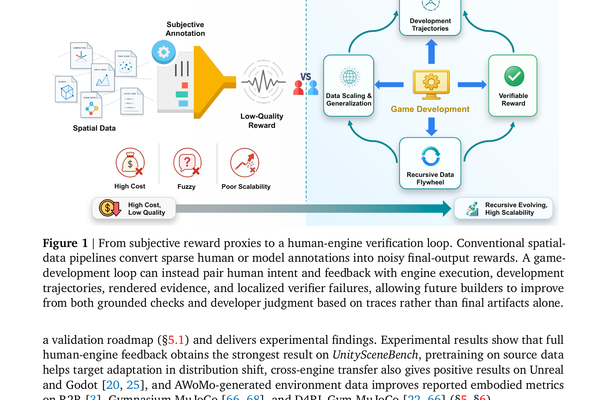
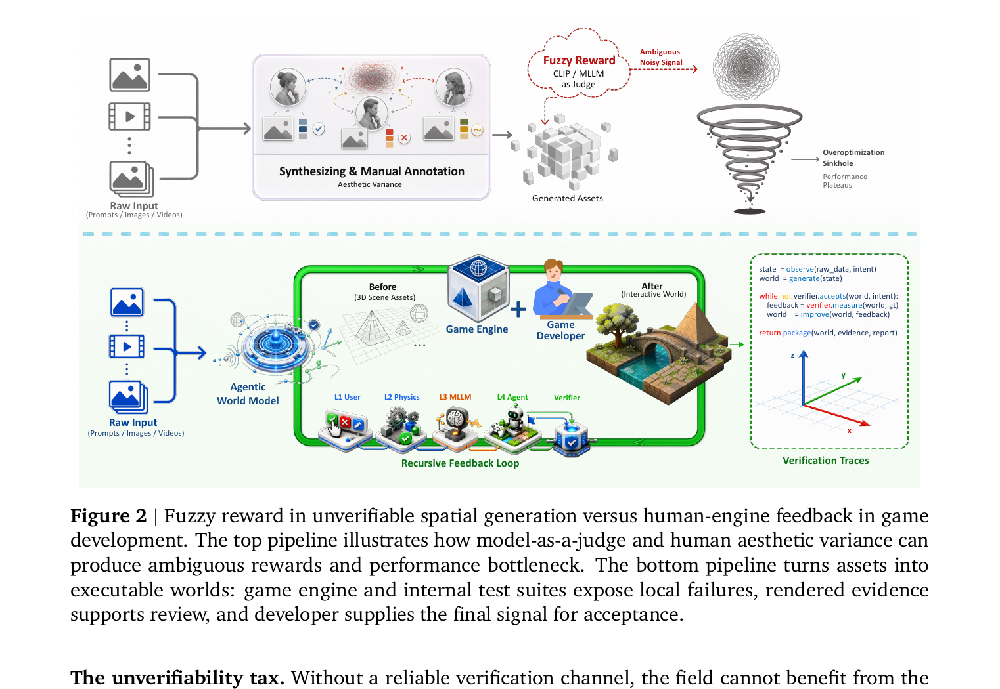
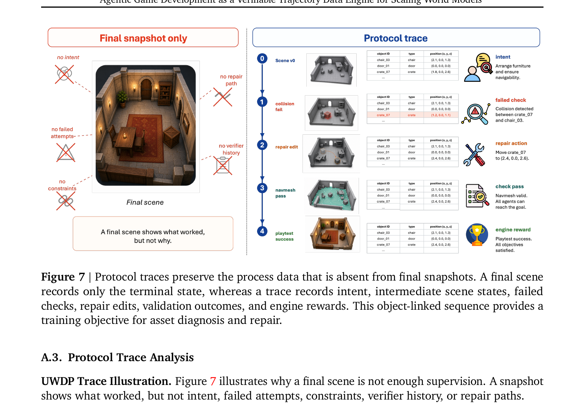
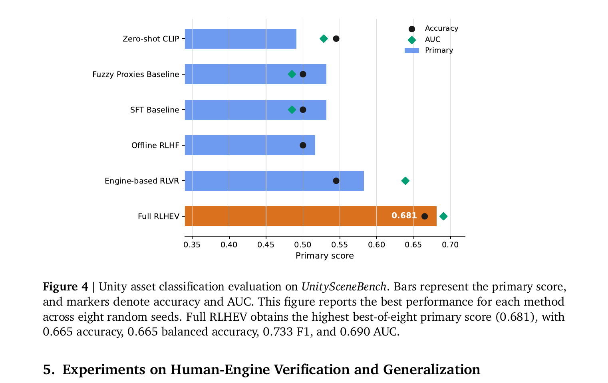

# AWoMo / RLHEV 阅读笔记

**论文**: Agentic Game Development as a Verifiable Trajectory Data Engine for Scaling World Models  
**arXiv**: 2608.25518 | **GitHub**: https://github.com/LanceZPF/cardinal-preview  
**机构**: NUS (HPC-AI Lab) + InfRec (Cardinal AI Lab) + UC Berkeley + HKUST  
**时间**: 2026-08-26

---

## 1. 一句话定位

空间智能的瓶颈不是数据量或算力不足,而是缺乏可验证的奖励信号。本文把游戏开发过程本身包装成一个递归数据引擎:引擎自动核查物理/碰撞/导航等结构性约束(廉价、可重复、难以游戏),开发者判断最终接受与否(稀疏但权威)。两者合一的 RLHEV 目标训练 AWoMo,效果媲美 code agent 用 compiler+human review 做 post-training 的路线。

---

## 2. 要解决的问题(动机)

| 领域 | 现有奖励 | 问题 |
|------|----------|------|
| 视频生成 | FVD、CLIP、MLLM-as-judge | 模糊、有噪、可游戏;验证 3D 物理一致性无自动手段 |
| 3D 生成 | 3D 扫描标注、视觉美观度 | 最大数据集仅 10^7 级,注释昂贵;无法判断新合成场景是否正确 |
| 世界模拟器 | 深度/法线/动态 GT | 密集物理标注极贵;采集无法规模化 |

核心断言——**可验证性不足(unverifiability tax)**:没有可靠的验证信道,领域就无法享受 RLVR 式的 post-training 范式;只能靠堆数据和算力换提升,效率天花板低。

$$
R_f(x, y) - Q^*(x, y) = \varepsilon(x, y) + b(x, y)
$$

`ε` 是零均值噪声、`b` 是系统偏差。偏差比噪声更危险:按 `R_f` 优化会单调提升代理指标同时压低真实质量(reward hacking),规模越大放大越明显。

---

## 3. 与前作关系

```
视频/3D 世界模型 (Genie, GameGen-X, GameFactory)
  └── 交互式世界模拟,但无结构化可执行验证
WorldCoder / Agent2World
  └── LLM 写代码构建场景,但目标是"通过的场景",不是"开发轨迹本身作为训练信号"
GameDevBench / GameGen-Verifier
  └── 评测 agentic 能力,非 post-training 数据引擎
AWoMo / RLHEV (本文)
  └── 把游戏开发轨迹(intent→edit→check→repair→review)包装成
       递归自我改进的 post-training 数据流水线
```

最直接的类比:**code agent = compiler(dense) + human review(sparse)**,本文 = **engine verifier(dense) + developer acceptance(sparse)**。

---

## 4. 核心方法

### 4.1 AWoMo 系统边界

AWoMo 不是单一神经网络,而是耦合了以下四个接口的 agentic 工作流:

| 接口 | 内容 |
|------|------|
| **Intent** | 任务简报、参考图像、设计约束 |
| **Action** | 场景程序、资产编辑、工具调用、修复动作 |
| **Verification** | 引擎输出:碰撞检测、物理稳定性、navmesh 通达性、脚本执行、bounded playability probe |
| **Review** | 开发者的接受/拒绝/修改意见 |

执行循环:`propose → render → verify → repair → review`,每次循环结果存为 UWDP 轨迹。

### 4.2 UWDP(Unified World-Development Protocol)

$$
u_t = (b,\, o_t,\, s_t,\, a_t,\, g_t,\, v_t,\, h_t,\, \rho_t)
$$

| 字段 | 含义 |
|------|------|
| `b` | 设计意图(prompt-based brief) |
| `o_t` | 稳定对象/关系/场景区域 ID(把失败检查关联到具体对象) |
| `s_t` | 空间/语义/物理/证据状态 |
| `a_t` | 编辑或工具动作 |
| `g_t` | 引擎/测试套件输出(gates + 诊断) |
| `v_t` | 渲染证据(供 reviewer 可视化判断) |
| `h_t` | 开发者决定(接受/拒绝/修改意见) |
| `ρ_t` | 修复链接、编辑成本、残余风险 |

📌 **Final snapshot vs. protocol trace**:最终场景只记录了"发生了什么";轨迹还记录了"意图是什么、哪里失败过、怎么修复的、为什么被接受"。实验显示:protocol trace Spearman=0.719±0.094 vs. snapshot-only 0.159±0.168(0 个 source 样本下),差距约 0.56。

### 4.3 RLHEV 奖励公式

$$
r_{\alpha,\beta}(\mathbf{x}, \mathbf{a}) = \mathbb{1}\{\mathbf{g}(\mathbf{x},\mathbf{a})=\mathbf{1}\} \cdot (\alpha h(\mathbf{x},\mathbf{a}) + \beta e(\mathbf{x},\mathbf{a})) - \lambda_c c(\mathbf{x},\mathbf{a})
$$

- `g(x,a)` = binary engine hard gates(全通才计入奖励)
- `h(x,a)` = human utility(0 or 1,接受/拒绝)
- `e(x,a)` = normalized engine reward
- `c(x,a)` = optional cost/risk penalty
- 主实验:`α=0.65, β=0.35, λ_c=0`;Offline RLHF ablation:`(α,β)=(1,0)`;Engine RLVR:`(0,1)`

**离线正则化目标**:

$$
\max_\theta\ \mathbb{E}_{(\mathbf{x},\mathbf{a})\sim\mathcal{D}}[w(\mathbf{x},\mathbf{a})(r_{\alpha,\beta}(\mathbf{x},\mathbf{a}) - b(\mathbf{x}))\log \pi_\theta(\mathbf{a}|\mathbf{x})] - \lambda_\text{KL}\mathbb{E}_\mathbf{x}[D_\text{KL}(\pi_\theta(\cdot|\mathbf{x})\|\pi_0(\cdot|\mathbf{x}))]
$$

### 4.4 奖励梯度(Ladder of Reward)

```
validity      → 能加载,manifold 完整
physical      → 物理稳定(物体不穿模)
functional    → navmesh 通达,目标可达
playability   → agent / 人类玩家能完成任务
```

引擎检查便宜、可重复、失败可定位到具体对象。随模型能力增强,可持续加入新的 probe 类型。

### 4.5 核心模型 (UnifiedGameAssetModel)

- 初始化自 Cosmos 3(MoT 架构,2.890B 参数,hidden 3584,8 transformer layers,4 attention heads,4 gated experts)
- 继续预训练于 AWoMo manifest:87,745 接受 + 504 拒绝样本(Unity 7,423 / Unreal 9,678 / 3D assets 3,194 / MuJoCo 2,946 / Godot 2,685 / 3DGS 12 + text 87,745 / image 53,426 / mesh 3,194)
- 训练:8 A100,batch 4096,grad accum 2,选 step 589 by val loss

---

## 5. 图解



> **Fig 1 解读**:
>
> **(左) 传统管线**——空间数据(点云/视频/场景图等)经过人工标注或模型合成生成 asset,再由主观注释人/MLLM 打分形成"Low-Quality Reward"。缺点三角:高成本、模糊、扩展性差。沿底部进度条走向右端时,代价是"High Cost, Low Quality"。
>
> **(右) Game Development 循环**——游戏引擎 + 开发者构成四节点 flywheel:① Development Trajectories(轨迹)→ ② Verifiable Reward(可验证奖励)→ ③ Recursive Data Flywheel(递归数据飞轮)→ ④ Data Scaling & Generalization(规模化泛化)。进度条右端为"Recursive Evolving, High Scalability"。
>
> **核心对比**:传统范式用最终 artifact 打分,丢失了过程信息;游戏开发管线把 intent/check/repair/acceptance 全程录制成轨迹,同时提供局部密集奖励(引擎)和全局稀疏判断(开发者)。



> **Fig 2 逐段解读**:
>
> **(上半)模糊奖励 pipeline**——Raw Input(prompt/图/视频) → 合成 & 人工标注 → 生成 Assets → CLIP/MLLM as Judge 打出 Fuzzy Reward → Ambiguous Noisy Signal 反馈训练。训练信号在奖励高维空间中螺旋聚拢走向 Overoptimization Sinkhole + Performance Plateaus。
>
> **(下半)Human-Engine 反馈 pipeline**——Raw Input → AWoMo(Agentic World Model)→ Game Engine + Game Developer 协作构建 Interactive World。右侧伪代码说明执行逻辑:`while not verifier.accepts(world, intent): feedback = verifier.measure(world, gt); world = improve(world, feedback)`。最终 `return package(world, evidence, report)`。右侧坐标轴表示几何可验证的三维场景空间,Verification Traces 是沿轨迹记录的结构化数据。
>
> **关键洞见**:下半 pipeline 中人类 reviewer 的判断不再基于原始生成 artifact,而是基于引擎预先筛查后的候选(passed hard gates)和渲染证据——人力被解放用于判断全局接受度,而非逐碰撞点手检。



> **Fig 7 逐格解读**:
>
> **(左) Final snapshot only**——只有最终的 3D 室内场景渲染图,带 5 个红色 ✗ 标注:no intent(意图未记录)、no failed attempts(失败尝试丢失)、no repair path(修复路径丢失)、no verifier history(验证历史丢失)、no constraints(约束信息丢失)。"A final scene shows what worked, but not why."
>
> **(右) Protocol trace** 五步序列:
> - **Step 0 (Scene v0)**: 初始场景 + 对象表(chair_03 位于 [2.1,0,1.3]、crate_07 位于 [1.8,0,2.6])。意图:Arrange furniture and ensure navigability。
> - **Step 1 (collision fail)**: 引擎检测到 crate_07 与 chair_03 碰撞(表中 crate_07 行高亮变红,位置改为 [1.2,0,1.1])。Failed check。
> - **Step 2 (repair edit)**: Agent 执行修复动作:Move crate_07 to (2.4, 0.0, 2.6)。
> - **Step 3 (navmesh pass)**: Navmesh 检查通过,All agents can reach the goal。
> - **Step 4 (playtest success)**: Playtest 成功,engine reward 颁发。
>
> 每步都有渲染图、对象状态表、文字动作描述和引擎结论,共同构成可用于 next-edit prediction、preference modeling、RL state-action-reward update 的训练信号。

---

## 6. 关键超参 / 配置

| 参数 | 值 | 说明 |
|------|----|------|
| `α` (human weight) | 0.65 | RLHEV 主实验人类信号权重 |
| `β` (engine weight) | 0.35 | 引擎信号权重 |
| `λ_c` | 0 | 无成本惩罚(RLHEV 主结果) |
| 模型参数量 | 2.890B | UnifiedGameAssetModel |
| 预训练样本 | 87,745 accepted + 504 rejected | UWDP 格式 |
| 训练硬件 | 8 A100 | batch 4096, grad accum 2 |
| MLLM judge | Qwen3.6-35B-A3B | 评估用,非训练信号 |

---

## 7. 实验结果



> **Fig 4 解读**:横轴 Primary score = 0.45 balanced accuracy + 0.25 accuracy + 0.20 F1 + 0.10 AUC。六种方法由低到高排列。Full RLHEV(橙色)达到 **0.681**,明显高于其他所有方法;Engine-based RLVR(蓝色,约 0.55)是第二名;SFT Baseline 和 Fuzzy Proxies Baseline 均约 0.49–0.51;Zero-shot CLIP 约 0.48。Engine-only 方法显示引擎信号本身有效,但加入人类验证信号后再提升 0.12+。

**主要结果汇总**:

| 方法 | Primary | Accuracy | F1 | AUC |
|------|---------|----------|-----|-----|
| Zero-shot CLIP | ~0.48 | — | — | — |
| Fuzzy Proxies | ~0.49 | — | — | — |
| SFT Baseline | ~0.50 | — | — | — |
| Offline RLHF | ~0.51 | — | — | — |
| Engine RLVR | ~0.55 | — | — | — |
| **Full RLHEV** | **0.681** | **0.665** | **0.733** | **0.690** |

注:`Figure 4` 报告的是 8 seeds 的 best-of-8 结果(非 seed-averaged),Figure 5(a) 才是 mean±std 鲁棒性曲线。

**生成质量** (Table 3): Full RLHEV 在 720 样本下生成质量 0.8197 vs. Engine RLVR 0.7934。

**OOD 泛化 & 跨引擎迁移**:

| 场景 | Scratch | Target-adapted |
|------|---------|----------------|
| Unity → held-out Unity | 0.25 | **0.75** |
| Unity → Unreal | 0.25 | **0.35** |
| Unity → Godot | 0.15 | **0.35** |

**具身诊断**:

| 基准 | Naive aug. | AWoMo-aug. |
|------|-----------|------------|
| R2R success rate | +0.22% | **+0.79%** |
| Gymnasium MuJoCo rollout return | +5.07% | **+9.96%** |
| D4RL Gym-MuJoCo normalized score | +39.68% | **+48.43%** |

---

## 8. 争议与权衡

| 维度 | 作者立场 | 风险/反驳 |
|------|----------|----------|
| **Sim-to-real** | 游戏引擎是 verifier-rich 的扩展底座,不是现实的直接桥梁 | 当前实验无真实扫描/机器人闭环;跨引擎能力可能是 engine-specific 过拟合 |
| **引擎奖励也可被游戏** | 承认;建议 verifier ensemble + randomized probes + human review | Engine reward 是 partial verifier,不是 oracle |
| **3D 廉价数据将解决问题?** | 廉价扫描不等于廉价验证;扫描只记录"发生了什么" | 反驳合理;但合成数据 + 学习验证器的路线仍可能绕过引擎依赖 |
| **视频生成进步很快** | 进步是 imitation+compute-bound,缺乏物理一致性自我改进回路 | 正确,但也可能 video foundation model 的 scale 会给出更好的 world prior |
| **评测是 best-of-8 而非平均** | 额外提供了 mean±std 曲线 | Fig 4 展示的是 best-of-8,单次结果会有 ±0.05 波动 |

---

## 8. 一句话总结

AWoMo/RLHEV 的关键贡献是**论证框架**而非算法:把游戏开发过程(intent+edit+engine check+repair+acceptance)包装成廉价、自动、递归的空间智能后训练信号,填补了"视频/3D 生成领域没有可靠可验证 reward"这个 scaling 瓶颈的空白;当前实验是 controlled pilot,最终目标是自动构建、游戏 agent 玩测、结果喂给下一代模型的完整 flywheel。

---

## Q&A

**Q: UWDP trace 相比 final snapshot 的 Spearman 相关系数提升如此大(0.159→0.719),说明了什么?**

A: 说明模型质量的预测信号主要藏在过程数据里,不在最终 artifact 里。Final snapshot 只有格式 tag、prompt 长度、asset 数量等粗粒度元信息;protocol trace 额外提供了 accept/reject label、deviation type、target-engine ID、used-asset identity 等开发过程信号。这些信号增量携带着"为什么被接受/拒绝"的因果链,让排名模型能学到可迁移的判断模式——即使只有 8 个 labeled target 样本,cross-engine Spearman 也在 0.7 以上。

---

**Q: AWoMo 的核心模型 UnifiedGameAssetModel 是什么架构?**

A: 以 Cosmos 3 的 Mixture-of-Transformers(MoT)为基础,post-train 而来。2.890B 参数,hidden width 3584,8 Transformer layers,4 attention heads,4 gated experts(门控路由让不同 modality 的 token stream 流向不同专家)。具有 game-asset 专用的解码头:支持 Unity、Godot、Unreal、MuJoCo 的场景程序和网格表示。实验用 8×A100,continued pretraining 在 AWoMo manifest 上,step 589 by validation loss。
