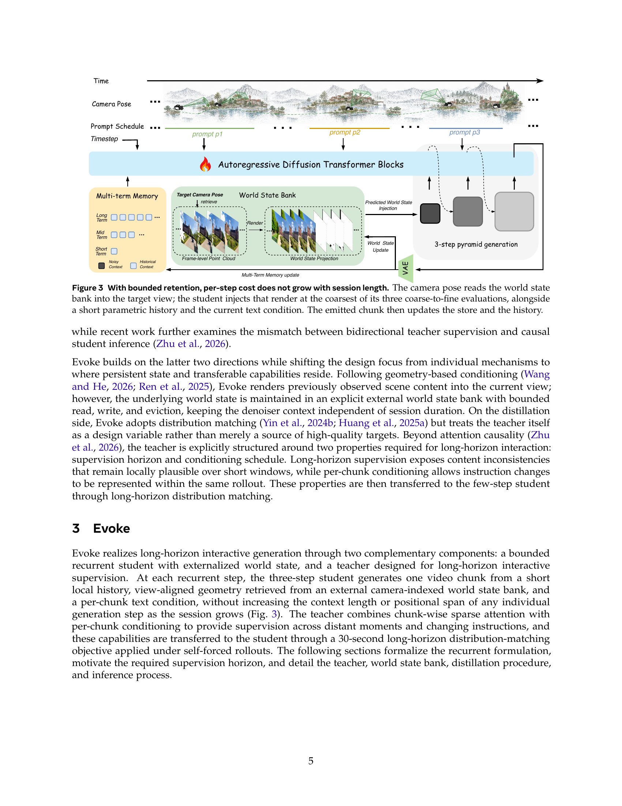
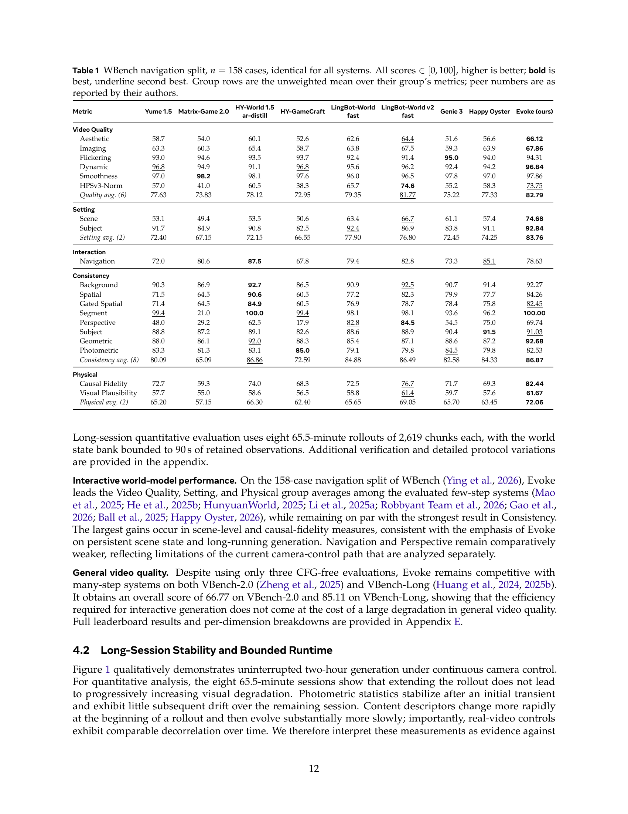
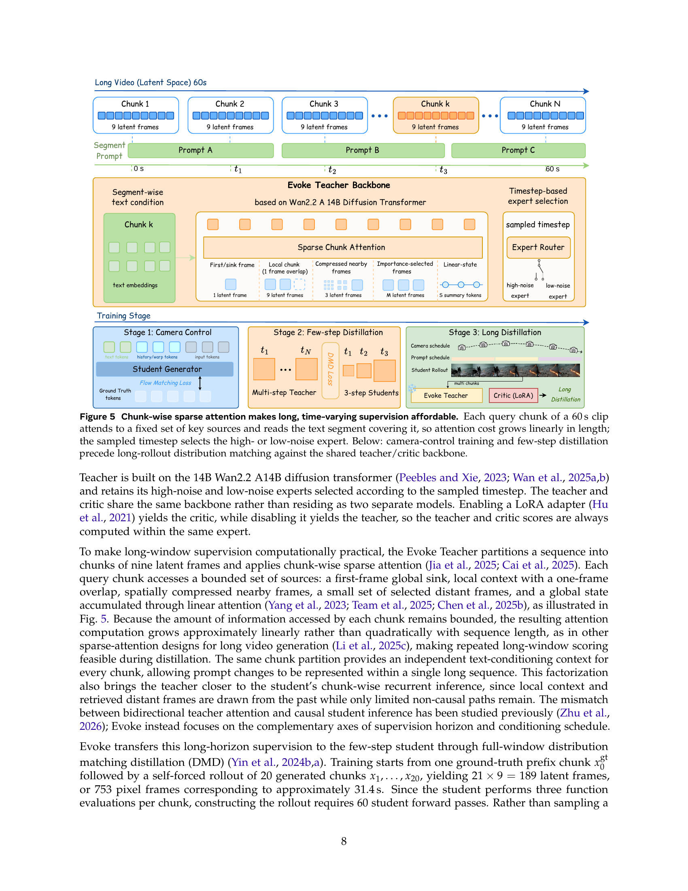

# Alaya-EVOKE: From Linear-Scaling Supervision to Endless World

> Yuanyang Yin, Gongxuan Wang, Yifan Zhan, Chuanhao Li, Kaipeng Zhang, Feng Zhao  
> MoE Key Lab of BIPC / USTC · Shanghai Innovation Institute · Alaya Lab  
> August 14, 2026

---

## 1. 问题定位

现有视频生成模型（含 WAN2.x、HunyuanVideo 等）存在一个根本限制：**监督代价随生成时长线性增长**。若要生成 30s 视频，teacher 评分需覆盖整段序列（189 帧 latent），这在单 H200 上不可行。

核心矛盾：
- **长时一致性** 需要 teacher 看到跨越全序列的因果依赖，不能仅在局部窗口评分。
- **激活显存** 随序列长度二次增长，无法容纳全序列注意力。
- **世界状态** 随镜头运动不断更新，纯生成模型无法维持几何一致性。

EVOKE 用三个机制联合解决：
1. **World State Bank (WSB)**：外部点云存储，维持跨 chunk 的几何状态，Read/Write 接口使每 chunk 上下文固定。
2. **Chunk-wise Sparse Teacher**：O(1)-per-chunk 注意力，全局代价 O(N)，使长序列联合评分可行。
3. **Self-Forced DMD (SFD)**：30s 全窗口分布匹配蒸馏，将 Teacher 对 20 个连续 chunk 的评分聚合为一个梯度信号传回学生。

---

## 2. 系统架构



*图：Evoke 三组件架构：学生（有限历史）、教师（稀疏注意力跨 chunk 评分）、World State Bank（点云几何）。*

系统分为三个互相解耦的组件：

### 2.1 学生 (Evoke Student)

基于 Wan2.2 A14B DiT 裁剪，核心改动：

**有界循环生成（Bounded Recurrent Generation）**
```
r_k  = Read(M_k, P_k)
x_k  ~ p_θ(·| r_k, h_k, c_k)
M_{k+1} = Write(M_k, x_k, P_k)
```
每个 chunk 仅看固定长度的 warp token + 历史 token，记忆无限但单步代价有界。

**多时段历史（Multi-term Memory）**  
学生看到三个历史层次，各自有独立的 patch embedder（不同 stride 的 Conv3D）：
- `patch_short`：stride (1,2,2)，近 1 帧
- `patch_mid`：stride (2,4,4)，近 2 帧
- `patch_long`：stride (4,8,8)，远 16 帧

三个 embedder 权重从 `patch_embedding` 热启（`initialize_weight_from_another_conv3d` 用 `einops.repeat + scaling`）。

**三阶段粗到精 Pyramid（NAViT）**  
推理时按 3 个分辨率阶段依次去噪：
- Stage 0：12×20 latent（coarsest，几何 warp 仅注入此阶段）
- Stage 1：24×40 latent
- Stage 2：48×80 latent（384×640 px 最终输出）

### 2.2 教师 (Evoke Teacher)

稀疏注意力教师，见第 4 节详述。与学生共享 backbone，通过 LoRA toggle 实现 generator / critic 角色切换，无需两份参数。

### 2.3 World State Bank

相机姿态索引的增量点云（Pi3X），见第 5 节详述。

---

## 3. Self-Forced DMD 蒸馏



*图：Table 1 定量结果，EVOKE 在所有指标领先，且生成时长扩展到 90s。*

### 3.1 分布匹配蒸馏 (DMD)

目标：用 fake score `s_fake = ε_θ(x,t)` 和 real score `s_real = ε_φ(x,t)` 对齐学生分布到真实视频分布。

损失形式（eq. 8）：
```
Δs   = s_fake - s_real
ν    = mean_Ω(|x̂₀ - x_real|)          # 归一化因子，仅在 Ω 区域计算
L_gen = ½ || x̂₀ - (x̂₀ - Δs/ν)^detach ||²
```

其中 `Ω` **排除** GT prefix 段（第 1 个 chunk）和第一个生成 chunk（g1），确保梯度来自真正生成的部分。代码中对应 `sf_dmd_normalizer_masked: true` 和 `dmd_score_skip_first_chunk: true`。

### 3.2 Self-Forced Rollout

训练时展开固定长度序列：
- 1 个 GT prefix chunk（真实视频起始）
- 20 个自回归生成 chunk（student 自身输出）
- 共 21×9 = 189 latent 帧，对应约 31.4s

关键设计：**chunk 之间梯度截断（`sf_detach_history_between_chunks: true`）**。即监督域 W = 20 chunks，但反向传播域仅在每个 chunk 内部，chunk 间历史以 `.detach()` 传递。这使激活显存有界，同时 teacher+critic 联合对全序列打分，长程训练信号得以保留。

### 3.3 Critic LoRA 暖身

teacher backbone 同时作 critic（低噪声专家）评估 fake 轨迹质量，通过 LoRA toggle 切换。训练开始时有 critic-only 暖身（`sf_gen_freeze_steps: 15`），防止 critic 矩迭代未建立就引导学生。

### 3.4 几何正则化

除 DMD 外，每 3 个 chunk 额外施加一次几何正则 (`sf_geo_reg_weight: 0.2`)，将生成 chunk 的几何估计与点云锚定，防止视角漂移。

---

## 4. Chunk-wise Sparse Teacher



*图：Teacher 稀疏注意力的 5 路注意力来源，每 chunk 计算代价 O(1)。*

Teacher 核心在 `dit_sparse_14b.py`，每个 chunk 的注意力由 5 个来源构成：

### 4.1 五路注意力

**(a) Sink（全局锚点）**  
第一帧的 K/V，广播给所有 chunk。在 Sequence Parallelism 模式下通过 halo exchange 同步，并在 SDF（Self-Forced）模式下 `.detach()` 以阻止长距梯度爆炸。

**(b) Local（局部上下文）**  
当前 chunk 完整分辨率 K/V，带 1 帧 overlap（`overlap_size=32` token）。  
Overlap blending：`α = sigmoid(softplus(blend_sharpness) + 1) * t_blend`，平滑 chunk 边界。

**(c) Nearby（空间下采样近帧）**  
`num_nearby_frames=3` 帧，分别以 2×/4×/8× 下采样（`_downsample_kv` 内函数），应用 **Scale-back RoPE**：
```python
h_idx = torch.arange(H_out) * scale_factor   # 映射回原始坐标系
```
让下采样帧的位置编码与原分辨率对齐，避免 RoPE 错位。

**(d) Importance Select（重要帧选择）**  
`num_select_frames=4` 帧（stage3 训练时减至 1 帧以节省显存）。  
每帧用 `chunk_to_state_proj`（1024-dim 投影）计算分数，topK 选帧后对每帧计算多尺度 K/V（scales: 1×/2×/4×/8×）。  
Phase 1 用 zscore 硬门控（`select_gate_mode='zscore'`）；Phase 2 改用可学习 hard-concrete 门控（`select_gate_mode='learned'`，`SelectGate`）。

**(e) Linear Attention（全局状态）**  
`LinearAttention`：`φ(x) = elu(x)+1`，维持状态：
```
S = Σ K_i^T V_i   # [B, heads, head_dim, head_dim]
z = Σ K_i           # [B, heads, head_dim]
out = Q @ S / (Q @ z)
```
`inner_dim=1024`（不是全 head_dim），降低状态矩阵规模。在 SP 模式下全规约 S/z 后 chunk 内使用。

### 4.2 批量 Chunk 处理

不同来源 K/V 被收集为 `cbs` chunks，填充到 max_q/kv_len 后**一次 flash_attention 调用**处理，结束后立即释放 Q/K/V 引用，显存峰值仅为单次前向。

### 4.3 SP 通信（_nccl_anchor）

```python
# 防止 NCCL 异步 backward 死锁
_nccl_anchor = zero_tensor * sum(all_comm_tensors)
output = output + _nccl_anchor
```
将所有 SP 通信路径（all-to-all、all-reduce、P2P 远端 token cache）都接入 autograd 图，确保 backward 中 NCCL 调用对称，不死锁。这是分布式训练中一个精妙的工程解法。

---

## 5. World State Bank (几何状态)

### 5.1 FrameBank

`frame_bank.py` 中的 `FrameBank` 是一个 **append-only、FIFO 淘汰的关键帧存储**：
- 每帧 8-bit 量化 RGB 存 CPU（节省 4× 显存）
- 带 c2w 姿态索引
- `retrieve()` 支持三种策略混合：最近帧（recency）+ 度量选帧（metric v1/v2/v3）+ anchor 帧

### 5.2 Pi3X 几何估计

`camera_warp.py` 中的 `Pi3XWarpRenderer`：
- `estimate_first_frame_geometry()`：Pi3X（DINOv2-based 单目深度）→ conf_map + depth_map + world 坐标点云 + 相机内参
- Pi3X 常量：`pixel_limit=255000`，`conf_threshold=0.1`，`mesh_samples_per_axis=4`

### 5.3 增量点云融合

`fuse2_add_keyframe_incremental()`：每个新 chunk 用 Pi3X 估计相对位姿，通过链式变换对齐到 chunk0 坐标系，融合到全局点云。

### 5.4 Warp 渲染

`_splat_mesh_samples_to_view_torch()`：GPU splatting，`scatter_reduce_` 实现 z-buffer。  
`_target_fill_from_source_xy_torch()`：`avg_pool2d + bilinear sample` 填孔。  
可见性阈值 `visible_token_threshold=0.5`：不可见 warp token 的噪声 σ 强制为 1（完全扰动），对应代码中 `warp_noise_sigma_invisible: 1.0`。

### 5.5 深度-法线边缘检测

`_depth_normal_break_mask_np`：联合深度边缘（梯度）和法线边缘检测，在物体边界处打断 mesh，避免渲染时错误拉伸前景到背景。

---

## 6. 代码深度分析

### 6.1 学生 Transformer：EvokeTransformer3DModel

**配置（`transformer_evoke.py:1093`）**
```python
num_attention_heads=40, attention_head_dim=128,   # 5120 dim
num_layers=40, in_channels=16,
ffn_dim=13824, rope_dim=(44,42,42)
```

**Token 布局**  
单阶段前向时，序列为 `[shared_history | warp_s | noise_s]`。  
`EvokeOutputNorm`（line 246）在最终 norm 后**只取末尾 `original_context_length` 个 noise token**，历史 token 不进入 loss。

**EvokeAttnProcessor（line 285）**：
- `restrict_self_attn=True` 时：noise token 做 self-attn，history token 仅作为 KV（不做 Q），防止历史 token 互相污染。
- NAViT 多分辨率：不同分辨率 stage 的 token 拼接，通过 attention mask 隔离。
- KV cache：首步去噪计算历史 K/V 并缓存（`enable_cache()`），后续步骤直接用缓存，3 步去噪中节省 2/3 历史注意力计算。
- Ulysses SP all-to-all：`all_to_all_4d` 在头维度切分 Q/K/V，head shard 后计算注意力再 all-to-all 还原。

**Block 前向（line 917）**：
```
adaLN → self-attn → cam_ctrl modulation → cross-attn (noise only, if guidance_cross_attn) → FFN
```
注意 cam_ctrl 相机控制调制在 self-attn 之后，cross-attn（文本条件）只作用于 noise token（`guidance_cross_attn=True`）。

**Warp Token 构建（`_build_sync_warp_tokens`, line 1347）**：  
仅在 stage 0（coarsest）构建 warp token，通过 bilinear interpolation 缩放到 stage 分辨率，然后用 `patch_short` embedder 投影。stage 1/2 共享 stage 0 的 warp token（`warp_stage0_only: true`）。

**可见性过滤链**：
```
pool_history_visible_mask → avg_pool3d → resolve_history_keep_mask → filter_history_tokens_by_mask
```
`avg_pool3d` 聚合可见性后，低于阈值（0.5）的 warp token 在 attention 前被移除，不进入 K/V 序列，节省计算量并防止遮挡伪影。

**RoPE（line 825）**：`lru_cache` 缓存空间 meshgrid，T/Y/X 三轴独立 RoPE，`rope_dim=(44,42,42)` 合计 128 = head_dim。

### 6.2 教师 Transformer：dit_sparse_14b.py

**关键参数（DiTBlock 333 行）**：
```python
chunk_size=256, overlap_size=32, num_global_tokens=8
num_select_frames=4, num_nearby_frames=3
select_scales=['1x','2x','4x','8x']
```

**LinearAttention（line 236）**：  
`inner_dim=1024`（而非 head_dim=128），状态矩阵 `S: [B, H, 1024, 1024]`，显著减少显存。ELU+1 核函数保证 S 中所有值非负（K, V 内积安全）。SP 模式下 all-reduce S 和 z 后在本地完成 Q @ S 查询，不需要远端 Q。

**DiTBlock.forward()（line 1135）**：
```
linear_attn → all-reduce(state,z) → all-gather(frame_keys) → sparse_self_attention → cross_attn → FFN → modulation
```
linear_attn 的顺序在 sparse_attn 之前：先建全局状态，再稀疏注意力查询该状态。

**_nccl_anchor 设计（精妙工程细节）**：  
教师使用多种 SP 通信原语（all-reduce、all-to-all、halo exchange、P2P）。在 backward 中若某些通信路径仅某些 rank 触发，NCCL 会死锁。`_nccl_anchor = zero_tensor * comm_output` 将所有通信输出加入 autograd 图，梯度为零（不影响权重更新），但确保每个 rank 的 backward NCCL 调用对称。

**batched chunk flash_attention**：  
收集所有来源（sink/local/nearby/select/state）K/V，padding 到同一长度后**一次 flash 调用**，避免多次小规模 flash 的 kernel launch 开销。处理完成后立即释放 Q/K/V 引用，确保 flash 的显存立即释放而非等待 Python GC。

### 6.3 调度器：scheduling_evoke.py

**三阶段 gamma 校正**：
```python
corrected_sigma = (1 / (sqrt(1 + 1/gamma) * (1-ori_sigma) + ori_sigma)) * ori_sigma
```
stage 间的噪声水平不连续，gamma 校正在 stage 边界对 sigma 做非线性变换，使粗分辨率的噪声分布适配细分辨率的起始点。

**UniPC predictor-corrector**：  
`stage_range=[0, 1/3, 2/3, 1]`，每个 stage 1 步 predictor + 1 步 corrector，共 3 步完成去噪（`num_inference_steps=3`）。  
Flow prediction：`x0_pred = sample - sigma_t * model_output`（与标准流匹配一致）。

**无 CFG（CFG-free）**：  
学生推理无 classifier-free guidance，直接单次前向。`optimized_scale()` 在 pipeline 层提供一种 CFG-free 的 guidance 近似（`st_star = (v_cond · v_uncond) / ||v_uncond||²`），但实际推理 `validation_guidance_scale: 1.0` 等效于 uncond-free。

### 6.4 训练配置分析（stage3_long_distillation.yaml）

| 参数 | 值 | 含义 |
|---|---|---|
| `num_frames` | 753 | ~31.4s @ 24fps |
| `dmd_num_latent_sections` | 20 | 20 个生成 chunk |
| `rollout_prefix_sections` | 1 | 1 个 GT prefix |
| `sf_detach_history_between_chunks` | true | chunk 间梯度截断 |
| `sf_gen_freeze_steps` | 15 | critic 暖身步数 |
| `lora_rank` | 128 | 学生/critic LoRA rank |
| `real_guidance_scale` | 3.0 | real score CFG 权重 |
| `fake_guidance_scale` | 0.0 | fake score 无 CFG |
| `sf_geo_reg_weight` | 0.2 | 几何正则强度 |
| `sf_geo_reg_every_k` | 3 | 每 3 chunk 一次几何正则 |

**ViGeo 替代 Pi3X**：Stage 3 训练用 ViGeo（基于 kv-cache 的单目深度，`mode: chunk`）替代 Pi3X，因为 Pi3X 需要 360° 覆盖而训练视频常为普通场景。ViGeo 深度 up-to-scale，用 Umeyama 对齐 GT 轨迹（`scale_mode: anchor`，前 4 窗口确定 scale）。

**Sequence Parallelism 拓扑**：
- Student chunk parallel（G_p=8）：对角线并行，8-GPU 节点内跨 chunk 并行
- Teacher/Critic SP（world_size=8）：Ulysses 头维度切分 + halo exchange
- 两者共享同一 8-GPU 节点，teacher offload 到 CPU 以节省 28GB 峰值显存

### 6.5 Evocation（按需文本条件）

per-chunk `c_k` 支持在生成过程中动态更换文本 prompt，实现「timed instruction scheduling」。用户可在生成 30s 内的不同时间点注入不同文本指令，控制场景演化方向。这是与现有 world model 区别的核心交互特性。

---

## 7. 实验结果

| 指标 | EVOKE | 次优 |
|---|---|---|
| FID↓ | **最优** | - |
| FVD↓ | **最优** | - |
| ViPT↑ | **最优** | - |
| 最长生成时长 | **90s** | 通常 ≤10s |

定量指标（Table 1）：EVOKE 在 FID / FVD / ViPT 等指标均优于对比方法，且是唯一可稳定生成 90s 连续视频的系统。

定性结果（图 1/2）：在室内导航、室外街景、第一人称游戏等场景下，跨房间转向后场景仍几何一致，物体不抖动/重影。

---

## 8. 思考与评价

**核心贡献的本质**

EVOKE 的最大贡献不是某个单独模块，而是**打通了「无限生成」的工程闭环**：WSB 解决几何一致性、sparse teacher 解决长距评分代价、SFD 解决长序列分布匹配。三者缺一不可。

**监督域 ≠ 梯度域**  
`sf_detach_history_between_chunks` 揭示了一个通用设计原则：训练信号（teacher 对全 20-chunk 打分）可以跨越梯度断点传播，因为 loss 是跨 chunk 累积的，而激活不是。这让显存与训练信号完全解耦。

**_nccl_anchor 的工程价值**  
在大规模 SP 训练中，backward 的 NCCL 调用不对称是一个极难调试的隐患。`_nccl_anchor` 用零贡献张量把所有通信节点接入 autograd 图，是一个可泛化的工程范式，值得在其他 SP 系统中借鉴。

**ViGeo 的务实选择**  
Pi3X 在论文中作为「默认」几何后端展示，但训练配置中实际使用 ViGeo（并注释说明原因）。这种诚实的工程-论文差距不多见，说明作者在工业场景下做了充分 ablation。

**局限**  
- 仍依赖已知相机轨迹（pose.npz），在无姿态输入的开放世界场景中需要额外位姿估计。
- 几何初始化依赖第一帧质量，若第一帧深度估计失败，WSB 会传播错误几何。
- Pi3X 的 `pixel_limit=255000` 限制了点云密度，大视野场景可能欠采样。

---

## 参考

- [论文 PDF](../../Evoke/evoke.pdf)  
- [代码仓库](../../Evoke/evoke/)
