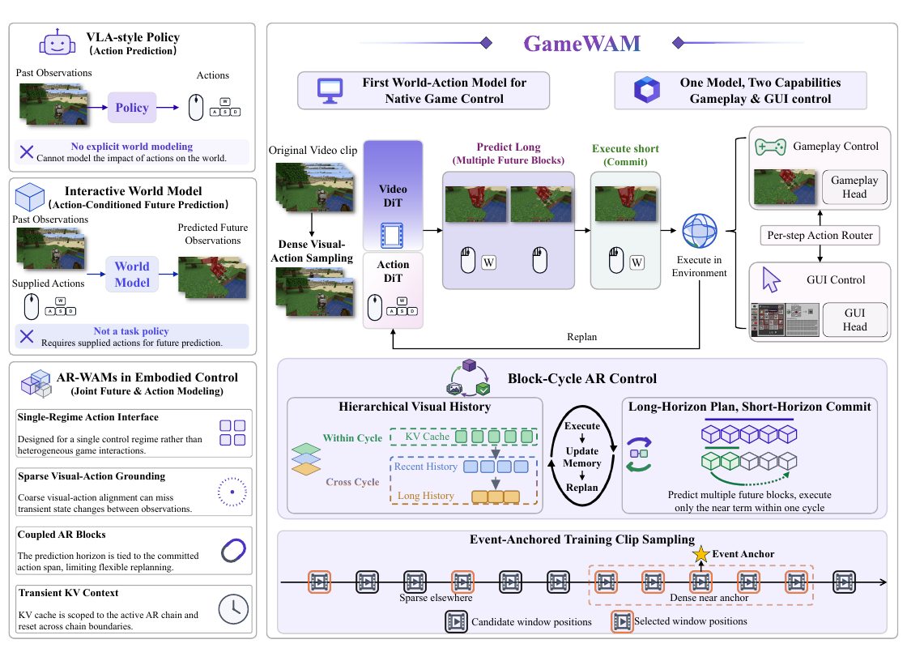
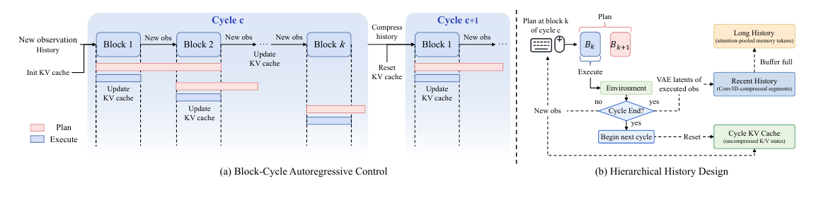
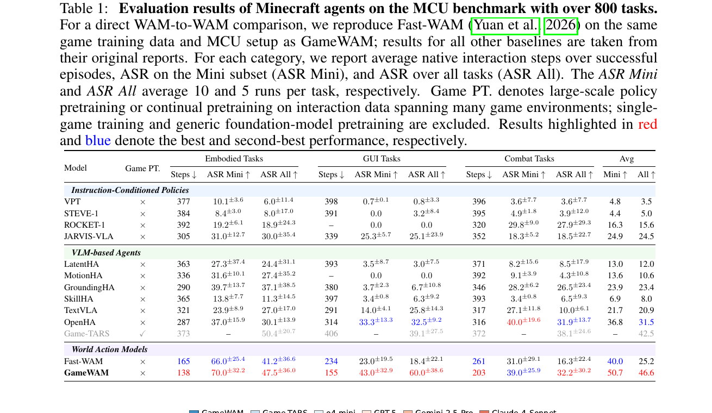
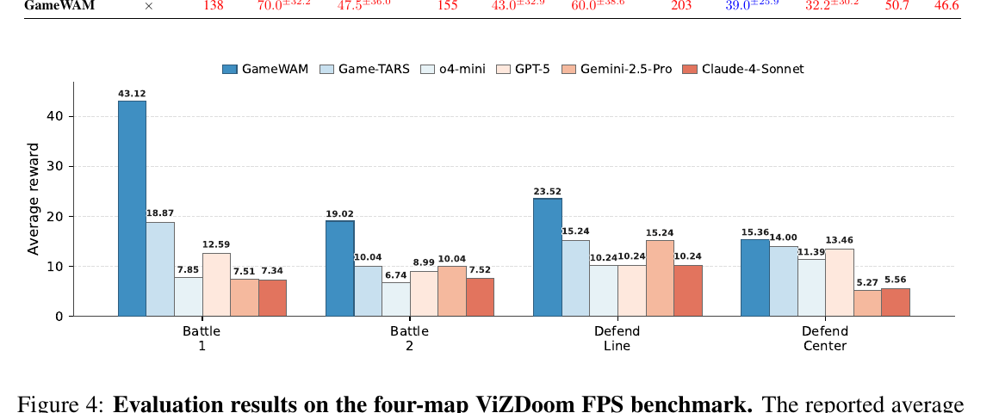
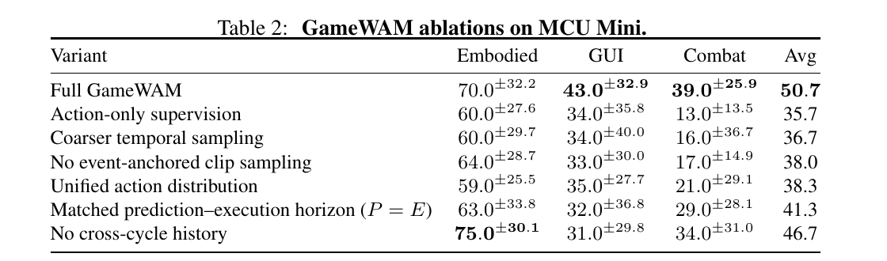
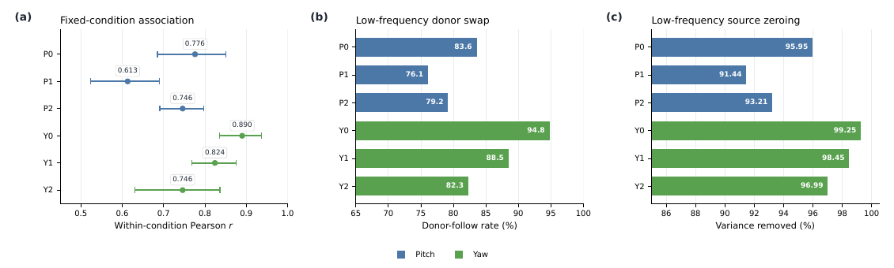
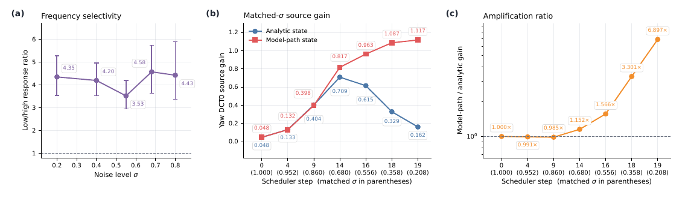

# GameWAM: A World Action Model for Video Games

> Yuncheng Guo¹, Zhanqiu Zhang²†, Yiwen Guo³†, Weijia Li⁴†  
> ¹复旦大学 ²**LIGHTSPEED（腾讯光子）** ³Independent Researcher ⁴清华大学深圳国际研究生院  
> [arXiv:2608.26200v2](https://arxiv.org/abs/2608.26200)（v2: 2026-09-10）· [project](https://yunncheng.github.io/GameWAM/)  
> † 三位并列通讯作者（一作非通讯）· 无 equal-contribution 标注

---

## 1. 一句话定位

**让一个模型同时干两件事：预测"世界会变成什么样"，以及决定"该按哪个键"。**

论文对 **World Action Model (WAM)** 的定义是：*"jointly generate future visual observations and executable action trajectories, using visual prediction to provide dynamics-aware supervision for control."*

三条路线的分工在这里被讲得很清楚：

| | 能自己选动作？ | 显式建模动作的视觉后果？ |
|---|---|---|
| **游戏 agent / VLA** | ✅ | ❌ |
| **交互式 world model** | ❌（动作要外部喂） | ✅ |
| **WAM** | ✅ | ✅ |

具体做法：**并行的 Video DiT + Action DiT**，block-causal attention，联合 flow matching；**predict-long/execute-short**（预测 P=16 步、只提交 E=8 步）；**原生键鼠动作空间**（Minecraft 22 维、ViZDoom 9 维，**无 tokenizer、无离散化**）；三级记忆（cycle 内 KV cache + recent FIFO + 长期 memory slots）。

MCU benchmark 上 Avg ASR Mini **50.7**、Avg ASR All **46.6**，都是第一；ViZDoom 四张图全部第一。

📌 **但这篇最有价值的部分不是分数，而是它自己发现并命名的一个失效模式——LASI（Low-Frequency Action Source Imprinting）**：**采样用的噪声 source 的低频分量，会被生成路径指数式放大，最终"盖印"到输出动作上**。论文为此做了一整套因果诊断（donor swap、source zeroing、antithetic、闭环置换检验 p=0.001），§6 详述。

⚠️ **同时要先说清两件事**：① **一篇以 world model 为卖点的论文，没有任何视频预测指标**（无 FVD/PSNR/SSIM/prediction error）；② **主结果全部建立在一个未被量化的 LASI 缓解措施上**——论文说不做缓解时"severe cases leaving almost no task completion"，但**没有给任何 with/without 的成功率对比**。

---

## 2. 要解决的问题

论文批评现有三类工作，逐条都有原句：

**① 游戏 agent / VLA 类——不建模世界动力学**

> *"their control ultimately maps visual and task context to native or abstract actions, often through discretized, semantic, or temporally compressed representations. While effective for behavior learning, these objectives do not explicitly model how the visual world evolves under executed actions, and their action abstractions may weaken the fine temporal and metric structure needed for **concurrent key control and continuous camera motion**."*

**② 交互式 world model——不是策略**

> *"they learn action-conditioned visual dynamics, but rely on actions supplied by a player or external controller rather than selecting task-directed behavior themselves"*

**③ 具身领域已有的 AR-WAM——四条缺陷**（Fig 1 左下栏逐条列出，点名 **DreamZero** 为代表）：

| 缺陷 | 原文 |
|---|---|
| **Single-Regime Action Interface** | *"Designed for a single control regime rather than heterogeneous game interactions."* |
| **Sparse Visual-Action Grounding** | *"Coarse visual-action alignment can miss transient state changes between observations."* |
| **Coupled AR Blocks** | *"The prediction horizon is tied to the committed action span, limiting flexible replanning."* |
| **Transient KV Context** | *"KV cache is scoped to the active AR chain and reset across chain boundaries."* |

**总括句**（Intro 结尾）：

> *"Control models therefore choose behavior without explicitly modeling its visual consequences, while interactive world models predict those consequences without serving as task policies. This motivates a unified model of task-directed actions and their visual consequences."*

**论文自述的两个挑战**：

- **Action challenge**：*"gameplay combines concurrent discrete keys, continuous camera motion, and sparse mouse events, while GUI interaction reuses the same physical channels... identical action dimensions can have different semantics, scales, and conditional distributions across regimes."*
- **Temporal challenge**：*"Denser sampling captures these changes, yet under fixed token and cache budgets the same resources cover less interaction time, shortening both future look-ahead and retained past context."*

> **Fig 1 逐区域解读**：
>
> **左栏三张对比卡片**——① `VLA-style Policy`：Past Observations → 紫色 `Policy` → Actions（鼠标+WASD 图标），底部 ✗ *"No explicit world modeling"*；② `Interactive World Model`：Past Observations + **Supplied Actions** → 蓝色 `World Model` → Predicted Future，✗ *"Not a task policy / Requires supplied actions"*；③ `AR-WAMs in Embodied Control`：四条缺陷各配一个紫色图标。
>
> **右侧主流程（从左到右）**：Original Video clip → **`Dense Visual-Action Sampling`** → 紫色 `Video DiT` + 粉色 `Action DiT` → 淡紫框 **`Predict Long (Multiple Future Blocks)`** → 淡绿框 **`Execute short (Commit)`** → `Execute in Environment` → 右侧分岔到 `Gameplay Control`（Minecraft 场景 + Gameplay Head）与 `GUI Control`（合成台界面 + GUI Head），中间白框 **`Per-step Action Router`**。底部黑色回路标 **`Replan`**。
>
> **右下 `Block-Cycle AR Control`**：左半是三级记忆的配色约定——**绿色虚线框 `KV Cache`（cycle 内）/ 蓝色虚线框 `Recent History` / 橙色虚线框 `Long History`**；中间黑色椭圆循环 `Execute → Update Memory → Replan`。
>
> **最底 `Event-Anchored Training Clip Sampling`**：时间轴上灰框帧 = candidate window（标 `Sparse elsewhere`），橙框帧 = selected window，**黄色 ★ 标 `Event Anchor`**，anchor 附近密集（`Dense near anchor`）。
>
> 📌 **注意最底这一栏**——它是后面 §7 讨论训练/评测同源风险的关键：**训练片段的挑选是围绕"交互事件"做的**。

---

## 3. 核心方法

### 3.1 Block–Cycle 的形式化

条件上下文与可见前缀：

$$
\Gamma_{c,k} = \big(\mathcal{C}_{c,k},\ \ell,\ H_c,\ s_{c,k}\big), \qquad \mathcal{P}_{c,k} = H_c \cup \mathcal{C}_{c,k}
$$

`C_{c,k}` 是 cycle 内**已执行实现**的干净观测，`ℓ` 是任务指令，`H_c` 是持久的 cross-cycle 视觉历史，`s_{c,k}` 是可选 proprioceptive state。

一个 plan 跨 `R` 个 execution interval 的自回归分解：

$$
p_\theta\big(B_{k:k+R-1} \mid \Gamma_{c,k}\big) = \prod_{r=0}^{R-1} p_\theta\big(B_{k+r} \mid \Gamma_{c,k},\, B_{k:k+r-1}\big)
$$

每个 **world–action block** `B_j = (V_j, A_j)` 同时含 video latents 和 native actions，而 `A_j = [A_j^cont; A_j^disc]` 是连续与离散坐标的拼接。

**predict-long / execute-short**（论文用斜体强调的核心提法）：

$$
\hat{A}^{plan}_{c,k} \in \mathbb{R}^{P \times d_a}, \qquad E < P, \qquad \hat{A}^{exec}_{c,k} = \hat{A}^{plan}_{c,k}[1:E]
$$

**实际取值 `P = 16`、`E = 8`**，即预测 16 步、只提交 8 步，`R = ⌈P/E⌉ = 2`。

> **Fig 3 逐面板解读**：
>
> **(a) 左半 `Cycle c`（浅蓝大框）**：左侧 `New observation / History` 经 **`Init KV cache`** 进入。横向串 `Block 1 → Block 2 → ··· → Block k`，每段箭头标 `New obs`，块下标 `Update KV cache`。**每个 block 下方配一对水平条：粉红条 = Plan（长），蓝色条 = Execute（短，只是粉条的前段）**，逐块右移形成阶梯——这就是 `P > E` 的可视化。右侧 `Compress history` 与 **`Reset KV cache`** 通向 `Cycle c+1`。
>
> 📌 **注意 `Reset KV cache`**：cycle 边界处 KV 是被清空的，跨 cycle 的信息只能通过压缩后的 `H_c` 传递。这正是论文批评 DreamZero "Transient KV Context" 时想解决的问题。
>
> **(b) 右半 `Hierarchical History Design`**：`Plan` 白框内含 `B_k`（灰）与 `B_{k+1}`（粉，带斜线 = 预测但未执行）→ 绿色 `Execute` 箭头 → `Environment` → 虚线 `VAE latents of executed obs` → **蓝框 `Recent History (Conv3D-compressed segments)`** → 标注 **`Buffer full`** → **橙框 `Long History (attention-pooled memory tokens)`**。另一路蓝色菱形 `Cycle End?`：no → `New obs` 回流；yes → `Begin next cycle` → 虚线 `Reset` → 绿框 `Cycle KV Cache`。
>
> 📌 **三种颜色对应三级记忆**：绿 = 瞬时 KV、蓝 = recent、橙 = long-term。

### 3.2 联合 flow matching 与模态解耦

两条 stream 各自的 flow 插值（`m ∈ {v, a}`）：

$$
X^m_{\sigma_m} = (1-\sigma_m)X^m_0 + \sigma_m \epsilon^m, \qquad U^m = \epsilon^m - X^m_0
$$

**关键的注意力可见性规则**——论文明写这是 **Fast-WAM 式的 modality-decoupled mask**：

$$
\mathrm{Vis}(A_j) = \mathcal{P}_{c,j} \cup A_j, \qquad \mathrm{Vis}(V_j) = \mathcal{P}_{c,j} \cup V_j
$$

📌 **即 action 分支读不到当前 block 的 noisy video，video 分支也读不到当前 block 的 noisy action**——两者只通过**共享的干净前缀 K/V** 耦合。

⚠️ **但梯度并没有被切断**：附录 A.4 明确说 clean-prefix K/V **保留在计算图中**，*"gradients from both the video and action objectives propagate through the Video DiT path that constructs this shared context."*

⚠️ **图与文不一致**：**Fig 2 在 Video DiT → Action DiT 之间标的是 `"Joint Attn"`**，而默认配置恰恰是 modality-**decoupled**。图注也没澄清，容易让人误以为默认是 joint。

### 3.3 动作路由：一套物理通道，两种语义

因为 gameplay 和 GUI **复用同一批键鼠通道但语义/尺度/条件分布都不同**，论文用一个 per-step router 在两个 head 之间做软选择：

$$
\hat{r}_\tau = \mathbb{1}\big[\mathrm{sigmoid}(\rho_\tau) > \tfrac{1}{2}\big], \qquad \hat{U}^a_\tau = (1-\hat{r}_\tau)\,\hat{U}^{game}_\tau + \hat{r}_\tau\,\hat{U}^{gui}_\tau
$$

📌 **动作表示上没有任何 tokenizer 或离散化**：连续与离散坐标是同一个 native action vector 的分量，**离散坐标只在生成之后才 threshold 成 binary**（*"discrete ones are converted to executable binary decisions only after generation"*）。

**Minecraft 动作接口（22 维）**：0 camera pitch（连续）、1 camera yaw（连续）、2–12 forward/backward/left/right/jump/sneak/sprint/attack/use/drop/inventory（binary）、13–21 hotbar slot 1–9（binary，至多选一）。

**ViZDoom 动作接口（9 维统一）**：0 fire、1–5 forward/backward/strafe L/R/speed、6–7 turn L/R（binary）、8 horizontal turn delta（连续，归一化到 [−1,1]，**每步最大 10° 水平旋转**）。**无独立的连续 pitch 控制。**

### 3.4 分层历史

cycle 段压缩与 FIFO：

$$
S_c = \mathrm{Conv3D}\big(\mathrm{VAE}(O_c^{exec})\big), \qquad (R_{c+1},\, \bar{S}_c) = \mathrm{FIFO}_{K_R}(R_c,\, S_c)
$$

被逐出的段写入长期 memory（带学习门控）：

$$
\widetilde{M}_c = \mathrm{Attn}(M_c,\, \bar{S}_c,\, \bar{S}_c), \qquad M_{c+1} = \mathrm{LN}\big[M_c + g_c \odot (\widetilde{M}_c - M_c)\big]
$$

**多时间尺度先验**（附录 Eq. 25–26）：`α_ℓ(Δ) = 1 − 2^{−Δ/h_ℓ}`，两个尺度的 half-life 分别是 **2 和 4 个已完成 cycle**。

`H_c = [M_c; R_c]`，**总量 ≤ 40 tokens**。

### 3.5 损失

$$
\mathcal{L} = \lambda_v \mathcal{L}_v + \lambda_a \mathcal{L}_a + \lambda_m \mathcal{L}_{mode} + \lambda_h \mathcal{L}_{hist}
$$

其中动作损失按 cont/disc 分组、用 validity mask 归一化：

$$
\mathcal{L}_a^g = \mathbb{E}\left[w_a(\sigma_a)\,\frac{\sum_{\tau,d \in D_g} m_{\tau d}\,(\hat{U}^a_{\tau d} - U^a_{\tau d})^2}{\sum_{\tau,d \in D_g} m_{\tau d}}\right]
$$

**历史辅助损失是全文唯一显式的 stop-gradient**：

$$
\mathcal{L}_{hist} = D_{pred}\big(F(\mathrm{Pool}(H_c)),\ \mathrm{sg}(q_c)\big)
$$

📌 **sg 加在目标侧**——梯度只回到历史压缩路径，不动 clean visual feature。

**权重**：`λv = λa = 1.0`、`λm = 0.05`、`λh = 0.5`、`λcont = λdisc = 1.0`。

⚠️ **全文没有任何 EMA**（零次出现）。冻结的只有 video VAE 和 text encoder。

---

## 4. 训练配置与数据

| 项 | 值 |
|---|---|
| **Video DiT** | **Wan2.2-TI2V-5B** 初始化，30 层 / 24 头 / hidden **3072** |
| **Action DiT** | 同样 30 层 / 24 头，hidden **1024**；**用 Wan2.2 权重适配后初始化** |
| 阶段 | **单阶段**，2 epochs |
| 分辨率 | 224×224 |
| 观测采样 | **每 2 个 native action 采 1 帧** |
| P / E / cycle | **16 / 8 / 3 个 block（= 24 native actions）** |
| 记忆容量 | recent `K_R = 2` 段；long-term `L = 2` 尺度 × `K_M = 4` slots；`H_c ≤ 40 tokens` |
| History dropout | 训练时以 **0.1** 概率截短 cross-cycle history |
| Optimizer | fused AdamW，β=(0.9, 0.95)，wd 0.01，grad clip 1.0 |
| LR | warmup 5%（1,095 步）→ peak **4e-5** → cosine → min 4e-7 |
| 步数 | 2 × 10,950 = **21,900** 步 |
| 硬件 | **8× H200**，BF16 + DeepSpeed ZeRO-2 |
| Batch | per-GPU 44，global **352** |
| **训练时长** | **≈22 小时（≈176 GPU-hours）** |
| 去噪步数 | 部署 **10 步** Euler；LASI 诊断用 **20 步** |
| Token 消耗 | video 2.27B + action 0.37B + text 0.15B = **2.79B** |

⚠️ **明确没给的**：LoRA（未用，全参微调）、EMA（未用）、dropout、**CFG guidance scale**、VAE 型号与时空压缩率、text encoder 型号、Conv3D tokenizer 结构、binary 动作的 threshold 数值、KV cache 容量上限、**ViZDoom 的训练数据量与训练配置**、多 seed 重复。

### 数据构建

**Minecraft 三流混合**（80% / 5% / 15%）：

| 流 | 来源 | 作用 |
|---|---|---|
| **Event-Anchored VPT**（80%） | 从 VPT 录像离线重建 | 围绕交互事件密集采样 |
| Regular VPT（5%） | 标准化长轨迹 | 广覆盖 + 长时序上下文 |
| Scripted GUI（15%） | **MineStudio** 规则脚本 | 2×2/3×3 crafting、cook、recipe book |

**Event-Anchored 分支四步**：① 从 Minecraft state 变化识别 **MineStudio 式交互事件**；② 取 **96 帧窗口 [t−87, t+8]**（事件后只留 8 帧）；③ 双层去重（clip start 间隔 ≥64 帧、同类 anchor 间隔 >96 帧）；④ **max–min 公平配额**，总预算 **200,000** 条，seed 42。

**ViZDoom 数据**：用 **APPO（Sample Factory）** 在四张图上训专家策略采轨迹。

📌 **输出格式是 LeRobot**（episode-aligned MP4 + episode-level Parquet + meta），三流共享同一 action space。

---

## 5. 实验结果

**评测协议**：**MCU benchmark（"over 800 tasks"）**，Mini 子集 = **10 mining + 10 crafting + 10 combat**；ASR Mini 每任务 **10 runs**，ASR All 每任务 **5 runs**。Steps 只在**成功 episode** 上平均。**±值是 task-wise 标准差，不是 run-wise。** checkpoint 一律用第 2 epoch 的 final，**不做 validation 选择**。

⚠️ **没有任何用户研究**（Ethics Statement 也声明未做人类实验）。

### 5.1 MCU 主结果

> **Table 1 逐区读法**：三个分组（浅蓝 `Instruction-Conditioned Policies` / 浅绿 `VLM-based Agents` / 浅紫 `World Action Models`）。**红 = 最好，蓝 = 次好**。**Game-TARS 整行灰色排版、被排除在红/蓝排名之外**（它是唯一 `Game PT. = ✓` 的）。

| Model | Game PT. | Emb Mini↑ | Emb All↑ | GUI Mini↑ | GUI All↑ | Cmb Mini↑ | Cmb All↑ | **Avg Mini↑** | **Avg All↑** |
|---|---|---|---|---|---|---|---|---|---|
| JARVIS-VLA | × | 31.0 | 30.0 | 25.3 | 25.1 | 18.3 | 18.5 | 24.9 | 24.5 |
| GroundingHA | × | 39.7 | 37.1 | 3.7 | 6.7 | 28.2 | 26.5 | 23.9 | 23.4 |
| OpenHA | × | 37.0 | 30.1 | 33.3 | 32.5 | **40.0** | 31.9 | 36.8 | 31.5 |
| *Game-TARS（灰）* | **✓** | – | *50.4* | – | *39.1* | – | *38.1* | – | *42.5* |
| Fast-WAM | × | 66.0 | 41.2 | 23.0 | 18.4 | 31.0 | 16.3 | 40.0 | 25.2 |
| **GameWAM** | × | **70.0** | **47.5** | **43.0** | **60.0** | 39.0 | **32.2** | **50.7** | **46.6** |

Steps（↓，只算成功 episode）：GameWAM **138 / 155 / 203**，Fast-WAM 165 / 234 / 261，OpenHA 287 / 314 / 316。

📌 **三处必须点出的读法**：

1. **GameWAM 的 Combat ASR Mini 不是最好**（39.0 < OpenHA 的 40.0），是次好。
2. **Game-TARS 的 Embodied ASR All（50.4）高于 GameWAM（47.5）**，Avg All 42.5——**但整行被灰化排除**。而 Table 1 的 caption 把 Game PT. 定义成 *"large-scale policy pretraining or continual pretraining on interaction data spanning many game environments; single-game training and **generic foundation-model pretraining are excluded**"*。⚠️ **GameWAM 自己是从 Wan2.2-TI2V-5B（大规模视频预训练）初始化的，恰好被这个"generic foundation-model pretraining 除外"的口径放行。** 这个定义边界对自己有利。
3. ⚠️ **GUI 列出现反常方向**：GameWAM 的 **GUI ASR All 60.0 > ASR Mini 43.0（+17.0）**，而 Embodied（70.0→47.5，−22.5）和 Combat（39.0→32.2，−6.8）都是正常的"越全越低"。全表 15 个模型里只有 GameWAM 和 TextVLA 出现这种大幅反转，**论文对此零解释**。

**算术校验**：逐行复算 Avg 列全部吻合，**唯一例外是 Fast-WAM 的 Avg All**——(41.2+18.4+16.3)/3 = **25.30**，表中写 **25.2**。

### 5.2 ViZDoom

> **Fig 4 解读**：纵轴 `Average reward ↑`（0–45），四组柱对应四张图，图例六项按蓝→红渐变。**无误差棒。**

| Map | GameWAM | Game-TARS | o4-mini | GPT-5 | Gemini-2.5-Pro | Claude-4-Sonnet |
|---|---|---|---|---|---|---|
| Battle 1 | **43.12** | 18.87 | 7.85 | 12.59 | 7.51 | 7.34 |
| Battle 2 | **19.02** | 10.04 | 6.74 | 8.99 | **10.04** | 7.52 |
| Defend Line | **23.52** | 15.24 | **10.24** | **10.24** | 15.24 | **10.24** |
| Defend Center | **15.36** | 14.00 | 11.39 | 13.46 | 5.27 | 5.56 |

⚠️ **这张图有两个问题**：

1. **出现多组完全相同的数值**——Defend Line 上 **三个 10.24**、**两个 15.24**；Battle 2 上 **两个 10.04**。若 reward 是 kill-count 的线性映射尚可解释，但论文**没说明 reward 定义**，看起来像评测粒度极粗或复用了同一批 episode。
2. **对照不可比**：四个通用 VLM 是 **zero-shot**，而 GameWAM 在 ViZDoom 上用 **APPO 专家数据做了单游戏训练**。论文还**完全没说**这些 VLM 数字是自己跑的还是引用的、用什么 prompt、什么动作接口、什么决策频率。

### 5.3 消融

| Variant | Embodied | GUI | Combat | **Avg** | Δ |
|---|---|---|---|---|---|
| **Full GameWAM** | 70.0 | **43.0** | **39.0** | **50.7** | — |
| Action-only supervision（去 `L_v`） | 60.0 | 34.0 | **13.0** | 35.7 | **−15.0** |
| Coarser temporal sampling | 60.0 | 34.0 | 16.0 | 36.7 | −14.0 |
| No event-anchored clip sampling | 64.0 | 33.0 | 17.0 | 38.0 | −12.7 |
| Unified action distribution（去 router） | 59.0 | 35.0 | 21.0 | 38.3 | −12.4 |
| Matched horizon（P = E） | 63.0 | 32.0 | 29.0 | 41.3 | −9.4 |
| **No cross-cycle history** | **75.0** | 31.0 | 34.0 | 46.7 | **−4.0** |

📌 **两个读点**：

1. **去掉 future-video 监督跌幅最大（−15.0），且 Combat 从 39.0 崩到 13.0（−26）**——这是"视觉预测给控制提供 dynamics-aware 监督"这个核心主张最有力的证据。
2. ⚠️ **最后一行才是最值得注意的**：**去掉 cross-cycle history，整体只掉 4.0 分，而 Embodied 反而从 70.0 涨到 75.0——并且 75.0 是该列唯一的粗体最优值。** 论文的措辞是 *"the embodied point estimate increases slightly"*——**把"自家模块被打败"轻描淡写成了 slightly**。

⚠️ **分层记忆的内部结构一律零消融**：recent buffer vs long-term slots、`K_R`/`K_M`/`L` 的取值、half-life 2&4 的多时间尺度先验、learned gate、level/slot embedding、时间描述子、Conv3D tokenizer——**全部只有"全有/全无"这一条对照**。

**其它未消融的命名设计**：`L_hist`（λh=0.5）、`L_mode`（λm=0.05）单独的贡献、cont/disc 分组归一化、flow time shift 与权重、**Action DiT 用 Wan2.2 权重适配初始化**（无"随机初始化"对照）、P/E 的取值扫描（只有 P=E 一个点）。

### 5.4 跨模态 mask 对照（附录 Table 6）

| Mask | Avg Mini↑ | Avg All↑ | **Exec. Freq (Hz)↑** |
|---|---|---|---|
| **Modality-decoupled（默认）** | **50.7** | **46.6** | **12.51** |
| Joint video–action | 46.3 | 39.6 | 8.12 |

📌 **1.54× 的执行频率提升**，且 MCU All 三类全胜。但 Mini 上 **GUI 落后 2.0**（43.0 vs 45.0），Combat 的 joint 步数反而更少（175 < 203）——论文指出那是伴随 ASR 大跌换来的。

⚠️ **论文对机制的解释是假设而非结论**：*"the joint model fits the action objective faster, while optimization of the video branch progresses more slowly"*——**没有 loss 曲线**，作者自标为 hypothesis（*"we treat this as a hypothesis rather than a mechanistic conclusion"*）。

### 5.5 跨游戏零样本迁移（附录 Table 7）

直接拿 Minecraft 的 final checkpoint、**零微调**，只做确定性接口映射，在 **VoxeLibre** 上测 6 个任务 × 20 episodes：

| Task | Success | Rate |
|---|---|---|
| Chop Tree | 17/20 | 85.0% |
| Mine Stone | 14/20 | 70.0% |
| Place Block | 16/20 | 80.0% |
| Kill Zombie | 12/20 | 60.0% |
| Mine Iron Ore | 10/20 | 50.0% |
| **Kill Cow** | **2/20** | **10.0%** |
| **Overall** | **71/120** | **59.2%** |

论文自己定性为 *"a diagnostic of cross-game generalization rather than a new benchmark or a claim of broad out-of-domain transfer."`

---

## 6. LASI：这篇最有价值的部分

**Low-Frequency Action Source Imprinting** —— 论文自己发现并命名的失效模式：

> **采样用的噪声 source `Z` 的低频 DCT 分量，会被生成路径"盖印"到输出动作上**；随着去噪推进，这个影响被**指数式放大**。

做法是对连续动作 chunk 沿 horizon 做正交 DCT：`X̃₀ = C X₀`、`Z̃ = C Z`，然后看低频模态（q = 0,1,2）的 source 系数与输出系数的关系。

### 6.1 三组因果控制实验

> **Fig 5 逐面板解读**：三个面板共用图例——**蓝 = Pitch，绿 = Yaw**，纵轴是 P0/P1/P2/Y0/Y1/Y2 六个 DCT 模态。实验矩阵 **24 个固定 condition × 16 个 source = 384 samples**，CI 用 **10,000 次 condition-cluster bootstrap**。
>
> **(a) 固定条件下的关联**（横轴 Within-condition Pearson r，0.5–1.0）：P0 **0.776** / P1 0.613 / P2 0.746 / **Y0 0.890（95% CI [0.835, 0.936]）** / Y1 0.824 / Y2 0.746。
>
> **(b) 低频 donor swap**（横轴 Donor-follow rate %）：把另一个样本的低频 source 系数换进来，看输出跟谁走。P0 **83.6%** / **Y0 94.8%（CI [92.2, 97.1]）**。donor Δ 与 output Δ 的相关 **r = 0.921**。
>
> **(c) 低频 source zeroing**（横轴 Variance removed %）：把低频 source 置零后，输出方差被移除多少。P0 **95.95%** / **Y0 99.25%（CI [98.93, 99.50]）**。
>
> 📌 **三个面板共同呈现一致模式：Yaw 强于 Pitch、DCT0 最强。** Y0 那一档几乎顶满——**输出的低频成分基本完全由 source 决定，而不是由条件决定。**

### 6.2 放大效应

> **Fig 21 逐面板解读**：
>
> **(a) 频率选择性**：紫色折线 + 95% CI，纵轴 `Low/high response ratio`，**灰虚线基准 = 1.0**。σ = 0.2/0.4/0.55/0.68/0.8 → **4.35 / 4.20 / 3.53（谷）/ 4.58（峰）/ 4.43**。误差棒下端始终远高于 1.0 → **低频响应稳定强于高频约 4×**。
>
> **(b) 同噪声水平下的 source gain**——**这是全图最关键的一格**：**蓝色圆点 = Analytic state**（解析构造的同噪声态），**红色方点 = Model-path state**（迭代生成路径上的态）。横轴是 scheduler step（括号内是匹配的 σ）。
> - **蓝线是倒 U**：0.048 → 0.133 → 0.404 → **0.709（峰，step 14 / σ=0.680）** → 0.615 → 0.329 → **0.162**（后段回落）
> - **红线单调上升**：0.048 → 0.132 → 0.398 → 0.817 → 0.963 → 1.087 → **1.117**
> - **两线在 step 0–9 几乎重合，step 14 后剪刀口张开。**
>
> **(c) 放大比 `R_g`**（对数纵轴）：1.000× / 0.991× / 0.985× / 1.152× / 1.566× / 3.301× / **6.897×**（step 19，σ=0.208），右端急剧上翘。
>
> 📌 **(b)(c) 合起来的含义很清楚**：**在解析构造的同噪声态上，source 影响本该随去噪推进而衰减（蓝线倒 U 后回落）；但沿着实际的迭代生成路径，它反而被放大到近 7 倍。** 也就是说，**放大是迭代路径本身造成的，不是噪声水平的自然效应。**

### 6.3 闭环验证

在真实 rollout 上做了一个置换检验：**300 traces / 30 tasks / 16,707 个有效 replanning step / 197 个完整 75-replan episode**。

- 正确对齐的 alignment **0.33763**，在全部 **75 个 circular shift** 中排第 1
- 最大 permutation-null 仅 **0.06466**（B = 999 次置换，无一超过观测值）
- **p = 0.001**

📌 **这条把 LASI 从"受控实验里的现象"推进到了"闭环轨迹里确实存在"。**

### 6.4 缓解措施

**每个 replanning step 独立重采样 source**——所有主结果都用了这个。

⚠️ **但缓解效果完全没有量化**。论文只说：
- 不缓解时 *"in severe cases leaving almost no task completion"*
- 缓解后 *"Resampling between cycles largely removed this pattern"*

**没有任何 with/without 的成功率对比表。** 也就是说，**Table 1 的全部数字都建立在一个未被量化的措施上。**

⚠️ **论文还说试过训练时的干预**（frequency-selective objectives、consistency objectives、加强条件依赖的监督），结论是 *"None therefore provided a robust mechanism-level correction without an accompanying trade-off"*——**零数字、零表格。**

---

## 7. 争议与权衡

### 7.1 一篇 world model 论文，没有任何 world model 指标

⚠️ **全文没有 FVD / PSNR / SSIM / LPIPS / action-conditioned prediction error 中的任何一个。** 唯一关于视频预测质量的证据是附录 D.2 的两句定性描述：*"Qualitative inspection... generally less sharp"*、*"prediction blur becomes more pronounced"*。

**一篇把 "World Action Model" 写进标题、把"联合生成未来视觉观测"作为定义的论文，完全没有 world-model benchmark。** 视觉分支的价值只能通过 Table 2 的"去掉 `L_v` 掉 15 分"间接推断。

### 7.2 主结果建立在未量化的 LASI 缓解上

见 §6.4。这是全文最需要补的实验——**一张 with/without source resampling 的 MCU 对比表**，成本极低但完全没有。

### 7.3 训练与评测长度差约 15×，且长期记忆可能根本没被训到

从 token 会计可以反推训练片段的实际跨度（论文未直接给出）：

- 动作：0.37e9 / 7,708,800 = **48 action tokens/sample** = 3 anchors × P=16 ✓
- 视频：2.27e9 / 7,708,800 ≈ **294 tokens/sample** ≈ 6 个 video latent ✓（与 Fig 6 的 3 plan × 2 latent 吻合）
- 由此：**1 个 video latent ↔ 1 个 execution block ↔ 8 native actions ↔ 4 观测**（4 观测 → 1 latent，正好 4× 时间压缩）

| | native actions | 时长 @20FPS | cycles |
|---|---|---|---|
| 一个 cycle | 24 | 1.2 s | 1 |
| **一个训练样本的可见跨度** | **≈40** | **≈2.0 s** | **≈1.67** |
| Recent buffer `K_R=2` | 48 | 2.4 s | 2 |
| Long-term half-lives | 48 / 96 | 2.4 / 4.8 s | 2 / 4 |
| **闭环评测上限**（75 replan × 8） | **600** | **30 s** | **25** |

⚠️ **两个结论**：

1. **评测 horizon 上限是训练片段跨度的约 15×**（600 vs 40 native actions）；即使按实测平均步数（138–203）也有 3.5–5×。
2. **更关键**：长期 memory 的写入只在 recent buffer（`K_R=2`）溢出后触发，**需要 ≥3 个已完成 cycle = ≥72 native actions**；而**一个训练样本的动作跨度只有 ≈40（不到 2 个 cycle）**。除非 `H_c` 是从片段之外预先算好再喂进来（论文没说清），否则**长期记忆分支在训练中几乎收不到梯度**。

📌 **这恰好解释了 Table 2 里 "No cross-cycle history" 为什么只掉 4.0 分、Embodied 甚至反而更好**——论文花了整节 A.3 描述的多时间尺度长期记忆，**很可能在训练中基本未被激活**。这是全文最大的方法-实验断层。

⚠️ 另外，half-life 2 和 4 个 cycle ≈ **2.4 秒和 4.8 秒**——对一个号称解决 "long-horizon interaction" 和 "persistent world state" 的系统，这个"长期"记忆的跨度只有几秒。

### 7.4 训练数据的挑选准则与评测任务体系同源

⚠️ **这是最需要警惕的一条，论文完全没有讨论**：

1. **Event-anchored 数据用 "MineStudio-style interaction events" 筛选**（mining / entity interaction / crafting），而 **MCU 与 MineStudio 出自同一课题组**，**MCU Mini 恰好是 10 mining + 10 crafting + 10 combat**。**训练样本的挑选准则与评测任务的分类体系同源。**
2. **Scripted GUI 数据直接覆盖被评测的 GUI 任务类型**——Fig 8 显示脚本生成的正是 **2×2 crafting、3×3 crafting、cook tasks、recipe book**，而 MCU 的 GUI 任务就是 crafting/smelting。**论文从未声明是否把 MCU 评测任务的配方从脚本生成中排除。**

📌 **这为 §5.1 那个反常的 "GUI ASR All 60.0 > ASR Mini 43.0" 提供了一个自然的候选解释**，而论文对该反常零解释。

成功信号本身由环境给出（非模型自评），这一点是干净的；但**"哪些片段值得训"由与评测同源的事件定义决定**，构成软性的 train–eval 泄漏。

### 7.5 数值与描述层面的硬伤

**① Action DiT 的 head 维不是整数。** 声称"同样 30 层 / **24 头**，hidden width **1024**"——**1024 / 24 = 42.67**。Video DiT 的 3072/24 = 128 正常。这是描述级的硬伤。

**② Action DiT 参数量与结构对不上。** Table 5 写 "Action DiT: **1B**"。30 层 × width 1024 的标准 DiT 约 **0.38B**（≈12·d²·L），要到 1B 需要额外约 2.6× 参数，论文未解释（cross-attn 与 adaLN modulation 也难补齐）。

**③ Fast-WAM 的 Avg All 算术错**（25.30 写成 25.2）。

**④ "four latent time positions per cycle" 无法自洽推出。** 一个 cycle = 24 native actions = 12 观测；若 VAE 时间压缩 4×，非因果应得 3 个 latent，只有按因果 VAE 的 `1+⌈(T−1)/4⌉ = 4` 才成立。**而论文从未写出 VAE 的压缩率。**

**⑤ LASI 诊断步数 ≠ 部署步数。** 诊断用 **20 步**，部署用 **10 步**；那个 6.897× 的放大是在 step 19 / σ=0.208 测的——**对 10 步配置是否成立完全没验证**，这直接削弱了"闭环里会累积"的因果链条。

**⑥ Fig 2 标 "Joint Attn" 与默认的 modality-decoupled 冲突**（见 §3.2）。

### 7.6 baseline 与对照

**① 只有 Fast-WAM 被复现**，其余 11 个全部抄原报告。论文自己在**附录 C.6** 坦承：*"Their results should therefore be interpreted primarily as a **system-level benchmark comparison rather than a controlled comparison**."* ⚠️ **这条重要 caveat 只出现在附录，正文与摘要都没提。**

**② Fast-WAM 的移植细节全无。** 它原本是机器人 WAM，移到 Minecraft 的 22 维键鼠 native action + gameplay/GUI 双模态时必然有大量改造（是否给了 router？是否同样的 P/E？同样的历史？），论文只写 "on the same game training data and MCU setup"。

**③ Game PT. 的定义边界对自己有利**（见 §5.1 读点 2）。

**④ Table 5 的 token 对比不含预训练。** GameWAM 的 2.79B 不含 Wan2.2-TI2V-5B 的视频预训练 token（数量级远超），OpenHA 的 3.62B 也不含 Qwen2-VL 预训练。论文虽说 "not a direct measure of computational cost"，但 "OpenHA ≈ 1.30× GameWAM" 的表述仍在暗示数据效率优势。

**⑤ 推理时的总模型体积被低估。** Table 5 只列 Video 5B + Action 1B = 6B，**未计入冻结的 VAE 与 text encoder**（Wan2.2 系用 umT5-XXL ≈ 5.5B），与 OpenHA/Game-TARS 的 7B 做"规模相当"的暗示不成立。

**⑥ MCU 的 Steps 指标对使用抽象动作的 agent 天然不利**——GameWAM 是 22 维 native action 直出，而多数 baseline 用抽象动作/skill，一个 skill 会展开成多个 native step。论文未讨论该指标的可比性。

### 7.7 其它

- **无多 seed、无显著性检验**：所有主结果单次训练、单 checkpoint。Table 2 在 ±30 级别的 task-wise std 下，多数消融差距（4–15 分）无法判断显著性。
- **±值是 task-wise std 而非 run-wise**——跨 30 个异质任务的成功率标准差本来就大（±25–38），对"哪个模型更好"几乎无信息量，容易被误读成置信区间。
- **Wan2.2 是核心 backbone 却没有参考文献条目**——明显的 citation 漏洞。
- **整条 few-step / causal video 加速线完全缺席**：Self-Forcing、CausVid、DMD/DMD2、LongLive **一个都没引**。对一个宣称在线 12.51 Hz、用 10 步 Euler 的系统是显著遗漏。
- **12.51 Hz 的单位语义论文未明确**——若是"动作/秒"，则 replan 频率 ≈ 1.56 Hz；无论哪种解释**都低于 Minecraft 原生的 20 Hz**，论文未讨论是否算 real-time。
- **Reproducibility 承诺未兑现**：无 code / weights / data 链接，只有一句"将会发布"。

### 7.8 正面

**① LASI 的发现与诊断是这篇真正的贡献。** 一整套层层递进的因果实验——固定条件关联 → donor swap → source zeroing → antithetic 分解 → 单前向 vs 迭代路径的 gain 对比 → 闭环置换检验（p=0.001），**每一步都有 bootstrap CI**。这种工程化的机制诊断在应用论文里很少见，而且**这是一个别人也会踩到的坑**。

**② Limitations 写得诚实。** 明确承认不是 planner、无符号化任务图/配方表示、历史几乎全是视觉的、只在数字游戏验证、数据组成未拆解、MCU 只测原子任务、LASI 无机制级解法。而且**主动限定了 LASI 诊断的解释边界**：*"They do not identify a unique internal layer or training-time pathway, imply that conditioning information is absent, or establish that source variation explains the complete closed-loop trajectory."*

**③ checkpoint 选择有纪律**：一律用第 2 epoch 的 final，**明确声明不做 validation / MCU-based checkpoint selection**。

**④ 去掉视觉监督的消融很有力**：Combat 从 39.0 崩到 13.0，这是"视觉预测确实在给控制提供监督"最直接的证据。

**⑤ 定性 rollout 里有一个值得注意的例子**：Fig 14 展示模型在 GUI 里**摆错之后观察状态并纠正**。论文谨慎地称之为 closed-loop error recovery 而非 self-reflection，且自限 *"these trajectories should not be interpreted as estimates of how frequently each behavior occurs."*

---

## 8. 一句话总结

GameWAM 把"预测世界"和"选择动作"合进一个模型：**并行 Video DiT + Action DiT 用 modality-decoupled 的 block-causal mask 通过共享干净前缀耦合**，**predict-long/execute-short（P=16 预测、E=8 提交）**解开预测horizon 与执行跨度的绑定，**原生 22 维键鼠动作不做任何离散化**、靠 per-step router 在 gameplay/GUI 两个 head 间切换，配三级记忆（cycle 内 KV + recent FIFO + 长期 slots）；8×H200 训 22 小时拿到 MCU Avg Mini 50.7 / All 46.6 与 ViZDoom 四图第一，**去掉视觉监督掉 15 分（Combat 39→13）**印证了核心主张；**真正的贡献是发现并用一整套因果实验（donor swap / zeroing / antithetic / 闭环置换检验 p=0.001）刻画了 LASI——采样噪声的低频分量被迭代生成路径放大近 7 倍后盖印到输出动作上**；⚠️ **但一篇 world model 论文没有任何视频预测指标、主结果建立在未量化的 LASI 缓解上、训练片段跨度（≈40 动作）比评测上限（600 动作）短约 15× 以致长期记忆很可能从未被训到（Table 2 里去掉它 Embodied 反而更好）、训练数据的事件筛选准则与 MCU 的任务体系同源、Action DiT 的 1024/24 head 维不是整数、Game PT. 的定义恰好把自己的 Wan2.2 预训练排除在外。**

---

## Q&A

**Q: LASI 到底是什么？为什么值得单独记？**

A: **它说的是：你用来采样的那团噪声，其低频成分会决定输出动作的低频成分——而条件几乎不起作用。**

拆开看三组证据：

| 实验 | 做法 | Yaw DCT0 的结果 |
|---|---|---|
| **固定条件关联** | 固定 condition、只换 source，看输出与 source 的相关 | **r = 0.890**（CI [0.835, 0.936]） |
| **Donor swap** | 把另一个样本的低频 source 系数换进来 | **94.8% 的情况下输出跟着 donor 走**（donor Δ 与 output Δ 相关 r = 0.921） |
| **Source zeroing** | 把低频 source 置零 | **99.25% 的输出方差被移除** |

📌 **最后一条尤其刺眼**：**把 source 的低频分量清零，输出的方差几乎全没了**——说明这部分输出**基本不由条件决定**。

**放大机制**（Fig 21b/c）：论文构造了一个很干净的对照——**解析构造的同噪声态 vs 实际迭代路径上的态**。
- 解析态：source gain 是**倒 U**，在 σ=0.68 达峰 0.709 后**回落到 0.162**
- 模型路径：**单调上升到 1.117**
- 比值在最后一步达 **6.897×**

**结论是：放大不是噪声水平的自然效应，而是迭代生成路径本身造成的。**

⚠️ **但要注意两个边界**：① 诊断用 20 步而部署用 10 步，放大是在 step 19 测的，**10 步下是否同样成立未验证**；② 论文自己声明这些诊断 *"do not identify a unique internal layer or training-time pathway"*。

📌 **为什么值得记**：**这是一个别人也会踩的坑**。任何用 flow/diffusion 生成连续动作 chunk 的系统——机器人 diffusion policy、动作蒸馏、视频世界模型的动作头——都可能有同一问题。**而最便宜的缓解就是每次 replan 重采 source**，代价接近零。

---

**Q: "去掉 cross-cycle history 反而在 Embodied 上更好"，这说明什么？**

A: **最可能的解释是：那个多时间尺度的长期记忆在训练中几乎没被激活过。**

推理链条：

1. 长期 memory 的写入只在 **recent buffer（`K_R = 2`）溢出**后触发 → 需要 **≥3 个已完成 cycle**
2. 1 个 cycle = **24 native actions**，所以需要 **≥72 native actions**
3. 但从 token 会计反推，**一个训练样本的动作跨度只有 ≈40**（3 anchors × P=16 = 48 action tokens，对应约 40 个不重叠动作，< 2 个 cycle）
4. ⇒ **除非 `H_c` 是从片段之外预先算好再喂进来（论文没说清），否则长期记忆分支在训练中收不到梯度**

**这与 Table 2 的观测完全吻合**：去掉整个 cross-cycle history 只掉 4.0 分，而 Embodied 甚至 **+5.0（70.0 → 75.0，该列唯一最优）**。

⚠️ **而论文花了整节 A.3 描述这个模块**——Conv3D tokenizer、两个时间尺度、half-life 先验 `α_ℓ(Δ) = 1 − 2^{−Δ/h_ℓ}`、learned gate、level/slot embedding、时间描述子 `η_c(t)`——**全部零消融**，只有"全有/全无"一条。

📌 **另外从量级上看这个"长期"也很短**：half-life 2 和 4 个 cycle ≈ **2.4 秒和 4.8 秒**。对一个主打 long-horizon 的系统，这不太像"持久世界状态"。

---

**Q: 它和仓库里其它世界模型是什么关系？**

A: **它是目前唯一一篇把"动作选择"和"视觉预测"真正合到一个训练目标里的——但也是引用最孤立的一篇。**

| | 定位 |
|---|---|
| **GameWAM** | **WAM**：自己选动作 + 显式建模视觉后果，原生键鼠、单模型双模态（gameplay/GUI） |
| [WorldDiT](../worlddit/analysis.md) | 📌 **最接近的对照**——同样是单个 DiT 同时出 action velocity 和 RGB patch velocity，用 action-safe attention 隔离。**但它是机器人域（LIBERO），且推理时把视觉路径整个摘掉；GameWAM 保留视觉分支** |
| [ABot-World-0](../abot_world_0/analysis.md) | 交互式 world model——**动作要外部提供**，正是 GameWAM 批评的第二类 |
| [H3-World](../h3world/analysis.md) | 同样是外部喂动作，只是把动作翻译成语言 |
| [SolarWM](../solarwm/analysis.md) | 相机轨迹控制，无角色/任务策略 |
| [AWoMo](../awomo/analysis.md) | 不碰控制接口，解决上游数据问题 |
| [EVOKE](../evoke/analysis.md) | 长时几何持久化，非策略 |

⚠️ **但引用上非常孤立**：**Genie 2/3、Oasis、WorldDiT、以及 ABot-World-0 / SolarWM / H3-World 全部未引用**；**整条 few-step / causal video 加速线（Self-Forcing、Causal Forcing、DMD/DMD2、LongLive、CausVid）一个都没引**；**VLA 侧只引到 2024 年**（RT-2/Octo/OpenX），π0、OpenVLA、GR00T 全无；**连作为核心 backbone 的 Wan2.2 都没有参考文献条目**。

📌 **它主要的对话对象是具身领域的 AR-WAM**：**DreamZero**（被反复当作 chunk-wise AR WAM 的代表批评）和 **Fast-WAM**（既是唯一被复现的 baseline，**又是 modality-decoupled mask 的来源**——论文明写 "a Fast-WAM-style mask"）。

---

**Q: 想借鉴，哪些能拿走？**

A: **三个设计判断可以直接用，一个坑要主动避开。**

**可以拿走的**：

1. **predict-long / execute-short**（P=16 / E=8）。把预测 horizon 与提交跨度解耦，使 replanning 更灵活。Table 2 显示 **P = E 会掉 9.4 分**，这个设计是有效的。
2. **原生动作不做离散化，离散坐标只在生成后才 threshold**。配合 cont/disc 分组归一化和 validity mask，避免了把不同语义/尺度的通道混进一个分布。Table 2 里 "Unified action distribution"（去掉 router 与分模式）掉 12.4 分。
3. **modality-decoupled mask**：两个分支互不读对方的 noisy token，只通过共享干净前缀耦合。**1.54× 执行频率 + MCU All 三类全胜**。⚠️ 注意这个 mask 是从 Fast-WAM 借的，不是本文原创。

**要主动避开的坑**：

4. 📌 **LASI**——如果你在用 flow/diffusion 生成连续动作 chunk，**每次 replan 都重采噪声 source**。代价接近零，而不做的后果按论文描述是"severe cases leaving almost no task completion"。**这是全文最值得带走的一条实操建议**，哪怕你不关心其它任何部分。

**要注意的复现门槛**：

- ⚠️ **无 code / weights / data**，只有"将会发布"的承诺。
- ⚠️ **关键超参缺失**：CFG guidance scale、VAE 型号与压缩率、text encoder 型号、Conv3D 结构、binary threshold、KV cache 容量上限全部没给。
- ⚠️ **Action DiT 的结构描述本身有矛盾**（1024/24 head 维非整数、1B 参数量与 30×1024 对不上）——照着实现会卡住。
