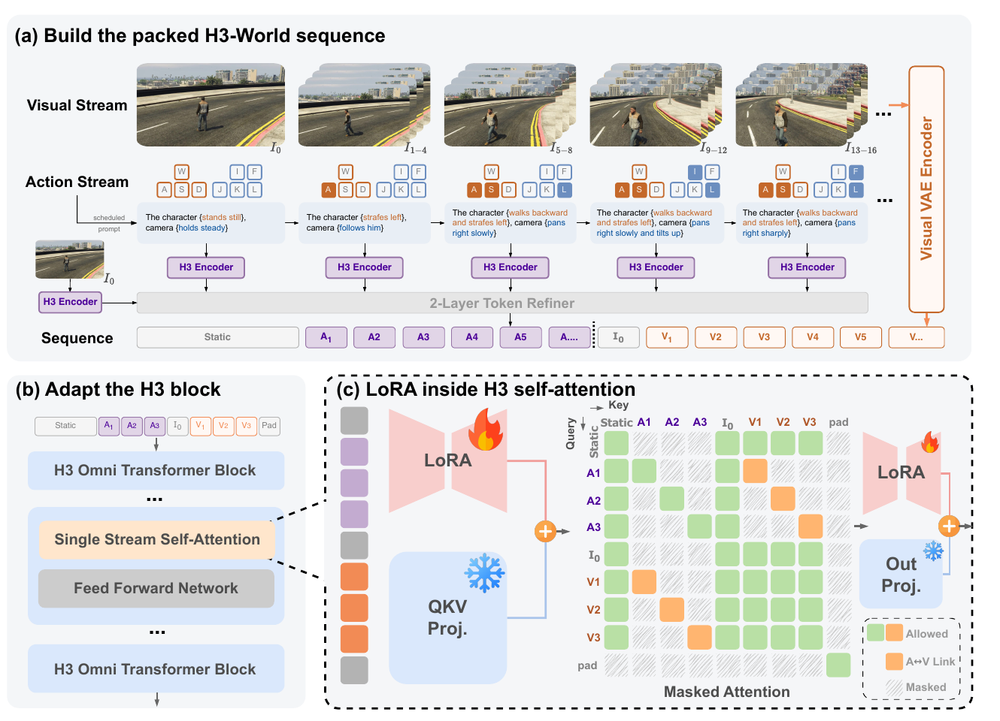
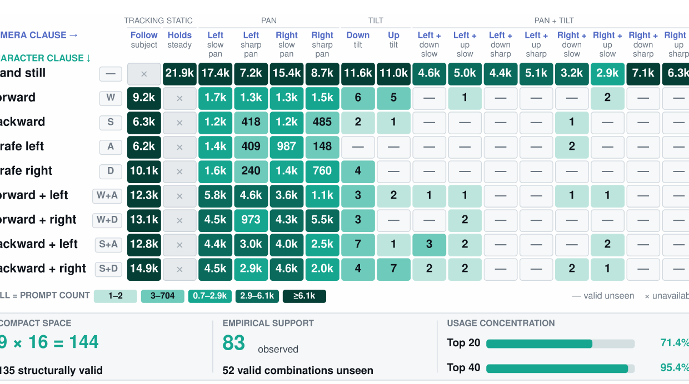
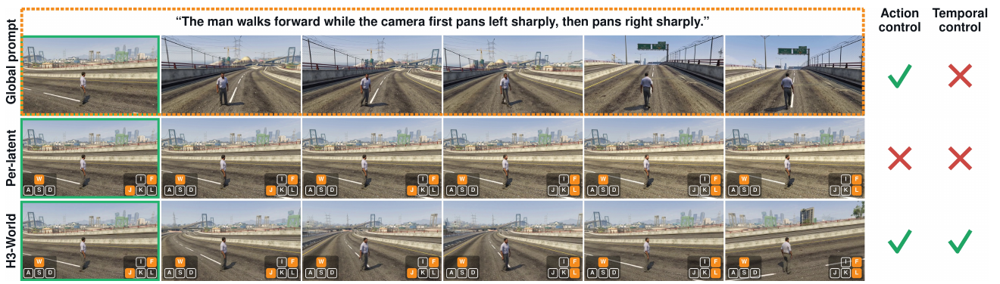
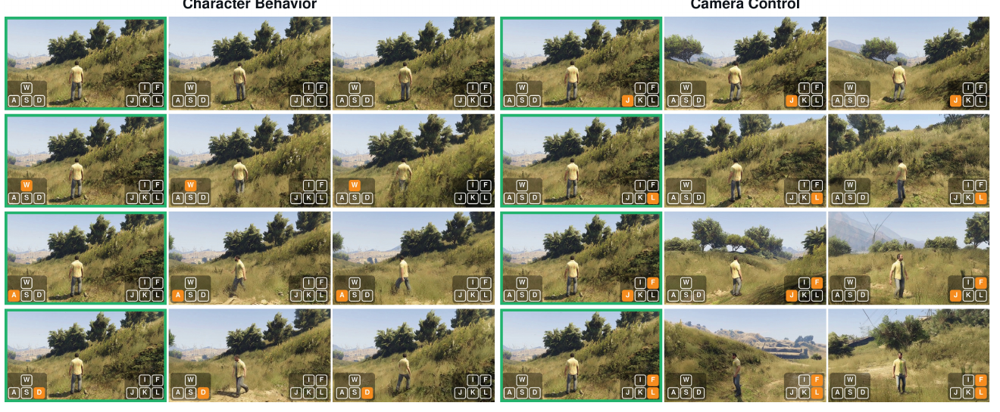
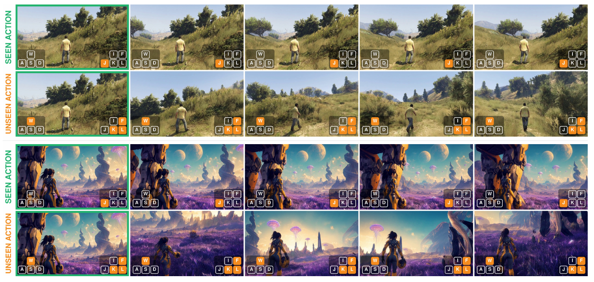

# H3-World: Turning Language Understanding into World Control

> Danze Chen¹²♣, Zeqing Wang¹²♣, Ziyue Lin³, Xingyi Yang³*, Yeying Jin¹²*♢  
> ¹腾讯 ²新加坡国立大学 ³香港理工大学 · [arXiv:2609.01560](https://arxiv.org/abs/2609.01560)(2026-09-01)  
> [project](https://danzer1xxxxchan.github.io/H3-World) · [code](https://github.com/Danzer1xxxxChan/H3-World) · [model](https://huggingface.co/DANNY621/H3-World)  
> ♣ 腾讯实习期间完成,Yeying Jin 指导 ♢ project leader

---

## 1. 一句话定位

**大视频模型已经能听懂"角色往前走、镜头右摇"了——那就别再造动作模块，直接把这个语言接口做精确。**

H3-World 把 33B 的 MiniMax-H3 变成可交互世界模型，做法是：**把键鼠动作翻译成结构化文本指令**，每个 video latent 区间配一条独立指令，用**单出口路由（single-egress routing）**保证每条指令只能从它对应的那个 latent 进入视觉流，再用 LoRA 学动作条件下的视觉动力学。

代价极低：**8,000 条 gameplay 样本、10,000 步、0.199% 可训练参数**。

⚠️ **但这篇论文全文只有一组光流数字**——没有 FVD、没有控制精度指标、没有用户研究，两个 baseline 只在一张定性图里对比过。**方法有想法，证据很薄。**

---

## 2. 要解决的问题

论文的核心判断是一句话：**"generation is not control"（会生成 ≠ 能控制）**。

预训练视频模型本身不提供交互世界建模所需的精确动作接口。现有做法是**外接一条新的控制通路**——离散 action embedding、条件模块、相机几何、或直接改骨干。这些通路的共同代价：

| 代价 | 具体含义 |
|---|---|
| **需要额外监督** | 必须有时序对齐的 action-video 轨迹 |
| **增加计算与存储** | 新模块要么常驻推理，要么改动骨干 |
| **可能破坏预训练能力** | 大幅 adaptation 会扰动预训练学到的东西 |
| **范式本身的假设** | 把控制当成"必须在预训练模型之上另外学出来的东西" |

论文质疑的正是最后这条。它的观察是：**MiniMax-H3 在完全没有 action-conditioned 训练的情况下，已经能对粗粒度的文字动作指令做出大致正确、视觉动力学真实的响应**（Fig 2）。

> 换句话说：**语言已经是一个粗粒度的控制接口**。缺的不是控制能力，是**时间精度**。

---

## 3. 核心方法

给定初始观测 `I_0`、静态语义条件 `s`、以及一个**排定的动作序列** `a_{1:K}`，生成对应的未来视频 latent `V_{1:K}`：

$$
\hat{V}_{1:K} \sim p_{\theta,\phi}\big(V_{1:K} \mid I_0,\, s,\, a_{1:K}\big)
$$

`θ` 是冻结的 H3 预训练参数，`φ` 是为动作控制新学的轻量参数。

📌 **底座的关键性质**：MiniMax-H3 是一个**双向**的 audio-video 基座，**在打包好的单流 self-attention 里同时处理文本/图像/音频/视频 token**，一次性对整个未来 horizon 联合去噪，**没有独立的 text cross-attention 层**。这个架构设定决定了下面所有设计——语义条件和视频 latent 是**平级共存在同一条序列里**的。



> **Fig 3 逐面板解读**：
>
> **(a) 构建打包序列**——最上面是 **Visual Stream**：初始帧 `I_0`（绿框）后面跟着 `I_{1~4}`、`I_{5~8}`、`I_{9~12}`、`I_{13~16}` 等区间，右侧一条橙色竖条是 **Visual VAE Encoder**。中间是 **Action Stream**：每个区间上方画着一个**键盘图标**（W/A/S/D + I/J/K/L/F 等键，按下的键高亮），下方是对应的 **scheduled prompt**，例如 `The character {stands still}, camera {holds steady}` → `The character {strafes left}, camera {follows him}` → `The character {walks backward and strafes left}, camera {pans right slowly}` → `…{pans right slowly and tilts up}` → `…{pans right sharply}`。**每条 prompt 各自过一个 H3 Encoder**（紫色方块），然后统一进 **2-Layer Token Refiner**（灰色横条）。最底一行 **Sequence** 就是打包结果：`Static | A₁ A₂ A₃ A₄ A₅ A… | I₀ | V₁ V₂ V₃ V₄ V₅ V…`。
>
> 📌 **注意 prompt 的写法**：角色子句和相机子句用花括号分开且**语法结构在整个数据集里保持一致**——这是为了让模型能把"角色控制"和"相机控制"当成两个可组合的槽位。
>
> **(b) 适配 H3 block**——H3 Omni Transformer Block 里被改动的只有 **Single Stream Self-Attention**（橙色高亮），**Feed Forward Network 保持灰色不动**。
>
> **(c) LoRA + 掩码矩阵**——左右两个红色梯形是 **LoRA**（带🔥表示可训练），中间蓝色 **QKV Proj.** 带❄️表示冻结。核心是中间那张 **Masked Attention 矩阵**（行=Query，列=Key），图例三色：
> - **绿色 = Allowed**（可注意）
> - **橙色 = A↔V Link**（动作与其匹配 latent 的专属通道）
> - **灰色斜纹 = Masked**（禁止）
>
> 看矩阵可以直接读出路由规则：`A₁`行只在 `Static/A₁/I₀` 处是绿的、在 `V₁` 处是橙的，`V₂ V₃` 全是灰斜纹；而 `V₁ V₂ V₃` 三行之间**全绿**——视频 latent 之间保持完整双向注意力。

### 3.1 语义动作接口：把键鼠状态翻译成可组合的文本

外部控制表示成**离散控制状态**：每个状态含 **8 个记录的角色/相机按键 + 1 个二值相机速度标志**。训练时速度标志由**估计的相机 yaw rate** 推出，推理时由用户直接指定。

一个 H3 video latent 覆盖若干 RGB 帧，所以要把区间内的按键状态**聚合成一个 latent 级状态**——**只要区间内任一帧按下就标为 active**，并且**相反的按键先相互抵消**再构造 prompt。

第 `k` 个 latent 区间的动作写成一个二元组，并映射为两个子句的拼接：

$$
a_k = (u_k,\, c_k), \quad u_k \in \mathcal{U},\ c_k \in \mathcal{C}
$$

$$
p_k = \mathcal{T}_{\mathrm{char}}(u_k) \,\|\, \mathcal{T}_{\mathrm{cam}}(c_k)
$$

`U` 含 **9 个角色子句**，`C` 含 **16 个相机子句**。例：后退+左平移 的角色命令 + 慢速右摇 的相机命令 → *"the man walks backward and strafes left, camera pans right slowly."*

📌 **这个设计的关键不是"用文本"，而是"保持原动作空间的因子分解"**：角色和相机是两个独立槽位，模型有机会学会组合它们没见过的搭配。



> **Fig 4 逐区域解读**：这是一张 **9 行（角色子句）× 16 列（相机子句）的热力表**，格子里的数字是 prompt 计数。
>
> **列头分五组**：`TRACKING`（Follow subject）、`STATIC`（Holds steady）、`PAN`（Left slow / Left sharp / Right slow / Right sharp）、`TILT`（Down / Up）、`TILT+`（Left+down slow、Left+up slow、Left+down sharp、Left+up sharp）、`PAN+TILT`（Right+down slow、Right+up slow、Right+down sharp、Right+up sharp）。
>
> **行头九个**：Stand still / Forward(W) / Backward(S) / Strafe left(A) / Strafe right(D) / Forward+left(W+A) / Forward+right(W+D) / Backward+left(S+A) / Backward+right(S+D)。
>
> **数据分布极度不均**：`Stand still` 那一行几乎全是万级（21.9k、17.4k、15.4k、11.6k、11.0k…），而 `Backward` 行大量是三位数（418、485）甚至 `—`（valid unseen）。
>
> **底部三个汇总框**给出全文最关键的三组数字：
> - **COMPACT SPACE**：`9 × 16 = 144`，其中 **135 个结构上有效**
> - **EMPIRICAL SUPPORT**：**83 个在训练中出现**，**52 个有效组合从未见过**
> - **USAGE CONCENTRATION**：**Top 20 = 71.4%**，**Top 40 = 95.4%**（共 291,264 条 prompt）
>
> 形式化写成 `A_train ⊊ A_valid ⊊ U × C`。
>
> 📌 **论文把这个不均衡当成优点**——它天然构成了组合泛化的测试场：一个联合命令可能没出现过，但它的角色子句和相机子句各自在别的组合里出现过。⚠️ **但反过来说，52 个未见组合最后只定性地测了 1 个**（见 §5.3）。

### 3.2 Latent 对齐的时间绑定

视频级的单条 prompt 对整个 clip 提供共享语义，**当动作在生成 horizon 内变化时时间分辨率不够**。所以每个 latent 区间配一条独立 prompt，各自编码后过一个**共享的两层 token refiner**：

$$
A_k = \mathcal{R}\big(\mathcal{E}(p_k)\big)
$$

📌 **token refiner 用的是 block-diagonal attention**：同一动作 span 内部双向互通，**不同 span 之间当作独立序列处理**。这样既共享表示空间，又**在进入视频骨干前保住每条指令的时间身份**。

初始观测走**两条互补的编码路径**：H3 多模态编码器把 `s` 和 `I_0` 联合处理成静态语义 token `S`；**visual VAE** 把 `I_0` 映成首帧条件 `C_0`——后者保留细粒度外观。

打包成一条序列：

$$
X = [\,S;\ A_1;\ \dots;\ A_K;\ C_0;\ V_1;\ \dots;\ V_K;\ P\,]
$$

**位置编码是这一节的精髓**。动作 span 被赋予**镜像的时间位置**：

$$
\tau(A_k) = \tau(V_k) - \Delta, \qquad \Delta > 0
$$

> 也就是：**每个动作 span 的时间坐标 = 它匹配的视频 latent 的坐标减去同一个常数偏移**。
>
> **这样做同时满足两件事**：① 动作 span 之间的**相对时序**与视频 latent 完全一致；② 减掉 `Δ` 使它们**仍落在文本侧的位置区间内**，从而**保住 H3 预训练的"文本在前、视频在后"顺序**。
>
> 📌 **这是个很省事的技巧**——不改位置编码方案、不加新参数，只靠一个平移就给每个 (动作, latent) 对提供了一致的时间对齐线索。

### 3.3 单出口路由 + LoRA

⚠️ **光有时间对齐不够**：双向 self-attention 里，动作 span 仍然可以直接和**不匹配的**视频 latent 通信。所以需要一个确定性的掩码。

**单出口路由（single-egress routing）规则**：

| `A_k` 的角色 | 可访问 | 被屏蔽 |
|---|---|---|
| **作为 Key**（谁能读它） | 同一 span 内的 token、**它匹配的 `V_k`** | static token、首帧条件 token、原生音频 token、**其它动作 span**、**不匹配的视频 latent** |
| **作为 Query**（它能读谁） | static 上下文、首帧条件、原生音频上下文、自身 token、**匹配的 `V_k`** | 其它动作 span、不匹配的视频 latent |

**所有视频 latent span 保持 H3 原本的完整双向注意力。**

📌 **"单出口"三个字的含义**：`A_k` 的视觉效果**只有一个直接入口——`V_k`**；进去以后再通过 video-to-video attention 自由传播。这样既保住全 horizon 的信息交换（运动连续性、场景一致性），又让**每个排定动作有唯一的直接入口**。

**LoRA** 加在 H3 self-attention block 的 **QKV 投影和输出投影**、以及**两层 token refiner** 上。骨干、H3 encoder、visual VAE 全部冻结。**路由掩码和 span 划分不引入任何可学习参数**，训练目标仍是 H3 原生的去噪目标。

---

## 4. 实验设置

| 项 | 值 |
|---|---|
| 数据来源 | **ABot-World-Explorer-500h** |
| 训练集 | **7,872** 条 gameplay clip |
| 评测集 | **128** 条 held-out clip |
| clip 规格 | 124 帧 @ 24 fps，**832 × 480** |
| 每 clip 动作 prompt 数 | **37** 条（latent 对齐） |
| LoRA | **rank 32**，**10,000** 步，lr **1e-4** |
| 可训练参数占比 | **0.199%** |
| 推理 | 124 帧，**50** 步去噪 |

**评测协议**分两套配对方案：**受控干预**（固定初始观测、seed、采样配置，只改动作）和 **held-out clip**（喂真实首帧 + 录制动作序列，比对运动模式）。

⚠️ **唯一的量化诊断**：Farneback 稠密光流，累加**平均水平光流**。正值=向左，负值=向右的相机运动。

---

## 5. 实验结果

### 5.1 适配前后的动作响应（Fig 5）——全文唯一一组数字



> **Fig 5 逐行解读**：顶部橙色框里是共享指令 *"The man walks forward while the camera first pans left sharply, then pans right sharply."* 三行分别是三种条件，最右两列是 **Action control / Temporal control** 的✓✗判定。
>
> | 行 | Action control | Temporal control |
> |---|---|---|
> | **Global prompt**（冻结 H3 + 一条全局指令） | ✅ | ❌ |
> | **Per-latent**（完整逐 latent 接口，但 LoRA 全置零） | ❌ | ❌ |
> | **H3-World** | ✅ | ✅ |
>
> 每行左起第一格是绿框标记的初始观测，后续格子右下角叠加**键盘状态**（按下的键橙色高亮）。

**实验设计本身很讲究**：相机调度为**前 15 个时间 latent 急速左摇、后 22 个急速右摇**，切换点正好落在 latent block 边界上。这要求模型既跟对两个方向，又把各自分配到指定区间；而**"在同一 clip 内反转"这个设计控制掉了场景漂移**这个混淆因素。

| 条件 | 切换前累计水平光流 | 切换后 |
|---|---|---|
| Global prompting | **0.0** | **−17.3** |
| Zero-LoRA per-latent | **−0.1** | **0.0**（平均绝对水平光流仅 **0.003**） |
| **H3-World** | **+52.7** | **−106.0** |

**把指令顺序反过来重跑，结论一致**：global 得 −11.9 / +24.1，zero-LoRA 依然无响应，H3-World 得 −58.7 / +121.0。

📌 **但最有价值的是下面这条对照**——论文主动报告了一个对自己不利的数字：

> **恒定动作**（整段只有一个相机方向）时，global prompting 与 H3-World 的方向性分离几乎相同：**301.8 vs 300.5**。

**这条负结果澄清了 LoRA 到底贡献了什么**：冻结的 H3 **确实**能响应粗粒度动作指令（301.8 已经很强）；它的问题在于**全局文本表示在整个 horizon 上是共享的，无法把每个方向绑到特定 latent 区间**。而 zero-LoRA 那一行则证明**光给出 span 专属指令也不够**——必须靠 LoRA 让骨干学会**使用**这些时间绑定。

> ⚠️ **同时这也划定了贡献的边界**：H3-World 的增量是**时间精度**，不是动作响应能力本身。

### 5.2 与直接动作条件的对比（Fig 6，仅定性）

论文自己实现了两个直接动作条件变体，都把 latent 级键盘状态编成一个学习向量再作用到视频 token 特征上：

- **Additive-bias**：投影后直接加到视频表示上（对应 **ReactiveGWM** 的机制）
- **FiLM**：AdaLN 之后做 feature-wise scale & shift

结论：两者**响应微弱或不一致**（图上标注 `wrong movement`、`incorrect camera controls`），而 H3-World 产生协调的角色+相机变化。

⚠️ **这个对比只有一张图、零个数字**，而且是作者自己复现的变体，不是原 ReactiveGWM 的官方结果。

### 5.3 可控性与泛化（Fig 8 / Fig 9）



> **Fig 8 解读**：**固定初始观测、seed、采样配置，只改动作指令**。左半 `Character Behavior`、右半 `Camera Control`，共 4 行 × 2 组。每格右下角有键盘状态叠加，绿框标初始观测。
>
> 覆盖：静止 / 前进、左平移 / 右平移、双向的慢速与急速相机摇。**相反的平移与摇镜命令产生明显不同的横向演化，"快"档比"慢"档变化明显更大**。
>
> 📌 **配对构造是这张图的说服力来源**——差异只可能来自动作指令。但仍然**没有量化**：没有报告"指令方向正确率"之类的控制精度指标。



> **Fig 9 解读**：四行分两组，每组 `SEEN ACTION`（绿标）对 `UNSEEN ACTION`（橙标）。
> - **上两行**：held-out gameplay 观测（写实的草坡+树林场景）
> - **下两行**：**分布外观测**（紫色调的科幻星球，双月+外星植被，风格与训练集完全不同）
>
> 测的是一个**未见过的联合命令**——前进动作 + 相机 pan–tilt，两个子句各自在别的组合里出现过、但从未同时出现。H3-World 在两种观测上都同时跟随了角色和相机分量，且保住了场景布局与主体外观。

**视觉泛化（Fig 10，未裁图）**：另测 6 个与训练集差异很大的初始观测——**第三人称与第一人称视角、室内与室外、奇幻与科幻、多种渲染风格**，同一套接口都产生了要求的响应。

---

## 6. 争议与权衡

**① 全文只有一组光流数字，没有任何标准量化评测。** 这是最大的问题。一篇主张"**精确**控制"的论文，**没有给出任何控制精度指标**——没有动作跟随准确率、没有相机轨迹误差、没有与 GT 的 PSNR/SSIM/LPIPS、没有 FVD、没有 VBench、**没有用户研究**。128 条 held-out clip 被反复提到，但**没有在它们上面报告任何聚合数字**。所有"有效""精确""保持质量"的结论都靠代表性样例支撑。

**② 单出口路由——命名的核心贡献，零隔离证据。** §4.2 的三条件对照拆的是 **LoRA** 和**逐 latent 接口**，**唯独没有拆路由掩码**。"去掉 mask、让动作 span 自由注意所有 latent"这个最直接的消融没做，所以**无法判断控制泄漏是否真的被抑制、抑制了多少**。

**③ 组合泛化的证据是 1 / 52。** 52 个未见的有效组合里，只**定性地**测了 **1 个**。论文在 limitation 里承认了这点（"evaluated mainly through representative examples"），态度诚实，但结论的强度就只能到这里。

**④ 与最接近的工作 Incantation 没有实验对比。** §2.2 明确说 Incantation [41] "most closely related"——同样是**逐 latent 帧的自然语言 + 局部 text cross-attention**。论文给出的区分理由是**架构设定不同**（H3 是打包单流 self-attention、无独立 text cross-attention），这个理由成立，但**不能替代实验比较**。

**⑤ "0.199%" 是个漂亮但需要换算的数字。** 33B × 0.199% ≈ **6600 万参数**，rank-32 LoRA 在这个尺度上是常规量级，不算特别小。真正省的是**训练成本**（8k 样本 / 10k 步），这一点确实扎实。

**⑥ 训练数据集中度极高，实用性存疑。** Fig 4 显示 Top-20 组合占 71.4%，而 `Stand still` 那一行独占大量万级样本。**"站着不动 + 各种镜头"是压倒性的多数**，真正的复杂角色移动样本稀疏（`Backward` 行大量三位数）。这意味着**模型在角色控制上的可靠性很可能远低于相机控制**，而论文没有分开报告。

**⑦ 正面：§4.2 的实验设计质量明显高于全文其它部分。** 三条件对照拆解干净、切换点对齐 latent 边界、同 clip 内反转控制场景漂移、还额外做了**反序重跑**验证。尤其是**主动报告 301.8 vs 300.5 这个对自己不利的恒定动作结果**——它把"我们的贡献是时间绑定而非动作响应"这件事讲清楚了。**这种自我设限在这类论文里少见。**

**⑧ 正面：limitation 写得诚实。** 明确承认短 horizon、评测靠代表性样例、缺系统性评测、固定长度片段、**无持久世界状态 / 无实时交互 / 无规划 / 无策略学习**。

**⑨ 方法思路本身值得借鉴，与你的场景高度相关。** "不造新模块，把控制表达在模型已经理解的语言空间里 + 用位置平移做时间绑定 + 用掩码防止泄漏"——这套组合拳**成本极低且不破坏预训练能力**，对游戏资产/场景的可控生成是很实际的路线。⚠️ 但要注意它**依赖底座本身已经具备粗粒度语言控制能力**（论文的 301.8 就是证据）；换一个不具备这个能力的底座，整套设计的前提就不成立了。

---

## 7. 一句话总结

H3-World 的判断是**"大视频模型里已经藏着控制接口，缺的只是时间精度"**：把键鼠动作翻译成角色/相机两个可组合的文本子句、每个 video latent 配一条独立指令、用 `τ(A_k) = τ(V_k) − Δ` 的位置平移做时间绑定（既对齐时序又保住"文本在前"的预训练顺序）、再用单出口路由掩码保证每条指令只能从匹配的那个 latent 进入视觉流，最后只训 0.199% 的 LoRA；代价是**全文仅有一组光流数字、核心的路由设计没有消融、52 个未见组合只定性测了 1 个**——想法清晰，证据薄弱。

---

## Q&A

**Q: "语言已经是控制接口"这个观察靠谱吗？有多少是预训练白送的？**

A: **论文给了一个可以直接回答这个问题的数字：恒定动作下 301.8 vs 300.5。**

- **冻结的 MiniMax-H3 + 一条全局指令**：方向性分离 **301.8**
- **完整训练的 H3-World**：**300.5**

**在"整段只有一个相机方向"这种最简单的情形下，两者几乎没差别**——也就是说**动作响应能力基本是预训练白送的**。

真正的差别出现在**动作会变的时候**：

| 条件 | 切换前 | 切换后 | 判定 |
|---|---|---|---|
| Global prompt | 0.0 | −17.3 | 只跟到了第二段，第一段完全没响应 |
| **H3-World** | **+52.7** | **−106.0** | 两段都跟对，且量级大一个数量级 |

📌 **所以这篇论文的贡献要精确表述为：把预训练里已有的"粗粒度动作响应"变成"时间上可寻址的响应"。** 不是造出了控制能力，是给已有的控制能力装上了时间轴。

⚠️ **推论**：这套方法**不可移植到不具备语言控制能力的底座上**。如果你的 base model 在冻结状态下拿不到类似 301.8 的响应，前提就塌了。

---

**Q: 单出口路由到底防住了什么？为什么需要它？**

A: **防的是"控制泄漏"——第 k 条指令影响到第 j 个 latent（j ≠ k）。**

问题的根源在 MiniMax-H3 的架构：它是**打包的单流双向 self-attention**，文本 token 和视频 latent 平级共存在同一条序列里。这意味着**默认情况下，`A_3` 可以直接注意 `V_1`、`V_7`、以及其它所有动作 span**。时间位置对齐（`τ(A_k) = τ(V_k) − Δ`）只提供了一个**软的**对齐线索，**不限制信息流**。

单出口路由是个**硬约束**：

```
A_k 作为 Key   → 只有 同span token + V_k 能读它
A_k 作为 Query → 只能读 static / C_0 / 音频 / 自身 / V_k
V_1..V_K 之间  → 保持完整双向（不动）
```

📌 **设计的巧妙之处在于"只掐直接通路，不掐间接通路"**：`A_k` 的效果只能从 `V_k` 这一个口进入视觉流，但进去之后可以通过 video-to-video attention 自由传播到整段。**所以既保住了运动连续性和场景一致性（全 horizon 交换未被破坏），又让每个动作有唯一可归因的入口。**

⚠️ **但这一节的所有论述都是设计动机，没有实验支撑**——论文没有做"去掉 mask"的对照。所以"泄漏被防住了"目前只是设计意图，不是被验证的结论。

---

**Q: 想在自己的项目里复现这套思路，最关键的几个点是什么？**

A: **五个点，前两个决定成败。**

1. **先验证底座的零样本语言控制能力。** 拿冻结模型 + 一条全局动作指令跑光流，看有没有明显的方向性响应。**没有的话不要继续**——H3-World 的全部前提是这个。

2. **动作 prompt 的语法必须在整个数据集里严格一致。** 论文强调 "character and camera clauses follow a shared grammatical structure across the dataset"。这是组合泛化的来源：模型要能把角色子句和相机子句识别成两个独立槽位。**随意措辞会毁掉这一点。**

3. **位置编码用平移而不是新建。** `τ(A_k) = τ(V_k) − Δ` 这个技巧零成本：相对时序与视频对齐，同时因为减了 `Δ` 而仍落在文本侧区间，**不破坏预训练的"文本在前、视频在后"顺序**。

4. **按键状态的聚合规则要定死。** 论文的规则是：区间内**任一帧按下即 active**，且**相反按键先抵消**再构造 prompt。这两条决定了标注的一致性。

5. **注意数据分布。** Fig 4 显示训练数据里 `Stand still` 一行样本量碾压其它行、Top-20 组合占 71.4%。⚠️ **如果你更关心角色移动而非镜头运动，需要专门补数据**——论文没有分开报告角色控制与相机控制的可靠性，但从分布看前者大概率更弱。

---

**Q: 它和仓库里其它世界模型/视频控制的工作是什么关系？**

A: **H3-World 走的是"零新模块"路线，与其它几篇的控制注入方式形成对照。**

| | 控制怎么进模型 |
|---|---|
| **H3-World** | **不加模块**——翻译成文本，走底座原生文本通路 + 位置平移 + 注意力掩码 |
| [ReWorld](../../video_generation/reworld/analysis.md) | **改 attention 本身**——把相机位姿折进 attention logits（PM-RoPE / E-PRoPE），混合逐 head 注意力窗口 + landmark bank 做长时记忆 |
| [EVOKE](../evoke/analysis.md) | **外挂几何状态**——Pi3X 点云做 World State Bank 持久化，per-chunk 文本 prompt 切换（Evocation） |
| [WorldDiT](../worlddit/analysis.md) | **共享骨干双输出**——同一个 DiT 同时回归 action velocity 和 RGB patch velocity，用 action-safe attention 隔离 |
| [AWoMo](../awomo/analysis.md) | **不碰控制接口**——解决的是上游数据问题（游戏引擎 verifier 做递归数据飞轮） |

📌 **底座关联**：[RAVEN](../../video_generation/raven/analysis.md) 的代码库里附带一个 `projects/minimax_h3/`，提供 MiniMax-H3 上的 causal/streaming teacher-forcing、DMD、TSCD 路径。**两篇是同一底座的两个方向**——RAVEN 那边做的是**加速**（few-step 因果化），H3-World 这边做的是**控制**。理论上可以叠。

⚠️ **对比时要注意评测强度差异很大**：ReWorld 和 EVOKE 都有完整的量化表格和 baseline 对比，H3-World 只有光流。**跨篇比较结论时不要把它们放在同一置信水平上。**
