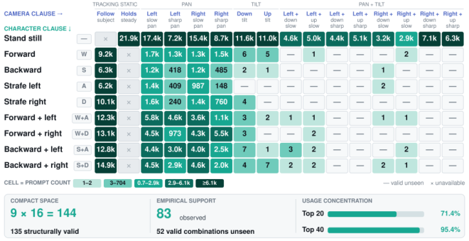

# H3-World: Turning Language Understanding into World Control

**论文**: [arXiv 2609.01560](https://arxiv.org/abs/2609.01560)(2026-09-01)
**代码**: [Danzer1xxxxChan/H3-World](https://github.com/Danzer1xxxxChan/H3-World) · [project](https://danzer1xxxxchan.github.io/H3-World) · [model](https://huggingface.co/DANNY621/H3-World)
**作者**: Danze Chen¹²♣, Zeqing Wang¹²♣, Ziyue Lin³, Xingyi Yang³*, Yeying Jin¹²*♢
**机构**: ¹腾讯 ²新加坡国立大学 ³香港理工大学（♣ 腾讯实习期间完成，Yeying Jin 指导；♢ project leader）
**时间**: 2026-09

---

## 1. 一句话定位

把 MiniMax-H3（33B T2V）改造成可交互世界模型：将键盘动作翻译成自然语言句子，每个视频 latent 独立绑定一句 action 指令，用有向注意力掩码实现精确的每帧时序控制，只需训练 0.199% 参数（65.6M LoRA）。

---

## 2. 要解决的问题

**强 T2V 模型有语言理解能力，但不能接受动作控制**。MiniMax-H3 对"the man walks forward while the camera pans left rapidly"已有零样本响应（Fig 1），但响应是全局的，不能在视频过程中随时序切换——"先向左转，latent 15 之后向右转"这种时序绑定无法表达。

现有交互式世界模型方向：
- 专门训练从零开始的架构（GameNGen, DIAMOND）：参数量小但生成质量差
- 把 latent 扩散模型加 action embedding（Genie 系列）：需要大量特殊设计
- H3-World 的路线：语言接口复用大模型现有能力，只 LoRA 微调

---

## 3. 与前作关系

| 方向 | 代表作 | 问题 |
|------|--------|------|
| 专用世界模型 | GameNGen / DIAMOND | 参数小，视觉质量差 |
| Feature-space 注入 | Genie / Oasis | 需要新增 action encoder，训练成本高 |
| 全局文本控制 | 原始 H3 | 有动作理解能力，但无时序精度 |
| **H3-World** | 本文 | 文本语义接口 + per-latent 独立绑定 + LoRA |

核心 insight 引用 Fig 1：预训练 T2V 模型已经有粗粒度的运动语义，H3-World 利用这个能力，把问题从"从无到有训练控制"转换成"把动作接口翻译成语言再精确绑定时序"。

---

## 4. 核心方法

### 4.1 三个组件概览


> **Fig 2 逐段解读**：
>
> **(a) 构建 packed H3-World 序列**——上方 Visual Stream 是视频帧，经 Visual VAE Encoder 压缩为视频 latent（橙色块 `V1, V2, V3...`）。中间 Action Stream 展示每组帧对应的键盘状态（WASD+IJKL），经规则引擎翻译为句子（如 "The character strafes left, camera pans right slowly"），每句话经 H3 Encoder 独立编码为 Action span（紫色块 `A1, A2, A3...`）。底部 `I₀` 是首帧视觉 token，和全局场景描述（"Static prompt"）一起放在序列头部。序列排列为：`[Static | A1 A2 ... A37 | I₀ | V1 V2 ... V37 | Pad]`——注意 Action span 在 Video latent 之前，Video latent 按时间顺序跟随。
>
> **(b) 适配 H3 block**——H3 是 single-stream self-attention（所有 token 拼成一条序列），LoRA 加在每层的注意力投影上，其余权重冻结（雪花图标）。
>
> **(c) LoRA + Directed Mask**——注意力矩阵可视化：绿色 = 允许互见，橙色 = "A→V Link"（Action span Ak 只能看到对应 Video latent Vk），灰色 = 遮蔽。规则：
> - Static prompt 对所有 token 可见（全行绿）
> - Action span Ak 只和 Vk 双向互见（单条橙色对角连接），对 Ak+1/Vk+1 不可见
> - Video latent Vk 之间全部双向互见（大块绿色）
> - Pad 被遮蔽
>
> 这种 "Single-Egress Routing" 保证动作指令和对应时刻的帧精确对应，而不会在时间轴上漫延。LoRA 只训练 qkv_proj 和 out_proj（火焰图标），Out Proj 也加 LoRA，其余冻结。

---

### 4.2 Semantic Action Interface（语义动作接口）

模板固定为：`"the man <motion clause>, camera <camera clause>"`

**Character clause**（9 种）：
```
MOTION_IDLE = "stands still"
W -> "walks forward"
S -> "walks backward"
A -> "strafes left"
D -> "strafes right"
W+A -> "walks forward and strafes left"
...
```
`MOTION_ORDER = (W, S, A, D)`，拼接顺序固定，同一键组合始终生成同一字符串。互斥对（W+S, A+D）同时激活则全部取消，防止生成"前进并后退"这样的矛盾标注。

**Camera clause**（16 种）：关键在于相机速度 bit `F` 不来自键盘，而来自 COLMAP 测量的 `|d_yaw|`：

```python
# code/abot/action_script.py
YAW_SHARP = 0.225  # deg per frame threshold (per-frame rate, not raw sum)

# "F" = 1 当 (J 或 L 被按住) 且 per-frame |d_yaw| >= 0.225
fast = panning & (np.abs(rate[:, 1]) >= YAW_SHARP)
```

这是整个系统唯一真正"新增信息"的地方：方向可以从 IJKL 键读出（0.85-0.97 命中率），但速度不能（J 键单独按时 66% 慢/34% 快，接近随机）。加上 F bit 后，多数投票查表准确率从 0.700 → 0.871。

**Negative prompt**（CFG 参考）：
```python
# action_script.py
def null_script(latent_t): 
    return ["the man stands still, camera holds steady"] * latent_t
```
形状与正样本完全一致，CFG 放大的是动作引起的差异而非通用文本遵循性。

---

#### 动作空间的训练覆盖（Fig 4）



> **Fig 4 逐区域解读**：这是一张 **9 行（角色子句）× 16 列（相机子句）的热力表**，格子里的数字是 prompt 计数。
>
> **列头分五组**：`TRACKING`（Follow subject）、`STATIC`（Holds steady）、`PAN`（Left slow / Left sharp / Right slow / Right sharp）、`TILT`（Down / Up）、`TILT+`（Left+down slow、Left+up slow、Left+down sharp、Left+up sharp）、`PAN+TILT`（Right+down slow、Right+up slow、Right+down sharp、Right+up sharp）。
>
> **行头九个**：Stand still / Forward(W) / Backward(S) / Strafe left(A) / Strafe right(D) / Forward+left(W+A) / Forward+right(W+D) / Backward+left(S+A) / Backward+right(S+D)。
>
> ⚠️ **数据分布极度不均**：`Stand still` 那一行几乎全是万级（21.9k、17.4k、15.4k、11.6k、11.0k…），而 `Backward` 行大量是三位数（418、485）甚至 `—`（valid unseen）。
>
> **底部三个汇总框**给出全文最关键的三组数字：
> - **COMPACT SPACE**：`9 × 16 = 144`，其中 **135 个结构上有效**
> - **EMPIRICAL SUPPORT**：**83 个在训练中出现**，**52 个有效组合从未见过**
> - **USAGE CONCENTRATION**：**Top 20 = 71.4%**，**Top 40 = 95.4%**（共 **291,264** 条 prompt）
>
> 形式化写成 `A_train ⊊ A_valid ⊊ U × C`。
>
> 📌 **论文把这个不均衡当成优点**——它天然构成了组合泛化的测试场：一个联合命令可能没出现过，但它的角色子句和相机子句各自在别的组合里出现过。
>
> ⚠️ **但反过来说**：`Stand still + 各种镜头` 是压倒性的多数，真正的复杂角色移动样本稀疏（`Backward` 行大量三位数）。**这意味着模型在角色控制上的可靠性很可能远低于相机控制，而论文没有分开报告。**

---

### 4.3 Latent-Aligned Temporal Binding（时序绑定）

**论文级的形式化**（§3.3）：每条 prompt `p_k` 各自过共享的 H3 encoder `E`，再过一个**共享的两层 token refiner** `R`：

$$
A_k = \mathcal{R}\big(\mathcal{E}(p_k)\big)
$$

📌 **token refiner 用的是 block-diagonal attention**：同一动作 span 内部双向互通，**不同 span 之间当作独立序列处理**——既共享表示空间，又在进入视频骨干前保住每条指令的时间身份。

打包成一条序列：

$$
X = [\,S;\ A_1;\ \dots;\ A_K;\ C_0;\ V_1;\ \dots;\ V_K;\ P\,]
$$

**位置编码是这一节的精髓**——动作 span 被赋予**镜像的时间位置**：

$$
\tau(A_k) = \tau(V_k) - \Delta, \qquad \Delta > 0
$$

> 即：**每个动作 span 的时间坐标 = 它匹配的视频 latent 的坐标减去同一个常数偏移**。
>
> **这样做同时满足两件事**：① 动作 span 之间的**相对时序**与视频 latent 完全一致；② 减掉 `Δ` 使它们**仍落在文本侧的位置区间内**，从而**保住 H3 预训练的「文本在前、视频在后」顺序**。
>
> 📌 **这是个很省事的技巧**——不改位置编码方案、不加新参数，只靠一个平移就给每个 (动作, latent) 对提供了一致的时间对齐线索。

另外，初始观测走**两条互补的编码路径**：H3 多模态编码器把静态语义条件 `s` 和 `I₀` 联合处理成静态语义 token `S`；**visual VAE** 把 `I₀` 映成首帧条件 `C₀`——后者保留细粒度外观。

---

**代码层面的实现细节**：H3 的视频 latent 分组非均匀：`_FRAME_PER_TOKEN = (1, 4, 4, 4, 4)`，每 5 个 token 为一组，每组首 token 对应 1 帧，余下 4 个各对应 4 帧。

对于 124 帧视频：`latent_t = 37`（5 组 × 7 + 2）。

**Binning 规则**（`bin_to_latent` in `code/abot/abot_action.py`）：
- 二值键位：窗口内取 `amax`（任意时刻按下即计入，防止平均到 0.25 这样的虚值）
- 连续旋转/平移：窗口内取 `sum`，再除以 `ROT_SCALE=4.0 / TRA_SCALE=4.0`，对称 clip（`ROT_CLIP=3.0, TRA_CLIP=4.0`）

30fps→24fps 帧选择：每 5 帧中保留 4 帧，丢弃第 5 帧（`window_offsets`）。COLMAP 平移在每集内归一化（`episode_translation_scale`），消除场景间 arbitrary scale。

**独立编码**：每句 action 文本独立过 text encoder（不拼成一条长序列），同一字符串始终产生相同 embedding——这是 dedup 字典成立的前提，也是推理时可以实时生成动作文本的必要条件（未来动作未知，无法整体编码）。

---

### 4.4 Directed Attention Routing（有向注意力路由）

**论文级的规则**（§3.4）——⚠️ **光有时间对齐不够**：双向 self-attention 里，动作 span 仍然可以直接和**不匹配的**视频 latent 通信。所以需要一个确定性的掩码：

| `A_k` 的角色 | 可访问 | 被屏蔽 |
|---|---|---|
| **作为 Key**（谁能读它） | 同一 span 内的 token、**它匹配的 `V_k`** | static token、首帧条件 token、原生音频 token、**其它动作 span**、**不匹配的视频 latent** |
| **作为 Query**（它能读谁） | static 上下文、首帧条件、原生音频上下文、自身 token、**匹配的 `V_k`** | 其它动作 span、不匹配的视频 latent |

**所有视频 latent span 保持 H3 原本的完整双向注意力。**

📌 **「单出口」三个字的含义**：`A_k` 的视觉效果**只有一个直接入口——`V_k`**；进去以后再通过 video-to-video attention 自由传播。这样既保住全 horizon 的信息交换（运动连续性、场景一致性），又让**每个排定动作有唯一的直接入口**。

📌 **路由掩码和 span 划分不引入任何可学习参数**，训练目标仍是 H3 原生的去噪目标。

---

**代码层面的实现**：在 DiffSynth-Studio 的 `diffsynth_h3_action.patch` 中实现，核心修改：

```python
# diffsynth/models/minimax_h3_dit.py (patched)
# 两个检测点（infer.py preflight check）：
"directed attention mask present"  ->  "leak_out" in _build_action_block_masks
"packed-sequence builder is the per-latent version"  ->  "action_text_spans_local" in packed builder
```

序列结构（`inject_abot_text.py`）：
```
[Static prompt | A1 A2 ... A37 | I₀ | V1 V2 ... V37 | Pad]
  ↑ head (scene)    ↑ action spans     ↑ first frame  ↑ video
```

`packed` 字典携带：`action_text_spans`（每个 Ak 在序列中的行范围），`action_video_start`（V1 的起始行），`action_frame_rows`（每个 Vk 的行范围）。DiT 用这些信息在运行时构建掩码，而不是预先存储 seq_len × seq_len 的稠密矩阵。

**均匀 padding（`pad_used_to`）的重要性**：`flex_attention` 被 `torch.compile`，每个不同的 seq_len 触发重新编译。如果每个样本 text_len 不同，步数内就会超出 Dynamo 重编译上限。注入脚本先扫全集找最大长度，对齐到 64，所有样本共用同一 `seq_len`。

---

## 5. 关键代码位置

| 功能 | 文件 | 关键行 |
|------|------|--------|
| 键位→9 bit 动作 | `code/abot/action_script.py` | `keys9()` / `annotate_from_keys9()` |
| 动作→latent bin | `code/abot/abot_action.py` | `bin_to_latent()` |
| COLMAP 位姿解析 | `code/abot/abot_action.py` | `pose_deltas()` / `read_episode()` |
| 有向掩码注入 | DiffSynth-Studio-h3-v2 (patch) | `_build_action_block_masks()` |
| 序列重写 | `code/abot/inject_abot_text.py` | `rewrite_one()` |
| 推理入口 | `code/abot/infer.py` | `main()` |

---

## 6. 关键配置

| 参数 | 值 | 说明 |
|------|-----|------|
| Backbone | MiniMax-H3 (33B) | 冻结 |
| LoRA rank | 32 | qkv_proj + out_proj |
| LoRA 参数量 | 65.6M | 占总参 0.199% |
| 训练步数 | 10,000 | 20 epochs on 7872 clips |
| GPU 数 | 4 | 4× GPU, bash code/train.sh |
| num_frames | 124 | 5.2s @ 24fps |
| latent_t | 37 | 37 per-latent action sentences |
| Action vocab | 135 valid combinations | 9 char × 16 cam |
| Training coverage | 83 combinations (71.4% top-20) | 52 unseen |
| cfg_scale | 1.0 (default) | action-directed negative CFG |

---

## 7. 实验结果

### 7.1 时序动作响应（Fig 4）


> **Fig 4 逐行解读**：任务是在一段视频中让相机先左转、latent 15 后切换为右转（上方文字标注了 schedule）。
>
> **Global prompt（行 1）**——把整段指令拼成一个全局 prompt 输入原始 H3：模型有粗粒度动作控制（✅ Action control），但无法在 latent 15 处切换方向（❌ Temporal control）——整个视频的相机方向不会随时序变化。
>
> **Per-latent（行 2）**——每个 latent 各分配一句文字，但没有有向掩码（action span 和 video latent 没有绑定）：两者都失败（❌❌）——语言信息 leak 到其他时刻，产生混淆。
>
> **H3-World（行 3）**——per-latent 文本 + 有向掩码：Action control ✅，Temporal control ✅。

**实验设计本身很讲究**：相机调度为**前 15 个时间 latent 急速左摇、后 22 个急速右摇**，切换点正好落在 latent block 边界上。这要求模型既跟对两个方向，又把各自分配到指定区间；而**「在同一 clip 内反转」这个设计控制掉了场景漂移**这个混淆因素。

**全文唯一的量化指标**是 Farneback 稠密光流累加的**平均水平光流**（正值=向左，负值=向右）：

| 条件 | 切换前累计水平光流 | 切换后 |
|---|---|---|
| Global prompting | **0.0** | **−17.3** |
| Zero-LoRA per-latent | **−0.1** | **0.0**（平均绝对水平光流仅 **0.003**） |
| **H3-World** | **+52.7** | **−106.0** |

⚠️ **注意 global prompting 的读法**：它**切换前是 0.0、切换后才是 −17.3**——即**只跟到了第二段（向右），第一段要求的向左运动完全没有响应**。这正是"全局文本表示在整个 horizon 上共享、无法把方向绑到 latent 区间"的直接体现。

**把指令顺序反过来重跑，结论一致**：global 得 **−11.9 / +24.1**，zero-LoRA 依然无响应，H3-World 得 **−58.7 / +121.0**。

📌 **但最有价值的是下面这条对照**——论文主动报告了一个对自己不利的数字：

> **恒定动作**（整段只有一个相机方向）时，global prompting 与 H3-World 的方向性分离几乎相同：**301.8 vs 300.5**。

**这条负结果精确地划定了本文的贡献边界**：
- **冻结的 H3 确实能响应粗粒度动作指令**（301.8 已经很强）——**动作响应能力基本是预训练白送的**；
- 它的问题在于**全局文本表示在整个 horizon 上是共享的，无法把每个方向绑到特定 latent 区间**；
- 而 zero-LoRA 那一行则证明**光给出 span 专属指令也不够**——必须靠 LoRA 让骨干学会**使用**这些时间绑定。

> ⚠️ **所以本文的增量要精确表述为：把预训练里已有的「粗粒度动作响应」变成「时间上可寻址的响应」。** 不是造出了控制能力，是给已有的控制能力装上了时间轴。
>
> 📌 **一个重要推论**：这套方法**不可移植到不具备语言控制能力的底座上**。如果你的 base model 在冻结状态下拿不到类似 301.8 的响应，前提就塌了。

### 7.2 与 Feature-space 注入基线对比（Fig 5）


> **Fig 5 逐行解读**：任务是 W+D（前进+右移）同时 L（相机右转），四行分别是 GT / Additive bias / FiLM / H3-WORLD。
>
> **GT 行**——角色向右前方行走，相机持续右转，键盘图标与动作一一吻合。
>
> **Additive bias（红框）**——帧 4、5 出现红框标注的错误：角色消失或相机方向完全错乱，说明简单加偏置无法在 backbone 上稳定地路由两个独立的控制信号。
>
> **FiLM（红框）**——"wrong movement"（第 2 帧）和"incorrect camera controls"（第 4 帧）被明确标注：FiLM 的仿射缩放虽然比加偏置更灵活，但仍然将全局 feature scale，在 H3 的 single-stream attention 上无法区分字符运动和相机运动。
>
> **H3-WORLD（绿色勾 ✅）**——每帧都有绿色对勾：角色和相机分别响应对应指令，且整体生成质量保持。

### 7.3 动作可控性（Fig 7）


> **Fig 7 逐组解读**：固定初始帧和随机 seed，只改变 action prompt，验证模型响应是否来自指令而非随机性。
>
> **左半（Character Behavior）**——四行分别是：静止 / W 前进 / A 左移 / D 右移。Row 1（静止）人物不动，场景几乎静止；Row 2（W）人物向远处走动，视角推进；Row 3（A）人物向画面左侧横移；Row 4（D）人物向右侧横移。每行 3 帧展示时间推进下的一致轨迹。
>
> **右半（Camera Control）**——四行分别是：静止 / J 左转 / J+F 左转快 / L+F 右转快。静止时相机几乎不动；J 时视野缓慢右移（相机左转）；J+F 时视野更快右移；L+F 时视野快速左移（相机右转快）。速度 bit F 有效区分了"slowly"和"sharply"。

### 7.4 动作泛化（Fig 8）


> **Fig 8 解读**：四行分两组，每组 `SEEN ACTION`（绿标）对 `UNSEEN ACTION`（橙标）。
> - **上两行**：held-out gameplay 观测（写实的草坡+树林场景）
> - **下两行**：**分布外观测**（紫色调的科幻星球，双月+外星植被，风格与训练集完全不同）
>
> 测的是一个**未见过的联合命令**——前进动作 + 相机 pan–tilt，两个子句各自在别的组合里出现过、但从未同时出现。H3-World 在两种观测上都同时跟随了角色和相机分量，且保住了场景布局与主体外观。
>
> ⚠️ **但要看清测试规模**：135 个结构有效的组合里有 **52 个从未见过**，而论文**只定性地测了其中 1 个**。论文在 limitation 里承认了这点（"evaluated mainly through representative examples"），态度诚实，**但结论的强度就只能到这里**——`1 / 52` 的覆盖率不足以支撑"组合泛化成立"这个一般性论断。

### 7.5 视觉泛化（Fig 9）


> 用 6 个视觉外观差异极大的初始帧测试学到的动作接口：第三人称 / 第一人称 / 室内 / 室外 / 卡通渲染 / 写实渲染。相同 action prompt 在所有场景下产生符合指令的角色和相机运动——说明 LoRA 学到的是动作语义的抽象，而非训练集的视觉风格。

---

## 8. 争议/权衡

### 8.1 证据强度上的问题

**① 全文只有一组光流数字，没有任何标准量化评测。** 这是最大的问题。一篇主张"**精确**控制"的论文，**没有给出任何控制精度指标**——没有动作跟随准确率、没有相机轨迹误差、没有与 GT 的 PSNR/SSIM/LPIPS、没有 FVD、没有 VBench、**没有用户研究**。128 条 held-out clip 被反复提到，但**没有在它们上面报告任何聚合数字**。所有"有效""精确""保持质量"的结论都靠代表性样例支撑。

**② 单出口路由——命名的核心贡献，零隔离证据。** §7.1 的三条件对照拆的是 **LoRA** 和**逐 latent 接口**，**唯独没有拆路由掩码**。"去掉 mask、让动作 span 自由注意所有 latent"这个最直接的消融**没做**，所以**无法判断控制泄漏是否真的被抑制、抑制了多少**。

**③ 组合泛化的证据是 1 / 52。** 见 §7.4。

**④ 与最接近的工作 Incantation 没有实验对比。** 论文 §2.2 明确说 Incantation "most closely related"——同样是**逐 latent 帧的自然语言 + 局部 text cross-attention**。论文给出的区分理由是**架构设定不同**（H3 是打包单流 self-attention、无独立 text cross-attention），这个理由成立，**但不能替代实验比较**。

**⑤ "0.199%" 是个漂亮但需要换算的数字。** 33B × 0.199% ≈ **6600 万参数**，rank-32 LoRA 在这个尺度上是常规量级，不算特别小。真正省的是**训练成本**（8k 样本 / 10k 步），这一点确实扎实。

**⑥ 训练数据集中度极高，且未分开报告可靠性。** Fig 4 显示 Top-20 组合占 71.4%，`Stand still` 那一行独占大量万级样本——**"站着不动 + 各种镜头"是压倒性的多数**，真正的复杂角色移动样本稀疏。**这意味着模型在角色控制上的可靠性很可能远低于相机控制，而论文没有分开报告。**

### 8.2 正面

**⑦ §7.1 的实验设计质量明显高于全文其它部分。** 三条件对照拆解干净、切换点对齐 latent 边界、同 clip 内反转控制场景漂移、还额外做了**反序重跑**验证。尤其是**主动报告 301.8 vs 300.5 这个对自己不利的恒定动作结果**——它把"我们的贡献是时间绑定而非动作响应"这件事讲清楚了。**这种自我设限在这类论文里少见。**

**⑧ limitation 写得诚实。** 明确承认短 horizon、评测靠代表性样例、缺系统性评测、固定长度片段、**无持久世界状态 / 无实时交互 / 无规划 / 无策略学习**。

### 8.3 工程层面的权衡

| 维度 | 说明 |
|------|------|
| 无定量指标 | 全定性展示，无 FVD/FID/动作跟随率等数字 |
| 短时域（124 帧 = 5.2s） | 无持久世界状态，不能跑地图 |
| 单场景单人物（ABot 数据集） | 是否泛化到多角色、多动作实体未测试 |
| 33B backbone 内存需求 | 推理需 ~135GB 模型权重（约 2×A100 80G） |
| 动作空间人工设计 | 9×16 语义槽需手写规则，扩展要改 action_script.py |
| COLMAP 依赖 | 训练时需要视频帧的 COLMAP 位姿，不能用 action.json delta（全零）|

**最值得注意的权衡**：directed mask 的 "single-egress" 是硬约束——Ak 只能读写 Vk。这样 action span 无法参考历史 video latent（不能"看了前几帧再决定怎么动"），也无法和其他 action span 交互。从训练数据看，正好吻合：同一字符串 → 同一 embedding，actions 之间无需互见。但这使得连续动作间的平滑过渡完全依赖 video latent 的双向注意力来处理，而不是显式的 action 规划。

---

## 9. 一句话总结

H3-World 验证了"强 T2V 模型的语言通道本身就是动作接口"这一 insight：把键盘状态转成 9-bit 二值再翻译成固定模板英文句子，每句独立编码并通过有向注意力掩码精确绑定到对应视频 latent，只训练 0.199% 参数即可在 MiniMax-H3（33B）上实现可时序切换的交互式世界模型控制。

---

## Q&A

**Q: 为什么 action text 要在 Video latent 之前放，而不是之后？**

A: 从 Fig 2(c) 的注意力矩阵看，Action span Ak 通过"A→V Link"只能看到 Vk（橙色单条连接）。如果 Ak 放在 Vk 之后，就需要"向后"注意力路由，而 MiniMax-H3 的 single-stream attention 是全双向的（不是 causal），因此前后顺序对注意力掩码本身没有因果限制。真正的原因更可能是工程约束：MiniMax-H3 的 packed sequence builder 在对 action_text_spans 建掩码时，`action_text_rows / action_video_start / action_frame_rows` 的计算假定了 action span 在 video latent 前面。`rewrite_one()` 中的序列组装顺序也印证了这点：`[head | A1...A37 | I₀ | V1...V37 | Pad]`。

---

**Q: H3-World 的"交互式世界模型"和 Alaya-EVOKE 这类交互式视频世界模型有什么本质区别？**

A: 两者在目标上有根本差异：

| 对比维度 | H3-World | Alaya-EVOKE |
|----------|----------|-------------|
| 控制接口 | 离散动作键（WASD+IJKL）→ 语言 | 文本 prompt per-chunk（Evocation） |
| 动作粒度 | per-latent（每 1-4 帧一条指令） | per-chunk（每数秒一个 prompt） |
| 控制目标 | 角色运动 + 相机旋转 | 场景主题 / 摄影风格 |
| 持久状态 | 无（5.2s 单次生成） | WSB 点云持久化几何 |
| 应用场景 | 游戏角色控制、具身导航数据生成 | 长视频（90s）交互叙事 |
| backbone 规模 | 33B T2V | 未公开（推测更小） |

H3-World 更接近"可以接受游戏手柄输入的 T2V 模型"；EVOKE 更接近"可以按段落切换叙事的长视频生成器"。

---

**Q: 想在自己的项目里复现这套思路，最关键的几个点是什么？**

A: **五个点，前两个决定成败。**

1. **先验证底座的零样本语言控制能力。** 拿冻结模型 + 一条全局动作指令跑光流，看有没有明显的方向性响应。**没有的话不要继续**——H3-World 的全部前提就是那个 301.8（见 §7.1）。
2. **动作 prompt 的语法必须在整个数据集里严格一致。** 论文强调 "character and camera clauses follow a shared grammatical structure across the dataset"。这是组合泛化的来源：模型要能把角色子句和相机子句识别成两个独立槽位。**随意措辞会毁掉这一点。**
3. **位置编码用平移而不是新建。** `τ(A_k) = τ(V_k) − Δ` 这个技巧零成本：相对时序与视频对齐，同时因为减了 `Δ` 而仍落在文本侧区间，**不破坏预训练的「文本在前、视频在后」顺序**。
4. **按键状态的聚合规则要定死。** 区间内**任一帧按下即 active**，且**相反按键先抵消**再构造 prompt（代码层面对应 `bin_to_latent` 的 `amax`）。这两条决定了标注的一致性。
5. **注意数据分布。** Fig 4 显示 `Stand still` 一行样本量碾压其它行、Top-20 组合占 71.4%。⚠️ **如果你更关心角色移动而非镜头运动，需要专门补数据。**

---

**Q: 它和仓库里其它世界模型/视频控制的工作是什么关系？**

A: **H3-World 走的是"零新模块"路线，与其它几篇的控制注入方式形成对照。**

| | 控制怎么进模型 |
|---|---|
| **H3-World** | **不加模块**——翻译成文本，走底座原生文本通路 + 位置平移 + 注意力掩码 |
| [ABot-World-0](../abot_world_0/analysis.md) | **加性注入 patchify**——8 维原始键盘 multi-hot 打包×4 加到 patch embedding 上，**明确拒绝相机位姿**（长 rollout 会漂出分布） |
| [SolarWM](../solarwm/analysis.md) | **折进 attention**——fused-PRoPE 把投影旋转作用到 Q/K/V |
| [ReWorld](../../video_generation/reworld/analysis.md) | **改 attention 本身**——PM-RoPE / E-PRoPE，混合逐 head 注意力窗口 + landmark bank 做长时记忆 |
| [EVOKE](../evoke/analysis.md) | **外挂几何状态**——Pi3X 点云做 World State Bank 持久化 |
| [WorldDiT](../worlddit/analysis.md) | **共享骨干双输出**——同一 DiT 同时回归 action velocity 和 RGB patch velocity |
| [AWoMo](../awomo/analysis.md) | **不碰控制接口**——解决的是上游数据问题（游戏引擎 verifier 做递归数据飞轮） |

📌 **数据上的直接关联**：H3-World 的训练数据 **ABot-World-Explorer-500h 出自 [ABot-World-0](../abot_world_0/analysis.md) 的 WorldExplorer**——两篇是同一套数据的上下游。有意思的是**两篇的动作接口哲学相反**：ABot 用 8 维原始键盘 multi-hot 直接注入，H3-World 把**同一批键盘状态翻译成自然语言子句**走文本通路。**同一份数据、两种控制表示，可惜没人做过直接对比。**

📌 **另一个第三方旁证**：[SolarWM](../solarwm/analysis.md) 的 Table 4 显示 **ABOT 这个 owner 在统一标准下保留率 99.6%、且 99.2% 直进 xhigh**——即这套数据的质量确实极高（对比 MiraData 被拒 85%）。

📌 **底座关联**：[RAVEN](../../video_generation/raven/analysis.md) 的代码库里附带一个 `projects/minimax_h3/`，提供 MiniMax-H3 上的 causal/streaming teacher-forcing、DMD、TSCD 路径。**两篇是同一底座的两个方向**——RAVEN 那边做**加速**（few-step 因果化），H3-World 这边做**控制**。理论上可以叠。

⚠️ **对比时要注意评测强度差异很大**：ReWorld 和 EVOKE 都有完整的量化表格和 baseline 对比，H3-World 只有一组光流。**跨篇比较结论时不要把它们放在同一置信水平上。**

