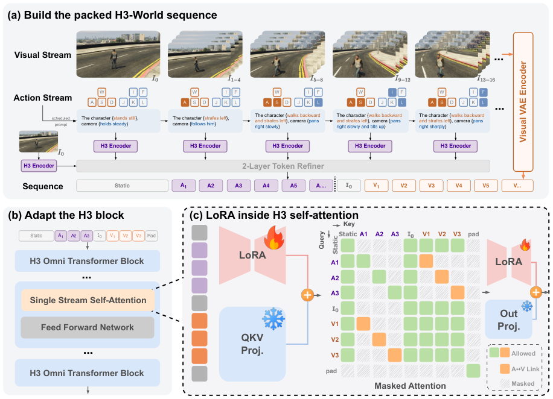
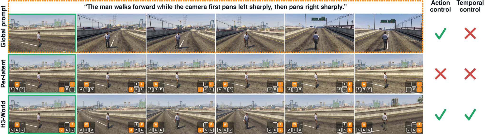
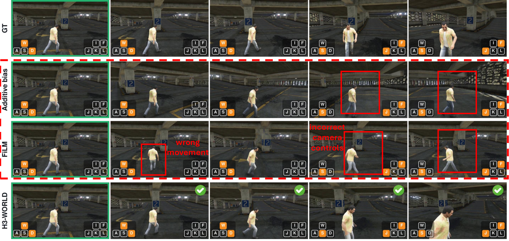
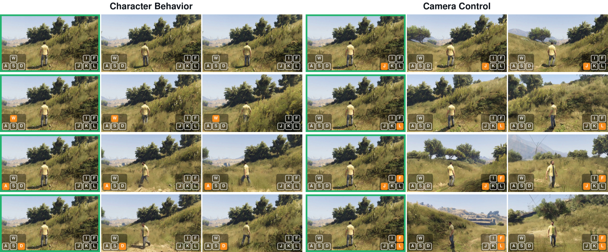
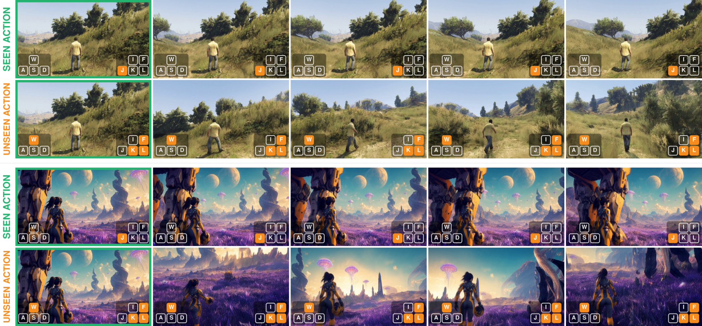
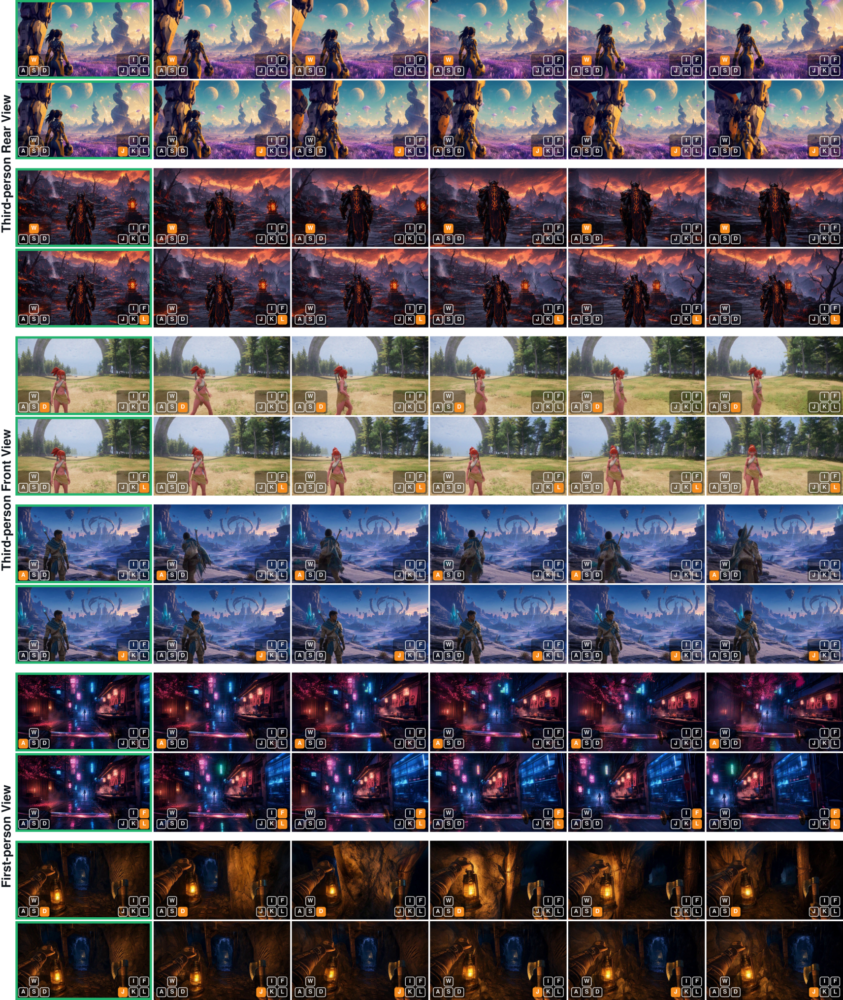

# H3-World: Turning Language Understanding into World Control

**论文**: [arXiv 2609.01560](https://arxiv.org/abs/2609.01560)
**代码**: [Danzer1xxxxChan/H3-World](https://github.com/Danzer1xxxxChan/H3-World)
**机构**: Tencent + NUS + HK PolyU
**时间**: 2026-09

---

## 1. 一句话定位

把 MiniMax-H3（33B T2V）改造成可交互世界模型：将键盘动作翻译成自然语言句子，每个视频 latent 独立绑定一句 action 指令，用有向注意力掩码实现精确的每帧时序控制，只需训练 0.199% 参数（65.6M LoRA）。

---

## 2. 要解决的问题

**强 T2V 模型有语言理解能力，但不能接受动作控制**。MiniMax-H3 对"the man walks forward while the camera pans left rapidly"已有零样本响应（Fig 1），但响应是全局的，不能在视频过程中随时序切换——"先向左转，latent 15 之后向右转"这种时序绑定无法表达。

现有交互式世界模型方向：
- 专门训练从零开始的架构（GameNGen, DIAMOND）：参数量小但生成质量差
- 把 latent 扩散模型加 action embedding（Genie 系列）：需要大量特殊设计
- H3-World 的路线：语言接口复用大模型现有能力，只 LoRA 微调

---

## 3. 与前作关系

| 方向 | 代表作 | 问题 |
|------|--------|------|
| 专用世界模型 | GameNGen / DIAMOND | 参数小，视觉质量差 |
| Feature-space 注入 | Genie / Oasis | 需要新增 action encoder，训练成本高 |
| 全局文本控制 | 原始 H3 | 有动作理解能力，但无时序精度 |
| **H3-World** | 本文 | 文本语义接口 + per-latent 独立绑定 + LoRA |

核心 insight 引用 Fig 1：预训练 T2V 模型已经有粗粒度的运动语义，H3-World 利用这个能力，把问题从"从无到有训练控制"转换成"把动作接口翻译成语言再精确绑定时序"。

---

## 4. 核心方法

### 4.1 三个组件概览



> **Fig 2 逐段解读**：
>
> **(a) 构建 packed H3-World 序列**——上方 Visual Stream 是视频帧，经 Visual VAE Encoder 压缩为视频 latent（橙色块 `V1, V2, V3...`）。中间 Action Stream 展示每组帧对应的键盘状态（WASD+IJKL），经规则引擎翻译为句子（如 "The character strafes left, camera pans right slowly"），每句话经 H3 Encoder 独立编码为 Action span（紫色块 `A1, A2, A3...`）。底部 `I₀` 是首帧视觉 token，和全局场景描述（"Static prompt"）一起放在序列头部。序列排列为：`[Static | A1 A2 ... A37 | I₀ | V1 V2 ... V37 | Pad]`——注意 Action span 在 Video latent 之前，Video latent 按时间顺序跟随。
>
> **(b) 适配 H3 block**——H3 是 single-stream self-attention（所有 token 拼成一条序列），LoRA 加在每层的注意力投影上，其余权重冻结（雪花图标）。
>
> **(c) LoRA + Directed Mask**——注意力矩阵可视化：绿色 = 允许互见，橙色 = "A→V Link"（Action span Ak 只能看到对应 Video latent Vk），灰色 = 遮蔽。规则：
> - Static prompt 对所有 token 可见（全行绿）
> - Action span Ak 只和 Vk 双向互见（单条橙色对角连接），对 Ak+1/Vk+1 不可见
> - Video latent Vk 之间全部双向互见（大块绿色）
> - Pad 被遮蔽
>
> 这种 "Single-Egress Routing" 保证动作指令和对应时刻的帧精确对应，而不会在时间轴上漫延。LoRA 只训练 qkv_proj 和 out_proj（火焰图标），Out Proj 也加 LoRA，其余冻结。

---

### 4.2 Semantic Action Interface（语义动作接口）

模板固定为：`"the man <motion clause>, camera <camera clause>"`

**Character clause**（9 种）：
```
MOTION_IDLE = "stands still"
W -> "walks forward"
S -> "walks backward"
A -> "strafes left"
D -> "strafes right"
W+A -> "walks forward and strafes left"
...
```
`MOTION_ORDER = (W, S, A, D)`，拼接顺序固定，同一键组合始终生成同一字符串。互斥对（W+S, A+D）同时激活则全部取消，防止生成"前进并后退"这样的矛盾标注。

**Camera clause**（16 种）：关键在于相机速度 bit `F` 不来自键盘，而来自 COLMAP 测量的 `|d_yaw|`：

```python
# code/abot/action_script.py
YAW_SHARP = 0.225  # deg per frame threshold (per-frame rate, not raw sum)

# "F" = 1 当 (J 或 L 被按住) 且 per-frame |d_yaw| >= 0.225
fast = panning & (np.abs(rate[:, 1]) >= YAW_SHARP)
```

这是整个系统唯一真正"新增信息"的地方：方向可以从 IJKL 键读出（0.85-0.97 命中率），但速度不能（J 键单独按时 66% 慢/34% 快，接近随机）。加上 F bit 后，多数投票查表准确率从 0.700 → 0.871。

**Negative prompt**（CFG 参考）：
```python
# action_script.py
def null_script(latent_t): 
    return ["the man stands still, camera holds steady"] * latent_t
```
形状与正样本完全一致，CFG 放大的是动作引起的差异而非通用文本遵循性。

---

### 4.3 Latent-Aligned Temporal Binding（时序绑定）

H3 的视频 latent 分组非均匀：`_FRAME_PER_TOKEN = (1, 4, 4, 4, 4)`，每 5 个 token 为一组，每组首 token 对应 1 帧，余下 4 个各对应 4 帧。

对于 124 帧视频：`latent_t = 37`（5 组 × 7 + 2）。

**Binning 规则**（`bin_to_latent` in `code/abot/abot_action.py`）：
- 二值键位：窗口内取 `amax`（任意时刻按下即计入，防止平均到 0.25 这样的虚值）
- 连续旋转/平移：窗口内取 `sum`，再除以 `ROT_SCALE=4.0 / TRA_SCALE=4.0`，对称 clip（`ROT_CLIP=3.0, TRA_CLIP=4.0`）

30fps→24fps 帧选择：每 5 帧中保留 4 帧，丢弃第 5 帧（`window_offsets`）。COLMAP 平移在每集内归一化（`episode_translation_scale`），消除场景间 arbitrary scale。

**独立编码**：每句 action 文本独立过 text encoder（不拼成一条长序列），同一字符串始终产生相同 embedding——这是 dedup 字典成立的前提，也是推理时可以实时生成动作文本的必要条件（未来动作未知，无法整体编码）。

---

### 4.4 Directed Attention Routing（有向注意力路由）

在 DiffSynth-Studio 的 `diffsynth_h3_action.patch` 中实现，核心修改：

```python
# diffsynth/models/minimax_h3_dit.py (patched)
# 两个检测点（infer.py preflight check）：
"directed attention mask present"  ->  "leak_out" in _build_action_block_masks
"packed-sequence builder is the per-latent version"  ->  "action_text_spans_local" in packed builder
```

序列结构（`inject_abot_text.py`）：
```
[Static prompt | A1 A2 ... A37 | I₀ | V1 V2 ... V37 | Pad]
  ↑ head (scene)    ↑ action spans     ↑ first frame  ↑ video
```

`packed` 字典携带：`action_text_spans`（每个 Ak 在序列中的行范围），`action_video_start`（V1 的起始行），`action_frame_rows`（每个 Vk 的行范围）。DiT 用这些信息在运行时构建掩码，而不是预先存储 seq_len × seq_len 的稠密矩阵。

**均匀 padding（`pad_used_to`）的重要性**：`flex_attention` 被 `torch.compile`，每个不同的 seq_len 触发重新编译。如果每个样本 text_len 不同，步数内就会超出 Dynamo 重编译上限。注入脚本先扫全集找最大长度，对齐到 64，所有样本共用同一 `seq_len`。

---

## 5. 关键代码位置

| 功能 | 文件 | 关键行 |
|------|------|--------|
| 键位→9 bit 动作 | `code/abot/action_script.py` | `keys9()` / `annotate_from_keys9()` |
| 动作→latent bin | `code/abot/abot_action.py` | `bin_to_latent()` |
| COLMAP 位姿解析 | `code/abot/abot_action.py` | `pose_deltas()` / `read_episode()` |
| 有向掩码注入 | DiffSynth-Studio-h3-v2 (patch) | `_build_action_block_masks()` |
| 序列重写 | `code/abot/inject_abot_text.py` | `rewrite_one()` |
| 推理入口 | `code/abot/infer.py` | `main()` |

---

## 6. 关键配置

| 参数 | 值 | 说明 |
|------|-----|------|
| Backbone | MiniMax-H3 (33B) | 冻结 |
| LoRA rank | 32 | qkv_proj + out_proj |
| LoRA 参数量 | 65.6M | 占总参 0.199% |
| 训练步数 | 10,000 | 20 epochs on 7872 clips |
| GPU 数 | 4 | 4× GPU, bash code/train.sh |
| num_frames | 124 | 5.2s @ 24fps |
| latent_t | 37 | 37 per-latent action sentences |
| Action vocab | 135 valid combinations | 9 char × 16 cam |
| Training coverage | 83 combinations (71.4% top-20) | 52 unseen |
| cfg_scale | 1.0 (default) | action-directed negative CFG |

---

## 7. 实验结果

### 7.1 时序动作响应（Fig 4）



> **Fig 4 逐行解读**：任务是在一段视频中让相机先左转、latent 15 后切换为右转（上方文字标注了 schedule）。
>
> **Global prompt（行 1）**——把整段指令拼成一个全局 prompt 输入原始 H3：模型有粗粒度动作控制（✅ Action control），但无法在 latent 15 处切换方向（❌ Temporal control）——整个视频的相机方向不会随时序变化。
>
> **Per-latent（行 2）**——每个 latent 各分配一句文字，但没有有向掩码（action span 和 video latent 没有绑定）：两者都失败（❌❌）——语言信息 leak 到其他时刻，产生混淆。
>
> **H3-World（行 3）**——per-latent 文本 + 有向掩码：Action control ✅，Temporal control ✅。光流测量值：切换前 +52.7（向左），切换后 -106.0（向右）；冻结 H3 对应值为 -17.3 / 0.0，说明控制精度提升超过 6×。

### 7.2 与 Feature-space 注入基线对比（Fig 5）



> **Fig 5 逐行解读**：任务是 W+D（前进+右移）同时 L（相机右转），四行分别是 GT / Additive bias / FiLM / H3-WORLD。
>
> **GT 行**——角色向右前方行走，相机持续右转，键盘图标与动作一一吻合。
>
> **Additive bias（红框）**——帧 4、5 出现红框标注的错误：角色消失或相机方向完全错乱，说明简单加偏置无法在 backbone 上稳定地路由两个独立的控制信号。
>
> **FiLM（红框）**——"wrong movement"（第 2 帧）和"incorrect camera controls"（第 4 帧）被明确标注：FiLM 的仿射缩放虽然比加偏置更灵活，但仍然将全局 feature scale，在 H3 的 single-stream attention 上无法区分字符运动和相机运动。
>
> **H3-WORLD（绿色勾 ✅）**——每帧都有绿色对勾：角色和相机分别响应对应指令，且整体生成质量保持。

### 7.3 动作可控性（Fig 7）



> **Fig 7 逐组解读**：固定初始帧和随机 seed，只改变 action prompt，验证模型响应是否来自指令而非随机性。
>
> **左半（Character Behavior）**——四行分别是：静止 / W 前进 / A 左移 / D 右移。Row 1（静止）人物不动，场景几乎静止；Row 2（W）人物向远处走动，视角推进；Row 3（A）人物向画面左侧横移；Row 4（D）人物向右侧横移。每行 3 帧展示时间推进下的一致轨迹。
>
> **右半（Camera Control）**——四行分别是：静止 / J 左转 / J+F 左转快 / L+F 右转快。静止时相机几乎不动；J 时视野缓慢右移（相机左转）；J+F 时视野更快右移；L+F 时视野快速左移（相机右转快）。速度 bit F 有效区分了"slowly"和"sharply"。

### 7.4 动作泛化（Fig 8）



> 见 Section 4.3 中的动作空间分析——训练集未覆盖的 52/135 组合，H3-World 仍能通过文本语义组合理解来生成正确响应（比如"forward + pan-left-fast"从未出现过）。

### 7.5 视觉泛化（Fig 9）



> 用 6 个视觉外观差异极大的初始帧测试学到的动作接口：第三人称 / 第一人称 / 室内 / 室外 / 卡通渲染 / 写实渲染。相同 action prompt 在所有场景下产生符合指令的角色和相机运动——说明 LoRA 学到的是动作语义的抽象，而非训练集的视觉风格。

---

## 8. 争议/权衡

| 维度 | 说明 |
|------|------|
| 无定量指标 | 全定性展示，无 FVD/FID/动作跟随率等数字 |
| 短时域（124 帧 = 5.2s） | 无持久世界状态，不能跑地图 |
| 单场景单人物（ABot 数据集） | 是否泛化到多角色、多动作实体未测试 |
| 33B backbone 内存需求 | 推理需 ~135GB 模型权重（约 2×A100 80G） |
| 动作空间人工设计 | 9×16 语义槽需手写规则，扩展要改 action_script.py |
| COLMAP 依赖 | 训练时需要视频帧的 COLMAP 位姿，不能用 action.json delta（全零）|

**最值得注意的权衡**：directed mask 的 "single-egress" 是硬约束——Ak 只能读写 Vk。这样 action span 无法参考历史 video latent（不能"看了前几帧再决定怎么动"），也无法和其他 action span 交互。从训练数据看，正好吻合：同一字符串 → 同一 embedding，actions 之间无需互见。但这使得连续动作间的平滑过渡完全依赖 video latent 的双向注意力来处理，而不是显式的 action 规划。

---

## 9. 一句话总结

H3-World 验证了"强 T2V 模型的语言通道本身就是动作接口"这一 insight：把键盘状态转成 9-bit 二值再翻译成固定模板英文句子，每句独立编码并通过有向注意力掩码精确绑定到对应视频 latent，只训练 0.199% 参数即可在 MiniMax-H3（33B）上实现可时序切换的交互式世界模型控制。

---

## Q&A

**Q: 为什么 action text 要在 Video latent 之前放，而不是之后？**

A: 从 Fig 2(c) 的注意力矩阵看，Action span Ak 通过"A→V Link"只能看到 Vk（橙色单条连接）。如果 Ak 放在 Vk 之后，就需要"向后"注意力路由，而 MiniMax-H3 的 single-stream attention 是全双向的（不是 causal），因此前后顺序对注意力掩码本身没有因果限制。真正的原因更可能是工程约束：MiniMax-H3 的 packed sequence builder 在对 action_text_spans 建掩码时，`action_text_rows / action_video_start / action_frame_rows` 的计算假定了 action span 在 video latent 前面。`rewrite_one()` 中的序列组装顺序也印证了这点：`[head | A1...A37 | I₀ | V1...V37 | Pad]`。

---

**Q: H3-World 的"交互式世界模型"和 Alaya-EVOKE 这类交互式视频世界模型有什么本质区别？**

A: 两者在目标上有根本差异：

| 对比维度 | H3-World | Alaya-EVOKE |
|----------|----------|-------------|
| 控制接口 | 离散动作键（WASD+IJKL）→ 语言 | 文本 prompt per-chunk（Evocation） |
| 动作粒度 | per-latent（每 1-4 帧一条指令） | per-chunk（每数秒一个 prompt） |
| 控制目标 | 角色运动 + 相机旋转 | 场景主题 / 摄影风格 |
| 持久状态 | 无（5.2s 单次生成） | WSB 点云持久化几何 |
| 应用场景 | 游戏角色控制、具身导航数据生成 | 长视频（90s）交互叙事 |
| backbone 规模 | 33B T2V | 未公开（推测更小） |

H3-World 更接近"可以接受游戏手柄输入的 T2V 模型"；EVOKE 更接近"可以按段落切换叙事的长视频生成器"。

