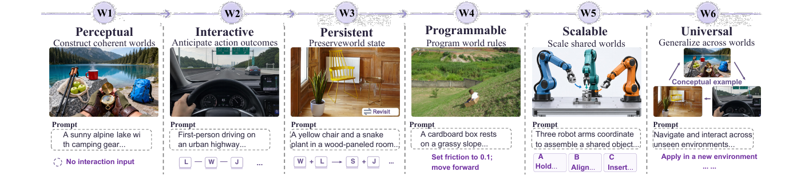
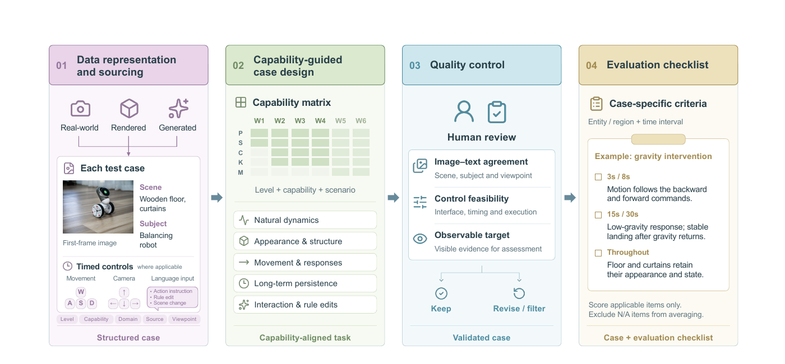
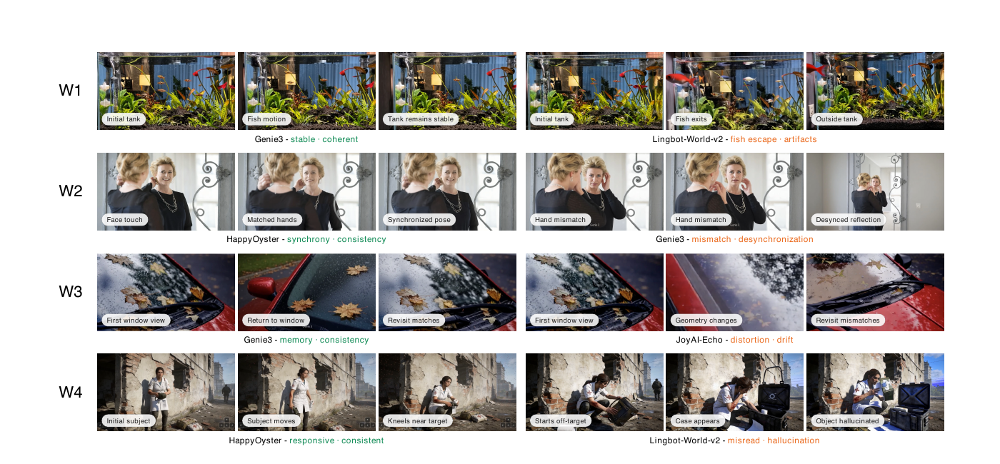
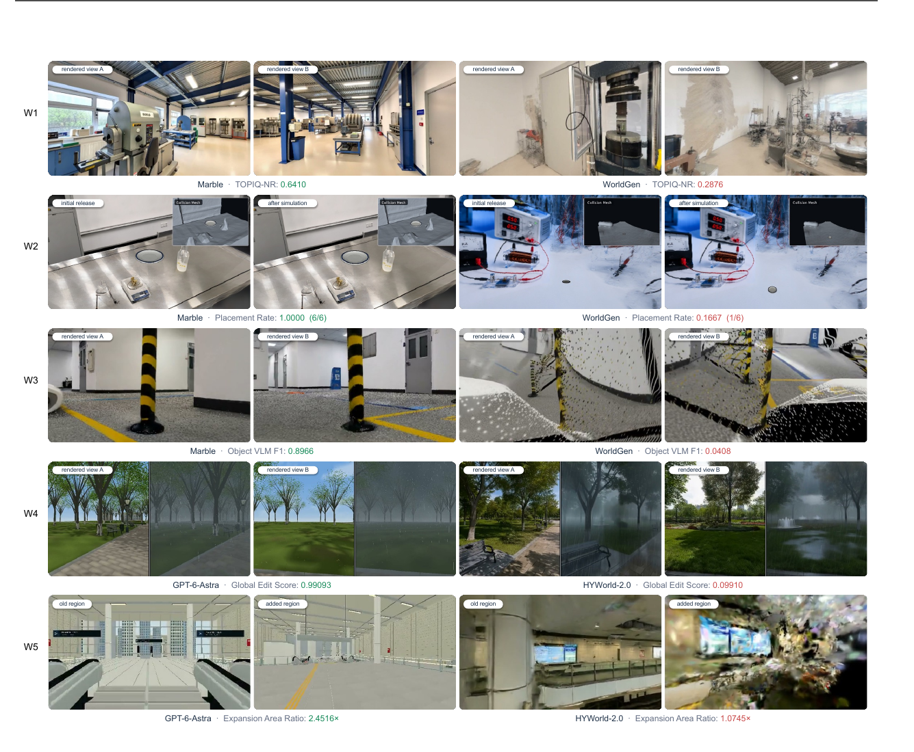
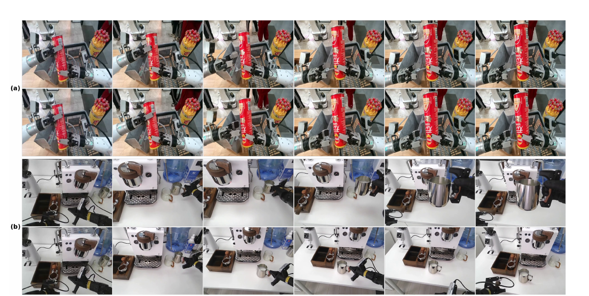

# HappyWorld-Bench

**论文**: [arXiv:2609.24308v1](https://arxiv.org/abs/2609.24308)（cs.CV，2026-09-21，53 页含附录）
**作者**: 36 人，按字母序排列 —— **① Alibaba Token Hub（阿里巴巴）**、② BIGAI 通用人工智能国家重点实验室、③ 清华、④ 南京大学、⑤ 北京大学通用人工智能国家重点实验室
**Arena 页面**: [skyeval.com/sla/arena/happyworld](https://skyeval.com/sla/arena/happyworld)（一个 4 KB 的 JS 壳，静态抓取拿不到内容）
**数据 / 评测代码**: ⚠️ **全文没有任何发布链接或发布承诺** `[待补]`

---

## 1. 一句话定位

**一个把"视频世界模型、空间世界模型、具身世界模型"三个社区放进同一套能力分级（W1–W6）的评测基准**：用自动指标测"世界在交互、记忆、干预下是否还可靠"，再用人类 A/B 对比（HappyWorld-Arena）给出 Elo。

| 赛道 | 测什么 | 规模 | 参评对象 | 覆盖等级 |
|---|---|---|---|---|
| **视频世界模型** | 首帧 + 文本 + 定时控制 → 视频是否在时空上连贯、是否响应控制与干预 | 1,138 个 case（W1–W5：218 / 294 / 342 / 180 / 104） | 14 个交互式世界模型；W1 另加 5 个纯视频生成模型 | 报告了 W1–W4 |
| **空间世界模型** | 导出的场景（3DGS / mesh）能不能走、能不能放东西、编辑与扩展时是否保留原内容 | 300 个场景（266 个快照 + 34 个扩展） | 9 个系统 | W1–W5 |
| **具身世界模型** | 机器人第一视角下，给定动作提示后机器人、场景、被操作物体如何演化 | 254 个 case（W2 62 / W3 100 / W4 92 组） | 8 个视频模型 | W2–W4 |

合计 1,692 个实例（1,138 + 300 + 254 ✅）。

🔴 **读完正文与附录、并把三条赛道的汇总分全部复算之后，我认为以下几点必须和排行榜一起读**：
1. **视频赛道存在未披露的利益冲突。** 排名第一的 **HappyOyster** 在参考文献里写作 *"Alibaba Token Hub. Happy oyster …, URL https://happyoyster.cn/"* —— **与本基准的第一作者单位完全相同**。它拿下 Arena Elo（1263）、W2、W3 第一；**W4 只评了两个模型，其中之一就是它**。全文没有利益冲突声明。另有两个阿里系模型参评：HappyHorse 1.1（其官网写 *"Released by Alibaba in June 2026"*）与 Wan 3.0（Alibaba Cloud）。
2. **HappyOyster 在 W2/W3 的领先全部来自 checklist 打分的指标。** 只看 VLM/checklist 类指标，它领先 4–6.5 分；只看非 VLM 指标，它在 14 个模型里**排第 6**。这些 checklist 由基准作者逐 case 编写，视频赛道的裁判只写了 "Gemini-based"、**版本未给**（见 [§4.4](#44-happyoyster-的领先从哪来)）。
3. **视频赛道的 W 分怎么汇总，论文没写。** 我反推出是"四个维度各自求均值再平均"（44 格全部精确吻合），它隐含的权重是 **Causality 每项 1/12、Interaction 每项 1/8、Perception/Consistency 每项 1/20** —— HappyOyster 领先最大的三项恰好落在前两类里。
4. **各模型的评测接口不对称。** HappyOyster 直接收到"帧对齐"的控制序列；Genie 3 是用 Playwright 操作网页、按墙钟时间按键（论文自承 *"timing discrepancies"*，时长容差 ±5 秒）；Cosmos3 被换成自动驾驶动作域；多个模型对部分 case 不生成，而缺失 case 按规则**不计入**而非记零 —— 每个模型的 W 分实际上是在不同子集上算的（见 [§4.6](#46-评测接口的不对称)）。
5. **空间赛道 W4（编辑）有一个可被"什么都不做"刷分的漏洞。** 按附录公式，原样返回场景的空操作编辑器 W4 = **57.14**，高于 Marble（53.51）与 Matrix-3D（49.76）（见 [§5.3](#53-w4-编辑一个空操作编辑器能拿-5714)）。
6. **W1 排名几乎完全由 Dyn（光流幅度）一项决定。** 去掉 Dyn，第一名从 Genie 3 变成几乎静止的 Lyra 2.0；而正文说 Dyn *"should be interpreted together with MS"*，**MS 却没有出现在任何一张视频表里**（见 [§4.3](#43-w1没有配重的-dyn)）。

📌 **同样要承认的优点**：三条赛道共用一套能力词汇，这在世界模型评测里是第一次；**所有汇总分（视频 44 格、空间 37 格、具身 24 格）我复算后与表格全部吻合**，表内数字自洽；附录 A.1 逐个写明了 14 个视频模型的接入方式与改动，透明度远高于同类工作；作者主动写出了若干局限（W2/W3 用不同 case 池、编辑的 no-op 可以通过、具身赛道用的是视频模型）。

---

## 2. W1–W6 能力分级

| 等级 | 名称 | 定义（Table 1 原文要点） |
|---|---|---|
| W1 | Perceptual World | 从视觉/多模态条件构建语义正确、空间结构合理、短时连续的世界 |
| W2 | Interactive World | 模拟动作条件下的状态转移，保持局部几何、物理、因果一致 |
| W3 | Persistent World | 在长时交互、视角变化、遮挡、重访下维持全局结构、物体身份与累积状态 |
| W4 | Programmable World | 支持对物体、事件、行为、世界规则的显式干预，改动因果传播、无关内容不变 |
| W5 | Scalable World | 可无限扩展、被多个具身/虚拟智能体共享的世界，支持通信、同步、协作与冲突处理 |
| W6 | Universal World | 把生成、模拟、持久状态、交互、规划统一起来，跨环境/任务/模态/本体泛化 |

> **Fig 1 逐列解读**（顶部一条带箭头的时间轴把 W1 → W6 串起来，每列上方是等级名与一句话目标，中间是示例画面，下方是 prompt 与控制输入）：
>
> - **W1 Perceptual · Construct coherent worlds** —— 高山湖边的露营装备（第一视角手持指南针）。下方 *No interaction input*：不给任何控制，只看自然演化是否连贯。
> - **W2 Interactive · Anticipate action outcomes** —— 城市高速上的驾驶第一视角。控制序列 `L — W — J …`：键盘按键按时间段排列。
> - **W3 Persistent · Preserve world state** —— 木墙房间里的黄椅子和虎尾兰，右下角标 *Revisit*。控制 `W + L → S + J …`：走开再回来，检查重访时是否一致。
> - **W4 Programmable · Program world rules** —— 草坡上的纸箱。紫字 *Set friction to 0.1; move forward*：用自然语言改物理规则。
> - **W5 Scalable · Scale shared worlds** —— 三只机械臂协同装配。下方 A / B / C 三个子任务 *Hold… / Align… / Insert…*：多智能体分工。
> - **W6 Universal · Generalize across worlds** —— 标 *Conceptual example*，用箭头把前面几列的场景连成一个环，下方 *Apply in a new environment*：只是概念示意。
>
> 📌 **W5、W6 在三条赛道里都没有真正打分**：视频赛道构建了 104 个 W5 case 却没报结果；空间赛道的 W5 实际测的是"场景扩展"而非多智能体；具身赛道只做了 W2–W4；W6 全部未评。所以这套六级框架里被实测的是 **W1–W4**。

---

## 3. 数据构建

> **Fig 3 逐栏解读**（四栏从左到右，底部各标一个产物）：
>
> **01 Data representation and sourcing → Structured case** —— 首帧来源三种：*Real-world*、*Rendered*、*Generated*。每个 test case 包括首帧图、场景描述（例：*Wooden floor, curtains*）、主体描述（例：*Balancing robot*）和适用时的定时控制：*Movement*（W/A/S/D）、*Camera*（方向键）、*Language input*（动作指令 / 规则修改 / 场景变化）。底部标签：Level、Capability、Domain、Source、Viewpoint。
>
> **02 Capability-guided case design → Capability-aligned task** —— 一个能力矩阵：列为 W1–W6（W5、W6 颜色更浅），行为 P / S / C / K / M 五个维度（感知、一致性、因果、控制、多主体），格子深浅表示覆盖强度。下方五类设计取向：*Natural dynamics*、*Appearance & structure*、*Movement & responses*、*Long-term persistence*、*Interaction & rule edits*。
>
> **03 Quality control → Validated case** —— 人工审核三项：*Image–text agreement*（场景、主体、视角一致）、*Control feasibility*（接口、时序、可执行性）、*Observable target*（有可见证据可供评估），结果分 *Keep* 与 *Revise / filter*。
>
> **04 Evaluation checklist → Case + evaluation checklist** —— 🔴 **每个 case 配一份专属的评估清单**（*Case-specific criteria*：实体/区域 + 时间区间）。示例 *gravity intervention*：`3s / 8s` 运动跟随前后命令；`15s / 30s` 低重力响应、重力恢复后稳定落地；`Throughout` 地板与窗帘保持外观与状态。底部 *Score applicable items only. Exclude N/A items from averaging.*
>
> 📌 **第 04 栏是理解后面所有争议的关键**：视频赛道的 PC、CC、IF、SC、IP、AE 等指标，本质上都是"裁判 VLM 对照这份人写的清单逐条打勾"。**清单由基准作者编写**，所以作者对"什么算做对了"的设定，会直接进入分数。

**视频赛道的数据**：1,138 个 case 同时按两种方式切分 —— 按等级（W1–W5：218 / 294 / 342 / 180 / 104）和按能力维度（感知 342、一致性 228、因果 299、可控交互 212、多主体协同 57，合计同样是 1,138 ✅），另定义了 74 个细粒度 facet。W1 不给控制；W2、W3 只规定控制方向与时间区间（不规定目标位置，因为同一输入在不同模型里走的距离不同）；W4 加入自然语言指令。

**空间赛道的数据**：从视频赛道筛出静态场景（排除有人或身体部位的首帧，改写掉第一/第三人称措辞），再补充专门采集的场景：424 个物体用于环绕一致性、72 个场景有支撑面用于放盘子、**30 对**编辑指令（18 个物体级 + 12 个全局）、34 个扩展场景。

**具身赛道的数据**：W2 62 个单步动作（5 s），W3 100 个多步序列（12 s），W4 92 组配对（40 组动作条件变化 + 52 组物理规则变化，每组两条 5 s 分支）；共 254 张参考图、2,768 条 rollout（= 8 个模型 × (62 + 100 + 92 × 2) ✅）。统一转成 24 fps，VLM 断言在 4 fps 采样帧上评。

---

## 4. 视频世界模型赛道

### 4.1 指标：15 项里有 6 项是清单式打分

| 维度 | 指标 | 实现（§3.2 + 附录 A.2） | 是否 VLM/清单 |
|---|---|---|---|
| **Perception** | VQ | MUSIQ 无参考画质 | |
| | HPS | HPSv3（Qwen2-VL-7B 奖励模型） | |
| | IS | 亮度 / 色温一致性 + 锐度保持 | |
| | Dyn | RAFT 光流幅度，**越大越好** | |
| | IF | 由 prompt 拆出的原子清单（存在、数量、属性、空间关系、风格…） | ✅ |
| **Consistency** | BC | 掩掉主体后的 CLIP 背景相似度 | |
| | GC / TC | DA3 深度重投影的几何一致 / 光度一致 | |
| | SC | 对照场景描述的 1–5 整数 rubric | ✅ |
| | SuC | SAM2.1 掩码上的 DINOv2 / CLIP 相似度 | |
| **Causality** | PC | **Gemini** 清单，1–5 分，物理过程是否可信 | ✅ |
| | CC | **Gemini** 清单，1–5 分，触发 → 结果的事件链是否成立 | ✅ |
| | IP | 穿插、嵌入、悬空的逐项 0/1 视觉判断 | ✅ |
| **Interaction** | TA | DA3 估出的相机位移与 W/A/S/D 方向是否一致（W2–W3） | |
| | AE | 命令动作是否在对应时间段内可见地完成，逐项 0/1（W2–W3） | ✅ |
| | IV / SF | W4 专用：干预过程是否合理 / 目标状态达成、持续与无关内容保留 | ✅ |

⚠️ **裁判模型只写了 "Gemini-based"（PC、CC），版本全文未给**；IF、SC、IP、AE、IV、SF 的裁判是哪个模型，附录也没写 `[待补]`。

### 4.2 总表（Table 2）与汇总方式

| 模型 | Arena Elo ↑ | W1 ↑ | W2 ↑ | W3 ↑ | W4 ↑ |
|---|---|---|---|---|---|
| **HappyOyster**（Alibaba Token Hub） | **1263** | 82.4 | **78.0** | **76.8** | **66.7** |
| Genie 3 | 1206 | **82.8** | 74.0 | 75.0 | – |
| JoyAI-Echo | 1147 | 78.2 | 74.5 | 74.1 | – |
| Alaya-EVOKE | 1132 | 79.2 | 73.9 | 74.6 | – |
| LingBot-World-v2 | 1115 | 81.9 | 72.6 | 71.0 | 59.3 |
| Cosmos3 | 1092 | 81.3 | 70.2 | 64.8 | – |
| Yume-1.5 | 1063 | 79.6 | 70.2 | 67.7 | – |
| Lyra 2.0 | 1059 | 81.0 | 73.5 | 71.6 | – |
| DreamX-World | 1041 | 80.3 | 72.7 | 72.4 | – |
| Matrix-Game 3.0 | 943 | 78.8 | 64.6 | 66.1 | – |
| SANA-WM | 917 | 78.0 | 64.0 | 62.4 | – |
| Matrix-Game 2.0 | 856 | 63.4 | 61.1 | 59.6 | – |
| ABot-World | 843 | 69.0 | 64.6 | 60.4 | – |
| Open-Oasis | 324 | 53.1 | 43.3 | 39.4 | – |

（原表无加粗；上表加粗为各列最大值，由我标注。）

**W 分怎么来的，正文与附录都没写。** 我逐个试了几种汇总方式，只有下面这种能让 44 个格子全部精确吻合（误差 ≤ 0.05）：

$$
W = \frac{1}{4}\left(\overline{\mathrm{Perception}} + \overline{\mathrm{Consistency}} + \overline{\mathrm{Causality}} + \overline{\mathrm{Interaction}}\right)
$$

即先在每个维度内求均值，再对四个维度等权平均（W1 只有前两个维度）。例：HappyOyster 的 W4 = (79.30 + 78.57 + 55.20 + 53.58) / 4 = 66.67；若对 15 项直接平均则是 70.81，对不上。

📌 **这个汇总方式等于给指标设了不同权重**：Perception、Consistency 各 5 项，每项 1/20；Causality 3 项，每项 **1/12**；Interaction 2 项，每项 **1/8**。**单个 AE 的权重是单个 VQ 的 2.5 倍** —— 论文没有说明这一点，也没有讨论为什么。

另外，**三条赛道的 Elo 均值都恰好是 1000**（视频 14,001 / 14、空间 9,000 / 9、具身 8,000 / 8），与附录 B.8 说的 Bradley–Terry 均值归一化一致。但**视频赛道的投票数、评分者人数、置信区间、以及对"不支持的能力"如何处理，全文都没写** `[待补]` —— 这一点很关键，见 [§5.2](#52-空间-arena-elo-里有补进去的确定性胜负)：空间赛道的 Elo 对不支持某能力的模型**补了确定性的负局**，而视频赛道的 W4 只有 HappyOyster 与 LingBot-World-v2 两个模型支持。

### 4.3 W1：没有配重的 Dyn

W1 表里除了 14 个世界模型，还多了 5 个纯视频生成模型。用同样的汇总方式算它们的 W1（论文没列进 Table 2，是我算的）：

| 纯视频生成模型 | W1（我算） |
|---|---|
| MiniMax-H3 | 81.62 |
| Seedance 2.5 | 81.61 |
| Wan 3.0 | 81.25 |
| HappyHorse 1.1 | 80.54 |
| Kling 3.0 | 80.17 |

**全部低于 Genie 3（82.82）、HappyOyster（82.39）、LingBot-World-v2（81.92）**。这是因为 W1 一半权重在一致性指标上，而世界模型在这方面更稳。

🔴 **但 W1 的排名对 Dyn 一项极其敏感。** 表里的现象很典型：**Lyra 2.0 包揽了全部五项一致性第一**（BC 97.98、GC 99.44、TC 94.19、SC 96.42、SuC 98.18），而它的 **Dyn 只有 4.50** —— 几乎不动；DreamX-World 的 Dyn 是 99.63，一致性却垫底。我把 Dyn 从 Perception 里拿掉重算：

| | 前三名 |
|---|---|
| 论文的 W1 | Genie 3（82.82）> HappyOyster（82.39）> LingBot-World-v2（81.92） |
| **去掉 Dyn** | **Lyra 2.0（88.56）> Cosmos3（88.34）> Seedance 2.5（86.08）** —— Genie 3 与 HappyOyster 都掉出前六 |

**W1 的排名本质上是"动得多"与"保持一致"之间的拔河，而拔河的一方只有 Dyn 这一个指标。** 附录 A.2 自己写了 *"Dyn should be interpreted together with MS: Dyn measures motion magnitude, whereas MS measures motion continuity. Flicker is excluded because temporal smoothness is represented by MS"* —— **可是 MS 在视频赛道里既没有定义，也没有出现在任何一张表里**。结果是：闪烁指标因为"由 MS 代表"被排除了，MS 本身又没报，Dyn 就成了一个"越动越加分"、不看动得对不对的指标。

📌 仓库里已经有三篇笔记记录过光流幅度类动态指标的问题：[Recency Forcing](../../video_generation/recency_forcing/analysis.md) 里上下文截断把 VBench 的 Dynamic Degree 刷到 88.58 而综合质量下降；[RAVEN](../../video_generation/raven/analysis.md) 干脆弃用 VBench 的 Dynamic Degree，理由是 RAFT 光流会把镜头抖动和时序漂移都算成运动。**HappyWorld-Bench 在这里重复了同样的设计。**

### 4.4 HappyOyster 的领先从哪来

W2 里 HappyOyster 单项领先最多的三项（Table 4）：

| 指标 | HappyOyster | 次高 | 差 | 打分方式 |
|---|---|---|---|---|
| AE（动作是否执行） | **80.20** | 69.53（JoyAI-Echo） | +10.67 | 逐项 0/1 视觉判断 |
| CC（事件因果） | **77.51** | 67.33（JoyAI-Echo） | +10.18 | Gemini 清单，1–5 分 |
| PC（物理因果） | **84.90** | 78.64（Genie 3） | +6.26 | Gemini 清单，1–5 分 |

**三项都是清单式打分，而且恰好落在权重最高的两个维度（Causality、Interaction）里。** 于是我把 15 项指标分成两组各自平均，看排名怎么变（论文没做这个分析）：

| 汇总方式 | W2 前三 | W3 前三 | HappyOyster 名次 |
|---|---|---|---|
| 论文的汇总 | **HappyOyster 78.0** > JoyAI-Echo 74.5 > Genie 3 74.0 | **HappyOyster 76.8** > Genie 3 75.0 > Alaya-EVOKE 74.6 | 第 1 / 第 1 |
| 15 项简单平均 | HappyOyster 77.8 > Genie 3 75.5 > Alaya-EVOKE 74.7 | HappyOyster 75.9 > Genie 3 74.9 > Alaya-EVOKE 74.7 | 第 1 / 第 1 |
| **只用 VLM/清单指标**（IF、SC、PC、CC、IP、AE） | **HappyOyster 83.1** > JoyAI-Echo 76.6 > Genie 3 75.6 | **HappyOyster 84.2** > Genie 3 80.2 > JoyAI-Echo 77.6 | 第 1，领先 6.5 / 4.0 |
| **只用非 VLM 指标**（VQ、HPS、IS、Dyn、BC、GC、TC、SuC、TA） | Cosmos3 77.3 > Yume-1.5 76.9 > Genie 3 75.5 | Cosmos3 74.7 > Alaya-EVOKE 73.0 > Yume-1.5 71.8 | 🔴 **第 6 / 14，第 6 / 14** |

**结论：HappyOyster 在 W2、W3 的第一，完全由清单式打分的那几项撑起来。**

两面都要说清楚：
- ⚠️ **不能据此说 HappyOyster 不好。** 清单类指标测的正是这个基准最想测的东西 —— 动作有没有执行、因果链对不对。非 VLM 那组也不是金标准：其中五项一致性指标偏爱"几乎不动"的输出（Cosmos3 的领先有一部分来自这里，它的 CC 只有 33.18）。
- 🔴 **但这恰恰是最需要外部校验的部分。** 这些清单由基准作者逐 case 编写（Fig 3 第 04 栏），作者与 HappyOyster 同属一个单位；裁判模型只写了 "Gemini-based"，版本未给；没有报告裁判与人工标注的一致性，也没有报告任何分数的置信区间。**在这种情况下，本单位模型的领先恰好只出现在清单类指标上，是需要读者自己心里有数的。**

### 4.5 W4：两个模型的比较

W4（180 个 case，占视频赛道的 15.8%）只评了 HappyOyster 与 LingBot-World-v2，理由是 *"which support the required intervention setting"*。15 项里 HappyOyster 高 13 项，LingBot 只在 VQ（69.14 vs 68.24）和 IF（94.80 vs 94.25）上略高。

但两者的接入方式不同。附录 A.1 写明 LingBot-World-v2 的事件指令 *"are appended to the environment description … encoded once for the entire rollout. Event descriptions therefore provide global conditioning rather than updates aligned to their individual execution intervals, limiting the temporal precision of language-based interventions"* —— **它是通过一个非原生的适配方式参加 W4 的**，而 HappyOyster 按自己的接口接收定时控制。另外两者的 **CC 都只有 20–24、SF 只有 29–39**，W4 的"干预"对两个模型基本都没做成。

### 4.6 评测接口的不对称

附录 A.1 逐个写明了 14 个模型的接入方式，这一节本身是全文最透明的部分。把关键差异摘出来：

| 模型 | 控制怎么送进去 | 输出规格 | 被跳过的 case |
|---|---|---|---|
| **HappyOyster** | 动作转成模型的 **"frame-aligned control representation"**，按时间精确对齐 | 约 832×480 像素预算；帧率与解码参数未给 | 无说明 |
| **Genie 3** | 通过 Project Genie 网页，用 **Playwright 自动按键**，按**墙钟时间**调度；*"Because browser interaction, service latency, and export boundaries can introduce timing discrepancies, the prescribed control duration should not be interpreted as an exact encoded video duration"*；时长容差 ±5 s | 1280×704 为主；checkpoint、种子、步数都不可控 | W4（不支持） |
| LingBot-World-v2 | 相机轨迹 → Plücker 嵌入；事件拼进全局 prompt | 832×480，16 fps | — |
| **Cosmos3** | **没用它自己的相机位姿接口**（*"responds reliably only to in-distribution scenes and is otherwise largely ignored"*），改用**自动驾驶动作域**：俯仰被丢弃，横移变成弧线，原地转向时强加一点前进速度 | 736×480，16 fps | 纯事件 case 不渲染 |
| Yume-1.5 | 控制写成 caption 里的 W/A/S/D 与方向 token，按 1.81 s 的 chunk 量化 | 1280×704，16 fps | 事件类 case 不评 |
| DreamX-World | 相机外参 → PRoPE；第三人称时角色不会跟着动 | 1280×704，16 fps | 纯事件 case 不生成 |
| Matrix-Game 2.0 | 键鼠向量，**不用文本** | 640×352，12 fps | — |
| JoyAI-Echo / Alaya-EVOKE / Lyra 2.0 / SANA-WM / ABot-World / Open-Oasis | 各自的相机或键鼠接口 | 640×360 @ 20 fps 到 1280×704 @ 24 fps 不等 | — |

三个后果：
1. **TA、AE 这类"按时间段对齐打分"的指标，对 Genie 3 天然不利。** 它的控制时序由浏览器决定，偏差可达数秒；HappyOyster 则是帧级对齐。Table 4 里 Genie 3 的 AE 是 58.62，14 个模型里排第 11（Cosmos3、Yume-1.5、Open-Oasis 更低）。
2. **每个模型的 W 分是在不同子集上算的。** 附录 A.2：*"Inapplicable cases and missing measurements are excluded from aggregation rather than assigned a zero."* 而 Yume-1.5、DreamX-World、Cosmos3 都有一类 case 没生成。**全文没有给出每个模型实际被评了多少个 case** `[待补]`。
3. **分辨率、帧率跨度很大**（从 640×352 @ 12 fps 到 1280×704 @ 24 fps），而 MUSIQ、HPSv3、光流都对分辨率和帧率敏感。论文没说是否统一重采样后再打分（具身赛道写明了统一到 24 fps，视频赛道没写）。

> **Fig 4 逐行解读**（每行左半是正例、右半是反例，各三帧；下方绿字为优点、橙字为问题）：
>
> - **W1（鱼缸）** —— 左 Genie 3 *stable · coherent*：鱼在缸内游动、鱼缸保持稳定；右 LingBot-World-v2 *fish escape · artifacts*：中间帧鱼游出缸外，最后一帧标 *Outside tank*。
> - **W2（照镜子的女士）** —— 左 **HappyOyster** *synchrony · consistency*：摸脸时手与镜中像同步（*Matched hands*、*Synchronized pose*）；右 Genie 3 *mismatch · desynchronization*：镜中手的位置对不上（*Hand mismatch*），最后一帧镜像不同步（*Desynced reflection*）。
> - **W3（车窗与落叶）** —— 左 Genie 3 *memory · consistency*：离开车窗后再回来，落叶位置一致（*Revisit matches*）；右 JoyAI-Echo *distortion · drift*：中间帧几何变形，重访时对不上。
> - **W4（废墟前的人物）** —— 左 **HappyOyster** *responsive · consistent*：人物走动后在目标附近跪下；右 LingBot-World-v2 *misread · hallucination*：一开始就偏离目标，凭空出现一个箱子（*Case appears*、*Object hallucinated*）。
>
> ⚠️ **HappyOyster 在这张图里出现了两次，两次都是正例；从未作为反例出现。** 挑哪些样本入图由作者决定，这张图不宜当作排名证据。

---

## 5. 空间世界模型赛道

### 5.1 总表（Table 7）与 GPT-6-Astra

| 模型 | Arena Elo ↑（capability-adjusted） | W1 ↑ | W2 ↑ | W3 ↑ | W4 ↑ | W5 ↑ |
|---|---|---|---|---|---|---|
| GPT-6-Astra | 1252 | 63.72 | 65.43 | **68.80** | **82.09** | **63.10** |
| Marble | **1308** | **79.10** | 64.99 | 59.89 | 53.51 | 45.44 |
| HYWorld-2.0 | 1230 | 76.30 | **67.71** | 57.99 | 59.97 | 43.16 |
| HYWorld-1.0 | 1029 | 78.78 | 59.40 | 55.19 | 66.16 | – |
| Matrix-3D | 1019 | 46.35 | 56.35 | 52.73 | 49.76 | 35.15 |
| WorldGen | 962 | 69.17 | 60.11 | 54.16 | 57.56 | – |
| FlashWorld | 743 | 49.39 | 0.00 | 38.13 | – | – |
| Lyra 2.0 | 729 | 57.58 | 0.90 | 40.52 | – | – |
| Lyra 1.0 | 728 | 41.10 | 1.36 | 37.07 | – | – |

（表的行序是论文规定的固定顺序，不是排名；加粗为我标的各列最大值。）

🔴 **GPT-6-Astra 在全文没有任何引用、参考文献条目或来源说明。** 关于它只有两句：§2.1 的 *"Our evaluated set additionally includes GPT-6-Astra, whose **submitted scenes** follow the same spatial-world evaluation protocol"*，以及 §4.3 的 *"GPT-6-Astra instead constructs meshes directly through **Blender**"*。也就是说：
- 它的场景是**提交**来的，不是基准方自己跑出来的 —— 无法排除挑选；
- 它是一个**在 Blender 里搭 mesh** 的系统（大概率是 LLM 生成建模代码的 agent）。

**这直接解释了它为什么拿下 W3–W5**：显式 mesh 天然在任何视角下都一致（W3 亮度一致性 90.01、越界率最低）；用代码修改场景天然只动目标物体（W4 背景 RGB 保留 **100.00**、LPIPS 相似度 99.12、DINO 相似度 99.82）；扩展时直接加几何体（W5 面积比 2.45×）。**而它的 W1 最低之一（63.72）**，PI 只有 18.33、HPS 48.48 —— 论文的解释是 *"its scenes resemble synthetic environments, with clean surfaces and well-defined shapes but limited geometric detail and material realism"*。**W3–W5 的指标在结构上就偏爱程序化的显式几何**，这与"生成式世界模型"比的不是同一件事。

> **Fig 6 逐行解读**（每行左两张为正例、右两张为反例，下方标对应指标值）：
>
> - **W1（实验室室内）** —— Marble（TOPIQ-NR 0.6410）两个渲染视角都干净清晰；WorldGen（0.2876）视角 B 的墙面被涂抹成一片模糊。
> - **W2（放盘子）** —— Marble *Placement Rate 1.0000 (6/6)*：右上角插入的碰撞网格显示桌面完整，模拟前后盘子都稳稳在桌上；WorldGen *0.1667 (1/6)*：模拟后盘子位置变了（掉落或滑走）。
> - **W3（黑黄警示柱）** —— Marble *Object VLM F1 0.8966*：两个视角下柱子完整；WorldGen *0.0408*：柱子碎成点状的溅射伪影。
> - **W4（公园改成下雨）** —— 每张图左半为编辑前、右半为编辑后。**GPT-6-Astra** *Global Edit Score 0.99093*：**画面明显是低多边形的合成场景**（形状简单的树、平涂的草地），加雨后几何完全不变；HYWorld-2.0 *0.09910*：照片级的公园，但编辑后的视角里场景结构也跟着变了。
> - **W5（地铁站扩展）** —— **GPT-6-Astra** *Expansion Area Ratio 2.4516×*：新增区域同样是干净的合成几何；HYWorld-2.0 *1.0745×*：新增区域是一团模糊的溅射伪影。
>
> 📌 **W4、W5 两行把"程序化 mesh vs 生成式场景"的差别画得很清楚**：前者在"改得准、不走样"上天然占优，后者在"看起来真实"上占优。基准把两者放进同一张榜，但 W1 与 W3–W5 奖励的是相反的东西。

### 5.2 空间 Arena Elo 里有补进去的确定性胜负

附录 B.8 原文：

> *"We compute Arena Elo from human pairwise comparisons across W1, W3, W4, and W5 using Bradley–Terry maximum likelihood estimation, with the mean rating normalized to 1000. Since ratings based only on observed comparisons do not penalize unsupported capabilities, we **supplement human votes with deterministic outcomes**. For each prompt and model pair where at least one model does not support the evaluated capability, we add one comparison in each presentation order. **A supported model wins against an unsupported model** … Each added comparison receives the same weight as one human vote."*

所以 Table 7 的 "Arena Elo" **不是纯人类偏好**，而是"人类投票 + 按能力覆盖补的胜负"。FlashWorld、Lyra 两代不支持 W4、W5（表中为 `–`），在这两级的每个 prompt 上都会被记为输给所有支持的模型 —— 它们 728–743 的 Elo 有多少来自人评、多少来自补票，**论文没给人类投票数，无从拆分** `[待补]`。论文把表名写成 "Capability-adjusted Arena Elo" 并在附录说明，这是诚实的；**但同样的问题在视频赛道更要紧，而视频赛道对此一个字都没写**（见 [§4.2](#42-总表table-2与汇总方式)）。

### 5.3 W4 编辑：一个空操作编辑器能拿 57.14

空间 W4 由 7 个指标等权平均（附录 B.8）：编辑成功率 1 项、**背景保留 4 项**（RGB PSNR、LPIPS、DINO、深度一致率）、联合分 2 项。关键公式在附录 B.5：

- **编辑成功率（M31）**：Qwen3-VL 判断编辑后任一视角是否满足指令，取 OR。附录自己写了 *"Before judgments do not gate improvement, so **an already-satisfied no-op can pass**."*
- **四项背景保留（M32–M35）**：比较编辑前后的背景区域，**不以编辑成功为条件**。完全不改动时：背景 PSNR 取上限 99（MSE ≤ 1e-12），LPIPS 与 DINO 距离为 0，深度一致率为 1。
- **两个联合分（M36、M37）**：`S_o,i = E_i · [1 − (RMSE + LPIPS + D)/3]`、`S_g,i = E_i · A_D,i`，编辑失败（`E_i = 0`）时为 0。

再看 Table 19 的归一化：背景 PSNR 用 `C(1 − 10^(−x/20))`，DINO 距离用 `1 − C(x/2)`，LPIPS 用下界 `L = 0.00038` 的仿射映射，深度一致率用 `C(x)` —— **完全不改动时这四项都归一化到 100**。于是一个原样返回场景的"编辑器"：

$$
W_4^{\mathrm{no\text{-}op}} = \frac{0 + 100 + 100 + 100 + 100 + 0 + 0}{7} = 57.14
$$

| | W4 |
|---|---|
| GPT-6-Astra | 82.09 |
| HYWorld-1.0 | 66.16 |
| HYWorld-2.0 | 59.97 |
| WorldGen | 57.56 |
| **空操作编辑器（按论文公式推算）** | **57.14** |
| Marble | 53.51 |
| Matrix-3D | 49.76 |

🔴 **什么都不做的编辑器，W4 高于 Marble 和 Matrix-3D，只比 WorldGen 低 0.42。** 若有部分指令本来就满足（论文承认这种 no-op 能通过成功判定），它还会更高。根源是**保留度占了 4/7 的权重、却不以编辑成功为条件**。另外编辑集只有 **30 对**，成功率的粒度是 3.33%（摘要里 "at best … 73.33% edit execution" = 22/30）。

---

## 6. 具身世界模型赛道

### 6.1 参评的其实是 8 个通用视频模型

| 模型 | Arena Elo ↑ | W2 ↑ | W3 ↑ | W4 ↑ |
|---|---|---|---|---|
| MiniMax-H3 | **1060** | **93.60** | **91.42** | **88.62** |
| Grok Imagine Video 1.5 | 1051 | 93.02 | 88.51 | 83.48 |
| Wan 3.0（Alibaba Cloud） | 1051 | 90.53 | 87.96 | 84.53 |
| Seedance 2.5 | 1031 | 90.91 | 86.73 | 84.11 |
| HappyHorse 1.1（Alibaba） | 1026 | 91.59 | 88.82 | 84.60 |
| Kling 3 | 978 | 85.94 | 84.26 | 78.70 |
| Cosmos 3 | 931 | 69.16 | 74.47 | 68.33 |
| Sora 2 | 872 | 60.91 | 65.35 | 64.12 |

（Table 14，按 Arena Elo 排序，来自 **62,592 张盲测投票** —— 三条赛道里唯一给了票数的。）

**评测形式**：每个 case 是"一张机器人头戴相机拍的参考图 + 一段自然语言动作提示 → 生成视频"，即 `Y_{1:T} = G_θ(I_0, p)`。**8 个参评对象全是通用的文生/图生视频模型**，没有一个是为机器人动作条件训练的；论文自己写 *"We instantiate the embodied track with video models"*、*"The current action interface uses natural-language prompts"*。所以这条赛道测的更准确地说是"**通用视频模型在机器人第一视角提示下的表现**"。

**汇总**：17 个指标分四维（感知 4、一致性 5、因果 3、可控 5），维度内平均后按 **20% / 20% / 30% / 30%** 加权（附录 C.6 Eq. 91）。我复算了 24 格，全部吻合。

**读法**：
- **MiniMax-H3 三级全第一、Elo 也第一**；Cosmos 3 与 Sora 2 三级都低于 75 —— 与正文一致。**这条赛道的第一不是阿里系模型**，HappyHorse 1.1 在 W3、W4 排第二，Wan 3.0 的 Elo 与 Grok 并列第二。
- ⚠️ **前五名的 Elo 只差 34 分**（1026–1060），Grok 与 Wan 3.0 并列 1051，**没有置信区间**。
- ⚠️ **头部已接近天花板，区分度有限。** W2 的清单类指标几乎都是 `k/62` 的整数倍（例：96.77 = 60/62、95.16 = 59/62），**MiniMax-H3 与 Grok 在 TCO、CTV、GSA、AAC、FIS 五列上完全相同**（60/62、60/62、59/62、61/62、60/62）—— 前五名之间差的往往只有 1–3 个 case。感知维度也饱和：W2 的 Scene Fidelity 除 Sora 2 外全在 97.96–98.19 之间。
- 📌 **Cosmos 3 再次出现"一致性高、可控性低"的组合**（W2 的 GC 78.27 为 8 个模型中最高、TC 85.48 仅次于 Seedance 2.5 的 88.72，但 GSA 只有 50.00、AAC 46.77）—— 与视频赛道里 Lyra 2.0、Cosmos3 的模式相同：动得少的模型在一致性上占便宜。

### 6.2 W4：物理规则编辑几乎没有响应，但 CBF 看不出来

正文对 W4 的定性结论很明确：*"For edited physical rules the response is close to absent: a changed material, gravity, or friction setting leaves no identifiable trace in the generated dynamics."* 而 92 组里有 **52 组**是物理规则编辑。

可是专门衡量"两条分支是否按要求不同"的 CBF，在前五名模型上是 **81.5–91.5**（HappyHorse 1.1 最高，91.52）。原因在附录 C.5 的定义：CBF 先让 VLM 判断**每条分支**的动作/条件与预期结果是否可见，再判断**两条分支之间**是否有要求的差异，然后把这些判断平均成一个组分。**"差异"只是被平均进去的若干判断之一** —— 物理规则毫无效果、但两条分支都把"抓起罐子"这个动作做出来了，CBF 仍能拿到大部分分数。**论文没有单独报告"差异"这一项**，所以它最想测的"模型是否响应编辑"，在分数里被稀释了。

> **Fig 9 逐组解读**（每组两行，上下两行是同一初始帧、两种条件下的两条 rollout，各六帧）：
>
> - **(a) 物理规则编辑毫无效果** —— 两行都是双臂抓起红色薯片罐并举起；下面一行额外规定罐子是**软橡胶材质**。结果两行的罐子形变完全一样、始终是刚性的，**两条 rollout 在视觉上无法区分**。
> - **(b) 动作条件只被部分执行** —— 上一行要求抓住咖啡机右侧的银色奶缸并**向上提**，下一行要求接触同一只奶缸并**向左推**。上一行按要求提起；下一行奶缸确实向左移了，**但夹爪是抓住把手拖过去的，而不是推** —— 方向对了，方式错了。
>
> 📌 **(a) 这种"两条分支一模一样"的失败，在 CBF 里只会丢掉"差异"那一项判断的分**，这正是 §6.2 说的稀释。

⚠️ 另外，**这 8 个模型各自怎么调用（API 版本、请求分辨率与时长、种子、prompt 是否改写）附录都没写** `[待补]` —— 视频赛道 W1 里另加的 5 个纯视频生成模型也一样没写。

---

## 7. 数字核对

**核对通过的**：

| 项 | 结果 |
|---|---|
| 视频赛道 W1–W5 case 数之和、五个能力维度 case 数之和 | 都是 1,138 ✅ |
| 空间 266 + 34、具身 62 + 100 + 92、三赛道合计 | 300 / 254 / 1,692 ✅ |
| 具身 rollout 数 8 × (62 + 100 + 92 × 2) | 2,768 ✅ |
| **视频 Table 2 的 44 个 W 分** ← Table 3–6（按"维度均值再平均"） | **44 / 44 吻合** ✅ |
| **空间 Table 7 的 37 个 W 分** ← Table 8–12（保留指标等权平均，FlashWorld 缺 PI 用 9 项） | **37 / 37 吻合** ✅ |
| **具身 Table 14 的 24 个分** ← Table 15–17（20/20/30/30） | **24 / 24 吻合** ✅ |
| 三赛道 Elo 均值 | 都是 1000（B-T 均值归一化）✅ |
| 摘要 "at best 70.14% placement accuracy and 73.33% edit execution" | HYWorld-2.0 的 70.14 / 73.33（= 22/30）✅ |
| 正文对各表的文字描述（谁领先、谁低于 75 等） | 逐条核过，全部与表一致 ✅ |
| 加粗 | 视频与具身的表无加粗；空间 Table 9 的两个加粗（69.05、70.14）是列最大值 ✅ |

**对不上或没交代的**：
1. 🔴 **视频赛道的 W 分汇总方式未写明**，隐含的非等权（见 §4.2）。
2. 🔴 **视频赛道 Arena 的投票数、评分者、置信区间、以及不支持能力的处理方式，全都没写**；空间赛道则明确补了确定性胜负（见 §5.2）。
3. 🔴 **MS 被正文当作 Dyn 的配重引用，却没有定义、没有出现在任何视频表里**（见 §4.3）。
4. ⚠️ **视频赛道的 104 个 W5 case 没有任何结果**；"多主体协同"这个能力维度（57 个 case）也没有对应指标。
5. ⚠️ **引用错误**：§2.2 写 *"iWorld-Bench introduces a unified action-generation framework … (Xu et al., 2026b)"*，但参考文献里 Xu et al., 2026b 是 **WorldRoamBench**（arXiv:2606.31672）；iWorld-Bench 应为 Fang et al., 2026（arXiv:2605.03941）。
6. ⚠️ **摘要说 "video models exhibit reduced consistency during extended rollouts and revisits"**。表里确实是 14 个模型的 Consistency 维度从 W2 到 W3 **全部下降** —— 但正文自己提醒 *"Because W2 and W3 use different case pools, differences in their aggregate scores should not be interpreted as a pure duration effect"*，且没有同一 case 内随时长变化的曲线。
7. ⚠️ 各模型实际被评的 case 数没给；GPT-6-Astra 无引用、无来源；视频赛道的裁判模型版本没给。

---

## 8. 争议与权衡

**站得住的**：
- 📌 **把三个社区放进同一套能力词汇，这件事本身有价值。** 视频、空间、具身三类"世界模型"此前各测各的，W1–W4 至少给了一个可对照的坐标系；"视觉好 ≠ 世界可靠"这个核心论点在三条赛道里都有数据支撑（视频 W1 的感知与一致性分离、空间 W1 与 W2–W5 的反差、具身的感知饱和而可控性分化）。
- 📌 **表内数字完全自洽**：105 个汇总分我全部复算吻合，没有发现抄录或算术错误。
- 📌 **附录 A.1 对 14 个视频模型的接入方式写得极细**，包括不利于自己结论的细节（Genie 3 的时序误差、Cosmos3 换了动作域、LingBot 的事件只能全局注入）—— 正因为写了，读者才能看出接口的不对称。
- 📌 **作者主动写出了若干局限**：W2/W3 不能当时长效应比；编辑的 no-op 能通过；具身赛道用的是视频模型；空间 Arena 做了能力调整。

**需要打折的**：
- 🔴 **利益冲突未披露**：HappyOyster 与本基准同属 Alibaba Token Hub，是视频赛道 Arena、W2、W3、W4 的第一；W4 只评了它和另一个模型。另有两个阿里系模型参评。
- 🔴 **HappyOyster 的领先只出现在清单类指标上**（非 VLM 指标下排第 6），而清单由作者编写、裁判版本未给、也没有报告裁判与人工标注的一致性（§4.4）。
- 🔴 **接口不对称**：HappyOyster 帧对齐控制，Genie 3 网页按键、墙钟调度；多个模型评测子集不同且缺失不计零（§4.6）。
- 🔴 **视频 Arena 的方法与规模完全未交代**，而空间 Arena 明确补了确定性胜负 —— 视频赛道若用了同样规则，只有两个模型支持的 W4 会给它们送分（§4.2、§5.2）。
- 🔴 **空间 W4 可被空操作刷到 57.14**，高于两个真实系统（§5.3）。
- 🔴 **GPT-6-Astra 无引用、场景是"提交"的**，且它的程序化 mesh 在结构上就适配 W3–W5 的指标（§5.1）。
- ⚠️ **W1 的排名几乎由 Dyn 一项决定**，去掉它第一名就换人；本应配重的 MS 缺席（§4.3）。
- ⚠️ **CBF 把"差异"判断稀释在逐分支的可见性判断里**，测不出"模型是否响应编辑"（§6.2）。
- ⚠️ **所有分数都没有置信区间**；附录 B.7 自己写 *"The reported results are descriptive model averages."*
- ⚠️ **数据与评测代码没有发布链接**，贡献列表里的 "reproducible evaluation" 目前无从验证。

---

## 9. 一句话总结

**HappyWorld-Bench 用一套 W1–W6 能力分级把视频、空间、具身三类世界模型放进同一个评测框架：视频赛道 1,138 个 case 评了 14 个交互式世界模型（外加 5 个视频生成模型），空间赛道 300 个场景评了 9 个系统，具身赛道 254 个 case 评了 8 个视频模型，自动指标之外再用 HappyWorld-Arena 的人类 A/B 对比给 Elo。** 三条赛道的 105 个汇总分我全部复算吻合，表内自洽；附录对各模型接入方式的记录也异常详细。🔴 **但视频赛道的排行榜需要带着几个前提读**：排第一的 HappyOyster 与本基准同属 **Alibaba Token Hub**，论文没有披露这层关系；它在 W2/W3 的领先**完全来自由作者编写清单、Gemini（版本未给）打分的那几项**，只看非 VLM 指标它排第 6；W 分的汇总方式没写明，反推出来是让因果与交互类指标权重更高的"维度均值再平均"；它拿到的是帧对齐控制，而 Genie 3 是网页自动按键、墙钟调度；W4 只评了它和另一个模型；视频 Arena 的票数与方法一字未提。**空间赛道**里，一个原样返回场景的空操作编辑器按附录公式能拿 57.14 的 W4、超过 Marble 与 Matrix-3D；拿下 W3–W5 的 GPT-6-Astra 没有任何引用，场景是"提交"来的 Blender mesh。**具身赛道**实际测的是通用视频模型，头部已贴近天花板，MiniMax-H3 三级第一。📌 **这个框架作为"世界模型该测什么"的词汇表是有用的，但当作排行榜用之前，最该补的是：利益冲突声明、视频 Arena 的方法与票数、清单裁判与人工的一致性、统一的推理接口，以及置信区间。**

---

## 10. 在仓库图谱里的位置

| | 关系 |
|---|---|
| **[Alaya-EVOKE](../evoke/analysis.md)** | 视频赛道参评，Arena Elo 1132 排第 4，W3 74.6 排第 3 |
| **[ABot-World-0](../abot_world_0/analysis.md)** | 视频赛道参评（ABot-World-0-5B），Elo 843 排第 13。📌 **那篇笔记记录过 WorldRoamBench 是 ABot 同一批作者做的**；本篇则是基准方自家模型直接排第一 —— 仓库里"自建榜 + 自家模型"的第三例 |
| **[AlayaWorld](../alayaworld/analysis.md)** | 那篇笔记记录过 **WorldMark 的作者有 6 人在 AlayaWorld 名单里**、且 WorldMark 的 Arena 结果没报。本篇把 WorldMark 与 iWorld-Bench 都列为相关工作（其中 iWorld-Bench 的引用写错了，见 §7） |
| **[Cosmos3](../../multimodal/cosmos3/analysis.md)** | 视频赛道 Elo 1092 排第 6，**非 VLM 指标下 W2、W3 都排第一**；具身赛道排第 7。两条赛道都是"一致性高、可控性低"，且视频赛道里被换成了自动驾驶动作域来跑 |
| **[JoyAI-Echo](../../video_generation/joyai_echo/analysis.md)** | 视频赛道参评（Echo-WM Flash 因果版），Elo 1147 排第 3；Fig 4 里作为 W3 重访的反例 |
| [Matrix-Game 3.5](../matrix_game_35/analysis.md) | 本篇评的是它的前代 Matrix-Game 3.0（Elo 943）与 2.0（856） |
| [Recency Forcing](../../video_generation/recency_forcing/analysis.md) / [RAVEN](../../video_generation/raven/analysis.md) | 都记录过光流幅度类动态指标可被抖动或不稳定刷高；本篇的 Dyn 同样只看幅度、且配重的 MS 缺席（§4.3） |

⚠️ **仓库缺口**：视频赛道的 Genie 3、LingBot-World-v2、Lyra 2.0、DreamX-World、SANA-WM、Yume-1.5，以及空间赛道的 Marble、HYWorld 1.0/2.0、Matrix-3D、WorldGen、FlashWorld 都没有笔记；本篇引用的 WBench、MBench、PlayWorld、WorldScore、VBench 2.0 等基准也都没有。

---

## Q&A

*(后续对话中产生的问答追加于此)*
