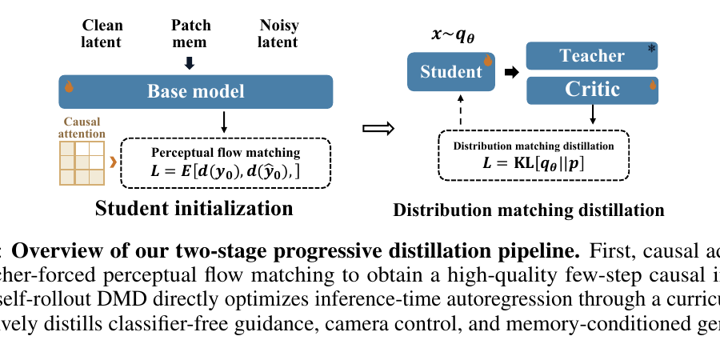
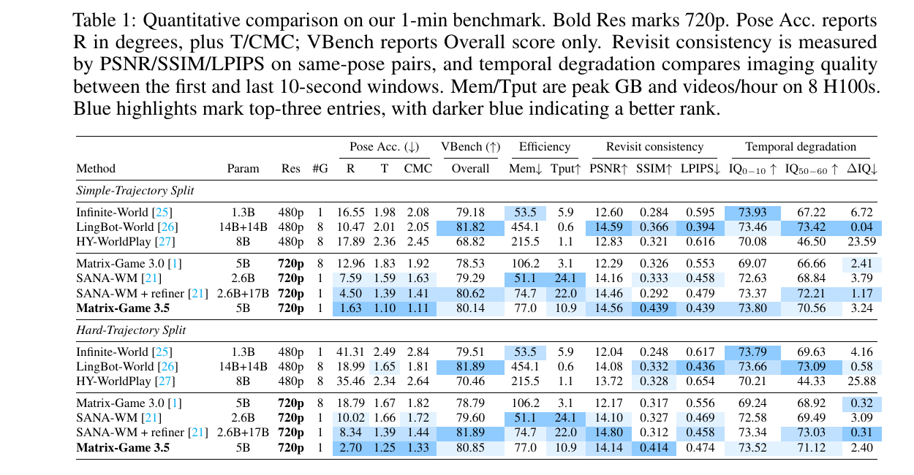

# Matrix-Game 3.5: Enhancing Real-Time Streaming Interactive World Models with Patch Memory

- **来源**: [项目主页 PDF](https://matrix-game-v3-5.github.io/paper/Matrix-Game-3.5.pdf)（24 页，技术报告）
- **机构**: **Riemann Dynamics**（`research@riemanndynamics.ai`，无个人署名）
- ⚠️ **没有 arXiv 编号、没有会议/投稿声明、没有作者名单** —— 只有一个机构邮箱
- **前作**: Matrix-Game 3.0（[arXiv:2604.08995](https://arxiv.org/abs/2604.08995)）

---

## 1. 一句话定位

**把"历史帧"这个记忆单元拆到 patch 级：用深度+位姿把历史 latent patch 反投影到 3D，再从目标相机视角做 z-buffer 查询，只把"当前视角真正看得见"的那些 patch 拼成一张对齐的记忆画布喂回去 —— 而相机几何本身则被折进 attention 的 softmax 里，零新增参数。**

两个机制：

| | 做什么 | 关键性质 |
|---|---|---|
| **Patch Memory** | 历史 latent patch → 反投影到世界坐标 → 投影到目标相机 → z-buffer 去遮挡 → 散射进对齐的记忆画布 | **粒度介于"显式 3D 重建"与"整帧隐式记忆"之间**；**空洞直接从 token 序列里丢掉**（不占位），所以记忆通路不会让序列长度翻倍 |
| **Warped PRoPE** | 在原生时空 RoPE 之上，把世界→图像投影矩阵 `P` 平铺到**所有** head 通道；q 乘 `P_i^T`、k/v 乘 `P_j^{-1}` | **单次 softmax 同时携带 Δt = i−j 与相对位姿 `M = P_i P_j^{-1}`**，**零新增参数**、不改架构 |

⚠️ **归属要先说清楚，否则容易被标题误导**：**标题挂着 "with Patch Memory"，但 Patch Memory 这个机制论文自己归给了 [MosaicMem](https://arxiv.org/abs/2603.17117)**。§1 的原话是 *"a unified parameter-free geometry-aware memory framework that **integrates Patch Memory [5]** and Warped PRoPE, **our video adaptation of** PRoPE [6]"*，§2.2.1 也写 *"**we follow MosaicMem [5]** and store localized image patches as the fundamental unit of memory"*。

📌 **所以它自认的贡献是「整合」与「PRoPE 的视频改造」，不是 patch 级记忆本身。** 这一点论文写得诚实，是标题的措辞造成了误导。**本文真正的增量**是：把 patch memory 搬到**因果自回归**设定、加**动静分离的运动过滤**、以及**用 Warped PRoPE 的坐标体系去给记忆 token 编址**。

📌 **对本仓库而言，这篇最有价值的不是 Patch Memory，而是它的蒸馏那一节** —— 它在我那篇[五篇横向对照](../../video_generation/dmd_few_step_ar/analysis.md)争得最凶的那一格上，投了关键的第三票（见 [§4](#4-两阶段蒸馏--本篇对本仓库最重要的一节)）。

⚠️ **但先说清楚全文最大的方法学缺口**：**24 页、只有 1 张表、"ablat" 这个词根出现 0 次** —— **包括标题级贡献 Patch Memory 在内，没有任何一个命名组件被单独验证过。**

---

## 2. Warped PRoPE：把相机几何折进 softmax

**出发点是 PRoPE**（Li et al., *Cameras as Relative Positional Encoding*, NeurIPS 2026）：每个 latent frame 关联一个完整的世界→图像投影矩阵

$$
P = \mathrm{lift}(K)\cdot W
$$

（`K` 内参、`W` 世界→相机外参），于是两帧之间的注意力分数天然携带相对投影 `M = P_i P_j^{-1}`，**同时编码相对旋转、平移和内参**。

🔴 **但原生 PRoPE 不能直接搬过来，论文把理由说得很清楚**：

> *"Native PRoPE, designed for multi-view images, splits the attention head dimension into disjoint blocks — half for the camera projection and the other two for the 2D row and column position — so camera and position never multiply and **there is no time axis**."*

**视频生成的骨干依赖 3D 时空 RoPE 的帧轴来编码时序，这个通道必须保住。** 所以本文的改法是：

> *"Our layout therefore departs from the native design and **tiles the camera projection across all head channels, on top of the full spatiotemporal RoPE including its frame axis**, without carving out a separate subspace."*

具体地，在标准时空 RoPE 旋转**之后**，再把相机矩阵乘上去 —— **query 乘 `P^T`，key 和 value 乘 `P^{-1}`**，输出再乘 `tile(P_i)`。于是 *"a single softmax carries both the relative time `Δt = i − j` and the relative pose `M`, **adding no learnable parameters**"*。

📌 **这与仓库里 [SolarWM](../solarwm/analysis.md) 的 fused-PRoPE 是同一个机制** —— 那边的描述是"骨干先施加原生 video RoPE，相机位姿和内参随后决定投影旋转、作用在 Q/K/V 上，接着单次 self-attention，之后在原生输出投影之前施加匹配的输出变换"，**且两篇都明确沿用 [MosaicMem](https://arxiv.org/abs/2603.17117)**。**两个独立团队收敛到同一套相机注入方案，这条基本可以当定论。**

⚠️ **区别在于本篇多做了一步**：它明确指出原生 PRoPE **切分 head 维度**的做法会挤掉时间轴，改成**平铺到所有通道**。SolarWM 没有讨论这个取舍。

📌 **一个数值稳定性细节**（值得抄）：*"Matrix-Game 3.5 **recenters all camera poses with respect to the first target frame of the current generation window**"*，并对 metric 尺度的平移分量做**保方向的对数压缩**（模长取 log **再除以 4**，方向不变）。**这正面回应了 [ABot-World-0](../abot_world_0/analysis.md) 拒绝相机位姿的那条理由（长 rollout 累积位姿会漂出训练分布）—— 每个窗口重新对齐 + 相对投影 `M = P_i P_j^{-1}`，两层都不累积全局漂移。**

⚠️ **"parameter-free" 这个词的适用范围要划清**：PRoPE overlay 那一路确实零新增参数（*"with no learnable parameters"*），**但 Reference Token 分支明确加了可学参数**（*"Each reference patch token receives **additive reference-index, type, and local spatial embeddings**"*），而且整个 DiT 是全参微调。**"parameter-free" 只覆盖相机/记忆的编址方式，不覆盖整个框架。**

---

## 3. 统一记忆系统：三个互补机制

### 3.1 Patch Memory —— 粒度是关键

论文先把现有路线分成两类，然后指出中间那一档被忽视了：

| 路线 | 代表 | 优点 | 缺点 |
|---|---|---|---|
| **显式记忆** | 点云 / splat / 几何基元 | 几何约束强 | 主要面向**静态**场景重建 |
| **隐式记忆** | 整帧或 latent 特征 | 生成灵活 | **靠网络自己学跨视角对应关系** |
| 📌 **Patch 级（本文）** | 局部 image patch | **两者的优点组合** | —— |

**流水线三步**：

1. **Lift to 3D** —— 每个历史 latent patch 按 VAE 下采样比还原到图像空间中心，用该帧的 metric depth + 内参反投影到相机坐标系，再经位姿变换到世界坐标；
2. **Frustum query + z-buffer** —— 目标相机视锥去查询这片 patch 云，**在目标视角下做 z-buffer，每个目标 latent 位置只保留离相机最近的那个面**，丢掉被遮挡的候选；
3. **Scatter 成记忆画布** —— 选中的 patch 散射进目标视角下的对齐画布，同时记录**反向映射**（来自哪一帧、原始 patch 位置）。

🔴 **两个设计细节值得单独记**：

**① 空洞直接从 token 序列里丢掉，不占位。** 原文：*"these holes are **dropped from the token sequence rather than kept as empty placeholder tokens**, so the memory track **avoids doubling the sequence length**"* —— 被遮挡/从未观测到的区域交给扩散模型按当前噪声 latent、文本 prompt 和周边上下文去合成。**这是"记忆只在有可靠几何证据的地方复用"。**

**② patch 的位置编码按"它该出现在哪"而非"它存在哪"来给。** 原文：

> *"each retrieved patch declares its position **by geometry rather than by storage order**: it takes the **RoPE timestamp of the target frame it supports** rather than its original historical time, and … the **floating-point spatial coordinate** at which its source content lands in the target view; these **fractional coordinates index a higher-resolution RoPE frequency table for sub-grid precision**."*

**一句话：A patch is addressed by where it should appear in the frame being generated rather than by where it was stored.**

📌 **历史帧的挑选也不是取最近的**：*"Simply choosing the nearest camera poses often results in highly redundant viewpoints with poor overall coverage"* —— 改用**覆盖度感知的贪心选择**，逐步挑对目标 latent 网格贡献增量覆盖最大的那些帧。

### 3.2 Context Frame Memory

Patch memory 给的是**扭曲过的、对齐到目标视角**的局部内容，而且**被排除在 cross-attention 之外**。所以另外再挂一小组 **context frame** 放在 anchor 之前，提供**未扭曲的忠实观测**。

- **anchor** = 紧邻生成窗口的那个干净帧；**context frame** = 同一 clip 更早的历史，同样按**位姿覆盖度**挑而不是取最近的；
- 📌 **context frame 保留自己的真实历史 RoPE 时间戳** —— *"so the relative temporal gaps between the older context, the anchor, and the generating window are **preserved rather than collapsed to consecutive indices**"*，并保留原生空间网格与真实相机位姿。

### 3.3 Static-Dynamic 解耦

**静态场景结构存进 patch memory，可移动主体走轻量的多视角 Reference Token**（前缀 token，不额外加 cross-attention 模块）。论文对这个选择给了理由：

> *"The prefix-token design avoids an additional cross-attention module. A cross-attention formulation would introduce a separate alignment problem between reference space and video space, while also adding a parameterized conditioning path that **can be bypassed through shortcut solutions**."*

📌 **而 patch memory 里会把动态物体区域滤掉**（"Dynamic-object regions are filtered from the patch memory"）—— 所以两条通路分工是清楚的：**几何对齐的静态结构走 patch memory，会动的主体走 reference token。**

---

## 4. 两阶段蒸馏 —— 本篇对本仓库最重要的一节



> **Fig 6 逐块解读**：
> **左（Student initialization）** —— `Clean latent` / `Patch mem` / `Noisy latent` 三路输入 `Base model`（带火焰=可训），左侧标着 `Causal attention` 的因果掩码网格，输出接 **`Perceptual flow matching`**，损失写作 `L = E[d(y₀), d(ŷ₀)]`。
> **右（Distribution matching distillation）** —— `x ~ q_θ` 从 `Student`（火焰）采样，上接 **`Teacher`（❄ 雪花=冻结）**、下接 `Critic`（火焰=可训），汇入 `L = KL[q_θ‖p]`。

### 4.1 Stage 1：Causal Adaptation（teacher-forced 感知流匹配）

把生成重述成 chunk-wise 因果去噪，teacher-forced 条件是

$$
\mathcal{H}_i^{\mathrm{gt}} = \big(x^{\mathrm{gt}}_{<i},\; p_{\le i},\; m^{\mathrm{gt}}_i,\; r^{\mathrm{gt}}_i,\; c\big)
$$

（`p` 因果相机控制、`m` query 对齐的 patch memory、`r` chunk 局部 context frame、`c` 文本）。**注意力与记忆检索都不能访问未来 chunk。**

关键在于损失**不在 VAE latent 空间回归 velocity，而是在冻结的感知特征空间**：

$$
\mathcal{L}_{\mathrm{PFM}} = \mathbb{E}\left[\frac{1}{|S|}\sum_{\ell \in S} d\Big(\Phi_\ell\big(\mathcal{D}(\hat{x}^{\le i}_{0,\theta})\big),\; \Phi_\ell\big(\mathcal{D}(x^{\mathrm{gt}}_{\le i})\big)\Big)\right]
$$

`D` 是冻结 VAE 解码器，`Φ_ℓ` 是冻结感知模型（实现里用 **InternVideo2-1B**）的第 ℓ 个特征块。

🔴 **然后是这一句 —— 本篇对本仓库最重要的一句话**：

> *"**This single objective simultaneously learns causal denoising and few-step generation**, yielding an efficient, high-quality causal initializer."*

### 4.2 Stage 2：Self-Rollout DMD

去掉 teacher forcing，在学生自己的自回归轨迹上做 DMD：

$$
\mathcal{L}_{\mathrm{DMD}} = \mathbb{E}_{i,t}\Big[w(t)\,\mathrm{KL}\big(q_{\theta,t}(\cdot \mid \widehat{\mathcal{H}}^\theta_i)\;\big\|\;p_{\phi,t}(\cdot \mid \widehat{\mathcal{H}}^\theta_i)\big)\Big]
$$

此时 patch memory 与 context frame **都从因果可见的生成历史里在线检索**。

🔴 **而这里论文识别出了一个很实在的问题 —— 但它的公式和散文自相矛盾，需要拆开看。**

**公式说的**：Eq (8) 里 `m̂_i^θ`、`r̂_i^θ` 都带 `θ` 上标，是**学生自己在线检索**的；Eq (9) 把 `q_θ` 与 `p_φ` 都条件在**同一个** `Ĥ_i^θ` 上，正文原话是 *"matches the student distribution … to the bidirectional teacher distribution **under this shared condition**"*。**按公式，teacher 看到的就是学生那份在线记忆。**

**散文说的**（紧接着的下一段）：

> *"the student and scorers maintain **different memory states**. The student updates online memory from generated chunks, while **feeding the same potentially drifted history to the bidirectional scorers would compromise the supervision**. We therefore **share only stable external conditions — the initial memory, anchor frame, text prompt, and camera trajectory** — while allowing the student to update its memory and **keeping scorer memory fixed**."*

🔴 **两者不可能同时成立**：Eq (9) 说两边共享 `Ĥ_i^θ`（含学生在线记忆），散文说共享的只有初始记忆 / anchor / 文本 / 相机轨迹这四样、scorer 的记忆是冻住的。**Eq (9) 是理想化的目标，散文描述的是真正实现的东西 —— 而论文从头到尾没有把实际优化的那个目标写成公式。**

### 那么 teacher 的 cache 到底怎么来？

按散文的读法：**就是 "the initial memory"，rollout 起点的那一份，全程不更新。**

⚠️ **但这份"初始记忆"本身从哪来，论文没有说。** 只能从三处间接证据反推：① 训练样本是「1 个干净 anchor latent + 最多 5 个按轨迹覆盖度挑的历史 context latent」，都来自 GT clip、带标注好的 metric depth 与 pose；② DMD 里 *"the first anchor remains clean"*；③ 附录 C 讲 occupancy map 时明写 *"**Section 0 initializes the occupancy map from the anchor**"*。**最可能是从那个干净 anchor（+ GT context）建出来的一份真实数据记忆 —— 但这是反推，不是论文陈述。**

### 🔴 这带来一个论文没讨论的技术后果

DMD 的梯度本质是两个 score 之差 `∇L ∝ s_fake − s_real`。**要让这个差成为 `∇KL` 的有效估计，两个 scorer 必须在与学生采样时相同的条件下求值。**

而按散文：**学生在 `Ĥ_i^θ`（新记忆）下采样，scorer 在旧记忆下打分** → 这个差估计的是"旧记忆条件下的 KL"，却被用在"新记忆条件下采出的样本"上。**梯度不再是学生真实条件分布与 teacher 之间 KL 的无偏估计。**

⚠️ **而且 "scorers" 是复数**（§4.1 分别提了 `real scorer`，guidance scale 3；和 `fake scorer`，lr 4e−7）。**fake scorer / critic 的职责恰恰是追踪学生的分布** —— 它看到的条件与学生不同，追踪的就不是学生的实际分布。

论文对此只有一句辩护：*"This provides reliable scores **without forcing incompatible internal trajectories to match**."* —— **等于承认有偏，但认为比"强行让两条不兼容的内部轨迹对齐"的问题小。没有任何实验支持这个取舍。**

📌 **不过 condition curriculum 部分绕开了它**：DMD 开始时**两个记忆条件都是关掉的**（*"We begin DMD with both memory conditions disabled"*），之后才逐步提高启用概率。**所以训练早期学生与 scorer 平凡地共享条件，矛盾只在后期显现** —— 这可能正是这个偏差可以被忍受的原因。

**另配一个 condition curriculum**：先蒸 CFG 与相机控制、**不开在线记忆**，再逐步把 patch memory 和 context frame 加进来。并沿用 **HiAR** 的做法 —— 每个去噪子步里把自回归前缀与 chunk 局部 context **保持在下一个噪声水平**、只留 anchor 干净，*"This represents imperfect generated history with appropriate uncertainty, reducing long-horizon drift"*。

**产出：一个三步（3 denoising steps）的因果生成器。**

### 4.3 📌 交叉对照一：它在「少步初始化要不要独立阶段」上投了第三票

[五篇横向对照](../../video_generation/dmd_few_step_ar/analysis.md) 里最尖锐的分歧，是流水线的「② 少步化」那一格要不要单独存在：

| | 立场 | 手段 | 有没有数据 |
|---|---|---|---|
| **[ForgeWM](../../video_generation/forgewm/analysis.md)** | ② 是**决定性**的阶段 | 在线因果一致性蒸馏 | ✅ **Table A2，带 bootstrap CI**（Stage 1→2 的 LPIPS 0.806→0.605，全流程唯一 CI 不重叠的大跳） |
| **[SolarWM](../solarwm/analysis.md)** | ② 可以**整个删掉** | TF-AnyFlow（teacher forcing + AnyFlow loss 合并 ①②） | ❌ 零消融 |
| **Matrix-Game 3.5（本篇）** | ② 可以**整个删掉** | **teacher-forced 感知流匹配（PFM）合并 ①②** | ❌ **零消融** |

📌 **所以按篇数是 2:1，但按证据仍然是 1:0** —— **ForgeWM 是唯一一篇为这个问题做过带置信区间的对照的。**

⚠️ **不过本篇给了一个新信息：合并的手段不止一种。** SolarWM 用 AnyFlow（监督任意两个噪声水平之间的 flow map），本篇用 PFM（在冻结感知特征空间里约束流匹配）—— **两条完全不同的技术路线，都声称能在 teacher-forcing 阶段顺便把少步能力训出来。**

📌 **这正好支持我在那篇对照里给的读法**：**ForgeWM 证明的是"少步化这个*效果*是决定性的"，不是"它必须是一个*单独的阶段*"。** 本篇是这个读法的第三个数据点 —— 它把少步能力**显式写进了 Stage 1 的目标**（PFM 直接在少步设定下约束干净预测），而不是指望 Stage 2 的 DMD 顺手解决。

### 4.4 📌 交叉对照二：它和 OPSD-V 独立发现了同一个问题

**两篇都发现：在 AR 视频上做 DMD 时，学生自己的记忆/cache 会漂移，而把这份漂移过的历史同样喂给 teacher/scorer 会毁掉监督信号。**

| | 发现的问题 | 给的解法 |
|---|---|---|
| **[OPSD-V](../../video_generation/opsd_v/analysis.md)** | *"degradation in the **generated KV cache** is a key bottleneck"* | **把 teacher 的旧 cache 换成真实视频 chunk**（但保留最近一个学生 chunk，防止退化成 fully teacher-forced oracle） |
| **Matrix-Game 3.5** | *"feeding the same potentially drifted history to the bidirectional scorers would compromise the supervision"* | **让学生在线更新自己的记忆，而把 scorer 的记忆固定在稳定的外部条件上** |

📌 **同一个诊断，两种解法，而且互不引用。** 共同的原则是**把学生与 teacher/scorer 的记忆状态解耦** —— 这与 OPSD-V 总结的那条原则是一致的：**学生决定在哪里施加监督，teacher 决定往哪个方向走。**

**两者的代价不同**，而且差别比"都是解耦"更具体：

| | teacher/scorer 的 cache 内容 | 随 rollout 前进吗 | 代价 |
|---|---|---|---|
| **OPSD-V** | **真实视频 chunk** 逐个填充，**只保留最近一个学生 chunk** | ✅ **随 `i` 前进**，始终与学生对齐在同一时刻 | **必须有成对的真实长视频**（自建 3,800 条 × 1 分钟）；且 teacher 活在"历史从未退化"的世界里，所以必须留一个学生 chunk 防止方向不可达 |
| **Matrix-Game 3.5** | **初始记忆**（按散文口径），冻住 | ❌ **完全不前进** | 不需要额外真实视频，**但 scorer 的上下文随 rollout 推进越来越旧**；且带来上面那个条件失配的梯度偏差 |

⚠️ **"冻在初始状态"这一条只在散文口径下成立，与 Eq (9) 冲突**（见上），所以严格说 **Matrix-Game 3.5 这一行是有歧义的**。**哪种更好没人比过，两篇也互不引用。**

---

## 5. 实验设置

| 项 | 值 |
|---|---|
| **Backbone** | **Wan2.2-TI2V-5B** |
| 分辨率 / latent | **1280 × 704**，每样本 **21 个目标 latent frame** |
| 记忆配置 | 1 个干净 anchor + **最多 5 个按轨迹覆盖度挑的历史 context latent**；每 4 帧 query 组取最多 5 个历史候选做 depth-aware z-buffer 融合 |
| 训练技巧 | **dense patch memory 只在 80% 的迭代里开**（另 20% 关掉，但 PRoPE 相机条件两种情况都保留）；动态物体区域从 patch memory 里滤掉；文本条件 0.1 概率丢弃；anchor 有 0.8 概率由 13 帧块联合编码 |
| Base 训练 | AdamW，**常数 lr 5e−5**，weight decay 0.01，grad clip 0.5，BF16，DeepSpeed ZeRO-2，**global batch 8**；全参微调 DiT，**text encoder 与 VAE 冻结** |
| **Stage 1（PFM）** | 1280×704；因果窗 22 个 latent 位置 = 1 anchor + **7 个 chunk × 3 latent**；**10,000 步**，lr **5e−6**，global batch **32**，**32 张 GPU**（⚠️ **型号没给**）；感知模型 **InternVideo2-1B**，对其**全部 block** 的特征距离取平均 |
| **Stage 2（DMD）** | 学生每 chunk 生成 3 个 latent frame、**3 个去噪步**；real scorer 用 **guidance scale 3**，**推理时 CFG = 1**（每步只一次条件前向）；student lr **2e−6**、fake scorer lr **4e−7**，global batch **64** |
| **实时推理** | INT8 量化 DiT + PyTorch 编译 + **75% 剪枝的 MG-LightVAE** + GPU 上的记忆检索优化 → **单张 H200 上最高 20 FPS** |

📌 **一个诚实的工程观察**：*"With DiT inference significantly accelerated, **VAE decoding becomes the primary latency bottleneck** in high-resolution streaming generation."* —— 这与 [ABot-World-0](../abot_world_0/analysis.md) 的 Table 2 结论一致（那边是 LightVAE 带来第一个可行配置）。**两篇独立指出：少步蒸馏之后，瓶颈转移到 VAE 解码。**

**数据基建**（§3，占了整整一节）：
- **几何标注**：基于 **VGGT-Omega**，长视频按重叠时间块处理、相邻块用 **Sim(3)** 对齐拼成连续轨迹；因为 VGGT-Omega 只到未知尺度，再用 **Depth Anything 3 的 metric 分支**做尺度锚，全局优化联合标定所有块 → 产出 camera-to-world 位姿、内参、metric depth。
- 语义标注、身份标注、场景质量筛选各一节。
- ⚠️ **但全文没有给出任何数据规模数字** —— 多少小时、多少 clip、几个来源的配比，**一个都没有**。只说语料"spanning Unreal simulation environments, open-world games, and Internet videos"。

---

## 6. 结果



**评测协议**：沿用 **SANA-WM** 提出的 one-minute world-model benchmark 的 Simple / Hard 两个轨迹划分。位姿精度先做相似变换对齐再测 R（度）/ T / CMC（越低越好）；VBench Overall（越高越好）；效率是 **8 张 H100 上**的峰值显存与 videos/hour；revisit consistency 比较近乎同一相机位姿下的生成帧对；temporal degradation 用 `ΔIQ = IQ₀₋₁₀ − IQ₅₀₋₆₀`。

**Simple 划分（节选）**：

| 方法 | 参数 | 分辨率 | R↓ | T↓ | CMC↓ | VBench↑ | Mem↓ | Tput↑ | SSIM↑ | ΔIQ↓ |
|---|---|---|---|---|---|---|---|---|---|---|
| Infinite-World | 1.3B | 480p | 16.55 | 1.98 | 2.08 | 79.18 | **53.5** | 5.9 | 0.284 | 6.72 |
| **LingBot-World** | 14B+14B | 480p | 10.47 | 2.01 | 2.05 | **81.82** | 454.1 | 0.6 | 0.366 | **0.04** |
| HY-WorldPlay | 8B | 480p | 17.89 | 2.36 | 2.45 | 68.82 | 215.5 | 1.1 | 0.321 | 23.59 |
| Matrix-Game 3.0（前作） | 5B | 720p | 12.96 | 1.83 | 1.92 | 78.53 | 106.2 | 3.1 | 0.326 | 2.41 |
| **SANA-WM** | 2.6B | 720p | 7.59 | 1.59 | 1.63 | 79.29 | 51.1 | **24.1** | 0.333 | 3.79 |
| SANA-WM + refiner | 2.6B+17B | 720p | 4.50 | 1.39 | 1.41 | 80.62 | 74.7 | 22.0 | 0.292 | 1.17 |
| **Matrix-Game 3.5** | 5B | 720p | **1.63** | **1.10** | **1.11** | 80.14 | 77.0 | 10.9 | **0.439** | 3.24 |

**Hard 划分**：MG3.5 的 R/T/CMC 是 **2.70 / 1.25 / 1.33**，次优是 SANA-WM+refiner 的 8.34 / 1.39 / 1.44。

📌 **确实赢得很干净的是位姿精度**：Simple 上把旋转误差从次优的 4.50 压到 **1.63（2.8×）**，Hard 上从 8.34 压到 **2.70（3.1×）**，而且 T 和 CMC 也都是最优。**这一条我核过，两个划分、三个指标全部成立。**

📌 **Revisit SSIM 也确实是两个划分都第一**（0.439 / 0.414）—— 这是 patch memory 最直接的读数。

⚠️ **但要看清它没赢的地方**：

| 指标 | MG3.5 | 输给谁 |
|---|---|---|
| **VBench Overall** | 80.14 / 80.85 | 🔴 **两个划分都只排第三** —— LingBot-World 81.82 / 81.89、SANA-WM+refiner 80.62 / 81.89 |
| **吞吐 Tput** | 10.9 | 🔴 **SANA-WM 24.1（2.2×）、SANA-WM+refiner 22.0**，而且 SANA-WM 的显存还更低（51.1 vs 77.0） |
| **Revisit PSNR** | 14.56 / 14.14 | LingBot 14.59（Simple）、SANA-WM+refiner 14.80（Hard） |
| **Revisit LPIPS** | 0.439 / 0.474 | LingBot 0.394 / 0.436 —— 两个划分都输 |
| **ΔIQ（时序退化）** | 3.24 / 2.40 | 🔴 LingBot 0.04 / 0.58；**而且输给自家前作 Matrix-Game 3.0 的 2.41 / 0.32** |

📌 **论文对 PSNR/LPIPS 这两处输的地方是诚实的**，而且给了一个合理的解释：*"revisiting the same camera pose **does not imply an identical image** because characters, vegetation, weather, and other background content may continue to evolve. Pixel-aligned metrics therefore **penalize valid scene dynamics** in addition to memory errors."* —— **这个论证站得住**，也正好解释了为什么它 SSIM（结构）赢而 PSNR/LPIPS（像素/感知）不赢。

⚠️ **但 ΔIQ 那一列它只说了自己"moderate drops"、没和任何 baseline 比** —— **而它在这一列输给了自己的前作 Matrix-Game 3.0**（3.24 vs 2.41、2.40 vs 0.32）。公允地说 MG3.5 的绝对 IQ 起点更高（73.80 vs 69.07），是"起得高、掉得多"；但就 ΔIQ 这个指标本身，它是退步的。

⚠️ **VBench 那一列论文的措辞是** *"competitive with the strongest baselines while generating at 720p"* —— **没有宣称最好，这是准确的**。

---

## 7. 争议与权衡

### 7.1 🔴 零消融 —— 全文最大的方法学缺口

**24 页、1 张表、"ablat" 这个词根出现 0 次。** 被命名为贡献的东西，没有一个被单独验证过：

| 未被验证的贡献 | 为什么该验 |
|---|---|
| **Patch Memory** | **这是标题级贡献**。没有"关掉 patch memory"的对照，revisit SSIM 的领先无法归因到它头上 —— 训练里明明有个现成的开关（"dense patch memory 只在 80% 的迭代里开"），做这个消融几乎是免费的 |
| **Warped PRoPE 的平铺设计** | 论文专门论证了原生 PRoPE 切分 head 维度会挤掉时间轴，**但没有做"切分 vs 平铺"的对照** |
| **Context Frame Memory** | 与 patch memory 互补，但两者各自贡献多少未知 |
| **Static-Dynamic 解耦 / Reference Token** | 只有 Figure 11 的定性对比（去掉 reference token 后主体身份漂移），**无量化** |
| **覆盖度感知的历史帧选择** | 论文明说"取最近的会冗余"，**但没测过** |
| **两阶段蒸馏的每一阶段** | 见 [§4.3](#43--交叉对照一它在少步初始化要不要独立阶段上投了第三票) —— 恰恰是最该有数据的地方 |
| **PFM（感知特征空间）vs 普通 latent 空间流匹配** | 这是 Stage 1 的核心选择，无对照 |
| **condition curriculum** | 先关记忆再逐步开，无对照 |
| **scorer 记忆固定 vs 同步更新** | [§4.4](#44--交叉对照二它和-opsd-v-独立发现了同一个问题) 那个诊断很好，**但"固定 scorer 记忆"这个解法本身没测过** |

**全文唯一的结构化对照是 Table 1 的跨方法比较，而它把架构、数据、蒸馏、推理优化全混在一起。**

### 7.2 🔴 "real-time 20 FPS" 与 Table 1 的吞吐对不上

**Table 1 里 MG3.5 的 Tput = 10.9 videos/hour**，而 benchmark 是 **1 分钟**视频。**两种读法都不是实时**：

| 读法 | 换算 | 相对实时 |
|---|---|---|
| 10.9 是**单实例**吞吐 | 3600/10.9 ≈ **330 s** 生成 60 s 视频 | **慢 5.5×** |
| 10.9 是 8 卡节点的**总**吞吐（`#G=1`，即 8 个实例并行） | 每实例 1.36 videos/h ≈ **2647 s** | **慢 44×** |

⚠️ **论文没说明 Tput 的口径**（caption 只写 "videos/hour on 8 H100s"，另有一列 `#G` 标注模型自身用几张卡）。**但无论哪种读法，Table 1 的数字都不支持"实时"。**

**而 "20 FPS" 只在 §4.4 的一句话里出现**，换了硬件（**单张 H200**）、换了推理栈（**INT8 量化 + PyTorch 编译 + 75% 剪枝的 MG-LightVAE + GPU 化的记忆检索**），措辞是 **"up to 20 FPS"**，**没有任何表格或图支撑，没给分辨率，没给延迟拆解，那套配置的画质也从未被评测。**

📌 **这与 [ABot-World-0](../abot_world_0/analysis.md) 是同一个模式** —— 那边头条的 16 FPS 同样来自画质从未评测的 MXFP4 配置，而论文明说 FP8 才是"质量导向的默认工作点"。

⚠️ **还有一项延迟从未被计入**：patch memory 在推理时需要对**生成帧**估 metric depth 与 pose（附录 C 明写 *"the system estimates metric depth and camera pose for … the generated frames"*），**这个外部估计器的开销不出现在任何延迟核算里**。

⚠️ **另一个信号**：Table 1 里 MG3.5 的 peak memory 是 **77.0 GB**，而 H100 只有 80 GB（**用到 96%**），且这一列它**排第 4**（SANA-WM 51.1 / Infinite-World 53.5 / SANA-WM+refiner 74.7 都更省）。**这强烈暗示显存随 rollout 增长**，也很可能是 §4.4 要换到 H200（141 GB）的原因 —— **论文对此只字未提，也从未讨论 patch 存储池随 rollout 增长的界。**

### 7.3 🔴 两个未披露项，都直接关系到它赢得最漂亮的那一列

**① 位姿指标用什么 estimator 评的，全文没说。** 训练用的相机/深度标注**全部来自 VGGT-Omega + Depth Anything 3** 这条外部流水线；而 R/T/CMC 需要**从生成视频里反estimate相机轨迹**。⚠️ **如果评测端用的也是 VGGT-Omega，那就是"用 A 标注训练、再用 A 打分"** —— 而位姿精度恰恰是它唯一赢得干净的那组指标（4.50→1.63、8.34→2.70）。**论文没有给出评测用的 estimator，这条无法排除。**

**② 附录 C 的相机防碰撞机制参与了评测，而且会主动改写轨迹。** 原文：*"we introduce a camera collision-avoidance mechanism based on a progressive 3D occupancy map **in our patch-memory long-video evaluation**"*，它 *"adjusts only the camera position"*。⚠️ **而 R/T/CMC 正是比对"生成轨迹"与"目标轨迹"的误差** —— **修正后的轨迹是作为新的 target 来比对，还是仍用原始 target？论文没说。** 如果是前者，位姿指标就存在结构性优势；而 **baseline 有没有等价机制，论文也没说。**

### 7.4 其它
- ⚠️ **Table 1 的 caption 写 "our 1-min benchmark"，但评测协议说的是 "Following the one-minute world-model benchmark introduced by SANA-WM"** —— benchmark 是别人的（这点是加分项，不是自建榜），caption 的措辞不准确。
- 🔴 **DMD 的目标函数：公式与散文互相矛盾，而实际优化的目标从未被写出来**。Eq (9) 把 `q_θ` 与 `p_φ` 都条件在同一个 `Ĥ_i^θ`（含学生在线记忆）上、正文还强调 *"under this **shared** condition"*；下一段却说共享的只有「初始记忆 / anchor / 文本 / 相机轨迹」四样、**scorer 的记忆是冻住的**。详见 [§4.2](#42-stage-2self-rollout-dmd)。**这不是措辞问题 —— 两种读法对应的梯度不是同一个东西**（后者存在条件失配，`s_fake − s_real` 不再是学生真实条件分布下 `∇KL` 的无偏估计）。
- 🔴 **几处图与 caption 直接冲突**（均为渲染放大后核对）：
  - **Figure 10 的列头图上写的是 `0s / 15s / 30s / 45s / 60s`，而 caption 写 "Columns show frames at 0, 4, 8, 12, and 16 seconds"**；
  - **同一张图第 2 行画的是一只金毛犬，而 caption 和正文都写 "a cat"**；
  - **Figure 8 第 3 行的红框画在 45 s 那一列，而 caption 声称 "Red boxes in the 60-second frames"**。
- 🔴 **Figure 11（全文唯一一个"消融味"的图）没做到它自称的控制变量**：正文说 *"keep the initial state, camera trajectory, text prompt, and random seed fixed, and remove only the reference tokens"*、*"leaving the background evolution and camera motion unchanged"*，**但两列的背景与视角明显不同**（第 1 行 With 有一架直升机、Without 没有；第 3 行前方车辆与路侧完全不同）。**所以这张图无法支撑 reference token 的因果作用。** 图上还留着 debug 水印（`correct_pool_no_ref`、`478 gnd_truth`）。
- ⚠️ **Figure 8/9/12 每一帧都画着 WASD + 方向键的 HUD 浮层，而论文正文对键盘动作接口零字说明** —— 全文的动作空间只有相机位姿轨迹 + 文本。§6 还把 "richer embodied action spaces" 列为 future work。**这个 HUD 是怎么回事，论文没解释。**
- ⚠️ **术语漂移**：正文叫 Patch Memory，Figure 5 里叫 "Mosaic tokens"，§5.2 叫 "Mosaic Memory"。而且 **"Warped PRoPE" 这个命名在 §2.1 方法章节一次都没出现**（只在摘要/§1/§3/§6），即命名贡献从未在方法节被正式定义。
- ⚠️ **公式参数化不一致**：主体区域辅助损失 Eq (3) 用的是 `ε_θ`（noise prediction），而 §2.3 的 Eq (5)(6) 用的是 flow/velocity `v_θ`，backbone 也是 flow matching；Eq (3) 里分母小量 `ε` 与噪声 `ε` 还撞了符号，`L_full` 从未定义、`λ_sub` 取值没给。
- ⚠️ **没有作者名单、没有 arXiv 号、没有代码/权重链接**（只有项目主页）。**没有致谢、没有贡献者列表。** 参考文献 55 条，页脚只写 `Technical Report.`。
- ⚠️ **Matrix-Game 2.0 全文只被提了一次**（[38]，*"OASIS and Matrix-Game 2.0 advanced open-source, real-time autoregressive interaction"*）—— **不是 baseline、不在表里**。而它正是 [ForgeWM](../../video_generation/forgewm/analysis.md) 的主对照。
- ⚠️ **零种子、零误差棒、零重复实验**。Table 1 全是单点估计，而 revisit PSNR 上 MG3.5 与 LingBot 差 0.03、与其它方法的多处差距也在 0.1 量级。
- ⚠️ **数据规模一个数字都没有**（小时数 / clip 数 / 三类来源配比全无），而数据基建占了整整一节。
- ⚠️ **硬件只给了 "32 GPUs"，型号、训练时长、GPU-hours 全无。**
- ⚠️ **最长量化 rollout 是 1 分钟**（benchmark 本身就是 one-minute），而标题和摘要反复用 "long-horizon"。**这一点比仓库里 [ABot](../abot_world_0/analysis.md)（量化 60 秒 / 宣称 24 小时）和 [SolarWM](../solarwm/analysis.md)（每 10 分钟一帧 / 宣称 1 小时）都克制** —— 📌 **它的宣称与它的量化是对齐的，这是个加分项。**
- 📌 **Conclusion 之后有一段 "several directions remain open"**，写得具体：① 给动态实体自己的持久状态，让离开视野的主体继续演化；② **让生成器自己 geometry-aware（联合预测自己生成内容的深度与位姿），而不是依赖外部估计器** —— 后者直指 patch memory 当前的软肋（几何来自 VGGT-Omega + Depth Anything 3 这条外部流水线）。

### 7.5 正面

- 📌 **Patch 级这个粒度的论证是干净的**，而且"空洞直接丢出 token 序列、不占位"这个工程细节直接解决了记忆通路让序列翻倍的问题。
- 📌 **"patch 按它该出现在哪、而不是它存在哪来编址"** —— 这个位置编码设计（借目标帧的 RoPE 时间戳 + 亚网格精度的分数空间坐标）是全文最见巧思的地方。
- 📌 **Warped PRoPE 零新增参数、不改架构**，而且明确指出了原生 PRoPE 在视频上的失配点。
- 📌 **DMD 阶段识别出 student/scorer 记忆状态不一致这个问题**，是这一路工作里少见的清醒观察（见 §4.4）。
- 📌 **宣称与量化对齐**（1 分钟 benchmark / 1 分钟宣称），且对自己 PSNR/LPIPS 不占优给了合理解释。

---

## 8. 一句话总结

**Matrix-Game 3.5 做的是"把记忆的粒度从帧降到 patch"**：历史 latent patch 用 metric depth + 内参 + 位姿反投影到 3D，目标相机视锥再去查询、z-buffer 去遮挡，只把当前视角真看得见的 patch 散射成一张对齐的记忆画布 —— **空洞直接从 token 序列丢掉不占位（记忆通路不让序列翻倍），而每个 patch 按"它该出现在哪"取目标帧的 RoPE 时间戳 + 亚网格精度的分数坐标来编址，而不是按"它存在哪"**；相机几何则用 **Warped PRoPE**（把投影矩阵平铺到所有 head 通道、乘在原生时空 RoPE 之上，q 乘 `Pᵀ`、k/v 乘 `P⁻¹`）折进单次 softmax，**零新增参数**。蒸馏是两阶段：**teacher-forced 感知流匹配（在冻结 InternVideo2 特征空间里，而非 VAE latent 空间）一步同时学到因果去噪与少步生成**，再做 self-rollout DMD，产出三步因果生成器，单张 H200 最高 20 FPS。**位姿精度赢得干净**（Simple 划分旋转误差 4.50→1.63、Hard 8.34→2.70，T/CMC 全最优），revisit SSIM 两个划分都第一。⚠️ **但 24 页只有 1 张表、"ablat" 出现 0 次 —— 零消融**（Patch Memory 没有、Warped PRoPE 没有、两个蒸馏阶段也没有，而训练里明明有现成的开关）；**VBench Overall 两划分都只排第三、吞吐第三、峰值显存第四、ΔIQ 第四且输给自家前作 Matrix-Game 3.0（Hard 上 2.40 vs 0.32，差 7.5×）**；🔴 **"实时 20 FPS" 与 Table 1 的 10.9 videos/hour 对不上**（无论按单实例还是 8 卡总吞吐读，都慢于实时 5.5× 或 44×），而 20 FPS 那套 INT8 + 75% 剪枝 VAE 的配置画质从未评测、也不在任何表里；🔴 **两个未披露项都压在它唯一赢得干净的位姿指标上** —— 评测用什么 pose estimator 没说（若与训练标注同源于 VGGT-Omega 则存在循环），而附录 C 的相机防碰撞机制参与了评测且会主动改写轨迹、比对基准没交代；另有 Figure 10 列头与 caption 冲突（图上 0–60 s vs caption 0–16 s）、"a cat" 实为金毛犬、Figure 11 自称控制变量而背景明显不同。📌 **标题挂 "with Patch Memory"，但该机制论文自己归给 MosaicMem，自认贡献是"整合"与"PRoPE 的视频改造"。**

---

## 9. 在仓库图谱里的位置

### 9.1 它填的两格

| | 本篇的做法 | 仓库里的对照 |
|---|---|---|
| **长时记忆的表示** | **patch 级**（几何检索 + 隐式注入） | [EVOKE](../evoke/analysis.md) 用 Pi3X **点云** World State Bank（存几何）；[ReWorld](../../video_generation/reworld/analysis.md) 用 **landmark bank** + 混合逐 head 注意力窗；[ABot-World-0](../abot_world_0/analysis.md) 用**有界 KV cache + 参考身份记忆**（存外观）。📌 **本篇是第四条路线，而且是唯一一条把粒度定在 patch 的** |
| **相机/动作注入** | **Warped PRoPE**（折进 attention） | 与 [SolarWM](../solarwm/analysis.md) 的 fused-PRoPE **同机制、同源（MosaicMem）**；[ReWorld](../../video_generation/reworld/analysis.md) 的 PM-RoPE / E-PRoPE 同族；而 [ABot-World-0](../abot_world_0/analysis.md) **明确拒绝**相机位姿、改用 8 维键盘加性注入 |

⚠️ **控制信号的路线之争仍未裁决**：本篇与 SolarWM/ReWorld 以**标定相机轨迹**为核心，ABot 的理由是"长 rollout 累积位姿会漂出训练分布"。📌 **但本篇给了一个 ABot 没考虑到的反驳角度** —— PRoPE 用的是**相对投影 `M = P_i P_j^{-1}`**，而相对量天然不随全局漂移累积。**这条值得记，但两边都没做过对照实验。**

### 9.2 它在五篇横向对照里的位置

[dmd_few_step_ar](../../video_generation/dmd_few_step_ar/analysis.md) 那篇整理的流水线是：

```
双向多步 teacher → ① 因果化 → ② 少步化 → ③ on-policy DMD
```

**Matrix-Game 3.5 打在两个位置**：

- **①②合并** —— 用 PFM 一步同时完成（与 SolarWM 的 TF-AnyFlow 同立场、不同手段，见 [§4.3](#43--交叉对照一它在少步初始化要不要独立阶段上投了第三票)）；
- **③ 的 scorer 记忆状态** —— 固定 scorer 记忆、只让学生在线更新（与 OPSD-V 换 teacher cache 是同一诊断的两种解法，见 [§4.4](#44--交叉对照二它和-opsd-v-独立发现了同一个问题)）。

🔴 **而它对那五篇的引用是零**：**ForgeWM、SolarWM、ABot-World-0、Mask Forcing、OPSD-V —— 全文一篇都没引**（我逐个 grep 过）。它引的同侧工作是 **Causal Forcing**（arXiv:2602.02214）、**DMD/DMD2**、**HiAR**、**CausVid**、**Self-Forcing**。

📌 **所以那篇对照里"两两之间 10 对组合做过模型质量定量对比的是 0 对"这个结论，加上本篇之后变成 15 对里 0 对。** 这一格缺的仍然不是第六篇方法，而是一次统一设定下的横向实测。

### 9.3 还缺的两块

- ⚠️ **SANA-WM 仓库里没有笔记**，而它在本篇里同时是 **benchmark 的提供者**和**最强的效率对手**（吞吐 2.2×、显存更低）。[SolarWM](../solarwm/analysis.md) 的 Table 1 发布矩阵里也列了它。**要判断本篇"位姿精度大赢但吞吐输一半"这个取舍值不值，得先读 SANA-WM。**
- ⚠️ **Matrix-Game 3.0（arXiv:2604.08995）也没有笔记**，而它是本篇的直接前作、Table 1 的对照行，**并且在 ΔIQ 上赢过本篇**。另外 [ForgeWM](../../video_generation/forgewm/analysis.md) 的主 baseline 是 **Matrix-Game 2.0** —— 这条线在仓库里是断的。
