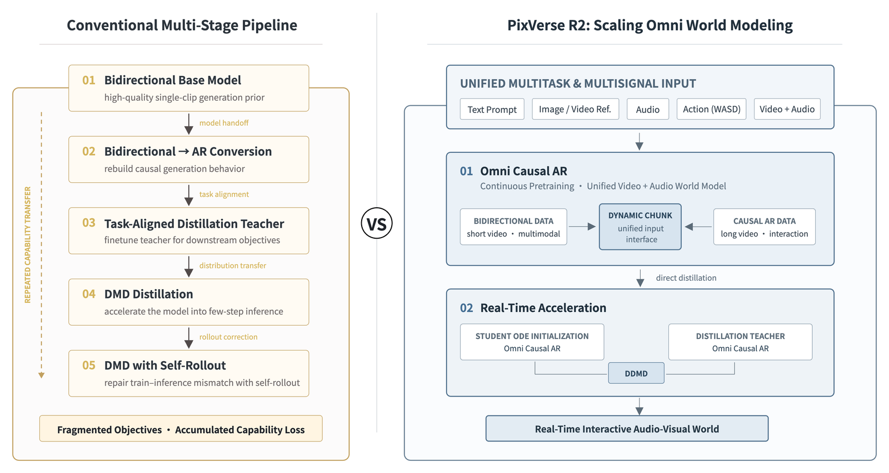
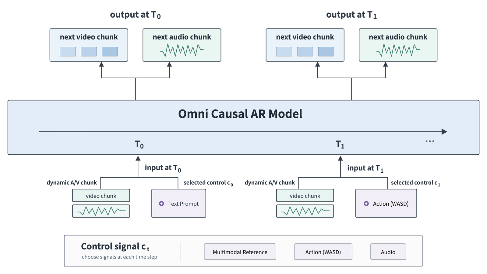
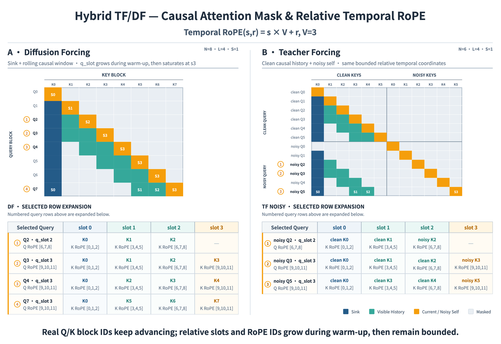

# PixVerse R2: Scaling Real-Time Omni World Models（技术博客）

**来源**: [PixVerse 官方博客](https://pixverse.ai/en/blog/pixverse-r2-scaling-real-time-omni-world-models)，署名 *PixVerse Research*，**2026-08-23**（另有 12 个非英文版本；我核了中文版，数字与英文版一致，其余语种未核）
**前作**: [PixVerse R1 博客](https://pixverse.ai/en/blog/pixverse-r1-next-generation-real-time-world-model)（2026-06-28 更新的 R1 汇总页）
**论文 / 代码 / 权重 / demo**: 🔴 **全部没有**。博客只链了 5 篇外部 arXiv（Decoupled DMD、DMD2、Diffusion Forcing、RoFormer、Pyramidal Flow Matching）和 R1 博客

---

## 0. 先说清楚这是什么材料

**这是一篇产品技术博客，不是论文。** 它描述了一套完整的系统设计，但**没有模型规模、分辨率、帧率、延迟、硬件、步数、训练数据、任何 benchmark 或对照实验**。所以这篇笔记能做的是：把**可核实的设计描述**讲清楚、把**仅有的几个数字**复算一遍、把**营销性表述**单独标出来，再和仓库里有论文、有数字的同类工作对齐。

| 类别 | 博客里的内容 |
|---|---|
| ✅ **具体到可复现层面的设计** | Fig 3 的 Hybrid TF/DF 注意力掩码与 `p = sV + r` 相对时间 RoPE；DDMD 两个方向的公式与总损失形式 |
| 🟡 **有名字、有目的，但机制没展开** | Dynamic Chunk、三路记忆（尤其 Object KV Cache）、Error Bank、块稀疏注意力、金字塔少步蒸馏 |
| 🔢 **全部的数字** | Error Bank：亮度漂移 **0.201 → 0.129（−35.8%）**、**29 条长序列里 20 条改善**、**5 条无运动样本全部减少了错误运动**；块稀疏注意力 **稀疏度 > 90%** |
| 🏷 **营销性表述（无法核实）** | *"world's first publicly launched, general-purpose real-time audiovisual world model"*（R1）、*"the first unified scaling architecture for real-time audiovisual world models"*（R2）、*"preserving … across the four reported dimensions"*（没有任何数字） |

---

## 1. 一句话定位

**R2 把实时音视频世界模型的训练从"双向→AR→专用 teacher→DMD→self-rollout DMD"五段式，压成两段：先持续预训练一个统一的因果音视频世界模型（Omni Causal AR），再用这同一个因果模型同时充当 ODE 初始化与蒸馏 teacher，直接压成少步实时模型（Real-Time Acceleration）。**

| 模块 | 做什么 | 博客给的证据 |
|---|---|---|
| **Omni Causal AR** | 文本 / 多模态参考 / 音频 / 动作四类控制随时注入，预测下一段**同步的视频 + 音频** | 设计描述 + Fig 2 |
| Dynamic Chunk | chunk 长度随控制信号的语义边界与时长变化，设上限 | 仅描述 |
| Hybrid TF / DF | 干净历史上做 teacher forcing、带噪历史上做 diffusion forcing | Fig 3（最具体） |
| 三路记忆 | Sink Memory / Rolling History / Object KV Cache | 仅描述 |
| **Error Bank** | 存"代表性失败状态"，训练时与正常历史一起回放 | **仅有的一组效果数字** |
| **Real-Time Acceleration** | 同一骨干做 ODE 初始化 + teacher；DDMD + DMD2 式对抗正则 | 公式 |
| 块稀疏注意力 | 块级相关性路由，只在选中的 KV 块上做精确 softmax | 稀疏度 > 90%，无质量数字 |
| 金字塔少步蒸馏 | 1–2 个低分辨率阶段定结构 + 1 个高分辨率阶段补细节 | 仅描述 |

📌 **它最值得记的一个设计取向**：**蒸馏 teacher 不再是双向模型，而是因果模型本身**（*"The continuously pretrained Omni Causal AR model provides both student ODE initialization and the foundation of the distillation teacher"*）。Self Forcing / Causal Forcing 那条线的 DMD 用的 real score 是双向的 Wan2.1-14B；R2 让 teacher、student 与推理时的自回归运行方式**对齐在同一条因果轨迹上** —— 这是把 Causal Forcing"ODE 初始化应该来自因果 teacher"的思路，进一步推到了 DMD 阶段本身。⚠️ 但它有没有效、比双向 teacher 好多少，博客**没有任何对照**。

---

## 2. 动机：五段式 vs 两段式

> **Fig 1 逐段解读**：
>
> **左 · Conventional Multi-Stage Pipeline** —— 五个串行阶段，每两段之间标了一种"交接"：`01 Bidirectional Base Model`（高质量单片段生成先验）→ *model handoff* → `02 Bidirectional → AR Conversion`（重建因果生成行为）→ *task alignment* → `03 Task-Aligned Distillation Teacher`（为下游目标微调 teacher）→ *distribution transfer* → `04 DMD Distillation`（压成少步推理）→ *rollout correction* → `05 DMD with Self-Rollout`（用 self-rollout 修训练-推理错配）。左侧竖排虚线箭头标 *REPEATED CAPABILITY TRANSFER*，底部结论框 *Fragmented Objectives · Accumulated Capability Loss*。**这就是仓库 [五篇横向对照](../../video_generation/dmd_few_step_ar/analysis.md) 里"① 因果化 → ② 少步初始化 → ③ on-policy DMD"那条线，只是把"专用 teacher"单独列成了一段。**
>
> **右 · PixVerse R2** —— 顶部 `UNIFIED MULTITASK & MULTISIGNAL INPUT` 有五个输入框：Text Prompt、Image / Video Ref.、Audio、Action (WASD)、**Video + Audio**。中间 `01 Omni Causal AR`（*Continuous Pretraining · Unified Video + Audio World Model*）：左边 `BIDIRECTIONAL DATA`（short video · multimodal）与右边 `CAUSAL AR DATA`（long video · interaction）两股数据**都汇进中间的 `DYNAMIC CHUNK`（unified input interface）**。经 *direct distillation* 进入 `02 Real-Time Acceleration`：`STUDENT ODE INITIALIZATION` 与 `DISTILLATION TEACHER` **两个框都写着 Omni Causal AR**，在 `DDMD` 处汇合，最后输出 `Real-Time Interactive Audio-Visual World`。
>
> 📌 **两个读图细节**：
> 1. **双向数据也经 Dynamic Chunk 进入因果模型** —— 我的理解是：一段短视频若整段作为一个 chunk，就等价于双向生成；长视频切成多个 chunk 就是因果生成。**动态 chunk 因此同时是"把双向先验与因果数据放进同一个接口"的手段**。这是读图推断，博客正文没这么写。
> 2. **右侧画了五类输入，正文与 Fig 2 都说"四类控制"**（文本、多模态参考、音频、动作）。结合 Fig 2 看，多出来的 "Video + Audio" 是模型自己的音视频历史流，而不是一类外部控制 —— 不算矛盾，只是图文口径不同。
>
> ⚠️ **这张图的对比本身值得推敲**：右侧并没有取消 ODE 初始化与 DMD 类蒸馏（DDMD 就是 DMD 的一个变体），而是把左侧 02–03 并进了"持续预训练"、把 04–05 并进了"加速"。**减少的是阶段之间的交接，不是网络的数量** —— 加速阶段仍需要 teacher、fake-score critic，外加 DMD2 式的判别器（见 [§4.2](#42-ddmd--对抗正则)）。左侧第 05 段的 self-rollout 在 R2 里是否还做，博客**没说**。

**博客对五段式的指控**：*"Repeated capability transfer across these stages can degrade generation quality and long-horizon stability."* —— ⚠️ 与 [Avatar-Forever](../../video_generation/avatar_forever/analysis.md) 的指控几乎一样，也同样**没有任何量化证据**。

---

## 3. Omni Causal AR：统一的因果音视频世界模型

博客的定义：*"It converts a full spatiotemporal generative prior into a continuously pretrained world-state transition model that advances in one temporal direction and predicts the next synchronized audio-video segment from available history and live control."* 训练数据从孤立片段扩展到**连续长视频与多轮交互轨迹**，让一个模型学"历史世界状态 + 当前交互输入 → 未来演化"的因果链。

### 3.1 四类控制、同步音视频输出

> **Fig 2 逐段解读**：
>
> **中间横条 · Omni Causal AR Model** —— 一条向右的时间轴，标出 `T0`、`T1`、`…`。**同一个模型沿时间单向推进**，每个时刻做一次"读输入 → 出下一段"。
>
> **下方 · 每个时刻的输入** —— `input at T0` = 左边的 `dynamic A/V chunk`（一个 video chunk 叠一段音频波形）+ 右边的 `selected control c0`（此处是 `Text Prompt`）；`input at T1` 同理，但选中的控制换成了 `Action (WASD)`。**音视频历史与当前控制是分开的两路输入。**
>
> **上方 · 每个时刻的输出** —— `output at T0` / `output at T1` 各是一对 `next video chunk`（三个小方块）与 `next audio chunk`（波形），**视频与音频同步产出**。
>
> **最下方 · Control signal `c_t`** —— *choose signals at each time step*，可选项 `Multimodal Reference`、`Action (WASD)`、`Audio`（加上 T0 用到的 Text Prompt，共四类）。
>
> 📌 **音频出现在两个位置**：既可以是**控制信号**（比如音频驱动），也是模型**生成的输出**（下一段音频）。这意味着 R2 同时覆盖"音频驱动视频"与"音视频联合生成"两种模式 —— 仓库里 [Avatar-Forever](../../video_generation/avatar_forever/analysis.md) 只做前者（音频是条件、音频流冻结），[JoyAI-Echo](../../video_generation/joyai_echo/analysis.md) 做的是长时音视频联合生成。

### 3.2 Dynamic Chunk Generation

**动机**：不同控制的时间尺度不同 —— 文本或参考描述一整个事件，WASD 需要即时反馈，音频同时带着语义、节奏与同步约束。**固定 chunk 长度会逼模型在"响应速度"和"表达完整性"之间取舍。**

**做法**：按当前控制信号的**语义边界与持续时间**切分音视频 chunk，并设一个**最大 chunk 长度**来限制计算、稳定训练。短 chunk 提升对动作与局部指令的响应，长 chunk 保住事件结构、运动与音画一致。*"This allows heterogeneous tasks and controls to share one causal generation interface without changing the model architecture."*

📌 仓库里所有有论文的因果视频模型都用**固定** chunk（Self Forcing 一系是 3 个 latent frame、[Avatar-Forever](../../video_generation/avatar_forever/analysis.md) 是 4 个）。**变长 chunk 是 R2 里少见的、概念上真正新的设计**。
⚠️ 但"语义边界"怎么确定（规则？模型预测？由控制信号的到达时刻决定？）、最大 chunk 多长、训练时 chunk 长度如何采样 —— **全部 `[待补]`**。

### 3.3 Hybrid Teacher Forcing / Diffusion Forcing

**论点**：只在干净历史上训练，得到一个很强、但对累积小误差很脆弱的下一步预测器；只在扰动历史上训练，又会削弱画质、运动与控制响应。**R2 两者混用**：teacher forcing（干净历史）守住画质上限，diffusion forcing（带噪历史）练从自身偏差里恢复。

> **Fig 3 逐段解读**（标题 *Temporal RoPE(s, r) = s × V + r, V = 3*；图例：深蓝 = Sink，青绿 = Visible History，橙 = Current / Noisy Self，浅灰 = Masked）：
>
> **A · Diffusion Forcing**（右上角 `N=8 · L=4 · S=1`：共 8 个块、注意力窗口 4 个 slot、1 个 sink 块）—— 纵轴 `Q0 … Q7` 是 query 块，横轴 `K0 … K7` 是 key 块。每个 query 能看到的是：**K0（sink，深蓝）+ 最近两个历史块（青绿）+ 它自己（橙）**，其余全遮掉。例如 `Q4` 看 `K0, K2, K3, K4`（`K1` 已滑出窗口），`Q7` 看 `K0, K5, K6, K7`。副标题 *q_slot grows during warm-up, then saturates at s3*：前几个块窗口还没填满，slot 从 s0 长到 s3，此后固定在 s3。
>
> **B · Teacher Forcing**（`N=6 · L=4 · S=1`）—— key 分成 `CLEAN KEYS` 与 `NOISY KEYS` 两半，query 也分 `clean Q0–Q5` 与 `noisy Q0–Q5` 两组。**干净 query** 在干净 key 上走和 A 一样的"sink + 最近两个 + 自己"滚动窗口（`clean Q4` 看不到 `clean K1`）；**带噪 query** 看的是**之前的干净历史 + 自己的带噪块**，例如 `noisy Q5` 看 `clean K0`（S0）、`clean K3`（S1）、`clean K4`（S2）和 `noisy K5`（S3）。`noisy Q0` 只看它自己 —— 它本身就是第一个块，前面没有干净历史。**带噪块之间互相不可见**，未来块全部遮掉。
>
> **下方两张 *SELECTED ROW EXPANSION* 表** —— 把编号 ①②③④ 的 query 行展开成 slot → key 块 → RoPE ID 的映射。以 DF 的 `Q7`（q_slot 3，Q RoPE `[9,10,11]`）为例：slot 0 → `K0`（RoPE `[0,1,2]`），slot 1 → `K5`（`[3,4,5]`），slot 2 → `K6`（`[6,7,8]`），slot 3 → `K7`（`[9,10,11]`）。TF 带噪那张表同理：`noisy Q5` 的四个 slot 分别是 `clean K0 / clean K3 / clean K4 / noisy K5`。
>
> **底部结论** —— *Real Q/K block IDs keep advancing; relative slots and RoPE IDs grow during warm-up, then remain bounded.* **真实的块编号一直往前走，但进入注意力计算的时间坐标永远在 `[0, 11]` 之内。**

**相对时间 RoPE**：一个含 `V` 帧的块、处在窗口第 `s` 个 slot、帧内偏移为 `r`，它的时间位置是

$$
p(s, r) = s\,V + r,\qquad s \in \{0, \dots, L-1\},\quad r \in \{0, \dots, V-1\}
$$

图里 `V = 3`、`L = 4`，所以 `p ∈ [0, 11]`，与展开表逐格一致（我逐行核过）。

📌 **两点读图推断**（博客未写）：
1. **同一个 key 块在不同时刻会被分到不同 slot** —— `K5` 对 `Q5` 是 slot 3，对 `Q6` 是 slot 2，对 `Q7` 是 slot 1。所以推理时**缓存的 K 不能预先乘好 RoPE**，每一步都要按当前 slot 重新施加旋转（或者缓存未旋转的 K）。
2. **sink 块永远占 slot 0（位置 `[0,1,2]`）**，紧挨着窗口里最老的历史块（slot 1，`[3,4,5]`），无论 sink 实际上是多久以前的帧。这是所有"相对 RoPE"方案的共同取舍（[Helios](../../video_generation/helios/analysis.md) 的 Relative RoPE、[Recency Forcing](../../video_generation/recency_forcing/analysis.md) 实验里用的 relative RoPE 都是这类）：换来的是不需要对绝对位置外推，代价是模型**看不出 sink 离现在有多远**。

⚠️ **图里的 `V = 3`、`L = 4`、`S = 1` 是示意值**；R2 实际的块大小、窗口长度、sink 数量**全部 `[待补]`**。TF 与 DF 两路在训练中如何混合（比例、调度、是否同一 batch）也**没说**。

### 3.4 三路记忆

博客的原则：*"Continuously growing history increases compute and memory cost, while aggressive truncation can lose character identity, scene setup, and key events."* 于是按时间功能拆成三路、共享一个有界预算：

| 通道 | 存什么 | 仓库里的对应物 |
|---|---|---|
| **Sink Memory** | 持久锚点：角色身份、环境、风格、世界规则 | [AlayaWorld](../alayaworld/analysis.md) 的 sink 帧（RoPE 位置 0）、[LongLive 2.0](../../video_generation/longlive2/analysis.md) 的 Multi-Shot Sink、[Recency Forcing](../../video_generation/recency_forcing/analysis.md) 的 global 段 |
| **Rolling History** | 近期运动、姿态、相机行为、环境变化 | 几乎所有 AR 视频模型的滑动窗口 |
| **Object KV Cache** | 复用并压缩**对未来演化仍然相关的物体级**历史表示 | 🟡 **仓库里没有直接对应物**；最接近的是 [Matrix-Game 3.5](../matrix_game_35/analysis.md) 的 patch 级几何记忆、[AlayaWorld](../alayaworld/analysis.md) 的几何对齐空间记忆 |

⚠️ **Object KV Cache 是三路里唯一新的，也是说得最少的**：物体怎么识别、"仍然相关"怎么判断、压缩成什么形式、预算多大 —— **全部 `[待补]`**。Fig 3 的掩码里只画了 sink 与滚动历史，没有物体 KV 这一路。

### 3.5 Error Bank

**做法**：*"Error Bank stores representative failure states and replays them during training alongside normal histories."* 模型不只学从理想状态往下接，还学**在偏差已经写进世界之后如何识别并恢复**。博客还说它 *"turns **deployment failures** into reusable pretraining signals"*、形成 *"a feedback loop from rollout failures to targeted replay"* —— 失败状态似乎来自部署时的 rollout，但**是离线跑模型收集、还是来自线上会话，怎么筛出"代表性"的那些，都没说** `[待补]`。

**全文唯一一组效果数字**（原文 *"In internal stage evaluations"*）：

| 指标 | 数字 | 我的复算 / 读法 |
|---|---|---|
| 长时亮度漂移 | **0.201 → 0.129** | `(0.201 − 0.129) / 0.201 = 35.8%` ✅ |
| 长序列样本 | **29 条里 20 条改善** | 改善率 69%；**另外 9 条没有改善**（持平还是变差，博客没区分） |
| 无运动样本 | **5 条全部减少了错误运动** | 样本量只有 5 |

⚠️ **这组数的边界**：亮度漂移指标**怎么定义没说**；0.201 是"不加 Error Bank"的同一模型还是更早的阶段性版本，**没说**（*"stage evaluations"*）；样本总量 29 + 5，没有误差棒；**画质、动作、控制响应有没有因此下降，没有数字**。

📌 **与仓库里同名机制的关系**：[AlayaWorld](../alayaworld/analysis.md) 也有一个 **error bank** —— 存的是模型自己的**重建残差** `δ = ẑ0 − z0`，按 chunk 长度与噪声水平分桶、加性回放；AlayaWorld 原文把它引为 [Stable Video Infinity（arXiv:2510.09212）](https://arxiv.org/abs/2510.09212)。我核了 SVI 原文：它确实就叫 *error bank / error banking*，还做了 error bank 容量的消融（其 Table 8）。R2 存的是"representative **failure states**"，**听起来是状态本身而不是残差**，是否分桶、如何挑"代表性"也没说。🔴 **R2 的 6 条参考文献里没有 Stable Video Infinity**，而"Error Bank"这个名字与"回放模型自身错误"的做法都出自它（[Helios](../../video_generation/helios/analysis.md) 还专门以"不依赖 error-bank"作为卖点，可见这在该领域已是一个有名字的已知手段）。

---

## 4. Real-Time Acceleration："Accelerate, do not relearn"

### 4.1 同一个因果骨干既当 student 起点、又当 teacher

原文：*"R2 accelerates an already capable causal world model rather than relearning long-horizon dynamics in a separate few-step generator. The continuously pretrained Omni Causal AR model provides both student ODE initialization and the foundation of the distillation teacher, aligning teacher, student, and autoregressive runtime around the same causal trajectory."*

📌 **这是全文最有信息量的一句设计声明**。仓库里的对照：

| 路线 | ODE 初始化来自 | DMD 的 teacher（real score） |
|---|---|---|
| Self Forcing 一系 | 双向 teacher 的 ODE 轨迹 | **双向** Wan2.1-14B |
| Causal Forcing（见 [ViRDM 笔记](../../video_generation/virdm/analysis.md) 里核的原文附录） | **teacher-forcing 出来的因果模型**的 ODE 轨迹 | 仍是**双向** Wan2.1-14B |
| **PixVerse R2** | Omni Causal AR（因果） | **Omni Causal AR（因果）** |

也就是说，Causal Forcing 只把 ODE 初始化换成了因果来源，**R2 把 DMD 阶段的 teacher 也换成了因果模型**。好处是 teacher 与学生的推理方式一致（都是逐 chunk 自回归、都有同样的记忆结构）；潜在代价是 teacher 本身的长时误差会被原样蒸馏进学生 —— 这也许正是它把抗漂移（Hybrid TF/DF、Error Bank）全部放在**预训练阶段**而不是蒸馏阶段的原因（我的推断）。⚠️ **博客没有任何"因果 teacher vs 双向 teacher"的对照。**

### 4.2 DDMD + 对抗正则

博客区分了三个在少步预算下相关但不同的目标：**条件对齐**（对 prompt、参考、音频、动作响应准确）、**分布匹配**（保住 teacher 的先验）、**真实感**（用真实数据锚定）。沿用 [Decoupled DMD（arXiv:2511.22677）](https://arxiv.org/abs/2511.22677)，在两个不同的时间步 `t_CA`、`t_DM` 上分别构造方向（博客以图片形式给出，以下为转写）：

$$
\Delta_{\mathrm{CA}} = \frac{(s-1)\left(\hat x^{\mathrm{CA}}_{\mathrm{cond}} - \hat x^{\mathrm{CA}}_{\mathrm{uncond}}\right)}{\mathbb{E}\left\lvert \hat x^{\mathrm{CA}}_{\mathrm{cond}} - x_{\mathrm{gen}} \right\rvert + \varepsilon},\qquad
\Delta_{\mathrm{DM}} = \frac{\hat x^{\mathrm{DM}}_{\mathrm{data}} - \hat x^{\mathrm{DM}}_{\mathrm{fake}}}{\mathbb{E}\left\lvert \hat x^{\mathrm{DM}}_{\mathrm{data}} - x_{\mathrm{gen}} \right\rvert + \varepsilon}
$$

再加上来自 DMD2 的对抗正则，总损失为：

$$
\mathcal{L} = \lambda_{\mathrm{CA}}\,\mathcal{L}_{\mathrm{CA}} + \lambda_{\mathrm{DM}}\,\mathcal{L}_{\mathrm{DM}} + \lambda_{\mathrm{adv}}\,\mathcal{L}_{\mathrm{adv}}
$$

**读法**：`Δ_CA` 是 CFG 的"增强"部分 —— `s` 是 guidance scale，`(s−1)(cond − uncond)` 正是把 CFG 烘进学生的那一项；`Δ_DM` 是真正的分布匹配 —— teacher 的数据预测减去 fake-score 模型的预测。两者分母都是 DMD 式的逐样本归一化（预测与当前生成之间的平均绝对差）。

我对照了 DDMD 原文的 Eq. 8：

$$
\nabla_\theta \mathcal{L}_{\mathrm{dDMD}} = \mathbb{E}\left[-\Big(\big(s^{\mathrm{real}}_{\mathrm{cond}}(x_{\tau_{\mathrm{DM}}}) - s^{\mathrm{fake}}_{\mathrm{cond}}(x_{\tau_{\mathrm{DM}}})\big) + (\alpha-1)\big(s^{\mathrm{real}}_{\mathrm{cond}}(x_{\tau_{\mathrm{CA}}}) - s^{\mathrm{real}}_{\mathrm{uncond}}(x_{\tau_{\mathrm{CA}}})\big)\Big)\frac{\partial G_\theta(z_t)}{\partial \theta}\right]
$$

**两个方向的构成与 DDMD 一致**（DM 项 = real − fake、CA 项 = `(α−1)(cond − uncond)`、各自在独立的重新加噪时间步上计算）。**区别在于**：DDMD 的 Eq. 8 在 score 空间把两项**直接相加**；R2 写在 `x̂` 空间，并对两项**各自归一化、再用独立的 λ 加权**。这是 R2 自己的改动还是 DDMD 官方实现本来如此，我没有去核 DDMD 的代码。

⚠️ **没给的**：`Δ` 如何变成 `L_CA`、`L_DM`（通常是对 `x_gen` 构造 stop-gradient 目标的 MSE，但博客没写）；`s`、`t_CA` / `t_DM` 的采样方式（DDMD 推荐的是 `τ_CA > t`、`τ_DM ∈ [0,1]`）、三个 `λ`、判别器的结构 —— **全部 `[待补]`**。

📌 **一个容易被"两段式"叙事遮住的事实**：`x̂_fake` 意味着加速阶段**仍然要在线训练一个 fake-score critic**，DMD2 式对抗项又意味着**还要一个判别器**。所以 R2 的加速阶段至少同时驻留 teacher、critic、判别器、student 四个角色 —— 与 [ViRDM](../../video_generation/virdm/analysis.md) 那种"只训 generator"的方向正好相反。

### 4.3 块稀疏注意力

把时空 token 序列切成计算块，用**块级相关性**估计每个 query 块最需要哪些 KV 块，只在选中的连接上做**精确 softmax**，贡献低的连接直接省略。博客强调它不是随机剪枝，而是把计算集中在"活跃的多模态控制、近期运动、持久世界状态"之间的依赖上，并且**模型在训练中适应稀疏模式**。

**唯一的数字**：*"R2 reaches over 90% attention sparsity while preserving visual quality, motion continuity, condition following, and long-horizon stability across the four reported dimensions in the current internal evaluation."*

⚠️ **这句话里只有稀疏度是数字**，"四个维度"没有任何分数、没有评测协议、没有对照（中文版的措辞更保守：*"效果基本无损……均未出现明显退化"*）。90% 稀疏度也**不等于** 10× 的端到端加速 —— 注意力之外还有 FFN、VAE 解码、块路由本身的开销，博客**没给任何速度或延迟数字**。块大小、路由方式（top-k？阈值？）、稀疏度是否随层变化，**全部 `[待补]`**。

### 4.4 金字塔少步蒸馏

生成路径组织成**一到两个低分辨率阶段 + 一个高分辨率阶段**：低分辨率阶段确定场景布局、主体运动与相机结构，高分辨率阶段恢复纹理、边缘与局部细节；引的是 Pyramidal Flow Matching。📌 仓库里 [Helios](../../video_generation/helios/analysis.md) 的 Pyramid UPC 是同一类思路（多分辨率噪声 → 数据轨迹）。

⚠️ 各阶段分辨率、步数、阶段之间如何上采样与重新加噪、与块稀疏注意力如何叠加 —— **全部 `[待补]`**。

---

## 5. 与仓库里实时世界模型的横向对照

| | **PixVerse R2** | [Matrix-Game 3.5](../matrix_game_35/analysis.md) | [ABot-World-0](../abot_world_0/analysis.md) | [AlayaWorld](../alayaworld/analysis.md) | [minWM](../../video_generation/minwm/analysis.md) |
|---|---|---|---|---|---|
| 材料 | **博客** | 论文 | 论文 + 代码 | 论文 + 代码 | 论文 + 全阶段 checkpoint |
| 底座 / 规模 | `[待补]` | Wan2.2-TI2V-5B | 5B | LTX-2.3（§3 称约 13B，摘要称 15B） | Wan2.1-1.3B / HY1.5-8B |
| 输出规格 | `[待补]`（R1 博客：发布时"实时 1080P 研究能力"，API 版 720p） | 1280×704 | 720P | 540p / 720p，24 fps | — |
| 实时性证据 | **无** | 单张 H200 最高 20 FPS（INT8 + 编译 + 剪枝 VAE） | 单张 RTX 5090 最高 16 FPS、1.2 s 响应 | 无延迟数字 | 单张 A800 首帧 1.137 s（Wan2.1，不含 VAE） |
| 生成音频 | ✅ 联合生成（声称） | ✗ | ✗ | ✗（去掉了音频分支） | ✗ |
| 控制 | 文本 / 多模态参考 / 音频 / WASD | 相机 | 键盘 multi-hot | 相机 + 文本 | 相机 |
| 长时记忆 | Sink + Rolling + **Object KV** | Patch Memory（几何检索） | 有界 KV + 身份记忆 | sink + 时序 + 空间 + 最近帧 | — |
| 抗漂移 | Hybrid TF/DF + **Error Bank** | — | LongForcing | Helios drift + error bank | — |
| 蒸馏 | 因果 teacher 的 ODE init + DDMD + 对抗 | PFM → DMD | TF → ODE → LongForcing | DMD + self-forcing++ + consistency | TF → 少步 AR |

（表中 `—` 表示本表未收录该项，不代表对应工作没有这一机制；细节以各篇笔记为准。）

📌 **读这张表的正确方式**：R2 的每一个组件，仓库里都能找到有论文、有数字的同类实现；**R2 的差异在于"把它们全部放进一个音视频联合、多控制的系统里"，以及"蒸馏 teacher 也是因果模型"**。但这些差异**没有一项有对照实验**，所以它是一份"工业系统的设计清单"，不是可以横向比数的结果。

---

## 6. 数字核对

博客全文的数字只有以下几个（我用正则扫过全文，没有遗漏）：

| 声明 | 核对 |
|---|---|
| 长时亮度漂移 0.201 → 0.129，下降 35.8% | `0.072 / 0.201 = 35.8%` ✅ |
| 29 条长序列里 20 条改善 | 69.0%；9 条未改善 ✅（算术无误，但样本量小、指标未定义） |
| 5 条无运动样本全部减少错误运动 | ✅（n = 5） |
| 注意力稀疏度 > 90% | 无法核对（无基线、无速度数字） |
| 中文版上述数字 | 与英文版逐一相同 ✅ |

**没有的**：参数量、分辨率、帧率、延迟、吞吐、硬件、去噪步数、训练数据规模、训练算力、任何公开 benchmark、任何与其它系统的对比、任何消融。

---

## 7. 争议与权衡

**站得住的**：
- 📌 **"蒸馏 teacher 也用因果模型"**是一个清晰、有道理的设计取向，把 Causal Forcing 的思路推进了一步（§4.1）。
- 📌 **Dynamic Chunk** 在概念上是真正新的：让 chunk 长度服从控制信号的时间尺度，而不是一刀切（§3.2）。
- 📌 **Fig 3 的掩码与相对 RoPE 画得足够具体**，按图就能实现一个 TF/DF 混合训练的注意力掩码（§3.3）。
- 📌 **音视频联合生成 + 四类控制**是仓库里其它实时世界模型都没有覆盖的组合（§5）。

**需要打折的**：
- 🔴 **零规格、零对比、零消融**。作为一篇以"scaling"为题的技术博客，它没有给出任何一个与"规模"或"实时"相关的数字（§6）。
- 🔴 **两个"first"都无法核实**：R1 *"the world's first publicly launched, general-purpose real-time audiovisual world model"*、R2 *"the first unified scaling architecture for real-time audiovisual world models"*。
- 🔴 **归属缺失**：6 条参考文献覆盖了 DDMD、DMD2、Diffusion Forcing、RoFormer、Pyramidal Flow，但 **Error Bank（Stable Video Infinity，连名字都一样）、attention sink、视频 AR 的相对 RoPE、ODE 初始化、self-rollout DMD、块稀疏注意力**都没有出处（§3.5）。
- ⚠️ **"五段 → 两段"主要是重新分组**：加速阶段仍是 ODE 初始化 + DMD 变体 + critic + 判别器，self-rollout 是否还做没说（§2、§4.2）。
- ⚠️ **"四个维度无损"没有任何分数**，且中英文版措辞强度不同（英文 *"preserving"*，中文"基本无损 / 未出现明显退化"）（§4.3）。
- ⚠️ **Error Bank 的证据是"阶段性内部评测"**：指标未定义、基线未说明、29 + 5 个样本、没有画质或控制响应是否受损的数字（§3.5）。
- ⚠️ **机制说得最少的恰恰是最新的两块**：Object KV Cache 与 Dynamic Chunk 的实现细节几乎全空（§3.2、§3.4）。
- ⚠️ **相对 RoPE 的固有取舍**：sink 永远在 slot 0、与最近历史只差 `V` 个位置，模型看不出 sink 实际有多远（§3.3）。

---

## 8. 一句话总结

**PixVerse R2 是一篇产品技术博客：它把实时音视频世界模型的训练从"双向→AR→专用 teacher→DMD→self-rollout DMD"五段式重组成两段 —— 先持续预训练一个统一的因果音视频模型 Omni Causal AR（文本 / 多模态参考 / 音频 / WASD 四类控制随时注入；chunk 长度随控制信号的语义边界变化；干净历史上 teacher forcing、带噪历史上 diffusion forcing，配 sink + 滚动窗口的因果掩码与 `p = sV + r` 的有界相对时间 RoPE；Sink / Rolling / Object KV 三路记忆；Error Bank 回放失败状态），再让这同一个因果模型同时充当 ODE 初始化与蒸馏 teacher，用 Decoupled DMD（条件对齐与分布匹配分开构造方向）+ DMD2 式对抗正则、90% 以上的块稀疏注意力和金字塔多分辨率少步蒸馏压成实时模型。** 📌 最值得记的是**"DMD 的 teacher 也用因果模型"**（把 Causal Forcing 的思路推到了蒸馏阶段）和**变长 chunk** 两个取向；Fig 3 的掩码画得具体到可以照着实现。🔴 **但全文没有模型规模、分辨率、帧率、延迟、硬件、步数、训练数据、benchmark、对比或消融中的任何一项**；仅有的数字是 Error Bank 的"阶段性内部评测"（亮度漂移 0.201 → 0.129、−35.8% 我复算无误；29 条里 20 条改善、5 条无运动样本全部改善）和"注意力稀疏度 > 90%"（无质量分数、无速度数字）；**"Error Bank"连名字带做法都出自 Stable Video Infinity 却未引用**；两个"first"无法核实；"五段变两段"主要是重新分组 —— 加速阶段仍然要 teacher、fake-score critic 和判别器。

---

## 9. 在仓库图谱里的位置

| | 关系 |
|---|---|
| **[五篇横向对照](../../video_generation/dmd_few_step_ar/analysis.md)** | Fig 1 左侧画的就是那条"① 因果化 → ② 少步初始化 → ③ on-policy DMD"流水线（外加一个"专用 teacher"阶段）。R2 的回答是：① 并进持续预训练，② 与 ③ 的 teacher 都换成同一个因果模型 |
| **[AlayaWorld](../alayaworld/analysis.md)** | 最像的一篇：同样有 sink、同样有 error bank、同样把历史当有界的前缀。区别是 AlayaWorld 有几何对齐的空间记忆、没有音频；R2 有音频与 Object KV Cache、没有几何记忆 |
| **[Matrix-Game 3.5](../matrix_game_35/analysis.md)** / **[ABot-World-0](../abot_world_0/analysis.md)** / **[minWM](../../video_generation/minwm/analysis.md)** | 同为实时交互世界模型，**都给了硬规格**（20 FPS @ H200 / 16 FPS @ RTX 5090 / 1.137 s 首帧 @ A800），R2 一个都没给 |
| **[Helios](../../video_generation/helios/analysis.md)** | 相对 RoPE、金字塔多分辨率轨迹的同类做法；Helios 以"不依赖 error-bank"为卖点，R2 则把 Error Bank 作为核心之一 |
| **[Recency Forcing](../../video_generation/recency_forcing/analysis.md)** | 同样的 global（sink）/ history / recent 三段划分与相对 RoPE；Recency Forcing 在 history 段加随 timestep 变化的衰减 bias，R2 则用块稀疏路由决定看哪些 KV 块 |
| **[RAVEN](../../video_generation/raven/analysis.md)** | 在同一初始化下比较过 Teacher Forcing / Diffusion Forcing / Self Forcing 三种历史来源（TF 82.64、DF 84.09、SF 84.06）—— 这正是 R2 "Hybrid TF/DF" 想兼得的两端，R2 自己没有这类对照 |
| **[ViRDM](../../video_generation/virdm/analysis.md)** | 方向相反的两种"简化"：ViRDM 去掉 teacher 和 critic、只训 generator；R2 保留 teacher、critic，再加判别器，简化的是阶段交接 |
| **[Avatar-Forever](../../video_generation/avatar_forever/analysis.md)** | 同样指控串行蒸馏流水线"能力层层转移、会损失"，同样没有量化这条指控；Avatar-Forever 只做音频驱动（音频流冻结），R2 声称音视频联合生成 |
| [JoyAI-Echo](../../video_generation/joyai_echo/analysis.md) / [Vidu S2](../../video_generation/vidu_s2/analysis.md) | 第三方视角：JoyAI-Echo 把 PixVerse-R1 列为面临长时漂移的传统长视频方案；Vidu S2 的时长分层评测里，PixVerse 的 avatar 产品一致性从 10 秒的 2.5–3 分掉到 90 秒的 1 分附近（不一定是 R1，只能作外部参照）—— R2 把大量篇幅放在 Error Bank 与长时记忆上，与这些外部观察的方向一致 |

⚠️ **仓库缺口**：Decoupled DMD（arXiv:2511.22677）、DMD2、Diffusion Forcing、Stable Video Infinity 都没有专篇笔记，而 R2 的加速与抗漂移几乎完全建立在它们之上。

---

## Q&A

*(后续对话中产生的问答追加于此)*
