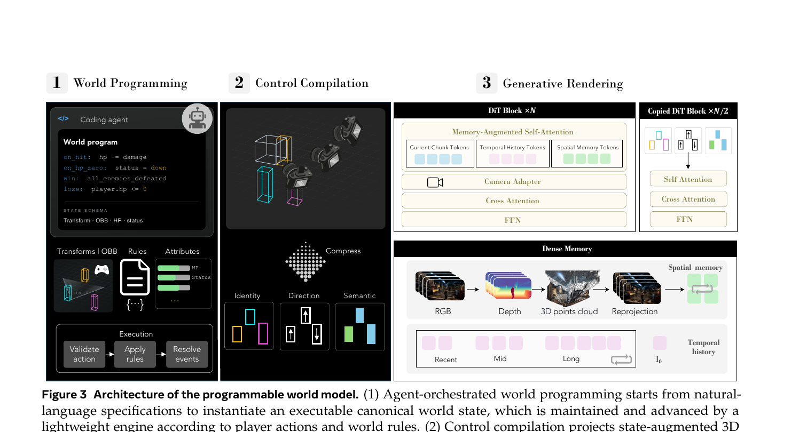
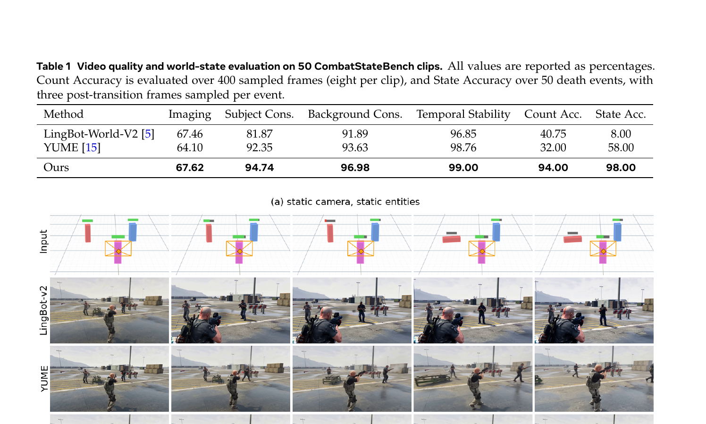

# Programmable World Model (PWM)

**论文**: [arXiv 2609.10540](https://arxiv.org/abs/2609.10540)  
**项目页**: [alaya-lab.github.io/pwm](https://alaya-lab.github.io/pwm)  
**代码**: [github.com/AlayaLab/pwm](https://github.com/AlayaLab/pwm)（暂未发布，inference code / weights pending）  
**作者**: Zheng-Hui Huang, Guixu Lin, Jiacheng Lin 等（Alaya Lab）  
**时间**: 2026-09-09

---

## 1. 一句话定位

把世界状态维护与视觉渲染彻底解耦：由轻量级引擎执行可编程规则维护持久化世界状态（OBB + 属性 + 关系），再由确定性编译器将状态投影为像素对齐的空间控制信号，最后交给预训练视频模型渲染，实现实体级精确控制、持久化状态和可编程世界规则。

---

## 2. 要解决的问题

现有 video world model（LingBot、YUME 等）的三大痛点：

1. **缺乏持久化全局状态**：实体属性（HP、阵营、任务进度）隐式编码在视觉历史中，模型无法维护屏幕外实体或非视觉信息（库存、计分等）。
2. **不可编程**：用户只能用 prompt 描述期望结果，无法事先定义"射击扣血""HP 归零变死"这样的因果规则——提示理想结果 ≠ 规则约束。
3. **状态错误累积**：状态完全依赖生成模型自身的隐式记忆，随时间漂移，"已击杀"的角色可能复活或消失。

---

## 3. 与前作的关系

| 方法 | 状态维护 | 规则执行 | 视觉生成 | PWM 对比 |
|------|---------|---------|---------|---------|
| LingBot-World / YUME | 隐式（KV cache/时序记忆） | ❌ 无 | 生成模型 | 状态漂移，Count Acc. 仅 40%/32% |
| StatePlay | 模型预测状态 | 部分（依赖预测） | 生成模型 | 状态预测误差可累积 |
| MASS | 多玩家共享类型化状态 | Logic Engine（学习） | 生成模型 | 状态转换仍依赖学习到的逻辑 |
| **PWM** | **确定性引擎维护** | **可执行程序（精确）** | **冻结视频模型** | **Count 94%, State 98%** |

PWM 的核心主张：生成模型应只负责渲染，不应负责记忆什么是真实的。

---

## 4. 核心方法

### 4.1 总体交互循环

整个框架的交互循环由三个模块串联：

$$
s_t \xrightarrow{F,\, a_t} s_{t+1} \xrightarrow{P,\, C_{t+1}} M_{t+1}^{\text{ctrl}} \xrightarrow{G} I_{t+1}
$$

- `F`：状态转换引擎（确定性，执行规则）
- `P`：状态编译器（确定性，投影 OBB 到相机空间）
- `G`：生成渲染器（预训练视频模型，仅负责视觉合成）

### 4.2 世界状态表示（Agent-Orchestrated Box World）

**OBB（3D 定向包围盒）** 是核心中间表示，每个实体 i 在时刻 t 的 OBB 为：

$$
b_i^t = \left(\mathbf{p}_i^t,\; \mathbf{d}_i^t,\; \mathbf{R}_i^t,\; \ell_i,\; k_i\right)
$$

其中 `p`=中心位置，`d`=尺寸，`R`=朝向，`ℓ`=语义类别，`k`=实例 track id。

完整世界状态定义为：

$$
s_t = \left(\mathcal{E}_t,\; \mathcal{A}_t,\; \mathcal{Q}_t;\; \mathcal{R}_t\right)
$$

- `E_t`：实体集合及其 3D 姿态
- `A_t`：语义/功能属性（HP、阵营、状态等）
- `Q_t`：实体间关系（敌对、所有权等）
- `R_t`：可执行规则集（`on_hit: hp -= damage; on_hp_zero: status = down`）

**初始化**：从参考图 `I_0` 由 off-the-shelf 3D 检测器恢复可见实体的 OBB 布局（`E_0`），其余属性和规则由 VLM coding agent 根据用户描述写入世界程序。

**引擎执行**：每步交互，引擎执行 `s_{t+1} = F(s_t, a_t)`，验证动作合法性、应用效果、触发事件，更新规则集。世界状态可包含不在视野内的实体（off-screen persistence）。

### 4.3 控制编译（Control Compilation）

状态编译器 `P` 将 `s_{t+1}` 在目标相机轨迹 `C_{t+1}` 下投影为结构化空间控制：

$$
M_{t+1}^{\text{ctrl}} = P(s_{t+1},\; C_{t+1})
$$

具体是三张空间对齐的控制图的 concat：

$$
M^{\text{ctrl}} = \text{Concat}\!\left(M^{\text{id}},\; M^{\text{sem}},\; M^{\text{dir}}\right)
$$

**Identity Map** `M^id`：实例持久性跟踪。维护一个可学习 identity embedding bank `E^id = {q_j^id}_{j=1}^K`，每个实体被固定分配一个 slot `k_i`，该 embedding 被光栅化到其投影 OBB 区域。遮挡或离开画面后重新进入时 slot 保持不变，保证跨时间外观一致性。

**Semantic Map** `M^sem`：类别级信息。使用文本编码器将语义标签 `y_i` 映射为 embedding：`q_i^sem = E_text(y_i)`，光栅化到对应 OBB 区域（背景位置为零）。支持初始观测中不存在的实体（从屏幕外进入）。

**Direction Map** `M^dir`：相机相对运动方向。维护 7 个可学习方向 embedding `E^dir = {q_l^dir}_{l=1}^7`，方向类别为 `{FORWARD, BACKWARD, LEFT, RIGHT, STATIC, UP, DOWN}`。实体的 world-space 速度旋转到相机坐标系后量化到对应类别，从而区分实体自身运动与相机运动引起的表观位移。

📌 Direction Map 是一个关键设计：静止实体在相机运动时投影 OBB 会移位，但 direction 仍标为 STATIC，帮助渲染器解耦相机运动与物体运动。

### 4.4 生成渲染器（Generative Renderer）

基于 **LingBot-World-v1**（预训练相机可控视频生成模型），主干参数完全冻结，添加可学习的 **Structured Spatial ControlNet**：

控制序列 `M^ctrl_{1:T}` 在视频 latent 分辨率下编码，ControlNet 产生逐层控制特征 `r^(ℓ)`，注入主干对应层：

$$
h_{\text{main}}^{(\ell)} \leftarrow h_{\text{main}}^{(\ell)} + r^{(\ell)}
$$

固定窗口渲染：

$$
I_{1:T} = G_{\theta,\phi}\!\left(I_0,\; C,\; M_{1:T}^{\text{ctrl}}\right)
$$

其中 `θ` 为冻结主干参数，`φ` 为 ControlNet 可学习参数。`I_0` 提供外观参考，`C` 指定相机轨迹，`M^ctrl` 提供状态控制信号。

**Chunk-AR 长程生成**（第 n 块，n≥2）：

$$
I^{(n)} = G_{\theta,\phi,\psi}\!\left(C^{(n)},\; M^{\text{ctrl},(n)},\; \mathcal{H}_{\text{temp}}^{(n)},\; \mathcal{H}_{\text{spa}}^{(n)}\right)
$$

- **时序历史** `H_temp`：多尺度 latent 历史（recent/mid/long 三档分辨率递减），训练时随机降质（加噪、特征损坏、部分丢弃）提升鲁棒性，`I_0` 作为永久 anchor。
- **空间记忆** `H_spa`：借用 AlayaWorld 的几何对齐空间记忆机制，将已生成 RGB 帧用深度 + 相机参数提升到世界空间，按目标视角检索并重投影为 spatial latent tokens 用于条件化。这使系统能记住被遮挡或离开画面的实体外观。

> **Fig 3 逐段解读**：
>
> **① World Programming（左面板）**——Coding agent UI 展示世界程序片段：`on_hit: hp -= damage; on_hp_zero: status = down; win: all_enemies_defeated`。下方三个模块（Transforms|OBB、Rules、Attributes）对应 `E_t`、`R_t`、`A_t` 三部分世界状态。最底部 Execution 流程：`Validate action → Apply rules → Resolve events`，即引擎执行 `F(s_t, a_t)` 的三个步骤。
>
> **② Control Compilation（中面板）**——3D OBBs（彩色线框，三个不同朝向）在相机 FOV 下被投影和压缩（点阵图案表示光栅化），输出 Identity（多色矩形）、Direction（上下箭头矩形）、Semantic（深浅色矩形）三张控制图。这一步完全确定性，无学习参数。
>
> **③ Generative Rendering（右面板，两栏）**——左栏：主干 DiT Block（×N）结构，Memory-Augmented Self-Attention 同时接受 Current Chunk Tokens + Temporal History Tokens + Spatial Memory Tokens，再经 Camera Adapter + Cross Attention + FFN。右栏：Copied DiT Block（×N/2）为 ControlNet 结构，以 Self Attention + Cross Attention + FFN 处理控制信号产生注入特征。下方 Dense Memory 面板展示空间记忆流：RGB → Depth → 3D points cloud → Reprojection → Spatial memory（绿色格子）；底部时序历史 Recent/Mid/Long 三档加 `I_0` anchor（粉色矩形，透明度递减表示分辨率递减）。

---

## 5. 数据管线

训练需要结构化注释（相机几何、实例 identity、语义、运动方向），均从无标注游戏视频自动提取：

| 步骤 | 工具 | 产出 |
|------|------|------|
| 相机估计 | ViPE | 相机内参 + 位姿 + metric 深度图 |
| 语义发现 | Qwen3-VL | 场景全局 caption + 可数对象类别集合 |
| 实例分割+跟踪 | SAM3 | 带持久 track id 的实例 mask |
| 3D 目标轨迹恢复 | WildDet3D | 每帧 OBB `(p, d, R)` → 变换到世界坐标系 → object velocity 估计 → 量化为 7 个方向 |
| 控制图生成 | 确定性光栅化 | Identity/Semantic/Direction 三张 map |

**训练数据来源**：Cyberpunk 2077（第一人称）、Forza Horizon 6 和 GTA V（第三人称多样相机视角），均为 HUD-free 游戏视频。

---

## 6. 实验结果

### 6.1 CombatStateBench（主 benchmark）

50 个战斗场景，由 AI agent 自主演化完整状态序列，验证生成视频与引擎维护状态的一致性。

**评测指标**（Qwen3.6-27B 作 VLM judge，不提供标注框）：

$$
\text{CountAcc} = \frac{1}{N} \sum_{i=1}^N \mathbf{1}\!\left[\hat{n}_i = n_i^{\text{eng}}\right]
$$

Count Accuracy 采样 8 帧/clip（400 帧总量），VLM 预测每帧存活角色数并与引擎记录对比。State Accuracy 每次死亡事件后采样 3 帧，VLM 判断是否视觉呈现出"死亡"状态。

| Method | Imaging | Subject Cons. | Background Cons. | Temporal Stability | Count Acc. | State Acc. |
|--------|---------|--------------|----------------|-------------------|-----------|-----------|
| LingBot-World-V2 | 67.46 | 81.87 | 91.89 | 96.85 | 40.75 | 8.00 |
| YUME | 64.10 | 92.35 | 93.63 | 98.76 | 32.00 | 58.00 |
| **Ours** | **67.62** | **94.74** | **96.98** | **99.00** | **94.00** | **98.00** |

Count Accuracy 超 LingBot-V2 **+53.25pp**，超 YUME **+62pp**；State Accuracy 超 LingBot-V2 **+90pp**，超 YUME **+40pp**。

📌 YUME State Accuracy 58% 远高于 LingBot 的 8%，说明 YUME 已具备一定的死亡状态理解；但 Count Accuracy 仅 32%（低于 LingBot 的 40.75%），说明实体计数对隐式状态模型而言更难——多个实体的持久追踪比单次事件的视觉表达难得多。

### 6.2 定性结果

> **Fig 4 逐段解读**（50-clip CombatStateBench，实体死亡事件）：
>
> **上方 Table 1**——数字已在上表列出，此处可直观读取差距。
>
> **(a) static camera, static entities（上组）**——Input 行：蓝/红/绿 OBB 框随时间演化，第 3 帧时蓝框（entity_02）标记死亡（橙色叉号消失）。LingBot-v2 行：角色在全程可见但死亡事件后人物仍以相同姿势活动，视觉与状态不一致；YUME 行：视觉较稳定，但死亡角色可能重新站起或消失。Ours 行：死亡角色准确倒地并在后续帧持续保持倒地状态，剩余角色活动正常，与引擎状态完全一致。
>
> **(b) dynamic camera, dynamic entities（下组）**——相机运动 + 实体运动同时发生。LingBot-v2：整个视频变成粉红色过饱和，场景完全崩溃；YUME：颜色相对正常但动态场景下一致性明显下降，角色位置偏移。Ours：在相机移动和实体运动下均保持正确的场景内容，方向图的相机/物体解耦起到关键作用。

---

## 7. 代码状态

代码**尚未开源**（2026-09-11 时 GitHub 仓库仅有 README + assets，inference code / pretrained weights 标为 pending）。关键实现细节：
- ControlNet 附加在 LingBot-World-v1 的 N 个 DiT Block 上，复制 N/2 个块作为 ControlNet 结构
- Identity embedding bank 大小 K、训练时 slot 随机分配但序列内固定
- Direction 7 类量化：世界坐标系速度 → 当前相机坐标系 → 阈值判静态，剩余 6 方向 bin
- 空间记忆来自 AlayaWorld 机制（RGB+depth→3D pointcloud→reprojection→latent tokens）

---

## 8. 争议与权衡

1. **Representation 粒度的 sweet spot**：OBB 是刻意选择的中间抽象——比文字/2D box 强（3D 空间一致性）、比完整 3D 场景弱（不需要 mesh/texture/骨骼）。粒度太细则训练和推理代价高，且与训练时从观测恢复的表示产生 train-test mismatch（论文 Fig 2 和 §2 详细讨论）。
2. **依赖 LingBot-World-v1**：渲染器的视觉质量上限由预训练基座决定，Imaging Quality 67.62 仅略高于 LingBot-v2 的 67.46，视觉改善有限，主要增益在状态一致性。
3. **数据域限制**：训练数据仅来自三款游戏，虽然论文展示了对赛车游戏（Forza 风格）和 Niulai 游戏的泛化，但开放域视频能否直接支持尚不明确。
4. **代码未开源**：无法验证 WildDet3D 在各类视频上的 OBB 恢复精度，这是整个数据管线的关键瓶颈。

---

## 9. 一句话总结

PWM 的核心论断是"生成模型不应该负责记住什么是真实的"：用确定性引擎维护 OBB+属性+规则构成的可编程世界状态，用确定性编译器把状态投影成 3 张控制图，再交给冻结视频模型渲染，Count Accuracy 从 baseline 的 32-41% 跳到 94%，State Accuracy 从 8-58% 跳到 98%，且支持持久化、可编程、屏幕外实体，不需要任何奖励模型或 RL 训练。

---

## Q&A

