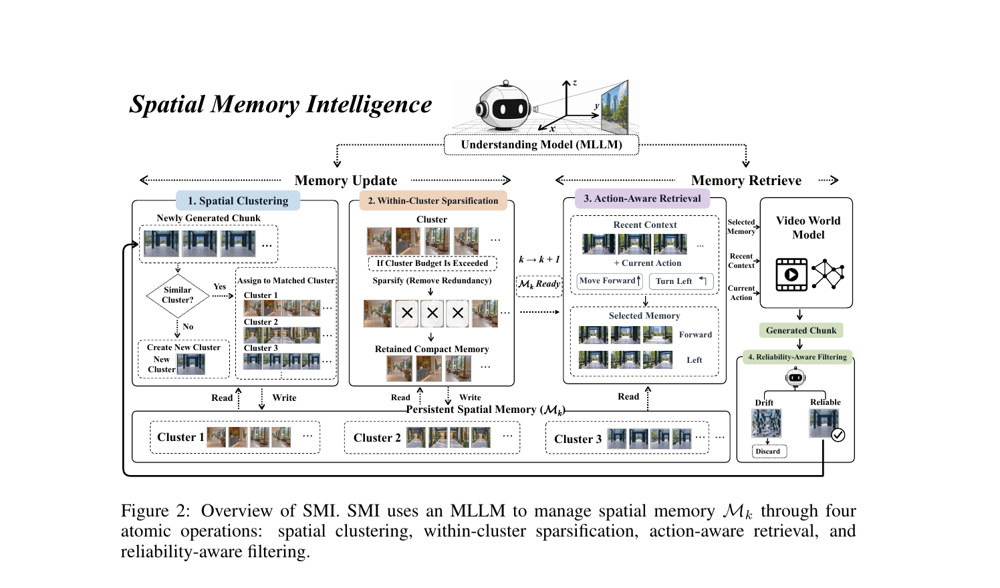
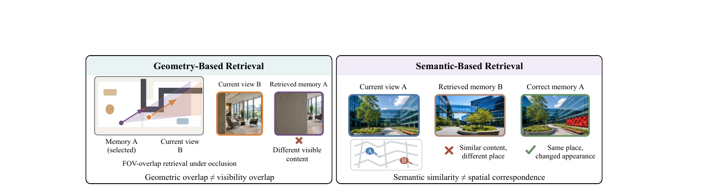
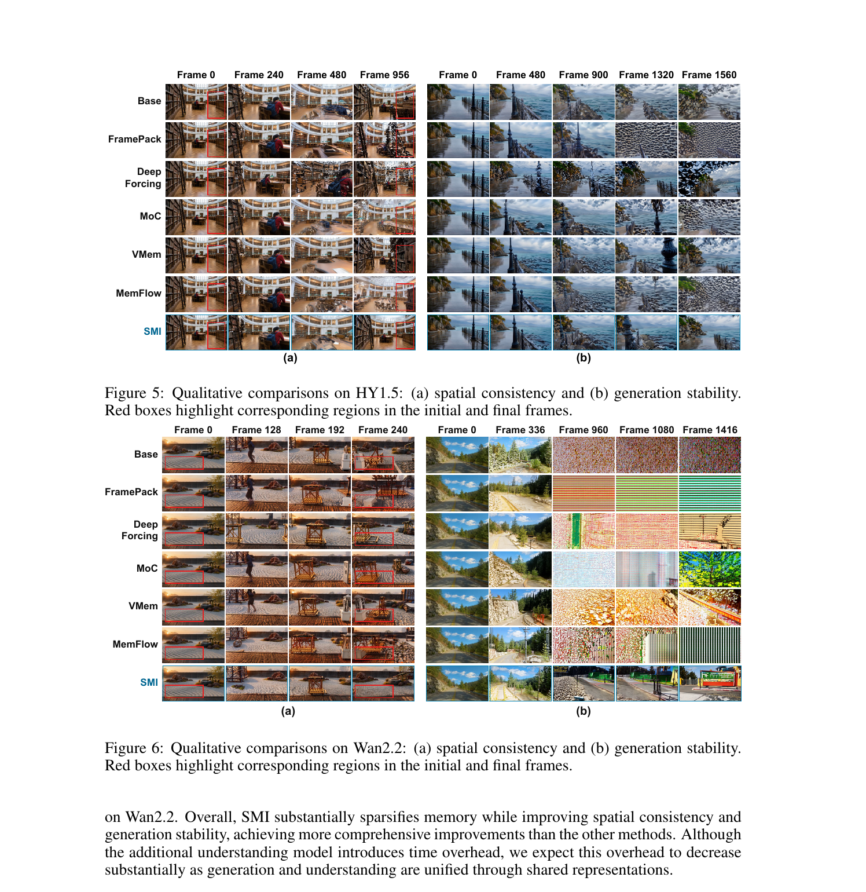

# Spatial Memory Intelligence: Endowing World Models with Understanding-Driven Long-Term Memory

> Ying Yang\*, Guiyu Zhang\*, Lianghua Huang, Chang Nie, Chenyang Si, Haofan Wang, Shaoshuai Shi, Li Jiang†  
> CUHK(Shenzhen) / Alibaba Group / Shenzhen Loop Area Institute / Nanjing University / Lovart AI / Didi Chuxing, 2026-10  
> arXiv: 2610.02521 | [项目主页](https://spatial-memory-intelligence.github.io/)

---

## 1. 一句话定位

首个把 MLLM（Qwen3.5-4B）当作空间记忆管理器嵌入长视频世界模型的框架——SMI 用四个原子操作（空间聚类、簇内稀疏化、动作感知检索、可靠性过滤）统一管理历史 context，实现 83.68% 记忆稀疏化，同时提升空间一致性和生成稳定性，兼容 HY1.5-8B 和 Wan2.2-5B 两个 backbone。

---

## 2. 要解决的问题

交互式视频世界模型在长时程生成时面临三个相互纠缠的挑战：

1. **记忆冗余**：用户在场景内反复移动，同一区域被多次观测，历史记忆线性增长但空间信息量不线性增长。盲目保留全部历史消耗大量 context 预算。
2. **空间不一致**：重回已观测区域时，若历史记忆被压缩丢失或检索错误，模型会生成出与先前不一致的内容（物体消失、布局改变）。
3. **生成漂移**：新生成的帧本身可能含有视觉误差，若被写入记忆库并在之后检索复用，错误会被放大、累积。

现有方法的局限：

- **压缩方法**（FramePack、Deep Forcing）：把历史压缩成紧凑表示，丢弃细粒度空间证据，无法保留精确的场景几何。
- **几何检索**（VMem）：按相机视锥 FOV 重叠选取历史帧——但几何重叠 ≠ 视觉可见性重叠（遮挡情况下失效，见 Fig 3 左）。
- **语义检索**（MemFlow）：按语义相似度选历史帧——但语义相似 ≠ 空间对应（不同地点的相似内容会被错误匹配，见 Fig 3 右）。

---

## 3. 与前作的关系

| 工作 | 关系 |
|------|------|
| WorldPlay-1.5 (Sun et al., 2025) | SMI 用的 HY1.5-8B / Wan2.2-5B backbone 来自这里；SMI 是其记忆管理的上游模块 |
| FramePack / Deep Forcing | 压缩类 baseline；SMI 对比的参照系 |
| VMem (Li et al., 2025c) | 几何检索 baseline；SMI 指出其几何重叠 ≠ 视觉可见性的局限 |
| MemFlow (Ji et al., 2025) | 语义检索 baseline；SMI 指出其语义相似 ≠ 空间对应的局限 |
| AlayaWorld / MosaicMem / WorldCrafter | 类似的空间记忆思路（贪心选帧 + 几何/检索），SMI 的区别是引入 MLLM 做决策 |
| Qwen3.5-4B | MLLM backbone；fine-tune 到四个空间原子操作上 |

**核心差异**：本文是首个把 MLLM 当作显式的空间记忆管理器（决定存什么、删什么、检什么、要不要写入），而不是把 MLLM 当作 context encoder 或只用它的隐式空间感知。

---

## 4. 核心方法

### 4.1 系统架构

> **Fig 2 逐段解读**：
>
> **左侧 Memory Update 通路（操作 1-2）**——新生成的 chunk `C_k` 进入更新流程。首先向上进入操作 1「Spatial Clustering」：MLLM 以相机位姿作为几何提示，与现有 cluster 的 prototype 比较，若找到匹配（`Similar Cluster? Yes`）则归入该 cluster，否则创建新 cluster（`New Cluster`）。记忆库 `M_k`（底部三个 cluster 框）中每个 cluster 按时间序排列持有若干 chunk。当某个 cluster 的 chunk 数达到稀疏化阈值 `T_s` 后，触发操作 2「Within-Cluster Sparsification」：MLLM 审查同一 cluster 内的记忆，把带叉的冗余项删掉，只保留「Retained Compact Memory」。
>
> **右侧 Memory Retrieve 通路（操作 3-4）**——第 `k` 步生成前，进入操作 3「Action-Aware Retrieval」：把最近上下文 `C_{k-1}^{recent}` 和当前动作（如 "Move Forward" / "Turn Left"）一起输入 MLLM，先用相机位姿几何筛出 `K_g` 个候选，MLLM 再从中选出最有用的 `≤P_r` 个历史记忆 `R_k`；若当前动作方向不需要历史参考，MLLM 也可以返回空集。视频世界模型（右上角 Video World Model）拿到 Selected Memory + Recent Context + Current Action 生成新的 chunk。生成的 chunk 经操作 4「Reliability-Aware Filtering」：MLLM 判断该 chunk 是否有明显的视觉漂移——Drift 的被丢弃（不写入记忆），Reliable 的才进入持久化记忆库 `M_k`，进入下一轮 `k→k+1`。

### 4.2 四个原子操作的形式化

**Spatial Clustering（空间聚类）**：记 第 `j` 个 cluster 为 `S_j ⊆ M_k`。cluster 的 prototype `p_j` 定义为对集群内其余成员的相机投影覆盖面积之和最大的那个 chunk：

$$
p_j = \arg\max_{m_{j,q} \in \mathcal{S}_j} \text{Cov}(m_{j,q},\ \mathcal{S}_j - \{m_{j,q}\})
$$

新 chunk `C_k` 先按相机位置几何筛出候选 cluster，再由 MLLM 判断是否匹配：

$$
\text{Assign}(C_k) = \begin{cases} \mathcal{S}_j, & \text{if MLLM matches } C_k \text{ to } p_j \\ \mathcal{S}_{\text{new}}, & \text{if no match} \end{cases}
$$

**Within-Cluster Sparsification（簇内稀疏化）**：当 cluster `j` 的 chunk 数 `n_j` 达到阈值 `T_s` 后，MLLM 识别冗余并动态决定保留哪些（不固定保留数量）：

$$
\mathcal{K}_j = \text{Sparse}_{\text{MLLM}}(\mathcal{S}_j), \quad n_j \geq T_s
$$

MLLM 的判断标准是：一个 chunk 若相对其邻近记忆不包含新的空间结构、物体状态或遮挡关系，则视为冗余可删。

**Action-Aware Retrieval（动作感知检索）**：先用几何筛出 `K_g` 个候选：

$$
\mathcal{G}_k = \text{TopK}_{K_g}(\mathcal{M}_k;\ \pi_k,\ a_k)
$$

MLLM 综合最近上下文和当前动作从候选中选出有用记忆：

$$
\mathcal{R}_k = \text{Retrieve}_{\text{MLLM}}(C_{k-1}^{\text{recent}},\ a_k,\ \mathcal{G}_k), \quad 0 \leq |\mathcal{R}_k| \leq P_r
$$

**Reliability-Aware Filtering（可靠性过滤）**：MLLM 判断新生成 chunk 是否存在明显漂移：

$$
D_k = \text{Filter}_{\text{MLLM}}(C_k) \in \{\text{admit},\ \text{discard}\}
$$

admit 则写入 `M_k`，discard 则丢弃，阻断错误传播。

### 4.3 MLLM 的训练

现有 MLLM（Qwen3.5-4B）已有一定空间推理能力，但无法可靠执行上述四个特殊操作。训练流程：

1. 从真实世界模型推理中采集约 1000 条轨迹，滤除低质量样本。
2. 手动标注 100+ 条示例，用作 few-shot 示范给多个 SOTA teacher MLLM。
3. Teacher MLLM 为剩余样本生成标注，人工审查、清洗、统一格式。
4. 最终得 `N_D` 条训练对 `(I_n, Y_n)`，用标准 SFT cross-entropy 微调 Qwen3.5-4B：

$$
\mathcal{L}_{\text{SFT}}(\phi) = -\frac{1}{N_D} \sum_{n=1}^{N_D} \sum_{\ell=1}^{L_n} \log p_\phi(y_{n,\ell} \mid \mathcal{I}_n,\ y_{n,<\ell})
$$

---

## 5. 失效模式分析

> **Fig 3 逐段解读**：
>
> **左侧（几何检索失效）**——俯视图里 Memory A 和 Current view B 有 FOV 几何重叠（两个视锥相交，橙色区域）。但实际视觉：Memory A（左图：明亮宽敞室内）和 Current view B（右图：被遮挡的暗角方向）在可见内容上完全不同（叉号）。结论：FOV 重叠 ≠ 视觉可见性重叠；被遮挡区域的几何重叠是虚假信号。
>
> **右侧（语义检索失效）**——Current view A（一栋玻璃幕墙建筑正面）检索出 Retrieved memory B（外观极相似的另一栋建筑）而不是 Correct memory A（同一栋建筑换了拍摄角度）。地图显示 A 和 B 在空间上距离很远。结论：语义相似 ≠ 空间对应；在风格统一的城市场景里，相似外观的不同位置会被错误匹配。

---

## 6. 实验

### 实现细节

| 项目 | 值 |
|------|-----|
| 世界模型 backbone | HY1.5-8B、Wan2.2-5B（均来自 WorldPlay-1.5） |
| MLLM | Qwen3.5-4B，fine-tune 至四个原子操作 |
| 优化器 | AdamW，lr=2×10⁻⁵，batch size=64 |
| 评测 rollout | VBench/GPT 评测：100 条 1 分钟随机 rollout；重建一致性：100 条含重访轨迹的 rollout |

### 定量结果（Table 1，HY1.5-8B）

| 方法 | Background Cons. | Motion Smooth. | Aesthetic Q. | Camera-Constr. Cons. | Overall Visual Q. | PSNR | LPIPS | Sparsity | Latency |
|------|---------|---------|---------|---------|---------|------|-------|---------|---------|
| Base (FoV) | 0.938 | 0.991 | 0.445 | 53.16 | 61.54 | 12.478 | 0.604 | 0% | ×1.00 |
| FramePack | 0.940 | 0.990 | 0.432 | 43.28 | 46.47 | 11.718 | 0.622 | **94.38%** | ×1.00 |
| Deep Forcing | **0.946** | 0.983 | 0.440 | 37.67 | 33.70 | 11.260 | **0.665** | 79.21% | **×0.81** |
| MoC | 0.938 | 0.991 | 0.439 | 48.96 | 51.92 | 10.802 | 0.735 | 0% | ×1.15 |
| VMem | 0.940 | 0.991 | 0.448 | 54.47 | 56.51 | 12.768 | 0.583 | 0% | ×1.47 |
| MemFlow | 0.939 | 0.990 | 0.431 | 43.32 | 45.65 | 10.297 | 0.713 | 49.43% | ×1.47 |
| **SMI (ours)** | 0.943 | **0.992** | **0.469** | **67.02** | **65.37** | **13.309** | **0.555** | 83.68% | ×1.38 |

📌 SMI 在 Camera-Constrained Consistency（67.02 vs base 53.16，+26%）和 PSNR（13.31 vs 12.48）上的提升最显著，同时实现 83.68% 稀疏化——而纯压缩的 FramePack（94.38% 稀疏化）在 Camera-Constr. Cons. 上降到 43.28。

### 消融（Table 3，HY1.5）

| 设置 | Spatial Clust. | Sparsif. | Reliability | PSNR | Sparsity |
|------|--------|---------|-------------|------|---------|
| Full (SMI) | ✓ | ✓ | ✓ | **13.309** | **83.68%** |
| (a) 去掉 Reliability | ✓ | ✓ | — | 13.232 | 81.58% |
| (b) 去掉 Sparsification | — | ✓ | ✓ | 11.050 | 80.53% |
| (c) 去掉 Clustering | — | — | ✓ | 12.985 | 35.77% |
| (d) 三者都去掉 | — | — | — | 12.812 | 0% |

去掉 Spatial Clustering（设置 b）时稀疏化效率从 83.68% 降到 80.53% 且 PSNR 从 13.31 骤降到 11.05：不聚类直接稀疏会丢弃不同空间区域的重要证据。去掉 Reliability Filtering（设置 a）则错误漂移帧混入记忆库，PSNR 和稀疏率均略降。

### 定性结果

> **Fig 5/6 逐段解读（两个 backbone，各含空间一致性与生成稳定性两个子图）**：
>
> **Fig 5(a) HY1.5 空间一致性**——左侧四列（Frame 0→956），红框标记图书馆书架区域。Base 和其他方法在后期帧中该区域出现物体错位或内容替换；SMI（最后一行）始终维持书架细节一致，无漂移。
>
> **Fig 5(b) HY1.5 生成稳定性**——右侧五列（Frame 0→1560），场景为海边岩石。Base/FramePack/DeepForcing 等在 Frame 900+ 开始出现纹理崩溃（变成几何噪声）；SMI 到 Frame 1560 仍能保持海岸场景的连贯性，只是场景视角自然演变。
>
> **Fig 6(a/b) Wan2.2 同理**——Frame 0→240 的室内场景（红框标地面纹理）和 Frame 0→1416 的公路场景（Baseline 在 Frame 960+ 几乎全部崩溃成条纹噪声）；SMI 在两个 backbone 上均明显领先。
>
> 规律：压缩类方法（FramePack/Deep Forcing）在长时程上几乎全线崩溃，几何/语义检索方法（VMem/MemFlow）能延缓崩溃但空间不一致，SMI 是唯一同时解决两个问题的方法。

---

## 7. 争议与局限

**方法层面**：

- **MLLM 推理开销**：四个原子操作每步都要调用 Qwen3.5-4B，带来 ×1.27–1.38 的延迟。论文期待未来统一理解+生成架构（如 SMI 用于 unified model）能降低该开销——但目前是真实开销。
- **SFT 数据构造依赖 teacher MLLM**：100+ 人工标注 + teacher 自动标注的流程，质量受 teacher MLLM 空间推理能力影响，且数据规模（约 1000 条轨迹）相对小，泛化性存疑。
- **依赖相机位姿作辅助**：几何候选筛选（操作 3 的 `TopK`）需要 `π_k`（相机参数），如果应用场景无相机轨迹则退化为纯 MLLM 语义检索。
- **稀疏化率随场景结构变化大**：FramePack 能达到 94.38% 稀疏，SMI 的 83.68% 是在保留空间多样性的前提下的结果——某些场景下 SMI 的实际稀疏率可能更低（Table 3 设置 c：去掉 clustering 后稀疏率只有 35.77%）。

**结论层面**：

- 评测基于 WorldPlay-1.5 的两个 backbone，对其他视频世界模型（如 Open-Sora、CogVideo 等）的迁移性未验证。
- GPT-5.6-sol 评测是主要质量指标，依赖外部模型的一致性判断存在变动性。
- 论文未给出 Reliability-Aware Filtering 的拒绝率数据（有多少比例的 chunk 被过滤掉），难以评估该模块的实际贡献量级。

---

## 8. 一句话总结

SMI 把 MLLM 的空间推理能力从"理解辅助"升级为"记忆治理"：用四个原子操作统一解决长视频世界模型的记忆冗余、空间不一致和漂移传播三个问题——实现 83.68% 稀疏化并在空间一致性指标上提升 26%，代价是 ×1.38 的推理延迟，且理论上可随统一理解-生成模型的发展而降低。

---

## Q&A

