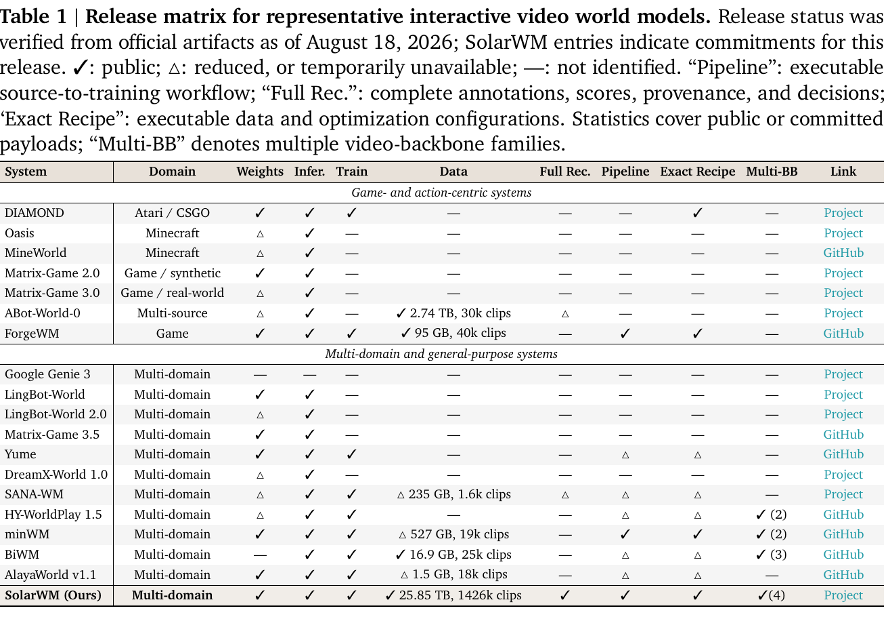
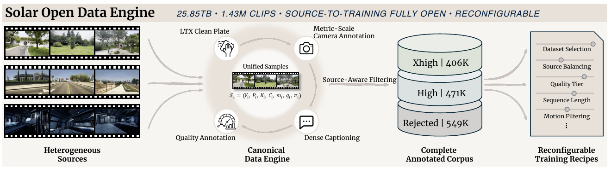
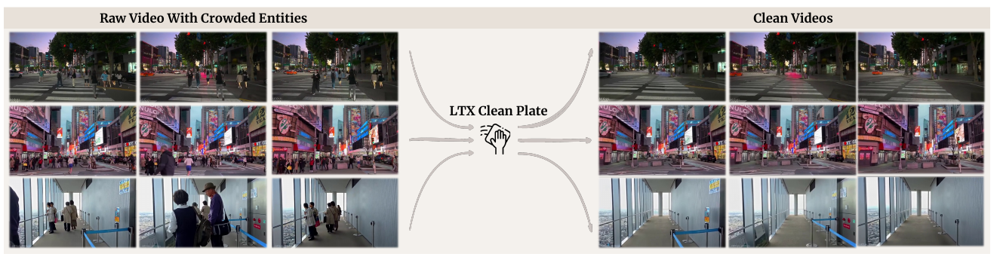
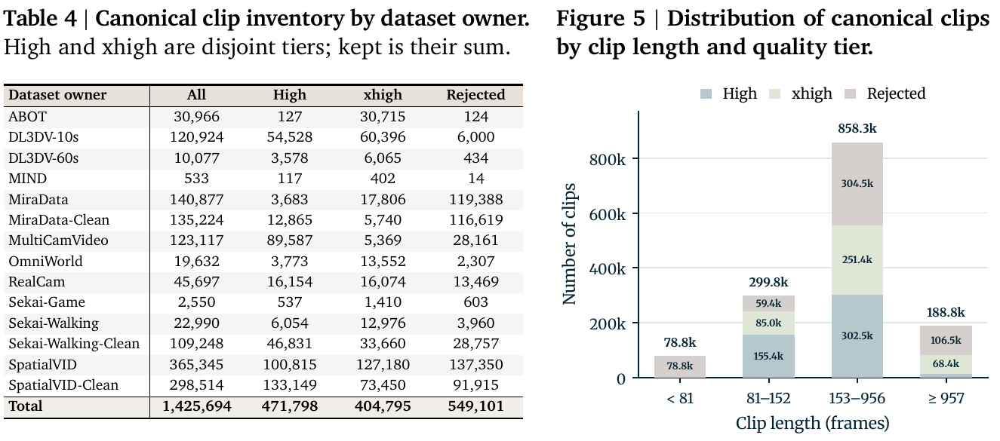
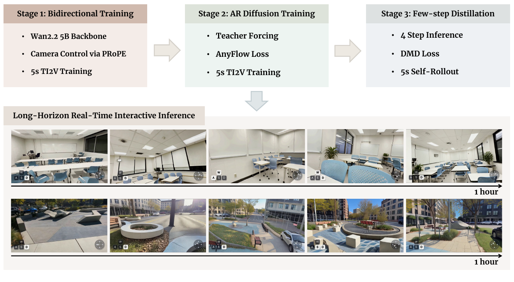
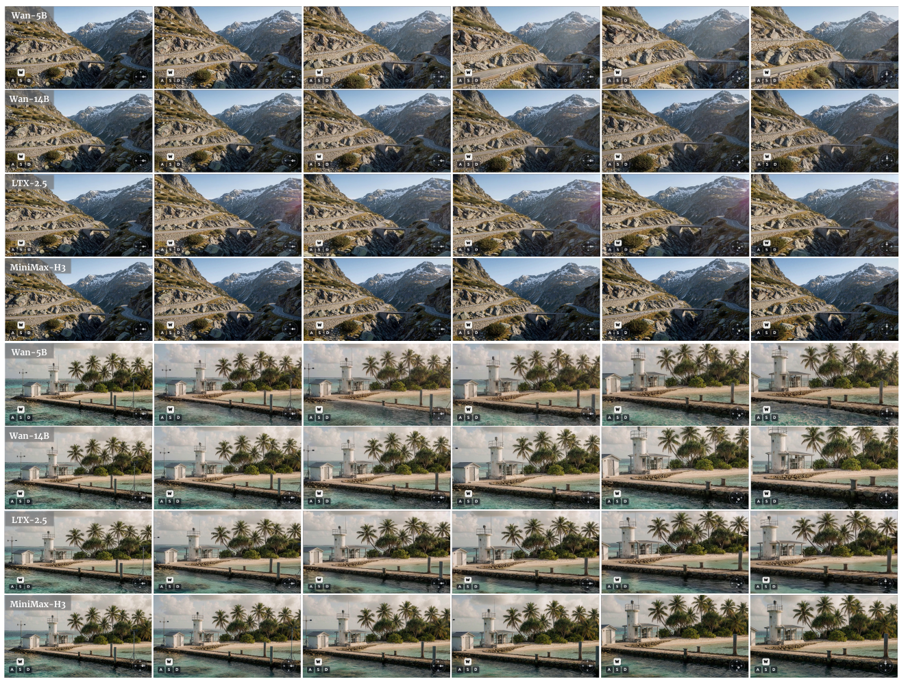
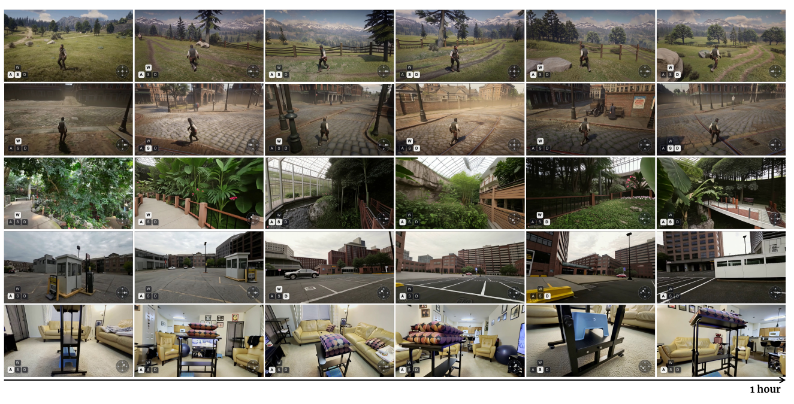

# SolarWM: Open Data and Scalable Training for Long-Horizon Video World Models

> Junchao Huang¹², Guian Fang³, Shengju Qian⁴†, Xianghao Kong⁵, Zhuoran Zhao⁵⁶, Wei Huang⁷, Yihua Du⁶, Zixin Zhang⁶, Justin Cui⁸, Yuchao Gu⁷, Yukang Chen⁷, Xinting Hu, Tianyu He⁹, Shaoshuai Shi, Zhuotao Tian², Xin Wang, Mike Zheng Shou³, Li Jiang¹²‡  
> ¹港中深 ²SLAI ³NUS ⁴港中文 ⁵港科大 ⁶港科大(广州) ⁷NVIDIA ⁸UCLA ⁹微软亚研  
> 2026-09 · [arXiv:2609.02886](https://arxiv.org/abs/2609.02886)(2026-09-02) · [website (数据/代码/模型)](https://junchao-cs.github.io/SolarWM-Web/)  
> †Project Lead ‡Corresponding Author

---

## 1. 一句话定位

**这不是一篇方法论文，是一份"把交互式世界模型的整条链路全部开源"的基建工程。**

两块东西：**可重配置的多源数据引擎**（10 个数据集 → 1.43M canonical clip / **25.85 TB**，统一成帧对齐的数据契约）和 **backbone-native 适配框架**（同一套配方在 **Wan2.2-5B / Wan2.2-14B / LTX-2.5-22B / MiniMax-H3-33B** 四个骨干上实例化，5B–33B）。

三阶段配方：**双向适配（fused-PRoPE 相机控制）→ Teacher-Forced AnyFlow（TF-AnyFlow）→ DMD 因果训练**。

📌 **三个值得记的经验结论**：
1. **不需要专门的 ODE 或 consistency distillation 初始化**——TF-AnyFlow 一步顶掉 Causal Forcing 的 Causal ODE 阶段和 Causal Forcing++ 的 Causal CD 阶段。
2. **绝大部分优化应该放在双向训练阶段**；AR 适配收敛很快，DMD 需要的步数更少。
3. **只在 5 秒序列上训练，就能做分钟到小时级的开放式 rollout**——**不需要长序列微调，也不需要 attention sink**。

⚠️ **但必须先说清最重要的一点：全文没有任何量化结果。** 五张表全是描述性的（发布矩阵、prompt 契约、筛选策略、语料清单、骨干差异），§7 实验部分**只有六张定性图**——没有 FVD / PSNR / VBench / WorldScore，没有 baseline 对比，**没有用户研究，没有任何消融**。而摘要和引言**两次宣称 "state-of-the-art performance"**。

📌 **对本仓库的额外价值**：它的 Table 1 发布矩阵**给出了 [ABot-World-0](../abot_world_0/analysis.md) 自己论文里没报的数据规模——2.74 TB / 30k clips**。

---

## 2. 要解决的问题

论文的核心论点是**数据侧和模型侧这两个需求是耦合的**，而现有开源系统往往忽略这层耦合：

| | 具体困难 |
|---|---|
| **数据侧** | 现有数据集在**时间尺度、视觉质量、运动分布、caption 风格、相机约定**上各不相同。**朴素拼接会引入不一致的监督**，导致在单个源上表现好的模型在多源训练下反而退化 |
| **模型侧** | 视频生成器在**架构、latent 表示、注意力结构、条件机制**上差别很大。共享适配策略虽然可扩展，但**忽视异质性会损害预训练能力**；反之，**逐骨干定制适配又阻碍系统性比较和可扩展性** |

> 论文对现状的判断：**"the field still lacks a unified and reproducible foundation that coordinates multi-source data construction and backbone adaptation while providing a standardized and efficient training protocol across backbones."**

**而且它对"开源"这件事有个更细的批评**（§3.2）：

> *"Even when training code is available, the released package is not always directly reproducible or reconfigurable: **processed data, source-to-training construction, exact selection and mixture recipes, or checkpoint-matched optimization configurations may still be missing.**"*
>
> 📌 **这句话是全篇的立论基础**——它把"开源"拆成七个可核查的维度，然后用 Table 1 把同行逐个对照过去。

> **Table 1 逐列解读**（截止 **2026-08-18** 从官方 artifact 核实；SolarWM 那行是**本次发布的承诺**）：
>
> 七个核查维度：**Weights**（权重）、**Infer.**（推理代码）、**Train**（训练代码）、**Data**（处理后的训练数据）、**Full Rec.**（完整标注/分数/溯源/决策记录）、**Pipeline**（可执行的 source-to-training 工作流）、**Exact Recipe**（可执行的数据与优化配置）、**Multi-BB**（支持多个视频骨干家族）。符号：**✓ 公开 / △ 缩减或暂不可用 / — 未发现**。
>
> 表分两组。**Game- and action-centric**：DIAMOND、Oasis、MineWorld、Matrix-Game 2.0/3.0、**ABot-World-0**、ForgeWM。**Multi-domain and general-purpose**：Google Genie 3、LingBot-World 1.0/2.0、Matrix-Game 3.5、Yume、**DreamX-World 1.0**、SANA-WM、HY-WorldPlay 1.5、**minWM**、BiWM、AlayaWorld v1.1、**SolarWM (Ours)**。
>
> **几个仓库相关的读点**：
> - **ABot-World-0**：Weights △、Train —、**Data ✓ 2.74 TB / 30k clips**、Full Rec. △、Pipeline —、Exact Recipe —、Multi-BB —。📌 **这行的数据规模填上了 ABot 自己论文的空白**。
> - **minWM**：是表里最"开"的同行之一——Weights/Infer./Train ✓、Data △ 527 GB / 19k clips、**Pipeline ✓、Exact Recipe ✓、Multi-BB ✓(2)**，但 Full Rec. —。
> - **Google Genie 3**：整行全是 **—**（什么都没放）。
> - **SolarWM**：**八列全 ✓**，Data **25.85 TB / 1426k clips**，Multi-BB **✓(4)**。
>
> ⚠️ **这张表的性质要看清**：它是**由 SolarWM 作者自己定义维度、自己评判同行、并把自己那行填成全对号**的对照表。维度的选择本身就偏向"我们做了什么"。**作为"谁放了哪些 artifact"的事实索引很有用；作为"谁更开放"的排名要打折。** 而且 SolarWM 那行明确标注是 **commitments（承诺）**，不是已核实的发布状态。
>
> 📌 论文还提到一个横向观察：**现有的多骨干发布通常只覆盖两三个骨干家族**（表里 HY-WorldPlay 1.5 是 2、minWM 是 2、BiWM 是 3），因此**无法判断一个训练设计是普遍可迁移的还是依赖特定模型的工程**。这是 SolarWM 做四个骨干的动机。

---

## 3. 开放数据引擎

> **Fig 3 逐段解读**：顶栏标语 **`25.85TB · 1.43M CLIPS · SOURCE-TO-TRAINING FULLY OPEN · RECONFIGURABLE`**。
>
> 从左到右四段：
> - **`Heterogeneous Sources`**——三组缩略图（街景/驾驶/室内渲染场景）。
> - **`Canonical Data Engine`**——中央一个圆环，四个节点环绕：**`LTX Clean Plate`**（手形图标）、**`Metric-Scale Camera Annotation`**（相机图标）、**`Dense Captioning`**（对话气泡）、**`Quality Annotation`**（仪表盘）。圆环中心是 **`Unified Samples`** 和统一 schema 公式 `S_i = (V_i, P_i, K_i, C_i, m_i, q_i, π_i)`。
> - 一条 **`Source-Aware Filtering`** 箭头指向 **`Complete Annotated Corpus`**——三个圆柱：**`Xhigh | 406K`**、**`High | 471K`**、**`Rejected | 549K`**。
> - **`Reconfigurable Training Recipes`**——一列滑块：`Dataset Selection` / `Source Balancing` / `Quality Tier` / `Sequence Length` / `Motion Filtering` / …
>
> 📌 **图里最关键的信息是 `Rejected | 549K` 也被画成一个正式的圆柱**——被拒的 549K clip **不是丢掉，而是带着完整标注和机器可读的拒绝原因一起发布**。这正是"引擎而非固定 clip 列表"的含义。

### 3.1 核心设计原则：先全量处理，后施加选择

> **"process and annotate every canonical clip from every source **before** applying any training-time selection criteria."**

不满足默认 recipe 的 clip 被放进**独立的 rejected 分区**，连同它的标注、指标值和**机器可读的拒绝原因**。发布的 `high` / `xhigh` 是**两个方便的质量档，不是对"有效数据"的不可逆定义**。

📌 **这个设计的实际收益**：用户可以改阈值、关掉某个筛选条件、重新平衡源权重、或构造 backbone-specific 的时间视图，**而不需要重跑昂贵的相机估计、captioning 和质量评估流水线**。

**三个命名空间被刻意分开**（论文说这三者在数据集发布里"经常被混为一谈"）：

| 命名空间 | 内容 | 后果 |
|---|---|---|
| **physical corpus** | canonical 样本 + 标注 | 改 recipe **不复制底层视频** |
| **logical recipe** | split 归属、tier 策略、源权重、repeat factor | 改 recipe 不动物理数据 |
| **model view** | backbone-specific 窗口或预计算 latent | **换 VAE 不改变数据选择** |

**10 个源数据集** → **14 个可独立寻址的处理分区**（称作 *dataset owners*）：

> ABOT-World、DL3DV、MiraData、RealCam、SpatialVID、Sekai-Game、Sekai-Walking、MIND、MultiCamVideo、OmniWorld。
>
> owner 级再细分：**DL3DV 分成 DL3DV-10s 和 DL3DV-60s 两个时间视图**；**MiraData / Sekai-Walking / SpatialVID 各派生一个 Clean Plate owner**。10 + 1 + 3 = **14 owners**，每个都能在构造训练 recipe 时**独立筛选、加权、选择**。

### 3.2 统一样本 schema

$$
\mathcal{S}_i = \big(V_i,\; P_i,\; K_i,\; C_i,\; m_i,\; q_i,\; \pi_i\big)
$$

| 字段 | 内容 |
|---|---|
| `V_i` | 视频 |
| `P_i ∈ ℝ^{N×4×4}` | **metric（有真实尺度的）camera-to-world 变换** |
| `K_i ∈ ℝ^{N×4}` | **逐帧** `(f_x, f_y, c_x, c_y)` 内参 |
| `C_i` | dense caption |
| `m_i` | 源与媒体元数据 |
| `q_i` | **完整**指标记录 |
| `π_i` | provenance 与 lineage（溯源） |

schema 记录 source owner、原始标识、时间区间、**处理版本**、以及**每一个阶段的结果**。📌 **这使得不同源的样本对训练 reader 是可互换的，同时每个派生产物都能追溯回它的输入。**

### 3.3 Metric-Scale 相机标注

沿用 **SANA-WM** 的稳健标注设计，**按每个源可得的几何证据选择标注路径**：

| 源的情况 | 处理路径 |
|---|---|
| **仅有视频** | **Pi3X** 估计时序一致但尺度不定的场景结构 + **MoGe-2** 提供逐帧 metric-depth 锚点 → 两者深度对齐融合 → 送入**改造过的 VIPE SLAM 后端** → VIPE 估 6-DoF 轨迹并做 bundle adjustment，**逐帧独立优化** `(f_x, f_y, c_x, c_y)`，由 **GeoCalib** 初始化 |
| **有 GT 或 COLMAP 位姿** | **保留原轨迹，不用 SLAM 估计替换**。Pi3X 只用来把预测的场景结构连到轨迹的 metric gauge 上：预测与参考相机中心用**稳健 Umeyama Sim(3) 拟合**对齐，并**在残差最低的 80% 帧上重新估计** |
| **有 metric depth 但无轨迹** | 直接用深度作为 VIPE 的尺度锚 |

📌 **"逐帧内参"这个选择有明确理由**：对包含**变焦或焦距漂移**的 clip，整段视频用单一内参矩阵是不够的。

📌 **另一个刻意的决定**：**平移量保持 metric 单位，不做全语料范围的平移归一化。** 源特定的坐标转换只在 ingestion 时做一次并记录在元数据里。

**逐样本的几何校验**：有限几何、正焦距、FOV 在合理范围、焦距一致性 `|f_x − f_y| / (½(f_x + f_y) + ε)`、时序尺度稳定性 `std(s)/mean(s)`。⚠️ **缺失或非有限的相机证据在 recipe 使用 camera gate 时"fail closed"**（即默认拒绝而非默认通过）。

### 3.4 LTX Clean Plate：把动态人车抹掉

> **动机**：动态的人和车对相机控制的世界模型是常见的歧义来源——**它们引入的运动既不由相机解释，也不能被一致地控制**。

> **Fig 4 解读**：左侧 **`Raw Video With Crowded Entities`**（三行：有行人的街道、有霓虹招牌与行人的街景、有多人的室内空间），中间 **`LTX Clean Plate`**，右侧 **`Clean Videos`**——同样的场景**人车被移除，静态布局和相机轨迹保留**。
>
> 📌 按图核对：静态几何（建筑、招牌、地面）确实保住了，人物被抹掉后的区域填得比较干净。但**第三行室内场景的地面纹理在人物原位置附近能看出轻微的平滑痕迹**——这与论文自己的警告一致（见下）。

**具体参数**：**8 步去噪、strength 1.0**、Clean Plate prompt；输入 **1248×704** 处理，输出保存为 **1280×720 / 16 fps**。

⚠️ **论文自己给出了很重要的警告**：

> **"Clean outputs are not assumed to inherit the quality of their source clips."** 移除可能引入**纹理伪影、时序不连续、或改变运动统计**，所以 **caption、视觉指标、语义指标、相机诊断都对每个输出窗口重新计算**。Metric scale 从**确定性的源帧对应关系**恢复；无效或歧义的尺度重建 **fail closed**。

**当前发布含 543k clean clip**：**298k SpatialVID-Clean**（73k @ 81 帧 + 224k @ 160 帧）、**135k MiraData-Clean**、**109k Sekai-Walking-Clean**。

📌 **关键定位**：这些是**独立的 recipe owner，而不是对原数据集的静默替换**。

### 3.5 Dense Captioning 与多轴标注

**全部 1.43M clip 由同一条 Kimi-K2.6 生产流水线 caption。** prompt 要求模型**检视整段 clip，只描述持久的环境和稳定的场景内容**。

⚠️ **被明确排除在训练 caption 之外的**：动态实体、动作、**相机运动**、镜头术语、推测性或媒体相关措辞。

> 📌 **排除相机运动的理由**：**降低文本条件泄漏相机控制信息的风险**。这与 [ABot-World-0](../abot_world_0/analysis.md) 的做法完全一致（后者也刻意在 caption 里省略相机运动）——**两篇独立得出同一结论，说明这是个真实的工程陷阱。**

**Table 2 的结构化输出契约**（严格 JSON，恰好六个顶层字段）：

| 字段 | 取值 | 用途 |
|---|---|---|
| `dense_caption` | 一段英文，**60–150 词** | **唯一成为文本条件的字段** |
| `vlm_entity_density` | `{1,2,3}` | 可见人/车/动物的**峰值合并密度**：none / sparse / dense |
| `vlm_quality` | `{1.0 … 5.0}` | 整体视觉可用性 |
| `reject_flags` | 八个标志的去重子集 | `text_heavy` / `watermark` / `ui_overlay` / `blurry` / `near_static` / `low_light` / `nsfw` / `single_color` |
| `scene_type` | `real_world` / `rendered` / `game` / `animation` / `mixed` | 场景分类 |
| `scene_transition` | `{label, count, timestamps_sec, evidence}` | label ∈ none / possible / definite；**持续快速运动不算转场** |

**视觉输入规格**：**1 fps，最多 64 帧**，ffmpeg 向上取整采样整段 clip，最大边 768 px，JPEG qscale 3，无音频。**响应协议**：temperature 0、seed 0、`thinking=false`，只返回 JSON。

📌 **transition 预测保持标记为 `unverified`，且"有 caption 本身不影响 tier 归属"**——这种对自身标注可信度的显式标注很少见。

**质量与运动指标向量**（论文的立场是"没有单一分数能覆盖交互式世界模型训练需要的性质"）：

| 类别 | 具体指标 |
|---|---|
| **camera integrity** | 有限位姿/内参检验、水平与垂直 FOV、焦距散度、尺度变异系数 |
| **visual quality** | 饱和度统计、**DOVER** technical 与 aesthetic 分的均值 |
| **motion** | **FFmpeg VMAF Motion**、**UniMatch/GMFlow** 的稠密对应幅度 |
| **temporal consistency** | **PySceneDetect** 切点数、Kimi-K2.6 的 transition 字段 |
| **semantic suitability** | Kimi-K2.6 的 quality、entity density、scene type，以及 `blurry`/`ui_overlay`/`watermark`/`near_static` 等显式标志 |

📌 **所有测量值——包括默认选择策略没用到的——都保留在发布记录里**。理由说得很好：

> **"different source domains have different natural score distributions: a universal motion or aesthetic threshold would remove useful camera trajectories from one domain while retaining artifacts in another."**

### 3.6 源感知筛选策略（Table 3）

**每个 dataset owner 冻结一份带版本的策略**，产出三个互斥的物理标签：`xhigh` / `high` / `rejected`。样本同时满足 **kept 规则**和更严格的 **promotion 规则**才是 `xhigh`；只满足 kept 的是 `high`；其余全部作为 `rejected` **连同失败原因保留**。**规则里点名的每个指标都必须存在、有限、类型正确。**

论文强调 **Table 3 是"可执行的策略文档，而不是定性总结"**。几个例子（`C₁₂₀` = 两个 FOV ∈ [25,120]°、焦距散度 ≤ 0.20、尺度变异系数 ≤ 2；`Q` = Kimi 质量分；`D` = 平均 DOVER；`U` = UniMatch 运动；`R` = reject-flag 集合）：

| owner | kept 规则（节选） | xhigh 追加 |
|---|---|---|
| **ABOT** | `C₁₂₀`；`S ∈ [0,180]`；**`R = ∅`；`T = 0`**；`Q ≥ 4` | `Q = 5` |
| **Sekai-Game** | **`U ≤ 350`**；`D ≥ .20`；`Q ∈ [3,5]`；`blurry ∉ R` | `Q ∈ [4,5]`；`R = ∅` |
| **MiraData** | `A`；`N ≥ 81`；`C₁₂₀`；`Q ≥ 4`；**`D ≥ .40`；分辨率必须 = 1280×720**；`R = ∅`；`T = 0`；`V ∈ [.5,50]`；`U ∈ [3,120]` | `Q = 5`；`U ≤ 100` |
| **MiraData-Clean** | **精确的 kept-source lineage**；`G`（更严的 post-Clean 几何与 lineage 检查）；`resolution_src = resolution_out = 1280×720`；… | `Q = 5`；`D ≥ .45`；`U ≤ 100` |

📌 **论文对"策略不对称"这件事做了明确辩护**，这段话值得记：

> **Sekai-Game 保留高运动的游戏轨迹，不施加通用的相机几何或饱和度 gate**；而 clean owner 要求 post-transformation 几何检查。同样，**某些指标对特定源只作为标注保留**。
>
> **"This avoids retroactively presenting every computed metric as a selection gate."**（这避免了把每个计算出来的指标事后都呈现成筛选闸门。）

### 3.7 语料结果（Table 4 / Fig 5）

> **Table 4 逐行读点**（`High` 与 `xhigh` 是互斥档，`kept` = 两者之和）：
>
> | owner | All | High | xhigh | Rejected | **保留率** |
> |---|---|---|---|---|---|
> | **ABOT** | 30,966 | 127 | **30,715** | 124 | **99.6%**，且几乎全进 xhigh |
> | DL3DV-10s | 120,924 | 54,528 | 60,396 | 6,000 | 95.0% |
> | **MiraData** | 140,877 | 3,683 | 17,806 | **119,388** | **仅 15.2%** |
> | MiraData-Clean | 135,224 | 12,865 | 5,740 | 116,619 | 13.8% |
> | MultiCamVideo | 123,117 | 89,587 | 5,369 | 28,161 | 77.1% |
> | SpatialVID | 365,345 | 100,815 | 127,180 | 137,350 | 62.4% |
> | SpatialVID-Clean | 298,514 | 133,149 | 73,450 | 91,915 | 69.2% |
> | Sekai-Walking-Clean | 109,248 | 46,831 | 33,660 | 28,757 | 73.7% |
> | **Total** | **1,425,694** | **471,798** | **404,795** | **549,101** | **61.5%** |
>
> 📌 **两端的对比极有信息量**：
> - **ABOT 保留 99.6% 且 99.2% 直接进 xhigh**——游戏引擎采集 + API ground-truth 动作标签的数据**几乎无需过滤**。这从侧面印证了 ABot-World-0 关于"游戏数据是质量最高的监督信号"的说法。
> - **MiraData 被拒 85%**——通用视频-文本语料在"帧对齐几何控制"这个标准下大规模不合格。注意它的 kept 规则里有一条**硬性 `分辨率 = 1280×720`**，这大概是主要杀手。
>
> **Fig 5 解读**：按原始 clip 长度分四档堆叠（High 深青 / xhigh 浅绿 / Rejected 灰）：
> - **`< 81` 帧：78.8k，全部在 rejected**（这是硬性下限）
> - `81–152` 帧：299.8k（High 155.4k / xhigh 85.0k / Rejected 59.4k）
> - **`153–956` 帧：858.3k 是主体**（Rejected 304.5k / xhigh 251.4k / High 302.5k → **553k kept**）
> - `≥ 957` 帧：188.8k（长尾，**82k kept**）
>
> 物理存储：**29k shards，约 25.85 TB**。

### 3.8 开放 recipe 与 split

物理 WebDataset 把每一行存在 `kept-high` / `kept-xhigh` / `rejected` 之一下，**recipe 索引提供逻辑上的训练/评测归属**。split 用稳定样本标识构造，**并校验无重叠标识**。另外为每个 owner 发布**独立的 100 样本测试视图**（共 1,400 行）供数据检查和 reader 验证。

📌 **recipe 可以重复引用同一行而不复制它**。举例（这是全文唯一披露的具体训练 mixture）：

> **`81f short` recipe** 跨十个 owner，含 **600,320 个物理训练行**；**源平衡对 ABOT / MiraData / Sekai-Game 施加 repeat factor 6**，产出**每 epoch 870,210 个虚拟出现**；held-out 测试视图 **1,000 行**。

⚠️ **注意这个 repeat factor 6 的含义**：ABOT 只有 30,966 个 clip 却被重复 6 次——**游戏数据在实际训练分布里的权重被显著放大**，而这条 recipe 的设计依据（为什么是 6）没有说明，也没有对照实验。

---

## 4. 训练流水线

> **Fig 2 逐格解读**：上半三个阶段框，下半 `Long-Horizon Real-Time Interactive Inference`。
>
> | 阶段 | 框内三条 |
> |---|---|
> | **Stage 1: Bidirectional Training** | `Wan2.2 5B Backbone` / **`Camera Control via PRoPE`** / `5s TI2V Training` |
> | **Stage 2: AR Diffusion Training** | `Teacher Forcing` / **`AnyFlow Loss`** / `5s TI2V Training` |
> | **Stage 3: Few-step Distillation** | **`4 Step Inference`** / `DMD Loss` / **`5s Self-Rollout`** |
>
> 📌 **三个阶段全部只在 5 秒序列上训练**——这是本文最强的宣称的前提。
>
> **下半**是两条小时级 rollout 的关键帧带，右端标 **`1 hour`**：上排是一间**会议室/教室内景**（桌椅、投影、天花板灯具），下排是一处**城市广场/庭院**（喷泉、树木、建筑立面）。两条都保住了主要布局。

### 4.1 Stage 1：双向适配 + fused-PRoPE

$$
\mathcal{L}_{\mathrm{bid}} = \mathbb{E}_{z_0,\, t,\, \epsilon}\Big[\big\lVert f_\theta(z_t, t, c) - u_t \big\rVert_2^2\Big]
$$

`c` 汇集文本、图像、相机条件；模型预测**其骨干的原生 flow 或 velocity 目标 `u_t`**。用**双向注意力覆盖完整训练窗口**。

**相机控制通过 fused-PRoPE 注入**（沿用 **MosaicMem**）：

> 骨干先施加它**原生的 video RoPE** 表示视频 token 的时空位置；**相机位姿和内参随后决定投影旋转，作用在 query、key、value 张量上**；接着是**单次 self-attention**，之后在原生输出投影之前施加匹配的输出变换。

📌 **这个设计的两个好处**：**既不需要单独的控制分支，也不需要额外的一次 attention pass**。相机运动是**通过注意力计算本身**引入的，而不是靠追加一个无关的条件 token 或独立相机分支。

⚠️ 这与 [ReWorld](../../video_generation/reworld/analysis.md) 的 PM-RoPE / E-PRoPE 属于**同一族思路**（把相机几何折进 attention），而与 [ABot-World-0](../abot_world_0/analysis.md) 的"键盘动作加性注入 patchify"是**两条不同路线**——后者明确拒绝相机位姿，前者以相机轨迹为核心控制信号。

**这个 checkpoint 同时提供两个东西**：因果训练的初始化，以及 **DMD 阶段固定的双向参考（teacher）**。

### 4.2 Stage 2：Teacher-Forced AnyFlow

latent 序列被分成有序 block。预测当前 block 时，模型**只能注意当前的噪声状态和干净的 ground-truth 历史**，未来 block 被隐藏。对采样的一对噪声水平 `(t, r)`：

$$
\mathcal{L}_{\mathrm{TF\text{-}AF}} = \mathbb{E}\left[\sum_k \ell_{\mathrm{AF}}\big(f_\phi;\, z_t^k,\, t,\, r,\, z_0^{<k},\, c\big)\right]
$$

`ℓ_AF` **监督任意两个噪声水平之间的 flow map**，从而**直接支持少步自回归生成**。

📌 **这一步是本文最实质的方法贡献，值得说清它省掉了什么**：

> **AnyFlow 目标让模型直接暴露在少步采样实际用到的有限噪声跃迁上**，而 teacher forcing 提供稳定的干净历史。两者结合**直接产出一个可以交给 DMD 的少步自回归 checkpoint**——
>
> **"TF-AnyFlow removes the need for the additional Causal ODE and Causal Consistency Distillation (CD) initialization stages used by Causal Forcing and Causal Forcing++, respectively."**

**为什么这一步很快**：它主要是**激活已经训好的双向模型里的因果预测能力，而不是重新学习外观和运动**——是"短的因果适配"，不是"新一轮表示学习"。

### 4.3 Stage 3：DMD 因果训练

teacher-forced 训练仍然看到干净历史，而推理时条件在模型自己的预测上。用 DMD 弥合这个 **exposure gap**：

> 因果 student **在与推理相同的时间规则下生成轨迹**，用 **detached rollout-and-replay** 过程（**允许 KV Cache 梯度**）；**冻结的双向 teacher** 估计目标分布，**可训练的 fake-distribution 模型**跟踪 student 不断变化的 rollout 分布，两者之差给出分布匹配方向。

$$
\nabla_\psi \mathcal{L}_{\mathrm{DMD}} = \mathbb{E}\Big[J_{G_\psi}^\top\, w(t)\,\big(s_{\mathrm{fake}}(z_t, t, c) - s_{\mathrm{real}}(z_t, t, c)\big)\Big]
$$

📌 **"fake 模型在生成样本上优化、teacher 保持固定"这个分离的作用**：**保住一个稳定的质量参考，同时让训练信号跟得上 student 分布的变化。**

---

## 5. 模型家族

四条独立的视频生成路线在同一份 SolarWM 契约下实例化。**共享的是数据 recipe、处理与标注契约、相机几何接口、训练与推理工作流；保留的是各骨干原生的时间表示、注意力布局、条件细节和优化目标。**

**Table 5 的骨干级差异**——这张表是全文对工程细节最坦诚的部分：

| 模型 | 保留组件 | 图像条件 | 音频处理 | VAE 下采样 (T / S) |
|---|---|---|---|---|
| **SolarWM-wan2.2-5B** | 5B | 原生 TI2V latent 路径，**无独立 `y`** | 无 | **4× / 16×** |
| **SolarWM-wan2.2-14B** | **high-noise expert**，全 timestep 单路 | 官方 `y`：4 通道 mask + 16 通道图像 latent | 无 | **4× / 8×** |
| **SolarWM-ltx-2.5-22B** | **14.74B 视频路径**；1.61B Gemma connector **冻结** | 原生首帧 latent | **3.69B 音频流 + 2.58B AV cross-attention 被移除** | **8× / 32×** |
| **SolarWM-minimax-h3-33B** | 33B Omni Transformer | Qwen image/caption 行 + VisualVAE 首图锚 | **保留音频目标行，但音频 loss 关掉** | `17n+5 ↦ 5n+2` / **16×** |

**几个值得单独记的骨干适配细节**：

- **wan2.2-14B**：从 Wan 2.2 I2V-A14B 出发，其发布 checkpoint 含 high-noise 和 low-noise 两个 expert。**SolarWM 用 high-noise expert 初始化，然后把它当成一个 dense 模型在所有 timestep 上训练——两 expert 的路由规则和噪声边界都不保留。** 📌 这是个挺激进的简化。
- **ltx-2.5-22B**：官方是音视频 checkpoint，SolarWM **只当视频骨干用**——审计后发现音频流占 3.7B、双向音视频 cross-attention 占 2.6B，**两部分都被移除**，留下 13.1B 视频核心 + 1.6B 冻结 Gemma connector = **14.7B 实际视频路径**。
- **minimax-h3-33B**：**保留 H3 的多模态打包，不把它变成 video-only DiT**。音频行**被保留是因为它们很小**，填入官方 AudioVAE 编码的**静音**并赋零音频 loss。📌 **相机注入还保住了预训练的 head 划分：维度 `[0:96)` 保留原生内容表示和 MM-RoPE，只有 `[96:128)` 接收 camera-relative-pose PRoPE**，且只作用在 VisualVAE 锚和目标视频行上。

---

## 6. 实验

**配置**：所有报告的 SolarWM 因果结果在 **16 fps、四步采样、无 attention sink** 下生成。每条序列**从一张图像初始化**，条件是文本描述 + 帧对齐相机轨迹。**场景 prompt 在整条序列里保持固定，规定的相机轨迹是唯一随时间变化的外部控制。**

### 6.1 双向预训练模型的跨骨干 OOD 表现（Fig 6）

> **Fig 6 逐行解读**：**两个 OOD 场景 × 四个骨干**，每行 6 帧、10 秒视频。初始帧由 **GPT Image 2 或 Krea** 生成。
>
> **场景 1（上四行）——盘山公路 + 雪山**：`Wan-5B` / `Wan-14B` / `LTX-2.5` / `MiniMax-H3` 四行都跟随了相机推进，山体和道路结构基本一致。⚠️ **`LTX-2.5` 那一行有明显偏粉/偏洋红的色偏**，与其它三行的冷色调不同。
>
> **场景 2（下四行）——灯塔 + 棕榈树 + 水岸**：四行都保住了灯塔、栈桥、棕榈的布局。`Wan-14B` 一行的色调偏灰白，`LTX-2.5` 略偏暖。
>
> 📌 **这张图确实展示了"统一数据与相机契约能跨四个异质骨干工作"**——这是本文的核心可扩展性宣称。
>
> ⚠️ **但样本量是 2 个场景**。而且**这只是 Stage 1（双向预训练）的结果**——后续的 AR 适配和 DMD 只在 **Wan2.2-5B** 上展示（见下）。所以"三阶段配方是可复用的跨骨干框架"这句话，**在 Stage 2/3 上没有任何证据**。

### 6.2 因果生成（Fig 7–11）

⚠️ **从这里开始，所有结果都只来自 `SolarWM-wan2.2-5B-fast` 这一个模型。**

| 图 | 内容 | 初始帧来源 |
|---|---|---|
| Fig 7 | 10 秒**第三人称** rollout（OmniWorld ×2、MiraData） | 真实首帧（held-out 验证池） |
| Fig 8 | **分钟级**不间断 rollout（Sekai-Game、MIND、**ABOT**、DL3DV ×2） | 真实首帧 |
| Fig 9 | 10 秒 **OOD** rollout | GPT Image 2 / Krea 合成 |
| Fig 10 | **分钟级 OOD** rollout（5 个场景） | 合成 |
| **Fig 11** | **小时级** rollout（5 个场景） | 真实首帧（held-out 验证池） |

**长视频的评测协议写得很干净**，值得完整记下来：

> **"We do not restart from the input image, inject reference frames, independently generate and splice short clips, or use an attention sink."**
>
> （不从输入图像重启、不注入参考帧、不独立生成再拼接短片、不用 attention sink。）

📌 **这四条排除项非常重要**——它们正是长视频生成里最常见的四种"作弊"方式。明确排除让"小时级"这个宣称的分量比多数同类论文更实。

> **Fig 11 逐行解读**：五条不间断的自回归会话，从初始观测到 **60 分钟**终点稀疏采样（右下标 `1 hour`）。
>
> | 行 | 场景 | 60 分钟后 |
> |---|---|---|
> | 1 | 草地牧场上的骑马者 + 远山 | ✅ 保住草地、栅栏、骑手，视角随轨迹变化 |
> | 2 | 石板路上行走的人 | ✅ 铺装和人物保持 |
> | 3 | 茂密绿色植被 / 隧道式通道 | ✅ 植被密度和通道结构保持 |
> | 4 | 街道 / 校园式建筑群 | ✅ 建筑立面、道路、黄色车辆保持 |
> | 5 | 室内床具 / 家具陈列空间 | ✅ 家具布局保持，但**场景变化最小** |
>
> ⚠️ **必须看清采样密度**：caption 用的词是 **"Sparse frames are sampled"**——**6 帧 / 60 分钟 = 每 10 分钟一帧**。这意味着图上看不到任何中间过程；两帧之间的 10 分钟里发生了什么（是否有闪烁、漂移、临时崩坏）**完全不可见**。
>
> 📌 **不过论文的措辞是克制的**：*"The 60-minute endpoints remain recognizable and visually coherent."*（60 分钟终点仍**可辨识**且视觉连贯。）它没有宣称全程无退化。

---

## 7. 争议与权衡

**① 全文零量化结果，却两次宣称 SOTA。** 这是最严重的问题。§7 实验部分**只有六张定性图**（Fig 6–11），五张表全是描述性的（发布矩阵、prompt 契约、筛选策略、语料清单、骨干差异）。**没有 FVD、PSNR、SSIM、LPIPS，没有 VBench / WorldScore / WorldRoamBench，没有 baseline 对比，没有用户研究。** 而摘要说 *"achieve state-of-the-art performance"*，引言重复一次（*"our models achieve state-of-the-art performance without specialized ODE or CD initialization"*）。**这两处宣称在论文内部没有任何支撑。**

**② 全文零消融——包括三个"关键发现"全部无实验支撑。** 论文列出的三条经验结论都很有价值，但都只是断言：

| 宣称 | 需要什么证据 | 论文给了什么 |
|---|---|---|
| 不需要专门的 ODE / CD 初始化 | **TF-AnyFlow vs Causal ODE vs Causal CD** 的对照 | 无 |
| 大部分优化应在双向阶段；AR 收敛快、DMD 更快 | **三阶段的步数/收敛曲线** | 无（连各阶段的训练步数都没给） |
| 5s 训练 → 小时级 rollout，无需长序列 FT 或 attention sink | **有/无 attention sink 的对照**、有/无长序列 FT 的对照 | 无 |

> 📌 **第三条尤其可惜**——"不需要 attention sink"是个很强的反直觉结论（[LongLive-2.0](../../video_generation/longlive2/analysis.md) 那条线正是靠 attention sink 稳住长时一致性的），**一个对照实验就能让它变成本文最有价值的发现**。

**③ 三阶段配方的"跨骨干"宣称只在 Stage 1 验证过。** Fig 6 展示了四个骨干的**双向预训练**结果，但 Fig 7–11 的**所有因果结果都只来自 SolarWM-wan2.2-5B-fast**。论文说 *"the same three-stage recipe … is **designed for** all four models"*——注意用的是 "designed for"，不是 "validated on"。**14B / 22B / 33B 三条路线是否真的走完了 AR 适配和 DMD，论文没有展示。**

**④ Table 1 是自定维度、自评同行、自己填满对号的对照表。** 七个核查维度由 SolarWM 作者选定，而这些维度恰好覆盖了 SolarWM 做的事（Full Rec. / Pipeline / Exact Recipe / Multi-BB）。同时**SolarWM 那一行明确标注是 "commitments"（承诺）而非已核实的发布状态**——即它在评判别人的**已发布状态**时，把自己的**未来计划**并列进同一张表。作为 artifact 索引很有用，作为开放性排名要打折。

**⑤ 数据规模的宣传口径与实际使用量差距很大。** 头条是 **1.43M clips / 25.85 TB**，但：
- 实际 **kept 只有 876k**（61.5%），**549k 在 rejected 分区**；
- 而唯一披露的训练 recipe（`81f short`）**只用了 600,320 个物理行**——**约占 canonical 语料的 42%**；
- 其中还对 ABOT / MiraData / Sekai-Game 施加 **repeat factor 6**，产出 870,210 个虚拟出现。

**"25.85 TB"是发布的语料体积，不是训练用量。** 论文没有明确说明这个差别，虽然把 rejected 也发布出来确实是加分项。

**⑥ 关键超参与训练成本全部缺失。** 没有学习率、batch size、训练步数、GPU 型号/卡数/时长。对一篇以"可复现"为核心卖点的论文，这很矛盾——虽然它承诺发布 "checkpoint-matched settings"，**但那要等发布之后才能核实**。

**⑦ Fig 11 的采样密度是每 10 分钟一帧。** 60 分钟只看 6 帧，**中间过程完全不可见**。相比之下 [ABot-World-0](../abot_world_0/analysis.md) 至少给了 60 秒的逐帧量化曲线（HPSv3 / 高饱和比 / 模糊分 / patch 重复率）——**那条曲线显示 LongForcing 在 60 秒内 HPSv3 就从 8 掉到 5–6**。SolarWM 连这个尺度的量化都没有。

**⑧ 只有相机轨迹一种控制，没有角色/动作控制。** §6 明确说 *"the prescribed camera trajectory provides the only time-varying external control"*。这使它与 [ABot-World-0](../abot_world_0/analysis.md)、[H3-World](../h3world/analysis.md)（都做角色 + 相机双控）**不在同一个能力维度上**，跨篇比较时要注意。对游戏场景，"只能移动镜头、不能操控角色"是个实质限制。

**⑨ LTX Clean Plate 引入的分布偏移未被评估。** 543k clean clip 占 kept 语料的相当比重。论文诚实地警告了"移除可能引入纹理伪影、时序不连续、改变运动统计"并对每个输出重算指标——**但没有任何实验回答"训在 clean 数据上的模型，在有人有车的真实场景里表现如何"**。而这恰恰是部署时的常态。

**⑩ 正面：数据工程的严谨度是仓库里同类工作中最高的。** 几个具体做法值得单独肯定：
- **先全量处理再施加选择**，rejected 带完整标注和机器可读原因一起发布；
- **physical corpus / logical recipe / model view 三个命名空间分离**——换 VAE 不改变数据选择，改 recipe 不复制视频；
- **保留所有测量值（包括默认策略未用到的）**，理由是不同域的分数分布本就不同；
- **transition 预测显式标记 `unverified`**，并声明"有 caption 本身不影响 tier 归属"；
- **拒绝把每个计算出的指标事后包装成筛选闸门**（Table 3 的策略刻意不对称）；
- **fail closed** 作为缺失几何证据的默认处理。

📌 **这套做法比它的模型结果更有价值。** 就算 §7 一个数字都没有，§5 也是一份可以直接照搬的数据基建规范。

**⑪ 正面：长视频评测协议的四条排除项写得比多数论文实在。** 不重启、不注入参考帧、不拼接、不用 attention sink——把最常见的四种规避手段都堵掉了。

**⑫ 正面：TF-AnyFlow 的动机链条清晰。** "AnyFlow 让模型直接暴露在少步采样实际用到的有限噪声跃迁上 + teacher forcing 提供稳定的干净历史 → 直接产出可交给 DMD 的少步 checkpoint"——**这个推理是自洽的，只是缺实验**。如果发布后有人补上对照，这会是本文最有复用价值的方法贡献。

---

## 8. 一句话总结

SolarWM 是一份**数据工程规范远强于模型证据**的开源基建：把 10 个数据集处理成 1.43M canonical clip / 25.85 TB 的统一帧对齐契约（`S_i = (V_i, P_i, K_i, C_i, m_i, q_i, π_i)`，**metric 尺度相机、逐帧内参、先全量处理后施加选择、549k rejected 带原因一并发布、physical/logical/model 三命名空间分离**），再用**双向适配(fused-PRoPE) → Teacher-Forced AnyFlow → DMD** 三阶段在 Wan2.2-5B/14B、LTX-2.5-22B、MiniMax-H3-33B 四个骨干上实例化，声称只训 5 秒序列就能跑小时级 rollout 且**不需要 Causal ODE/CD 初始化、不需要 attention sink**；⚠️ **但全文零量化结果、零消融，两次宣称 SOTA 无任何数字支撑，三阶段配方的跨骨干性只在 Stage 1 验证过，因果结果全部只来自 5B 一个模型，小时级证据是每 10 分钟一帧的稀疏关键帧。**

---

## Q&A

**Q: TF-AnyFlow 到底省掉了什么？为什么能省？**

A: **省掉了 Causal Forcing 系方法里"专门为少步生成做的初始化阶段"。**

对比一下同族方法的阶段结构：

| 方法 | 因果化 | 少步化的初始化 | 最终对齐 |
|---|---|---|---|
| **Causal Forcing** | teacher forcing | **Causal ODE 蒸馏** | DMD |
| **Causal Forcing++** | teacher forcing | **Causal Consistency Distillation** | DMD |
| **SolarWM** | **teacher forcing + AnyFlow loss（合并成一步）** | — | DMD |

**为什么能合并**：`ℓ_AF` 监督的是**任意两个噪声水平之间的 flow map**（而不是"从噪声一路积分到干净"的完整 ODE 轨迹）。少步采样实际用的就是**有限的几次噪声跃迁**，所以 AnyFlow 目标**直接就是少步采样需要的东西**——不需要先学一个多步 ODE 再压缩它。

配上 teacher forcing 提供的干净历史，这一阶段**同时完成了两件事**：把双向模型改成因果的，并且让它一开始就是少步的。产出的 checkpoint 可以**直接交给 DMD**。

📌 **对比 [ABot-World-0](../abot_world_0/analysis.md) 会更清楚**——它的三阶段是 **Teacher Forcing → ODE Distillation → LongForcing(DMD)**，中间那个 ODE 蒸馏阶段正是 SolarWM 声称可以省掉的。**两篇是同期工作、同一条技术线上的不同取舍。**

⚠️ **但 SolarWM 没有做这个对照实验**。"省掉一个阶段而质量不降"这个宣称，需要的正是"TF-AnyFlow vs (Causal ODE + TF)"的并排比较，论文没给。

---

**Q: fused-PRoPE 和别的相机注入方式差在哪？**

A: **差在"改 attention 内部"还是"外挂一条通路"。**

fused-PRoPE 的流程（沿用 MosaicMem）：

1. 骨干先施加**原生 video RoPE**（时空位置）
2. 相机位姿 + 内参决定**投影旋转**，作用在 **Q、K、V 三个张量**上
3. **单次 self-attention**
4. 在原生输出投影之前施加**匹配的输出变换**

📌 **两个"不需要"是它的卖点**：**不需要单独的控制分支，不需要额外的 attention pass**。相机运动是通过注意力计算本身引入的。

**与仓库里其它路线的对照**：

| 路线 | 做法 | 代表 |
|---|---|---|
| **折进 attention** | 相机几何进 Q/K/V 或 attention logits | **SolarWM (fused-PRoPE)**、[ReWorld](../../video_generation/reworld/analysis.md) (PM-RoPE / E-PRoPE) |
| **加性注入 patchify** | 动作 embedding 加到 patch embedding 上 | [ABot-World-0](../abot_world_0/analysis.md)（8 维键盘） |
| **走原生文本通路** | 动作翻译成自然语言 | [H3-World](../h3world/analysis.md) |
| **外挂几何状态** | 点云 / landmark bank 做持久化 | [EVOKE](../evoke/analysis.md)、[ReWorld](../../video_generation/reworld/analysis.md) |

⚠️ **注意控制信号本身不同**：SolarWM 和 ReWorld 用的是**标定的 6-DoF 相机轨迹**；ABot-World-0 明确**拒绝**这条路（理由是长 rollout 累积位姿会漂出训练分布），改用局部增量的键盘动作。**这两种主张目前都没有直接的对照实验来裁决。**

📌 **minimax-h3-33B 那条路线的 PRoPE 实现值得单独记**：它**保住了预训练的 head 划分**——维度 `[0:96)` 保留原生内容表示和 MM-RoPE，**只有 `[96:128)` 这 32 维接收 camera-relative-pose PRoPE**。这是"backbone-native"这个原则的一个具体体现：不覆盖预训练的表示，只在一小块维度上加新语义。

---

**Q: 这份工作对我（游戏资产/世界生成）实际有多大用？**

A: **数据工程部分价值很高、可以直接照搬；模型结论一个都别当结果用；等它真发布再评估。**

**可以直接抄的**（这是本文的真正价值）：

1. **"先全量处理，后施加选择"**——rejected 带完整标注 + 机器可读拒绝原因一起保留。改阈值不用重跑昂贵的标注流水线。
2. **三命名空间分离**：physical corpus（视频+标注）/ logical recipe（split、tier、源权重、repeat factor）/ model view（backbone 窗口、预计算 latent）。**换 VAE 不改变数据选择，改 recipe 不复制视频。** 这条对长期维护的数据集帮助很大。
3. **相机标注按可得几何证据分路径**：仅视频 → Pi3X + MoGe-2 融合 → VIPE SLAM + GeoCalib 初始化的逐帧内参；有 GT/COLMAP → **保留原轨迹**，Pi3X 只做 metric gauge 对齐（Umeyama Sim(3)，**在残差最低 80% 帧上重估**）。
4. **逐帧内参而非整段单一内参**——处理变焦和焦距漂移的必要条件。
5. **caption 刻意排除相机运动**——防止文本条件泄漏相机控制信息。📌 **ABot-World-0 独立得出同一结论，这条基本可以当定论。**
6. **保留所有测量值，不把每个指标都当筛选闸门**；**按源冻结不对称的筛选策略**（游戏数据不施加通用相机几何 gate，clean 数据要额外几何检查）。
7. **缺失证据 fail closed**。
8. **Clean Plate 的处置方式**：清洗产物**作为独立 owner 发布，不静默替换原数据集**，且**对每个输出窗口重算全部指标**（不假设继承源质量）。

**长视频评测协议也值得抄**：不重启、不注入参考帧、不拼接短片、不用 attention sink——**报长时结果时把这四条写清楚**，比只报一个时长数字可信得多。

**别当结果用的**：

- **"SOTA"**——零数字支撑。
- **三个"关键发现"**——零消融。尤其"不需要 attention sink"这条虽然有意思，但目前只是断言。
- **"四个骨干"**——因果阶段只有 5B 一个模型的结果。

**能力边界要注意**：

- ⚠️ **只有相机轨迹控制，没有角色/动作控制**。对游戏场景来说，"能移动镜头但不能操控角色"是实质限制。要角色控制得看 [ABot-World-0](../abot_world_0/analysis.md) 或 [H3-World](../h3world/analysis.md)。
- ⚠️ **训练数据大量经过 Clean Plate 洗掉了人和车**，而论文**没有评估这会不会让模型在有人有车的真实场景里退化**。

📌 **最实际的建议**：**盯它的 release**。如果 1.43M clip + 完整标注 + rejected 分区 + 可执行 pipeline 真的按承诺放出来，**那这份数据本身的价值远超论文里的任何模型结论**——它会是目前最大的、带 metric 相机标注的开放世界模型语料。

---

**Q: 它和 ABot-World-0 是什么关系？两篇怎么对着读？**

A: **同期、同技术线、互为参照——而且 SolarWM 把 ABOT 当成了自己的数据源之一。**

| | SolarWM | [ABot-World-0](../abot_world_0/analysis.md) |
|---|---|---|
| **定位** | 开放**基建**（数据 + 框架 + 四骨干） | 单**系统**（5B + 单卡实时部署） |
| **控制信号** | **标定 6-DoF 相机轨迹**（fused-PRoPE 折进 attention） | **8 维原始键盘**（加性注入 patchify），**明确拒绝相机位姿** |
| **控制能力** | 仅相机 | **相机 + 角色**（第一/第三人称） |
| **蒸馏三阶段** | TF-**AnyFlow** → DMD（**省掉 ODE 阶段**） | TF → **ODE Distillation** → **LongForcing**(DMD) |
| **长时手段** | 声称**什么都不需要**（无长序列 FT、无 attention sink） | **LongForcing**（把 DMD teacher 的时域拉长）+ 有界 KV cache |
| **长时量化** | **无** | **有**（60 秒逐帧四指标曲线） |
| **benchmark** | **无** | 有（WorldRoamBench，⚠️ 但是自家做的） |
| **部署** | 4 步、16 fps，**无硬件数字** | **RTX 5090、1280×704、16 FPS、1.2s、≤19.3 GiB，含 OOM 消融表** |
| **数据规模** | **1.43M clips / 25.85 TB**（承诺全放） | 自己**没报**；SolarWM 的 Table 1 说是 **2.74 TB / 30k clips** |

📌 **三个交叉读点**：

1. **SolarWM 的 Table 4 显示 ABOT owner 保留率 99.6% 且 99.2% 直接进 xhigh**——第三方用统一标准过一遍，确认了 ABot 那套"游戏引擎 + API ground-truth"数据质量确实极高。这比 ABot 自己说"游戏数据是质量最高的监督信号"更有说服力。
2. **两篇都刻意在 caption 里排除相机运动**，理由完全一致（防止文本泄漏控制信息）。**独立收敛的工程结论，可信度高。**
3. **两篇在"少步初始化要不要专门阶段"上给出了相反答案**：ABot 用 ODE 蒸馏，SolarWM 说 TF-AnyFlow 可以省掉它。**谁对目前无法判断**——SolarWM 没做对照，ABot 也没试过 AnyFlow。

⚠️ **系统性问题**：这两篇加上 [minWM](../../video_generation/minwm/analysis.md)，构成了仓库里"世界模型全栈报告"这一类的三篇——**共同特征是工程细节丰富、量化证据薄弱**。跨篇比较时不要把它们的宣称放在同一置信水平上：**ABot 有系统表和(自家)benchmark，SolarWM 有最严谨的数据规范但零结果，minWM 两者都缺。**

---

**Q: "不需要专门的 ODE/CD 初始化"这条，有没有别的论文的数据可以对照？**

A: **有，而且方向相反 —— [ForgeWM](../../video_generation/forgewm/analysis.md) 的 Table A2 是目前这个问题上唯一的量化证据。**

ForgeWM 用统一的 4 步 schedule、1,000 条 paired trajectory 做了逐阶段推理消融（**带 bootstrap CI**）：

| Stage | 推理形态 | LPIPS↓ |
|---|---|---|
| 0 | 双向 teacher | 0.814 [.809,.819] |
| 1 | teacher-forced causal | 0.806 [.799,.812] |
| **2** | **causal consistency（= SolarWM 声称可省掉的那一步）** | **0.605** [.600,.610] |
| 3 | DMD | 0.617 [.613,.620] |

**Stage 1→2 是全流程唯一 CI 不重叠的大跳**，ForgeWM 的原话是 *"causal consistency distillation, rather than teacher-forced causalization alone, is the stage that enables effective few-step sampling."*

⚠️ **但准确的读法比"两篇结论相反"细一层**：**ForgeWM 证明的是"少步化这个*效果*是决定性的"，不是"它必须是一个*单独的阶段*"；SolarWM 主张的恰恰是"这个效果可以在 TF 阶段里顺便拿到"。两篇其实共同指向同一件事——少步能力必须被显式训进去。分歧只在它要不要占一个独立阶段，而这一点目前完全没有实验裁决**（ForgeWM 没试过 AnyFlow，SolarWM 没做对照）。

📌 **五篇的完整横向对照见 [dmd_few_step_ar](../../video_generation/dmd_few_step_ar/analysis.md)** —— 含流水线定位图、设定对照、三处真正的分歧、共有的方法学问题与最该补的五个实验。
