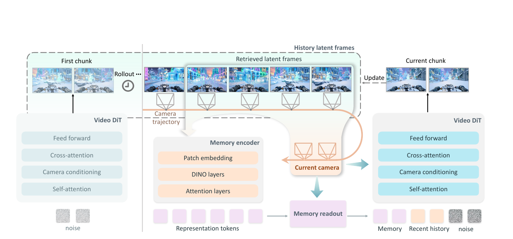
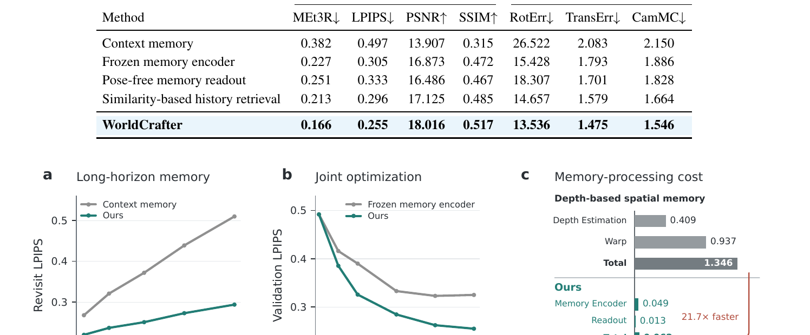

# WorldCrafter: Consistent Video World Model with Implicit 3D-aware Memory

**论文**: WorldCrafter: Consistent Video World Model with Implicit 3D-aware Memory
**作者**: Wangbo Yu\*, Kunhao Liu\*, Wenbo Hu†, Shenghai Yuan, Chaoran Feng, Haiyang Zhou, Yukun Huang, Yiran Wang, Wang Zhao, Yingmin Luo, Ying Shan
**机构**: ARC Lab, Tencent IEG + Peking University
**时间**: 2026-09-21
**代码**: [github.com/TencentARC/WorldCrafter](https://github.com/TencentARC/WorldCrafter)
**模型**: [huggingface.co/TencentARC/WorldCrafter-Fast](https://huggingface.co/TencentARC/WorldCrafter-Fast)

---

## 1. 一句话定位

用**隐式 3D-aware 记忆**（LagerNVS 初始化的 Memory Encoder + Pose-guided Readout）解决视频世界模型的长时重访一致性问题——不需要显式深度估计或几何 warping，在固定 token 预算内把所有历史观测压缩进一个 3D 感知的表示空间，按目标相机位姿检索出固定大小的 Memory 条件 DiT，LPIPS 比次优基线（Lyra 2.0）低 47.6%，延迟比深度方法快 21.7×。

---

## 2. 要解决的问题（动机）

视频世界模型做长时相机导航时，核心挑战是**重访一致性**：相机离开某区域后再回来，生成的内容应与初次访问一致（外观、结构、动态主体位置）。

现有记忆机制的三类局限：

| 记忆类型 | 代表方法 | 局限 |
|---------|---------|------|
| **Context memory** | HY-WorldPlay, DreamX-World | 把历史 latent/KV 直接拼入上下文，token 数随时间线性增长，无法固定预算 |
| **Spatial memory** | Alaya-EVOKE, Matrix-Game 3.5, Lyra 2.0 | 依赖深度估计 + 几何 warping，计算重，强几何约束限制动态场景的外观保真度 |
| **Implicit memory** | CaR, MemLearner | 不用深度，但没利用 3D 归纳偏置，检索时只能按相机 FoV 相似度排名（点对点，覆盖不全） |

WorldCrafter 的位置：**不估计深度、不做 warp，却通过预训练 3D 特征表示把 3D 感知能力"内化"进 Memory Encoder**，在同等 token 预算内比 context memory 覆盖更多历史，比 spatial memory 快 21.7× 且对动态场景无几何约束。

---

## 3. 与前作的关系

```
视频世界模型记忆机制谱系
│
├── Context memory
│   ├── HY-WorldPlay [62] — 相机相似度排 4 帧，PRoPE 相机控制
│   └── DreamX-World [16] — 通用交互世界模型
│
├── Spatial memory（显式几何）
│   ├── Alaya-EVOKE [88] — Pi3X 点云 + Sparse Teacher，90s 几何一致 [本仓库有笔记]
│   ├── Matrix-Game 3.5 [55] — VGGT-Ω 估计深度 + Warped PRoPE + patch 记忆 [本仓库有笔记]
│   └── Lyra 2.0 [60] — Alaya-EVOKE 同源，depth-aware spatial memory
│
├── Implicit memory（无显式几何）
│   ├── CaR [53] — 压缩历史 latent，relative-camera attention 检索
│   ├── MemLearner [91] — query token 同时 attend 历史上下文和 noisy prediction
│   └── **WorldCrafter** (本篇)
│       ├── LagerNVS 初始化 encoder：继承 3D 归纳偏置
│       ├── Pose-guided readout：目标相机查询，固定 token 数
│       └── Max-coverage FoV 检索：k 帧联合最大化目标区域覆盖
│
└── SANA-WM [104] — Gated DeltaNet 线性记忆 + UCPE 相机 + Plücker 射线
```

与 Matrix-Game 3.5 的关键差异（两篇均在本仓库）：Matrix-Game 3.5 在几何预测层面胜（用 VGGT-Ω 估计真实深度再 warp，位姿精度高），WorldCrafter 在外观保真度和延迟上胜（无 warping 无深度估计）。

---

## 4. 核心方法

### 4.1 整体架构

**推理方程**（Eq. 4，区别于纯 AR Eq. 3）：

$$
\frac{\mathrm{d}\mathbf{z}_t}{\mathrm{d}t} = \mathbf{v}_\theta\!\left(\mathbf{z}_t,\, t \;\middle|\; \mathbf{M},\, \mathbf{z}^r,\, \mathbf{C},\, \mathbf{y}\right)
$$

- `z_t`：当前 chunk 去噪 latent
- `M`：Memory 令牌（从历史帧读出，固定大小）
- `z^r`：最近窗口 history latent（固定长度滑窗）
- `C`：相机轨迹（目标每帧 c2w + 内参）
- `y`：文本条件

DiT 的拼接输入序列为 `[M; z^r; z_t]`，其中 M 和 z^r 通过三套独立 patch embedding 压缩（`patch_memory` / `patch_short` / `patch_mid`）后与 noisy latent token 合并送入 self-attention。



> **Fig 2 逐区域解读**：
>
> **左侧 First chunk**——初始 chunk 无历史，Video DiT 仅以文本条件 + 相机信号直接去噪生成第一段；生成完成后写入 history latent archive（虚线圈时钟符号）。
>
> **中间 Memory Encoder**——随着 rollout 推进，Memory Encoder 读取 retrieved latent frames（从 history archive 按 max-coverage FoV 选 k=8 帧）+ 对应 camera poses（相机轨迹箭头），通过三层（Patch embedding → DINO layers → Attention layers）生成 Representation tokens（紫色粗条）。这些 tokens 是 per-frame 的隐式 3D 表示，维度 R ∈ R^(|z^h|×L×d)。
>
> **Pose-guided readout / Current camera**——Memory readout 模块以当前相机位姿 C^q 为查询（橙色相机图标），从 Representation tokens 中提取固定大小的 Memory 令牌（粉色块），直接作为 DiT 的 token 序列一部分（self-attention 可见）。
>
> **右侧 Current chunk**——DiT 接收 [Memory | Recent history | noise] 三段拼接序列，联合去噪生成当前 chunk；生成结果写入 history archive（Update 箭头）。
>
> **关键设计**：Memory tokens 和 Recent context tokens 都在 self-attention 里被 noisy current tokens 直接 attend，不需要额外 cross-attention 层，对模型结构的改动极小。

### 4.2 Memory Encoder（核心）

**初始化来源**：从 LagerNVS（[63] Szymanowicz 等，CVPR 2026，latent 空间新视角合成）encoder 初始化，丢弃其浅层图像处理层，**新增 patch embedding 层**把 VAE latent 帧直接映射进表示空间。这样继承了 LagerNVS 在 novel-view synthesis 任务上学到的 3D 空间归纳偏置（几何 + 外观对应关系），而不需要自己从头学 3D。

**写入（memory writing）**：

$$
\mathbf{R} = \Phi(\mathbf{z}^h, \mathbf{C}^h) \in \mathbb{R}^{|\mathbf{z}^h| \times L \times d}
$$

Memory Encoder `Φ` 的计算路径（`repencoder/model.py`）：

```
source_latents [B, k, C, H, W]
    → InputLayer (patch embed + relative camera tokens)
    → DinoTail   (DINO backbone layers，bfloat16)
    → RepresentationBackbone (VGGT-style attention，即 LagerNVS 主干)
    → RepFeature (per-target-view feature aggregation，目标射线查询)
    → OutputLayer
    → memory tokens R [B, |z^h|, L, d]
```

注意：encoder 产出的 `L` 个 token/frame 是关于 per-history-latent-frame 的，`|z^h|` 随历史增长，但推理时严格限 k=8 帧输入（`HISTORY_SOURCE_BUDGET = 8`）。

**低秩分支（代码细节）**：`LowRankLinear` 和 `LowRankConv2d` 被 `inject_low_rank_branches` 注入 encoder，主体权重 bfloat16、低秩 LoRA 分量 float32，保持预训练精度同时允许 joint fine-tuning。代码路径：`repencoder/low_rank.py`。

**读出（memory readout，pose-guided）**：

$$
\mathbf{M} = \text{Readout}\!\left(\Phi(\mathbf{z}^s, \mathbf{C}^s),\, \mathbf{C}^q\right) \tag{7}
$$

- `C^q`：从即将生成的目标相机轨迹采样的 query poses
- Readout 用 LagerNVS shallow decoder 初始化，额外加 projection 层映射到 DiT token 空间
- 输出固定大小 M（等于 4 帧完整 token 数），与 history length 无关

**为什么 pose-guided 比 pose-free 好**：pose-free readout 平等对待所有历史信息，而 pose-guided 可以把固定 token 预算集中在与下一段生成最相关的历史区域，减少与生成无关 token 对 DiT 的干扰（Table 4 证实）。

### 4.3 Max-coverage 历史检索（关键算法）

在 inference 时，从全部 history archive 选 k-1=7 补充帧 + 最近 1 帧（recent local），使选出帧的**联合 FoV 最大化覆盖目标相机轨迹区域**。

算法核心（`repencoder/trajectory_fov.py`）：

```python
# target_frustum_visibility_masks()
# 对每个 target 帧的 frustum，均匀采样 10×10×10=1000 个 3D 点
z = linspace(near_m, far_m, 10)  # 深度方向
x, y = linspace(-1,1,10), linspace(-1,1,10)  # 视锥 xy
# 把 target 相机坐标系 3D 点变换到 world 坐标
points_world = R_target @ target_points + t_target
# 再变换到每个 source（候选历史帧）的相机坐标系
points_in_source = R_source_inv @ (points_world - t_source)
# 检查 source 视锥内可见性（深度 > 0 且 x/y 在 ±FoV/2 内）
visibility_mask[source_i, target_j] = fraction_of_1000_points_visible
```

贪心选帧：先选覆盖率最高单帧，再迭代选使**增量覆盖**（joint coverage 减已选帧 coverage）最大的帧，直到选满 k-1 帧。这是集合函数最大化的标准贪心近似（次模函数单调，贪心有 1-1/e 理论下界）。

与 similarity-based 排名的差异：pairwise FoV 相似度排名会选一堆相邻的重复视角，max-coverage 强制选**互补**视角。Table 4 实证：similarity-based → LPIPS 0.296，max-coverage → 0.255（14% 更好）。

### 4.4 四阶段训练

| 阶段 | 内容 | 数据 | 硬件 |
|------|------|------|------|
| Stage 1：基础适配 | Helios-base 推理窗口调整（去掉压缩 16 帧、保留 4 帧等价无压缩 history slot），随机选 4 帧填充 memory slot | OSP 760K 视频 | 32 GPU, batch=32, 5k iter |
| Stage 2：相机控制 | 加 UCPE 相机条件分支（冻结 DiT 主干），PRoPE 相对位姿 | 40K OSP + 6K DL3DV | 32 GPU, batch=128 |
| Stage 3：Memory Encoder 接入 | 加 LagerNVS 初始化 encoder + readout，适配 VAE latent 输入，冻结 DiT | DL3DV + OSP 子集 | 16 GPU, batch=16, 5k iter |
| Stage 4：全联合训练 | 所有组件联合优化（encoder + readout + DiT + 相机条件），加入 MIND 动态场景数据 | DL3DV + OSP + MIND 1k iter | 32 GPU, batch=32, 8k iter |

📌 Stage 4 全联合训练的关键意义：Fig 5(b) 显示 Frozen memory encoder 变体在 4k–8k 迭代后 validation LPIPS 停在 0.32，而 joint optimization 持续降到 0.25——说明 encoder 必须与 DiT token 空间 **共同适应（co-adapt）**，而不能先学好 encoder 再冻结。

### 4.5 蒸馏（WorldCrafter-fast）

沿用 Helios 的 **pyramid distillation**（粗到细，3 个分辨率各 2 步 DMD），加入 WorldCrafter 特有的双模型（low-noise + high-noise）策略：

- **Low-noise 模型**：从 Stage 4 完整 base model（只用 OSP+DL3DV）蒸馏，保持自然纹理质量
- **High-noise 模型**：加入 MIND 合成数据蒸馏，提升动态主体跟随能力
- **推理时**：low-noise 模型做最后一个去噪步，high-noise 做所有前序步

这种分工处理了合成数据（MIND）带来的纹理模糊问题：合成数据只参与 high-noise 阶段，不直接影响最终视觉细节。

---

## 5. 关键实验结果

### 5.1 重访一致性（Table 1）

745 段视频，每段包含闭环重访。越低的 MEt3R（Multi-View Consistency）和 LPIPS，越高的 PSNR/SSIM 越好。

| 方法 | MEt3R↓ | LPIPS↓ | PSNR↑ | SSIM↑ |
|------|--------|--------|-------|-------|
| DreamX-World | 0.548 | 0.627 | 12.898 | 0.243 |
| Alaya-EVOKE | 0.414 | 0.565 | 12.332 | 0.290 |
| HY-WorldPlay | 0.394 | 0.515 | 12.983 | 0.252 |
| Lyra 2.0 | 0.334 | 0.487 | 14.050 | 0.390 |
| Echo-WM | 0.449 | 0.582 | 12.592 | 0.239 |
| LingBot-World 2 | 0.492 | 0.633 | 10.449 | 0.219 |
| Matrix-Game 3.5 | 0.405 | 0.549 | 12.976 | 0.224 |
| SANA-WM | 0.397 | 0.553 | 13.142 | 0.246 |
| **WorldCrafter** | **0.166** | **0.255** | **18.016** | **0.517** |
| **WorldCrafter-fast** | **0.129** | **0.186** | **20.868** | **0.616** |

WorldCrafter-fast 比 WorldCrafter-base 还好（所有 4 指标），说明 pyramid distillation 的 low/high-noise 双模型策略额外提升了时序一致性（减少了帧间漂移）。

### 5.2 相机控制精度（Table 2）

| 方法 | RotErr↓ | TransErr↓ | CamMC↓ |
|------|---------|----------|--------|
| DreamX-World | 54.116 | 2.759 | 3.138 |
| Alaya-EVOKE | 26.042 | 2.042 | 2.199 |
| Lyra 2.0 | **16.145** | **1.538** | **1.624** |
| **WorldCrafter** | **13.536** | **1.475** | **1.546** |
| WorldCrafter-fast | 18.251 | 1.638 | 1.737 |

WorldCrafter-base 三项全胜，WorldCrafter-fast 稍差但仍排第三（蒸馏轻微牺牲相机精度换速度）。

### 5.3 视觉质量 VBench（Table 3）

WorldCrafter VBench Overall **81.910**（全榜第一），在 SC（主体一致）/ BC（背景一致）/ TF（时序流畅）/ MS（动作平滑）/ DD（动态度）5 个维度拿第一。AQ 和 IQ 分别排第 4 和第 5（视觉美观度略逊于 SANA-WM 和 Echo-WM）。



> **Fig 5 逐区域解读**：
>
> **上方 Table 4（消融对照表）**——共 4 个消融变体 vs WorldCrafter full：(1) Context memory（用 4 帧 retrieved latent 直接拼，无 encoder）LPIPS 0.382 vs 0.255，最差；(2) Frozen memory encoder（encoder 不参与 joint 训练）0.305；(3) Pose-free memory readout 0.333；(4) Similarity-based retrieval 0.296；Full WorldCrafter 0.166/0.255 全面领先。
>
> **图 (a) Long-horizon memory**——横轴是 revisit interval（帧数），纵轴是 revisit LPIPS。绿色线（WorldCrafter）在所有区间都低于灰色线（Context memory），且两者的差距随 interval 增大而**拉大**——WorldCrafter 在 360 帧内仍保持 LPIPS 0.2–0.3，而 context memory 到 1360 帧已爆到 0.5+ 。这正是论文声称的"隐式 3D 记忆不随距离退化"的直观证据。
>
> **图 (b) Joint optimization**——横轴 training iter，纵轴 validation LPIPS。两条线起点相同（冻结 encoder 和 joint 初始损失一样大），但 joint（绿）持续下降到 ~0.25，frozen（灰）约 2k 步后停在 ~0.32，5k 步后几乎平台。说明 encoder 必须与 DiT jointly co-adapt，不能一次性预训练固定。
>
> **图 (c) Memory-processing cost**——水平条形图对比 Depth-based spatial memory（深度估计 0.409s + warping 0.937s = 1.346s/chunk）vs WorldCrafter（Memory Encoder 0.049s + Readout 0.013s = 0.062s/chunk），红线标注 **21.7× faster**。两方法 GPU 配置、batch size 均相同，分辨率 640×384。

---

## 6. 代码走读

### 6.1 目录结构

```
worldcrafter/
├── repencoder/           ← Memory Encoder + 历史检索
│   ├── model.py          ← RepEncoder 主类，forward_conditioned()
│   ├── trajectory_memory_provider.py  ← max-coverage 检索 orchestration
│   ├── trajectory_fov.py ← FoV frustum 可见性计算（核心几何逻辑）
│   ├── vggt/             ← LagerNVS 主干（DinoTail + RepresentationBackbone）
│   ├── repfeature/       ← target-view 特征聚合（target rays → memory tokens）
│   ├── input_layer.py    ← latent patch embed + relative camera tokens
│   ├── output_layer.py   ← token → DiT 兼容维度
│   └── low_rank.py       ← LowRankLinear/Conv2d，LoRA 式 fine-tuning
├── diffusers/
│   ├── transformer.py    ← WorldCrafterTransformer DiT（含 patch_memory/short/mid）
│   ├── pipeline.py       ← 推理 pipeline
│   └── scheduler.py      ← 去噪调度
├── camera.py             ← PRoPE 相机编码
├── ucpe/                 ← UCPE 相机条件分支
├── streaming.py          ← 流式 AR rollout 逻辑
└── inference.py          ← 单步推理入口
```

### 6.2 关键代码路径

**Memory Encoder forward**（`repencoder/model.py:forward_conditioned()`）：

```python
# 输入形状严格检查
# source_latents:  [B, config.source_views(=9), C, H, W]
# source_camera_tokens: [B, 9, 11]
# target_rays:     [B, config.target_views(=4), 6, 48, 80]

with torch.autocast("cuda", dtype=torch.bfloat16):
    input_features = self.input_layer(source_latents)     # latent patch embed
    dino_features  = self.dino_tail(input_features)        # DINO backbone
    scene          = self.vggt(dino_features, source_camera_tokens)  # 3D representation
    target_features = self.repfeature(scene, target_rays, ...)        # target view query
    memory4        = self.output_layer(target_features)    # [B, L*d] memory tokens
```

📌 `target_rays` 维度 6 = 3（射线起点）+ 3（射线方向），由目标相机内参 + 位姿计算得到，是 pose-guided readout 的几何 query。

**Max-coverage FoV 检索**（`repencoder/trajectory_fov.py`）：

```python
# target_frustum_visibility_masks()
# 在 target 相机 frustum 内均匀采 10^3 = 1000 个 3D 点
# 对每个候选 source 帧检查：这 1000 点有多少在 source 视锥内可见？
# visibility_mask[S, T] = float in [0,1]

# select_trajectory_fov_history() 贪心最大化 union coverage:
# while len(selected) < budget:
#     next = argmax_{c ∉ selected} union_coverage(selected ∪ {c})
```

**DiT 三路 patch embedding**（`diffusers/transformer.py:WorldCrafterTransformer`）：

```python
self.patch_short  = nn.Conv3d(...)  # recent context (2-frame sliding window)
self.patch_mid    = nn.Conv3d(... stride=2×patch_size ...)  # 降采样中期历史
self.patch_memory = nn.Conv3d(...)  # long-term memory tokens from RepEncoder
# forward 中三路分别 embed 后 concat 送 self-attention
```

### 6.3 推理关键配置

| 参数 | 值 | 含义 |
|------|----|------|
| `HISTORY_SOURCE_BUDGET` | 8 | Memory Encoder 最多接受 k=8 帧 history |
| `TARGET_SLOTS` | (2,4,6,8) | 内存 token 填充的 frame slot 位置 |
| `NUM_LATENT_FRAMES_PER_CHUNK` | 9 | 每 chunk 9 帧 latent |
| `VAE_SCALE_FACTOR_TEMPORAL` | 4 | VAE 时序压缩比（9 latent → 36 RGB frames） |
| FoV `samples_per_axis` | 10 | frustum 可见性采样 10×10×10 = 1000 点 |
| `near_zero_baseline_m` | 0.05 | 相机基线 ≤5cm 时视为同视角（抑制近零基线噪声） |

---

## 7. 争议与权衡

| 维度 | 现状 |
|------|------|
| **每 chunk 全量重编码** | 每步都对整个历史（最多 8 帧）重新运行 Memory Encoder，不是增量更新；论文承认这是待改进点（future work：autoregressive streaming memory encoder） |
| **k=8 的预算上限** | 超过 8 帧历史就要按 max-coverage 丢弃，长轨迹中有信息损失；但 21.7× 的延迟优势来自这个固定预算 |
| **Benchmark 自建** | 145 张初始图 + 每图 5 条 metric 相机轨迹 = 725 条视频，作者自建，未经第三方独立验证；轨迹 FoV 重叠程度、难度分布未报告 |
| **动态场景的 MEt3R 评估** | 论文承认 MEt3R（multi-view consistency）在动态场景里有固有噪声，但 WorldCrafter 的 MEt3R 仍全榜最优说明动态场景里隐式记忆对动态主体的外观保持也有帮助 |
| **WorldCrafter-fast 重访比 base 好** | 蒸馏模型的重访一致性反超 base（LPIPS 0.186 vs 0.255）——说明 pyramid distillation 的自回归 rollout 训练额外消除了 base 在 AR rollout 中的误差累积，而非单纯速度-质量 tradeoff |
| **VBench AQ/IQ 不是第一** | Aesthetic Quality（61.432）和 Imaging Quality（69.058）分别排第 4、5，SANA-WM 和 Echo-WM 更高；说明隐式记忆增强了一致性但对单帧视觉美感无直接帮助 |
| **相机精度 vs 空间记忆方法** | Matrix-Game 3.5 RotErr 19.881（WorldCrafter 13.536），Matrix-Game 3.5 用 VGGT-Ω 真实深度做 warp 但相机精度反而不如 WorldCrafter 的纯学习式记忆，说明 warp 步骤不稳定 |

---

## 8. 一句话总结

WorldCrafter 用 LagerNVS 初始化的 Memory Encoder + Pose-guided Readout 把历史观测内化为隐式 3D 感知表示，借助 max-coverage FoV 贪心检索和 joint 训练，在无需深度估计/几何 warping 的前提下把长时重访 LPIPS 从次优基线 0.487 降到 0.255（WorldCrafter-fast 0.186），相机控制精度全榜第一，内存处理延迟 21.7× 快于空间记忆方法，代价是每步全量重编码历史（非增量流式）。

---

## Q&A

