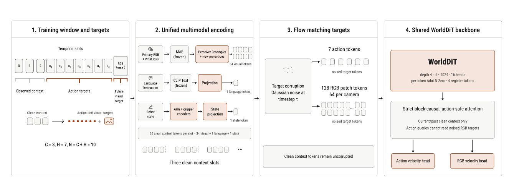
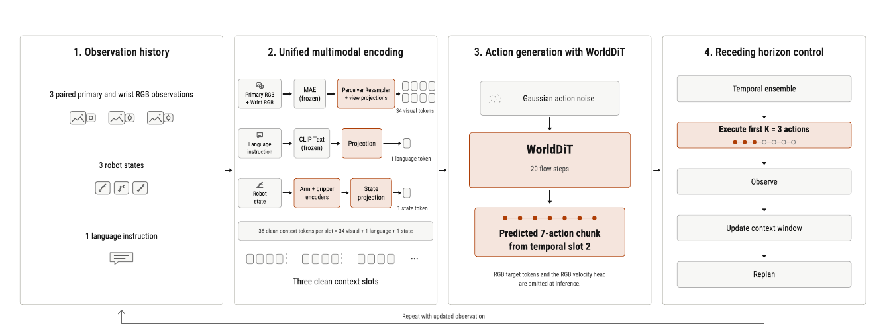
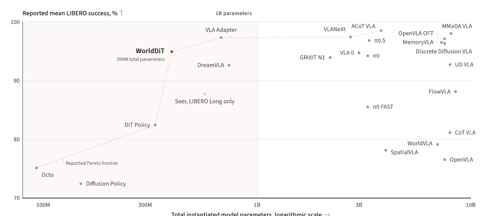

# WorldDiT: A Unified Diffusion Architecture for World and Action Modeling

- **机构**:Bagel Labs
- **时间**:2026-07-31,arXiv:2607.23909v2(cs.LG)
- **权重**:🤗 [`bageldotcom/worlddit`](https://huggingface.co/bageldotcom/worlddit),**CC-BY-4.0**,含四个 LIBERO suite 的 checkpoint + 冻结编码器 + 评测脚本(实测约 266 下载 / 9 likes,无 GitHub 仓库)
- **规模**:**399.084M 总参数 / 135.107M 可训练参数**

---

## 1. 一句话定位

**用一个 4 层、d=1024 的共享 DiT,同时干"生成连续动作"和"预测未来 RGB patch"两件事,不用任何大型预训练 VLM 当动作骨干,在 LIBERO 四个 suite 上拿到 94.9% 平均成功率。**

它挑战的是当前 VLA 的默认范式 —— 把动作生成挂在一个几十亿参数的 VLM 上。WorldDiT 想说明的是:**在 10 亿参数以下,强控制性能是可以在不依赖大 VLM 的前提下达到的**,并且给出一个 sub-billion 的 Pareto 基线。

📌 **但必须先说清两件事**(详见 §7):(1) 论文自己承认报告的 94.9% **不是无偏测试估计** —— 500 个 episode 里有 300 个参与了 checkpoint 选择;(2) **全文没有任何消融** —— 那个作为核心卖点的"未来 RGB 预测"辅助目标,从未被单独验证过有效。

---

## 2. 要解决的问题(动机)

主流机器人策略沿用了语言建模的套路:**把动作生成挂到一个大型预训练模型上**。这带来了广泛的感知和语言理解,但也**让规模与架构的贡献变得无法分离** —— 当一个策略有几十亿参数时,强控制到底来自动作设计、来自预训练骨干,还是来自两者的组合?

论文提的问题很干净:**一个统一的扩散 transformer,能不能把连续动作生成和一个辅助的未来视觉预测目标结合起来,在不使用大型 VLM 当动作骨干的情况下保持强控制性能?**

---

## 3. 与前作的关系

论文把 LIBERO 上的 24 个方法明确分成两组:

| 组 | 代表(按 Mean 降序) | Mean |
|---|---|---|
| **用大 VLM 当动作骨干** | ACoT VLA 98.5、MMaDA VLA 98.0、VLANeXt 97.4、VLA Adapter 97.3、OpenVLA OFT 97.1、π0.5 96.9、MemoryVLA 96.7、Discrete Diffusion VLA 96.3、VLA 0 94.7、π0 94.2、GR00T N1 93.9、UD VLA 92.7、π0 FAST 85.5、CoT VLA 83.9、WorldVLA 79.1、SpatialVLA 78.1、OpenVLA 76.5 | — |
| **不用大 VLM** | **WorldDiT 94.9**、DreamVLA 92.6、FlowVLA 88.1、DiT Policy 82.4、Octo 75.1、Diffusion Policy 72.4、Seer(仅 Long 87.7) | — |

**Incremental claim** 有三条,论文自己列的:
1. 一个**统一的扩散 transformer 架构**,同时做动作生成和未来归一化 RGB patch 预测
2. 一种**训练/部署分离的设计**:RGB patch 预测在训练时提供监督,**推理时完全不存在**
3. 报告结果刻画了**十亿参数以下**参数量与平均成功率的权衡

与 DreamVLA(同为"不用大 VLM"组的第二名,92.6)最接近 —— 都在动作之外加视觉预测目标。WorldDiT 的差异是**用同一个 backbone 而非独立的 dream 分支**,且**推理时把视觉路径整个摘掉**。

---

## 4. 核心算法 / 方法

### 4.1 数据窗口与两类目标

一个从下标 `u` 开始的 `N` 步轨迹段:

$$
\mathcal{W}_u = \bigl\{(\mathbf{o}_i, \mathbf{s}_i, \mathbf{a}_i)\bigr\}_{i=u}^{u+N-1}, \qquad
\mathbf{o}_i = \bigl(I_i^{\mathrm{p}},\, I_i^{\mathrm{w}}\bigr)
$$

`I^p` 是主相机图像,`I^w` 是腕部相机图像,`s_i` 是机器人状态,`a_i ∈ R^{d_a}` 是动作。语言指令 `ℓ` 在整段共享。

前 `C` 步构成观测上下文,记 `i = u + C − 1` 为最后一个被观测步(也就是当前控制步),位置 `i` 处可用的历史是

$$
\mathcal{H}_i = \Bigl(\ell,\ \bigl\{(\mathbf{o}_j, \mathbf{s}_j)\bigr\}_{j=u}^{i}\Bigr)
$$

**目标一 —— `H` 步动作 chunk**:

$$
\mathbf{A}_i = [\mathbf{a}_i, \mathbf{a}_{i+1}, \dots, \mathbf{a}_{i+H-1}] \in \mathbb{R}^{H \times d_a}
$$

**目标二 —— 未来归一化 RGB patch**:取时间偏移 `H` 处的主相机和腕部相机帧。每张经 CLIP 预处理的 `224×224` 帧切成 `16×16` 的 patch;**每个 768 维 patch 向量用它自己的均值和方差归一化**;每个相机**只保留 64 个均匀间隔的 patch**。两个相机拼接:

$$
\mathbf{Y}^{\mathrm{rgb}}_i \in \mathbb{R}^{128 \times 768}
$$

📌 **这个目标的构造方式值得逐条掰开看,因为它决定了"world model"这个词有多少含金量**:
- `224/16 = 14`,即每张图共 `14×14 = 196` 个 patch,**只保留 64 个**(约 1/3)
- **每个 patch 用自己的均值方差归一化** —— 这抹掉了 patch 之间的亮度/对比度关系,也抹掉了全局外观
- **损失只施加在最后一个时间 slot 上**,其 RGB 目标来自 `i+H` 帧

所以它预测的不是"未来长什么样",而是"未来某一帧的 1/3 个 patch 各自去均值归一化后的局部纹理结构"。**这更像一个特征预测的辅助正则,而不是一个真正的世界模型。**

### 4.2 统一编码与 backbone

> **Fig 3 逐面板解读**:四个面板从左到右是训练时的完整数据流。**注意配色约定:灰白框 = Frozen pretrained,橙色框 = Trainable**(图例在图下方),这个区分是理解 135M/399M 参数比的关键。
>
> **面板 1 — Training window and targets**:顶部 "Temporal slots" 是一排 10 个格子,编号 `0 1 2` 之后是 `a₃ a₄ a₅ a₆ a₇ a₈ a₉`,最右边是 `RGB frame 9`。下方三个括号标出三段:
> - **Observed context**(格子 0–2)—— 3 步观测
> - **Action targets**(a₃–a₉)—— 7 步动作,用橙色括号标出
> - **Future visual target**(最右)—— 单个 RGB 目标
>
> 再下面一行用图示重复了一遍:三个空心方块(Clean context)→ 一串橙色圆点(动作目标)+ 一个小图标(视觉目标)。底部公式 **`C = 3, H = 7, N = C + H = 10`** 把这三个数钉死。**关键信息:动作目标有 7 个时间步,视觉目标只有 1 个,且在窗口最末端。**
>
> **面板 2 — Unified multimodal encoding**:三条并行的编码链,每条都是"输入 → 冻结编码器 → 可训练投影 → token"。
> - **视觉链**:`Primary RGB + Wrist RGB` → **MAE(frozen,灰)** → **Perceiver Resampler + view projections(trainable,橙)** → **34 visual tokens**。注意 Perceiver Resampler 是**共享的**,两个视角共用一套 resampler 加各自的 view projection。
> - **语言链**:`Language instruction` → **CLIP Text(frozen,灰)** → **Projection(trainable,橙)** → **1 language token**。整段轨迹只有 1 个语言 token,极度压缩。
> - **状态链**:`Robot state` → **Arm + gripper encoders(trainable,橙)** → **State projection(trainable,橙)** → **1 state token**。**手臂和夹爪是分开编码再拼接的**,不是当成一个 7 维向量硬塞。
>
> 底部灰条给出总账:**`36 clean context tokens per slot = 34 visual + 1 language + 1 state`**,再下面画了三组小方块表示 **Three clean context slots**(对应 C=3)。
>
> **面板 3 — Flow matching targets**:左边一个方框 "Target corruption / Gaussian noise at timestep τ",两条箭头分出去:
> - 上路 **7 action tokens** → 一排 7 个 "noised target tokens"
> - 下路 **128 RGB patch tokens(64 per camera)** → 两排共 128 个 "noised target tokens"
>
> 面板底部单独一个灰框:**"Clean context tokens remain uncorrupted"** —— 这句是整张图最容易漏但最重要的约束:**加噪只作用在目标上,上下文 token 始终是干净的**。
>
> **面板 4 — Shared WorldDiT backbone**:顶部橙色大框写着 **WorldDiT / depth 4 · d = 1024 · 16 heads / per-token AdaLN-Zero · 4 register tokens**。往下是灰框 **"Strict block-causal, action-safe attention"**,里面两行小字:
> - *Current/past clean context only* —— 只能看当前和过去的干净上下文
> - ***Action queries cannot read noised RGB targets*** —— **动作 query 读不到被加噪的 RGB 目标**
>
> 最下面分叉出两个橙色头:**Action velocity head** 和 **RGB velocity head**。
>
> 📌 **"action-safe" 这个约束是整个设计的枢纽**:如果动作能看到被加噪的 RGB 目标,那么推理时把 RGB 路径摘掉就会造成训练-推理不一致(动作 query 突然少了一部分 KV)。**正因为动作从来就看不到 RGB 目标,推理时整条视觉预测路径可以被无损删除** —— 这就是"训练时有监督、推理时不存在"能成立的技术前提。

RGB patch 进 backbone 前有一个**可训练的线性输入投影**把 768 维 patch 映到 backbone 隐维,输出端有一个**可训练的 RGB 输出投影**映回 768 维 patch velocity。论文特别强调:**这两个投影只定义模型接口,不改变监督目标本身**(目标仍是归一化 RGB patch 向量)。

### 4.3 Flow matching 训练目标

对动作目标或未来 RGB patch 目标,令 `ε ~ N(0,I)`、`y` 为干净目标、`τ ~ U[0,1]`:

$$
\mathbf{x}_\tau = (1-\tau)\boldsymbol{\epsilon} + \tau \mathbf{y}
$$

$$
\mathcal{L}_{\mathrm{flow}} = \mathbb{E}_{\boldsymbol{\epsilon}, \mathbf{y}, \tau}\Bigl[\bigl\lVert v_\theta(\mathbf{x}_\tau, \tau, c) - (\mathbf{y} - \boldsymbol{\epsilon}) \bigr\rVert_2^2\Bigr]
$$

总损失是两个 velocity 损失的加权和:

$$
\mathcal{L}_{\mathrm{total}} = w_{\mathrm{action}} \mathcal{L}^{\mathrm{action}}_{\mathrm{flow}} + w_{\mathrm{rgb}} \mathcal{L}^{\mathrm{rgb}}_{\mathrm{flow}}
$$

📌 **权重是 `w_action = 0.1`、`w_rgb = 0.001`,相差 100 倍。**结合 §4.1 里那个被削到 1/3 且逐 patch 白化的目标,可以判断:**这个辅助目标在实际梯度里的分量非常小,定位是轻量正则而非主训练信号。**这也让"没做消融"这件事更可疑 —— 一个 100× 降权的辅助损失,到底贡献了多少?

### 4.4 推理

> **Fig 4 逐面板解读**:同样四个面板,但和 Fig 3 对比着看才有意义 —— **面板 1、2 几乎完全相同,面板 3、4 完全不同**。
>
> **面板 1 — Observation history**:列出推理时的三样输入:**3 paired primary and wrist RGB observations**(三对图标)、**3 robot states**、**1 language instruction**。**没有任何未来信息** —— 对照 Fig 3 面板 1 那排 `a₃…a₉` 和 `RGB frame 9`,这里全部消失。
>
> **面板 2 — Unified multimodal encoding**:与 Fig 3 面板 2 **逐像素相同** —— 同样的 MAE / CLIP Text / arm+gripper 三条链,同样的 34+1+1=36 token/slot,同样的三个 clean context slot。**这种"训练与推理共用同一条编码路径"正是设计目标之一**,论文明确写了 "The same multimodal encoding path used during training maps `H_t` to the conditioning representation `G_t`"。
>
> **面板 3 — Action generation with WorldDiT**:自上而下三块:
> - **Gaussian action noise**(灰框,带噪点纹理)
> - **WorldDiT / 20 flow steps**(橙色大框)—— 注意这里标的是 **20 步**,是推理时的 Euler 积分步数
> - **Predicted 7-action chunk from temporal slot 2**(橙框,里面画了 7 个橙色圆点连成一串)—— "temporal slot 2" 就是 `C−1 = 2`,即最后一个被观测的 slot
>
> 面板底部一行小字是关键:***"RGB target tokens and the RGB velocity head are omitted at inference."*** —— **对照 Fig 3 面板 3 那 128 个 RGB noised token 和面板 4 的 RGB velocity head,这里全部消失了。**
>
> **面板 4 — Receding horizon control**:一条竖直的闭环流程:
> - **Temporal ensemble** —— 对重叠的绝对时间动作预测做时序集成
> - **Execute first K = 3 actions**(橙色高亮框,里面画了 7 个圆点但**只有前 3 个是实心橙色,后 4 个是空心**)—— 这个视觉细节直接表达了"预测 7 步只执行 3 步"
> - **Observe** → **Update context window** → **Replan**
>
> 面板底部有一条长箭头绕回面板 1,标注 **"Repeat with updated observation"**,闭合整个控制环。
>
> 📌 **7 预测 / 3 执行 = 2.33× 的重叠冗余**,这是 temporal ensemble 能工作的前提:同一个绝对时刻会被相邻的多次规划各预测一遍,平均掉可以降低单次采样的方差。代价是**每 3 步就要重新跑一次 20 步 flow 积分**。

形式化:部署时 backbone 收到以当前控制步 `t` 结尾的 `C` 步历史

$$
\mathcal{H}_t = \Bigl(\ell,\ \bigl\{(\mathbf{o}_j, \mathbf{s}_j)\bigr\}_{j=t-C+1}^{t}\Bigr)
$$

从高斯噪声起步 `x^act_{t,0} ~ N(0,I)`,积分学到的动作速度场:

$$
\frac{d\mathbf{x}^{\mathrm{act}}_{t,\tau}}{d\tau} = v^{\mathrm{act}}_\theta\bigl(\mathbf{x}^{\mathrm{act}}_{t,\tau}, \tau, \mathbf{G}_t\bigr), \qquad \tau \in [0,1]
$$

经 `T_samp = 20` 步 Euler(`x_{τ+Δτ} = x_τ + Δτ v_θ(x_τ, τ, c)`)后

$$
\widehat{\mathbf{A}}_t = \mathbf{x}^{\mathrm{act}}_{t,1} \in \mathbb{R}^{H \times d_a}
$$

执行 `Â_t` 的前 `K=3` 个动作,更新历史,重新规划。

---

## 5. 关键代码位置

**无 GitHub 仓库**,但 HuggingFace 上放了完整的可跑物料:

| 内容 | 位置 |
|---|---|
| 四个 LIBERO suite 的 checkpoint | 🤗 `bageldotcom/worlddit` |
| 冻结视觉编码器 | **MAE ViT-B** |
| 冻结文本编码器 | **OpenAI CLIP ViT-B/32** |
| 评测脚本 + 推理 runtime | 同仓库 |
| 许可 | **CC-BY-4.0** |

---

## 6. 关键配置项

### 架构

| 项 | 值 |
|---|---|
| Backbone | **depth 4,hidden 1024,16 heads** |
| 调制 | per-token **AdaLN-Zero** |
| Register token | **4** |
| 上下文步数 `C` | **3** |
| 动作 chunk `H` | **7**,`A_i ∈ R^{7×7}`(即 `d_a = 7`,6 DoF 臂 + 1 夹爪) |
| 训练窗口 `N` | **10** = C + H |
| 每 slot token | **36** = 34 visual + 1 language + 1 state |
| RGB 目标 token | **128** = 64/相机 × 2 相机,每个 768 维 |
| 参数量 | **399.084M 总 / 135.107M 可训练** |

### 训练

| 阶段 | 配置 |
|---|---|
| **预训练** | `libero_90` 多任务 split,**30 epoch**,per-GPU batch **40**,grad accum **2**,lr **1e-4** cosine,**1 warmup epoch** |
| **微调** | **每个下游 suite 独立微调**,effective batch **512**(per-GPU 32 × grad accum 2 × 8 GPU),lr **1e-4**,**bf16** |
| 损失权重 | action **0.1**,RGB patch **0.001** |
| 硬件 | 单节点 **8 × RTX Pro 6000** |

### 评测

| 项 | 值 |
|---|---|
| Benchmark | LIBERO 四个 suite:`libero_spatial` / `libero_object` / `libero_goal` / `libero_10`(报告为 LIBERO Long) |
| 每 suite episode 数 | **500** |
| 推理积分 | **20 步 Euler**,τ: 0→1 |
| 执行策略 | 预测 7 步,执行前 **3** 步,**temporal ensembling** |
| 渲染 | headless EGL |

---

## 7. 争议 / 权衡

### 7.1 📌 报告的 94.9% 不是无偏测试估计 —— 论文自己说的

原文:*"The aggregate includes 300 episodes per suite used during staged checkpoint selection. It is therefore not fully held out, and the reported 94.9% should not be interpreted as an unbiased test estimate."*

**500 个 episode 里有 300 个(60%)参与了分阶段 checkpoint 选择。**这意味着报告数字里有相当比例是"在自己调过参的数据上测的"。

这个披露是诚实的、值得肯定的,但它的后果必须说清楚:**94.9% 与表中其他方法的数字不可直接比较**,因为其他方法未必有同样的污染,也未必没有。真实的 held-out 性能应该在 200 个干净 episode 上看,但论文没有单独报这个数。

**读这张表时,把 WorldDiT 的 94.9% 当成上界而不是点估计。**

### 7.2 📌 没有任何消融 —— 核心卖点从未被验证

论文的标题、摘要、贡献列表都围绕"**统一的动作生成 + 未来视觉预测**"。但全文**没有一个实验回答"去掉 RGB patch 目标会怎样"**。

缺失的对照组至少有三个:
1. 同架构、同参数量、**只训动作**(`w_rgb = 0`)
2. 同架构、RGB 目标不做逐 patch 归一化
3. 同架构、保留全部 196 patch 而非 64 个

考虑到 §4.3 里 RGB 损失被 **100× 降权**、目标被削到 1/3 且逐 patch 白化,一个完全合理的替代解释是:**这个辅助目标贡献接近于零,94.9% 主要来自 flow-matching 动作头 + action chunking + temporal ensembling 这套已被 π0 / Diffusion Policy 验证过的组合。**

论文无法排除这个解释。**这是全文最大的科学缺口。**

### 7.3 Pareto 主张成立,但范围很窄

> **Fig 1 逐区域解读**:横轴是**总实例化参数量(对数尺度)**,从 100M 到 10B;纵轴是**报告的 LIBERO 平均成功率(%)**,从 70 到 100。图中有一条竖线标在 **1B parameters** 处,把画面分成左右两块,左半部分底色是淡粉色 —— **这块淡粉区就是论文真正主张的领地**。
>
> **左下角起点**:**Octo**(约 93M,75.1)和 **Diffusion Policy**(约 170M,72.4)。Diffusion Policy 明显在 Octo 下方,不在前沿上。
>
> **前沿折线**:一条细灰线从 Octo 出发,经 **DiT Policy**(约 320M,82.4)**陡峭上升**到 **WorldDiT**(399M,94.9,**红色实心点 + 加粗标签 + "399M total parameters" 注释**),再上升到 **VLA Adapter**(约 600M,97.3),然后**几乎水平**地向右延伸,经 VLANeXt、ACoT VLA 到 MMaDA VLA。
>
> 📌 **这条折线的形状本身就是全文最强的论据**:从 DiT Policy(320M)到 WorldDiT(399M),**参数只涨 25%,成功率涨 12.5 个点** —— 这一段的斜率是全图最陡的。而从 VLA Adapter(600M)到 MMaDA VLA(约 7B),**参数涨了十倍以上,成功率只涨 0.7 个点**。
>
> **未落在前沿上的点**:
> - **DreamVLA**(约 700M,92.6)—— 就在 WorldDiT 右下方,**参数更多、成绩更差**,这是 WorldDiT 最直接的对照
> - **Seer**(空心点,标注 "LIBERO Long only",87.7)—— 空心表示它**只有 Long 一个 suite 的成绩**,因此被排除在 Pareto 计算之外
> - **右下角一大片**:WorldVLA(79.1)、SpatialVLA(78.1)、OpenVLA(76.5)、CoT VLA(83.9)全在 3B–10B 区间却低于 85 —— **这些点的存在说明"参数多"本身完全不保证性能**
>
> **右上角密集区**:MMaDA VLA、OpenVLA OFT、MemoryVLA、Discrete Diffusion VLA、ACoT VLA 挤在 96–98.5 之间,横跨 3B–10B。**它们全都比 WorldDiT 好,但代价是 10–20× 的参数。**

论文的原话是:*"every method with a higher reported success value uses more total parameters, while every other method at or below the WorldDiT parameter count reports lower success."*

**这句话字面成立,但边界要说清**:
- 前沿在 1B 以下只有 **4 个点**(Octo / DiT Policy / WorldDiT / VLA Adapter),样本极稀
- **VLA Adapter 在约 600M 就拿到 97.3**,比 WorldDiT 高 2.4 个点,参数只多 50%。所以 WorldDiT 不是"小模型的最优解",只是"**399M 这个具体点位上的最优解**"
- 与最好的 ACoT VLA(98.5)差 **3.6 个点**,参数少约 20×

### 7.4 "World model" 这个词用得偏宽

如 §4.1 所述,所谓"世界建模"是:预测**单帧、1/3 patch、逐 patch 白化**的 RGB 表示,权重 0.001,且**推理时整条路径被删除**。

对照真正的视频世界模型(本仓库的 [EVOKE](../evoke/analysis.md) 要维护点云状态库并生成 90 秒几何一致视频),WorldDiT 的"world" 更接近于**一个 representation-alignment 风格的辅助损失**。论文没有做任何"世界模型能力"的评测(不 rollout 未来帧、不测预测精度、不测反事实)。

**这不影响结果本身的有效性,但影响这篇论文在 world model 谱系里的定位** —— 它本质上是一篇 VLA policy 论文。

### 7.5 每个 suite 独立微调 = 四个模型

论文写的是 *"we fine-tune the pretrained `libero_90` checkpoint **independently on each downstream suite**"*,以及 *"We evaluate **one WorldDiT configuration**, fine-tuned separately for each of four suites"*。

**"一个配置"≠"一个模型"** —— 实际是 4 个 checkpoint(HF 仓库里确实有四个)。这在 LIBERO 上是常见做法,不算违规,但**它排除了任何跨 suite 泛化的主张**。

### 7.6 全部基线来自引用报告,协议不统一

论文明说:*"The incomplete public availability of model weights and training code prevents us from reproducing every compared method under a shared protocol. We therefore use scores from the cited reports."*,并且**把重构的参数量标为近似值**。

所以 Fig 1 是一张**跨协议拼装的散点图**:每个点的 episode 数、渲染后端、动作集成策略、是否 per-suite 微调都可能不同。**它适合看趋势,不适合看排名。**

### 7.7 其他限制

| 问题 | 说明 |
|---|---|
| **只在 LIBERO 仿真上验证** | 无真机实验,无其他 benchmark。LIBERO 的 sim-to-real gap 未触及 |
| **只有一个配置** | 论文明确说这是 *"a baseline for future scaling studies rather than evidence of scaling behavior"* —— 不做任何 scaling 主张 |
| **backbone 极小,大头是冻结编码器** | depth 4 / d=1024 的 transformer 大约只有几十 M;399M 里绝大部分是 MAE ViT-B + CLIP ViT-B/32。论文对此是透明的("including frozen modules required at inference"),但读者容易误以为 399M 都是"学出来的容量" |
| **Long suite 明显偏弱** | 91.8 vs Spatial 98.0,差 6.2 个点。论文归因于 Long 任务需要"扩展的多阶段行为"。这恰恰是**世界模型本应帮上忙的地方** —— 而它没帮上,反过来又给 §7.2 的质疑添了一分 |
| **推理成本** | 每 3 个动作重跑一次 20 步 Euler 积分。论文未报告控制频率或单步延迟 |

### 7.8 值得肯定的地方

抛开上面这些,有两点设计是干净且可复用的:

1. **action-safe attention 让"训练有、推理无"真正无损**。因为动作 query 从设计上就读不到 noised RGB token,推理时删掉整条视觉路径**不改变动作 query 看到的任何 KV**。很多"训练加辅助任务"的工作在这一点上是含糊的,这篇是明确的。
2. **arm 与 gripper 分开编码再拼接**。把 7 维动作里语义完全不同的两部分(连续位姿 vs 二值/近二值开合)分开建模,是个小但正确的选择。

---

## 8. 一句话总结

**一个 4 层、d=1024 的共享 DiT,用 flow matching 同时回归 7 步动作和未来单帧 1/3 的白化 RGB patch,推理时把视觉路径整条摘掉(靠 action-safe attention 保证无损),399M 参数在 LIBERO 拿到 94.9% 并落在 sub-billion Pareto 前沿 —— 但报告数字含 60% 非 held-out episode,且那个作为标题卖点的世界建模目标从头到尾没做过一次消融。**

---

## Q&A

<!-- 后续对话中产生的有价值问答追加到这里 -->
