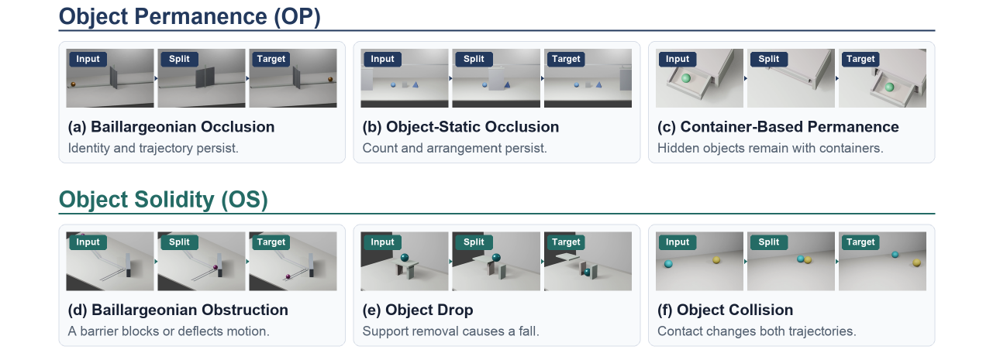
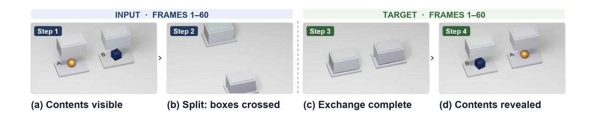
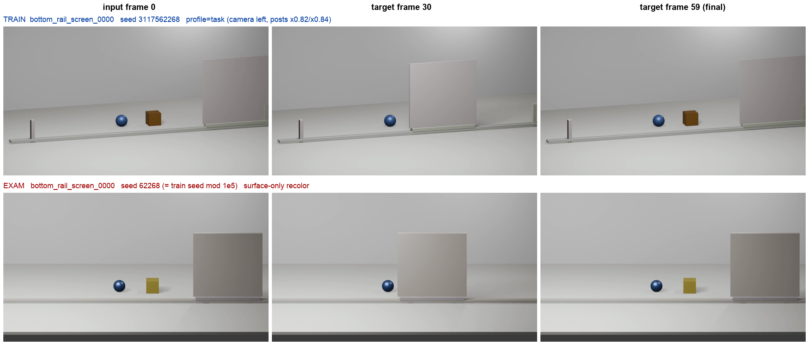
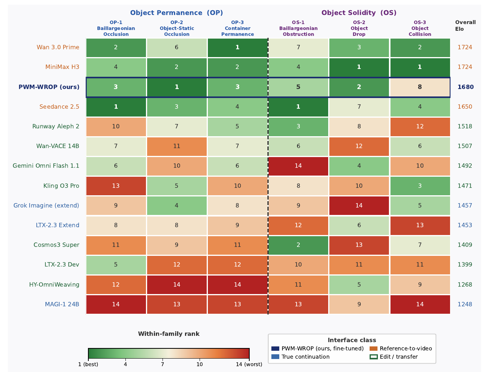
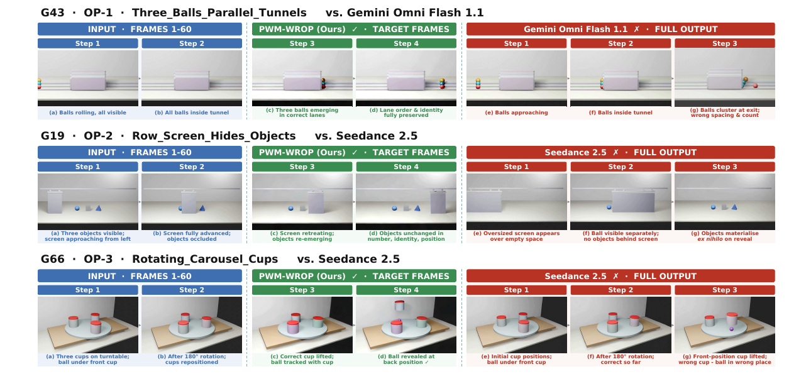

# Training Object Permanence in World Models（WROP）

**论文**: [arXiv:2609.28654v1](https://arxiv.org/abs/2609.28654) (cs.AI, 2026-09-23, 26 页含附录)
**作者**: Haotian Zhang★, Fengyuan Yu★, Dezhi Luo★ 等 31 人，通讯作者 Hokin Deng — **USC / CMU / U Michigan / JHU / UCSD / UCLA / Columbia / Toronto / Bristol / Berkeley / Waterloo / FAU Erlangen / Oxford / NYU / Stanford / Harvard**（★ Core Team）
**项目页**: [object-permanence.world](https://www.object-permanence.world)（含 [Leaderboard](https://object-permanence.world/leaderboard)）
**代码**: [github.com/hokindeng/object-permanence](https://github.com/hokindeng/object-permanence)（本笔记引用 commit [`824badd`](https://github.com/hokindeng/object-permanence/tree/824baddcdad087810d35638bf8f273b884f74975)）—— Blender 生成器 + `pwm` 训练栈（Trainium2）
**数据 / 考题 / 权重**: [训练集](https://huggingface.co/datasets/Hokin/object-permanence)（revision `b202637`）· [考题 + 各模型答卷](https://huggingface.co/datasets/Hokin/object-permanence-benchmark)（revision `b383009`）· [PWM-WROP 权重](https://huggingface.co/Hokin/PWM-WROP)（revision `fa44d2f`，7 个 safetensors 分片共 30.3 GB）
**底座**: NVIDIA Cosmos3-Nano（16B MoT 双塔，见仓库 [Cosmos 3 笔记](../../multimodal/cosmos3/analysis.md)）
**同一团队的前作**: VBVR（*A Very Big Video Reasoning Suite*，ICML 2026，论文中引作 Wang et al., 2026）与 VBVR-Pro —— 本文考题的元数据 schema 就叫 `permanencebench-vbvr-meta-v6`

---

## 1. 一句话定位

**一个面向"物体恒存（object permanence, OP）"与"物体实体性（object solidity, OS）"的视频续写基准 + 训练语料**：150 个手写的 Blender 程序化生成器，分六个认知科学任务族；每个生成器产出 1 万条"前 60 帧给模型、后 60 帧让它续写"的样本（共 150 万条），外加一份 300 题的考卷与 14 个视频模型的盲测人评 Elo。作者用这份语料把 Cosmos3-Nano 微调成 **PWM-WROP**，它在人评里**续写类第一、总排名第三**。

| 组成 | 内容 |
|---|---|
| 任务 | 6 族：OP-1 遮挡后重现 / OP-2 静态场景被遮挡 / OP-3 容器内随容器移动；OS-1 开口大小决定能否通过 / OS-2 撤掉支撑就下落 / OS-3 碰撞后各自分开 |
| 生成器 | 150 个 Blender 脚本（OP 90 个、OS 60 个），关键帧手写动画，**不用物理引擎** |
| 训练集 | 150 万条，每条 = 输入视频 + 目标视频 + prompt + 逐帧位姿轨迹 + 元数据，1280×720 @ 24 fps |
| 考卷 | 300 题 = 每个生成器 2 题 |
| 评测 | 20 名众包评分者、361 次盲测两两比较、Bradley–Terry 拟合成 Elo；辅以 LPIPS / MS-SSIM 等全参考指标 |
| 模型 | PWM-WROP：Cosmos3-Nano 在 150 万条上训 1 个 epoch，320×192 分辨率 |

🔴 **但我把考卷、训练集、生成器代码逐项对照后，认为"续写类第一"这个头条结论几乎没有信息量**：
1. **考题就是训练集同一批样本槽位的旧版渲染。** 我比对了 5 个生成器、跨 4 个 shard 的 10 道考题：**每道题的种子都恰好等于训练集同槽位样本种子的末 5 位**（如训练 `3117562268` ↔ 考题 `62268`），且源脚本相同 —— 它们出自同一个 `(生成器, 槽位)` 的哈希输入（见 [§4](#4-考题与训练集同一批槽位只换了颜色)）。
2. **300 道题里只有 176 个不同的物理场景。** 150 个生成器里有 **124 个**，两道考题出自同一个源脚本，全部 300 题都只做了换色换材质（没有几何、机位变化）—— 同一个物理事件出了两次（见 [§4](#4-考题与训练集同一批槽位只换了颜色)）。
3. **PWM-WROP 是唯一见过这些场景的模型。** 它在每道题所属的场景上见过数千到上万个近似副本（每个生成器 1 万条，按成员脚本均分），这些副本只改了颜色、±16–18% 的几何与三档机位；其余 13 个模型都是零样本；而且**没有评测微调前的 Cosmos3-Nano 底座**，所以"训练带来了多少"无从谈起（见 [§7](#7-结果)）。
4. **14 个模型里有 7 个在结构上就做不了这道题** —— 论文自己承认编辑 / 迁移类模型 *"cannot depict events that unfold after the occlusion boundary"*。"总排名第三"是在半数对手先天不能作答的名单里排出来的。
5. 还有几处发布材料与论文对不上：**论文三处描述"随机化什么"互相矛盾**，发布数据里 `light` 字段全部为空；**评分池里其实有 16 个候选、只报告了 14 个**；**附录 B 承诺的"PWM-WROP 在 Trainium 上端到端训练的情况"没有写**（见 [§5](#5-pwm-wrop-与训练栈)、[§6](#6-评测协议)）。

📌 **站得住的部分同样清楚**：6 个任务族的认知科学设计扎实，每个生成器都有显式的"期望终态契约"；**人评本身做得规范**（资格筛选、注意力检查、重复题自一致 κ = 0.891、无位置偏置、按评分者聚类的 bootstrap）；**数据、考卷、14 个模型的全部答卷、权重、生成器与训练栈全部开源**，这让上面这些问题都能被外部核实；定性分析归纳的两类失败 —— *representation dropout* 与 *causal decoupling* —— 是有用的错误分类。**作为一个"零样本诊断基准"，它有价值；作为"物体恒存可以被训练出来"的证据，它还不成立。**

---

## 2. 要解决的问题

**物体恒存和实体性是婴儿最早具备的物理先验**（论文援引：3.5 个月表征被遮挡的物体、半岁内察觉穿模违例），属于 Spelke 所说的 core knowledge。视频生成模型的典型失败 —— 物体在遮挡物后消失、在不可能的位置重新出现、穿过实心障碍 —— 恰好违反的就是这两条。

论文列出现有"视频推理"评测的三个缺口：多局限于 2D 环境；只评图生视频、不评**视频续写（V2V）**；没有专门针对物体身份、物理约束与因果后果的评测。另外三个结构性问题：**每个任务的样本量小**、**没有或几乎没有训练划分**、**大量依赖 VLM 打分** —— 而 VLM 本身就有 core knowledge 缺陷，用它评物理常识等于让考生判卷。

所以 WROP 的设计选择是：**用手写的、物理上一致的 Blender 动画当标准答案，用人来评判**。

📌 这与仓库里用 LLM / VLM 当裁判的做法形成对照：例如 [Avatar-Forever](../../video_generation/avatar_forever/analysis.md) 让 Gemini 打分（而且让它自己算加权平均）。WROP 把人评作为主指标，这是它最站得住的一点。

⚠️ 小瑕疵：§2 末尾把基准叫作 **"VR-OP&S"**，全文其它地方都叫 WROP，疑似改名前的旧称残留。

---

## 3. 数据：150 个 Blender 生成器

> **Fig 2 逐面板解读**（每个面板三帧：输入早期帧 / 切分点处的输入末帧 / 目标帧）：
>
> **上排 · Object Permanence（OP）**
> - **(a) Baillargeonian Occlusion** —— 一个小球沿轨道滚向中间的遮挡板（Input），切分点时已完全被挡住（Split），目标帧里它从另一侧出来（Target）。副标题 *Identity and trajectory persist*：身份与轨迹要连续。
> - **(b) Object-Static Occlusion** —— 一排静止物体（球、方块、锥体），一块屏风从左侧移过来把它们挡住，目标帧里屏风移开、三件物体原样出现。*Count and arrangement persist*：数量与排列不变。
> - **(c) Container-Based Permanence** —— 抽屉里有一个绿球（Input），抽屉关上（Split），再拉开时球还在里面（Target）。*Hidden objects remain with containers*：被藏起来的物体跟着容器走，而不是留在原地。
>
> **下排 · Object Solidity（OS）**
> - **(d) Baillargeonian Obstruction** —— 球沿斜轨冲向一块竖直挡板，目标帧里球停在板前、被挡住。*A barrier blocks or deflects motion*（该族按开口大小分「挡住 / 放行」两种情形，缩略图里看不出这一例的开口尺寸）。
> - **(e) Object Drop** —— 球放在一块平板上，平板被抽走（Split），目标帧里球落下。*Support removal causes a fall*。
> - **(f) Object Collision** —— 两个球相向运动（Input），切分点时相撞（Split），目标帧里各自分开（Target）。*Contact changes both trajectories*。
>
> 📌 **设计上的关键约束**：每个生成器都把**关键物理事件放在切分点之后**，所以输入半段只交代场景，事件及其后果全部落在要生成的目标半段里 —— 模型不能靠"复述输入"蒙混过关。

**分布**（Fig 3 的环形图，我复算百分比全对）：OP-1 26 个（17.3%）、OP-2 29 个（19.3%）、OP-3 35 个（23.3%），OS-1 20 个（13.3%）、OS-2 21 个（14.0%）、OS-3 19 个（12.7%）；OP 合计 90（60%）、OS 合计 60（40%）。

> **Fig 4 逐帧解读**（左两帧是输入 1–60 帧，右两帧是目标 1–60 帧）：
>
> - **(a) Contents visible** —— 两个标了 A、B 的托盘，A 上是金色球、B 上是深蓝立方体，两个盖子悬在上方。
> - **(b) Split: boxes crossed** —— 盖子扣下后两个盒子开始交换位置，切分点时正好交叉。
> - **(c) Exchange complete** —— 交换完成，两个盒子都盖着，看不到里面。
> - **(d) Contents revealed** —— 盖子揭开：左边现在是 B（蓝立方体），右边是 A（金色球）。
>
> 📌 **这个设计的用意**：正确答案不能靠"最终位置"推出来 —— 模型必须在遮挡期间一直记住"哪个物体在哪个标号的盒子里"。论文特别强调这类"多个物理上都合理的结果"的生成器是为了防止模型走捷径。

**生成流水线**（§3.3）：每个任务是一个参数化的 Blender 脚本，**所有轨迹都是解析式手写的关键帧**（*"No rigid-body solver is used … physical plausibility is the responsibility of the scene author"*）；Blender 4.4.3 + EEVEE Next 渲染 120 帧，在第 60 帧处切成输入 / 目标；每条样本打包成五件套；自动校验文件完整性与帧数，渲染失败自动重试，发布前人工抽查每个生成器。

### 3.1 "随机化了什么"：论文三处说法互相矛盾，代码给出了答案

这一点决定了训练集的多样性，也决定了考题和训练集有多像，所以值得逐字对照：

| 出处 | 原文 |
|---|---|
| 摘要 / Fig 1 | *"randomize speed, lighting, camera angle, and other nuisance parameters while preserving each task's cognitive structure"* |
| §3.1 | 结构参数（物体数量、几何、轨迹、遮挡配置、开口大小、接触时机）*"are varied systematically across samples within a generator … ensure that models cannot succeed by memorizing a fixed physical outcome"*；表面参数（颜色、材质、光照、**机位**）独立随机 |
| §3.3 (2) | *"A recorded random seed controls surface variations in object color, material, and scene lighting, while **the authored camera, geometry, spatial configuration, and physical mechanism are preserved**."* |

§3.1 说几何与机位会变，§3.3 说几何与机位保持不变。**代码与发布数据给出的实际情况**（[`diversity.py`](https://github.com/hokindeng/object-permanence/blob/824baddcdad087810d35638bf8f273b884f74975/object_permanence/generator/core/diversity.py)）：

- **结构因子只有两档。** `diversity.py:16-19` 的注释：*"the balanced design samples the 25th and 75th percentiles, these yield actual low/high multipliers of **0.82/1.18** for primary or dynamics factors and **0.84/1.16** for secondary geometry factors"* —— 每个任务因子只取作者原值的 ×0.82 或 ×1.18。
- **视觉因子是 8 种颜色 × 3 个固定机位**（`diversity.py:24-38`：`left` 方位 −16°、`center` 仰角 7°、`right` 方位 +16°）。
- **每个生成器的全部设计格子 = 物体变体数 × 8 色 × 3 机位 × 任务因子组合数**（≤ 5 个因子时是 2^k，否则固定 32 次分式析因），`diversity.py:259-264` 的 docstring：*"a 1,000-sample generator gives each complete cell either one or two samples"*。**也就是说，一个生成器里不同的物理构型最多只有"变体数 × 32"种。**
- ⚠️ **代码里写的样本预算是每个生成器 1,000 条**（`diversity.py:27` *"the planned 1,000 samples per generator"*、`:44-45` *"the production budget (1,000 samples per generator)"*），而论文与数据集 README 都写 **10,000**。`generate.py:86-87` 的注释还提到旧版种子方案 *"yields byte-identical duplicates at 150k samples"*。若确实每生成器 1 万条，而 docstring 说每个设计周期 ≤ 1,000 格，那么**每个格子至少被重复采样 10 次**，重复样本之间只差种子驱动的换色 / 材质 / 装置色调。
- ⚠️ **光照并没有随机化。** 我检查的 300 道考题与 35 条训练样本，元数据里的 `light` 字段**全部为 `null`**。

---

## 4. 考题与训练集：同一批槽位，只换了颜色

这是我认为全篇最关键的问题。论文对考卷的全部描述是 *"The evaluation exam contains 300 questions: 2 samples from each of the 150 generators"*，**没有说明考题与训练样本如何隔离**。我用发布的考卷元数据和训练集（HTTP Range 只读取了 tar 开头几 MB，未下载完整数据集）做了比对。

**证据 1 · 种子同源。** 考题的种子恰好是训练集同槽位样本种子的末 5 位：

| 生成器 | 槽位 | 训练样本种子 | 考题种子 | 源脚本 |
|---|---|---|---|---|
| G26 bottom_rail_screen | 0000 / 0001 | 3117562268 / 1283345743 | **62268** / **45743** | 98 / 99（相同） |
| cart_swap | 0000 / 0001 | 3465892068 / 823870576 | **92068** / **70576** | 12 / 12（相同） |
| accordion_fold_screen | 0000 / 0001 | 2229348205 / 4017485745 | **48205** / **85745** | 128 / 128（相同） |
| ball_strikes_pendulum | 0000 / 0001 | 1798277503 / 571329736 | **77503** / **29736** | 182 / 182（相同） |
| bifold_concertina_doors | 0000 / 0001 | 3586674037 / 1319307806 | **74037** / **7806** | 150 / 150（相同） |

10 / 10 全部满足 `考题种子 = 训练种子 mod 100000`（随机碰上的概率约 10⁻⁵⁰）。当前代码的 `deterministic_seed(gid, k, idx)`（`generate.py:85-89`）是对 `"gid:k:idx"` 做 SHA-256 取 32 位；**考题显然是同一个哈希输入、旧版流水线把它折叠成了 5 位十进制数**。换句话说，**考题 0000、0001 就是训练集第 0、1 个槽位用旧版流水线渲染的版本**，不是另外留出的样本。

**证据 2 · 考题只做了表面变化。** 全部 300 道考题的 `applied_transforms` 都只有 `recolor_material`、`apparatus`、`light`（且 `light` 全为 `null`），**没有 `task_diversity`、没有 `camera_viewpoint`**，种子全部 < 100,000（最大 99963）；训练样本则是 `diversity_profile: task`，带机位与几何因子。

**证据 3 · 很多题是同一个场景出了两次。** 150 个生成器里有 **124 个**的两道考题来自同一个源脚本；**300 道题里只有 176 个不同的 `(生成器, 源脚本)` 场景**。由于考题只换颜色，同一源脚本的两道题**物理事件完全相同**。

> **对比图解读**（我从发布的训练集与考卷里各取 G26 `bottom_rail_screen_0000`，分别抽输入第 0 帧、目标第 30 帧、目标第 59 帧拼成）：
>
> - **上行 · 训练样本**（种子 3117562268，`task` 档）—— 深蓝色球 + 橙棕色立方体，右侧导轨上一块大屏风；机位是 `left`（方位 −16°、仰角 −3°、距离 ×1.18），左右立柱的 x 坐标乘了 0.82 / 0.84，地面与背景板被扩展（`view_environment: expanded`）。目标段里屏风滑入、挡住立方体，最后滑回右侧，球和立方体原位重现。
> - **下行 · 考题**（种子 62268 = 训练种子末 5 位，只做了换色）—— **同一个源脚本、同一个物理事件**：深蓝色球 + **黄色**立方体，屏风的运动完全一样；区别只是作者原始的正面机位、原始几何（×1.0，正好落在训练两档 ×0.82 / ×1.18 的中间）、以及画面底部能看到地面边缘。
> - **两者的 prompt 除训练侧多一句统一前缀 *"Continue this scene as a short video."* 外，只差一个颜色词**：训练 *"A navy ball and an **orange** cube are visible. A single large opaque screen rides on a bottom double rail…"* / 考题 *"A navy ball and a **yellow** cube are visible. A single large opaque screen rides on a bottom double rail…"*。
>
> 📌 **结论**：考题就是训练分布的中心点。对一个在这 150 万条上训过的模型，这张考卷测的是"能否复现见过的场景编排"，而不是"物体恒存能否泛化到新场景"。

**还有一个更严重的可能性，我无法从发布材料里排除。** §4.1 说 PWM-WROP *"is fine-tuned for one epoch on 1,500,000 samples, **an earlier render of the same 150 generators**"* —— 它的训练数据不是发布的这版，而是"更早的一次渲染"；而考题恰恰也是旧版流水线的产物。**如果那次"更早的渲染"与考题属于同一版流水线（5 位种子、只换色），那么考题本身 —— 连同它的目标视频 —— 就原样出现在 PWM-WROP 的训练集里。** 论文、代码、README、数据卡都没有说明考题槽位是否从训练中剔除 `[待补]`。

📌 **公平地说**：同分布的测试划分在合成基准里很常见，本身不是错；问题在于论文把它当作"物体恒存可以被训练出来"的证据，却既没有说明考题与训练的关系，也没有任何分布外（新场景、新任务族）的测试。

---

## 5. PWM-WROP 与训练栈

**模型**：从 Cosmos3-Nano 微调，*"with only the training signal changed; the architecture and tokenizer remain identical to the base model"*。按仓库 [Cosmos 3 笔记](../../multimodal/cosmos3/analysis.md)，Nano 是 36 层、hidden 4096 的 **MoT 双塔**（理解塔与生成塔各一套参数、共享 attention），总参数 16B、由 Qwen3-VL-8B 初始化 —— 论文说的"16B"指的就是双塔总参数。

**训练配置**（论文 §4.1 + 发布的 [`pwm/configs/wrop.yaml`](https://github.com/hokindeng/object-permanence/blob/824baddcdad087810d35638bf8f273b884f74975/pwm/configs/wrop.yaml)，两者一致）：

| 项 | 值 |
|---|---|
| 几何 | **320×192**，117 帧 = 57 帧条件 + 60 帧预测（latent 30 帧 = 15 干净 + 15 加噪，Wan VAE 的 4n+1 帧结构） |
| token | 每帧 60 个 vision token，共 1,800 vision + 128 text = 1,928 |
| 数据 | 150 万条，**"an earlier render of the same 150 generators"**，每条的 prompt 作文本条件；不给任务标签 |
| 优化 | lr 峰值 1e-4，warm-up 50 步后 cosine 到 0；betas (0.9, 0.95)，weight decay 0，梯度裁剪 1.0 |
| 步数 | **93,750 步** = 150 万 / batch 16，一个 epoch |
| 扩散 | `sigma_kind: waver`，`train_shift: 3.0`（配置注释：≤256p 取 3） |
| 推理 | 条件取输入的**最后 57 帧**，UniPC 35 步、guidance 6.0、shift 10.0、固定种子 1234 |

⚠️ **分辨率是整个比较里最大的不对称**：PWM-WROP 原生输出只有 320×192，其它 13 个模型是 832×480 到 1920×1080。人评时所有视频被统一放大 / 缩小到 1280×720，**PWM-WROP 等于被放大了约 4 倍**（320×192 是 5:3，1280×720 是 16:9，横向 4 倍、纵向 3.75 倍）；自动指标则反过来，全部缩到 320×192 —— 恰好是 PWM-WROP 自己的分辨率。

**训练栈 PWM（附录 B）**：一套在 AWS Trainium2 上原生 PyTorch（不走 XLA 图追踪）运行 Cosmos3-Nano 的实现。单台 trn2.48xlarge（16 颗芯片 = 64 个 NeuronCore），张量并行 4 × FSDP2 16；每个 MoT block 按静态形状编译一次；fp32 主权重 + bf16 计算；按 rank 存 checkpoint、支持逐位一致的断点续训，完整 checkpoint 162 GiB。**Table 5 的吞吐**：从首个可运行版本的 15.1 s/step，经"重写 reduce-scatter 的 copy-in"降到 6.74 s，再经"多张量 AdamW + FSDP2 预取"降到 **5.71 s/step**（batch 16），且每一步的 loss 与优化前完全一致。附录还记录了几条对 Trainium 通用的工程经验（先加载再切分会碎片化显存、张量并行下被复制的参数梯度会漂移、单张量 AdamW 受 kernel 启动次数限制等）。

⚠️ **三处与实际训练对不上**：
1. **Table 5 的吞吐是在 288×512 下测的**（`pwm/README.md` 也写明 `example.yaml` 是 *"the 288×512 text-to-video geometry the throughput numbers below were measured at"*），**不是 PWM-WROP 真正训练的 320×192**。
2. **§4.1 承诺附录 B 会给出 *"the status of the end-to-end fine-tune of PWM-WROP on said infrastructure"*，附录 B 里没有这一段。** 附录只有吞吐、工程经验与正确性检查（在 6 条上游示例、64 条物理渲染片段上的过拟合测试，以及与 *"an independent earlier port"* 的同种子采样一致性）。
3. **`pwm/README.md` 里唯一的"Verified end to end"记录**（[`pwm/README.md:127-136`](https://github.com/hokindeng/object-permanence/blob/824baddcdad087810d35638bf8f273b884f74975/pwm/README.md#L127-L136)，2026-09-16）是 **253 条样本、截断到 20 步**的冒烟测试，而且其中推理一步用的是**已经存在的 PWM-WROP 权重**（`infer --weights <PWM-WROP>`）—— 发布的 checkpoint 在这次验证之前就已经有了。论文说 *"PWM, the stack that produced the checkpoint"*，但**完整的 93,750 步是用哪套代码、在什么硬件上、跑了多久，发布材料里都查不到** `[待补]`。（粗略估算：若按 288×512 的 5.71 s/step，一个 epoch 约 149 小时；320×192 的 token 更少、应更快 —— 这是我的推算，不是论文数字。）

---

## 6. 评测协议

**14 个模型、三类接口**（Table 1）：

| 接口类型 | 模型 | 与任务的关系 |
|---|---|---|
| **真续写**（4） | **PWM-WROP**、MAGI-1 24B、LTX-2.3 Extend、Grok Imagine（video extend） | 把输入当前缀，生成其后的帧 —— **唯一与任务定义一致的一类** |
| **参考生视频**（3） | Seedance 2.5、Wan 3.0 Prime、MiniMax H3 | 把输入当视觉参考，按 prompt 在自己的时间线上**重新生成整段事件** |
| **编辑 / 迁移**（7） | LTX-2.3 Dev（IC-LoRA）、Wan-VACE 14B、HY-OmniWeaving、Cosmos3 Super（edge control）、Kling O3 Pro、Gemini Omni Flash 1.1、Runway Aleph 2 | 逐帧重绘输入所在的时间段 —— 论文原话 *"cannot depict events that unfold after the occlusion boundary"* |

🔴 **半数对手在结构上就做不了这道题。** 编辑类模型的输出与输入占据同一段时间，**根本无法生成切分点之后才发生的事件** —— 而 WROP 的每道题都把关键事件放在切分点之后。论文把"接口类型"当作分析因子讨论，但仍把 14 个模型放进同一张排行榜、报出"总排名第三"。

**推理框架**：一套统一的 harness，只把输入视频和 prompt 原样传给模型，从不暴露目标视频；不做模型专属的 prompt 工程，能关的服务端 prompt 扩写全部关闭。闭源模型经 FAL（Runway 走自家 API）调用，按目标帧数请求时长；短于供应商下限的输入在前面重复首帧补齐；会把源视频拼在输出前面的接口按规则裁掉（LTX-2.3 Extend 去掉前 3.25 s、Grok 去掉前 60 帧、Kling 去掉 0.5 s 前置补帧）。

⚠️ §4.3 提到 *"the two 90-frame benchmark items"*（PWM-WROP 的 57 帧条件窗口看不到其前 33 帧），Table 3 caption 的 *"≈9,030 frames per side"* 也只能用"298 条 × 30 + 2 条 × 45"凑出 —— **确实有 2 道题是 90 帧**，与 §3.2 *"Every sample is a 120-frame … split … into a 60-frame input video and a 60-frame target video"* 矛盾。

**人评**：所有视频统一成 1280×720、24 fps、静音、同码率；评分者看输入视频与 prompt，再看两条匿名、随机排序的续写，选 A、B 或"差不多"；**三条标准合并判断**：与文本一致、运动自然且物理合理、物体恒存（不消失、不凭空出现、不穿过实心障碍、遮挡后颜色 / 形状 / 数量不变）。

| 质控项 | 结果 |
|---|---|
| 评分者 | 20 名众包，资格测试门槛 8/10（中位 9/10） |
| 注意力检查 | 90.0% 答对 |
| 重复题自一致 | 93.5%，Cohen's κ = 0.891 |
| 位置偏置 | 非平局中左侧被选 51.4%（p = 0.615），无偏置 |
| 置信区间 | 1,000 次按评分者聚类的 bootstrap |

📌 **这套人评流程本身是规范的**，质控指标比仓库里多数带人评的论文都完整。

🔴 **但评分池里其实有 16 个候选。** 原文：*"Each of the **120** candidate model pairs was scheduled across 4 benchmark items, yielding 476 of 480 completed judgments, of which **361** fell between distinct models"*。14 个模型两两组合只有 C(14,2) = 91 对；**120 = C(16,2)**。按 16 个候选推算：去掉 2 个候选后剩 91 对 × 4 = 364 条排期，4 条未完成里有 3 条落在保留的对上，恰好得到 **361**；每个模型 13 对 × 4 = 52 场，Table 2 的场次列（9 个 52、4 个 51、1 个 50）总缺口 6 = 2 × 3 —— **全部吻合**。**论文没有说另外 2 个候选是谁、为什么不报告** `[待补]`。（如果其中之一是未微调的 Cosmos3-Nano 底座，那正是 §7.1 缺的那个关键对照 —— 这只是推测。）

⚠️ **每个模型只被评了约 52 次**，而考卷有 300 题 —— 任何一个模型的 Elo 都只反映了它在约 52 道题上的表现。

---

## 7. 结果

### 7.1 总榜（Table 2）

| 排名 | 模型 | 类型 | Elo | 95% CI | 胜率 | 场次 |
|---|---|---|---|---|---|---|
| 1 | Wan 3.0 Prime | 参考生视频 | 1723.6 | [1629.2, 1864.9] | 77.9% | 52 |
| 2 | MiniMax H3 | 参考生视频 | 1723.6 | [1644.5, 1837.6] | 77.9% | 52 |
| 3 | **PWM-WROP（本文）** | **真续写** | **1679.5** | **[1603.5, 1781.5]** | **73.1%** | **52** |
| 4 | Seedance 2.5 | 参考生视频 | 1649.6 | [1554.2, 1751.5] | 69.6% | 51 |
| 5 | Runway Aleph 2 | 编辑 / 迁移 | 1518.3 | [1425.1, 1621.6] | 52.9% | 51 |
| 6 | Wan-VACE 14B | 编辑 / 迁移 | 1506.7 | [1429.9, 1590.8] | 51.0% | 52 |
| 7 | Gemini Omni Flash 1.1 | 编辑 / 迁移 | 1492.5 | [1404.1, 1572.9] | 49.0% | 52 |
| 8 | Kling O3 Pro | 编辑 / 迁移 | 1471.3 | [1404.0, 1534.0] | 46.2% | 52 |
| 9 | Grok Imagine（video extend） | 真续写 | 1457.0 | [1362.7, 1555.1] | 44.2% | 52 |
| 10 | LTX-2.3 Extend | 真续写 | 1453.4 | [1363.6, 1545.8] | 43.1% | 51 |
| 11 | Cosmos3 Super | 编辑 / 迁移 | 1409.2 | [1318.2, 1488.7] | 37.3% | 51 |
| 12 | LTX-2.3 Dev | 编辑 / 迁移 | 1398.9 | [1297.7, 1482.3] | 36.5% | 52 |
| 13 | HY-OmniWeaving | 编辑 / 迁移 | 1268.5 | [1159.4, 1344.2] | 21.0% | 50 |
| 14 | MAGI-1 24B | 真续写 | 1248.0 | [1137.2, 1315.6] | 19.2% | 52 |

（前 11 行按 300 DPI 渲染的原表逐格核对，后 3 行取自抽取文本；下面的求和检验覆盖全部 14 行。）**这张表内部完全自洽**：场次之和 722 = 2 × 361；**每行"胜率 × 场次"之和 = 40.5 + 40.5 + 38 + 35.5 + 27 + 26.5 + 25.5 + 24 + 23 + 22 + 19 + 19 + 10.5 + 10 = 361**，正好等于判断总数；bootstrap 的"排名第一概率"46.8% + 36.4% + 12.3% + 4.5% = 100%。

**读法**：
- **"续写类第一"在统计上成立**：PWM-WROP 的区间下界 1603.5 高于续写类第二名 Grok Imagine 的上界 1555.1。
- **"总排名第三"不稳**：它的区间与第 1、2、4 名全部重叠（论文 caption 自己也写了 *"overlapping intervals should not be read as significant rank differences"*）。
- 🔴 **缺少最关键的对照：微调前的 Cosmos3-Nano。** 论文写 *"Fine-tuning on domain-specific data leads to a substantial improvement among true-continuation models"*，但比的是**其它**续写模型，从没比过自己的底座；紧接着又承认 *"because the models also differ in architecture, the performance gap cannot be attributed to training alone"*。**能把 224 分（实为 222.5 分）的差距归给 WROP 训练的那个实验，恰好没做。**
- 再结合 §4：这 222.5 分是"见过每个考题场景数千到上万个近似副本的模型"对"零样本模型"的差距。

⚠️ **正文与表格有三处对不上**（像是正文按旧版排行榜写的）：

| 正文 | 表格 |
|---|---|
| PWM-WROP 领先 Grok Imagine *"by **224** Elo points (1457 [**1368**, 1555])"* | 1679.5 − 1457.0 = **222.5**；Grok 的区间是 [**1362.7**, 1555.1] |
| *"LTX-2.3 Extend (**1452**) and MAGI-1 24B (**1240**)"* | 1453.4 与 **1248.0** |
| *"The **five** systems from Runway Aleph 2 through Cosmos3 Super are separated by only 109 Elo points"* | 第 5 名到第 11 名是 **7 个**系统（Elo 差 1518.3 − 1409.2 = 109.1 倒是对的） |

### 7.2 分任务族（Fig 6）

> **Fig 6 解读**：行是 14 个模型（按总 Elo 排序，最右列是总 Elo），列是六个任务族，格子里是该模型在该族内单独拟合的 Bradley–Terry 排名（1 最好、14 最差），绿到红表示好到差；模型名的颜色是接口类型（橙 = 参考生视频、蓝 = 真续写、绿 = 编辑 / 迁移），PWM-WROP 一行加了深蓝框。
>
> - **PWM-WROP**：OP-1 第 3、**OP-2 第 1**、OP-3 第 3；OS-1 第 5、OS-2 第 2、**OS-3 第 8**。OP 三族都在前三，OS 起伏大，碰撞（OS-3）掉到中游。
> - **两个并列第一的参考生视频模型**的优势主要来自 OS：MiniMax H3 在 OS-2、OS-3 都第一；Wan 3.0 Prime 在 OP-3、OS-3 分别第一、第二。
> - **Seedance 2.5** 在 OP-1、OS-1 两个 Baillargeon 范式族都排第一。
> - **排名跳得很厉害**：Gemini Omni Flash 在 OS-1 垫底（14）、在 OS-2 却第 4；Grok Imagine 在 OS-2 垫底、在 OP-2 第 4；编辑类的 Cosmos3 Super 在 OS-1 竟然第 2。
>
> ⚠️ **最后这一点是样本量造成的**：caption 写明各族共 *"36–96 games per family"*，Table 6 又写 *"Bootstrap CIs are wide especially in OS families (**36–44 total games each**)"* —— **分到 14 个模型上，每个模型在单个 OS 族里只有约 5–6 场比较**。所以"MiniMax H3 在 OS-2、OS-3 胜率 100%"、"PWM-WROP 在 OS-3 排第 8"，都建立在五六场比较上。论文据此推出 *"the two capacities may require different internal representations"*，这个推论撑不住。

### 7.3 定性分析（Fig 7 / Fig 8）

> **Fig 7 逐行解读**（每行：蓝色两帧是真值输入，绿色两帧是 PWM-WROP 的续写，红色三帧是某个 baseline 的完整输出，✓ / ✗ 表示是否物理正确）：
>
> - **G43 · OP-1 · Three_Balls_Parallel_Tunnels vs. Gemini Omni Flash 1.1** —— 三个彩色球在三条平行轨道上滚进一条不透明隧道。PWM-WROP：三个球从各自的轨道出来，(d) *"Lane order & identity fully preserved"*。Gemini：(g) *"Balls cluster at exit; wrong spacing & count"*。
> - **G19 · OP-2 · Row_Screen_Hides_Objects vs. Seedance 2.5** —— 三件物体排成一行，一块屏风从左侧移过来挡住。PWM-WROP：屏风退开，物体数量、身份、位置不变。Seedance：(e) 在空地上生成一块过大的屏风、(f) 物体还露在屏风外、(g) 屏风移开后物体 *"materialise ex nihilo"*。
> - **G66 · OP-3 · Rotating_Carousel_Cups vs. Seedance 2.5** —— 转盘上三个杯子，球藏在前面那个杯子下，转盘转 180°。PWM-WROP：揭开转到后面的那个杯子，球在里面。Seedance：转盘转对了，但 (g) 揭开的是**转到前面的另一个杯子**，球出现在错误位置 —— 它按"转盘上的位置"而不是"盖住它的那个杯子"来追踪球。
>
> ⚠️ **读这张图要带着三个前提**：① 每一行都是"PWM-WROP 成功 vs 一个挑出来的失败 baseline"，论文说案例选自 *"generators that have major effects on the family-level Elo results"*；② 每行对手不同，不是同一组模型的横向比较；③ 按 §4，**这些都是 PWM-WROP 在训练中见过近似副本的场景**。

**Fig 8（OS 三族）** 的三个案例同样是一对一对比：G10 Size Gate 中 Seedance 让球穿过了比它小一半的开口（论文指出 MiniMax H3、Wan 3.0 Prime 也犯同样的错）；G27 撤板下落中 Seedance 连支架一起移走、球悬空数帧才下落；G137 台球开球中 Gemini 开球前多出一堆球、碰撞后紫球消失。论文把这六个案例归纳成两类失败：**representation dropout**（场景看着合理，但丢了之前出现过的物体）与 **causal decoupling**（单个事件看着合理，但事件之间的物理因果断了）—— 这个分类本身是有用的。

### 7.4 自动指标（Table 3，全部缩到 320×192 比较）

| 模型 | LPIPS↓ | MS-SSIM↑ | SSIM↑ | PSNR↑ | MSE (×10⁻³)↓ | CLIP↑ | FID↓ |
|---|---|---|---|---|---|---|---|
| Wan 3.0 Prime | 0.115 | 0.861 | **0.942** | <ins>27.15</ins> | 4.48 | 0.948 | 15.1 |
| MiniMax H3 | <ins>0.105</ins> | <ins>0.877</ins> | <ins>0.938</ins> | **27.51** | 9.09 | **0.962** | <ins>14.8</ins> |
| **PWM-WROP** | **0.081** | **0.921** | 0.917 | 26.45 | **2.97** | <ins>0.956</ins> | 20.4 |
| Seedance 2.5 | 0.282 | 0.616 | 0.770 | 18.37 | 28.55 | 0.928 | 24.6 |
| Runway Aleph 2（n = 297） | 0.181 | 0.789 | 0.918 | 24.98 | 9.71 | 0.918 | 19.7 |
| Wan-VACE 14B | 0.349 | 0.744 | 0.842 | 17.88 | 24.21 | 0.872 | 33.0 |
| Gemini Omni Flash 1.1 | 0.151 | 0.830 | 0.937 | 26.81 | <ins>3.88</ins> | 0.943 | 17.0 |
| Kling O3 Pro | 0.163 | 0.818 | 0.933 | 26.10 | 4.73 | 0.932 | 18.0 |
| Grok Imagine | 0.125 | 0.852 | 0.932 | 26.98 | 5.52 | 0.956 | **13.6** |
| LTX-2.3 Extend | 0.183 | 0.789 | 0.886 | 23.14 | 11.08 | 0.931 | 21.5 |
| Cosmos3 Super | 0.340 | 0.594 | 0.768 | 15.03 | 40.59 | 0.853 | 46.3 |
| LTX-2.3 Dev | 0.289 | 0.726 | 0.824 | 21.09 | 10.06 | 0.869 | 73.7 |
| HY-OmniWeaving | 0.247 | 0.716 | 0.874 | 22.41 | 17.61 | 0.875 | 43.8 |
| MAGI-1 24B | 0.260 | 0.681 | 0.853 | 21.59 | 20.66 | 0.923 | 26.6 |

（加粗 = 最好、下划线 = 次好，按论文原表；前 11 行按 300 DPI 逐格核过、后 3 行取自抽取文本，加粗与下划线全部正确。唯一可议的是 CLIP 列 PWM-WROP 与 Grok 同为 0.956，只有前者标了下划线。）

**读法**：PWM-WROP 在 LPIPS、MS-SSIM、MSE 上最好，**SSIM、PSNR、CLIP、FID 都不是最好**；**FID 最好的是人评排第 9 的 Grok Imagine**。论文自己把这组指标定位为次要（*"These metrics quantify proximity to the reference clip rather than physical reasoning correctness"*），这个定位是对的。

⚠️ **但引言里那句 *"at matched resolution, PWM-WROP obtains the best LPIPS and MS-SSIM against the target video"* 值得打折**：一是"匹配分辨率"恰好是 PWM-WROP 自己的 320×192；二是按 §4，它训练时见过每道题目标视频的近似副本 —— **一个在分布内训练过的模型，与参考视频在像素上最像，本来就是预期之内的**。

---

## 8. 关键代码与数据位置

代码均为 commit `824badd`；数据集与权重注明 HuggingFace revision。

| 位置 | 内容 | 对应论文 |
|---|---|---|
| [`diversity.py:16-19`](https://github.com/hokindeng/object-permanence/blob/824baddcdad087810d35638bf8f273b884f74975/object_permanence/generator/core/diversity.py#L16-L19) | 结构因子只取 ×0.82 / ×1.18（次要几何 ×0.84 / ×1.16）两档 | §3.1 "varied systematically" |
| [`diversity.py:24-38`](https://github.com/hokindeng/object-permanence/blob/824baddcdad087810d35638bf8f273b884f74975/object_permanence/generator/core/diversity.py#L24-L38) | 8 种颜色 × 3 个固定机位；*"the planned 1,000 samples per generator"* | 摘要 "randomize … camera angle"；论文称每生成器 10,000 |
| [`diversity.py:44-45`](https://github.com/hokindeng/object-permanence/blob/824baddcdad087810d35638bf8f273b884f74975/object_permanence/generator/core/diversity.py#L44-L45) | *"the production budget (1,000 samples per generator)"* | 同上 |
| [`diversity.py:54-56`](https://github.com/hokindeng/object-permanence/blob/824baddcdad087810d35638bf8f273b884f74975/object_permanence/generator/core/diversity.py#L54-L56) | 通用视角扰动 *"never alter scene geometry, animation, physics"* | — |
| [`diversity.py:259-264`](https://github.com/hokindeng/object-permanence/blob/824baddcdad087810d35638bf8f273b884f74975/object_permanence/generator/core/diversity.py#L259-L264) | 设计格子枚举：*"a 1,000-sample generator gives each complete cell either one or two samples"* | — |
| [`diversity.py:359`](https://github.com/hokindeng/object-permanence/blob/824baddcdad087810d35638bf8f273b884f74975/object_permanence/generator/core/diversity.py#L359) | `profile == "surface"` 直接返回：只换色、不改几何与机位 | §3.3 的描述；**考题全部是这一档** |
| [`generate.py:11-14`](https://github.com/hokindeng/object-permanence/blob/824baddcdad087810d35638bf8f273b884f74975/object_permanence/generator/core/generate.py#L11-L14) | 成员脚本循环使用；种子驱动的"安全变换"= 颜色 / 材质 / 装置色调 / 光照 | §3.3 |
| [`generate.py:85-89`](https://github.com/hokindeng/object-permanence/blob/824baddcdad087810d35638bf8f273b884f74975/object_permanence/generator/core/generate.py#L85-L89) | `deterministic_seed(gid, k, idx)` = SHA-256 取 32 位；注释 *"folding the digest into a smaller range yields byte-identical duplicates at 150k samples"* | 考题种子 = 这个值 mod 100000 |
| [`pwm/configs/wrop.yaml`](https://github.com/hokindeng/object-permanence/blob/824baddcdad087810d35638bf8f273b884f74975/pwm/configs/wrop.yaml) | PWM-WROP 训练 / 推理配置 | §4.1、§4.3 |
| [`pwm/README.md:127-136`](https://github.com/hokindeng/object-permanence/blob/824baddcdad087810d35638bf8f273b884f74975/pwm/README.md#L127-L136) | 唯一的 "Verified end to end"：253 条样本、20 步，推理用已存在的 PWM-WROP 权重 | 附录 B 缺的训练记录 |
| 训练集 `train/<task>_task.tar`（`b202637`） | 元数据含 `diversity_profile: task`、`camera_viewpoint`、`task_diversity` | §3.2 |
| 考卷 `eval/shard*/…/metadata.json`（`b383009`） | 300 份元数据：只有 `recolor_material` / `apparatus` / `light`，种子 < 100000 | §3.2 "2 samples from each of the 150 generators" |

---

## 9. 数字核对

**核对通过的**：

| 论文声明 | 复算 |
|---|---|
| Fig 3：OP-1 26（17.3%）、OP-2 29（19.3%）、OP-3 35（23.3%）、OS-1 20（13.3%）、OS-2 21（14.0%）、OS-3 19（12.7%）；OP 60% / OS 40% | 全部 ✅ |
| Table 2 场次之和 = 2 × 361 | 722 ✅ |
| Table 2 每行"胜率 × 场次"之和 = 判断总数 | 361 ✅ |
| bootstrap 排名第一概率 46.8% + 36.4% + 12.3% + 4.5% | 100% ✅ |
| 正文 "PWM-WROP ranks third overall at 1680 [1604, 1782]" | 1679.5 [1603.5, 1781.5] 四舍五入 ✅ |
| Table 3 加粗 / 下划线；正文 "LPIPS 0.081; next best 0.105"、"MS-SSIM 0.921; next best 0.877"、"FID (20.444)" | 全部 ✅ |
| Table 3 caption "≈9,030 frames per side" | 298 × 30 + 2 × 45 = 9,030 ✅（同时坐实了有 2 道 90 帧的题） |
| 训练集 README：150 个 tar、每个 50,000 个成员 | checksums.txt 中 G26 为 50,000 = 10,000 条 × 5 个文件 ✅ |

**对不上的**：

1. 🔴 **考题 = 训练集同槽位的旧版渲染**（§4，10 / 10 种子同源）。
2. 🔴 **300 道题只有 176 个不同场景**，124 个生成器的两道题出自同一源脚本（§4）。
3. 🔴 **评分池有 16 个候选、只报告 14 个**（§6，120 = C(16,2)，361 与场次分布精确吻合）。
4. ⚠️ **随机化描述三处互相矛盾**，发布数据中 `light` 全部为 `null`；代码写每生成器 1,000 条，论文写 10,000 条（§3.1）。
5. ⚠️ **正文与 Table 2 有几处数字对不上**（224 vs 222.5、[1368 vs 1362.7]、1452 vs 1453.4、1240 vs 1248.0，以及"five systems"实为 7 个，§7.1）。
6. ⚠️ **Table 5 吞吐测在 288×512，不是训练用的 320×192**；附录 B 缺少 §4.1 承诺的训练情况（§5）。
7. ⚠️ **有 2 道题是 90 帧**，与 §3.2"每条都是 120 帧、60 / 60 切分"矛盾（§6）。
8. 排版：§2 出现旧名 "VR-OP&S"；Table 3 的 CLIP 并列只标了本文模型。

---

## 10. 争议与权衡

**站得住的**：

- 📌 **任务设计扎实**：六个任务族直接来自发展心理学的经典范式（OP-1 / OS-1 就是 Baillargeon 的实验图示），"关键事件放在切分点之后"的约束保证了模型不能靠复述输入过关；Marked Boxes Swap 这类"终态位置不能暴露答案"的生成器设计得很用心。
- 📌 **每道题都有可程序化检查的"期望终态契约"**：考题元数据里的 `task_contract.expected_final_state`（如 `identity_preserved`、`count_conserved`、`no_occluder_target_intersection`）与 `failure_tags`（如 `object_disappears`、`identity_swap`）—— 这为以后做自动化、非 VLM 的评分留了接口，论文本身没有用上。
- 📌 **人评流程规范**：资格筛选、注意力检查、重复题自一致（κ = 0.891）、位置偏置检验、按评分者聚类的 bootstrap，都有报告。
- 📌 **全部开源**：数据、考卷、14 个模型的答卷、分数、权重、生成器、训练栈。**本文列出的所有问题，都是靠这些发布材料才核实出来的** —— 这本身是一种诚实。
- 📌 **失败分类有用**：*representation dropout*（丢了之前出现过的物体）与 *causal decoupling*（事件之间的因果断了）是两种可以分别针对的失败模式。
- 📌 **论文在几处有克制**：承认"差距不能全归给训练"、把自动指标定为次要、提醒区间重叠不代表排名显著。

**需要打折的**：

- 🔴 **考卷与训练集不独立**，而且 PWM-WROP 是唯一在它上面训练过的模型（§4）。
- 🔴 **没有微调前的底座对照**，"训练带来了多少"没有被测量（§7.1）。
- 🔴 **一半对手结构上无法作答**，"总排名第三"意义有限（§6）。
- 🔴 **评分池里 2 个候选未报告**（§6）。
- ⚠️ **分任务族的结论建立在每个模型五六场比较上**（§7.2）。
- ⚠️ **分辨率极不对称**：PWM-WROP 320×192，人评时被放大约 4 倍、自动指标时其它模型被缩到它的分辨率（§5、§7.4）。
- ⚠️ **PWM-WROP 的实际训练过程无记录**：用哪套代码、在什么硬件上、多长时间，附录 B 与 README 都没有（§5）。
- ⚠️ **"标准答案"是作者手写的关键帧，不是物理仿真**（*"physical plausibility is the responsibility of the scene author"*）。对遮挡类任务这无伤大雅，但碰撞（OS-3）后的轨迹、下落的时序都是作者的物理直觉 —— 而 PWM-WROP 恰恰在 OS-3 上最弱，人评者又是拿这些手写轨迹当参照。
- ⚠️ **没有任何分布外测试**：新场景、新物体组合、留出一个任务族，都没有。
- ⚠️ **没有 Limitations 章节**（"limitation" 全文 3 次，全部在批评其它基准或 VLM 裁判）。

---

## 11. 一句话总结

**WROP 用 150 个手写的 Blender 生成器、六个发展心理学范式（遮挡后重现 / 静态场景被遮挡 / 容器跟随；开口阻挡 / 撤支撑下落 / 碰撞分离）构造了物体恒存与实体性的视频续写任务：前 60 帧交代场景、关键事件及其后果全部落在要生成的后 60 帧里；配套 150 万条训练样本、300 题考卷、14 个模型的 20 人盲测 Elo，以及在这份语料上把 Cosmos3-Nano（16B）微调出的 PWM-WROP —— 它在续写类里第一（1679.5，区间下界高于续写类第二名的上界）、总排名第三。** 人评流程规范（κ = 0.891、按评分者聚类 bootstrap），全部数据、答卷、权重、生成器和 Trainium 训练栈都开源，Table 2 内部完全自洽（胜率 × 场次之和正好等于 361 次判断）。🔴 **但"物体恒存可以被训练出来"这一结论在发布材料里站不住**：**考题的种子恰好是训练集同槽位样本种子的末 5 位**（10 / 10 同源），全部 300 题只做了换色，**只有 176 个不同场景**（124 个生成器的两道题是同一个物理事件），PWM-WROP 在每道题所属的场景上都见过数千到上万个只改了颜色、±16–18% 几何与三档机位的近似副本，而其余 13 个模型全是零样本；它还是用"同批生成器的一次更早的渲染"训的，**考题是否原样在其训练集中无法排除**。**既没有评测微调前的底座，也没有任何分布外测试**；14 个对手里 7 个结构上无法生成遮挡之后的事件；评分池里有 16 个候选却只报告 14 个；分任务族的排名建立在每个模型五六场比较上；论文三处关于"随机化了什么"的描述互相矛盾、发布数据中光照字段全为空；附录承诺的"PWM-WROP 在 Trainium 上的训练情况"没有写。📌 **作为一个零样本的物理常识诊断基准，它的任务设计与人评都有价值；作为训练有效的证据，它需要一个留出场景的考卷和一个底座对照。**

---

## 12. 在仓库图谱里的位置

| | 关系 |
|---|---|
| **[Cosmos 3](../../multimodal/cosmos3/analysis.md)** | 📌 **底座**：PWM-WROP 由 Cosmos3-Nano（36 层、16B MoT 双塔、Qwen3-VL-8B 初始化）微调而来，架构与 tokenizer 不变；同家族的 **Cosmos3 Super**（64B）以边缘控制的编辑模式参赛，总排名第 11 |
| **[SenseNova-U1.5](../../multimodal/sensenova_u15/analysis.md)** | 📌 **同一团队的基准谱系**：WROP 的作者团队也做了 VBVR / VBVR-Pro，考题 schema 就是 `permanencebench-vbvr-meta`；那篇笔记记录过 VBVR-Pro-Bench 与被测模型作者重叠、训练语料里含 VBVR 分区的问题。**两处都是"基准与训练数据纠缠"**，只是纠缠的方式不同 |
| **[AWoMo](../awomo/analysis.md)** | 同为"用可程序化验证的合成数据扩展世界模型"：AWoMo 取材于游戏开发轨迹，WROP 取材于手写的 Blender 生成器 |
| **[PWM（Alaya Lab）](../pwm/analysis.md)** | ⚠️ **只是撞名**：那篇的 PWM 是 Alaya Lab 的 *Programmable World Model*；本文的 PWM 是作者在 Trainium2 上的训练栈，两者无关 |
| [Avatar-Forever](../../video_generation/avatar_forever/analysis.md) / [AlayaWorld](../alayaworld/analysis.md) | LTX-2.3 谱系：这两篇的底座 LTX-2.3 在本文以两种形态参赛 —— LTX-2.3 Extend（续写 API，第 10）与 LTX-2.3 Dev（IC-LoRA 编辑，第 12）；另外 Avatar-Forever 用 Gemini 当裁判，恰是本文论证不可靠的做法 |

⚠️ **仓库缺口**：本文的前作 VBVR 与 VBVR-Pro、以及被援引为"VLM 缺乏 core knowledge"的几篇（Li et al., 2025；Luo et al., 2025–2026）都没有笔记。

---

## Q&A

*(后续对话中产生的问答追加于此)*
